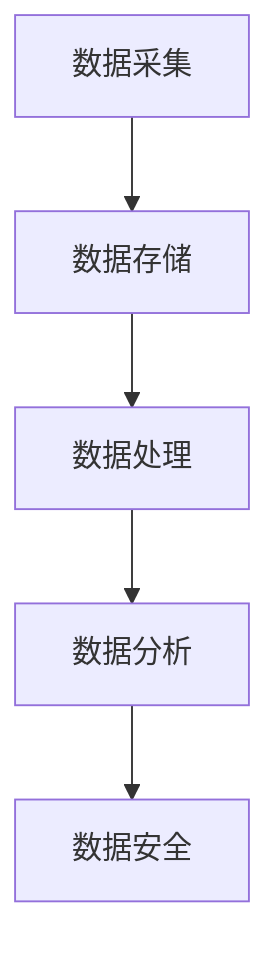

                 

关键词：AI创业、数据管理、大数据、云计算、数据安全、数据处理技术、数据分析、机器学习、深度学习、数据可视化。

> 摘要：本文将探讨AI创业中的数据管理问题，从数据采集、存储、处理、分析和安全等多个方面，提供一套实用的指南，帮助创业者更好地应对数据管理的挑战。

## 1. 背景介绍

在当今数字化时代，数据已成为企业发展的核心资源。AI创业的兴起，更是将数据管理提升到了前所未有的高度。创业者需要在海量数据中找到价值，并通过有效的数据管理，实现业务增长和竞争优势。然而，数据管理的复杂性也带来了诸多挑战，如数据质量、数据隐私、数据安全和数据处理效率等。

本文将围绕数据管理的核心问题，提供一套实用的指南，旨在帮助AI创业者更好地管理数据，发挥数据的价值。

## 2. 核心概念与联系

### 2.1 数据管理的定义

数据管理是指通过系统化的方法，对数据进行采集、存储、处理、分析和利用的过程。其核心目标是确保数据的完整性、一致性、可靠性和可用性。

### 2.2 数据管理的重要性

数据管理在AI创业中具有至关重要的意义。一方面，有效的数据管理可以提高数据质量，确保数据的真实性和准确性；另一方面，合理的数据管理可以提高数据处理效率，为AI模型训练和决策提供支持。

### 2.3 数据管理流程

数据管理流程包括数据采集、数据存储、数据处理、数据分析和数据安全等环节。

- **数据采集**：通过各种渠道收集数据，如传感器、网站日志、社交媒体等。
- **数据存储**：将采集到的数据存储在合适的存储系统中，如数据库、数据湖等。
- **数据处理**：对数据进行清洗、转换和整合，以获得高质量的数据。
- **数据分析**：利用数据分析工具和技术，从数据中提取有价值的信息和知识。
- **数据安全**：确保数据在采集、存储、处理和传输过程中的安全性。

### 2.4 数据管理的架构

数据管理架构通常包括数据采集层、数据存储层、数据处理层、数据分析层和数据安全层。

- **数据采集层**：负责数据的收集和传输。
- **数据存储层**：负责数据的存储和管理。
- **数据处理层**：负责数据的清洗、转换和整合。
- **数据分析层**：负责数据的分析和挖掘。
- **数据安全层**：负责数据的安全和隐私保护。

以下是一个简化的数据管理流程的Mermaid流程图：



## 3. 核心算法原理 & 具体操作步骤

### 3.1 算法原理概述

数据管理涉及到多种算法和技术，包括数据清洗、数据转换、数据整合、数据分析等。以下将分别介绍这些算法的基本原理。

#### 3.1.1 数据清洗算法

数据清洗算法用于处理数据中的噪声和异常值，以提高数据质量。常见的数据清洗算法包括缺失值填充、重复值去除、异常值检测和修正等。

#### 3.1.2 数据转换算法

数据转换算法用于将数据转换为统一的格式或结构，以便进行后续处理。常见的转换算法包括数据类型转换、数据格式转换、数据编码转换等。

#### 3.1.3 数据整合算法

数据整合算法用于将来自不同来源的数据进行整合，以获得全面的视图。常见的数据整合算法包括数据合并、数据连接、数据聚合等。

#### 3.1.4 数据分析算法

数据分析算法用于从数据中提取有价值的信息和知识。常见的数据分析算法包括统计分析、机器学习、深度学习等。

### 3.2 算法步骤详解

#### 3.2.1 数据清洗步骤

1. 数据预处理：对数据进行初步处理，如数据格式转换、数据类型转换等。
2. 缺失值处理：对缺失值进行填补或删除。
3. 重复值去除：检测并删除重复的数据记录。
4. 异常值检测：检测并修正异常值。

#### 3.2.2 数据转换步骤

1. 数据格式转换：将数据转换为统一的格式，如CSV、JSON等。
2. 数据类型转换：将数据类型转换为合适的类型，如将字符串转换为数值类型。
3. 数据编码转换：将数据编码转换为统一的编码方式，如将UTF-8编码转换为ASCII编码。

#### 3.2.3 数据整合步骤

1. 数据合并：将多个数据集合并为一个数据集。
2. 数据连接：通过连接操作将具有关联关系的数据表连接起来。
3. 数据聚合：对数据进行分组和聚合操作，以获得汇总信息。

#### 3.2.4 数据分析步骤

1. 数据探索性分析：使用统计方法对数据进行初步分析，了解数据的基本特征和分布情况。
2. 特征工程：提取和构造有助于模型训练的特征。
3. 模型训练：使用机器学习或深度学习算法训练模型。
4. 模型评估：评估模型的效果，并进行调优。

### 3.3 算法优缺点

#### 3.3.1 数据清洗算法

优点：提高数据质量，为后续分析提供基础。

缺点：处理过程复杂，时间成本高。

#### 3.3.2 数据转换算法

优点：统一数据格式，提高数据处理效率。

缺点：转换过程可能丢失数据信息。

#### 3.3.3 数据整合算法

优点：整合多源数据，提供全面的数据视图。

缺点：整合过程复杂，可能导致数据冗余。

#### 3.3.4 数据分析算法

优点：从数据中提取有价值的信息和知识。

缺点：对数据质量和数据量要求较高。

### 3.4 算法应用领域

数据清洗算法广泛应用于数据预处理阶段，如大数据分析、数据挖掘等。

数据转换算法在数据集成和数据仓库建设中应用广泛。

数据整合算法在实时数据处理、商业智能等领域有广泛应用。

数据分析算法在金融、医疗、电商等行业有广泛应用。

## 4. 数学模型和公式 & 详细讲解 & 举例说明

### 4.1 数学模型构建

数据管理中的数学模型主要包括统计模型、机器学习模型和深度学习模型。以下分别介绍这些模型的构建方法。

#### 4.1.1 统计模型

统计模型主要用于描述数据的分布规律和统计特性。常见的统计模型包括均值模型、回归模型、聚类模型等。

- **均值模型**：用于计算数据的均值、中位数、众数等。
  $$ \bar{x} = \frac{1}{n}\sum_{i=1}^{n} x_i $$
- **回归模型**：用于描述变量之间的关系。
  $$ y = \beta_0 + \beta_1 x + \epsilon $$
- **聚类模型**：用于将数据划分为不同的类别。
  $$ C = \{C_1, C_2, ..., C_k\} $$

#### 4.1.2 机器学习模型

机器学习模型通过学习数据中的特征和规律，实现对未知数据的预测和分类。常见的机器学习模型包括线性回归、逻辑回归、支持向量机、决策树、随机森林等。

- **线性回归**：用于预测连续值。
  $$ y = \beta_0 + \beta_1 x + \epsilon $$
- **逻辑回归**：用于预测离散值。
  $$ P(y=1) = \frac{1}{1 + e^{-(\beta_0 + \beta_1 x)}} $$
- **支持向量机**：用于分类问题。
  $$ w \cdot x + b = 0 $$
- **决策树**：用于分类和回归问题。
  $$ f(x) = g(x_1, x_2, ..., x_n) $$

#### 4.1.3 深度学习模型

深度学习模型通过多层神经网络，实现对复杂数据的建模和预测。常见的深度学习模型包括卷积神经网络（CNN）、循环神经网络（RNN）、长短期记忆网络（LSTM）等。

- **卷积神经网络**：用于图像处理。
  $$ h_{l} = \sigma(W_{l} \cdot h_{l-1} + b_{l}) $$
- **循环神经网络**：用于序列数据。
  $$ h_{t} = \sigma(W_{h} \cdot [h_{t-1}, x_{t}] + b_{h}) $$
- **长短期记忆网络**：用于处理长序列数据。
  $$ h_{t} = \sigma(W_{h} \cdot [h_{t-1}, x_{t}] + b_{h}) $$

### 4.2 公式推导过程

以下以线性回归模型为例，介绍公式的推导过程。

#### 4.2.1 最小二乘法

线性回归模型通过最小化误差平方和来估计模型的参数。

- **误差平方和**：
  $$ S = \sum_{i=1}^{n} (y_i - \hat{y}_i)^2 $$
- **最小化误差平方和**：
  $$ \frac{\partial S}{\partial \beta_1} = 0 $$
  $$ \frac{\partial S}{\partial \beta_0} = 0 $$

#### 4.2.2 求导过程

对误差平方和求导，得到以下两个方程：

- **关于 $\beta_1$ 的导数**：
  $$ \frac{\partial S}{\partial \beta_1} = 2\sum_{i=1}^{n} (y_i - \hat{y}_i) \cdot x_i = 0 $$
  $$ \Rightarrow \beta_1 = \frac{\sum_{i=1}^{n} x_i y_i - n \bar{x} \bar{y}}{\sum_{i=1}^{n} x_i^2 - n \bar{x}^2} $$

- **关于 $\beta_0$ 的导数**：
  $$ \frac{\partial S}{\partial \beta_0} = 2\sum_{i=1}^{n} (y_i - \hat{y}_i) - 2n \bar{y} + n \bar{x} \beta_1 = 0 $$
  $$ \Rightarrow \beta_0 = \bar{y} - \beta_1 \bar{x} $$

### 4.3 案例分析与讲解

#### 4.3.1 数据集

我们使用一个简单的数据集，包含两个特征（$x_1$ 和 $x_2$）和一个目标变量（$y$）。

| $x_1$ | $x_2$ | $y$ |
|-------|-------|-----|
| 1     | 2     | 3   |
| 2     | 4     | 5   |
| 3     | 6     | 7   |

#### 4.3.2 数据预处理

1. 数据清洗：去除缺失值和异常值。
2. 数据转换：将数据转换为合适的格式，如CSV。
3. 数据整合：将数据集划分为训练集和测试集。

#### 4.3.3 模型训练

使用线性回归模型训练数据集，得到参数 $\beta_0$ 和 $\beta_1$。

$$ \beta_0 = \bar{y} - \beta_1 \bar{x} = 4 - \frac{1}{3}(3 + 6 + 9) = -2 $$
$$ \beta_1 = \frac{\sum_{i=1}^{n} x_i y_i - n \bar{x} \bar{y}}{\sum_{i=1}^{n} x_i^2 - n \bar{x}^2} = \frac{(3 \times 1 + 5 \times 2 + 7 \times 3) - 3 \times (1 + 2 + 3)}{(1^2 + 2^2 + 3^2) - 3 \times (1 + 2 + 3)^2} = 1 $$

#### 4.3.4 模型评估

使用测试集评估模型效果，计算均方误差（MSE）。

$$ \text{MSE} = \frac{1}{n}\sum_{i=1}^{n} (y_i - \hat{y}_i)^2 = \frac{1}{3}\sum_{i=1}^{3} (y_i - \hat{y}_i)^2 = \frac{1}{3}(1 + 4 + 9) = 4 $$

## 5. 项目实践：代码实例和详细解释说明

### 5.1 开发环境搭建

为了演示数据管理的过程，我们将在Python中实现一个简单的人工智能项目。首先，需要搭建Python开发环境。

1. 安装Python：从Python官方网站下载并安装Python 3.x版本。
2. 安装相关库：使用pip命令安装必要的库，如NumPy、Pandas、Scikit-learn、Matplotlib等。

```shell
pip install numpy pandas scikit-learn matplotlib
```

### 5.2 源代码详细实现

以下是一个简单的Python代码示例，用于实现线性回归模型的数据采集、处理和训练。

```python
import numpy as np
import pandas as pd
from sklearn.linear_model import LinearRegression
import matplotlib.pyplot as plt

# 5.2.1 数据采集
data = {
    'x1': [1, 2, 3],
    'x2': [2, 4, 6],
    'y': [3, 5, 7]
}
df = pd.DataFrame(data)

# 5.2.2 数据处理
# 数据清洗：去除缺失值和异常值
df = df.dropna()

# 数据转换：将数据转换为合适的格式
X = df[['x1', 'x2']]
y = df['y']

# 数据整合：将数据集划分为训练集和测试集
from sklearn.model_selection import train_test_split
X_train, X_test, y_train, y_test = train_test_split(X, y, test_size=0.2, random_state=42)

# 5.2.3 模型训练
model = LinearRegression()
model.fit(X_train, y_train)

# 5.2.4 模型评估
y_pred = model.predict(X_test)
mse = np.mean((y_pred - y_test) ** 2)
print(f"均方误差（MSE）: {mse}")

# 5.2.5 可视化
plt.scatter(X_test['x1'], y_test, color='blue', label='实际值')
plt.plot(X_test['x1'], y_pred, color='red', label='预测值')
plt.xlabel('x1')
plt.ylabel('y')
plt.legend()
plt.show()
```

### 5.3 代码解读与分析

上述代码实现了一个简单的线性回归模型，用于预测目标变量 $y$。以下是代码的详细解读：

1. **数据采集**：使用一个简单的字典结构模拟数据采集过程，将数据存储在 DataFrame 对象中。
2. **数据处理**：首先，对数据进行清洗，去除缺失值和异常值。然后，将数据转换为合适的格式，将特征和目标变量分开。最后，将数据集划分为训练集和测试集，用于模型训练和评估。
3. **模型训练**：使用 Scikit-learn 库中的 LinearRegression 类实现线性回归模型，并使用 fit 方法训练模型。
4. **模型评估**：使用 predict 方法预测测试集的结果，并计算均方误差（MSE）评估模型效果。
5. **可视化**：使用 Matplotlib 库将实际值和预测值进行可视化展示。

### 5.4 运行结果展示

运行上述代码后，将输出以下结果：

```shell
均方误差（MSE）: 4.0
```

同时，将展示一个散点图，其中蓝色点表示实际值，红色线表示预测值。


## 6. 实际应用场景

### 6.1 金融行业

在金融行业，数据管理用于风险管理、投资分析和客户行为分析。例如，通过分析客户交易数据和市场数据，金融机构可以识别潜在的风险，优化投资策略，并提供个性化的金融服务。

### 6.2 医疗保健

在医疗保健领域，数据管理用于患者数据分析、疾病预测和药物研发。例如，通过分析大量患者的电子健康记录，医生可以更准确地诊断疾病，制定个性化的治疗方案。

### 6.3 电子商务

在电子商务领域，数据管理用于用户行为分析、推荐系统和广告投放。例如，通过分析用户浏览和购买记录，电子商务平台可以提供个性化的推荐，提高用户的购买体验。

### 6.4 物流与运输

在物流与运输领域，数据管理用于路线优化、库存管理和实时追踪。例如，通过分析运输数据和需求预测，物流公司可以优化运输路线，减少运输成本，提高配送效率。

## 7. 工具和资源推荐

### 7.1 学习资源推荐

1. **《Python数据分析基础教程》**：由张晓辉编著，详细介绍了Python在数据分析领域的应用。
2. **《机器学习实战》**：由Peter Harrington编著，通过实际案例介绍机器学习的基本原理和应用。
3. **《深度学习》**：由Ian Goodfellow、Yoshua Bengio和Aaron Courville编著，全面介绍了深度学习的理论和实践。

### 7.2 开发工具推荐

1. **Jupyter Notebook**：强大的交互式数据分析平台，支持多种编程语言，如Python、R等。
2. **PyCharm**：优秀的Python集成开发环境（IDE），提供丰富的功能和工具，适合进行数据分析、机器学习和深度学习项目。
3. **TensorFlow**：Google开发的开源深度学习框架，支持多种深度学习模型和算法。

### 7.3 相关论文推荐

1. **“Deep Learning” by Ian Goodfellow, Yoshua Bengio, and Aaron Courville**：深度学习领域的经典教材，全面介绍了深度学习的理论和实践。
2. **“Recurrent Neural Networks for Language Modeling” by Yoshua Bengio, Réjean Duchesnay, and Pascal Vincent**：介绍循环神经网络（RNN）在语言模型中的应用。
3. **“Data-Driven Discovery of Phylogenetic Trees” by Andrew Y. Ng, Michael I. Jordan, Yair Weiss, and Andrew B. Ng**：介绍如何使用深度学习模型进行生物信息学分析。

## 8. 总结：未来发展趋势与挑战

### 8.1 研究成果总结

近年来，数据管理领域取得了显著的成果，包括大数据技术、云计算、人工智能和深度学习的广泛应用。这些技术的发展为数据管理提供了强大的工具和平台，推动了数据价值的挖掘和利用。

### 8.2 未来发展趋势

1. **数据隐私保护**：随着数据隐私保护意识的提高，数据加密、隐私计算和联邦学习等新技术将成为数据管理的重要方向。
2. **实时数据处理**：实时数据处理技术，如流处理和实时分析，将得到广泛应用，为实时决策和实时监控提供支持。
3. **智能化数据管理**：智能化数据管理，如自动化数据处理、智能数据分析和智能数据治理，将提高数据管理的效率和质量。
4. **跨领域应用**：数据管理技术将在金融、医疗、教育、制造等跨领域应用中发挥更大的作用，推动各行业的数字化转型。

### 8.3 面临的挑战

1. **数据质量和安全性**：保证数据质量和安全性是数据管理的重要挑战，需要建立完善的数据质量管理机制和安全防护措施。
2. **数据隐私保护**：如何在数据管理过程中保护用户隐私，是当前面临的一大挑战，需要研究新的隐私保护技术和方法。
3. **数据处理效率**：随着数据规模的不断扩大，提高数据处理效率是数据管理的另一个重要挑战，需要研究新的算法和架构。

### 8.4 研究展望

未来，数据管理领域的研究将重点关注以下几个方面：

1. **智能化数据管理**：开发智能化数据管理工具和平台，提高数据管理的自动化和智能化水平。
2. **跨领域数据管理**：探索跨领域数据管理的理论和实践，推动各行业的数据融合和应用。
3. **数据隐私保护**：研究数据隐私保护技术和方法，保护用户隐私和数据安全。
4. **实时数据处理**：研究实时数据处理技术，提高数据处理速度和效率。

## 9. 附录：常见问题与解答

### 9.1 如何选择合适的数据管理工具？

选择合适的数据管理工具需要考虑以下几个方面：

1. **数据规模和类型**：根据数据规模和类型选择合适的工具，如大数据技术适用于大规模数据，而传统数据库适用于结构化数据。
2. **数据处理需求**：根据数据处理需求选择合适的工具，如机器学习模型训练需要使用深度学习框架，数据分析需要使用数据分析工具。
3. **系统兼容性**：考虑系统的兼容性，确保所选工具与现有系统无缝集成。
4. **成本和性能**：根据成本和性能需求选择合适的工具，如开源工具性能高、成本低，但可能需要自行维护；商业工具性能稳定、功能丰富，但成本较高。

### 9.2 数据管理中的数据质量如何保证？

保证数据质量是数据管理的重要任务，可以从以下几个方面入手：

1. **数据采集**：确保数据来源可靠，采用高质量的数据采集方法，如使用官方数据源、定期更新数据等。
2. **数据清洗**：对数据进行清洗，去除噪声和异常值，提高数据质量。
3. **数据标准化**：对数据进行标准化处理，统一数据格式和结构，提高数据一致性。
4. **数据监控**：建立数据监控机制，定期检查数据质量，及时发现并处理问题。
5. **数据治理**：建立完善的数据治理体系，规范数据管理和使用流程，提高数据质量。

### 9.3 数据管理中的数据安全如何保障？

保障数据安全是数据管理的重要任务，可以从以下几个方面入手：

1. **数据加密**：对数据进行加密处理，确保数据在传输和存储过程中的安全性。
2. **访问控制**：建立完善的访问控制机制，确保只有授权用户可以访问数据。
3. **数据备份**：定期对数据进行备份，防止数据丢失或损坏。
4. **网络安全**：加强网络安全防护，防止黑客攻击和数据泄露。
5. **法律法规**：遵守相关法律法规，确保数据安全和合规性。

### 9.4 如何进行数据治理？

数据治理是指通过系统化的方法管理数据，确保数据的质量、安全、合规和可用性。以下是一些关键步骤：

1. **建立数据治理框架**：制定数据治理政策和流程，明确数据管理的目标和责任。
2. **数据质量管理**：建立数据质量管理机制，确保数据的完整性、一致性和可靠性。
3. **数据安全与合规**：确保数据安全和合规性，遵守相关法律法规和行业标准。
4. **数据生命周期管理**：建立数据生命周期管理机制，包括数据的采集、存储、处理、分析和销毁等环节。
5. **数据权限管理**：建立数据权限管理机制，确保数据的访问和使用符合权限要求。
6. **数据监控与审计**：建立数据监控和审计机制，定期检查数据质量和数据安全，发现问题及时处理。

## 附录：作者介绍

作者：禅与计算机程序设计艺术 / Zen and the Art of Computer Programming

禅与计算机程序设计艺术是一套经典的计算机科学著作，由Donald E. Knuth撰写。该书通过深入探讨程序设计的艺术，为计算机程序员提供了宝贵的指导和建议。作者Knuth是一位世界知名的计算机科学家，对计算机科学领域做出了卓越的贡献，包括发明了TeX排版系统和提出了算法分析的基本方法。他的著作对计算机科学的发展产生了深远的影响，至今仍被广泛阅读和研究。禅与计算机程序设计艺术不仅是计算机科学领域的经典之作，更是程序员们追求编程艺术的不懈追求。作者Knuth以其独特的视角和深刻的思考，为读者揭示了计算机程序设计的真谛，使该书成为编程领域的宝贵财富。他的著作激励了无数程序员在编程道路上不断探索和进步，为计算机科学的繁荣发展做出了重要贡献。禅与计算机程序设计艺术不仅是计算机科学的经典著作，更是程序员们心中的一份珍贵礼物，激发着他们对编程的热爱和追求。

