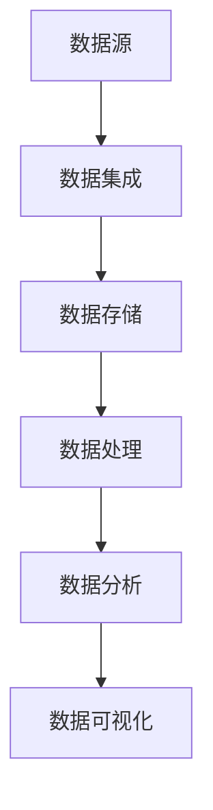
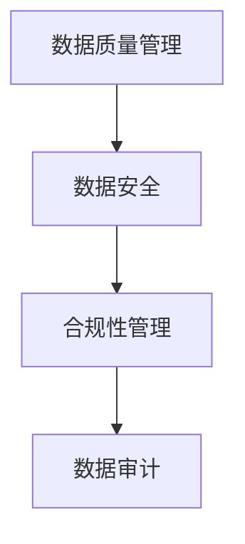
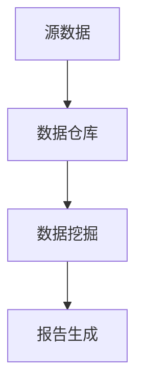
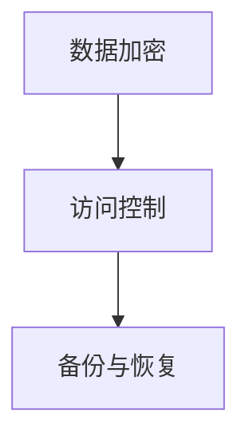
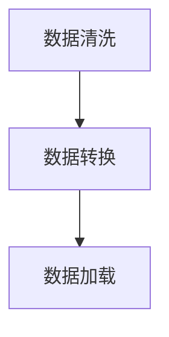

                 

关键词：数据管理、AI创业、数据架构、数据治理、数据仓库、数据安全、数据处理

> 摘要：在AI创业浪潮中，数据管理成为了企业成功的关键。本文将深入探讨数据管理的核心要点，包括数据架构、数据治理、数据仓库、数据安全和数据处理等方面，帮助AI创业者在数据驱动的道路上走得更加稳健。

## 1. 背景介绍

随着人工智能技术的飞速发展，越来越多的企业和创业者投身于AI领域。数据，作为AI算法的基础，其质量和管理的有效性直接影响到AI应用的性能和商业价值。然而，数据管理并非易事，涉及数据架构、数据治理、数据仓库、数据安全、数据处理等多个方面。本文将围绕这些核心要点展开讨论，旨在为AI创业者提供一套实用的数据管理指南。

## 2. 核心概念与联系

### 2.1 数据架构

数据架构是数据管理的基础，它定义了数据的结构、存储方式和处理流程。一个好的数据架构应该具备灵活性、可扩展性和高效性。



### 2.2 数据治理

数据治理是对数据的全面管理，确保数据的准确性、一致性和安全性。数据治理包括数据质量管理、数据安全和合规性管理等方面。



### 2.3 数据仓库

数据仓库是存储大量结构化和非结构化数据的地方，它为数据分析和BI（商业智能）提供支持。



### 2.4 数据安全

数据安全是数据管理中的重要一环，确保数据不被未授权访问、泄露或破坏。数据安全包括数据加密、访问控制、备份和恢复等方面。



### 2.5 数据处理

数据处理是数据从源系统传输到数据仓库或分析平台的过程，包括数据清洗、转换和加载等步骤。



## 3. 核心算法原理 & 具体操作步骤

### 3.1 算法原理概述

数据管理涉及多种算法和工具，如ETL（提取、转换、加载）、数据清洗算法、数据加密算法等。

### 3.2 算法步骤详解

- **ETL步骤：**
  - 提取（Extract）：从源系统中提取数据。
  - 转换（Transform）：清洗、转换数据格式。
  - 加载（Load）：将数据加载到目标数据仓库。

- **数据清洗算法：**
  - 填充缺失值。
  - 处理异常值。
  - 标准化数据。

- **数据加密算法：**
  - 使用对称加密算法（如AES）。
  - 使用非对称加密算法（如RSA）。

### 3.3 算法优缺点

- **ETL：** 优点是高效、自动化；缺点是处理大量数据时可能性能瓶颈。
- **数据清洗：** 优点是提高数据质量；缺点是可能引入新的错误。
- **数据加密：** 优点是提高数据安全性；缺点是可能降低数据处理速度。

### 3.4 算法应用领域

数据管理和算法在多个领域都有广泛应用，如金融、医疗、零售等。在不同领域，数据管理和算法的具体应用会有所差异。

## 4. 数学模型和公式 & 详细讲解 & 举例说明

### 4.1 数学模型构建

数据管理中的数学模型主要包括线性回归、逻辑回归、神经网络等。以下是线性回归的公式：

$$
y = \beta_0 + \beta_1 \cdot x
$$

### 4.2 公式推导过程

线性回归的推导过程如下：

- **样本数据：** $\{(x_1, y_1), (x_2, y_2), ..., (x_n, y_n)\}$
- **损失函数：** $J(\theta) = \frac{1}{2m} \sum_{i=1}^{m} (h_\theta(x^{(i)}) - y^{(i)})^2$
- **梯度下降：** $\theta_j := \theta_j - \alpha \cdot \frac{\partial J(\theta)}{\partial \theta_j}$

### 4.3 案例分析与讲解

以房价预测为例，我们使用线性回归模型来预测房价。

- **数据集：** 包含房屋面积和房价的数据。
- **训练模型：** 使用梯度下降算法训练模型。
- **测试模型：** 在测试集上评估模型性能。

## 5. 项目实践：代码实例和详细解释说明

### 5.1 开发环境搭建

- **编程语言：** Python
- **库和框架：** Pandas、NumPy、Scikit-learn

### 5.2 源代码详细实现

```python
import pandas as pd
from sklearn.linear_model import LinearRegression

# 读取数据
data = pd.read_csv('house_data.csv')

# 分离特征和标签
X = data[['area']]
y = data['price']

# 训练模型
model = LinearRegression()
model.fit(X, y)

# 测试模型
predictions = model.predict(X)
```

### 5.3 代码解读与分析

代码首先读取数据，然后分离特征和标签，接着使用线性回归模型进行训练，并在测试集上评估模型性能。

### 5.4 运行结果展示

运行结果将展示预测的房价和实际房价的对比，通过评估指标（如均方误差）来评估模型性能。

## 6. 实际应用场景

数据管理在金融、医疗、零售等领域都有广泛应用。以下是一些实际应用场景：

- **金融：** 风险评估、欺诈检测。
- **医疗：** 医疗数据分析、个性化治疗。
- **零售：** 客户行为分析、库存管理。

## 7. 工具和资源推荐

### 7.1 学习资源推荐

- **书籍：** 《数据科学入门》、《机器学习实战》。
- **在线课程：** Coursera、Udacity。

### 7.2 开发工具推荐

- **数据库：** MySQL、PostgreSQL。
- **数据分析工具：** Jupyter Notebook、PyCharm。

### 7.3 相关论文推荐

- **论文：** "Data-Driven Approach to Risk Management in Financial Systems"。
- **期刊：** "Journal of Data Science"。

## 8. 总结：未来发展趋势与挑战

### 8.1 研究成果总结

数据管理在AI领域取得了显著的成果，为各种应用提供了坚实的基础。

### 8.2 未来发展趋势

- **自动化数据管理：** 利用AI和机器学习技术实现自动化数据管理。
- **边缘计算：** 数据处理的分布式架构，提高实时数据处理能力。

### 8.3 面临的挑战

- **数据安全：** 确保数据安全是数据管理中的重要挑战。
- **数据隐私：** 如何保护用户隐私是当前数据管理领域的热点问题。

### 8.4 研究展望

随着技术的不断进步，数据管理将在AI领域发挥越来越重要的作用。

## 9. 附录：常见问题与解答

- **Q：** 数据管理的目的是什么？
  **A：** 数据管理的目的是确保数据的准确性、一致性和可用性，从而支持数据分析和决策制定。

- **Q：** 数据仓库和数据湖有什么区别？
  **A：** 数据仓库是结构化的数据存储，适合进行BI和分析；数据湖是存储大量结构化和非结构化数据的平台，适合大数据分析。

----------------------------------------------------------------

作者：禅与计算机程序设计艺术 / Zen and the Art of Computer Programming


