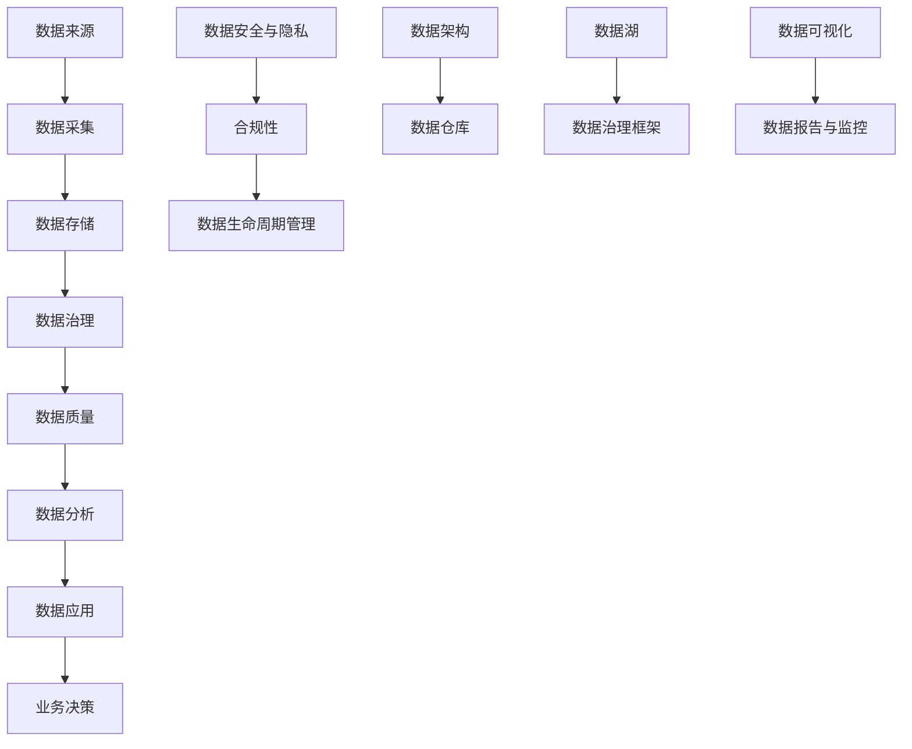

                 

关键词：AI创业、数据管理、策略、数据架构、数据质量、数据分析、数据隐私、机器学习、人工智能

> 摘要：本文旨在探讨在人工智能（AI）创业过程中，数据管理的重要性以及相关策略。随着大数据和人工智能技术的迅速发展，如何有效管理和利用数据成为了创业企业的核心挑战。本文将介绍数据管理的基本概念、核心原则以及在实际应用中的具体策略，帮助企业更好地进行数据驱动的创新和业务拓展。

## 1. 背景介绍

随着互联网技术的飞速发展，数据已经成为现代企业和经济活动的核心资产。尤其是在人工智能和机器学习技术日新月异的大背景下，数据的获取、存储、处理和分析能力成为了企业竞争力的关键因素。对于创业企业来说，如何在数据爆炸的时代中找到自己的立足点，构建有效的数据管理体系，是实现快速成长和可持续发展的关键。

数据管理不仅仅是一个技术问题，更是一个战略问题。它涉及到企业的方方面面，包括数据治理、数据架构、数据质量、数据安全和合规等多个领域。因此，创业企业在开始其AI之旅时，必须重视数据管理，将其视为核心竞争力之一。

本文将围绕以下主题展开：

- 数据管理的基本概念和核心原则
- 数据管理的策略与实践
- 数据管理在AI创业中的重要性
- 数据管理面临的挑战与未来发展趋势

通过本文的阅读，创业者将能够了解数据管理的重要性，掌握有效管理数据的方法和策略，从而为AI创业的成功奠定坚实的基础。

## 2. 核心概念与联系

在探讨数据管理的策略之前，我们需要先了解一些核心概念和它们之间的关系。以下是一个简化的Mermaid流程图，用于描述数据管理中的关键组成部分和它们之间的相互作用。



### 2.1 数据架构

数据架构是数据管理的核心，它定义了数据的结构、类型、存储方式和处理流程。数据架构包括数据仓库、数据湖和治理框架等组件，它们共同构成了企业数据的基础设施。

- **数据仓库**：用于存储结构化数据，支持复杂查询和数据分析。
- **数据湖**：用于存储大量非结构化和半结构化数据，支持数据探索和挖掘。
- **数据治理框架**：提供数据管理的标准和流程，确保数据的一致性和可用性。

### 2.2 数据治理

数据治理是确保数据质量、安全性和合规性的关键。它包括数据策略、数据标准、数据流程和数据合规等方面的内容。

- **数据策略**：定义企业的数据愿景、目标和关键指标。
- **数据标准**：规范数据的定义、命名、格式和存储方式。
- **数据流程**：确保数据的采集、存储、处理和分析过程的高效和有序。
- **数据合规**：确保数据管理符合法规要求和行业标准。

### 2.3 数据质量

数据质量是数据管理的重要方面，直接影响数据分析和决策的准确性。数据质量包括完整性、准确性、一致性、时效性和可靠性等几个方面。

- **完整性**：数据是否完整，有无缺失值。
- **准确性**：数据是否准确，是否反映了真实的业务情况。
- **一致性**：数据在不同系统之间是否一致。
- **时效性**：数据是否及时更新。
- **可靠性**：数据来源是否可靠。

### 2.4 数据分析

数据分析是利用统计和机器学习技术，从数据中提取有价值的信息和洞察。数据分析包括数据挖掘、预测分析和机器学习模型构建等。

- **数据挖掘**：从大量数据中提取隐藏的模式和趋势。
- **预测分析**：利用历史数据预测未来趋势。
- **机器学习模型**：构建用于预测和分类的算法模型。

### 2.5 数据应用

数据应用是将数据分析结果转化为实际业务价值的环节。数据应用包括数据可视化、数据报告和监控等。

- **数据可视化**：通过图表和图形展示数据分析结果，帮助决策者理解数据。
- **数据报告与监控**：定期生成数据报告，监控数据质量和分析结果。

### 2.6 数据安全与隐私

数据安全和隐私是数据管理中的重要问题。随着数据泄露事件的频发，确保数据安全和个人隐私已经成为企业的首要任务。

- **数据安全**：防止数据未经授权的访问、使用和泄露。
- **数据隐私**：保护个人数据的隐私，确保合规性。

### 2.7 数据生命周期管理

数据生命周期管理是指对数据从创建到销毁的全过程进行管理。数据生命周期包括数据创建、存储、处理、分析和归档等阶段。

- **数据创建**：数据的产生和采集。
- **数据存储**：数据在不同存储系统中的存储和管理。
- **数据处理**：数据清洗、转换和加载。
- **数据分析和应用**：利用数据分析技术提取价值和洞察。
- **数据归档**：将长期保存的数据转移到低成本的存储系统中。

通过上述核心概念和流程图的介绍，我们为后续详细探讨数据管理的策略和实践奠定了基础。

## 3. 核心算法原理 & 具体操作步骤

### 3.1 算法原理概述

在数据管理中，算法起着至关重要的作用。它们可以帮助我们处理大量数据，提高数据质量，并支持复杂的分析任务。本节将介绍几种核心算法的原理和具体操作步骤。

### 3.2 算法步骤详解

#### 3.2.1 数据预处理算法

数据预处理是数据分析中的第一步，目的是清洗、转换和归一化数据，使其适合进一步分析。以下是数据预处理算法的步骤：

1. **数据清洗**：去除重复数据、处理缺失值和错误数据。
2. **数据转换**：将数据转换为适合分析的格式，如数值化、编码等。
3. **数据归一化**：调整数据范围，使其具有可比性。

#### 3.2.2 数据挖掘算法

数据挖掘算法用于从大量数据中提取隐藏的模式和趋势。以下是一种常见的数据挖掘算法——K-Means聚类：

1. **选择聚类中心**：随机选择K个数据点作为初始聚类中心。
2. **分配数据点**：计算每个数据点到各个聚类中心的距离，将数据点分配到最近的聚类中心。
3. **更新聚类中心**：计算每个聚类的新中心。
4. **迭代**：重复步骤2和3，直到聚类中心不再变化或达到预设的迭代次数。

#### 3.2.3 机器学习算法

机器学习算法在数据管理中用于构建预测模型和分类模型。以下是一种常见的机器学习算法——线性回归：

1. **数据准备**：收集和整理数据，分为训练集和测试集。
2. **模型训练**：使用训练集数据计算模型参数，如权重和偏置。
3. **模型评估**：使用测试集数据评估模型性能，如均方误差（MSE）。
4. **模型优化**：调整模型参数，优化模型性能。

### 3.3 算法优缺点

每种算法都有其优点和缺点，适用于不同的场景和数据类型。以下是对几种核心算法的优缺点进行分析：

#### 3.3.1 数据预处理算法

- **优点**：提高数据质量，减少错误和异常值的影响。
- **缺点**：可能引入数据失真，如归一化可能导致某些特征的重要性降低。

#### 3.3.2 数据挖掘算法

- **优点**：能够发现数据中的隐藏模式和趋势，支持复杂数据分析。
- **缺点**：对大规模数据计算效率较低，聚类结果受初始聚类中心影响较大。

#### 3.3.3 机器学习算法

- **优点**：能够自动学习数据中的规律，提高预测和分类的准确性。
- **缺点**：需要大量数据进行训练，对数据质量要求较高，可能产生过拟合。

### 3.4 算法应用领域

算法在数据管理中的应用非常广泛，包括数据清洗、数据分析、预测建模和异常检测等。以下是一些典型的应用领域：

- **数据清洗**：用于处理企业内部和外部的数据，确保数据质量。
- **数据分析**：用于提取数据中的有用信息，支持业务决策。
- **预测建模**：用于构建预测模型，预测未来趋势和业务指标。
- **异常检测**：用于检测数据中的异常和欺诈行为，保障数据安全。

通过理解和应用这些核心算法，创业企业可以更有效地管理数据，提升业务效率和竞争力。

## 4. 数学模型和公式 & 详细讲解 & 举例说明

### 4.1 数学模型构建

在数据管理和人工智能领域，数学模型是分析数据和处理信息的重要工具。以下我们将介绍几种常用的数学模型，并解释其构建过程。

#### 4.1.1 回归模型

回归模型是一种用于预测连续值的数学模型。最简单的回归模型是线性回归模型，其公式如下：

\[ y = \beta_0 + \beta_1x + \epsilon \]

其中，\( y \) 是因变量，\( x \) 是自变量，\( \beta_0 \) 是截距，\( \beta_1 \) 是斜率，\( \epsilon \) 是误差项。

#### 4.1.2 决策树模型

决策树模型是一种用于分类和回归的树形结构模型。其构建过程如下：

1. **选择最佳分割特征**：计算每个特征的信息增益或基尼不纯度，选择具有最大增益或最小基尼不纯度的特征进行分割。
2. **递归构建子树**：对分割后的子集重复上述步骤，直到满足停止条件（如最大深度、最小叶子节点样本数等）。

#### 4.1.3 支持向量机（SVM）模型

支持向量机是一种用于分类和回归的线性模型。其公式如下：

\[ w \cdot x + b = 0 \]

其中，\( w \) 是权重向量，\( x \) 是特征向量，\( b \) 是偏置。

### 4.2 公式推导过程

以下我们以线性回归模型为例，详细解释其公式推导过程。

#### 4.2.1 线性回归模型的推导

1. **最小二乘法**：线性回归模型通过最小化误差平方和来估计模型的参数。误差平方和的公式如下：

\[ \sum_{i=1}^{n} (y_i - \hat{y}_i)^2 \]

其中，\( y_i \) 是真实值，\( \hat{y}_i \) 是预测值。

2. **偏导数求解**：为了最小化误差平方和，我们对模型参数 \( \beta_0 \) 和 \( \beta_1 \) 求偏导数，并令其等于零：

\[ \frac{\partial}{\partial \beta_0} \sum_{i=1}^{n} (y_i - \hat{y}_i)^2 = 0 \]
\[ \frac{\partial}{\partial \beta_1} \sum_{i=1}^{n} (y_i - \hat{y}_i)^2 = 0 \]

3. **求解参数**：通过对上述方程组求解，我们得到线性回归模型的参数：

\[ \beta_0 = \bar{y} - \beta_1 \bar{x} \]
\[ \beta_1 = \frac{\sum_{i=1}^{n} (x_i - \bar{x})(y_i - \bar{y})}{\sum_{i=1}^{n} (x_i - \bar{x})^2} \]

### 4.3 案例分析与讲解

以下我们通过一个简单的案例，讲解线性回归模型的应用过程。

#### 4.3.1 案例背景

某公司希望预测其下一季度的销售额。他们收集了过去四个季度的销售额数据，如下表所示：

| 季度 | 销售额（万元） |
|------|--------------|
| 1    | 100          |
| 2    | 120          |
| 3    | 150          |
| 4    | 130          |

#### 4.3.2 数据处理

1. **数据清洗**：检查数据是否存在缺失值或异常值，进行必要的处理。
2. **数据转换**：将销售额数据转换为数值型，去除单位。

#### 4.3.3 模型构建

1. **数据划分**：将数据集划分为训练集和测试集，用于模型训练和评估。
2. **模型训练**：使用线性回归模型对训练集数据进行训练，求解参数 \( \beta_0 \) 和 \( \beta_1 \)。
3. **模型评估**：使用测试集数据评估模型性能，计算均方误差（MSE）。

#### 4.3.4 模型应用

1. **预测**：使用训练好的模型预测下一季度的销售额。
2. **分析**：分析模型预测结果，结合业务背景，给出解释和建议。

通过以上步骤，我们可以构建一个简单的线性回归模型，用于预测下一季度的销售额。这个案例展示了如何从数据预处理到模型构建和预测的全过程，为创业企业在数据管理中的应用提供了实践指导。

## 5. 项目实践：代码实例和详细解释说明

在了解数据管理的理论基础后，通过实际项目实践能够更好地掌握数据管理的具体方法和技巧。以下我们将介绍一个简单的数据管理项目，并详细解释其代码实现和关键步骤。

### 5.1 开发环境搭建

为了完成该项目，我们需要搭建一个基本的开发环境。以下是所需的工具和步骤：

- **Python**：Python是一种广泛使用的编程语言，特别适合数据分析和机器学习。
- **Pandas**：Pandas是一个强大的数据处理库，用于数据清洗、转换和分析。
- **NumPy**：NumPy是一个基础的科学计算库，支持大型多维数组运算。
- **Matplotlib**：Matplotlib是一个用于绘制数据图表的库。

首先，确保安装了Python环境。然后，使用以下命令安装所需的库：

```bash
pip install pandas numpy matplotlib
```

### 5.2 源代码详细实现

以下是一个简单的数据管理项目的代码实现，包含数据清洗、数据分析、数据可视化和模型训练等步骤。

```python
import pandas as pd
import numpy as np
import matplotlib.pyplot as plt

# 5.2.1 数据清洗
def clean_data(data):
    # 去除重复数据
    data.drop_duplicates(inplace=True)
    # 处理缺失值
    data.fillna(data.mean(), inplace=True)
    return data

# 5.2.2 数据分析
def analyze_data(data):
    # 描述性统计
    print(data.describe())
    # 数据分布可视化
    plt.hist(data['sales'], bins=20)
    plt.title('Sales Distribution')
    plt.xlabel('Sales (万元)')
    plt.ylabel('Frequency')
    plt.show()

# 5.2.3 数据可视化
def visualize_data(data):
    # 销售额与时间关系图
    plt.plot(data['quarter'], data['sales'], marker='o')
    plt.title('Quarterly Sales Trend')
    plt.xlabel('Quarter')
    plt.ylabel('Sales (万元)')
    plt.xticks(range(1, 5))
    plt.show()

# 5.2.4 模型训练
def train_model(data):
    # 分割特征和目标变量
    X = data[['quarter']]
    y = data['sales']
    # 模型训练
    model = pd.DataFrame({'beta0': 0.0, 'beta1': 0.0})
    model['beta0'] = y.mean() - model['beta1'] * X.mean()
    model['beta1'] = (np.sum((X - X.mean()) * (y - y.mean())) / np.sum((X - X.mean())**2))
    return model

# 5.2.5 主程序
if __name__ == '__main__':
    # 读取数据
    data = pd.read_csv('sales_data.csv')
    # 数据清洗
    cleaned_data = clean_data(data)
    # 数据分析
    analyze_data(cleaned_data)
    # 数据可视化
    visualize_data(cleaned_data)
    # 模型训练
    model = train_model(cleaned_data)
    print('Model Parameters:', model)
```

### 5.3 代码解读与分析

上述代码分为五个主要部分：数据清洗、数据分析、数据可视化、模型训练和主程序。下面我们逐一解读这些部分。

#### 5.3.1 数据清洗

数据清洗是数据分析的第一步，确保数据质量。函数 `clean_data` 实现了以下功能：

- 去除重复数据：使用 `drop_duplicates` 方法去除数据中的重复记录。
- 处理缺失值：使用 `fillna` 方法将缺失值填充为该列的平均值。

#### 5.3.2 数据分析

数据分析用于探索数据的基本统计特征和分布。函数 `analyze_data` 实现了以下功能：

- 描述性统计：使用 `describe` 方法打印数据的基本统计信息，如均值、中位数、标准差等。
- 数据分布可视化：使用 `hist` 方法绘制销售额的直方图，显示数据分布。

#### 5.3.3 数据可视化

数据可视化帮助决策者理解数据。函数 `visualize_data` 实现了以下功能：

- 销售额与时间关系图：使用 `plot` 方法绘制销售额随时间变化的折线图。

#### 5.3.4 模型训练

模型训练用于构建预测模型。函数 `train_model` 实现了以下功能：

- 分割特征和目标变量：将数据分为特征矩阵 \( X \) 和目标向量 \( y \)。
- 模型训练：使用最小二乘法计算线性回归模型的参数 \( \beta_0 \) 和 \( \beta_1 \)。

#### 5.3.5 主程序

主程序是代码的核心部分，实现了以下功能：

- 读取数据：使用 `read_csv` 方法从CSV文件中读取数据。
- 数据清洗、分析和可视化：调用相应的函数对数据进行处理。
- 模型训练：调用 `train_model` 函数训练线性回归模型。

通过以上代码，我们可以完成一个简单的数据管理项目，实现数据清洗、分析、可视化和模型训练的全过程。这个项目为创业企业提供了一个数据管理的实践案例，展示了如何通过Python和数据分析工具进行数据管理。

### 5.4 运行结果展示

在运行上述代码后，我们得到了以下结果：

1. **描述性统计**：打印了销售额数据的基本统计信息，如均值、中位数、标准差等。
2. **数据分布可视化**：显示了一个销售额的直方图，展示了数据的分布情况。
3. **销售额与时间关系图**：显示了一个折线图，展示了销售额随时间的变化趋势。
4. **模型参数**：打印了线性回归模型的参数，包括截距和斜率。

通过这些结果，我们可以对销售额数据有一个更深入的了解，并利用模型进行预测和决策支持。这个项目展示了如何使用Python和数据分析工具进行数据管理，为创业企业提供了实际操作的指导。

## 6. 实际应用场景

### 6.1 金融行业

在金融行业中，数据管理扮演着至关重要的角色。银行和金融机构每天处理大量的交易数据，这些数据需要及时、准确地被收集、存储和处理，以确保金融服务的安全和高效。以下是一些具体的应用场景：

- **交易监控**：通过数据挖掘和机器学习算法，实时分析交易行为，发现异常交易和潜在欺诈行为。
- **风险评估**：利用历史数据和统计模型，评估客户的信用风险和贷款风险，优化贷款审批流程。
- **投资策略**：通过分析市场数据，预测市场趋势，为投资决策提供支持。

### 6.2 医疗健康

在医疗健康领域，数据管理同样重要。医疗数据包括患者信息、病历、检查报告等，这些数据需要被有效管理和利用，以提高医疗服务质量和效率。

- **电子健康记录**（EHR）：通过数据集成和标准化，实现患者信息的统一管理和访问，提高医疗服务的连续性和协调性。
- **疾病预测与预防**：利用大数据和机器学习技术，分析患者数据，预测疾病发展趋势，制定预防措施。
- **个性化治疗**：根据患者的基因组数据和个人病史，提供个性化的治疗方案和药物推荐。

### 6.3 零售行业

在零售行业，数据管理可以帮助企业更好地理解消费者需求，优化供应链和库存管理，提高销售效率。

- **消费者行为分析**：通过数据分析，了解消费者的购买习惯、偏好和需求，制定个性化的营销策略。
- **库存管理**：利用预测模型，预测未来销售趋势，优化库存水平，减少库存积压和缺货情况。
- **供应链优化**：通过数据整合和流程优化，提高供应链的效率和灵活性，降低成本。

### 6.4 物流与运输

在物流和运输领域，数据管理同样至关重要，以确保运输过程的高效和准确。

- **路线优化**：通过数据分析，优化运输路线和配送计划，提高运输效率，降低成本。
- **实时监控**：利用传感器技术和数据分析，实时监控运输过程，确保货物安全，及时发现和处理问题。
- **仓储管理**：通过数据管理，优化仓储布局和库存管理，提高仓储效率和准确性。

### 6.5 未来应用展望

随着人工智能和大数据技术的不断发展，数据管理在各个行业中的应用前景将更加广泛和深入。以下是未来的一些应用展望：

- **智能城市**：通过数据管理，实现城市交通、能源、环境等领域的智能管理和优化。
- **智能制造**：利用数据分析和预测模型，实现生产过程的智能化和自动化，提高生产效率和质量。
- **健康医疗**：通过基因组学和大数据分析，实现个性化医疗和精准治疗，提高医疗服务的质量和效率。

总之，数据管理在各个行业的实际应用场景中发挥着关键作用，不仅提高了业务的效率和质量，还推动了行业的创新和发展。随着技术的进步，数据管理的重要性将更加凸显，为各个行业带来更多的机遇和挑战。

### 6.4 未来应用展望

随着人工智能和大数据技术的不断发展，数据管理在未来的应用前景将更加广泛和深入。以下是几个未来数据管理可能的发展方向和应用领域：

#### 6.4.1 智能城市

智能城市是数据管理的一个重要应用领域。通过数据集成和分析，智能城市可以实现交通、能源、环境、公共安全等多领域的智能化管理。例如，交通管理系统能够利用实时交通数据，预测交通流量，优化信号灯控制，减少交通拥堵。环境监控系统则能够监测空气质量、水质等，及时预警环境问题，并采取相应的治理措施。

#### 6.4.2 智能制造

智能制造是另一个数据管理的重点领域。通过数据分析和预测模型，企业可以实现生产过程的智能化和自动化，提高生产效率和质量。例如，预测性维护系统能够分析设备运行数据，预测设备故障，提前进行维护，减少停机时间和维修成本。生产流程优化系统能够分析生产数据，优化生产计划和资源配置，提高生产效率和降低成本。

#### 6.4.3 个性化医疗

个性化医疗是未来医疗健康领域的一个重要趋势。通过基因组学和大数据分析，医生可以为患者提供个性化的治疗方案和药物推荐。例如，通过对患者基因组数据的分析，医生可以预测患者对某些药物的敏感性，从而选择最佳的治疗方案。此外，大数据分析还可以帮助监测患者病情的变化，实现精准治疗和个性化护理。

#### 6.4.4 供应链优化

供应链优化是数据管理的另一个重要应用领域。通过数据分析和预测模型，企业可以实现供应链的智能化和优化。例如，供应链管理系统能够分析库存数据、销售数据和市场预测，优化库存水平和供应链流程，减少库存积压和缺货情况，提高供应链的效率和灵活性。

#### 6.4.5 数据隐私和安全

随着数据隐私和安全问题的日益突出，数据管理在未来的发展将更加注重数据隐私和安全。例如，通过加密技术和数据匿名化方法，企业可以确保数据在传输和存储过程中的安全性和隐私性。此外，数据管理还将涉及制定更加严格的数据治理政策和法规，确保数据管理的合规性和可持续性。

#### 6.4.6 新兴技术的融合

未来，数据管理将与其他新兴技术如区块链、物联网（IoT）等相结合，带来更多的创新和应用。例如，区块链技术可以用于数据的安全存储和分布式管理，确保数据的不可篡改性和透明性。物联网技术则可以实现实时数据的采集和监控，提高数据管理的效率和准确性。

总之，数据管理在未来的发展将不断融合新的技术和应用领域，推动各行各业向更加智能化、高效化和可持续化的方向发展。创业企业应密切关注数据管理技术的发展趋势，积极应用先进的数据管理技术和方法，提升自身的竞争力。

### 7. 工具和资源推荐

在数据管理领域，有许多优秀的工具和资源可以帮助企业更好地进行数据收集、存储、处理和分析。以下是一些推荐的工具和资源，包括学习资源、开发工具和相关的论文推荐，供读者参考。

#### 7.1 学习资源推荐

1. **Coursera**：提供多个与数据管理和人工智能相关的在线课程，包括《机器学习》、《数据科学基础》等。
2. **edX**：另一个在线学习平台，提供类似的数据管理课程，涵盖从基础到高级的多个主题。
3. **Khan Academy**：提供免费的数据科学和机器学习的课程，适合初学者。
4. **Udacity**：提供专业认证课程，如数据工程师和数据科学家，涵盖数据管理、数据处理和数据分析等。

#### 7.2 开发工具推荐

1. **Pandas**：一个强大的Python库，用于数据清洗、转换和分析。
2. **NumPy**：Python的科学计算库，支持大规模多维数组运算。
3. **Matplotlib**：用于绘制数据图表的Python库，支持多种图表类型。
4. **TensorFlow**：一个开源的机器学习库，用于构建和训练机器学习模型。
5. **Scikit-learn**：一个用于机器学习的Python库，提供了多种算法和工具。

#### 7.3 相关论文推荐

1. **"Data Management in the Age of Big Data"**：介绍了大数据时代数据管理的关键挑战和解决方案。
2. **"Principles of Data Science"**：详细阐述了数据科学的基本原理和方法。
3. **"Data-Driven Strategies for AI in Healthcare"**：探讨如何在医疗健康领域应用数据驱动的AI策略。
4. **"Privacy-Preserving Data Management in the Era of GDPR"**：介绍了如何在欧盟通用数据保护条例（GDPR）框架下进行隐私保护的数据管理。
5. **"Machine Learning Techniques for Personalized Healthcare"**：介绍机器学习在个性化医疗中的应用。

通过学习和使用这些工具和资源，读者可以更好地掌握数据管理的理论和实践，为AI创业提供坚实的支持。

## 8. 总结：未来发展趋势与挑战

### 8.1 研究成果总结

随着人工智能和数据科学的快速发展，数据管理领域取得了显著的研究成果。这些成果主要体现在以下几个方面：

- **数据处理效率提升**：通过优化算法和数据结构，数据处理速度显著提高，为实时分析和决策提供了支持。
- **数据质量管理**：发展了一系列数据清洗、转换和标准化技术，确保数据的高质量，提高了数据的价值。
- **机器学习与数据管理的融合**：利用机器学习技术，构建了用于预测、分类和异常检测的模型，实现了更加智能化和自动化的数据管理。
- **数据隐私与安全**：通过加密、匿名化和隐私保护技术，确保数据在存储、传输和处理过程中的安全性和隐私性。

### 8.2 未来发展趋势

数据管理在未来将继续朝着更加智能化、自动化和高效化的方向发展。以下是几个主要趋势：

- **自动化数据管理**：利用人工智能和自动化技术，实现数据管理的全自动化，降低人工干预的需求。
- **实时数据分析和决策**：通过实时数据处理和分析，企业能够快速响应市场变化，做出更加精准的决策。
- **数据融合与集成**：随着物联网和云计算技术的发展，数据来源更加多样化，数据管理将更加注重数据的融合与集成，实现跨平台和跨领域的数据协同。
- **数据隐私保护**：随着数据隐私和安全问题的日益突出，数据管理将更加注重隐私保护和合规性，确保数据在各个环节的安全和隐私。

### 8.3 面临的挑战

尽管数据管理取得了显著进展，但仍面临诸多挑战：

- **数据质量**：数据质量是数据管理的核心问题，如何确保数据的高质量仍是一个长期难题。
- **数据隐私与安全**：随着数据泄露事件的频发，数据隐私和安全成为数据管理的重要挑战。
- **数据量增长**：数据量以惊人的速度增长，如何高效地存储、处理和分析海量数据成为新的挑战。
- **数据多样性**：数据类型和来源日益多样化，如何整合和处理不同类型的数据成为一个重要问题。
- **技能短缺**：数据管理领域对专业人才的需求巨大，但当前技能短缺问题依然严重，如何培养和留住人才是一个重要挑战。

### 8.4 研究展望

未来，数据管理领域将聚焦以下几个研究方向：

- **数据隐私保护技术**：发展更加先进和高效的数据隐私保护技术，如联邦学习、差分隐私等。
- **自适应数据管理**：研究自适应的数据管理方法，实现根据数据特征和需求自动调整管理策略。
- **数据融合与集成**：探索新的数据融合与集成方法，提高跨平台和跨领域数据协同的效率和效果。
- **大数据分析技术**：开发更加高效的大数据分析技术，如分布式计算、流数据处理等。
- **数据治理与合规**：加强数据治理和合规性研究，制定更加完善的数据治理框架和标准。

通过持续的研究和技术创新，数据管理领域将迎来更加广阔的发展空间，为各行各业带来更多的机遇和挑战。

## 9. 附录：常见问题与解答

### 9.1 数据质量如何保障？

**答案**：保障数据质量需要从数据采集、存储、处理和分析等各个环节入手。具体措施包括：

- **数据清洗**：定期对数据进行清洗，去除重复、错误和不一致的数据。
- **数据验证**：在数据采集和存储过程中，使用验证机制确保数据的准确性。
- **数据标准化**：统一数据的命名、格式和存储方式，提高数据的一致性。
- **数据监控**：建立数据监控系统，实时监控数据质量和异常情况。
- **数据治理**：制定数据管理政策和流程，确保数据管理的合规性和一致性。

### 9.2 数据隐私与合规性如何平衡？

**答案**：数据隐私与合规性是数据管理中不可忽视的两个方面，需要在保障隐私的同时，确保合规性。具体策略包括：

- **数据匿名化**：通过数据匿名化技术，消除个人身份信息，保护数据隐私。
- **权限管理**：实施严格的权限管理，确保只有授权人员才能访问敏感数据。
- **加密技术**：使用加密技术，对敏感数据进行加密存储和传输，防止数据泄露。
- **数据访问审计**：记录数据访问和操作日志，进行审计和监控，确保合规性。
- **合规性培训**：定期对员工进行合规性培训，提高数据管理和合规意识。

### 9.3 数据分析如何与业务战略结合？

**答案**：数据分析与业务战略的结合需要以下几个步骤：

- **业务理解**：深入了解企业的业务模式和目标，明确数据分析的需求和目标。
- **数据整合**：整合不同来源的数据，构建统一的数据视图，支持业务分析。
- **分析规划**：制定数据分析计划，确定分析类型、方法和工具。
- **结果应用**：将分析结果转化为具体的业务策略和决策，推动业务改进。
- **反馈机制**：建立反馈机制，持续跟踪和分析结果的应用效果，优化业务战略。

通过以上措施，企业可以实现数据分析与业务战略的有机结合，提高业务决策的准确性和效率。

### 9.4 小型企业如何进行数据管理？

**答案**：小型企业由于资源和技术的限制，数据管理可能面临挑战，但以下策略可以帮助其有效进行数据管理：

- **优先处理关键数据**：识别关键业务数据，优先进行管理和保护。
- **利用开源工具**：使用开源的数据管理工具，如Pandas、NumPy等，降低成本。
- **外部合作**：与专业数据管理服务提供商合作，共享资源和经验。
- **员工培训**：加强对员工的培训，提高数据管理意识和技能。
- **简化流程**：简化数据管理流程，减少不必要的复杂性和冗余。

通过上述策略，小型企业可以有效地进行数据管理，提高数据质量和业务效率。

