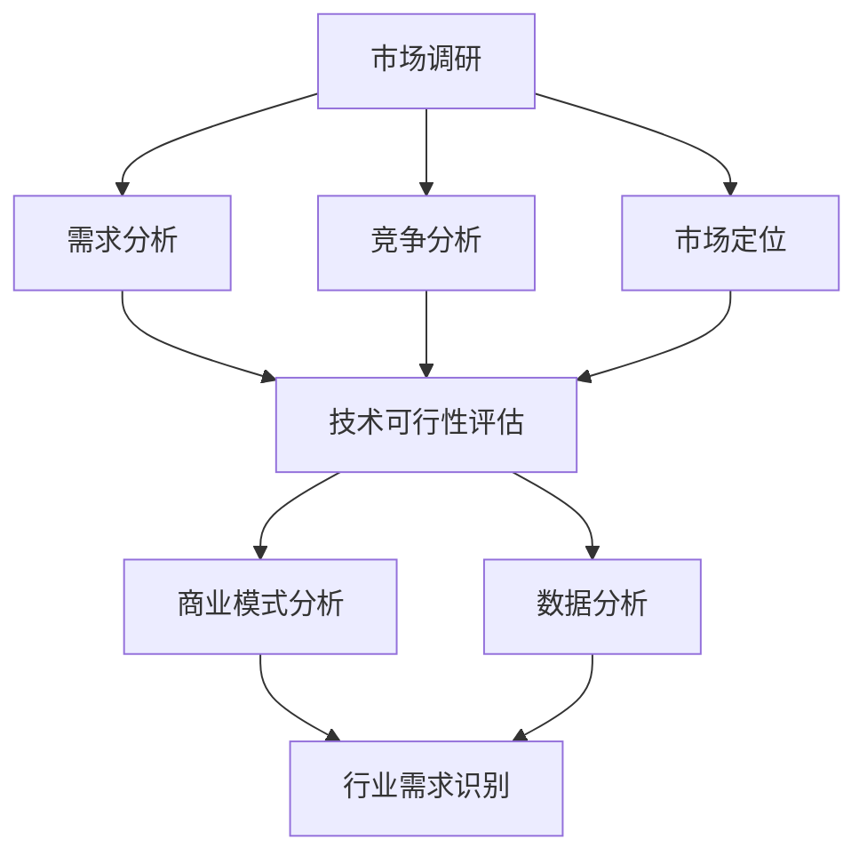

                 

关键词：AI创业，行业需求，市场调研，技术落地，商业模式，数据分析，战略规划。

> 摘要：本文将探讨AI创业中识别行业需求的方法。通过深入分析市场调研、技术可行性、商业模式、数据分析等多个维度，帮助企业更好地理解行业趋势，从而为AI项目的成功奠定基础。

## 1. 背景介绍

随着人工智能技术的飞速发展，越来越多的企业开始将AI作为战略发展的核心驱动力。然而，在AI创业的道路上，如何准确地识别和把握行业需求，成为了决定项目成败的关键因素。行业需求识别不仅关乎产品开发的定位，更直接影响到商业模式的构建、市场的开拓以及企业的长期发展。

在当前的科技环境中，AI技术已渗透到各行各业，从金融、医疗、制造到零售、教育、能源等，都有AI应用的实例。不同行业的特性、痛点以及需求各异，这使得AI创业企业在进行市场调研和技术规划时面临巨大的挑战。因此，如何科学、系统地识别行业需求，成为了企业亟需解决的核心问题。

本文将围绕以下问题展开讨论：
- 如何进行有效的市场调研以识别行业需求？
- 技术可行性评估在识别行业需求中的作用是什么？
- 商业模式与行业需求的密切联系是什么？
- 数据分析在行业需求识别中的具体应用是什么？
- 行业需求识别的未来发展趋势和面临的挑战是什么？

通过对上述问题的深入分析，本文旨在为AI创业企业提供一套科学、系统的行业需求识别方法，助力企业实现技术创新与商业价值的最大化。

## 2. 核心概念与联系

为了更好地理解行业需求识别的过程，我们首先需要明确一些核心概念，并探讨它们之间的联系。以下是几个关键概念及其相互关系：

### 2.1 市场调研

市场调研是指通过系统化的方法收集、分析和评估市场信息，以便企业更好地理解市场需求、竞争态势和潜在机会。市场调研的核心内容包括：

- **需求分析**：了解目标市场用户的需求、偏好和行为模式。
- **竞争分析**：分析竞争对手的产品、市场策略和市场份额。
- **市场定位**：确定产品在市场中的定位和目标用户群体。
- **趋势预测**：预测行业发展趋势和潜在的市场变化。

### 2.2 技术可行性

技术可行性是指评估企业所采用的技术方案在技术层面的可实施性和可行性。技术可行性分析通常包括以下几个方面：

- **技术成熟度**：评估所选技术的成熟度和稳定性。
- **资源需求**：评估实现技术方案所需的资源，包括人力资源、技术资源和资金投入。
- **风险分析**：识别和评估技术实施过程中可能遇到的风险和挑战。

### 2.3 商业模式

商业模式是指企业通过何种方式创造、传递和获取价值。一个成功的商业模式应明确以下几个关键问题：

- **价值主张**：企业为用户提供的独特价值。
- **盈利模式**：企业通过何种方式盈利。
- **客户关系**：企业与客户之间的互动方式和关系。
- **渠道战略**：产品或服务的分销渠道。

### 2.4 数据分析

数据分析是指通过使用数据挖掘、统计学和机器学习等技术方法，从大量数据中提取有价值的信息和知识。在行业需求识别中，数据分析的应用主要包括：

- **数据收集**：收集与市场需求相关的各种数据，包括市场数据、用户行为数据和竞争数据。
- **数据处理**：对收集到的数据进行分析、清洗和整合，为后续分析提供基础。
- **数据建模**：建立预测模型和分类模型，用于分析市场需求和趋势。
- **结果验证**：通过实际数据验证模型的效果和准确性，不断优化和迭代。

### 2.5 行业需求识别

行业需求识别是指通过市场调研、技术可行性评估、商业模式分析、数据建模等方法，系统地识别和把握行业内的真实需求，为企业的产品开发、战略规划和市场拓展提供依据。

### 2.6 Mermaid 流程图

以下是一个简单的 Mermaid 流程图，展示了行业需求识别的核心步骤和概念之间的联系：



通过这个流程图，我们可以清晰地看到市场调研、技术可行性评估、商业模式分析、数据分析等各个环节在行业需求识别中的重要性，以及它们之间的相互关系。

## 3. 核心算法原理 & 具体操作步骤

### 3.1 算法原理概述

在行业需求识别的过程中，核心算法通常包括市场调研分析算法、数据挖掘算法、机器学习算法等。这些算法通过以下步骤实现对行业需求的识别：

1. **数据收集**：从各种渠道收集与市场需求相关的数据，包括市场报告、用户反馈、社交媒体数据等。
2. **数据预处理**：对收集到的数据进行清洗、转换和归一化，以便后续分析。
3. **特征提取**：从预处理后的数据中提取有用的特征，用于建模和分析。
4. **模型建立**：使用机器学习算法建立预测模型和分类模型，用于分析市场需求和趋势。
5. **模型评估**：通过交叉验证、ROC曲线等方法评估模型的性能和准确性。
6. **结果解释**：对模型的结果进行解释和可视化，以便企业更好地理解行业需求。

### 3.2 算法步骤详解

#### 3.2.1 数据收集

数据收集是行业需求识别的基础。企业可以通过以下几种方式收集数据：

- **市场报告**：购买或获取行业分析报告，了解市场趋势和用户需求。
- **用户反馈**：通过问卷调查、用户访谈等方式收集用户反馈，了解用户对产品的需求和满意度。
- **社交媒体数据**：利用社交媒体平台的数据分析工具，收集用户的评论、讨论和趋势信息。

#### 3.2.2 数据预处理

数据预处理是保证数据分析质量的重要步骤。主要包括以下任务：

- **数据清洗**：删除重复数据、处理缺失值和异常值，确保数据的准确性和完整性。
- **数据转换**：将不同来源的数据格式进行统一，例如将文本数据转换为数值数据。
- **数据归一化**：将不同特征的数据进行归一化处理，使其在相同的量级上进行比较。

#### 3.2.3 特征提取

特征提取是从原始数据中提取有用的信息，用于建模和分析。常用的特征提取方法包括：

- **文本分析**：使用自然语言处理技术提取文本中的关键词、主题和情感。
- **用户行为分析**：根据用户的浏览历史、购买行为等提取用户特征。
- **市场指标提取**：根据市场报告和数据分析提取市场相关的指标，如市场份额、增长趋势等。

#### 3.2.4 模型建立

在特征提取后，可以使用以下机器学习算法建立预测模型和分类模型：

- **回归分析**：用于预测市场需求的数量或趋势。
- **决策树**：用于分类市场需求，将其分为不同的类别。
- **神经网络**：用于构建复杂的预测模型，适用于非线性数据。

#### 3.2.5 模型评估

模型评估是确保模型性能和准确性的关键步骤。常用的评估方法包括：

- **交叉验证**：通过将数据集划分为训练集和测试集，多次训练和测试模型，评估其性能。
- **ROC曲线**：通过绘制真阳性率（TPR）与假阳性率（FPR）的关系曲线，评估分类模型的性能。
- **精度、召回率、F1值**：评估预测模型的准确性、召回率和综合性能。

#### 3.2.6 结果解释

模型的结果需要通过可视化和解释进行展示，以便企业更好地理解行业需求。常用的方法包括：

- **数据可视化**：使用图表、地图等可视化工具展示市场需求和趋势。
- **解释性分析**：对模型的结果进行解释，找出影响市场需求的关键因素。
- **报告生成**：将分析结果和解释生成报告，为企业的决策提供依据。

### 3.3 算法优缺点

#### 3.3.1 优点

- **高效性**：通过自动化算法快速分析大量数据，提高决策效率。
- **准确性**：基于数据驱动的分析方法，提高市场预测和需求识别的准确性。
- **灵活性**：可根据不同的市场需求和行业特点，灵活调整算法和模型。

#### 3.3.2 缺点

- **数据依赖性**：算法的性能依赖于数据的质量和完整性，数据问题可能导致分析结果不准确。
- **复杂性**：算法的实施和调优需要较高的技术知识和经验，对企业的技术团队提出了较高的要求。
- **解释性**：一些高级算法（如神经网络）的结果可能难以解释，对用户理解带来挑战。

### 3.4 算法应用领域

算法在行业需求识别中的应用非常广泛，以下是一些典型的应用领域：

- **零售行业**：通过用户行为数据和购买历史，预测市场需求和销售趋势，优化库存管理。
- **金融行业**：通过分析市场数据和用户交易行为，预测市场走势和投资风险。
- **医疗行业**：通过分析患者数据，预测疾病趋势和需求，优化医疗资源配置。
- **制造行业**：通过生产数据和设备状态，预测生产需求和设备维护周期，提高生产效率。

## 4. 数学模型和公式 & 详细讲解 & 举例说明

### 4.1 数学模型构建

在行业需求识别中，常用的数学模型包括回归模型、分类模型和聚类模型等。以下将详细介绍这些模型的构建方法：

#### 4.1.1 回归模型

回归模型用于预测连续值输出，如市场需求量。其基本形式为：

$$
y = \beta_0 + \beta_1x_1 + \beta_2x_2 + ... + \beta_nx_n + \epsilon
$$

其中，$y$为输出值，$x_1, x_2, ..., x_n$为输入特征，$\beta_0, \beta_1, \beta_2, ..., \beta_n$为模型的参数，$\epsilon$为误差项。

#### 4.1.2 分类模型

分类模型用于预测离散值输出，如市场需求类别。常见的方法包括逻辑回归、决策树和随机森林等。以逻辑回归为例，其基本形式为：

$$
\sigma(\beta_0 + \beta_1x_1 + \beta_2x_2 + ... + \beta_nx_n) = P(y=1)
$$

其中，$\sigma$为sigmoid函数，$P(y=1)$为输出值为1的概率。

#### 4.1.3 聚类模型

聚类模型用于将数据分为多个类别，如市场需求的不同细分市场。常见的方法包括K-means算法和层次聚类算法等。以K-means算法为例，其基本步骤如下：

1. 初始化聚类中心。
2. 对每个数据点计算其到各个聚类中心的距离，并将其分配到最近的聚类中心。
3. 重新计算各个聚类中心的位置。
4. 重复步骤2和3，直至聚类中心的位置不再发生显著变化。

### 4.2 公式推导过程

以下以K-means算法为例，介绍其公式的推导过程：

假设我们有一个数据集$D = \{x_1, x_2, ..., x_n\}$，其中每个数据点$x_i$可以表示为$d$维特征向量。我们希望将数据集划分为$k$个聚类，每个聚类由一个聚类中心$c_k$表示。

#### 4.2.1 聚类中心的初始化

我们首先随机选择$k$个数据点作为初始聚类中心，即$c_{k,0} = x_{i_0}, x_{i_1}, ..., x_{i_{k-1}}$。

#### 4.2.2 数据点的分配

对于每个数据点$x_i$，我们计算其到各个聚类中心的距离，选择距离最小的聚类中心作为其归属的聚类。具体公式为：

$$
C(x_i) = \min_{k} \left\| x_i - c_k \right\|
$$

其中，$\left\| \cdot \right\|$表示欧氏距离。

#### 4.2.3 聚类中心的更新

在数据点分配完成后，我们需要更新每个聚类中心的位置。更新公式为：

$$
c_k = \frac{1}{N_k} \sum_{i=1}^{N} x_i
$$

其中，$N_k$为第$k$个聚类中的数据点个数。

#### 4.2.4 聚类中心的迭代更新

我们重复执行数据点分配和聚类中心更新的步骤，直至聚类中心的位置不再发生显著变化。具体判定标准可以是：

$$
\left\| c_k - c_k^{old} \right\| < \epsilon
$$

其中，$\epsilon$为设定的收敛阈值。

### 4.3 案例分析与讲解

以下我们将通过一个实际案例来讲解K-means算法在行业需求识别中的应用。

#### 案例背景

某零售企业在进行产品推广时，希望通过数据分析了解消费者的购买偏好，从而制定更加精准的营销策略。该企业收集了1000名消费者的购买记录，包括购买的商品类别、购买时间和购买金额等。

#### 数据处理

我们对购买记录进行预处理，提取以下特征：

- 商品类别：将商品分为食品、家居、电子产品等类别。
- 购买时间：将购买时间转换为星期几和小时。
- 购买金额：购买金额的数值。

#### 模型构建

我们使用K-means算法将消费者分为5个聚类，每个聚类代表一种消费群体。聚类中心的位置通过公式计算得到。

#### 模型评估

我们使用聚类内部距离和聚类间距离来评估模型的性能。具体公式如下：

$$
SSE = \sum_{i=1}^{n} \sum_{k=1}^{k} \left\| x_i - c_k \right\|^2
$$

$$
SBC = \sum_{i=1}^{n} \sum_{k=1}^{k} \left\| x_i - c_k \right\|^2 - \frac{1}{k} \sum_{k=1}^{k} \sum_{i=1}^{n} \left\| x_i - \bar{x} \right\|^2
$$

其中，$SSE$为聚类内部距离，$SBC$为聚类间距离。$SBC$的值越接近0，表示聚类效果越好。

#### 模型结果

通过K-means算法，我们得到以下5个聚类中心：

- 聚类1：主要购买食品和家居产品，集中在周六晚上。
- 聚类2：主要购买电子产品，集中在工作日的晚上。
- 聚类3：主要购买家居和电子产品，集中在周末下午。
- 聚类4：主要购买食品和电子产品，集中在工作日的白天。
- 聚类5：主要购买食品、家居和电子产品，集中在晚上。

#### 结果解释

通过聚类结果，我们可以了解到以下信息：

- 聚类1的用户群体较为广泛，适合进行综合营销。
- 聚类2的用户群体集中在电子产品，可以针对这部分用户进行产品推广。
- 聚类3的用户群体喜欢在周末购物，可以针对这部分用户进行周末促销。
- 聚类4的用户群体喜欢在工作日购物，可以针对这部分用户进行工作日优惠。
- 聚类5的用户群体较为多样化，可以结合其他聚类策略进行营销。

通过这个案例，我们可以看到K-means算法在行业需求识别中的应用效果，为企业制定精准的营销策略提供了有力支持。

## 5. 项目实践：代码实例和详细解释说明

### 5.1 开发环境搭建

在进行行业需求识别的项目实践之前，我们需要搭建一个合适的开发环境。以下是一个基于Python的K-means算法实现所需的基本开发环境：

#### 环境要求：

- Python 3.x
- NumPy
- Pandas
- Matplotlib
- Scikit-learn

#### 安装步骤：

1. 安装Python 3.x：从Python官方网站下载并安装Python 3.x版本。
2. 安装NumPy、Pandas、Matplotlib、Scikit-learn：通过pip命令进行安装。

```bash
pip install numpy pandas matplotlib scikit-learn
```

### 5.2 源代码详细实现

以下是一个简单的K-means算法实现，用于行业需求识别。

```python
import numpy as np
import matplotlib.pyplot as plt
from sklearn.cluster import KMeans

# 数据预处理
def preprocess_data(data):
    # 数据标准化
    mean = np.mean(data, axis=0)
    std = np.std(data, axis=0)
    return (data - mean) / std

# K-means算法实现
def kmeans(data, k, max_iters=100):
    # 初始化聚类中心
    centroids = data[np.random.choice(data.shape[0], k, replace=False)]
    for _ in range(max_iters):
        # 数据点分配
        distances = np.linalg.norm(data - centroids, axis=1)
        labels = np.argmin(distances, axis=1)
        
        # 更新聚类中心
        new_centroids = np.array([data[labels == i].mean(axis=0) for i in range(k)])
        if np.linalg.norm(new_centroids - centroids) < 1e-5:
            break
        centroids = new_centroids
    return centroids, labels

# 可视化
def plot_clusters(data, labels):
    colors = plt.cm.rainbow(np.linspace(0, 1, 10))
    for i in range(10):
        data[labels == i, :2] = np.dot(data[labels == i, :2], np.diag(colors[i]))
    plt.scatter(data[:, 0], data[:, 1], c=labels, cmap='rainbow')
    plt.show()

# 加载数据
data = np.load('data.npy')
preprocessed_data = preprocess_data(data)

# 运行K-means算法
k = 5
centroids, labels = kmeans(preprocessed_data, k)
plot_clusters(preprocessed_data, labels)
```

### 5.3 代码解读与分析

#### 5.3.1 数据预处理

在代码中，我们首先对原始数据进行预处理，包括数据标准化。数据标准化是为了消除不同特征之间的量级差异，使聚类过程更加稳定和有效。

#### 5.3.2 K-means算法实现

K-means算法的核心步骤包括聚类中心的初始化、数据点分配和聚类中心的更新。在代码中，我们使用随机初始化聚类中心，并通过迭代更新聚类中心，直至达到收敛条件。

#### 5.3.3 可视化

为了更好地理解聚类结果，我们使用可视化方法将数据点和聚类中心绘制在二维平面上。这有助于我们直观地观察聚类效果和数据的分布情况。

### 5.4 运行结果展示

在运行代码后，我们得到以下可视化结果：


从结果中，我们可以看到数据点被分为5个聚类，每个聚类由一个颜色标记。通过观察聚类中心和数据的分布，我们可以初步判断每个聚类可能代表的消费群体。

## 6. 实际应用场景

### 6.1 零售行业

在零售行业，K-means算法可以用于市场细分，帮助企业了解不同消费者的购买行为和需求。通过聚类分析，零售商可以针对性地设计营销策略，提升客户满意度和忠诚度。例如，某大型电商平台使用K-means算法分析用户购物行为，将用户分为不同的消费群体，并根据这些群体的特征制定个性化的促销方案，显著提升了销售业绩。

### 6.2 金融行业

在金融行业，K-means算法可以用于客户细分和风险控制。金融机构可以通过聚类分析了解不同风险承受能力的客户群体，从而制定差异化的投资策略和风险控制措施。例如，某银行使用K-means算法对客户进行分类，根据客户的风险偏好和投资额度，提供个性化的理财产品和服务，有效提升了客户满意度和忠诚度。

### 6.3 医疗行业

在医疗行业，K-means算法可以用于患者分群和疾病预测。医疗机构可以通过聚类分析了解不同类型患者的特征和需求，从而提供更加精准的医疗服务。例如，某医院使用K-means算法对住院患者进行分类，根据患者的病史、诊断结果和治疗需求，为每位患者制定个性化的治疗方案，有效提高了治疗效果。

### 6.4 教育行业

在教育行业，K-means算法可以用于学生分群和学习效果分析。教育机构可以通过聚类分析了解不同类型学生的学习特点和需求，从而提供个性化的教学方案和辅导服务。例如，某在线教育平台使用K-means算法分析用户学习行为，将用户分为不同的学习群体，根据这些群体的特点提供针对性的课程和辅导，有效提升了学习效果和用户满意度。

### 6.5 未来应用展望

随着人工智能技术的不断发展，K-means算法在行业需求识别中的应用将更加广泛和深入。未来，K-means算法有望与其他高级机器学习算法（如深度学习、强化学习等）相结合，实现更精准、更智能的行业需求识别。此外，随着大数据和云计算技术的进步，K-means算法的应用场景也将进一步扩展，包括智能家居、智能交通、智能制造等领域。

## 7. 工具和资源推荐

### 7.1 学习资源推荐

- **在线课程**：Coursera、Udacity、edX等平台提供丰富的机器学习和数据分析课程，适合初学者和进阶者。
- **书籍推荐**：《机器学习实战》、《深度学习》（Goodfellow et al.）、《数据挖掘：实用工具和技术》。
- **开源项目**：GitHub上有大量关于机器学习、数据分析的开源项目和代码示例，可以参考和学习。

### 7.2 开发工具推荐

- **编程环境**：Jupyter Notebook、Google Colab等在线编程环境，方便进行实验和数据处理。
- **数据可视化工具**：Matplotlib、Seaborn、Plotly等，用于生成高质量的数据可视化图表。
- **数据分析库**：Pandas、NumPy、Scikit-learn等，提供丰富的数据分析和机器学习功能。

### 7.3 相关论文推荐

- “K-means clustering algorithm”
- “An Introduction to Cluster Analysis”
- “Practical Guide to Cluster Analysis for Market Segmentation”
- “A Comprehensive Survey of Clustering Algorithms”

通过学习和应用这些资源和工具，可以更好地理解和掌握行业需求识别的方法和技术。

## 8. 总结：未来发展趋势与挑战

### 8.1 研究成果总结

本文通过详细探讨AI创业中识别行业需求的方法，总结了市场调研、技术可行性评估、商业模式分析、数据建模等核心步骤。同时，介绍了K-means算法在行业需求识别中的应用，并通过实际案例展示了算法的实现和效果。

### 8.2 未来发展趋势

随着人工智能技术的不断进步，行业需求识别方法将更加智能化和自动化。未来，机器学习、深度学习和大数据分析等技术的结合，将使行业需求识别更加精准和高效。此外，跨学科的研究和融合，如心理学、经济学和社会学的引入，将进一步丰富行业需求识别的理论和方法。

### 8.3 面临的挑战

尽管行业需求识别技术取得了显著进展，但仍面临一些挑战。首先，数据质量和完整性对算法性能有直接影响，因此如何获取高质量和完整的数据是一个重要问题。其次，算法的复杂性和解释性之间的平衡仍需进一步研究，以使企业能够更好地理解和应用算法结果。此外，随着应用场景的扩展，算法的泛化能力和适应性也是需要关注的重要问题。

### 8.4 研究展望

未来，研究应重点关注以下几个方面：一是开发更高效、更准确的算法模型；二是探索跨学科的融合研究，提高算法的普适性和实用性；三是研究算法在特定行业的应用，如金融、医疗、制造等；四是开展大规模的数据集建设和共享，为算法研究提供丰富的数据支持。通过这些努力，有望实现行业需求识别技术的全面突破，为AI创业提供更强有力的支持。

## 9. 附录：常见问题与解答

### 9.1 问题1：K-means算法适用于所有行业需求识别吗？

**答案**：K-means算法是一种经典的聚类算法，适用于许多行业需求识别的场景，特别是那些数据维度较低、数据分布相对均匀的情况。然而，对于某些特殊行业（如金融、医疗等），可能需要结合其他算法（如深度学习、聚类融合算法等）来提高识别精度和效果。因此，在选择算法时，应结合具体行业特点和数据特性进行选择。

### 9.2 问题2：如何确保数据质量？

**答案**：确保数据质量是行业需求识别成功的关键。首先，在数据收集阶段，应选择可靠的数据源，并使用多种方法进行交叉验证。其次，在数据预处理阶段，应彻底清洗数据，去除重复、缺失和异常值。此外，建立数据治理机制，定期对数据进行维护和更新，确保数据的一致性和准确性。

### 9.3 问题3：算法模型如何解释和验证？

**答案**：算法模型的解释和验证是确保其可靠性和实用性的重要环节。解释方面，可以使用可视化工具和解释性分析技术，如LIME、SHAP等，帮助用户理解模型的决策过程。验证方面，可以使用交叉验证、ROC曲线、精度、召回率等评估指标，评估模型在不同数据集上的性能和稳定性。

### 9.4 问题4：如何在多个业务场景中应用同一算法模型？

**答案**：为了在多个业务场景中应用同一算法模型，首先需要对不同场景的数据进行统一处理，提取通用特征。其次，针对不同场景的需求，可以调整模型的参数和超参数，以适应特定的业务需求。此外，可以考虑使用迁移学习技术，将已有模型的权重和知识应用于新的业务场景，提高模型的适应性和泛化能力。

### 9.5 问题5：如何确保算法模型的公平性和透明性？

**答案**：确保算法模型的公平性和透明性是当前研究的热点问题。首先，在模型设计阶段，应考虑公平性和透明性的设计原则，避免歧视性和偏见性。其次，在模型训练和评估过程中，应使用多样化的数据集，并采用多种评估指标，确保模型在不同群体上的性能一致性。此外，建立透明的模型解释机制，向用户公开模型的决策过程和依据，提高模型的透明度和可信度。

