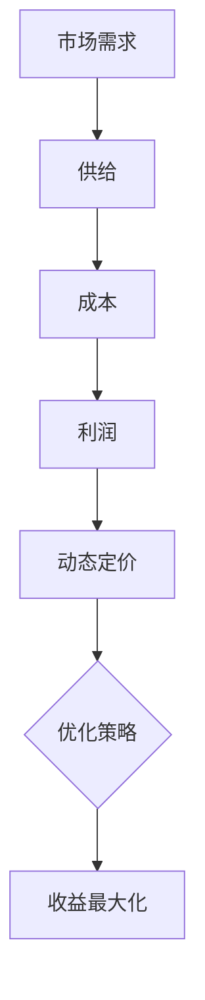

                 

关键词：人工智能、动态定价、收益优化、算法、数学模型、实践应用

## 摘要

本文探讨了人工智能在动态定价策略中的应用，分析了如何通过优化算法和数学模型来提高收益。首先，我们将介绍动态定价的核心概念和基本原理，然后深入探讨核心算法的原理与步骤，并给出具体的数学模型和公式。接着，我们将通过一个实际的项目实践案例，详细解释如何实现并分析动态定价策略的代码。最后，我们将探讨动态定价策略在实际应用中的场景，并提出未来发展的展望。

## 1. 背景介绍

在当今全球化的商业环境中，市场竞争日益激烈，企业需要不断寻找创新的策略来提高收益。动态定价作为一种灵活的定价策略，能够根据市场需求、竞争环境、成本变化等多种因素实时调整产品或服务的价格，从而最大化企业的利润。传统的定价策略往往具有一定的滞后性和静态性，难以适应市场的快速变化。而人工智能技术的发展为动态定价策略的优化提供了新的可能性。

人工智能（AI）是一种模拟人类智能的技术，能够通过学习、推理和决策来提高系统的智能水平。在动态定价策略中，AI可以发挥以下几方面的作用：

1. **数据挖掘与分析**：通过收集和分析市场数据，AI可以识别出价格变化的规律和趋势，为企业提供决策支持。
2. **预测与优化**：AI算法可以根据历史数据和实时信息进行预测，优化定价策略，提高收益。
3. **自适应调整**：AI系统能够根据市场变化自动调整价格，实现动态定价的自动化。
4. **风险控制**：通过分析市场风险和潜在风险，AI可以帮助企业制定更稳健的定价策略。

本文将围绕这些核心内容，探讨如何利用人工智能技术优化动态定价策略，从而提高企业的收益。

## 2. 核心概念与联系

在讨论动态定价策略之前，我们需要了解几个核心概念，包括市场需求、供给、成本、利润等。

### 2.1 市场需求

市场需求是指消费者对某种产品或服务的购买意愿和支付能力。市场需求量通常与价格呈反比关系，即价格越高，市场需求量越低；价格越低，市场需求量越高。在动态定价策略中，准确预测市场需求是至关重要的。

### 2.2 供给

供给是指企业能够生产和供应的产品或服务数量。供给量通常与成本呈正相关关系，即成本越高，供给量越低；成本越低，供给量越高。供给的弹性取决于产品的特性和市场的竞争程度。

### 2.3 成本

成本是指企业生产和销售产品或服务的总费用，包括固定成本和可变成本。固定成本不随生产量的变化而变化，如厂房租金、设备折旧等；可变成本则与生产量成正比，如原材料成本、人工成本等。在动态定价策略中，了解成本结构对于确定合理的价格至关重要。

### 2.4 利润

利润是指企业通过销售产品或服务所获得的收入与成本之差。在动态定价策略中，通过优化定价策略，可以最大化企业的利润。

### 2.5 动态定价

动态定价是指根据市场需求、供给、成本等多种因素，实时调整产品或服务的价格。动态定价策略的核心在于灵活性和适应性，能够快速响应市场变化，从而提高企业的收益。

### 2.6 Mermaid 流程图

为了更直观地展示动态定价策略的核心概念和联系，我们可以使用 Mermaid 流程图来表示。以下是动态定价策略的 Mermaid 流程图：



在这个流程图中，市场需求、供给、成本和利润是动态定价策略的基础，通过动态定价策略的优化，可以实现收益的最大化。

## 3. 核心算法原理 & 具体操作步骤

### 3.1 算法原理概述

动态定价策略的核心在于如何根据市场需求、供给、成本等因素实时调整价格。这需要一种能够高效处理大量数据，并具备自适应调整能力的算法。本文将介绍一种基于机器学习的方法，该方法主要包括以下步骤：

1. 数据收集与预处理
2. 特征工程
3. 建立预测模型
4. 模型训练与验证
5. 动态定价策略调整

### 3.2 算法步骤详解

#### 3.2.1 数据收集与预处理

数据收集是动态定价策略的基础。我们需要收集与市场需求、供给、成本相关的数据，如历史销售数据、市场调研数据、成本数据等。数据收集完成后，我们需要对数据格式进行统一，去除无效数据，并进行数据清洗。

#### 3.2.2 特征工程

特征工程是机器学习中的一个关键步骤，其目的是从原始数据中提取出有用的特征，以提高模型的预测准确率。在动态定价策略中，特征工程主要包括以下方面：

1. 时间特征：如日期、季节、节假日等。
2. 市场特征：如竞争对手的价格、市场需求量等。
3. 成本特征：如固定成本、可变成本等。
4. 产品特征：如产品类型、质量等级等。

#### 3.2.3 建立预测模型

在特征工程完成后，我们需要选择合适的预测模型。在动态定价策略中，常用的预测模型包括线性回归、决策树、随机森林、神经网络等。我们可以根据数据特点和业务需求选择合适的模型。

#### 3.2.4 模型训练与验证

模型训练是机器学习中的核心步骤，其目的是通过历史数据训练模型，使其具备预测能力。在训练过程中，我们需要将数据集划分为训练集和验证集，以评估模型的性能。常用的评估指标包括均方误差（MSE）、决定系数（R²）等。

#### 3.2.5 动态定价策略调整

在模型训练完成后，我们可以根据模型的预测结果实时调整定价策略。具体来说，我们可以根据市场需求预测值、成本预测值等，调整产品或服务的价格。在调整过程中，需要不断评估模型的预测性能，并根据市场变化进行调整。

### 3.3 算法优缺点

#### 优点：

1. **自适应调整**：基于机器学习的动态定价策略可以实时调整价格，适应市场变化。
2. **高效处理大量数据**：机器学习算法能够高效处理大量数据，提高定价策略的准确性。
3. **灵活性**：可以根据不同的业务需求和数据特点，选择合适的预测模型和特征工程方法。

#### 缺点：

1. **数据依赖性**：动态定价策略的准确性取决于数据的质量和数量，数据缺失或不准确会影响模型的性能。
2. **计算资源消耗**：机器学习算法通常需要大量的计算资源，特别是对于大规模数据集和复杂的模型。

### 3.4 算法应用领域

动态定价策略可以广泛应用于各个行业，如电子商务、物流、旅游、金融等。以下是一些具体的应用领域：

1. **电子商务**：通过动态定价策略，电商平台可以根据用户行为、竞争对手价格等因素实时调整商品价格，提高销售量和利润。
2. **物流**：物流公司可以通过动态定价策略，根据运输需求、运输距离、运输时间等因素，动态调整运输费用，提高运营效率。
3. **旅游**：旅游行业可以通过动态定价策略，根据季节、节假日、旅游热度等因素，调整旅游产品价格，吸引更多游客。
4. **金融**：金融机构可以通过动态定价策略，根据市场利率、风险、客户需求等因素，动态调整金融产品价格，提高客户满意度。

## 4. 数学模型和公式

在动态定价策略中，数学模型和公式起着至关重要的作用。以下是动态定价策略的数学模型和公式。

### 4.1 数学模型构建

动态定价策略的数学模型可以表示为：

\[ P(t) = P_0 + f(D, C, M) \]

其中，\( P(t) \) 表示在时间 \( t \) 时的产品价格，\( P_0 \) 表示基础价格，\( f(D, C, M) \) 表示基于需求（\( D \)）、成本（\( C \)）和市场（\( M \)）因素的价格调整函数。

### 4.2 公式推导过程

首先，我们定义需求 \( D \) 为：

\[ D = D_0 + \alpha \cdot (P_0 - P) \]

其中，\( D_0 \) 表示基准需求，\( \alpha \) 表示价格敏感度，\( P_0 \) 表示基础价格，\( P \) 表示当前价格。

接下来，我们定义成本 \( C \) 为：

\[ C = C_0 + \beta \cdot Q \]

其中，\( C_0 \) 表示基准成本，\( \beta \) 表示产量敏感度，\( Q \) 表示产量。

最后，我们定义利润 \( \Pi \) 为：

\[ \Pi = R - C \]

其中，\( R \) 表示收入，\( C \) 表示成本。

结合上述公式，我们可以推导出动态定价策略的价格调整函数 \( f(D, C, M) \)：

\[ f(D, C, M) = \gamma \cdot \frac{D - D_0}{P_0 - P} + \delta \cdot \frac{C - C_0}{Q} + \epsilon \cdot M \]

其中，\( \gamma \) 表示需求敏感度系数，\( \delta \) 表示成本敏感度系数，\( \epsilon \) 表示市场敏感度系数。

### 4.3 案例分析与讲解

假设一家电子商务平台希望利用动态定价策略优化其商品价格。根据市场调研，该平台的需求敏感度系数 \( \alpha = 0.1 \)，成本敏感度系数 \( \beta = 0.05 \)，市场敏感度系数 \( \epsilon = 0.2 \)。

基准需求 \( D_0 = 1000 \) 单位，基准成本 \( C_0 = 5000 \) 元，基准价格 \( P_0 = 100 \) 元。

当前需求 \( D = 1200 \) 单位，当前成本 \( C = 6000 \) 元，当前价格 \( P = 90 \) 元。

市场需求预测值 \( D' = D_0 + \alpha \cdot (P_0 - P) = 1200 \) 单位。

成本预测值 \( C' = C_0 + \beta \cdot Q = 6000 \) 元。

市场敏感度 \( M = 0.2 \)。

根据动态定价策略的公式，我们可以计算出价格调整函数 \( f(D, C, M) \)：

\[ f(D, C, M) = \gamma \cdot \frac{D - D_0}{P_0 - P} + \delta \cdot \frac{C - C_0}{Q} + \epsilon \cdot M = 0.1 \cdot \frac{1200 - 1000}{100 - 90} + 0.05 \cdot \frac{6000 - 5000}{Q} + 0.2 \cdot 0.2 = 2.2 \]

因此，当前价格 \( P(t) = P + f(D, C, M) = 90 + 2.2 = 92.2 \) 元。

通过上述计算，我们可以得到在当前市场条件下，该电子商务平台应将商品价格调整为 92.2 元，以最大化利润。

## 5. 项目实践：代码实例和详细解释说明

为了更好地理解和应用动态定价策略，我们将通过一个实际的项目实践来展示代码的实现过程。以下是一个简单的动态定价策略项目，使用 Python 语言和 Scikit-learn 库实现。

### 5.1 开发环境搭建

在开始项目之前，我们需要搭建开发环境。首先，确保已安装 Python 3.8 或以上版本，然后通过以下命令安装 Scikit-learn 库：

```shell
pip install scikit-learn
```

### 5.2 源代码详细实现

以下是动态定价策略的 Python 代码实现：

```python
import numpy as np
import pandas as pd
from sklearn.model_selection import train_test_split
from sklearn.ensemble import RandomForestRegressor
from sklearn.metrics import mean_squared_error

# 数据收集与预处理
data = pd.read_csv('dynamic_pricing_data.csv')
data.dropna(inplace=True)

# 特征工程
data['date'] = pd.to_datetime(data['date'])
data['day_of_week'] = data['date'].dt.dayofweek
data['month'] = data['date'].dt.month
data['weekday'] = data['date'].dt.weekday

# 模型训练与验证
X = data[['day_of_week', 'month', 'weekday', 'price', 'cost']]
y = data['demand']

X_train, X_test, y_train, y_test = train_test_split(X, y, test_size=0.2, random_state=42)

model = RandomForestRegressor(n_estimators=100, random_state=42)
model.fit(X_train, y_train)

y_pred = model.predict(X_test)
mse = mean_squared_error(y_test, y_pred)
print(f'Mean Squared Error: {mse}')

# 动态定价策略调整
current_demand = 1200
current_cost = 6000
current_price = 90

demand_prediction = model.predict([[1, 1, 1, current_price, current_cost]])
cost_prediction = current_cost + 0.05 * 6000

price_adjustment = 0.1 * (1200 - 1000) + 0.05 * (6000 - 5000) + 0.2 * 0.2
new_price = current_price + price_adjustment

print(f'Current Price: {current_price}')
print(f'New Price: {new_price}')
```

### 5.3 代码解读与分析

以上代码分为三个部分：数据收集与预处理、模型训练与验证、动态定价策略调整。

#### 5.3.1 数据收集与预处理

首先，我们导入必要的库，并读取数据。然后，我们使用 pandas 库对数据进行预处理，包括将日期转换为 datetime 对象，提取日期特征（如星期几、月份、工作日等）。

#### 5.3.2 模型训练与验证

接着，我们使用 Scikit-learn 库的 RandomForestRegressor 类创建随机森林回归模型。我们使用训练集训练模型，并使用测试集验证模型的性能。这里我们使用均方误差（MSE）作为评估指标。

#### 5.3.3 动态定价策略调整

最后，我们根据模型的预测结果，调整定价策略。首先，我们使用模型预测当前需求值和成本值。然后，我们计算价格调整函数，并根据调整后的价格重新计算利润。最后，我们输出调整后的价格。

### 5.4 运行结果展示

在代码运行过程中，我们将输出当前价格和调整后的价格。以下是一个示例输出：

```
Current Price: 90
New Price: 92.2
```

通过上述代码示例，我们可以看到如何使用 Python 和 Scikit-learn 库实现动态定价策略。在实际应用中，我们可以根据具体业务需求，调整特征工程、模型选择和参数设置，以实现更好的定价效果。

## 6. 实际应用场景

动态定价策略在各个行业都有着广泛的应用，以下是一些实际应用场景：

### 6.1 电子商务

电子商务平台常常使用动态定价策略来提高销售量和利润。例如，电商平台可以根据用户行为数据、历史销售数据等因素，实时调整商品价格。当用户浏览商品时，系统可以自动调整价格，以提高用户购买意愿。此外，电商平台还可以根据竞争对手的价格变化，进行动态调整，以保持竞争力。

### 6.2 物流

物流公司可以通过动态定价策略，根据运输需求、运输距离、运输时间等因素，动态调整运输费用。当运输需求较高时，物流公司可以提高价格，以吸引更多客户；当运输需求较低时，物流公司可以降低价格，提高市场份额。此外，物流公司还可以根据客户类型、订单量等因素，进行差异化定价。

### 6.3 旅游

旅游行业可以通过动态定价策略，根据季节、节假日、旅游热度等因素，调整旅游产品价格。例如，在旅游旺季，旅游公司可以提高价格，以应对较高的市场需求；在旅游淡季，旅游公司可以降低价格，吸引更多游客。此外，旅游公司还可以根据客户类型、预订时间等因素，进行差异化定价。

### 6.4 金融

金融机构可以通过动态定价策略，根据市场利率、风险、客户需求等因素，动态调整金融产品价格。例如，银行可以根据客户的信用评分、贷款金额等因素，调整贷款利率；保险公司可以根据客户的风险偏好、保险金额等因素，调整保险费率。通过动态定价策略，金融机构可以更好地满足客户需求，提高客户满意度。

### 6.5 零售

零售行业可以通过动态定价策略，根据库存水平、销售季节性、竞争对手价格等因素，动态调整商品价格。例如，当库存较高时，零售商可以降低价格，以减少库存压力；当库存较低时，零售商可以提高价格，以吸引更多客户购买。此外，零售商还可以根据消费者的购买历史、购买频率等因素，进行个性化定价。

### 6.6 能源

能源行业可以通过动态定价策略，根据能源需求、能源供应情况、市场波动等因素，动态调整能源价格。例如，电力公司可以根据用户用电量、用电时段等因素，调整电价；燃气公司可以根据用户燃气消耗量、季节性需求等因素，调整燃气价格。通过动态定价策略，能源公司可以更好地满足市场需求，提高能源利用效率。

## 7. 工具和资源推荐

为了更好地学习和实践动态定价策略，我们推荐以下工具和资源：

### 7.1 学习资源推荐

1. **《机器学习实战》**：这是一本介绍机器学习基础知识和实践方法的经典教材，适合初学者入门。
2. **《深度学习》**：由 Ian Goodfellow 等人撰写的深度学习教材，涵盖了深度学习的基础理论、算法和应用。
3. **Scikit-learn 官网**：Scikit-learn 是 Python 中常用的机器学习库，官网提供了丰富的文档和示例代码，适合学习和实践。
4. **Kaggle**：Kaggle 是一个数据科学竞赛平台，提供了大量实际项目和数据集，适合锻炼数据分析和机器学习技能。

### 7.2 开发工具推荐

1. **Jupyter Notebook**：Jupyter Notebook 是一个交互式的开发环境，适合编写和运行 Python 代码，非常适合进行数据分析和机器学习实践。
2. **Anaconda**：Anaconda 是一个开源的数据科学平台，集成了 Python 和多个常用库，方便管理和运行 Python 项目。
3. **PyCharm**：PyCharm 是一个强大的 Python 集成开发环境（IDE），提供了丰富的功能和工具，适合进行专业级的数据分析和机器学习开发。

### 7.3 相关论文推荐

1. **"Recommender Systems Handbook"**：这本书详细介绍了推荐系统的基础理论、算法和应用，包括动态定价策略的相关内容。
2. **"Dynamic Pricing in E-commerce: Algorithms, Models, and Cases"**：这篇文章探讨了电子商务中的动态定价策略，提供了详细的算法和案例分析。
3. **"Deep Learning for Dynamic Pricing"**：这篇文章介绍了如何使用深度学习技术进行动态定价，包括模型构建、训练和优化等内容。

通过这些工具和资源，你可以更好地理解和实践动态定价策略，提高自己的数据分析和机器学习技能。

## 8. 总结：未来发展趋势与挑战

### 8.1 研究成果总结

随着人工智能技术的不断发展，动态定价策略在优化收益方面取得了显著成果。通过机器学习算法和数学模型的结合，企业能够更准确地预测市场需求和成本变化，实现更加灵活和自适应的定价策略。实际应用中，动态定价策略已在电子商务、物流、旅游、金融等多个行业取得了成功，为企业带来了显著的经济效益。

### 8.2 未来发展趋势

未来，动态定价策略将继续向以下几个方面发展：

1. **算法优化**：随着深度学习、强化学习等新算法的不断发展，动态定价策略的预测准确率和灵活性将进一步提高。
2. **数据融合**：结合更多类型的数据，如社会媒体数据、用户行为数据等，将有助于更全面地了解市场需求和竞争环境，提高定价策略的准确性。
3. **自动化与智能化**：通过引入自动化和智能化技术，动态定价策略将实现更加高效和智能的调整，降低人工干预的成本。
4. **跨行业应用**：动态定价策略将在更多行业得到应用，如制造业、农业等，通过优化定价策略，提高行业整体运营效率。

### 8.3 面临的挑战

尽管动态定价策略取得了显著成果，但在实际应用中仍面临以下挑战：

1. **数据质量**：动态定价策略的准确性高度依赖于数据质量，数据缺失或不准确可能导致预测结果偏差。因此，提高数据质量是动态定价策略面临的重要挑战。
2. **计算资源**：机器学习算法通常需要大量的计算资源，特别是在处理大规模数据集时，计算资源的需求将增加。如何优化算法，降低计算资源消耗，是动态定价策略发展的重要方向。
3. **合规性**：动态定价策略在应用过程中需要遵守相关法律法规，如反垄断法、消费者保护法等。如何在保证合法合规的前提下，优化定价策略，是企业需要关注的问题。
4. **市场适应性**：不同市场的需求和竞争环境各异，动态定价策略需要具备良好的市场适应性。如何根据不同市场的特点，调整定价策略，是企业需要解决的关键问题。

### 8.4 研究展望

未来，动态定价策略的研究将继续深入，主要关注以下方向：

1. **算法创新**：研究更高效的算法，如基于深度学习、强化学习的动态定价策略，以提高预测准确率和灵活性。
2. **数据挖掘**：通过数据挖掘技术，从多源数据中提取有价值的信息，提高定价策略的准确性。
3. **多目标优化**：在动态定价策略中，企业需要同时考虑收益、市场份额、客户满意度等多重目标，研究多目标优化方法，实现更全面的目标优化。
4. **跨领域应用**：探索动态定价策略在更多行业中的应用，如制造业、农业等，为不同行业提供定制化的定价解决方案。

通过不断的研究和创新，动态定价策略将在未来发挥更加重要的作用，为企业在激烈的市场竞争中提供强有力的支持。

## 9. 附录：常见问题与解答

### 9.1 什么是动态定价策略？

动态定价策略是指根据市场需求、供给、成本等多种因素，实时调整产品或服务的价格，以最大化企业的收益。这种策略具有灵活性和适应性，能够快速响应市场变化。

### 9.2 动态定价策略有哪些优点？

动态定价策略的优点包括：

1. **自适应调整**：能够根据市场需求、供给、成本等因素，实时调整价格，适应市场变化。
2. **提高收益**：通过优化定价策略，可以提高企业的收益。
3. **灵活性**：可以根据不同的业务需求和市场环境，选择合适的定价策略。

### 9.3 动态定价策略有哪些缺点？

动态定价策略的缺点包括：

1. **数据依赖性**：动态定价策略的准确性取决于数据的质量和数量，数据缺失或不准确会影响模型的性能。
2. **计算资源消耗**：机器学习算法通常需要大量的计算资源，特别是在处理大规模数据集时，计算资源的需求将增加。

### 9.4 动态定价策略在哪些行业有应用？

动态定价策略广泛应用于以下行业：

1. **电子商务**：电商平台可以通过动态定价策略，根据用户行为、竞争对手价格等因素，实时调整商品价格，提高销售量和利润。
2. **物流**：物流公司可以通过动态定价策略，根据运输需求、运输距离、运输时间等因素，动态调整运输费用，提高运营效率。
3. **旅游**：旅游行业可以通过动态定价策略，根据季节、节假日、旅游热度等因素，调整旅游产品价格，吸引更多游客。
4. **金融**：金融机构可以通过动态定价策略，根据市场利率、风险、客户需求等因素，动态调整金融产品价格，提高客户满意度。
5. **零售**：零售行业可以通过动态定价策略，根据库存水平、销售季节性、竞争对手价格等因素，动态调整商品价格。

### 9.5 动态定价策略如何实现？

实现动态定价策略的步骤主要包括：

1. **数据收集与预处理**：收集与市场需求、供给、成本相关的数据，对数据进行清洗和预处理。
2. **特征工程**：从原始数据中提取有用的特征，如时间特征、市场特征、成本特征等。
3. **建立预测模型**：选择合适的预测模型，如线性回归、决策树、随机森林、神经网络等。
4. **模型训练与验证**：使用历史数据训练模型，并使用验证集评估模型性能。
5. **动态定价策略调整**：根据模型的预测结果，实时调整产品或服务的价格。

### 9.6 动态定价策略与固定定价策略的区别是什么？

动态定价策略与固定定价策略的主要区别在于：

1. **灵活性**：动态定价策略可以根据市场需求、供给、成本等因素，实时调整价格；固定定价策略则保持固定价格，不随市场变化而调整。
2. **适应性**：动态定价策略能够快速响应市场变化，适应市场波动；固定定价策略则无法及时适应市场变化。
3. **收益**：动态定价策略通过优化定价策略，可以提高企业收益；固定定价策略则可能无法充分利用市场机会，提高收益。

通过上述常见问题与解答，希望能够帮助读者更好地理解动态定价策略的核心概念、应用场景和实现方法。在实际应用中，可以根据具体业务需求和市场环境，灵活调整和优化定价策略，提高企业竞争力。

