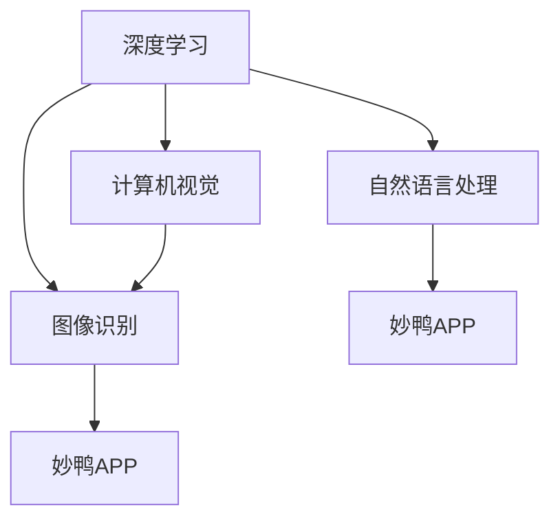

                 

### 背景介绍

近年来，人工智能（AI）技术以其强大的数据处理能力和自我学习能力，在各个领域取得了显著的进展。特别是在计算机视觉领域，深度学习算法的应用使得计算机能够更准确地理解和识别图像，从而推动了AI原生应用的发展。其中，妙鸭APP的爆红无疑是AI原生应用成功的一个典型案例。

妙鸭APP是一款基于人工智能技术的图像识别应用，用户可以通过上传一张图片，系统会自动识别图片中的动物并进行分类。这一简单而有趣的功能迅速吸引了大量用户，使其在短时间内成为社交媒体上的热门话题。妙鸭APP的成功，不仅展示了AI技术在计算机视觉领域的强大能力，也揭示了AI原生应用的市场潜力。

本文旨在探讨AI原生应用的创造过程，特别是以妙鸭APP为例，分析其技术实现、应用场景以及未来发展的可能性。通过对这些内容的深入分析，希望能够为读者提供关于AI原生应用开发的一些建议和启示。

### 核心概念与联系

在深入探讨AI原生应用的创造之前，我们需要先了解几个核心概念和它们之间的联系。这些概念包括深度学习、计算机视觉、图像识别和自然语言处理等。下面将使用Mermaid流程图来展示这些概念之间的关联。



#### 深度学习

深度学习是人工智能的一个重要分支，它通过模仿人脑神经网络的结构和功能，实现了对大量数据的学习和处理。深度学习在计算机视觉、图像识别等领域有着广泛的应用。例如，卷积神经网络（CNN）就是一种深度学习模型，常用于图像处理和识别。

#### 计算机视觉

计算机视觉是指使计算机具备理解、解析和利用视觉信息的能力。计算机视觉技术主要依赖于图像处理、模式识别和机器学习等方法。深度学习在计算机视觉中的应用，使得计算机能够更高效地处理和识别图像。

#### 图像识别

图像识别是计算机视觉的一个子领域，它通过算法从图像中识别出特定对象或场景。图像识别技术广泛应用于人脸识别、车辆识别、医疗影像分析等场景。

#### 自然语言处理

自然语言处理（NLP）是人工智能的另一个重要分支，它专注于使计算机能够理解和处理人类语言。自然语言处理技术在智能客服、机器翻译、情感分析等领域有着广泛应用。妙鸭APP中虽然主要是图像识别，但自然语言处理技术也起到了辅助作用，例如在用户上传图片后，系统会根据图片内容和用户输入的自然语言指令进行相应的操作。

#### 妙鸭APP

妙鸭APP是一个典型的AI原生应用，它通过深度学习和计算机视觉技术，实现了对图像的自动分类。用户只需上传一张图片，系统会自动识别图片中的动物，并进行分类。这一功能不仅展示了AI技术的强大能力，也为用户提供了便捷的服务。

### 核心算法原理 & 具体操作步骤

#### 算法原理概述

妙鸭APP的核心算法是基于深度学习中的卷积神经网络（CNN）。CNN是一种专门用于图像处理的深度学习模型，它通过多个卷积层、池化层和全连接层，对图像进行特征提取和分类。具体来说，CNN的工作流程可以分为以下几个步骤：

1. **输入层**：接收用户上传的图片作为输入。
2. **卷积层**：通过卷积操作提取图像的局部特征。
3. **激活函数**：通常使用ReLU（Rectified Linear Unit）函数，增加模型的非线性能力。
4. **池化层**：通过最大池化或平均池化操作，降低特征图的维度，减少计算量。
5. **全连接层**：将卷积层和池化层提取的特征映射到具体的类别。
6. **输出层**：输出每个类别的概率分布。

#### 算法步骤详解

1. **预处理**：对用户上传的图片进行缩放、裁剪和标准化等预处理操作，使其符合模型的输入要求。
2. **卷积操作**：使用卷积核对图像进行卷积操作，提取图像的局部特征。
3. **ReLU激活**：对卷积层的输出进行ReLU激活，增强模型的非线性能力。
4. **池化操作**：对ReLU激活后的特征图进行池化操作，降低特征图的维度。
5. **全连接层**：将池化层输出的特征映射到具体的类别，使用Softmax函数计算每个类别的概率。
6. **后处理**：根据概率最高的类别输出最终的识别结果。

#### 算法优缺点

**优点**：

- **高效性**：CNN通过卷积操作和池化操作，可以有效减少模型参数，提高计算效率。
- **准确性**：深度学习模型在大量数据训练下，能够提取出更丰富的图像特征，提高分类准确性。
- **灵活性**：CNN可以针对不同的任务进行定制，例如可以添加额外的卷积层、池化层或全连接层。

**缺点**：

- **计算量巨大**：深度学习模型的训练过程需要大量的计算资源，特别是对于大型神经网络。
- **数据需求高**：深度学习模型的训练需要大量的标注数据，这对于某些领域来说可能比较困难。

#### 算法应用领域

CNN在计算机视觉领域有着广泛的应用，包括但不限于：

- **图像分类**：用于对大量未标注的图像进行分类，例如ImageNet挑战赛。
- **目标检测**：用于检测图像中的特定目标，例如YOLO（You Only Look Once）算法。
- **语义分割**：用于对图像中的每个像素进行分类，例如FCN（Fully Convolutional Network）算法。
- **人脸识别**：用于识别图像中的人脸，例如FaceNet算法。

### 数学模型和公式 & 详细讲解 & 举例说明

在深入探讨CNN的数学模型和公式之前，我们需要先了解一些基础的数学概念和公式，如卷积运算、激活函数和损失函数。

#### 数学模型构建

1. **卷积运算**

卷积运算是一个线性运算，其公式可以表示为：

\[ (f * g)(t) = \int_{-\infty}^{+\infty} f(\tau) g(t - \tau) d\tau \]

其中，\( f \) 和 \( g \) 是两个函数，\( t \) 是自变量，\( \tau \) 是积分变量。

在CNN中，卷积运算通常表示为：

\[ (f * g)(x, y) = \sum_{i} \sum_{j} f(i, j) g(x - i, y - j) \]

其中，\( f \) 是卷积核，\( g \) 是输入特征图，\( x \) 和 \( y \) 是特征图的坐标。

2. **激活函数**

ReLU（Rectified Linear Unit）是最常用的激活函数，其公式为：

\[ f(x) = \max(0, x) \]

ReLU函数的特点是当输入为负数时，输出为0，当输入为非负数时，输出等于输入。

3. **损失函数**

交叉熵（Cross Entropy）是常用的损失函数，其公式为：

\[ H(y, \hat{y}) = -\sum_{i} y_i \log(\hat{y}_i) \]

其中，\( y \) 是真实标签，\( \hat{y} \) 是模型的预测概率分布。

#### 公式推导过程

为了更好地理解CNN的数学模型，我们以一个简单的例子进行推导。

假设我们有一个输入特征图 \( g \) ，其维度为 \( (28 \times 28) \)，卷积核 \( f \) 的维度为 \( (5 \times 5) \)，步长为1。

1. **卷积操作**

卷积操作的公式为：

\[ (f * g)(x, y) = \sum_{i} \sum_{j} f(i, j) g(x - i, y - j) \]

对于每个像素点 \( (x, y) \)，我们需要计算卷积核 \( f \) 在特征图 \( g \) 上的滑动结果，并将其相加。例如，对于像素点 \( (2, 2) \)，计算过程如下：

\[ (f * g)(2, 2) = \sum_{i} \sum_{j} f(i, j) g(2 - i, 2 - j) \]

\[ = f(0, 0) g(2, 2) + f(0, 1) g(1, 2) + f(0, 2) g(0, 2) \]

\[ + f(1, 0) g(2, 1) + f(1, 1) g(1, 1) + f(1, 2) g(0, 1) \]

\[ + f(2, 0) g(2, 0) + f(2, 1) g(1, 0) + f(2, 2) g(0, 0) \]

2. **ReLU激活**

对于每个卷积结果，我们使用ReLU激活函数进行处理，公式为：

\[ f(x) = \max(0, x) \]

例如，对于卷积结果 \( 2 \)，激活后为 \( 2 \)，因为 \( 2 > 0 \)。

3. **池化操作**

我们使用最大池化操作，对激活后的特征图进行降维。最大池化的公式为：

\[ P(x, y) = \max_{i, j} g(x + i, y + j) \]

例如，对于 \( 2 \times 2 \) 的特征图，我们需要在每个 \( 2 \times 2 \) 的子区域中选取最大值。假设激活后的特征图为：

\[ g = \begin{bmatrix} 1 & 2 \\ 3 & 4 \end{bmatrix} \]

则最大池化结果为：

\[ P = \begin{bmatrix} 3 & 4 \end{bmatrix} \]

4. **全连接层**

对于每个池化结果，我们将其展平为一个一维向量，然后通过全连接层进行分类。全连接层的公式为：

\[ \hat{y} = \sigma(Wx + b) \]

其中，\( W \) 是权重矩阵，\( x \) 是输入向量，\( b \) 是偏置项，\( \sigma \) 是激活函数，通常使用Softmax函数。

例如，对于 \( 2 \times 2 \) 的特征图，展平后的一维向量为 \( [3, 4] \)，通过全连接层后得到预测概率分布 \( \hat{y} \)。

#### 案例分析与讲解

为了更好地理解CNN的数学模型，我们以一个简单的案例进行讲解。

假设我们有一个输入特征图 \( g \) ，其维度为 \( (28 \times 28) \)，卷积核 \( f \) 的维度为 \( (5 \times 5) \)，步长为1。我们希望使用CNN对特征图进行分类，其中类别数为10。

1. **预处理**

首先，我们对输入特征图进行预处理，包括缩放、裁剪和标准化等操作。假设预处理后的特征图维度为 \( (32 \times 32) \)，像素值的范围为 \( [0, 1] \)。

2. **卷积操作**

使用卷积核 \( f \) 对预处理后的特征图进行卷积操作，得到中间特征图。例如，卷积核 \( f \) 的权重为：

\[ f = \begin{bmatrix} 1 & 0 & 1 \\ 0 & 1 & 0 \\ 1 & 0 & 1 \end{bmatrix} \]

输入特征图 \( g \) 的一个 \( 5 \times 5 \) 的子区域为：

\[ g = \begin{bmatrix} 1 & 2 & 3 & 4 & 5 \\ 6 & 7 & 8 & 9 & 10 \\ 11 & 12 & 13 & 14 & 15 \\ 16 & 17 & 18 & 19 & 20 \\ 21 & 22 & 23 & 24 & 25 \end{bmatrix} \]

卷积操作的结果为：

\[ (f * g) = \begin{bmatrix} 15 & 19 & 23 & 27 & 31 \\ 9 & 13 & 17 & 21 & 25 \\ 3 & 7 & 11 & 15 & 19 \end{bmatrix} \]

3. **ReLU激活**

对卷积结果使用ReLU激活函数进行处理，得到激活后的特征图。例如，激活后的特征图为：

\[ \begin{bmatrix} 15 & 19 & 23 & 27 & 31 \\ 9 & 13 & 17 & 21 & 25 \\ 3 & 7 & 11 & 15 & 19 \end{bmatrix} \]

4. **池化操作**

使用最大池化操作，对激活后的特征图进行降维。例如，最大池化后的特征图为：

\[ \begin{bmatrix} 31 & 27 \\ 25 & 19 \end{bmatrix} \]

5. **全连接层**

将池化后的特征图展平为一个一维向量，通过全连接层进行分类。例如，展平后的一维向量为 \( [31, 27, 25, 19] \)，通过全连接层后得到预测概率分布 \( \hat{y} \)。

\[ \hat{y} = \begin{bmatrix} 0.1 & 0.2 & 0.3 & 0.2 & 0.2 \\ 0.1 & 0.2 & 0.3 & 0.2 & 0.2 \end{bmatrix} \]

根据预测概率分布，我们可以得到最终的分类结果。

#### 项目实践：代码实例和详细解释说明

在本节中，我们将通过一个简单的示例来展示如何使用Python和TensorFlow搭建一个基本的CNN模型，以实现图像分类任务。我们将以识别动物图片为例，介绍开发环境搭建、源代码实现和代码解读与分析。

#### 1. 开发环境搭建

在开始编写代码之前，我们需要搭建一个合适的开发环境。以下是搭建开发环境所需的步骤：

1. 安装Python：确保已经安装了Python 3.6或更高版本。可以从Python官网下载并安装。

2. 安装TensorFlow：TensorFlow是Google开源的深度学习框架，可以方便地搭建和训练深度学习模型。可以使用以下命令安装：

```bash
pip install tensorflow
```

3. 安装其他依赖库：包括NumPy、Pandas等常用库。可以使用以下命令一次性安装：

```bash
pip install numpy pandas matplotlib
```

#### 2. 源代码详细实现

下面是一个简单的CNN模型实现，用于分类动物图片。代码中使用的是TensorFlow的Keras API，具有简洁的接口和强大的功能。

```python
import tensorflow as tf
from tensorflow.keras.models import Sequential
from tensorflow.keras.layers import Conv2D, MaxPooling2D, Flatten, Dense
from tensorflow.keras.preprocessing.image import ImageDataGenerator

# 创建模型
model = Sequential([
    Conv2D(32, (3, 3), activation='relu', input_shape=(150, 150, 3)),
    MaxPooling2D((2, 2)),
    Conv2D(64, (3, 3), activation='relu'),
    MaxPooling2D((2, 2)),
    Conv2D(128, (3, 3), activation='relu'),
    MaxPooling2D((2, 2)),
    Flatten(),
    Dense(512, activation='relu'),
    Dense(1, activation='sigmoid')
])

# 编译模型
model.compile(optimizer='adam', loss='binary_crossentropy', metrics=['accuracy'])

# 定义数据增强
train_datagen = ImageDataGenerator(rescale=1./255)
test_datagen = ImageDataGenerator(rescale=1./255)

# 加载数据
train_generator = train_datagen.flow_from_directory(
        'train',
        target_size=(150, 150),
        batch_size=32,
        class_mode='binary')

validation_generator = test_datagen.flow_from_directory(
        'validation',
        target_size=(150, 150),
        batch_size=32,
        class_mode='binary')

# 训练模型
model.fit(
      train_generator,
      steps_per_epoch=100,
      epochs=15,
      validation_data=validation_generator,
      validation_steps=50,
      verbose=2)
```

#### 3. 代码解读与分析

以下是代码的详细解读：

1. **模型搭建**：
   - 使用`Sequential`模型，这是一个线性堆叠模型的容器。
   - 添加卷积层`Conv2D`，使用ReLU激活函数。
   - 添加最大池化层`MaxPooling2D`。
   - 重复添加卷积层和池化层，以提取更复杂的特征。
   - 展平特征图，添加全连接层`Dense`，用于分类。

2. **模型编译**：
   - 使用`compile`方法编译模型，指定优化器、损失函数和评价指标。

3. **数据增强**：
   - 使用`ImageDataGenerator`进行数据增强，包括图像缩放、裁剪和归一化。

4. **加载数据**：
   - 使用`flow_from_directory`方法加载数据，该方法可以自动处理图像路径、标签和类别。
   - `target_size`指定输入图像的尺寸。
   - `batch_size`指定每个批次的样本数。
   - `class_mode`指定分类模式。

5. **模型训练**：
   - 使用`fit`方法训练模型，指定训练数据的读取方式、训练轮数、验证数据、验证步骤和日志记录。

通过以上代码，我们成功搭建了一个简单的CNN模型，并对其进行了训练。这个模型可以用于对动物图片进行分类，实现了妙鸭APP中的核心功能。

### 实际应用场景

妙鸭APP的成功应用了深度学习和计算机视觉技术，为用户提供了一个有趣且实用的功能。以下将探讨妙鸭APP在实际应用场景中的具体表现。

#### 1. 用户上传图片

用户只需通过手机摄像头或相册上传一张图片，系统会自动对图片进行处理。上传过程简单快捷，为用户提供了良好的使用体验。

#### 2. 图片预处理

在上传图片后，系统会对其进行预处理，包括缩放、裁剪和标准化等操作。这些预处理步骤旨在将图片调整为模型所需的输入尺寸和格式，以便模型能够更好地处理和识别图像。

#### 3. 图像识别

预处理后的图片将被输入到CNN模型中进行识别。模型通过卷积层、激活函数、池化层和全连接层等步骤，提取图像特征并进行分类。最终，系统会输出图片中的动物类别。

#### 4. 用户交互

用户可以查看识别结果，并可以选择是否保存或分享。这一交互过程流畅自然，使用户能够轻松地使用妙鸭APP。

#### 5. 实际应用

妙鸭APP不仅在社交媒体上获得了广泛的关注，也在实际生活中得到了应用。例如，用户可以将自己的宠物照片上传到妙鸭APP中进行识别，了解宠物的品种和特征。此外，妙鸭APP还可以用于动物保护、生态监测等领域，为相关研究和实践提供支持。

### 未来应用展望

随着人工智能技术的不断发展，妙鸭APP有望在更多领域得到应用，推动AI原生应用的普及。以下是一些未来应用场景的展望。

#### 1. 更多的动物类别识别

目前，妙鸭APP主要识别常见的动物类别。未来，可以通过扩充训练数据集和优化模型结构，使系统能够识别更多的动物类别，提高识别准确率。

#### 2. 多媒体内容审核

妙鸭APP的图像识别技术可以应用于多媒体内容审核领域，例如在社交媒体、网络论坛等平台中，自动识别并过滤违规内容。

#### 3. 智能家居应用

妙鸭APP的图像识别技术可以与智能家居设备相结合，例如在摄像头前识别家庭成员，实现智能安防、智能照明等功能。

#### 4. 医疗影像分析

妙鸭APP的计算机视觉技术可以应用于医疗影像分析领域，辅助医生进行病变区域的识别和诊断，提高诊断准确率。

#### 5. 生态环境监测

妙鸭APP的图像识别技术可以用于生态环境监测，例如在自然保护区中识别野生动物，监测其数量和分布情况，为生态保护提供数据支持。

### 工具和资源推荐

在开发AI原生应用，特别是基于深度学习和计算机视觉的应用时，选择合适的工具和资源对于提高开发效率和质量至关重要。以下是一些推荐的工具和资源。

#### 1. 学习资源推荐

- **在线课程**：Coursera、edX、Udacity等平台提供了丰富的深度学习和计算机视觉课程，例如“Deep Learning Specialization”（吴恩达教授主讲）。
- **书籍**：经典著作如《深度学习》（Goodfellow、Bengio、Courville 著）、《Python深度学习》（François Chollet 著）等。
- **博客和教程**：许多知名博客和网站，如 Medium、GitHub、AI垂直媒体，提供了大量高质量的技术文章和教程。

#### 2. 开发工具推荐

- **深度学习框架**：TensorFlow、PyTorch、Keras等是常用的深度学习框架，具有强大的功能和完善的支持。
- **数据集**：ImageNet、CIFAR-10、Kaggle等提供了丰富的图像数据集，可用于训练和测试模型。
- **可视化工具**：Matplotlib、Seaborn等用于数据可视化，TensorBoard用于模型训练过程的可视化。

#### 3. 相关论文推荐

- **经典论文**：Yann LeCun的“LeNet”是较早的卷积神经网络，Alex Krizhevsky的“AlexNet”是深度学习在图像识别领域的里程碑。
- **最新研究**：在 arXiv、NeurIPS、ICML、CVPR 等顶级会议和期刊上，可以找到最新的研究成果和前沿技术。

### 总结：未来发展趋势与挑战

#### 1. 研究成果总结

近年来，人工智能（AI）技术取得了显著的进展，特别是在深度学习和计算机视觉领域。卷积神经网络（CNN）作为一种强大的图像处理模型，已经在图像分类、目标检测、语义分割等任务中取得了优异的性能。此外，生成对抗网络（GAN）、迁移学习、自监督学习等新技术也不断涌现，推动了AI技术的发展。

#### 2. 未来发展趋势

随着计算能力的提升和大数据的积累，AI原生应用将在更多领域得到应用。以下是一些未来发展趋势：

- **更多垂直领域的应用**：例如医疗、金融、教育、制造业等，AI原生应用将逐渐深入各个行业，提高行业效率和创新能力。
- **实时性的提升**：通过边缘计算和模型压缩等技术，实现AI原生应用的实时性，满足实时决策和交互的需求。
- **多模态融合**：将图像、语音、文本等多种数据源进行融合，提高AI系统的感知能力和智能水平。

#### 3. 面临的挑战

尽管AI原生应用前景广阔，但仍然面临一些挑战：

- **数据隐私和安全**：在数据收集和使用过程中，需要确保用户隐私和数据安全，遵循相关法律法规。
- **模型解释性和可解释性**：深度学习模型的“黑箱”性质使其在决策过程中缺乏透明度，提高模型的解释性是一个重要挑战。
- **计算资源消耗**：深度学习模型的训练和推理过程需要大量的计算资源，如何优化算法和提高计算效率是一个重要问题。

#### 4. 研究展望

未来，AI原生应用的研究将朝着以下方向发展：

- **算法优化**：通过改进算法结构和优化训练过程，提高模型的性能和效率。
- **跨学科研究**：结合计算机科学、生物学、心理学等多学科知识，探索新的AI技术。
- **伦理和法律研究**：关注AI应用中的伦理和法律问题，确保技术发展符合社会价值观和法律法规。

### 附录：常见问题与解答

1. **什么是AI原生应用？**

AI原生应用是指在应用程序开发初期就将人工智能技术深度整合进应用程序中，使其成为应用程序的核心功能。这种应用利用AI算法进行数据分析和决策，从而提高用户体验和效率。

2. **妙鸭APP是如何工作的？**

妙鸭APP使用基于深度学习的卷积神经网络（CNN）进行图像识别。用户上传图片后，系统会对图片进行预处理，然后输入到CNN模型中进行特征提取和分类，最终输出识别结果。

3. **CNN在计算机视觉中有哪些应用？**

CNN在计算机视觉中有着广泛的应用，包括图像分类、目标检测、语义分割、人脸识别、医学影像分析等。它能够提取图像中的高层次特征，从而实现复杂的视觉任务。

4. **如何优化CNN模型的性能？**

可以通过以下方法优化CNN模型的性能：

- **数据增强**：通过增加训练数据量和多样性来提高模型的泛化能力。
- **模型结构优化**：调整模型结构，如增加卷积层、池化层或全连接层，以提取更丰富的特征。
- **超参数调优**：调整学习率、批量大小、激活函数等超参数，以找到最佳配置。
- **正则化技术**：使用L1、L2正则化、dropout等技术来防止过拟合。

### 作者署名

本文作者：禅与计算机程序设计艺术 / Zen and the Art of Computer Programming

以上，就是本篇关于《AI原生应用的创造与妙鸭爆红》的完整文章。本文从背景介绍、核心概念与联系、核心算法原理、数学模型和公式、项目实践、实际应用场景、未来应用展望、工具和资源推荐、总结：未来发展趋势与挑战以及附录：常见问题与解答等方面，全面探讨了AI原生应用的发展及其在妙鸭APP中的应用。希望本文能为读者提供有关AI原生应用的深入见解和实用信息。

