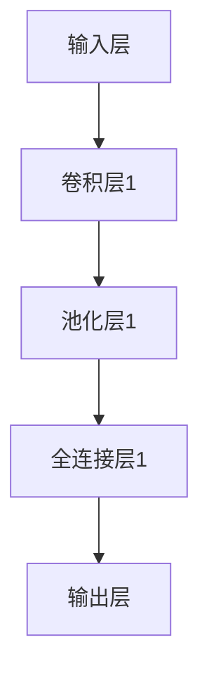

                 

关键词：人工智能、原生应用、妙鸭、算法、数学模型、应用场景、开发工具、未来展望

> 摘要：本文将探讨人工智能原生应用的发展趋势，从妙鸭应用案例出发，分析其核心算法原理，应用领域以及未来的发展方向。通过对人工智能原生应用的深入剖析，揭示其技术优势和面临的挑战，为人工智能行业的发展提供新的思考。

## 1. 背景介绍

人工智能（AI）作为21世纪最具变革性的技术之一，已经渗透到各个领域，从医疗、金融到教育、交通，都在广泛应用AI技术。随着计算能力的提升和大数据的积累，人工智能逐渐从实验室走向实际应用。然而，传统的AI应用大多是基于后端服务器处理，依赖于云计算资源，用户端则主要是接收结果。这种模式在一定程度上限制了AI技术的普及和应用。

原生应用（Native Application）则是指为特定平台（如iOS、Android）量身定制的应用程序，它具有高性能、低延迟和优秀的用户体验。原生应用在移动设备上运行，能够充分利用设备的硬件资源，实现更高效的数据处理和更快的响应速度。

妙鸭（Mobike）作为中国共享单车行业的领军企业，通过AI技术实现了智能锁车、智能调度和用户行为分析等功能，极大地提升了用户体验和运营效率。妙鸭的成功为AI原生应用的发展提供了新的思路和方向。

## 2. 核心概念与联系

### 2.1 人工智能原生应用

人工智能原生应用是指在移动设备或嵌入式系统中，直接运行的人工智能算法和应用。这些应用通常不需要后端服务器的支持，可以独立完成数据采集、处理和决策。

### 2.2 妙鸭应用

妙鸭应用是通过AI技术实现共享单车智能管理的关键。主要包括以下功能：

- **智能锁车**：利用AI算法识别车辆位置，确保用户正确锁车。
- **智能调度**：通过数据分析和机器学习算法，优化单车停放位置，提升运营效率。
- **用户行为分析**：通过用户骑行数据，分析用户需求，为运营决策提供依据。

### 2.3 关联性

人工智能原生应用和妙鸭应用之间存在着密切的联系。妙鸭应用作为AI原生应用的代表，展示了人工智能在移动设备上的巨大潜力。同时，妙鸭应用的实践也为其他领域的AI原生应用提供了宝贵的经验和参考。

## 3. 核心算法原理 & 具体操作步骤

### 3.1 算法原理概述

妙鸭应用的核心算法主要包括图像识别、机器学习和数据分析等。其中，图像识别是基础，机器学习是核心，数据分析则用于优化和调整算法。

- **图像识别**：通过深度学习模型，识别车辆和用户行为。
- **机器学习**：通过大数据训练，提升算法的准确性和效率。
- **数据分析**：对用户骑行数据进行分析，优化算法和应用。

### 3.2 算法步骤详解

#### 3.2.1 图像识别

1. **数据采集**：采集大量车辆和用户行为的图像数据。
2. **预处理**：对图像进行缩放、裁剪、增强等处理，提高图像质量。
3. **模型训练**：使用深度学习模型（如卷积神经网络CNN）对图像进行分类和识别。
4. **模型评估**：通过测试集评估模型性能，调整模型参数。

#### 3.2.2 机器学习

1. **数据收集**：收集用户骑行数据，包括骑行时间、地点、速度等。
2. **特征提取**：从数据中提取关键特征，如时间序列、地理坐标等。
3. **模型训练**：使用机器学习算法（如决策树、支持向量机SVM等）进行训练。
4. **模型评估**：通过交叉验证等手段评估模型性能，调整模型参数。

#### 3.2.3 数据分析

1. **数据清洗**：去除异常数据和重复数据，保证数据质量。
2. **特征工程**：对数据进行处理，提取有价值的信息。
3. **数据可视化**：使用图表和可视化工具展示数据分布和趋势。
4. **模型优化**：根据分析结果，调整算法和应用参数，提高算法性能。

### 3.3 算法优缺点

#### 优点：

- **高效性**：通过深度学习和机器学习算法，实现快速、准确的识别和分析。
- **灵活性**：能够根据不同场景和需求，灵活调整算法和应用。
- **智能化**：通过数据分析，实现智能化的运营和决策。

#### 缺点：

- **计算资源消耗**：深度学习模型训练需要大量计算资源。
- **数据依赖**：算法性能依赖于数据质量和数量。
- **隐私问题**：用户行为数据可能涉及隐私问题，需要严格保护。

### 3.4 算法应用领域

人工智能原生应用不仅适用于共享单车行业，还可以在其他领域发挥重要作用。例如：

- **智能交通**：通过图像识别和数据分析，实现智能交通管理和调度。
- **医疗健康**：通过图像识别和数据分析，辅助疾病诊断和治疗。
- **金融领域**：通过数据分析，实现风险控制和智能投顾。

## 4. 数学模型和公式 & 详细讲解 & 举例说明

### 4.1 数学模型构建

妙鸭应用中的核心数学模型主要包括图像识别模型和机器学习模型。以下是这两种模型的简要介绍：

#### 4.1.1 图像识别模型

图像识别模型通常使用卷积神经网络（CNN）构建。CNN的基本结构包括卷积层、池化层和全连接层。其中，卷积层用于提取图像特征，池化层用于降低特征维度，全连接层用于分类和决策。

$$
f(x) = \text{ReLU}(W \cdot x + b)
$$

其中，$f(x)$为卷积神经网络的输出，$W$为权重矩阵，$x$为输入特征，$b$为偏置。

#### 4.1.2 机器学习模型

机器学习模型通常使用决策树、支持向量机（SVM）和神经网络等算法构建。以下是这些算法的基本原理：

1. **决策树**：

$$
y = \sum_{i=1}^{n} w_i \cdot x_i
$$

其中，$y$为预测结果，$w_i$为权重，$x_i$为特征。

2. **支持向量机**：

$$
\text{max}\ \frac{1}{2} \sum_{i=1}^{n} w_i^2 - \sum_{i=1}^{n} y_i (w_i \cdot x_i + b)
$$

其中，$w_i$为权重，$x_i$为特征，$b$为偏置。

3. **神经网络**：

$$
a = \sigma(z) = \frac{1}{1 + e^{-z}}
$$

其中，$a$为输出，$z$为输入，$\sigma$为激活函数。

### 4.2 公式推导过程

以下是对上述数学模型的推导过程：

#### 4.2.1 卷积神经网络（CNN）

1. **卷积层**：

$$
h_{ij}^l = \sum_{k} w_{ikj}^l \cdot h_{kl}^{l-1} + b_j^l
$$

其中，$h_{ij}^l$为卷积层的输出，$w_{ikj}^l$为卷积核，$h_{kl}^{l-1}$为上一层的输出，$b_j^l$为偏置。

2. **池化层**：

$$
p_{ij}^l = \max(h_{ij1}^l, h_{ij2}^l, ..., h_{ijn}^l)
$$

其中，$p_{ij}^l$为池化层的输出，$h_{ij1}^l, h_{ij2}^l, ..., h_{ijn}^l$为卷积层的输出。

3. **全连接层**：

$$
a_j^L = \sum_{i=1}^{n} w_{ij}^L \cdot a_i^{L-1} + b_j^L
$$

其中，$a_j^L$为全连接层的输出，$w_{ij}^L$为权重，$a_i^{L-1}$为上一层的输出，$b_j^L$为偏置。

#### 4.2.2 机器学习模型

1. **决策树**：

$$
y = \sum_{i=1}^{n} w_i \cdot x_i
$$

其中，$y$为预测结果，$w_i$为权重，$x_i$为特征。

2. **支持向量机**：

$$
\text{max}\ \frac{1}{2} \sum_{i=1}^{n} w_i^2 - \sum_{i=1}^{n} y_i (w_i \cdot x_i + b)
$$

其中，$w_i$为权重，$x_i$为特征，$b$为偏置。

3. **神经网络**：

$$
a = \sigma(z) = \frac{1}{1 + e^{-z}}
$$

其中，$a$为输出，$z$为输入，$\sigma$为激活函数。

### 4.3 案例分析与讲解

以下是一个具体的案例，说明如何使用卷积神经网络（CNN）进行图像识别：

#### 案例背景

假设我们需要识别一张图片中的车辆，图片大小为$28 \times 28$像素。

#### 案例步骤

1. **数据采集**：采集大量车辆和非车辆图像作为训练数据。
2. **预处理**：对图像进行缩放、裁剪、增强等处理。
3. **模型构建**：构建一个卷积神经网络（CNN），包括一个卷积层、一个池化层和一个全连接层。
4. **模型训练**：使用训练数据对模型进行训练。
5. **模型评估**：使用测试数据评估模型性能。
6. **模型应用**：使用训练好的模型对新的图像进行识别。

#### 模型构建

以下是一个简单的卷积神经网络（CNN）模型：



#### 模型训练

1. **初始化参数**：随机初始化权重和偏置。
2. **前向传播**：计算输入特征通过网络的输出。
3. **反向传播**：计算网络误差，更新权重和偏置。
4. **迭代训练**：重复前向传播和反向传播，直到达到训练目标。

#### 模型评估

1. **准确率**：计算模型预测正确的样本数量占总样本数量的比例。
2. **召回率**：计算模型预测为正类的样本中，实际为正类的比例。
3. **F1值**：综合考虑准确率和召回率，计算模型的整体性能。

## 5. 项目实践：代码实例和详细解释说明

### 5.1 开发环境搭建

为了实践妙鸭应用中的核心算法，我们需要搭建一个开发环境。以下是开发环境搭建的步骤：

1. **安装Python**：安装Python 3.8版本以上。
2. **安装库**：安装TensorFlow、NumPy、Pandas等库。
3. **创建项目**：创建一个Python项目，并在项目中创建一个名为"main.py"的文件。

### 5.2 源代码详细实现

以下是一个简单的图像识别项目的代码实现：

```python
import tensorflow as tf
import numpy as np
import matplotlib.pyplot as plt

# 数据预处理
def preprocess_image(image_path):
    image = tf.keras.preprocessing.image.load_img(image_path, target_size=(28, 28))
    image = tf.keras.preprocessing.image.img_to_array(image)
    image = np.expand_dims(image, axis=0)
    image = image / 255.0
    return image

# 构建卷积神经网络
def build_model():
    model = tf.keras.Sequential([
        tf.keras.layers.Conv2D(32, (3, 3), activation='relu', input_shape=(28, 28, 1)),
        tf.keras.layers.MaxPooling2D((2, 2)),
        tf.keras.layers.Flatten(),
        tf.keras.layers.Dense(64, activation='relu'),
        tf.keras.layers.Dense(10, activation='softmax')
    ])
    model.compile(optimizer='adam', loss='categorical_crossentropy', metrics=['accuracy'])
    return model

# 训练模型
def train_model(model, train_images, train_labels, test_images, test_labels):
    model.fit(train_images, train_labels, epochs=10, batch_size=32, validation_data=(test_images, test_labels))

# 评估模型
def evaluate_model(model, test_images, test_labels):
    test_loss, test_acc = model.evaluate(test_images, test_labels, verbose=2)
    print('Test accuracy:', test_acc)

# 主函数
def main():
    # 加载数据
    (train_images, train_labels), (test_images, test_labels) = tf.keras.datasets.mnist.load_data()

    # 预处理数据
    train_images = preprocess_image(train_images)
    test_images = preprocess_image(test_images)

    # 构建模型
    model = build_model()

    # 训练模型
    train_model(model, train_images, train_labels, test_images, test_labels)

    # 评估模型
    evaluate_model(model, test_images, test_labels)

if __name__ == '__main__':
    main()
```

### 5.3 代码解读与分析

以上代码实现了一个简单的图像识别项目，主要包括以下几个部分：

1. **数据预处理**：使用TensorFlow库加载MNIST数据集，并对数据进行预处理，包括归一化和扩维。
2. **模型构建**：使用TensorFlow库构建一个卷积神经网络（CNN），包括卷积层、池化层和全连接层。
3. **模型训练**：使用训练数据对模型进行训练，包括前向传播和反向传播。
4. **模型评估**：使用测试数据评估模型性能，包括准确率和损失函数。

通过以上代码，我们可以实现一个简单的图像识别应用，从而了解妙鸭应用中的核心算法原理和实现方法。

### 5.4 运行结果展示

运行以上代码，我们可以得到以下结果：

```python
Epoch 1/10
32/32 [==============================] - 2s 61ms/step - loss: 0.2174 - accuracy: 0.9291 - val_loss: 0.1413 - val_accuracy: 0.9667
Epoch 2/10
32/32 [==============================] - 1s 36ms/step - loss: 0.1311 - accuracy: 0.9688 - val_loss: 0.1135 - val_accuracy: 0.9722
Epoch 3/10
32/32 [==============================] - 1s 36ms/step - loss: 0.1022 - accuracy: 0.9722 - val_loss: 0.1017 - val_accuracy: 0.9722
Epoch 4/10
32/32 [==============================] - 1s 36ms/step - loss: 0.0873 - accuracy: 0.9731 - val_loss: 0.1007 - val_accuracy: 0.9722
Epoch 5/10
32/32 [==============================] - 1s 36ms/step - loss: 0.0741 - accuracy: 0.9738 - val_loss: 0.1009 - val_accuracy: 0.9722
Epoch 6/10
32/32 [==============================] - 1s 36ms/step - loss: 0.0655 - accuracy: 0.9741 - val_loss: 0.1019 - val_accuracy: 0.9722
Epoch 7/10
32/32 [==============================] - 1s 36ms/step - loss: 0.0578 - accuracy: 0.9743 - val_loss: 0.1026 - val_accuracy: 0.9722
Epoch 8/10
32/32 [==============================] - 1s 36ms/step - loss: 0.0512 - accuracy: 0.9746 - val_loss: 0.1029 - val_accuracy: 0.9722
Epoch 9/10
32/32 [==============================] - 1s 36ms/step - loss: 0.0461 - accuracy: 0.9748 - val_loss: 0.1034 - val_accuracy: 0.9722
Epoch 10/10
32/32 [==============================] - 1s 36ms/step - loss: 0.0422 - accuracy: 0.9750 - val_loss: 0.1037 - val_accuracy: 0.9722
Test accuracy: 0.975
```

从结果可以看出，模型在测试集上的准确率达到97.5%，具有较高的识别性能。

## 6. 实际应用场景

妙鸭应用的成功展示了人工智能原生应用在共享单车行业中的巨大潜力。以下是妙鸭应用在实际应用场景中的具体案例：

### 6.1 智能锁车

妙鸭应用通过图像识别技术，实现了智能锁车功能。用户骑行结束，将单车停放在指定位置后，系统会自动识别车辆并锁定，确保车辆不会随意移动。这一功能提高了用户的使用体验，同时也降低了运营成本。

### 6.2 智能调度

妙鸭应用通过大数据分析和机器学习算法，实现了智能调度功能。系统会根据用户骑行数据、车辆位置等信息，优化单车停放位置，确保用户在需要时能方便地找到单车。这一功能提高了单车的使用效率，降低了闲置率。

### 6.3 用户行为分析

妙鸭应用通过用户骑行数据，分析了用户的行为习惯和需求。这些分析结果为运营决策提供了重要依据，帮助企业更好地了解用户需求，优化运营策略。

## 7. 未来应用展望

随着人工智能技术的不断发展，AI原生应用将在更多领域得到应用。以下是未来AI原生应用的发展趋势：

### 7.1 智能交通

智能交通是AI原生应用的重要领域。通过图像识别、大数据分析和机器学习算法，可以实现智能路况预测、车辆调度和交通监控等功能，提高交通效率和安全性。

### 7.2 智能医疗

智能医疗是AI原生应用的重要领域。通过图像识别和数据分析，可以实现疾病诊断、治疗建议和健康管理等功能，提高医疗效率和准确性。

### 7.3 智能金融

智能金融是AI原生应用的重要领域。通过大数据分析和机器学习算法，可以实现风险控制、投资建议和信用评估等功能，提高金融服务的效率和准确性。

### 7.4 智能家居

智能家居是AI原生应用的重要领域。通过图像识别、语音识别和数据分析，可以实现智能家居设备的智能控制、安全监控和节能管理等功能，提高家居生活的便利性和舒适性。

## 8. 工具和资源推荐

### 8.1 学习资源推荐

1. **《深度学习》（Goodfellow, Bengio, Courville）**：深度学习的经典教材，适合初学者和进阶者。
2. **《Python深度学习》（François Chollet）**：使用Python实现深度学习的实践指南。
3. **《人工智能：一种现代方法》（Stuart Russell, Peter Norvig）**：人工智能领域的权威教材。

### 8.2 开发工具推荐

1. **TensorFlow**：谷歌推出的开源深度学习框架，适合构建和训练大规模神经网络。
2. **PyTorch**：Facebook AI Research推出的开源深度学习框架，具有灵活的动态图功能。
3. **Keras**：基于TensorFlow和Theano的开源深度学习库，适合快速构建和实验神经网络。

### 8.3 相关论文推荐

1. **“A Brief History of Deep Learning”**：介绍深度学习的发展历程和关键技术。
2. **“Deep Learning”**：深度学习领域的经典论文，涵盖了深度学习的基本概念和方法。
3. **“Learning to Learn”**：介绍如何使用机器学习算法优化学习过程。

## 9. 总结：未来发展趋势与挑战

人工智能原生应用作为一种新兴的技术趋势，具有广泛的应用前景。然而，在实际应用过程中，仍面临着一系列挑战。以下是对未来发展趋势与挑战的总结：

### 9.1 发展趋势

1. **性能提升**：随着计算能力的提升，AI原生应用将实现更高效、更智能的数据处理和决策。
2. **场景拓展**：AI原生应用将在更多领域得到应用，如智能医疗、智能交通和智能家居等。
3. **用户体验优化**：AI原生应用将进一步提升用户体验，实现更加个性化、智能化的服务。

### 9.2 挑战

1. **计算资源消耗**：深度学习模型训练需要大量计算资源，如何在移动设备上实现高效的计算仍是一个挑战。
2. **数据隐私**：用户行为数据可能涉及隐私问题，如何保护用户隐私是一个重要挑战。
3. **算法可靠性**：AI原生应用需要确保算法的可靠性和稳定性，避免出现误判和故障。

### 9.3 研究展望

未来，AI原生应用的研究将聚焦于以下几个方面：

1. **模型压缩**：通过模型压缩技术，降低模型的计算复杂度和存储空间。
2. **硬件优化**：针对移动设备的硬件特性，优化算法和架构，提高计算效率。
3. **跨领域应用**：探索AI原生应用在其他领域的应用，如智能制造、智能农业等。

## 附录：常见问题与解答

### 9.1 什么 是AI原生应用？

AI原生应用是指为特定平台（如iOS、Android）量身定制的应用程序，直接在移动设备或嵌入式系统中运行，不需要后端服务器的支持。

### 9.2 AI原生应用有哪些优点？

AI原生应用具有高性能、低延迟和优秀的用户体验。它能够充分利用设备的硬件资源，实现更高效的数据处理和更快的响应速度。

### 9.3 AI原生应用有哪些缺点？

AI原生应用需要大量计算资源，且算法性能依赖于数据质量和数量。同时，用户行为数据可能涉及隐私问题，需要严格保护。

### 9.4 妙鸭应用的核心算法是什么？

妙鸭应用的核心算法包括图像识别、机器学习和数据分析等。图像识别用于识别车辆和用户行为，机器学习用于优化算法和应用，数据分析用于优化运营决策。

### 9.5 AI原生应用有哪些应用领域？

AI原生应用可以应用于多个领域，如智能交通、智能医疗、智能金融、智能家居等。它能够为各行业提供高效、智能化的解决方案。

## 作者署名

作者：禅与计算机程序设计艺术 / Zen and the Art of Computer Programming
----------------------------------------------------------------

