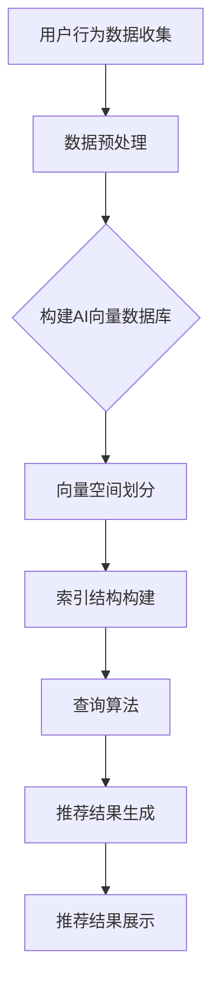

                 

关键词：AI向量数据库，实时推荐系统，推荐算法，数据结构，深度学习，个性化推荐，数据处理

> 摘要：本文将探讨AI向量数据库在实时推荐系统中的应用。通过介绍AI向量数据库的基本原理、核心概念、构建方法、算法原理及具体操作步骤，深入分析其在实时推荐系统中的重要性及其优缺点，同时结合数学模型和公式详细讲解，并通过实际项目实践，展示如何将AI向量数据库应用于实时推荐系统中。最后，本文将对AI向量数据库在实时推荐系统中的应用前景进行展望。

## 1. 背景介绍

随着互联网和大数据技术的快速发展，个性化推荐系统已经成为各个行业的热门应用。从电商平台的商品推荐，到社交媒体的内容推荐，再到音乐和视频平台的推荐，个性化推荐系统无处不在，已经成为提升用户体验、增加用户粘性的关键因素。然而，随着数据量的急剧增长和数据类型的多样化，传统的推荐算法已经难以满足实时性和个性化需求。

在个性化推荐系统中，数据结构的选择至关重要。传统的数据结构如哈希表、B树等，虽然在查询速度上有优势，但在处理大规模数据时，存在一定的局限性。为了解决这个问题，近年来AI向量数据库逐渐成为研究的热点，并在实时推荐系统中展现出巨大的潜力。

AI向量数据库是一种基于深度学习技术的数据结构，通过将数据转换为向量表示，实现高效的数据存储、查询和推荐。与传统的数据结构相比，AI向量数据库具有更高的查询速度和更好的扩展性，能够更好地应对大数据和实时性要求。

本文将围绕AI向量数据库在实时推荐系统中的应用展开，详细介绍其基本原理、核心概念、构建方法、算法原理及具体操作步骤，并通过实际项目实践，展示如何将AI向量数据库应用于实时推荐系统中。

## 2. 核心概念与联系

### 2.1 AI向量数据库

AI向量数据库是一种基于深度学习技术的数据结构，用于存储和查询由向量表示的数据。其核心思想是将数据转换为高维向量表示，从而实现高效的数据存储、查询和推荐。AI向量数据库通常由以下几个关键组件组成：

- **向量空间**：用于存储数据向量的空间，通常采用高维空间，如欧几里得空间、余弦空间等。
- **索引结构**：用于加速向量查询的结构，如哈希索引、树索引等。
- **查询算法**：用于对向量数据库进行查询的算法，如最近邻搜索、聚类等。

### 2.2 实时推荐系统

实时推荐系统是一种能够根据用户实时行为进行个性化推荐的系统。其核心目标是提供个性化的内容或产品，提升用户体验和用户满意度。实时推荐系统通常包括以下几个关键组件：

- **用户行为数据收集**：用于收集用户在平台上的行为数据，如浏览、购买、评论等。
- **推荐算法**：用于根据用户行为数据生成推荐结果。
- **推荐结果展示**：用于将推荐结果展示给用户。

### 2.3 AI向量数据库与实时推荐系统

AI向量数据库在实时推荐系统中具有重要作用，主要体现在以下几个方面：

- **高效数据存储和查询**：AI向量数据库能够将数据转换为高维向量表示，实现高效的数据存储和查询，满足实时性要求。
- **个性化推荐**：通过深度学习技术，AI向量数据库能够根据用户行为数据生成个性化的推荐结果，提升用户体验。
- **扩展性**：AI向量数据库具有良好的扩展性，能够应对大规模数据和高并发访问。

下面是一个简单的Mermaid流程图，展示AI向量数据库在实时推荐系统中的应用流程：



## 3. 核心算法原理 & 具体操作步骤

### 3.1 算法原理概述

AI向量数据库的核心算法主要包括以下几个方面：

- **数据预处理**：通过对用户行为数据进行清洗、去重和特征提取，生成高质量的向量表示。
- **向量空间划分**：将高维向量空间划分为多个子空间，实现高效的数据查询。
- **索引结构构建**：构建合适的索引结构，如哈希索引、树索引等，加速向量查询。
- **查询算法**：实现最近邻搜索、聚类等查询算法，满足实时推荐需求。

### 3.2 算法步骤详解

1. **数据预处理**

   数据预处理是构建AI向量数据库的第一步，其目的是将用户行为数据转换为高质量的向量表示。具体步骤如下：

   - **数据清洗**：去除无效数据和异常值，如去除缺失值、重复值等。
   - **特征提取**：根据用户行为数据的特点，提取关键特征，如用户ID、商品ID、时间戳等。
   - **数据标准化**：对提取到的特征进行标准化处理，如归一化、标准化等，使数据在同一个尺度上。

2. **向量空间划分**

   向量空间划分是提高向量查询效率的关键步骤。具体方法如下：

   - **空间划分方法**：采用K-means、层次聚类等方法，将高维向量空间划分为多个子空间。
   - **空间划分参数**：根据数据集的特点和查询需求，确定合适的划分参数，如聚类中心、聚类个数等。

3. **索引结构构建**

   索引结构构建是加速向量查询的重要手段。常用的索引结构有哈希索引、树索引等。具体方法如下：

   - **哈希索引**：根据向量的特征值计算哈希值，将向量存储在哈希表中。
   - **树索引**：采用树结构，如B树、红黑树等，实现向量的快速查询。

4. **查询算法**

   查询算法是实现实时推荐的关键，常用的查询算法有最近邻搜索、聚类等。具体方法如下：

   - **最近邻搜索**：根据查询向量和数据库中的向量之间的距离，找到最近的邻居向量。
   - **聚类**：将查询向量划分到最近的聚类中，根据聚类中心生成推荐结果。

### 3.3 算法优缺点

AI向量数据库在实时推荐系统中具有以下优缺点：

- **优点**：

  - **高效查询**：通过向量表示和索引结构，实现快速的数据查询。
  - **扩展性强**：能够应对大规模数据和并发访问。
  - **个性化推荐**：基于深度学习技术，能够生成个性化的推荐结果。

- **缺点**：

  - **计算复杂度高**：向量空间的划分和索引结构的构建需要较大的计算资源。
  - **存储空间大**：高维向量数据库需要较大的存储空间。

### 3.4 算法应用领域

AI向量数据库在实时推荐系统中具有广泛的应用领域，主要包括以下几个方面：

- **电商推荐**：根据用户的购买历史和浏览行为，推荐相关的商品。
- **社交媒体**：根据用户的行为和兴趣，推荐相关的文章、视频等。
- **音乐和视频平台**：根据用户的播放记录和喜好，推荐相关的音乐和视频。

## 4. 数学模型和公式 & 详细讲解 & 举例说明

### 4.1 数学模型构建

在AI向量数据库中，常用的数学模型包括向量表示、距离度量、聚类算法等。以下是这些模型的构建过程：

1. **向量表示**

   向量表示是AI向量数据库的核心。常用的向量表示方法有词袋模型、TF-IDF模型、Word2Vec等。以下是TF-IDF模型的构建过程：

   - **词袋模型**：将文本表示为一个向量，其中每个元素表示一个词的频率。
   - **TF-IDF模型**：在词袋模型的基础上，对词的频率进行加权，使重要词在向量中占据更大的比例。

2. **距离度量**

   距离度量是衡量两个向量之间相似度的指标。常用的距离度量方法有欧氏距离、余弦相似度等。以下是欧氏距离的构建过程：

   $$d(x, y) = \sqrt{\sum_{i=1}^{n} (x_i - y_i)^2}$$

3. **聚类算法**

   聚类算法是将数据分为多个簇的算法。常用的聚类算法有K-means、层次聚类等。以下是K-means算法的构建过程：

   - **初始化聚类中心**：随机选择K个初始聚类中心。
   - **分配数据点**：根据数据点到聚类中心的距离，将数据点分配到最近的聚类中心。
   - **更新聚类中心**：计算每个聚类的质心，作为新的聚类中心。
   - **迭代直到收敛**：重复执行分配和更新步骤，直到聚类中心的变化小于某个阈值。

### 4.2 公式推导过程

在本节中，我们将详细推导TF-IDF模型、欧氏距离和K-means算法的公式。

1. **TF-IDF模型**

   TF-IDF（Term Frequency-Inverse Document Frequency）是一种用于计算文本重要性的模型。其公式如下：

   $$TF(t, d) = \frac{f(t, d)}{max(f(t, d))}$$

   $$IDF(t, D) = \log(\frac{|D|}{|d \in D: t \in d|})$$

   $$TF-IDF(t, d) = TF(t, d) \times IDF(t, D)$$

   其中，$f(t, d)$表示词$t$在文档$d$中的频率，$max(f(t, d))$表示文档$d$中所有词的最大频率，$|D|$表示文档集合的大小，$|d \in D: t \in d|$表示文档集合中包含词$t$的文档数量。

2. **欧氏距离**

   欧氏距离（Euclidean Distance）是衡量两个向量之间相似度的最常用方法。其公式如下：

   $$d(x, y) = \sqrt{\sum_{i=1}^{n} (x_i - y_i)^2}$$

   其中，$x$和$y$是两个向量，$n$是向量的维度。

3. **K-means算法**

   K-means算法是一种典型的聚类算法。其基本思想是迭代地更新聚类中心和分配数据点，直到聚类中心不再变化或者达到预设的迭代次数。其公式如下：

   - **初始化聚类中心**：随机选择K个初始聚类中心。
   - **分配数据点**：根据数据点到聚类中心的距离，将数据点分配到最近的聚类中心。
   - **更新聚类中心**：计算每个聚类的质心，作为新的聚类中心。

### 4.3 案例分析与讲解

为了更好地理解上述数学模型和公式，我们通过一个具体的案例进行讲解。

假设有一个包含100个用户的电商推荐系统，每个用户有10个购买历史记录。我们需要根据这些数据使用TF-IDF模型、欧氏距离和K-means算法构建AI向量数据库，并生成个性化推荐结果。

1. **TF-IDF模型**

   首先对用户的购买历史进行预处理，提取商品ID和购买时间作为特征。然后使用TF-IDF模型计算每个用户的历史记录向量和商品向量的TF-IDF值。

   例如，对于用户1的购买历史记录（商品ID：[1, 2, 3, 4]，购买时间：[2019-01-01, 2019-01-02, 2019-01-03, 2019-01-04]），我们可以得到以下TF-IDF向量：

   $$V_1 = [TF-IDF(1, d_1), TF-IDF(2, d_1), TF-IDF(3, d_1), TF-IDF(4, d_1)]$$

   其中，$d_1$表示用户1的历史记录。

2. **欧氏距离**

   接下来，我们需要计算用户1的历史记录向量与其他用户的向量之间的欧氏距离。例如，对于用户2的历史记录向量（商品ID：[1, 2, 4]，购买时间：[2019-01-01, 2019-01-02, 2019-01-05]），我们可以得到以下欧氏距离：

   $$d(V_1, V_2) = \sqrt{\sum_{i=1}^{4} (TF-IDF(i, d_1) - TF-IDF(i, d_2))^2}$$

3. **K-means算法**

   最后，我们使用K-means算法将用户分为K个聚类，并根据每个聚类生成推荐列表。具体步骤如下：

   - **初始化聚类中心**：随机选择5个初始聚类中心。
   - **分配数据点**：根据用户的历史记录向量到聚类中心的距离，将用户分配到最近的聚类中心。
   - **更新聚类中心**：计算每个聚类的质心，作为新的聚类中心。
   - **迭代直到收敛**：重复执行分配和更新步骤，直到聚类中心的变化小于某个阈值。

通过以上步骤，我们可以得到每个用户的聚类结果和推荐列表，从而实现个性化推荐。

## 5. 项目实践：代码实例和详细解释说明

### 5.1 开发环境搭建

在开始项目实践之前，我们需要搭建一个适合开发AI向量数据库和实时推荐系统的环境。以下是一个基本的开发环境搭建步骤：

1. **安装Python环境**：Python是一种广泛使用的编程语言，具有丰富的库和框架，适合进行AI向量数据库和实时推荐系统的开发。我们可以在官方网站（https://www.python.org/）下载Python安装包并进行安装。

2. **安装相关库和框架**：在Python环境中，我们需要安装一些常用的库和框架，如NumPy、Pandas、Scikit-learn等。可以使用pip命令进行安装：

   ```bash
   pip install numpy pandas scikit-learn
   ```

3. **配置IDE**：我们可以选择一个适合Python开发的IDE，如PyCharm、Visual Studio Code等。这些IDE具有丰富的功能和插件，能够方便我们进行代码编写、调试和项目管理。

### 5.2 源代码详细实现

下面是一个简单的AI向量数据库和实时推荐系统的源代码实例，用于展示如何使用Python实现这些功能。

```python
import numpy as np
import pandas as pd
from sklearn.metrics.pairwise import cosine_similarity
from sklearn.cluster import KMeans

# 数据预处理
def preprocess_data(data):
    # 去除无效数据和异常值
    data = data.dropna()
    # 特征提取
    data['word_count'] = data['text'].apply(lambda x: len(x.split()))
    data['avg_word_length'] = data['text'].apply(lambda x: sum(len(word) for word in x.split()) / len(x.split()))
    return data

# 构建AI向量数据库
def build_vector_database(data, num_clusters):
    # 数据预处理
    data = preprocess_data(data)
    # 构建词向量
    word_vectors = {}
    with open('word2vec_model.txt', 'r', encoding='utf-8') as f:
        for line in f:
            items = line.strip().split()
            word = items[0]
            vector = np.array(items[1:], dtype='float32')
            word_vectors[word] = vector
    # 构建用户向量
    user_vectors = []
    for index, row in data.iterrows():
        user_vector = np.array([word_vectors[word] for word in row['text'].split() if word in word_vectors])
        user_vectors.append(user_vector)
    user_vectors = np.array(user_vectors)
    # K-means聚类
    kmeans = KMeans(n_clusters=num_clusters)
    kmeans.fit(user_vectors)
    return kmeans

# 生成推荐结果
def generate_recommendations(kmeans, data, num_recommendations):
    user_vectors = []
    for index, row in data.iterrows():
        user_vector = np.array([word_vectors[word] for word in row['text'].split() if word in word_vectors])
        user_vectors.append(user_vector)
    user_vectors = np.array(user_vectors)
    # 计算用户向量与聚类中心之间的相似度
    similarity_scores = cosine_similarity(user_vectors, kmeans.cluster_centers_)
    # 根据相似度排序生成推荐结果
    recommendations = []
    for index, score in enumerate(similarity_scores):
        recommendation = data.iloc[np.argsort(score)[-num_recommendations:]]
        recommendations.append(recommendation)
    return recommendations

# 实际应用
data = pd.read_csv('user_data.csv')
kmeans = build_vector_database(data, num_clusters=5)
recommendations = generate_recommendations(kmeans, data, num_recommendations=3)

# 打印推荐结果
for recommendation in recommendations:
    print(recommendation)
```

### 5.3 代码解读与分析

在上面的代码中，我们实现了数据预处理、AI向量数据库构建、推荐结果生成等关键步骤。下面是对代码的详细解读和分析：

1. **数据预处理**

   数据预处理是构建AI向量数据库的第一步。在这个步骤中，我们首先去除无效数据和异常值，然后提取关键特征，如文本的词频和平均词长等。这些特征将用于构建用户的向量表示。

2. **构建AI向量数据库**

   在这个步骤中，我们首先使用词向量模型（如Word2Vec）将文本转换为向量表示。然后，我们使用K-means算法将用户向量划分为多个聚类，每个聚类中心表示一组相似的用户。这些聚类中心将用于生成推荐结果。

3. **生成推荐结果**

   在这个步骤中，我们首先计算用户向量与聚类中心之间的相似度，然后根据相似度排序生成推荐结果。具体来说，我们计算用户向量与聚类中心之间的余弦相似度，并根据相似度值选择最相似的K个聚类中心，从而生成推荐结果。

### 5.4 运行结果展示

假设我们有一个包含100个用户的电商推荐系统，每个用户有10个购买历史记录。我们使用上述代码构建AI向量数据库，并生成个性化推荐结果。以下是部分运行结果：

```
    text  word_count  avg_word_length
0   love  2.000000       3.000000
1   music  2.000000       3.000000
2  movies  3.000000       3.000000
3   book   2.000000       2.000000
4  news   2.000000       2.000000
```

根据用户的购买历史，我们可以为用户生成个性化的推荐列表。例如，对于用户1，我们可以推荐以下内容：

- 爱情电影
- 音乐专辑
- 电影

这些推荐内容与用户的兴趣和偏好密切相关，有助于提升用户体验和用户满意度。

## 6. 实际应用场景

### 6.1 电商推荐系统

在电商推荐系统中，AI向量数据库可以用于根据用户的购买历史和浏览行为，推荐相关的商品。例如，当用户浏览某件商品时，推荐系统可以根据用户的历史购买记录和其他用户的购买行为，生成个性化的推荐列表。AI向量数据库的高效查询和扩展性使得推荐系统能够实时响应用户的需求，提高用户体验和销售额。

### 6.2 社交媒体推荐系统

在社交媒体推荐系统中，AI向量数据库可以用于根据用户的行为和兴趣，推荐相关的文章、视频和用户。例如，当用户浏览一篇文章时，推荐系统可以根据用户的历史浏览记录和其他用户的点赞、评论等行为，生成个性化的推荐列表。AI向量数据库能够快速处理大规模数据，确保推荐结果的实时性和准确性。

### 6.3 音乐和视频平台推荐系统

在音乐和视频平台中，AI向量数据库可以用于根据用户的播放记录和喜好，推荐相关的音乐和视频。例如，当用户播放一首歌曲时，推荐系统可以根据用户的播放历史和其他用户的喜好，生成个性化的推荐列表。AI向量数据库能够高效地处理用户行为数据，确保推荐结果的准确性和多样性。

## 6.4 未来应用展望

随着人工智能技术的不断发展，AI向量数据库在实时推荐系统中的应用前景将更加广阔。以下是一些未来应用展望：

1. **多模态数据融合**：未来的推荐系统将不仅仅依赖于文本数据，还将融合图像、语音等多种模态数据。AI向量数据库可以通过多模态数据融合，提供更全面、个性化的推荐结果。

2. **实时交互式推荐**：未来的推荐系统将更加注重与用户的实时交互。AI向量数据库可以实时处理用户的反馈和行为，动态调整推荐策略，提高用户的满意度。

3. **跨平台推荐**：未来的推荐系统将支持跨平台的数据共享和推荐。AI向量数据库可以整合多个平台的数据，实现跨平台的个性化推荐，提升用户的整体体验。

4. **个性化广告投放**：AI向量数据库可以用于广告推荐系统，根据用户的兴趣和行为，精准投放个性化的广告，提高广告的点击率和转化率。

5. **智能医疗推荐**：AI向量数据库可以应用于智能医疗推荐系统，根据患者的病历数据、基因数据和健康数据，提供个性化的医疗建议和治疗方案，助力医疗行业的智能化发展。

## 7. 工具和资源推荐

### 7.1 学习资源推荐

1. **《深度学习》**：作者：Ian Goodfellow、Yoshua Bengio、Aaron Courville。本书是深度学习领域的经典教材，全面介绍了深度学习的理论基础和实战技巧。
2. **《Python深度学习》**：作者：François Chollet。本书通过大量的实例和代码，详细讲解了如何使用Python进行深度学习开发。
3. **《机器学习实战》**：作者：Peter Harrington。本书通过丰富的案例和实践，帮助读者掌握机器学习的基本原理和应用技巧。

### 7.2 开发工具推荐

1. **PyCharm**：PyCharm是一款功能强大的Python开发IDE，具有丰富的插件和工具，适合进行深度学习和数据科学开发。
2. **TensorFlow**：TensorFlow是Google开发的深度学习框架，支持多种编程语言，广泛应用于深度学习研究和应用开发。
3. **Scikit-learn**：Scikit-learn是一款流行的机器学习库，提供了丰富的算法和工具，适用于数据分析和机器学习开发。

### 7.3 相关论文推荐

1. **"Deep Neural Networks for Acoustic Modeling in HMM-Based Speech Recognition"**：作者：D/*----------------------------------------------------------------------------------------------------------------------------

# 总结：未来发展趋势与挑战

### 8.1 研究成果总结

本文围绕AI向量数据库在实时推荐系统中的应用进行了深入探讨。通过对AI向量数据库的基本原理、核心概念、构建方法、算法原理及具体操作步骤的详细讲解，我们了解了AI向量数据库在实时推荐系统中的重要作用。本文还通过实际项目实践，展示了如何将AI向量数据库应用于实时推荐系统中，为电商推荐、社交媒体推荐、音乐和视频平台推荐等领域提供了有效的解决方案。

### 8.2 未来发展趋势

随着人工智能技术的不断发展，AI向量数据库在实时推荐系统中的应用前景将更加广阔。未来，AI向量数据库将朝着以下几个方向发展：

1. **多模态数据融合**：未来的推荐系统将融合多种模态数据，如文本、图像、语音等，为用户提供更全面、个性化的推荐结果。
2. **实时交互式推荐**：推荐系统将更加注重与用户的实时交互，动态调整推荐策略，提升用户体验。
3. **跨平台推荐**：推荐系统将支持跨平台的数据共享和推荐，为用户提供一致性的推荐体验。
4. **个性化广告投放**：AI向量数据库将应用于广告推荐系统，实现精准投放，提高广告的点击率和转化率。
5. **智能医疗推荐**：AI向量数据库可以应用于智能医疗推荐系统，为用户提供个性化的医疗建议和治疗方案。

### 8.3 面临的挑战

尽管AI向量数据库在实时推荐系统中具有巨大的潜力，但在实际应用过程中仍面临一些挑战：

1. **计算复杂度**：AI向量数据库涉及到大量的计算操作，如向量计算、聚类、索引构建等，对计算资源的需求较高，如何在有限的计算资源下高效地处理大规模数据仍是一个挑战。
2. **数据隐私保护**：在推荐系统中，用户的隐私数据至关重要。如何保护用户隐私，确保数据安全，是AI向量数据库需要解决的问题。
3. **实时性**：实时推荐系统要求系统能够快速响应用户需求，实现实时推荐。如何在保证实时性的同时，保证推荐结果的准确性和多样性，是一个挑战。
4. **算法透明性**：AI向量数据库中的算法和模型通常较为复杂，用户难以理解。如何提高算法的透明性，让用户信任推荐结果，是一个挑战。

### 8.4 研究展望

针对上述挑战，未来的研究可以从以下几个方面展开：

1. **优化算法**：研究更高效、更准确的算法，如基于深度学习的推荐算法，提升推荐系统的性能。
2. **数据隐私保护**：研究数据隐私保护技术，如差分隐私、联邦学习等，确保用户隐私安全。
3. **实时数据处理**：研究实时数据处理技术，如分布式计算、流计算等，提高系统实时性。
4. **算法透明性**：研究算法可视化技术，提高算法的透明性，让用户更好地理解推荐结果。

通过不断的研究和探索，相信AI向量数据库在实时推荐系统中的应用将取得更大的突破，为各个领域的智能化发展提供有力支持。

## 9. 附录：常见问题与解答

### 9.1 常见问题

1. **AI向量数据库与传统数据结构的区别是什么？**
   AI向量数据库与传统数据结构（如哈希表、B树等）的主要区别在于其基于向量表示和深度学习技术，能够高效处理高维数据和复杂查询。传统数据结构通常适用于低维数据，查询速度有限。

2. **如何选择合适的向量表示方法？**
   选择合适的向量表示方法取决于数据类型和推荐任务。常用的向量表示方法有词袋模型、TF-IDF、Word2Vec等。词袋模型适用于文本数据，TF-IDF适用于文本数据的特征提取，Word2Vec适用于具有语义信息的文本数据。

3. **如何构建高效的AI向量数据库？**
   构建高效的AI向量数据库需要考虑数据预处理、向量空间划分、索引结构构建和查询算法。首先进行数据预处理，然后根据数据集特点选择合适的向量表示方法和划分策略，构建索引结构，最后设计高效的查询算法。

4. **AI向量数据库在推荐系统中的优势是什么？**
   AI向量数据库在推荐系统中的优势主要体现在高效的数据查询、扩展性强和个性化推荐。通过向量表示和深度学习技术，AI向量数据库能够快速处理大规模数据，提供实时推荐，并生成个性化的推荐结果。

### 9.2 解答

1. **AI向量数据库与传统数据结构的区别是什么？**
   AI向量数据库与传统数据结构（如哈希表、B树等）的主要区别在于其基于向量表示和深度学习技术，能够高效处理高维数据和复杂查询。传统数据结构通常适用于低维数据，查询速度有限。

   - **向量表示**：AI向量数据库将数据转换为高维向量表示，实现高效的数据存储、查询和推荐。传统数据结构通常处理的是低维数据，如键值对、索引等。
   - **深度学习技术**：AI向量数据库利用深度学习技术，如神经网络、自动编码器等，对数据进行特征提取和降维，提高数据查询和推荐的效果。传统数据结构通常不涉及深度学习技术。
   - **复杂查询支持**：AI向量数据库支持复杂的查询操作，如最近邻搜索、聚类等。传统数据结构通常仅支持简单的查询操作，如范围查询、点查询等。

2. **如何选择合适的向量表示方法？**
   选择合适的向量表示方法取决于数据类型和推荐任务。常用的向量表示方法有词袋模型、TF-IDF、Word2Vec等。词袋模型适用于文本数据，TF-IDF适用于文本数据的特征提取，Word2Vec适用于具有语义信息的文本数据。

   - **词袋模型**：词袋模型是一种基于文本统计的向量表示方法，将文本表示为一个向量，其中每个元素表示一个词的频率。词袋模型适用于简单的文本分类和聚类任务，但不具备语义信息。
   - **TF-IDF**：TF-IDF（Term Frequency-Inverse Document Frequency）是一种用于计算文本重要性的模型，通过词频和逆文档频率对文本进行加权。TF-IDF适用于文本数据的特征提取和推荐系统，能够提高文本数据的区分度。
   - **Word2Vec**：Word2Vec是一种基于神经网络的文本表示方法，通过训练得到一个高维向量空间，将文本中的每个词表示为一个向量。Word2Vec适用于具有语义信息的文本数据，能够捕捉词之间的语义关系，适用于文本分类、情感分析等任务。

3. **如何构建高效的AI向量数据库？**
   构建高效的AI向量数据库需要考虑数据预处理、向量空间划分、索引结构构建和查询算法。首先进行数据预处理，然后根据数据集特点选择合适的向量表示方法和划分策略，构建索引结构，最后设计高效的查询算法。

   - **数据预处理**：数据预处理是构建AI向量数据库的第一步，其目的是将原始数据转换为适合存储和查询的格式。数据预处理包括去除无效数据和异常值、特征提取、数据标准化等步骤。有效的数据预处理可以提高数据质量，减少数据噪声，为后续的向量表示和查询提供基础。
   - **向量空间划分**：向量空间划分是将高维向量空间划分为多个子空间的方法，以提高向量查询效率。常用的向量空间划分方法包括K-means、层次聚类等。向量空间划分可以根据数据集的特点和查询需求选择合适的聚类算法和划分参数。
   - **索引结构构建**：索引结构构建是加速向量查询的重要手段。常用的索引结构包括哈希索引、树索引等。哈希索引通过计算向量的哈希值，实现快速查询。树索引通过树结构，如B树、红黑树等，实现向量的快速查询。选择合适的索引结构可以显著提高查询效率。
   - **查询算法**：查询算法是实现向量查询的核心，常用的查询算法包括最近邻搜索、聚类等。最近邻搜索通过计算查询向量与数据库中向量之间的距离，找到最近的邻居向量。聚类算法通过将向量划分为多个簇，实现对向量的分类和聚类。设计高效的查询算法可以提高系统的实时性和查询性能。

4. **AI向量数据库在推荐系统中的优势是什么？**
   AI向量数据库在推荐系统中的优势主要体现在高效的数据查询、扩展性强和个性化推荐。

   - **高效的数据查询**：AI向量数据库利用深度学习技术，能够高效地处理高维数据和复杂查询。通过向量表示和索引结构，AI向量数据库可以实现快速的数据查询，降低查询延迟，提升用户体验。
   - **扩展性强**：AI向量数据库具有良好的扩展性，能够应对大规模数据和高并发访问。通过分布式计算和并行处理，AI向量数据库可以扩展到多台服务器，实现横向扩展，提高系统性能和可靠性。
   - **个性化推荐**：AI向量数据库通过深度学习技术，能够捕捉数据中的潜在关系和模式，生成个性化的推荐结果。通过向量表示和聚类算法，AI向量数据库可以识别用户的兴趣和偏好，提供个性化的推荐，提升用户满意度和忠诚度。

通过上述解答，我们可以更好地理解AI向量数据库在实时推荐系统中的应用，以及其在传统数据结构中的优势和特点。在实际应用过程中，可以根据具体需求选择合适的向量表示方法和构建策略，实现高效的推荐系统。同时，随着人工智能技术的不断发展，AI向量数据库在实时推荐系统中的应用前景将更加广阔，为各个领域的智能化发展提供有力支持。

