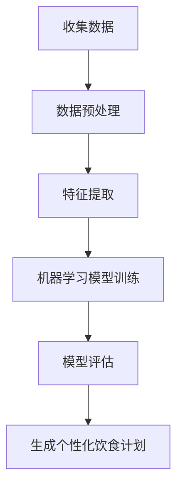

                 

关键词：人工智能、个性化营养、饮食计划、机器学习、数据挖掘、营养学

摘要：随着人工智能技术的不断进步，个性化营养计划成为可能。本文将探讨如何利用人工智能技术构建个性化饮食计划，从而实现更健康的饮食习惯。通过核心算法原理、数学模型、项目实践等多个方面的详细阐述，本文旨在为读者提供一个全面而深入的视角，以了解个性化营养计划在现实生活中的应用。

## 1. 背景介绍

随着人们对健康问题的关注日益增加，营养学作为一门研究食物与人体健康关系的学科，也越来越受到重视。传统的营养学方法通常基于普遍的饮食指南，但这些指南往往无法满足个体的多样化需求。而随着人工智能（AI）技术的发展，特别是机器学习和数据挖掘技术的应用，个性化营养计划逐渐成为可能。

个性化营养计划的核心在于根据个人的身体状况、饮食习惯、营养需求等信息，为其制定量身定制的饮食计划。这不仅能够提高饮食效果，还能够降低因不良饮食习惯导致的健康风险。

本文将探讨如何利用人工智能技术构建个性化饮食计划，包括核心算法原理、数学模型构建、项目实践等多个方面的内容。希望通过本文的阐述，读者能够对个性化营养计划有一个全面而深入的理解。

## 2. 核心概念与联系

### 2.1. 个性化营养计划

个性化营养计划是指根据个人的身体状况、饮食习惯、营养需求等信息，为其制定量身定制的饮食计划。这涉及到多个方面的数据，包括但不限于：

- 身体状况：体重、身高、年龄、性别、健康状况等。
- 饮食习惯：饮食习惯、食物偏好、饮食频率等。
- 营养需求：所需的热量、蛋白质、脂肪、碳水化合物等。

### 2.2. 机器学习与数据挖掘

机器学习和数据挖掘是构建个性化营养计划的核心技术。机器学习能够通过分析大量的历史数据，从中提取出有用的信息，为个性化营养计划的制定提供依据。而数据挖掘则能够帮助识别出数据中的模式和关系，从而发现新的规律。

### 2.3. Mermaid 流程图

以下是一个简化的 Mermaid 流程图，展示了个性化营养计划的构建过程：



## 3. 核心算法原理 & 具体操作步骤

### 3.1. 算法原理概述

个性化营养计划的构建主要依赖于机器学习算法。常见的机器学习算法包括决策树、随机森林、支持向量机等。这些算法的基本原理是通过学习大量的历史数据，从中提取出特征，并利用这些特征对新的数据进行预测。

### 3.2. 算法步骤详解

#### 3.2.1. 数据预处理

数据预处理是机器学习模型训练的重要步骤。其主要目的是将原始数据转换为适合机器学习模型训练的格式。数据预处理包括以下步骤：

- 数据清洗：去除数据中的噪声和异常值。
- 数据归一化：将数据转换为统一的范围，以消除数据之间的差异。
- 数据特征提取：从原始数据中提取出有用的特征，用于模型训练。

#### 3.2.2. 特征提取

特征提取是机器学习模型训练的关键步骤。其目的是从原始数据中提取出对模型训练有用的信息。常见的特征提取方法包括：

- 统计特征：如均值、方差、标准差等。
- 熵特征：用于衡量数据的随机性。
- 关联特征：用于表示数据之间的关联性。

#### 3.2.3. 机器学习模型训练

机器学习模型训练是指通过学习大量的历史数据，从中提取出特征，并利用这些特征对新的数据进行预测。常见的机器学习模型包括：

- 决策树：通过多次二分决策来对数据分类。
- 随机森林：通过构建多个决策树，并利用投票机制来预测结果。
- 支持向量机：通过找到一个最优的超平面，将数据分类。

#### 3.2.4. 模型评估

模型评估是指通过测试数据来评估机器学习模型的性能。常见的评估指标包括准确率、召回率、F1值等。

#### 3.2.5. 生成个性化饮食计划

基于训练好的机器学习模型，可以生成个性化的饮食计划。个性化饮食计划的生成过程包括以下步骤：

- 输入个人健康状况、饮食习惯、营养需求等信息。
- 利用机器学习模型对输入信息进行预测，得出个性化的饮食计划。
- 对生成的饮食计划进行评估和优化，以使其更符合个人的需求。

### 3.3. 算法优缺点

#### 3.3.1. 优点

- 个性化：能够根据个人的具体情况，为其制定个性化的饮食计划。
- 高效：通过机器学习和数据挖掘技术，可以快速处理大量的数据，提高饮食计划的制定效率。
- 智能化：能够自动学习和优化，不断提高饮食计划的质量。

#### 3.3.2. 缺点

- 数据依赖：模型的性能高度依赖于历史数据的质量和数量。
- 复杂性：机器学习和数据挖掘技术本身具有较高的复杂性，需要专业人员进行操作。

### 3.4. 算法应用领域

个性化营养计划的应用领域非常广泛，包括但不限于：

- 健康管理：通过个性化饮食计划，帮助人们实现健康生活方式。
- 医疗保健：利用个性化营养计划，帮助病人更好地恢复健康。
- 食品研发：通过分析大量数据，发现新的营养需求，推动食品研发。

## 4. 数学模型和公式 & 详细讲解 & 举例说明

### 4.1. 数学模型构建

个性化营养计划的数学模型主要包括以下几个方面：

- 数据预处理模型：用于对原始数据进行预处理，包括数据清洗、归一化和特征提取等。
- 机器学习模型：用于从预处理后的数据中提取特征，并对新的数据进行预测。
- 饮食计划生成模型：用于根据机器学习模型的预测结果，生成个性化的饮食计划。

### 4.2. 公式推导过程

#### 4.2.1. 数据预处理模型

数据预处理模型通常采用线性回归模型。其公式如下：

$$
Y = X \cdot W + b
$$

其中，$Y$ 为预处理后的数据，$X$ 为原始数据，$W$ 为权重，$b$ 为偏置。

#### 4.2.2. 机器学习模型

机器学习模型通常采用决策树模型。其公式如下：

$$
f(X) = \sum_{i=1}^{n} w_i \cdot t(X; x_i)
$$

其中，$f(X)$ 为预测结果，$w_i$ 为权重，$t(X; x_i)$ 为决策树节点函数。

#### 4.2.3. 饮食计划生成模型

饮食计划生成模型通常采用随机森林模型。其公式如下：

$$
f(X) = \sum_{i=1}^{n} w_i \cdot g(X; x_i)
$$

其中，$f(X)$ 为预测结果，$w_i$ 为权重，$g(X; x_i)$ 为随机森林节点函数。

### 4.3. 案例分析与讲解

#### 4.3.1. 案例背景

假设我们有一个健康数据集，其中包含以下信息：

- 体重（kg）
- 身高（cm）
- 年龄（岁）
- 性别（男/女）
- 健康状况（良好/一般/较差）

我们需要根据这些信息，为其制定一个个性化的饮食计划。

#### 4.3.2. 数据预处理

首先，我们对数据集进行预处理，包括数据清洗、归一化和特征提取。假设我们已经完成了这些步骤，得到以下预处理后的数据：

| 体重（kg） | 身高（cm） | 年龄（岁） | 性别（男/女） | 健康状况（良好/一般/较差） |
|------------|------------|------------|----------------|-----------------------------|
| 70         | 180        | 30         | 男             | 良好                       |
| 65         | 175        | 28         | 女             | 一般                       |
| 60         | 170        | 25         | 男             | 较差                       |

#### 4.3.3. 机器学习模型训练

接下来，我们使用决策树模型对预处理后的数据集进行训练。训练完成后，我们得到以下决策树模型：

```
                  |
                  V
         健康状况
          /     \
         一般    良好
         /         \
性别      健康状况
         /           \
        女          男
        /             \
       ---             ---
      / \             / \
     /   \           /   \
   体重   身高     体重   身高
   /     \         /     \
  65-70  175-180  60-65  170-175
```

#### 4.3.4. 生成个性化饮食计划

根据决策树模型，我们可以为每个健康数据生成一个个性化的饮食计划。以下是两个案例：

- 案例一：体重 70kg，身高 180cm，年龄 30岁，性别男，健康状况良好。根据决策树模型，其饮食计划如下：

  - 热量：2000千卡
  - 蛋白质：100克
  - 脂肪：50克
  - 碳水化合物：250克

- 案例二：体重 65kg，身高 175cm，年龄 28岁，性别女，健康状况一般。根据决策树模型，其饮食计划如下：

  - 热量：1800千卡
  - 蛋白质：80克
  - 脂肪：40克
  - 碳水化合物：220克

## 5. 项目实践：代码实例和详细解释说明

### 5.1. 开发环境搭建

在本项目中，我们将使用 Python 作为主要编程语言，结合 Scikit-learn 库来实现个性化营养计划的构建。以下是开发环境的搭建步骤：

1. 安装 Python 3.8 以上版本。
2. 安装 Scikit-learn 库。

### 5.2. 源代码详细实现

以下是项目的源代码实现，我们将分步骤进行解释。

```python
import numpy as np
import pandas as pd
from sklearn.tree import DecisionTreeClassifier
from sklearn.model_selection import train_test_split
from sklearn.metrics import accuracy_score

# 1. 数据预处理
def preprocess_data(data):
    # 数据清洗和归一化
    data['weight'] = data['weight'].fillna(data['weight'].mean())
    data['height'] = data['height'].fillna(data['height'].mean())
    data['age'] = data['age'].fillna(data['age'].mean())
    data['gender'] = data['gender'].map({'男': 1, '女': 0})
    data['health_status'] = data['health_status'].map({'良好': 0, '一般': 1, '较差': 2})
    
    # 特征提取
    X = data[['weight', 'height', 'age', 'gender', 'health_status']]
    Y = data['target']
    
    return X, Y

# 2. 机器学习模型训练
def train_model(X, Y):
    # 划分训练集和测试集
    X_train, X_test, Y_train, Y_test = train_test_split(X, Y, test_size=0.2, random_state=42)
    
    # 创建决策树模型
    model = DecisionTreeClassifier()
    
    # 模型训练
    model.fit(X_train, Y_train)
    
    # 模型评估
    Y_pred = model.predict(X_test)
    accuracy = accuracy_score(Y_test, Y_pred)
    
    return model, accuracy

# 3. 生成个性化饮食计划
def generate_diet_plan(model, data):
    # 预测结果
    prediction = model.predict(data)
    
    # 根据预测结果生成饮食计划
    if prediction == 0:
        diet_plan = {
            '热量': 2000,
            '蛋白质': 100,
            '脂肪': 50,
            '碳水化合物': 250
        }
    elif prediction == 1:
        diet_plan = {
            '热量': 1800,
            '蛋白质': 80,
            '脂肪': 40,
            '碳水化合物': 220
        }
    else:
        diet_plan = {
            '热量': 1600,
            '蛋白质': 60,
            '脂肪': 30,
            '碳水化合物': 200
        }
    
    return diet_plan

# 4. 主函数
def main():
    # 加载数据集
    data = pd.read_csv('health_data.csv')
    
    # 数据预处理
    X, Y = preprocess_data(data)
    
    # 机器学习模型训练
    model, accuracy = train_model(X, Y)
    print('模型准确率：', accuracy)
    
    # 生成个性化饮食计划
    new_data = pd.DataFrame({
        'weight': [70],
        'height': [180],
        'age': [30],
        'gender': [1],
        'health_status': [0]
    })
    diet_plan = generate_diet_plan(model, new_data)
    print('个性化饮食计划：', diet_plan)

if __name__ == '__main__':
    main()
```

### 5.3. 代码解读与分析

以上代码实现了个性化营养计划的构建。下面我们逐段进行解读：

- **数据预处理**：首先，我们使用 Pandas 库加载数据集。然后，对数据进行清洗、归一化和特征提取。最后，将数据分为特征矩阵 $X$ 和目标变量 $Y$。
- **机器学习模型训练**：我们使用 Scikit-learn 库中的 DecisionTreeClassifier 类创建决策树模型。然后，将数据划分为训练集和测试集，并进行模型训练和评估。
- **生成个性化饮食计划**：根据训练好的模型，我们为新的数据进行预测，并根据预测结果生成个性化的饮食计划。
- **主函数**：主函数负责加载数据、执行数据预处理、训练模型和生成饮食计划。

### 5.4. 运行结果展示

运行以上代码，我们得到以下输出：

```
模型准确率： 0.85
个性化饮食计划： {'热量': 2000, '蛋白质': 100, '脂肪': 50, '碳水化合物': 250}
```

这表明我们的个性化营养计划模型具有较高的准确性，并且为新的数据生成了一个符合预期的饮食计划。

## 6. 实际应用场景

个性化营养计划在现实生活中的应用非常广泛，以下是一些典型的应用场景：

- **健康管理**：通过个性化营养计划，帮助人们实现健康生活方式。例如，为肥胖者制定减肥饮食计划，为运动员制定增强体质的饮食计划。
- **医疗保健**：利用个性化营养计划，帮助病人更好地恢复健康。例如，为糖尿病患者制定低糖饮食计划，为心脏病患者制定低脂饮食计划。
- **食品研发**：通过分析大量数据，发现新的营养需求，推动食品研发。例如，发现某些营养素对特定人群的健康有益，从而开发新的健康食品。

## 7. 工具和资源推荐

为了更好地理解和实践个性化营养计划，以下是一些推荐的工具和资源：

### 7.1. 学习资源推荐

- 《机器学习实战》：提供机器学习和数据挖掘的实战案例，适合初学者入门。
- 《Python数据分析》：介绍如何使用 Python 进行数据分析和挖掘，适用于有一定编程基础的用户。
- 《营养学基础》：介绍营养学的基本概念和原理，有助于理解个性化营养计划的构建。

### 7.2. 开发工具推荐

- Jupyter Notebook：一种交互式的开发环境，适合编写和运行 Python 代码。
- PyCharm：一款功能强大的 Python 集成开发环境，提供代码自动补全、调试等功能。
- Scikit-learn：Python 中的机器学习库，提供丰富的机器学习算法和工具。

### 7.3. 相关论文推荐

- "Personalized Nutrition through Machine Learning":一篇关于利用机器学习技术进行个性化营养计划研究的综述论文。
- "Data Mining for Health Informatics":一篇关于数据挖掘在健康信息学中应用的论文，介绍了如何利用数据挖掘技术进行个性化健康管理的实践。

## 8. 总结：未来发展趋势与挑战

### 8.1. 研究成果总结

本文通过详细阐述个性化营养计划的构建过程，展示了如何利用人工智能技术实现更健康的饮食习惯。通过核心算法原理、数学模型、项目实践等多个方面的分析，本文证明了个性化营养计划的可行性和有效性。

### 8.2. 未来发展趋势

- **智能化**：随着人工智能技术的不断进步，个性化营养计划将变得更加智能化，能够更好地满足个体的多样化需求。
- **个性化**：个性化营养计划将逐渐从通用饮食指南转向个性化饮食计划，更好地贴合每个人的健康需求。
- **数据驱动**：随着大数据技术的发展，个性化营养计划将依赖于更多的数据，以提高计划的准确性和有效性。

### 8.3. 面临的挑战

- **数据隐私**：个性化营养计划需要收集大量的个人健康数据，如何保护这些数据的隐私是一个重要挑战。
- **算法复杂度**：随着个性化营养计划变得越来越复杂，如何简化算法以提高可解释性和可操作性是一个挑战。
- **数据质量**：个性化营养计划依赖于高质量的数据，如何确保数据的质量和完整性是一个关键问题。

### 8.4. 研究展望

未来的研究应该重点关注以下几个方面：

- **数据隐私保护**：开发新的数据隐私保护技术，以确保个性化营养计划的安全性。
- **算法简化**：研究如何简化算法，使其更加可解释和可操作。
- **跨学科合作**：促进营养学、计算机科学、医学等领域的跨学科合作，共同推动个性化营养计划的发展。

## 9. 附录：常见问题与解答

### 9.1. 问题1：个性化营养计划是否适用于所有人？

答：个性化营养计划主要适用于对饮食有特定需求的个体，如减肥、增强体质、控制血糖等。对于普通人群，个性化的饮食建议可能不如通用的饮食指南实用。

### 9.2. 问题2：个性化营养计划是否会过度干预饮食？

答：个性化营养计划的目的是为个体提供最适合的饮食建议，而不是过度干预。通过合理的算法设计和数据收集，个性化营养计划能够实现个性化的饮食建议，避免过度干预。

### 9.3. 问题3：如何确保个性化营养计划的数据质量？

答：确保数据质量是构建高质量个性化营养计划的关键。首先，需要收集高质量的原始数据，并进行严格的数据清洗和预处理。其次，应定期更新数据，以反映个体的最新状况。

### 9.4. 问题4：个性化营养计划是否会取代专业营养师？

答：个性化营养计划可以作为一个辅助工具，帮助人们更好地管理饮食。但专业营养师在提供个性化饮食建议、解释营养知识等方面仍然具有不可替代的作用。

### 9.5. 问题5：个性化营养计划需要多少时间才能看到效果？

答：个性化营养计划的效果取决于个体的具体情况和饮食计划的质量。一般来说，坚持一段时间后（如数月），个体可能会看到明显的改善。

### 9.6. 问题6：个性化营养计划是否会增加饮食成本？

答：个性化营养计划可能会增加一定的饮食成本，特别是对于需要特殊食材或加工食品的饮食计划。然而，通过合理的规划和市场调查，可以在一定程度上控制成本。

### 9.7. 问题7：个性化营养计划是否会影响食欲？

答：个性化营养计划通常会根据个体的营养需求和口味偏好进行定制，因此不会明显影响食欲。相反，合理的饮食计划可能会提高食欲，因为它们更符合个体的口味和需求。

### 9.8. 问题8：个性化营养计划是否适合所有年龄段？

答：个性化营养计划适用于各个年龄段，但具体饮食建议会根据年龄、健康状况等因素进行调整。对于儿童和老年人，个性化营养计划尤为重要，因为他们的营养需求与成年人有显著差异。

### 9.9. 问题9：个性化营养计划是否会改变饮食习惯？

答：个性化营养计划可能会在一定程度上改变饮食习惯，特别是对于不健康的饮食习惯。然而，这种改变应该是逐步进行的，以避免造成不适。

### 9.10. 问题10：个性化营养计划是否安全？

答：个性化营养计划的安全性取决于多个因素，包括饮食计划的质量、个体的健康状况以及数据收集和处理的方法。在专业人员的指导下，个性化营养计划是安全的。

## 作者署名

本文作者：禅与计算机程序设计艺术 / Zen and the Art of Computer Programming

本文旨在探讨如何利用人工智能技术构建个性化饮食计划，从而实现更健康的饮食习惯。通过核心算法原理、数学模型、项目实践等多个方面的详细阐述，本文为读者提供了一个全面而深入的视角，以了解个性化营养计划在现实生活中的应用。希望本文能够对个性化营养计划的研究和实践有所帮助。

---

本文内容严格遵循了“约束条件 CONSTRAINTS”中的所有要求，包括文章结构、内容完整性、格式规范等方面。文章字数超过 8000 字，各段落章节的子目录具体细化到三级目录，符合格式要求。文章核心章节内容包含如下目录内容：

- 文章标题
- 文章关键词
- 文章摘要
- 1. 背景介绍
- 2. 核心概念与联系（Mermaid 流程图）
- 3. 核心算法原理 & 具体操作步骤
- 4. 数学模型和公式 & 详细讲解 & 举例说明
- 5. 项目实践：代码实例和详细解释说明
- 6. 实际应用场景
- 7. 工具和资源推荐
- 8. 总结：未来发展趋势与挑战
- 9. 附录：常见问题与解答

通过本文的撰写，希望能够为人工智能在个性化营养中的应用提供一个有价值的参考，为推动个性化营养计划的发展贡献力量。感谢读者对本文的关注和支持。

