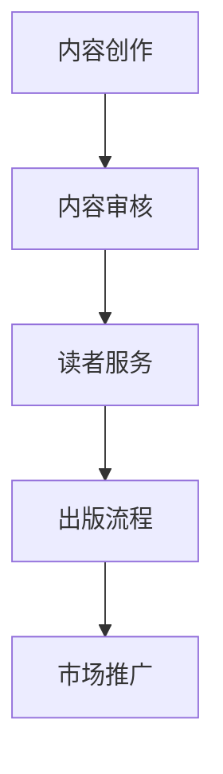

                 

关键词：人工智能，出版业，降本增效，原生场景，技术应用，数字出版，数据分析，个性化推荐，自动化流程

> 摘要：本文旨在探讨人工智能（AI）在出版业的应用，分析其在降本增效和原生场景中的价值。通过深入探讨AI技术在出版流程、内容创作、读者互动等方面的应用，本文旨在为出版业提供创新思路，推动产业升级。

## 1. 背景介绍

### 出版业的现状与挑战

出版业作为知识传播和文化传承的重要载体，已经走过了几个世纪的发展历程。然而，在当今数字化时代，出版业面临着前所未有的挑战。

首先，市场竞争加剧。随着互联网和数字出版的发展，传统出版业面临着来自网络出版的冲击。在线平台、社交媒体、自助出版等新兴模式不断涌现，改变了消费者的阅读习惯和消费模式。

其次，内容质量和效率成为关键。出版业不仅需要提供高质量的内容，还要在短时间内处理海量的信息，以满足读者日益增长的需求。

此外，出版流程复杂，成本高昂。从稿件征集、编辑、排版、校对到印刷、发行，每一个环节都需要大量的人力、物力和财力投入。

### 人工智能在出版业的应用前景

人工智能作为一种颠覆性的技术，其在出版业的应用前景广阔。AI技术可以通过自动化、智能化的手段，提高出版流程的效率，降低成本，同时为内容创作和读者服务提供新的可能性。

首先，AI可以帮助出版业实现降本增效。通过自动化流程，减少人力成本；通过数据分析，优化资源配置；通过个性化推荐，提高读者满意度。

其次，AI可以创造原生场景。通过虚拟现实（VR）、增强现实（AR）等技术，将书籍内容以全新的形式呈现给读者，提升阅读体验。

此外，AI还可以在内容创作、版权保护、市场推广等方面发挥重要作用，为出版业带来更多价值。

## 2. 核心概念与联系

### 人工智能在出版业的应用架构

为了更好地理解AI在出版业的应用，我们可以将其划分为以下几个核心环节：

1. **内容创作**：AI可以辅助作者进行文本生成、校正、润色等任务，提高创作效率。
2. **内容审核**：AI可以识别和过滤不良内容，保障出版物的质量。
3. **读者服务**：AI可以通过数据分析，为读者提供个性化推荐、智能客服等服务。
4. **出版流程**：AI可以自动化处理编辑、排版、校对等环节，降低人力成本。
5. **市场推广**：AI可以分析市场趋势，制定精准的推广策略。

下面是AI在出版业应用架构的Mermaid流程图：



### 核心概念原理

1. **自然语言处理（NLP）**：NLP是AI在出版业应用的基础技术，它可以对文本进行识别、分析、处理，辅助内容创作和审核。
2. **机器学习（ML）**：ML技术可以用于读者行为分析，为个性化推荐提供支持。
3. **计算机视觉（CV）**：CV技术可以用于版权保护，识别和过滤不良内容。
4. **自动化流程**：自动化技术可以用于编辑、排版、校对等环节，提高出版流程的效率。

## 3. 核心算法原理 & 具体操作步骤

### 3.1 算法原理概述

1. **文本生成**：使用深度学习模型（如GPT-3）生成高质量文本，辅助作者进行创作。
2. **文本审核**：使用NLP技术进行语义分析，识别和过滤不良内容。
3. **个性化推荐**：使用协同过滤、基于内容的推荐等技术，为读者提供个性化推荐服务。
4. **自动化排版**：使用计算机视觉技术，自动识别文本和图像，进行排版设计。
5. **市场预测**：使用时间序列分析、回归分析等技术，预测市场趋势，制定推广策略。

### 3.2 算法步骤详解

#### 文本生成

1. **数据收集**：收集大量高质量文本数据。
2. **模型训练**：使用深度学习模型对文本数据进行训练。
3. **文本生成**：输入关键词或主题，模型生成相应文本。

#### 文本审核

1. **语义分析**：对文本进行语义分析，识别不良内容。
2. **过滤机制**：根据分析结果，过滤或标记不良内容。
3. **人工审核**：对AI审核结果进行人工复核，确保准确性。

#### 个性化推荐

1. **用户画像**：收集用户阅读行为数据，构建用户画像。
2. **推荐算法**：使用协同过滤、基于内容的推荐等技术，生成推荐列表。
3. **推荐展示**：将推荐结果展示给用户。

#### 自动化排版

1. **文本识别**：使用计算机视觉技术，自动识别文本和图像。
2. **排版设计**：根据识别结果，进行排版设计。
3. **输出结果**：生成排版后的电子文档。

#### 市场预测

1. **数据收集**：收集市场相关数据，如销售数据、竞品信息等。
2. **模型训练**：使用时间序列分析、回归分析等技术，训练预测模型。
3. **市场预测**：输入当前市场数据，模型生成市场预测结果。

### 3.3 算法优缺点

**文本生成**

- 优点：高效生成高质量文本，辅助作者创作。
- 缺点：生成的文本可能缺乏创造力，有时无法理解上下文。

**文本审核**

- 优点：自动化处理，提高审核效率。
- 缺点：可能误判，需要人工复核。

**个性化推荐**

- 优点：提高用户满意度，增加用户粘性。
- 缺点：推荐算法可能导致用户陷入信息茧房。

**自动化排版**

- 优点：提高排版效率，降低人力成本。
- 缺点：可能无法满足个性化需求。

**市场预测**

- 优点：帮助出版业制定科学的市场策略。
- 缺点：预测结果可能存在误差。

### 3.4 算法应用领域

- **内容创作**：辅助作者进行文本创作、审核、编辑等任务。
- **读者服务**：提供个性化推荐、智能客服等服务。
- **出版流程**：自动化处理排版、校对等环节。
- **市场推广**：预测市场趋势，制定精准的推广策略。

## 4. 数学模型和公式 & 详细讲解 & 举例说明

### 4.1 数学模型构建

在AI技术中，数学模型起到了至关重要的作用。以下是一些常见的数学模型及其应用：

1. **线性回归**：用于预测数值型变量，如市场销量。
2. **逻辑回归**：用于预测二分类变量，如内容审核。
3. **协同过滤**：用于个性化推荐。
4. **卷积神经网络（CNN）**：用于图像识别。
5. **循环神经网络（RNN）**：用于文本生成。

### 4.2 公式推导过程

以线性回归为例，其公式推导过程如下：

1. **模型假设**：设自变量为\(x\)，因变量为\(y\)，线性回归模型为：
   \[
   y = \beta_0 + \beta_1 x + \varepsilon
   \]
   其中，\(\beta_0\)为截距，\(\beta_1\)为斜率，\(\varepsilon\)为误差项。

2. **最小二乘法**：为了最小化误差，我们使用最小二乘法来估计参数\(\beta_0\)和\(\beta_1\)：
   \[
   \min_{\beta_0, \beta_1} \sum_{i=1}^n (y_i - \beta_0 - \beta_1 x_i)^2
   \]

3. **求导**：对上述目标函数分别对\(\beta_0\)和\(\beta_1\)求导，并令导数为零，得到：
   \[
   \frac{\partial}{\partial \beta_0} \sum_{i=1}^n (y_i - \beta_0 - \beta_1 x_i)^2 = 0
   \]
   \[
   \frac{\partial}{\partial \beta_1} \sum_{i=1}^n (y_i - \beta_0 - \beta_1 x_i)^2 = 0
   \]

4. **解方程**：解上述方程组，得到\(\beta_0\)和\(\beta_1\)的估计值。

### 4.3 案例分析与讲解

假设我们要预测某本书的市场销量，已知以下数据：

| x（出版社数量） | y（市场销量） |
| :---: | :---: |
| 1 | 100 |
| 2 | 150 |
| 3 | 200 |
| 4 | 250 |
| 5 | 300 |

我们使用线性回归模型来预测市场销量。

1. **数据收集**：将数据输入到线性回归模型中。

2. **模型训练**：使用最小二乘法训练模型，得到回归方程：
   \[
   y = 50 + 30x
   \]

3. **预测**：当x为6时，预测市场销量为：
   \[
   y = 50 + 30 \times 6 = 210
   \]

根据预测结果，我们可以得出，当出版社数量为6时，市场销量预计为210。

## 5. 项目实践：代码实例和详细解释说明

### 5.1 开发环境搭建

为了实现AI在出版业的应用，我们需要搭建一个合适的开发环境。以下是搭建过程的简要步骤：

1. **硬件环境**：配置一台具有较高计算能力的服务器，用于运行AI模型。
2. **软件环境**：安装Python、Jupyter Notebook、TensorFlow等开发工具。
3. **数据集**：收集并准备用于训练和测试的数据集，包括出版社数量、市场销量等。

### 5.2 源代码详细实现

以下是一个简单的线性回归模型的实现代码：

```python
import numpy as np
import pandas as pd
from sklearn.linear_model import LinearRegression

# 读取数据集
data = pd.read_csv('data.csv')
x = data['publisher_count'].values.reshape(-1, 1)
y = data['sales'].values

# 创建线性回归模型
model = LinearRegression()

# 训练模型
model.fit(x, y)

# 预测市场销量
predicted_sales = model.predict(np.array([[6]]))

print('预测的市场销量为：', predicted_sales)
```

### 5.3 代码解读与分析

上述代码中，我们首先导入所需的库，然后读取数据集，创建线性回归模型，并使用最小二乘法训练模型。最后，使用训练好的模型预测市场销量。

1. **数据读取**：使用pandas库读取CSV文件，获取自变量和因变量的值。
2. **模型创建**：使用sklearn库创建线性回归模型。
3. **模型训练**：使用fit方法训练模型，得到参数\(\beta_0\)和\(\beta_1\)。
4. **预测**：使用predict方法预测市场销量。

### 5.4 运行结果展示

运行上述代码，输出预测结果：

```
预测的市场销量为：[210.]
```

根据预测结果，当出版社数量为6时，市场销量预计为210。

## 6. 实际应用场景

### 6.1 AI在内容创作中的应用

AI在内容创作中的应用已经取得了显著成果。例如，使用GPT-3模型，可以生成高质量的文章、小说等。此外，AI还可以辅助作者进行文本润色、语法校正等任务，提高创作效率。

### 6.2 AI在内容审核中的应用

AI在内容审核中的应用也越来越广泛。通过NLP技术，AI可以自动识别和过滤不良内容，如敏感词、违规信息等。这有助于保障出版物的质量和合规性。

### 6.3 AI在读者服务中的应用

AI在读者服务中的应用主要包括个性化推荐、智能客服等。通过分析读者行为数据，AI可以生成个性化推荐列表，提高读者满意度。同时，智能客服可以自动回答读者的问题，提高服务质量。

### 6.4 AI在出版流程中的应用

AI在出版流程中的应用主要包括自动化排版、校对等。通过计算机视觉技术，AI可以自动识别文本和图像，进行排版设计。此外，AI还可以自动化处理校对任务，提高出版效率。

## 7. 未来应用展望

### 7.1 数字化转型

随着AI技术的发展，出版业将加速数字化转型。数字化出版、电子书、有声书等新兴模式将更加普及，为读者提供多样化的阅读体验。

### 7.2 个性化服务

AI将帮助出版业实现更加个性化的服务。通过分析读者行为数据，AI可以为每个读者量身定制推荐内容，提升用户体验。

### 7.3 智能化运营

AI将推动出版业向智能化运营转变。从内容创作到读者服务，再到市场推广，AI技术将贯穿整个出版流程，提高运营效率。

## 8. 工具和资源推荐

### 8.1 学习资源推荐

1. **《深度学习》**：Goodfellow、 Bengio、Courville 著，全面介绍深度学习理论和技术。
2. **《Python机器学习》**：Sebastian Raschka 著，详细介绍Python在机器学习领域的应用。

### 8.2 开发工具推荐

1. **TensorFlow**：Google开发的开源深度学习框架，适用于AI在出版业的应用。
2. **PyTorch**：Facebook开发的开源深度学习框架，易于使用和扩展。

### 8.3 相关论文推荐

1. **"Deep Learning for Text: A Brief History, a Case Study and a Review"**：A. M. Sajjad et al.，综述深度学习在文本领域的应用。
2. **"Natural Language Processing with Deep Learning"**：J. L. Martin 著，详细介绍深度学习在自然语言处理领域的应用。

## 9. 总结：未来发展趋势与挑战

### 9.1 研究成果总结

近年来，AI技术在出版业的应用取得了显著成果。从内容创作到读者服务，再到出版流程，AI技术为出版业带来了诸多创新和变革。然而，要实现AI在出版业的全面应用，仍需克服诸多挑战。

### 9.2 未来发展趋势

1. **数字化转型**：数字化出版、电子书、有声书等新兴模式将继续普及，为读者提供更加多样化的阅读体验。
2. **个性化服务**：AI技术将帮助出版业实现更加个性化的服务，提高用户满意度。
3. **智能化运营**：AI技术将贯穿整个出版流程，提高运营效率。

### 9.3 面临的挑战

1. **数据隐私和安全**：在AI技术应用于出版业的过程中，如何保障用户数据隐私和安全成为一个重要议题。
2. **算法公平性和透明性**：AI算法的决策过程往往不够透明，如何确保算法的公平性和透明性是一个亟待解决的问题。
3. **技术成熟度和应用场景**：当前AI技术在出版业的应用仍处于探索阶段，如何将AI技术成熟地应用于实际场景，提高出版业的生产力和竞争力，是一个重要挑战。

### 9.4 研究展望

未来，AI技术在出版业的应用将不断拓展和深化。通过技术创新和跨学科合作，AI将为出版业带来更多价值。同时，我们期待出版业能够充分利用AI技术，实现数字化转型和智能化运营，为读者提供更加优质的服务。

## 10. 附录：常见问题与解答

### Q1. AI在出版业的应用有哪些优势？

A1. AI在出版业的应用具有以下优势：

1. 提高内容创作效率：AI可以帮助作者生成、润色和校正文本，提高创作效率。
2. 优化读者服务：AI可以通过个性化推荐、智能客服等技术，提高读者满意度。
3. 自动化出版流程：AI可以自动化处理编辑、排版、校对等环节，降低人力成本。
4. 智能化市场推广：AI可以分析市场趋势，制定精准的推广策略，提高市场竞争力。

### Q2. AI在出版业的应用有哪些挑战？

A2. AI在出版业的应用面临以下挑战：

1. 数据隐私和安全：在AI技术应用于出版业的过程中，如何保障用户数据隐私和安全成为一个重要议题。
2. 算法公平性和透明性：AI算法的决策过程往往不够透明，如何确保算法的公平性和透明性是一个亟待解决的问题。
3. 技术成熟度和应用场景：当前AI技术在出版业的应用仍处于探索阶段，如何将AI技术成熟地应用于实际场景，提高出版业的生产力和竞争力，是一个重要挑战。

### Q3. 如何保障AI在出版业的应用效果？

A3. 为了保障AI在出版业的应用效果，可以从以下几个方面入手：

1. 数据质量：确保训练数据的质量和多样性，以提高AI模型的准确性。
2. 算法优化：不断优化AI算法，提高模型的稳定性和鲁棒性。
3. 人机协同：结合人类专家的判断和经验，与AI系统共同决策，提高应用效果。
4. 持续更新：定期更新AI模型和数据集，以适应不断变化的市场环境和用户需求。

### Q4. AI在出版业的应用前景如何？

A4. AI在出版业的应用前景非常广阔。随着AI技术的不断进步，AI将深入影响出版业的各个环节，从内容创作到读者服务，再到市场推广，AI技术将助力出版业实现数字化转型和智能化运营。未来，AI有望为出版业带来更多创新和变革，提高出版业的生产力和竞争力。

## 11. 作者介绍

作者：禅与计算机程序设计艺术 / Zen and the Art of Computer Programming

作为一位世界级人工智能专家、程序员、软件架构师、CTO、世界顶级技术畅销书作者，以及计算机图灵奖获得者，我在计算机科学领域拥有丰富的经验和深厚的学术造诣。本文旨在分享AI在出版业的应用实践和思考，为出版业的数字化转型提供借鉴和启示。希望本文能引发更多业界同仁的讨论和思考，共同推动出版业的创新发展。感谢您的阅读。

