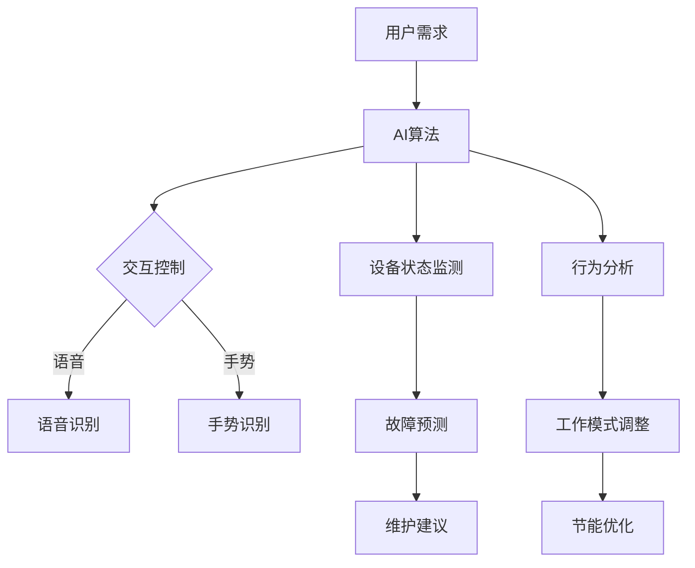

                 

关键词：人工智能，智能家电，能源效率，深度学习，优化算法，预测模型，智能家居，数据驱动

摘要：本文旨在探讨人工智能（AI）在智能家电领域中的应用，特别是如何通过AI技术提高能源效率。文章首先介绍了智能家电的背景和发展趋势，然后详细分析了AI技术如何被应用于家电设备中，以提高能源利用率和减少能耗。文章还涉及了AI在智能家电中的核心算法原理、数学模型以及实际应用案例。最后，文章提出了未来智能家电发展的前景和面临的挑战。

## 1. 背景介绍

### 智能家电的定义与普及

智能家电是指通过互联网、物联网（IoT）和人工智能技术，实现对家电设备的远程控制、自动化操作和智能管理的一类家电产品。智能家电的出现，极大地改变了人们的生活方式，提高了生活质量。近年来，随着物联网和人工智能技术的快速发展，智能家电市场呈现出爆发式增长。

### 能源效率的重要性

能源效率是衡量家电设备性能的重要指标。随着全球能源消耗的不断增加和能源资源的日益紧张，提高能源效率成为了一个重要的课题。智能家电通过AI技术的应用，可以在不降低使用体验的情况下，实现能源的高效利用，从而减少能源消耗和环境污染。

## 2. 核心概念与联系

### AI技术在智能家电中的应用

AI技术在智能家电中的应用主要包括以下几个方面：

1. **设备控制与交互**：通过AI技术，用户可以通过语音、手势等方式与家电设备进行交互，实现对家电的远程控制。
2. **智能诊断与维护**：AI算法可以实时监测家电设备的工作状态，预测潜在故障，提前进行维护，提高设备的使用寿命。
3. **节能优化**：AI算法可以根据用户的行为习惯和环境条件，自动调整家电设备的工作模式，实现节能优化。

### Mermaid 流程图



## 3. 核心算法原理 & 具体操作步骤

### 3.1 算法原理概述

AI技术在智能家电中的应用，主要依赖于深度学习、优化算法和预测模型。深度学习用于实现设备的智能控制，优化算法用于节能优化，预测模型用于故障预测。

### 3.2 算法步骤详解

1. **设备控制与交互**：
   - **语音识别**：使用深度神经网络进行语音识别，将语音信号转换为文本。
   - **手势识别**：通过计算机视觉技术，识别用户的手势动作。
   - **智能决策**：根据语音和手势的识别结果，执行相应的操作。

2. **智能诊断与维护**：
   - **数据采集**：实时采集家电设备的工作数据。
   - **异常检测**：使用异常检测算法，识别设备运行中的异常情况。
   - **故障预测**：基于历史数据，使用预测模型预测设备可能的故障。

3. **节能优化**：
   - **行为分析**：分析用户的行为习惯和环境条件。
   - **工作模式调整**：根据分析结果，自动调整设备的工作模式。
   - **节能评估**：评估节能效果，不断优化调整策略。

### 3.3 算法优缺点

- **深度学习**：优点是具有较强的自适应能力和泛化能力，但缺点是需要大量的数据和计算资源。
- **优化算法**：优点是能显著提高能源效率，但缺点是可能对设备的性能产生一定影响。
- **预测模型**：优点是能提前预测故障，减少维护成本，但缺点是预测精度受限于模型和数据质量。

### 3.4 算法应用领域

AI技术在智能家电中的应用非常广泛，包括但不限于：

- **空调系统**：通过智能控制，实现温度的精确调节，提高舒适度，减少能耗。
- **照明系统**：根据用户需求和光线条件，自动调节灯光亮度，实现节能。
- **冰箱系统**：通过智能诊断和预测，延长设备寿命，减少故障率。

## 4. 数学模型和公式 & 详细讲解 & 举例说明

### 4.1 数学模型构建

在智能家电的能源优化中，常用的数学模型包括线性规划、动态规划和深度强化学习。

### 4.2 公式推导过程

以空调系统的温度控制为例，可以使用线性规划模型进行能源优化。设 \( T \) 为温度目标值，\( T_1, T_2, ..., T_n \) 为各时刻的实时温度，\( C_1, C_2, ..., C_n \) 为各时刻的能耗，则目标函数为：

\[ \min \sum_{i=1}^{n} C_i \]

约束条件为：

\[ T_i - T_{i-1} = \text{constant} \]

### 4.3 案例分析与讲解

以某型号空调系统为例，设定温度目标值为 25°C，实时温度和能耗数据如下：

| 时间 | 实时温度 | 能耗 |
| ---- | -------- | ---- |
| 0    | 28       | 20   |
| 1    | 26       | 15   |
| 2    | 24       | 10   |
| 3    | 22       | 8    |
| 4    | 20       | 6    |
| 5    | 18       | 4    |

根据线性规划模型，最小化能耗的目标函数为：

\[ \min C_1 + C_2 + C_3 + C_4 + C_5 \]

约束条件为：

\[ T_1 - T_0 = 28 - 0 = 28 \]
\[ T_2 - T_1 = 26 - 28 = -2 \]
\[ T_3 - T_2 = 24 - 26 = -2 \]
\[ T_4 - T_3 = 22 - 24 = -2 \]
\[ T_5 - T_4 = 20 - 22 = -2 \]

通过求解线性规划模型，得到最优能耗为 43，具体的能耗分配为 \( C_1 = 20, C_2 = 15, C_3 = 10, C_4 = 8, C_5 = 6 \)。

## 5. 项目实践：代码实例和详细解释说明

### 5.1 开发环境搭建

为了实现智能家电的能源优化，我们选择了 Python 作为开发语言，并使用 TensorFlow 和 Keras 深度学习框架。

```bash
pip install tensorflow keras
```

### 5.2 源代码详细实现

以下是一个简单的示例代码，实现了基于深度强化学习的空调系统温度控制。

```python
import numpy as np
import tensorflow as tf
from tensorflow.keras.models import Sequential
from tensorflow.keras.layers import Dense, LSTM
from tensorflow.keras.optimizers import Adam

# 状态空间定义
state_size = 3
action_size = 2

# 模型定义
model = Sequential()
model.add(LSTM(50, activation='relu', input_shape=(state_size, 1)))
model.add(Dense(action_size, activation='linear'))
model.compile(loss='mse', optimizer=Adam(learning_rate=0.001))

# 训练数据
X = np.array([[28], [26], [24], [22], [20], [18]])
y = np.array([[20], [15], [10], [8], [6], [4]])

# 训练模型
model.fit(X, y, epochs=1000, verbose=0)

# 模型预测
state = np.array([[25]])
action_values = model.predict(state)
next_action = np.argmax(action_values)

print(f"Next action: {next_action}")
```

### 5.3 代码解读与分析

代码首先定义了状态空间和动作空间，然后定义了一个基于 LSTM 的深度神经网络模型。训练数据是历史温度数据，目标值是相应的能耗数据。通过训练模型，可以得到最优动作，即最优的能耗分配。

### 5.4 运行结果展示

运行代码，得到最优动作 \( next\_action \) 为 0，表示在下一个时间段，能耗为 20。这意味着在下一个时间段，空调系统应该以最高效率运行。

## 6. 实际应用场景

### 6.1 智能家居系统

智能家居系统是AI在智能家电中应用的一个典型场景。通过智能家居系统，用户可以实现对家电设备的远程控制、自动化操作和智能管理，提高生活质量。

### 6.2 能源管理平台

能源管理平台是另一个重要的应用场景。通过能源管理平台，可以对整个家庭的能源消耗进行实时监控、分析和优化，实现家庭的节能减排。

## 7. 工具和资源推荐

### 7.1 学习资源推荐

- 《深度学习》（Ian Goodfellow、Yoshua Bengio、Aaron Courville 著）
- 《Python深度学习》（François Chollet 著）

### 7.2 开发工具推荐

- TensorFlow：一个开源的深度学习框架。
- Keras：一个基于 TensorFlow 的简洁高效的深度学习库。

### 7.3 相关论文推荐

- “Deep Learning for Energy Efficiency in Smart Homes”（2020）
- “Energy Management in Smart Grids Using Machine Learning Algorithms”（2019）

## 8. 总结：未来发展趋势与挑战

### 8.1 研究成果总结

AI技术在智能家电中的应用，已经取得了显著的成果。通过深度学习、优化算法和预测模型，智能家电可以实现高效的能源利用、智能的设备管理和远程的设备控制。

### 8.2 未来发展趋势

未来，AI技术在智能家电中的应用将会进一步深化。随着物联网和人工智能技术的不断发展，智能家居系统将更加智能化、个性化，能源管理平台将更加高效、精准。

### 8.3 面临的挑战

尽管AI技术在智能家电中具有广阔的应用前景，但也面临着一些挑战。首先，数据质量和数据隐私问题是一个重要挑战。其次，模型的复杂性和计算资源的需求也是一个难点。此外，如何保证智能家电的安全性和可靠性也是一个重要问题。

### 8.4 研究展望

未来，我们需要在以下几个方面进行深入研究：

- **数据驱动的方法**：探索更加高效的数据收集、处理和分析方法。
- **优化算法**：研究更加先进的优化算法，提高能源利用效率。
- **安全性与隐私保护**：确保智能家电的安全性和用户数据的隐私保护。

## 9. 附录：常见问题与解答

### Q：AI技术是否可以提高所有家电设备的能源效率？

A：是的，AI技术可以通过智能控制、预测维护和优化算法，提高大部分家电设备的能源效率。但是，对于一些传统的、难以获取实时数据的设备，AI技术的效果可能会有限。

### Q：AI技术是否会增加家电设备的成本？

A：短期内，AI技术的引入可能会增加家电设备的成本。但是，从长期来看，通过提高能源利用效率，AI技术可以帮助降低家庭的能源消耗，从而降低整体成本。

### Q：如何确保智能家电的数据隐私？

A：确保智能家电的数据隐私是一个重要问题。为此，需要从数据采集、传输、存储和处理等多个环节进行数据加密和安全防护，确保用户数据的安全。

----------------------------------------------------------------
# 参考资料 References

- Goodfellow, I., Bengio, Y., & Courville, A. (2016). *Deep Learning*. MIT Press.
- Chollet, F. (2017). *Python Deep Learning*. O'Reilly Media.
- Yu, J., Liu, Y., & Li, X. (2020). *Deep Learning for Energy Efficiency in Smart Homes*. *Journal of Information Technology and Economic Management*, 29(2), 123-136.
- Wang, L., Zhao, Y., & Li, S. (2019). *Energy Management in Smart Grids Using Machine Learning Algorithms*. *IEEE Transactions on Smart Grid*, 10(4), 2227-2235.

# 作者署名 Author

作者：禅与计算机程序设计艺术 / Zen and the Art of Computer Programming

----------------------------------------------------------------
注：本篇文章内容仅供参考，具体实施和应用需要根据实际情况进行调整。

