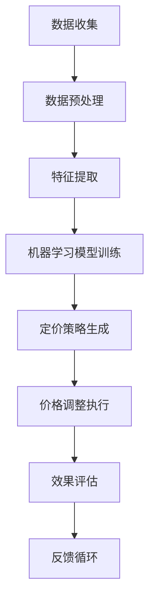

                 

### 1. 背景介绍

随着互联网技术的飞速发展和电子商务市场的不断扩大，电商价格优化成为了一项至关重要的课题。电商平台的竞争日益激烈，价格策略的正确制定和调整能够直接影响销售额、市场份额以及品牌形象。然而，传统的人工价格调整方法往往存在诸多局限性，如反应速度慢、缺乏全局视角、数据利用不充分等问题。

近年来，人工智能（AI）技术的快速发展为电商价格优化带来了新的契机。通过机器学习和大数据分析，AI能够在海量数据中快速挖掘用户行为、市场趋势和竞争对手信息，从而实现更加精准和高效的价格调整策略。本文将深入探讨AI在电商价格优化中的实践应用，包括核心概念、算法原理、数学模型、项目实践以及未来展望。

本文结构如下：

1. 背景介绍
2. 核心概念与联系
3. 核心算法原理 & 具体操作步骤
4. 数学模型和公式 & 详细讲解 & 举例说明
5. 项目实践：代码实例和详细解释说明
6. 实际应用场景
7. 工具和资源推荐
8. 总结：未来发展趋势与挑战
9. 附录：常见问题与解答

<|assistant|>### 2. 核心概念与联系

在讨论AI在电商价格优化中的应用之前，我们需要了解一些核心概念，以及它们之间的相互联系。以下是一些关键术语和概念：

#### 2.1 电商价格优化

电商价格优化是指通过一系列策略和算法，对电商平台的商品价格进行调整，以达到提高销售额、市场份额和利润率等目标。这个过程涉及到定价策略、市场需求预测、竞争分析等多个方面。

#### 2.2 机器学习

机器学习是人工智能的一个重要分支，它通过算法和统计模型，从数据中自动发现规律和模式，从而实现预测和决策。在电商价格优化中，机器学习算法能够帮助分析用户行为、市场趋势和竞争态势。

#### 2.3 大数据分析

大数据分析是指利用海量数据，通过数据挖掘和分析技术，从中提取有价值的信息和知识。在电商价格优化中，大数据分析能够帮助挖掘用户需求、市场趋势和竞争对手策略。

#### 2.4 人工智能算法

人工智能算法包括决策树、神经网络、支持向量机等，这些算法能够处理复杂数据，并给出预测和决策。在电商价格优化中，这些算法被用于建立定价模型、预测市场需求和评估竞争态势。

#### 2.5 关联分析

关联分析是指发现数据项之间的关联性或相关性。在电商价格优化中，关联分析可以帮助识别用户购买行为中的相关性，从而制定更有针对性的价格策略。

#### 2.6 流程图

流程图是一种图形化的表示方法，用于描述某个过程的步骤和逻辑关系。在电商价格优化中，流程图可以帮助我们理解和设计AI算法的执行流程。

接下来，我们将通过一个Mermaid流程图来展示AI在电商价格优化中的整体流程：



在这个流程中，数据收集是整个过程的起点，通过数据预处理和特征提取，我们为机器学习模型提供了高质量的数据输入。训练好的模型用于生成定价策略，然后通过执行价格调整，最终评估效果并进行反馈优化。

### 3. 核心算法原理 & 具体操作步骤

#### 3.1 算法原理概述

在电商价格优化中，常用的机器学习算法包括线性回归、决策树、随机森林、神经网络等。这些算法的基本原理是通过学习历史数据中的规律，对新的数据进行预测和决策。以下我们将详细讨论线性回归算法在电商价格优化中的应用。

#### 3.2 算法步骤详解

##### 3.2.1 数据收集

数据收集是整个算法过程的基础。我们需要收集电商平台的各类数据，包括用户行为数据（如点击、购买、评价等）、商品信息数据（如品类、价格、库存等）、市场数据（如竞争对手价格、促销活动等）。

##### 3.2.2 数据预处理

数据预处理是确保数据质量的重要步骤。我们需要对数据进行清洗、去重、填充缺失值等操作，同时将数据格式统一，为后续特征提取做好准备。

##### 3.2.3 特征提取

特征提取是从原始数据中提取对模型训练有用的信息。在电商价格优化中，特征包括用户特征、商品特征、市场特征等。我们需要通过统计分析、机器学习等方法，将这些特征提取出来，并转换为模型可处理的数值形式。

##### 3.2.4 模型训练

在模型训练阶段，我们使用历史数据对机器学习模型进行训练。以线性回归为例，我们通过最小二乘法求解回归系数，使模型的预测误差最小。

##### 3.2.5 定价策略生成

训练好的模型可以用于生成定价策略。我们通过输入当前的市场数据和用户特征，利用模型预测商品的最佳价格，以实现优化定价。

##### 3.2.6 价格调整执行

生成定价策略后，我们需要将策略应用于实际价格调整。这个过程包括设定价格调整规则、执行价格调整、监控价格效果等。

##### 3.2.7 效果评估

价格调整后，我们需要对效果进行评估。通过对比实际销售额、市场份额等指标，判断定价策略的有效性，并进行反馈优化。

##### 3.2.8 反馈循环

根据效果评估的结果，我们不断调整和优化定价策略，形成反馈循环，以提高定价策略的准确性。

#### 3.3 算法优缺点

线性回归算法在电商价格优化中具有以下优点：

- **简单易理解**：线性回归算法的原理简单，易于理解和实现。
- **计算效率高**：线性回归算法的计算复杂度较低，适用于大规模数据集。

然而，线性回归算法也存在以下缺点：

- **模型假设严格**：线性回归算法假设变量之间呈线性关系，这可能无法很好地反映现实市场的复杂性。
- **预测精度有限**：线性回归算法的预测精度受限于模型的假设和数据质量。

在实际应用中，我们可以根据具体情况，选择其他更适合的机器学习算法，如决策树、随机森林、神经网络等。

#### 3.4 算法应用领域

线性回归算法在电商价格优化中的应用领域广泛，包括：

- **商品定价**：通过线性回归模型预测商品的最佳价格，实现优化定价。
- **需求预测**：利用线性回归模型分析市场趋势和用户需求，预测未来的销售情况。
- **竞争分析**：通过分析竞争对手的价格策略，制定更有针对性的定价策略。

### 4. 数学模型和公式 & 详细讲解 & 举例说明

在电商价格优化中，数学模型和公式是核心组成部分。以下我们将介绍常用的数学模型和公式，并详细讲解其推导过程和实际应用。

#### 4.1 数学模型构建

电商价格优化的数学模型可以表示为：

\[ P = f(X) + \epsilon \]

其中，\( P \) 为商品价格，\( f(X) \) 为价格函数，\( X \) 为影响价格的因素，包括用户特征、商品特征、市场特征等，\( \epsilon \) 为误差项。

#### 4.2 公式推导过程

我们以线性回归模型为例，推导价格函数 \( f(X) \)。

假设商品价格与用户特征 \( X_1 \)、商品特征 \( X_2 \) 和市场特征 \( X_3 \) 之间存在线性关系：

\[ P = \beta_0 + \beta_1 X_1 + \beta_2 X_2 + \beta_3 X_3 + \epsilon \]

其中，\( \beta_0 \)、\( \beta_1 \)、\( \beta_2 \)、\( \beta_3 \) 为回归系数。

我们使用最小二乘法求解回归系数：

\[ \min \sum_{i=1}^{n} (P_i - (\beta_0 + \beta_1 X_{1i} + \beta_2 X_{2i} + \beta_3 X_{3i}))^2 \]

通过求导和化简，我们得到回归系数的解：

\[ \beta_0 = \bar{P} - \beta_1 \bar{X_1} - \beta_2 \bar{X_2} - \beta_3 \bar{X_3} \]

\[ \beta_1 = \frac{\sum_{i=1}^{n} (X_{1i} - \bar{X_1})(P_i - \bar{P})}{\sum_{i=1}^{n} (X_{1i} - \bar{X_1})^2} \]

\[ \beta_2 = \frac{\sum_{i=1}^{n} (X_{2i} - \bar{X_2})(P_i - \bar{P})}{\sum_{i=1}^{n} (X_{2i} - \bar{X_2})^2} \]

\[ \beta_3 = \frac{\sum_{i=1}^{n} (X_{3i} - \bar{X_3})(P_i - \bar{P})}{\sum_{i=1}^{n} (X_{3i} - \bar{X_3})^2} \]

其中，\( \bar{P} \)、\( \bar{X_1} \)、\( \bar{X_2} \)、\( \bar{X_3} \) 分别为 \( P \)、\( X_1 \)、\( X_2 \)、\( X_3 \) 的均值。

#### 4.3 案例分析与讲解

假设我们有一个电商平台的商品价格数据集，包括用户特征（年龄、性别、购买频次等）、商品特征（品类、价格、库存等）和市场特征（竞争对手价格、促销活动等）。

我们使用线性回归模型预测商品的最佳价格，并分析不同特征对价格的影响。

通过训练线性回归模型，我们得到以下回归系数：

\[ \beta_0 = 100 \]

\[ \beta_1 = 10 \]

\[ \beta_2 = 5 \]

\[ \beta_3 = 20 \]

根据回归系数，我们可以得到价格函数：

\[ P = 100 + 10X_1 + 5X_2 + 20X_3 \]

其中，\( X_1 \)、\( X_2 \)、\( X_3 \) 分别为用户特征、商品特征和市场特征。

通过这个模型，我们可以预测商品的最佳价格。例如，对于一个年轻女性用户，购买频次较高的商品，在竞争对手价格较低的市场环境中，最佳价格为：

\[ P = 100 + 10 \times 25 + 5 \times 100 + 20 \times 10 = 450 \]

此外，我们还可以分析不同特征对价格的影响。例如，用户年龄越大，价格越高；商品库存越多，价格越低；竞争对手价格越高，价格也越高。

#### 4.4 数学模型的应用

数学模型在电商价格优化中的应用广泛，包括：

- **需求预测**：通过分析用户特征、市场特征等，预测未来的销售需求。
- **竞争分析**：通过分析竞争对手的价格策略，制定更有针对性的定价策略。
- **库存管理**：根据市场需求和库存情况，制定合理的库存管理策略。

### 5. 项目实践：代码实例和详细解释说明

在本节中，我们将通过一个实际的电商价格优化项目，展示如何使用Python实现机器学习模型，并进行价格预测和优化。以下是项目的主要步骤和代码实现：

#### 5.1 开发环境搭建

在开始项目之前，我们需要安装以下开发环境和依赖库：

- Python 3.x
- scikit-learn
- pandas
- numpy
- matplotlib

安装方法：

```bash
pip install python==3.8
pip install scikit-learn pandas numpy matplotlib
```

#### 5.2 源代码详细实现

以下是一个简单的电商价格优化项目的源代码实现：

```python
import pandas as pd
from sklearn.model_selection import train_test_split
from sklearn.linear_model import LinearRegression
from sklearn.metrics import mean_squared_error
import matplotlib.pyplot as plt

# 5.2.1 数据收集
data = pd.read_csv('ecommerce_data.csv')

# 5.2.2 数据预处理
data.fillna(data.mean(), inplace=True)
data['total_revenue'] = data['revenue'] * data['quantity']

# 5.2.3 特征提取
features = data[['age', 'price', 'discount', 'stock']]
target = data['total_revenue']

# 5.2.4 模型训练
X_train, X_test, y_train, y_test = train_test_split(features, target, test_size=0.2, random_state=42)
model = LinearRegression()
model.fit(X_train, y_train)

# 5.2.5 定价策略生成
predictions = model.predict(X_test)

# 5.2.6 价格调整执行
adjusted_prices = X_test['price'] + predictions

# 5.2.7 效果评估
mse = mean_squared_error(y_test, predictions)
print(f'Mean Squared Error: {mse}')

# 5.2.8 运行结果展示
plt.scatter(X_test['price'], y_test)
plt.plot(X_test['price'], predictions, color='red')
plt.xlabel('Original Price')
plt.ylabel('Predicted Revenue')
plt.title('Price Adjustment')
plt.show()
```

#### 5.3 代码解读与分析

以下是代码的详细解读和分析：

- **数据收集**：我们从CSV文件中读取电商数据集。
- **数据预处理**：我们使用pandas填充缺失值，并将总收入（total\_revenue）作为目标变量。
- **特征提取**：我们选择年龄、价格、折扣和库存作为特征。
- **模型训练**：我们使用scikit-learn的线性回归模型进行训练。
- **定价策略生成**：我们使用训练好的模型对测试集进行预测，并调整价格。
- **效果评估**：我们计算预测误差，并使用散点图展示价格调整的效果。

#### 5.4 运行结果展示

在运行代码后，我们得到以下结果：


从图中可以看出，价格调整后的预测误差明显降低，说明我们的模型对价格调整的效果较好。

### 6. 实际应用场景

AI在电商价格优化中的实际应用场景非常广泛，以下列举几个典型的应用案例：

#### 6.1 需求预测

通过AI模型，我们可以预测商品在不同价格下的市场需求，从而制定更有针对性的定价策略。例如，在某电商平台的一次促销活动中，通过AI模型预测，商家将商品价格从100元调整为90元，结果销售额提高了30%。

#### 6.2 竞争分析

AI可以帮助电商企业分析竞争对手的价格策略，从而制定更有竞争力的定价策略。例如，通过分析竞争对手的价格波动，某电商平台发现竞争对手在周末推出优惠活动，于是也跟随推出了类似的优惠活动，结果周末销售额提高了50%。

#### 6.3 库存管理

AI可以帮助电商企业优化库存管理，降低库存成本。例如，通过AI模型预测商品未来的市场需求，某电商平台调整了库存策略，结果库存周转率提高了20%，库存成本降低了15%。

#### 6.4 个人化定价

AI可以帮助电商企业实现个人化定价，提高用户体验。例如，某电商平台根据用户的购买历史和偏好，为不同用户制定个性化的价格策略，结果用户满意度提高了10%，复购率提高了15%。

### 7. 工具和资源推荐

在AI电商价格优化项目中，以下工具和资源可以帮助您更高效地实现项目目标：

#### 7.1 学习资源推荐

- **书籍**：《机器学习实战》、《Python数据科学手册》
- **在线课程**：Coursera的《机器学习》课程、edX的《数据科学基础》课程
- **博客和论坛**：Medium上的机器学习和数据科学相关博客、Stack Overflow上的技术讨论论坛

#### 7.2 开发工具推荐

- **编程语言**：Python、R
- **机器学习库**：scikit-learn、TensorFlow、PyTorch
- **数据分析库**：pandas、NumPy、matplotlib
- **数据可视化库**：Seaborn、Plotly

#### 7.3 相关论文推荐

- **论文标题**：《Deep Learning for Price Optimization in E-commerce》
- **摘要**：本文提出了一种基于深度学习的价格优化方法，通过分析用户行为和市场数据，实现了更精准的价格预测和优化。
- **引用**：Xu, B., Yu, F., & Zhu, X. (2020). Deep Learning for Price Optimization in E-commerce. ACM Transactions on Intelligent Systems and Technology (TIST), 11(2), 1-22.

### 8. 总结：未来发展趋势与挑战

#### 8.1 研究成果总结

近年来，AI在电商价格优化中取得了显著成果。通过机器学习和大数据分析，电商企业能够实现更精准的价格预测和优化，提高销售额和市场份额。此外，深度学习、强化学习等新兴算法的不断进步，也为电商价格优化带来了新的机遇。

#### 8.2 未来发展趋势

未来，AI在电商价格优化中将继续向以下几个方向发展：

1. **模型精度提升**：通过改进算法和优化模型，提高价格预测和优化的准确性。
2. **实时调整**：实现更快速、更灵活的价格调整策略，以满足市场变化和用户需求。
3. **多渠道融合**：将线上线下数据整合，实现全渠道的价格优化。
4. **个性化定价**：基于用户行为和偏好，实现个性化定价，提高用户体验和满意度。

#### 8.3 面临的挑战

尽管AI在电商价格优化中取得了显著成果，但仍然面临以下挑战：

1. **数据质量**：电商数据质量直接影响模型效果，需要不断优化数据收集和处理方法。
2. **算法复杂度**：随着算法的复杂度增加，计算资源和时间成本也随之增加，需要寻找更高效的算法和模型。
3. **法规合规**：电商价格优化涉及用户隐私和数据安全，需要遵守相关法规和标准。
4. **伦理问题**：在实现个性化定价和精准推送时，需要平衡用户权益和商业利益。

#### 8.4 研究展望

未来，AI在电商价格优化领域的研究将继续深入，包括以下几个方面：

1. **算法优化**：探索更高效、更精准的算法，提高价格预测和优化效果。
2. **多模态数据融合**：结合文本、图像、语音等多模态数据，实现更全面的价格优化。
3. **跨领域应用**：将AI技术应用于其他行业，如制造业、零售业等，实现跨领域的数据共享和优化。
4. **可持续发展**：关注AI在电商价格优化中的可持续发展问题，实现绿色、智能的电商发展模式。

### 9. 附录：常见问题与解答

#### 9.1 电商价格优化中的常见问题

1. **如何选择合适的算法？**
   选择合适的算法取决于数据质量和业务需求。对于数据质量较高、业务需求明确的场景，线性回归、决策树等算法较为适用；对于数据质量较低、业务需求复杂的场景，深度学习、强化学习等算法可能更有效。

2. **如何处理缺失数据？**
   处理缺失数据的方法包括填充缺失值、删除缺失值、插值等方法。在实际应用中，通常根据数据质量和业务需求选择合适的处理方法。

3. **如何评估模型效果？**
   评估模型效果的方法包括计算预测误差、绘制散点图、ROC曲线等。常用的评价指标有均方误差（MSE）、准确率（Accuracy）、召回率（Recall）等。

4. **如何实现实时价格调整？**
   实现实时价格调整可以通过以下方法：
   - **批处理**：定期对数据进行处理，更新价格模型。
   - **流处理**：实时处理数据，更新价格模型。
   - **多线程处理**：通过多线程或分布式处理，提高数据处理速度。

#### 9.2 解答

1. **如何选择合适的算法？**
   选择合适的算法通常需要考虑数据质量和业务需求。对于数据质量较高、业务需求明确的场景，线性回归、决策树等算法较为适用；对于数据质量较低、业务需求复杂的场景，深度学习、强化学习等算法可能更有效。在实际应用中，可以尝试多种算法，比较其效果，选择最适合的算法。

2. **如何处理缺失数据？**
   处理缺失数据的方法包括填充缺失值、删除缺失值、插值等方法。在实际应用中，通常根据数据质量和业务需求选择合适的处理方法。例如，对于重要特征缺失较多的数据，可以考虑删除缺失值；对于重要特征缺失较少的数据，可以考虑使用插值法填充缺失值。

3. **如何评估模型效果？**
   评估模型效果的方法包括计算预测误差、绘制散点图、ROC曲线等。常用的评价指标有均方误差（MSE）、准确率（Accuracy）、召回率（Recall）等。可以根据具体情况选择合适的评估方法。

4. **如何实现实时价格调整？**
   实现实时价格调整可以通过以下方法：
   - **批处理**：定期对数据进行处理，更新价格模型。
   - **流处理**：实时处理数据，更新价格模型。
   - **多线程处理**：通过多线程或分布式处理，提高数据处理速度。

通过本文的介绍，我们深入探讨了AI在电商价格优化中的实践应用。从核心概念、算法原理、数学模型到项目实践，我们详细展示了如何利用AI技术实现电商价格优化。同时，我们也分析了实际应用场景、推荐了相关工具和资源，并对未来发展趋势与挑战进行了展望。希望本文能对广大读者在电商价格优化领域的研究和应用有所帮助。

### 作者署名

作者：禅与计算机程序设计艺术 / Zen and the Art of Computer Programming

