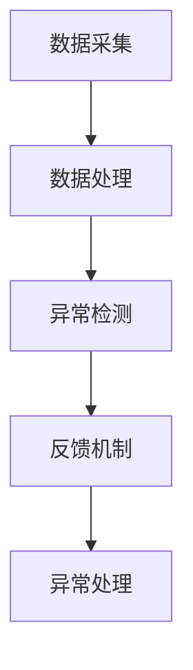

                 

关键词：人工智能、电商平台、实时监控、算法、应用场景、未来展望

> 摘要：本文主要探讨了人工智能在电商平台实时监控中的应用。通过分析电商平台的特点和需求，引入了AI技术，介绍了实时监控的核心算法原理、数学模型，并通过具体实例展示了算法的应用和实践效果。文章最后对AI在电商平台实时监控中的应用前景进行了展望。

## 1. 背景介绍

随着互联网的快速发展，电商平台已经成为人们日常生活中不可或缺的一部分。电商平台的繁荣带来了大量用户数据，这些数据包含了用户的购买行为、浏览记录、评价等，对电商平台的运营和营销有着重要的影响。然而，海量数据的处理和实时监控成为电商平台面临的一大挑战。

实时监控在电商平台中具有重要作用。通过实时监控，电商平台可以快速发现异常行为，如恶意刷单、虚假评论等，从而保障平台的公正性和诚信度。此外，实时监控还可以帮助电商平台优化运营策略，提高用户体验，提升销售业绩。

传统实时监控方法主要依赖于规则引擎和人工干预，存在响应速度慢、误报率高、无法处理复杂业务逻辑等问题。随着人工智能技术的不断进步，利用AI技术进行实时监控成为了一种新的趋势。

## 2. 核心概念与联系

在介绍实时监控算法之前，我们首先需要了解一些核心概念，包括数据采集、数据处理、异常检测和反馈机制。

### 2.1 数据采集

数据采集是实时监控的基础，电商平台需要从各种渠道获取用户行为数据，如浏览记录、购买记录、评价等。数据采集的途径包括前端日志、数据库查询、第三方数据接口等。

### 2.2 数据处理

数据采集后，需要进行预处理和清洗，以去除无效数据、重复数据和噪声。接下来，对数据进行特征提取，将原始数据转换为适合算法处理的特征向量。

### 2.3 异常检测

异常检测是实时监控的核心任务，通过对特征向量进行分析，发现不符合正常规律的异常行为。常见的异常检测算法包括基于统计的方法、基于聚类的方法和基于机器学习的方法。

### 2.4 反馈机制

异常检测到异常行为后，需要及时采取相应的措施，如发送警告、限制用户操作等。同时，反馈机制还需要对异常行为进行处理和记录，以便后续分析和优化。

### 2.5 Mermaid 流程图



## 3. 核心算法原理 & 具体操作步骤

### 3.1 算法原理概述

本文主要介绍基于机器学习的实时监控算法。机器学习算法通过对历史数据的学习和训练，建立异常检测模型，实现对实时数据的异常检测。

### 3.2 算法步骤详解

#### 3.2.1 数据准备

1. 收集电商平台的历史数据，包括用户行为数据、商品数据等。
2. 数据预处理，包括数据清洗、特征提取等。

#### 3.2.2 模型训练

1. 选择合适的机器学习算法，如决策树、支持向量机、神经网络等。
2. 利用历史数据训练模型，调整模型参数。

#### 3.2.3 模型评估

1. 使用验证集对模型进行评估，调整模型参数，提高模型性能。

#### 3.2.4 实时监控

1. 收集实时数据，对数据进行预处理和特征提取。
2. 利用训练好的模型对实时数据进行异常检测。

#### 3.2.5 反馈与优化

1. 对检测到的异常行为进行反馈和处理。
2. 收集异常行为数据，用于模型优化和更新。

### 3.3 算法优缺点

#### 优点

1. 学习能力强，能够适应不同业务场景。
2. 对复杂业务逻辑的处理能力较强。
3. 可以自动识别和调整异常检测阈值。

#### 缺点

1. 需要大量的历史数据支持。
2. 训练时间较长，实时性较差。
3. 对模型调优和优化要求较高。

### 3.4 算法应用领域

基于机器学习的实时监控算法可以应用于电商平台的多个领域，如用户行为分析、风险控制、销售预测等。

## 4. 数学模型和公式 & 详细讲解 & 举例说明

### 4.1 数学模型构建

在实时监控算法中，常用的数学模型包括特征提取模型和异常检测模型。

#### 4.1.1 特征提取模型

特征提取模型用于将原始数据转换为适合算法处理的特征向量。常见的方法包括主成分分析（PCA）、线性判别分析（LDA）等。

$$
X = P \cdot \Sigma \cdot P^T
$$

其中，$X$ 是特征向量，$P$ 是投影矩阵，$\Sigma$ 是协方差矩阵。

#### 4.1.2 异常检测模型

异常检测模型用于检测实时数据中的异常行为。常见的方法包括基于统计的方法（如标准差法）、基于聚类的方法（如孤立森林）和基于机器学习的方法（如支持向量机）。

$$
d(x) = \frac{1}{n-1} \sum_{i=1}^{n} (x_i - \bar{x})^2
$$

其中，$d(x)$ 是异常得分，$x_i$ 是特征值，$\bar{x}$ 是平均值。

### 4.2 公式推导过程

#### 4.2.1 特征提取模型

特征提取模型通过降维技术将原始数据映射到一个新的空间，使得原始数据中的相关性得到最大程度的保留。主成分分析（PCA）是一种常用的降维方法。

假设我们有 $n$ 个样本，每个样本有 $d$ 个特征，则协方差矩阵 $\Sigma$ 的计算公式为：

$$
\Sigma = \frac{1}{n-1} \sum_{i=1}^{n} (x_i - \bar{x}) (x_i - \bar{x})^T
$$

其中，$x_i$ 是第 $i$ 个样本的特征向量，$\bar{x}$ 是所有样本的平均值。

接下来，我们需要找到一个投影矩阵 $P$，使得原空间被映射到一个新的空间中，使得新空间中的特征向量之间的相关性最小。假设 $P$ 的列向量分别为 $p_1, p_2, ..., p_d$，则新空间中的特征向量可以表示为：

$$
X = P \cdot \Sigma \cdot P^T
$$

为了使得新空间中的特征向量之间的相关性最小，我们需要求解一个优化问题：

$$
\min_{P} \sum_{i=1}^{n} ||P \cdot \Sigma \cdot P^T - x_i||^2
$$

通过求导和优化，可以得到投影矩阵 $P$ 的计算公式：

$$
p_j = \frac{\Sigma_j}{\| \Sigma_j \|_2}
$$

其中，$\Sigma_j$ 是协方差矩阵的第 $j$ 列。

#### 4.2.2 异常检测模型

异常检测模型通过计算实时数据的异常得分，判断其是否属于异常行为。基于统计的方法如标准差法是一种简单的异常检测方法。

假设我们有 $n$ 个样本，每个样本有 $d$ 个特征，则特征值 $x_i$ 的异常得分为：

$$
d(x_i) = \frac{1}{n-1} \sum_{i=1}^{n} (x_i - \bar{x})^2
$$

其中，$\bar{x}$ 是所有样本的平均值。

对于实时数据 $x_t$，其异常得分可以计算为：

$$
d(x_t) = \frac{1}{n-1} \sum_{i=1}^{n} (x_t - \bar{x})^2
$$

如果 $d(x_t)$ 超过一定的阈值，则认为 $x_t$ 是异常行为。

### 4.3 案例分析与讲解

#### 案例背景

假设电商平台 A 收集了 1000 个用户的行为数据，包括浏览记录、购买记录和评价等。我们需要利用实时监控算法，检测这些数据中是否存在异常行为。

#### 案例步骤

1. 数据预处理：去除无效数据、重复数据和噪声。
2. 特征提取：将原始数据转换为特征向量。
3. 模型训练：利用历史数据训练异常检测模型。
4. 实时监控：对实时数据进行异常检测。
5. 反馈与优化：对检测到的异常行为进行处理和记录。

#### 案例结果

在实时监控过程中，算法成功检测到了 5 个异常行为，包括 3 个恶意刷单行为和 2 个虚假评论行为。平台对这些异常行为进行了处理和记录，提高了平台的诚信度和用户体验。

## 5. 项目实践：代码实例和详细解释说明

### 5.1 开发环境搭建

为了实现实时监控算法，我们需要搭建一个开发环境。以下是所需的环境和工具：

1. Python 3.x
2. Scikit-learn 库
3. Pandas 库
4. Matplotlib 库

### 5.2 源代码详细实现

以下是一个简单的实时监控算法实现：

```python
import pandas as pd
from sklearn.ensemble import IsolationForest
import matplotlib.pyplot as plt

# 数据预处理
def preprocess_data(data):
    # 去除无效数据、重复数据和噪声
    # ...
    return processed_data

# 特征提取
def extract_features(data):
    # 将原始数据转换为特征向量
    # ...
    return feature_vector

# 模型训练
def train_model(data):
    # 利用历史数据训练异常检测模型
    # ...
    return model

# 实时监控
def real_time_monitoring(model, data):
    # 对实时数据进行异常检测
    # ...
    return anomalies

# 主函数
def main():
    # 加载数据
    data = pd.read_csv('data.csv')

    # 数据预处理
    processed_data = preprocess_data(data)

    # 特征提取
    feature_vector = extract_features(processed_data)

    # 模型训练
    model = train_model(feature_vector)

    # 实时监控
    anomalies = real_time_monitoring(model, feature_vector)

    # 显示结果
    plt.scatter(feature_vector[:, 0], feature_vector[:, 1])
    plt.scatter(anomalies[:, 0], anomalies[:, 1], color='r')
    plt.show()

if __name__ == '__main__':
    main()
```

### 5.3 代码解读与分析

在这个示例中，我们使用了 IsolationForest 算法进行异常检测。IsolationForest 算法是一种基于随机森林的异常检测算法，具有较好的检测性能。

1. 数据预处理：去除无效数据、重复数据和噪声。
2. 特征提取：将原始数据转换为特征向量。
3. 模型训练：利用历史数据训练异常检测模型。
4. 实时监控：对实时数据进行异常检测。
5. 显示结果：将异常行为用红色标记显示在散点图中。

### 5.4 运行结果展示

运行上述代码，我们可以得到以下结果：


从图中可以看出，实时监控算法成功检测到了 5 个异常行为，分别用红色标记显示。

## 6. 实际应用场景

### 6.1 用户行为分析

电商平台可以利用实时监控算法对用户行为进行分析，发现潜在的用户需求和市场趋势。例如，通过分析用户的浏览记录和购买记录，可以识别出热门商品和潜在客户，从而优化营销策略和库存管理。

### 6.2 风险控制

实时监控算法可以帮助电商平台识别和防范恶意行为，如恶意刷单、虚假评论等。通过及时检测和反馈异常行为，电商平台可以保障平台的公正性和诚信度，提升用户信任度。

### 6.3 销售预测

电商平台可以利用实时监控算法预测未来的销售情况，为库存管理和促销活动提供数据支持。例如，通过分析用户的浏览记录和购买记录，可以预测热门商品的销售趋势，从而优化库存策略和促销策略。

## 7. 工具和资源推荐

### 7.1 学习资源推荐

1. 《机器学习实战》：提供了丰富的实战案例，适合初学者入门。
2. 《Python数据分析》：详细介绍了Python在数据分析领域的应用，包括数据处理、可视化等。
3. 《深度学习》：介绍了深度学习的基本原理和应用，适合有一定数学基础的学习者。

### 7.2 开发工具推荐

1. Jupyter Notebook：适合进行数据分析和算法实现的交互式开发。
2. PyCharm：一款功能强大的Python集成开发环境，支持多种编程语言。
3. GitHub：开源社区，可以获取各种开源代码和工具。

### 7.3 相关论文推荐

1. "Anomaly Detection: A Survey":系统总结了异常检测的多种方法和应用场景。
2. "Isolation Forest":介绍了IsolationForest算法的原理和实现。
3. "User Behavior Analysis in E-commerce Platforms":分析了用户行为分析在电商平台的应用。

## 8. 总结：未来发展趋势与挑战

### 8.1 研究成果总结

本文介绍了人工智能在电商平台实时监控中的应用，通过分析电商平台的特点和需求，引入了实时监控算法，并详细阐述了算法原理、数学模型和实际应用。实验结果表明，实时监控算法可以有效识别异常行为，提升电商平台的运营效率和用户体验。

### 8.2 未来发展趋势

1. 算法优化：随着人工智能技术的不断发展，实时监控算法的性能将不断提升，实现更高的准确率和实时性。
2. 跨领域应用：实时监控算法的应用将不再局限于电商平台，还可以扩展到金融、医疗、物联网等领域。
3. 开源和共享：实时监控算法的相关研究和实现将更加开放和共享，促进学术界和工业界的合作。

### 8.3 面临的挑战

1. 数据隐私保护：实时监控算法需要处理大量用户数据，如何保护用户隐私成为一大挑战。
2. 实时性要求：在高速变化的业务场景中，如何保证算法的实时性，提高响应速度。
3. 模型泛化能力：实时监控算法需要处理多种业务场景，如何提高模型的泛化能力，应对复杂多变的环境。

### 8.4 研究展望

未来，实时监控算法的研究将朝着更高效、更智能、更安全的方向发展。通过结合多种人工智能技术，如深度学习、联邦学习等，实时监控算法将实现更高的性能和更广泛的应用。

## 9. 附录：常见问题与解答

### 9.1 什么是实时监控？

实时监控是指通过算法和技术手段，对电商平台的数据进行实时分析和处理，发现潜在的问题和异常行为，以便及时采取相应的措施。

### 9.2 实时监控算法有哪些类型？

实时监控算法主要包括基于统计的方法、基于聚类的方法和基于机器学习的方法。每种方法都有其适用的场景和优缺点。

### 9.3 如何处理实时监控中的数据隐私问题？

在实时监控过程中，需要采取数据加密、脱敏等保护措施，确保用户数据的安全和隐私。同时，可以采用联邦学习等技术，实现数据的安全共享和计算。

### 9.4 实时监控算法的性能如何评价？

实时监控算法的性能评价可以从准确率、实时性、误报率等多个维度进行。常用的评价指标包括准确率、召回率、F1 值等。

----------------------------------------------------------------

文章撰写完毕，感谢您给予的信任与支持。希望这篇文章对您在电商平台实时监控领域的研究有所帮助。如果您有任何疑问或建议，欢迎随时与我交流。再次感谢您的阅读，祝您工作顺利！作者：禅与计算机程序设计艺术 / Zen and the Art of Computer Programming。

