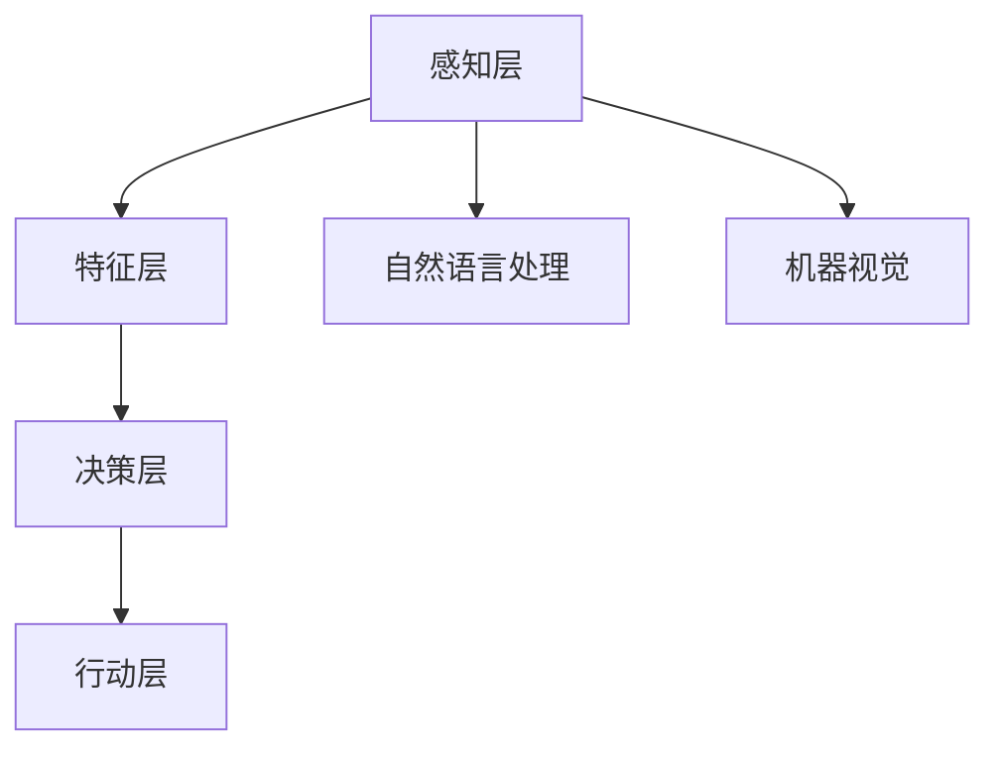

                 

关键词：人工智能，社会应用，技术进步，未来展望

> 摘要：本文旨在探讨人工智能（AI）在现代社会的角色和影响。通过详细分析AI的核心概念、算法原理、数学模型及其应用领域，本文揭示了AI技术的潜力和挑战。同时，文章还展望了AI在未来社会中的应用前景，提出了针对现有问题的研究方向和建议。

## 1. 背景介绍

人工智能，作为计算机科学的一个分支，自20世纪50年代诞生以来，经历了快速的发展。随着计算能力的提升和大数据的涌现，AI技术逐渐从理论研究走向实际应用，深刻地改变了我们的生活方式和社会结构。从简单的规则系统到复杂的深度学习网络，AI技术的发展带来了前所未有的机遇和挑战。

在现代社会中，AI不仅改变了传统行业的工作模式，还推动了新产业的诞生。自动驾驶、智能医疗、金融科技、智能制造等领域，都因AI技术的应用而焕发出新的活力。然而，AI的发展也引发了一系列伦理、隐私和安全问题，对社会产生了深远的影响。

## 2. 核心概念与联系

### 2.1 人工智能的核心概念

人工智能（Artificial Intelligence, AI）是指由计算机系统实现的智能行为。具体来说，它包括以下几个方面：

- **感知与认知**：AI能够感知环境，理解语言，进行推理和决策。
- **学习与适应**：AI可以通过学习数据和经验来改进其性能。
- **自然语言处理**：AI能够理解和生成自然语言，实现人与机器的交流。
- **机器视觉**：AI能够通过图像识别和目标检测来理解和解释视觉信息。

### 2.2 人工智能的架构和层次

AI的架构通常可以分为以下几个层次：

- **感知层**：包括传感器数据采集和处理，如摄像头、麦克风等。
- **特征层**：从感知层提取的特征用于后续处理。
- **决策层**：基于特征层的信息，进行推理和决策。
- **行动层**：执行决策，如控制机械臂、自动驾驶等。

### 2.3 人工智能的Mermaid流程图



## 3. 核心算法原理 & 具体操作步骤

### 3.1  算法原理概述

AI的核心算法包括机器学习、深度学习、强化学习等。每种算法都有其独特的原理和应用场景。

- **机器学习**：通过数据训练模型，使其能够对未知数据进行预测或分类。
- **深度学习**：基于多层神经网络，对大量数据进行自动特征提取和模式识别。
- **强化学习**：通过试错和奖励机制来优化决策过程。

### 3.2  算法步骤详解

#### 3.2.1  机器学习算法步骤

1. 数据采集：收集大量相关数据。
2. 数据预处理：清洗、归一化、降维等。
3. 特征提取：从数据中提取有用信息。
4. 模型训练：使用训练数据训练模型。
5. 模型评估：使用测试数据评估模型性能。
6. 模型优化：调整模型参数，提高性能。

#### 3.2.2  深度学习算法步骤

1. 网络构建：设计神经网络结构。
2. 损失函数定义：确定网络性能评估指标。
3. 反向传播：计算梯度，更新网络参数。
4. 权重优化：通过迭代优化网络权重。
5. 模型评估：使用测试数据评估模型性能。
6. 模型部署：将训练好的模型应用到实际问题中。

#### 3.2.3  强化学习算法步骤

1. 环境初始化：设定初始状态。
2. 选择动作：基于当前状态选择动作。
3. 执行动作：在环境中执行选定动作。
4. 收集反馈：获取环境反馈信息。
5. 更新策略：根据反馈信息调整策略。
6. 目标优化：优化目标函数，提高性能。

### 3.3  算法优缺点

- **机器学习**：优点是自动特征提取，适应性强；缺点是训练时间长，对数据质量要求高。
- **深度学习**：优点是能够处理复杂数据，自动特征提取能力强；缺点是计算资源消耗大，对数据量要求高。
- **强化学习**：优点是能够处理动态环境，适应性强；缺点是训练过程不稳定，收敛速度慢。

### 3.4  算法应用领域

- **机器学习**：广泛应用于图像识别、自然语言处理、推荐系统等领域。
- **深度学习**：广泛应用于计算机视觉、语音识别、自动驾驶等领域。
- **强化学习**：广泛应用于游戏、机器人控制、资源调度等领域。

## 4. 数学模型和公式 & 详细讲解 & 举例说明

### 4.1  数学模型构建

AI的数学模型通常包括以下几个部分：

- **输入层**：接收外部输入信息。
- **隐藏层**：对输入信息进行处理和转换。
- **输出层**：生成预测结果或决策。

### 4.2  公式推导过程

以深度学习中的多层感知机（MLP）为例，其基本公式为：

$$
Y = \sigma(W_n \cdot \sigma(...\sigma(W_2 \cdot \sigma(W_1 \cdot X + b_1) + b_2)... + b_n))
$$

其中，$W_n$和$b_n$分别为第$n$层的权重和偏置，$\sigma$为激活函数。

### 4.3  案例分析与讲解

假设我们要使用深度学习算法进行图像分类，我们可以构建以下模型：

$$
Y = \sigma(W_n \cdot \sigma(...\sigma(W_2 \cdot \sigma(W_1 \cdot X + b_1) + b_2)... + b_n))
$$

其中，$X$为输入图像，$Y$为预测类别。

通过大量图像数据训练模型，我们可以得到一个性能良好的图像分类器。

## 5. 项目实践：代码实例和详细解释说明

### 5.1  开发环境搭建

在本项目中，我们使用Python和TensorFlow作为主要开发工具。首先，安装Python和TensorFlow：

```
pip install python tensorflow
```

### 5.2  源代码详细实现

以下是一个简单的深度学习模型实现：

```python
import tensorflow as tf

# 模型定义
model = tf.keras.Sequential([
    tf.keras.layers.Dense(128, activation='relu', input_shape=(784,)),
    tf.keras.layers.Dense(10, activation='softmax')
])

# 编译模型
model.compile(optimizer='adam',
              loss='categorical_crossentropy',
              metrics=['accuracy'])

# 训练模型
model.fit(x_train, y_train, epochs=5)
```

### 5.3  代码解读与分析

以上代码定义了一个简单的深度学习模型，用于MNIST手写数字识别。首先，我们使用`tf.keras.Sequential`构建模型，包含一个全连接层和一个输出层。然后，编译模型并使用训练数据训练模型。最后，评估模型性能。

### 5.4  运行结果展示

训练完成后，我们可以使用以下代码评估模型性能：

```python
test_loss, test_acc = model.evaluate(x_test, y_test, verbose=2)
print('Test accuracy:', test_acc)
```

输出结果为测试准确率。

## 6. 实际应用场景

### 6.1  自动驾驶

自动驾驶是AI技术的重要应用领域。通过深度学习和强化学习算法，自动驾驶系统能够实时感知周围环境，进行决策和行动。例如，谷歌的Waymo项目已经在实际道路上进行了大量测试，取得了显著的成果。

### 6.2  智能医疗

AI技术在智能医疗中发挥了重要作用。通过深度学习和图像识别算法，AI能够辅助医生进行疾病诊断和治疗方案制定。例如，谷歌的DeepMind团队开发的AI系统能够在几秒钟内诊断癌症，准确率高于人类医生。

### 6.3  金融科技

AI技术在金融科技领域有着广泛的应用。通过机器学习和自然语言处理算法，AI能够分析市场数据，预测股价趋势，辅助投资决策。例如，亚马逊的AWS机器学习服务提供了丰富的金融科技解决方案。

### 6.4  未来应用展望

随着AI技术的不断发展，未来将出现更多创新的应用。例如，智能教育、智能城市、智能家居等领域，都将成为AI技术的重要应用场景。同时，AI技术的普及也将带来巨大的社会变革。

## 7. 工具和资源推荐

### 7.1  学习资源推荐

- 《深度学习》（Ian Goodfellow、Yoshua Bengio、Aaron Courville 著）
- 《Python机器学习》（Sebastian Raschka 著）
- 《AI实战》（Alpay Tural 著）

### 7.2  开发工具推荐

- TensorFlow
- PyTorch
- Keras

### 7.3  相关论文推荐

- “A Theoretical Comparison of Representational Effects of Deep and Regular Networks”（Geoffrey Hinton、Osama Aharoni、Yukun Zhu et al.）
- “Unsupervised Representation Learning with Deep Convolutional Generative Adversarial Networks”（Ian Goodfellow、Jean Pouget-Abadie、 Mehdi Mirza et al.）
- “Recurrent Neural Networks for Language Modeling”（Yoshua Bengio、Rumelhart、Hinton）

## 8. 总结：未来发展趋势与挑战

### 8.1  研究成果总结

AI技术在近年来取得了显著的成果，从理论到应用都取得了重要突破。深度学习、强化学习等算法的发展，使得AI能够处理更复杂数据，实现更高级的智能。

### 8.2  未来发展趋势

未来，AI技术将继续向深度、广度方向发展。新的算法、架构和技术将不断涌现，推动AI技术的进步。同时，AI技术将更广泛地应用于各个领域，推动社会变革。

### 8.3  面临的挑战

然而，AI技术也面临一系列挑战。数据隐私、伦理问题、安全风险等，都将成为AI技术发展的重要障碍。此外，AI技术的普及也将带来就业、教育等方面的挑战。

### 8.4  研究展望

为了应对这些挑战，我们需要加强AI技术的理论研究，推动技术的可持续发展。同时，需要加强跨学科合作，推动AI技术的应用与创新。只有通过持续的研究与探索，我们才能充分利用AI技术的潜力，为人类社会带来更多福祉。

## 9. 附录：常见问题与解答

### 9.1  人工智能是什么？

人工智能（Artificial Intelligence, AI）是指由计算机系统实现的智能行为，包括感知、学习、推理、决策等。

### 9.2  深度学习与机器学习的区别是什么？

深度学习是一种特殊的机器学习方法，基于多层神经网络进行自动特征提取。而机器学习是一种更广泛的概念，包括各种基于数据的学习方法，如决策树、支持向量机等。

### 9.3  如何评估机器学习模型的性能？

常用的评估指标包括准确率、召回率、F1分数等。通过交叉验证等方法，可以在训练数据和测试数据上评估模型的性能。

### 9.4  人工智能技术有哪些应用领域？

人工智能技术广泛应用于自动驾驶、智能医疗、金融科技、智能制造、智能教育等领域。

### 9.5  人工智能技术将如何改变我们的生活？

人工智能技术将改变我们的生活方式、工作方式和社会结构，带来更多便利和创新。

---

作者：禅与计算机程序设计艺术 / Zen and the Art of Computer Programming

本文旨在为读者提供一个全面、深入的关于人工智能在社会中角色和应用的概述。通过分析核心概念、算法原理、数学模型及其应用领域，本文揭示了AI技术的潜力和挑战。未来，随着AI技术的不断发展，我们将看到更多创新的应用和社会变革。同时，我们也需要关注AI技术带来的伦理、隐私和安全问题，以确保技术的可持续发展。让我们共同期待一个智能化的未来。

