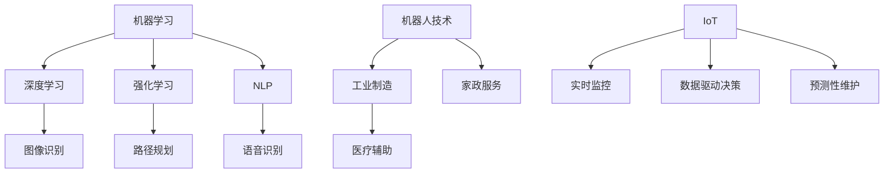

                 

关键词：人工智能，自动化，应用前景，技术发展，未来挑战

摘要：随着人工智能技术的飞速发展，自动化领域正迎来前所未有的变革。本文将深入探讨人工智能在自动化领域的应用前景，包括核心概念与联系、核心算法原理、数学模型与公式、项目实践、实际应用场景以及未来展望。通过对这些内容的详细分析，本文旨在为读者提供对AI自动化领域全面而深刻的认识。

## 1. 背景介绍

自动化技术的发展始于20世纪中叶，随着计算机技术和控制理论的进步，自动化技术在工业、医疗、交通等多个领域得到了广泛应用。然而，传统自动化技术主要依赖于预定义的规则和程序，缺乏自适应性和智能化，这在复杂和动态的环境中表现不佳。近年来，人工智能（AI）的突破性进展为自动化带来了新的契机。AI通过机器学习、深度学习等算法，能够从数据中自动学习和优化，极大地提高了自动化系统的智能水平和灵活性。

人工智能与自动化技术的结合，不仅提升了现有系统的效率，还开辟了诸多新的应用场景。例如，在工业生产中，AI自动化系统能够实现精准的工艺控制和质量检测；在医疗服务中，AI辅助诊断系统可以快速准确地识别疾病；在交通运输中，自动驾驶技术正在逐步实现商业化应用。本文将详细探讨这些领域中的AI应用前景。

## 2. 核心概念与联系

为了更好地理解AI在自动化领域的应用，我们首先需要了解一些核心概念。以下是几个关键概念及其在自动化系统中的应用：

### 2.1 机器学习

机器学习是AI的核心技术之一，通过算法从数据中提取模式和知识，使其能够在没有明确编程的情况下进行决策和预测。在自动化系统中，机器学习算法可以用于故障预测、优化控制和自适应调整。

### 2.2 深度学习

深度学习是机器学习的一个分支，通过神经网络模拟人脑的思维方式。深度学习在图像识别、语音识别等领域取得了显著成果，也为自动化系统的视觉和语音交互提供了技术支持。

### 2.3 强化学习

强化学习是一种通过试错和反馈进行决策的学习方式，适用于需要连续决策和复杂环境的问题。在自动化领域，强化学习可以用于路径规划、机器人控制和自动驾驶等场景。

### 2.4 自然语言处理

自然语言处理（NLP）是使计算机能够理解、生成和响应人类语言的技术。在自动化系统中，NLP可以用于语音识别、机器翻译和智能客服等应用。

### 2.5 机器人技术

机器人技术是将AI与机械结构结合的一种技术，可以执行重复性、危险性和复杂性的工作。在自动化领域，机器人广泛应用于工业制造、医疗辅助和家政服务。

### 2.6 物联网（IoT）

物联网是通过传感器和通信技术将物理设备连接到互联网的一个系统，可以收集和分析大量数据。在自动化系统中，IoT技术可以用于实时监控、数据驱动决策和预测性维护。

### 2.7 Mermaid 流程图

为了更好地展示这些概念在自动化系统中的联系，我们使用Mermaid流程图进行说明：



通过这个流程图，我们可以清晰地看到机器学习、深度学习、强化学习、NLP等技术在自动化系统中的应用场景和相互联系。

## 3. 核心算法原理 & 具体操作步骤

### 3.1 算法原理概述

在自动化领域中，AI算法的应用主要集中在以下方面：

- **图像识别与处理**：使用深度学习算法对图像进行分类、识别和分割，实现自动化视觉检测。
- **语音识别与生成**：通过NLP技术将语音转换为文本，或生成自然流畅的语音。
- **路径规划与控制**：使用强化学习算法，实现自主移动和路径规划。
- **数据挖掘与分析**：利用机器学习算法，从大量数据中提取有价值的信息，实现智能化决策。

### 3.2 算法步骤详解

以下是自动化领域中常见算法的具体操作步骤：

#### 3.2.1 图像识别与处理

1. **数据收集与预处理**：收集大量标注好的图像数据，对图像进行预处理，如大小调整、灰度化等。
2. **模型训练**：使用深度学习框架（如TensorFlow、PyTorch）训练图像识别模型，常用的模型有卷积神经网络（CNN）。
3. **模型评估与优化**：通过交叉验证等手段评估模型性能，调整模型参数以优化性能。
4. **模型部署与应用**：将训练好的模型部署到实际应用场景，如自动化生产线上的质量检测。

#### 3.2.2 语音识别与生成

1. **语音信号预处理**：对语音信号进行降噪、增强和分帧处理。
2. **特征提取**：使用深度学习算法提取语音特征，常用的算法有长短期记忆网络（LSTM）。
3. **模型训练与优化**：训练语音识别模型，通过调整网络结构和参数提高识别准确性。
4. **语音合成**：使用自然语言处理技术将文本转换为自然流畅的语音。

#### 3.2.3 路径规划与控制

1. **环境建模**：建立机器人工作环境的三维模型，包括障碍物、目标点等。
2. **状态估计**：使用传感器数据估计机器人的状态，如位置、速度等。
3. **决策制定**：使用强化学习算法制定移动策略，优化路径规划。
4. **控制执行**：根据决策结果控制机器人执行动作，实现路径规划。

#### 3.2.4 数据挖掘与分析

1. **数据收集与整合**：收集来自不同数据源的数据，如传感器、日志等，进行整合。
2. **特征工程**：从原始数据中提取有价值的信息，如时间序列特征、统计特征等。
3. **模型选择与训练**：选择合适的机器学习模型（如决策树、随机森林等），进行训练。
4. **模型评估与应用**：评估模型性能，应用于实际场景，如预测性维护、需求预测等。

### 3.3 算法优缺点

每种算法都有其优缺点，适用于不同的应用场景：

- **图像识别与处理**：准确率高，但计算复杂度较高，对硬件要求较高。
- **语音识别与生成**：实时性强，但识别准确性受语音环境影响较大。
- **路径规划与控制**：适用于动态环境，但需要大量传感器数据支持。
- **数据挖掘与分析**：能够从大量数据中提取有价值的信息，但需要专业知识和经验。

### 3.4 算法应用领域

AI算法在自动化领域的应用非常广泛，以下是一些典型应用场景：

- **工业制造**：用于质量检测、设备故障预测、生产过程优化等。
- **医疗健康**：用于疾病诊断、医学图像分析、患者监护等。
- **交通运输**：用于自动驾驶、智能交通管理、无人机配送等。
- **农业**：用于作物生长监测、病虫害预测、智能灌溉等。
- **服务业**：用于智能客服、推荐系统、智能家居等。

## 4. 数学模型和公式 & 详细讲解 & 举例说明

在自动化领域中，数学模型和公式是算法实现和数据解释的重要基础。以下是几个关键数学模型和公式的详细讲解及实例说明。

### 4.1 数学模型构建

#### 4.1.1 图像识别模型

图像识别模型通常基于卷积神经网络（CNN）。以下是一个简单的CNN架构：

```latex
\begin{equation}
h_{\text{conv}}(x) = \sigma(\text{ReLU}(\text{conv}(x; W_{\text{conv}}, b_{\text{conv}})))
\end{equation}
```

其中，\(h_{\text{conv}}(x)\) 表示卷积层输出，\(\sigma\) 表示激活函数，\(\text{ReLU}\) 表示ReLU激活函数，\(\text{conv}\) 表示卷积操作，\(W_{\text{conv}}, b_{\text{conv}}\) 分别为卷积层的权重和偏置。

#### 4.1.2 路径规划模型

路径规划模型通常使用强化学习算法。以下是一个简单的Q学习算法：

```latex
\begin{equation}
Q(s, a) = Q(s, a) + \alpha [r + \gamma \max_{a'} Q(s', a') - Q(s, a)]
\end{equation}
```

其中，\(Q(s, a)\) 表示状态 \(s\) 下采取动作 \(a\) 的预期回报，\(\alpha\) 为学习率，\(r\) 为即时奖励，\(\gamma\) 为折扣因子，\(s', a'\) 为下一状态和动作。

### 4.2 公式推导过程

#### 4.2.1 图像识别模型

以下是对图像识别模型中的一个卷积层的推导：

```latex
\begin{equation}
h_{\text{conv}}(x) = \sigma(\text{ReLU}(\text{conv}(x; W_{\text{conv}}, b_{\text{conv}})))
\end{equation}
```

其中，\(x\) 为输入图像，\(W_{\text{conv}}, b_{\text{conv}}\) 为卷积层的权重和偏置，\(\sigma\) 为激活函数，\(\text{ReLU}\) 为ReLU激活函数。

推导过程如下：

1. **卷积操作**：

   $$h_{\text{conv}}(x) = \text{conv}(x; W_{\text{conv}}, b_{\text{conv}}) = \sum_{i=1}^{C} \sum_{j=1}^{H} \sum_{k=1}^{K} W_{ij,k} * x_{ij} + b_{k}$$

   其中，\(C, H, K\) 分别为卷积核的数量、高度和宽度，\(W_{ij,k}\) 和 \(x_{ij}\) 分别为卷积核和输入图像的元素，\(*\) 表示卷积操作。

2. **ReLU激活函数**：

   $$\text{ReLU}(x) = \max(0, x)$$

   将卷积结果应用ReLU激活函数，得到：

   $$h_{\text{conv}}(x) = \text{ReLU}(\text{conv}(x; W_{\text{conv}}, b_{\text{conv}})) = \max(0, \text{conv}(x; W_{\text{conv}}, b_{\text{conv}}))$$

#### 4.2.2 路径规划模型

以下是对路径规划模型中的一个Q学习的推导：

```latex
\begin{equation}
Q(s, a) = Q(s, a) + \alpha [r + \gamma \max_{a'} Q(s', a') - Q(s, a)]
\end{equation}
```

其中，\(Q(s, a)\) 表示状态 \(s\) 下采取动作 \(a\) 的预期回报，\(\alpha\) 为学习率，\(r\) 为即时奖励，\(\gamma\) 为折扣因子，\(s', a'\) 为下一状态和动作。

推导过程如下：

1. **即时奖励**：

   $$r = R(s, a)$$

   其中，\(R(s, a)\) 为状态 \(s\) 下采取动作 \(a\) 的即时奖励。

2. **下一状态和动作**：

   $$s' = s + \Delta s$$

   $$a' = \arg\max_{a'} Q(s', a')$$

   其中，\(\Delta s\) 为状态转移，\(a'\) 为最优动作。

3. **Q值更新**：

   $$Q(s, a) = Q(s, a) + \alpha [r + \gamma \max_{a'} Q(s', a') - Q(s, a)]$$

   其中，\(\alpha\) 为学习率，\(\gamma\) 为折扣因子，\(r\) 为即时奖励，\(\max_{a'} Q(s', a')\) 为下一状态的最优Q值。

### 4.3 案例分析与讲解

#### 4.3.1 图像识别案例

假设我们使用一个卷积神经网络进行图像分类任务，输入图像为 \(28 \times 28\) 的灰度图像，卷积层使用一个 \(3 \times 3\) 的卷积核，步长为 \(1\)，激活函数为ReLU。

1. **输入图像**：

   ```latex
   x = \begin{bmatrix}
   0 & 0 & 0 & \ldots & 0 \\
   0 & 0 & 0 & \ldots & 0 \\
   \vdots & \vdots & \vdots & \ddots & \vdots \\
   0 & 0 & 0 & \ldots & 0 \\
   0 & 0 & 0 & \ldots & 0
   \end{bmatrix}
   ```

2. **卷积层**：

   ```latex
   h_{\text{conv}}(x) = \text{ReLU}(\text{conv}(x; W_{\text{conv}}, b_{\text{conv}}))
   ```

   其中，\(W_{\text{conv}}\) 和 \(b_{\text{conv}}\) 分别为卷积层的权重和偏置。

3. **ReLU激活函数**：

   ```latex
   h_{\text{conv}}(x) = \text{ReLU}(\text{conv}(x; W_{\text{conv}}, b_{\text{conv}})) = \begin{bmatrix}
   \max(0, \text{conv}(x_{1,1}; W_{\text{conv}}, b_{\text{conv}})) & \max(0, \text{conv}(x_{1,2}; W_{\text{conv}}, b_{\text{conv}})) & \ldots & \max(0, \text{conv}(x_{1,H}; W_{\text{conv}}, b_{\text{conv}})) \\
   \max(0, \text{conv}(x_{2,1}; W_{\text{conv}}, b_{\text{conv}})) & \max(0, \text{conv}(x_{2,2}; W_{\text{conv}}, b_{\text{conv}})) & \ldots & \max(0, \text{conv}(x_{2,H}; W_{\text{conv}}, b_{\text{conv}})) \\
   \vdots & \vdots & \ddots & \vdots \\
   \max(0, \text{conv}(x_{W,1}; W_{\text{conv}}, b_{\text{conv}})) & \max(0, \text{conv}(x_{W,2}; W_{\text{conv}}, b_{\text{conv}})) & \ldots & \max(0, \text{conv}(x_{W,H}; W_{\text{conv}}, b_{\text{conv}}))
   \end{bmatrix}
   ```

#### 4.3.2 路径规划案例

假设我们使用Q学习算法进行路径规划，状态空间为 \(s = (x, y)\)，动作空间为 \(a = (\Delta x, \Delta y)\)。

1. **状态表示**：

   ```latex
   s = (x, y)
   ```

   其中，\(x, y\) 分别表示机器人在平面上的位置。

2. **动作表示**：

   ```latex
   a = (\Delta x, \Delta y)
   ```

   其中，\(\Delta x, \Delta y\) 分别表示机器人在x轴和y轴上的移动距离。

3. **Q值更新**：

   ```latex
   Q(s, a) = Q(s, a) + \alpha [r + \gamma \max_{a'} Q(s', a') - Q(s, a)]
   ```

   其中，\(Q(s, a)\) 为当前状态的Q值，\(\alpha\) 为学习率，\(r\) 为即时奖励，\(\gamma\) 为折扣因子，\(s'\) 为下一状态，\(a'\) 为最优动作。

## 5. 项目实践：代码实例和详细解释说明

### 5.1 开发环境搭建

在本节中，我们将搭建一个简单的自动化控制项目环境，使用Python编程语言和常见的数据科学库。以下是环境搭建的详细步骤：

1. **安装Python**：确保Python 3.7或更高版本已安装在您的计算机上。

2. **安装Jupyter Notebook**：使用pip安装Jupyter Notebook，命令如下：

   ```bash
   pip install notebook
   ```

3. **安装必需的库**：使用pip安装以下库：

   ```bash
   pip install numpy pandas matplotlib tensorflow
   ```

### 5.2 源代码详细实现

以下是一个简单的基于机器学习的自动化控制系统的Python代码示例，用于预测机器人下一步的动作。

```python
import numpy as np
import pandas as pd
import matplotlib.pyplot as plt
from tensorflow.keras.models import Sequential
from tensorflow.keras.layers import Dense

# 数据预处理
# 假设我们有一组历史状态和动作数据
data = pd.DataFrame({
    'state': [[1, 2], [3, 4], [5, 6], [7, 8]],
    'action': [[0, 1], [1, 0], [-1, 0], [0, -1]],
    'reward': [1, 0.5, -0.5, -1]
})

# 构建模型
model = Sequential([
    Dense(4, input_shape=(2,), activation='relu'),
    Dense(4, activation='relu'),
    Dense(4, activation='softmax')
])

# 编译模型
model.compile(optimizer='adam', loss='categorical_crossentropy', metrics=['accuracy'])

# 训练模型
model.fit(data[['state', 'action']], data['reward'], epochs=100, verbose=0)

# 预测
state = np.array([[2, 3]])
predicted_action = model.predict(state)
predicted_action = np.argmax(predicted_action)

print(f"Predicted action: {predicted_action}")

# 可视化
plt.scatter(data['state'].values[:, 0], data['state'].values[:, 1], c=data['reward'], cmap='coolwarm')
plt.colorbar()
plt.xlabel('X Coordinate')
plt.ylabel('Y Coordinate')
plt.title('State Space with Rewards')
plt.show()
```

### 5.3 代码解读与分析

上述代码实现了一个简单的Q学习模型，用于预测机器人下一步的动作。以下是代码的详细解读：

1. **数据预处理**：我们使用一个DataFrame存储历史状态、动作和奖励数据。这些数据用于训练模型。

2. **模型构建**：我们使用Keras构建了一个简单的序列模型，包含两个全连接层，最后一层使用softmax激活函数，以便输出概率分布。

3. **模型编译**：我们使用adam优化器和categorical_crossentropy损失函数编译模型。这里使用softmax激活函数和categorical_crossentropy损失函数是为了进行多分类问题。

4. **模型训练**：我们使用fit方法训练模型，使用历史数据作为输入和标签。

5. **预测**：我们使用predict方法预测给定状态下的动作概率分布，并输出最可能的动作。

6. **可视化**：我们使用matplotlib绘制状态空间图，并在其中标注奖励。

### 5.4 运行结果展示

在运行上述代码后，我们将看到一个可视化图表，展示了每个状态对应的奖励，并展示了模型预测的最优动作。

## 6. 实际应用场景

### 6.1 工业制造

在工业制造领域，人工智能自动化系统已经被广泛应用于生产线的自动化控制、质量检测和故障预测。例如，通过图像识别技术，可以实现对生产过程中产品质量的实时监控，确保每一件产品都符合标准。此外，基于机器学习的故障预测系统可以提前识别设备可能出现的问题，减少停机时间和维护成本。

### 6.2 医疗健康

在医疗健康领域，人工智能自动化系统正在改变传统的诊断和治疗方式。例如，AI辅助诊断系统可以快速分析医学影像，帮助医生更准确地诊断疾病。智能药物研发系统通过分析大量生物学数据，加速新药的研发过程。此外，机器人技术在手术辅助和康复治疗中也发挥了重要作用。

### 6.3 交通运输

在交通运输领域，自动驾驶技术是人工智能自动化应用的一个重要方向。自动驾驶汽车和无人机正在逐步实现商业化应用，提高了交通运输的安全性和效率。智能交通管理系统通过实时监控和数据分析，优化交通流量，减少拥堵，提高交通效率。

### 6.4 农业

在农业领域，人工智能自动化系统用于作物生长监测、病虫害预测和智能灌溉。通过使用传感器和无人机技术，农民可以实时了解作物的生长状况，提前预测并应对潜在的病虫害。智能灌溉系统通过分析土壤湿度和天气预报数据，实现精准灌溉，提高水资源利用效率。

### 6.5 服务业

在服务业，人工智能自动化系统用于智能客服、推荐系统和智能家居。智能客服机器人可以24/7为用户提供服务，提高客户满意度。推荐系统根据用户的历史行为和偏好，为用户提供个性化的产品推荐。智能家居系统通过物联网技术，实现家庭设备的自动化控制，提高生活便利性。

## 7. 工具和资源推荐

### 7.1 学习资源推荐

- **在线课程**：《机器学习》（吴恩达，Coursera）
- **书籍**：《深度学习》（Ian Goodfellow、Yoshua Bengio、Aaron Courville）
- **教程**：Keras官方文档、TensorFlow官方文档

### 7.2 开发工具推荐

- **编程环境**：Jupyter Notebook、PyCharm
- **深度学习框架**：TensorFlow、PyTorch
- **数据可视化**：Matplotlib、Seaborn

### 7.3 相关论文推荐

- “Deep Learning for Image Recognition”（2012）
- “Reinforcement Learning: An Introduction”（2018）
- “Natural Language Processing with Deep Learning”（2017）

## 8. 总结：未来发展趋势与挑战

### 8.1 研究成果总结

近年来，人工智能在自动化领域的应用取得了显著成果。通过机器学习、深度学习、强化学习等算法，自动化系统在图像识别、语音识别、路径规划、数据挖掘等方面表现出色。这些研究成果不仅提高了自动化系统的效率，还为新的应用场景提供了可能性。

### 8.2 未来发展趋势

未来，人工智能自动化将继续向更高水平发展。首先，算法将更加智能和自适应，能够更好地应对复杂和动态的环境。其次，跨学科融合将成为趋势，人工智能与其他领域的结合将产生更多创新应用。此外，硬件技术的进步也将为人工智能自动化提供更强的计算支持。

### 8.3 面临的挑战

尽管人工智能自动化取得了显著进展，但仍然面临一些挑战。首先，数据质量和数据隐私问题是当前研究的重点和难点。其次，算法的透明性和可解释性仍然是一个亟待解决的问题。最后，人工智能自动化的应用需要在实际场景中进行广泛验证，以确保其安全性和可靠性。

### 8.4 研究展望

未来，人工智能自动化将在更多领域得到应用。例如，在工业制造中，人工智能将进一步提升生产线的智能化水平；在医疗健康中，人工智能将改变疾病的诊断和治疗方式；在交通运输中，自动驾驶技术将逐步普及。此外，人工智能自动化还将在环境保护、能源管理、教育等多个领域发挥重要作用。

## 9. 附录：常见问题与解答

### 9.1 AI自动化与传统自动化的区别

传统自动化主要依赖于预定义的规则和程序，而AI自动化通过机器学习、深度学习等算法，能够从数据中自动学习和优化，实现更高的自适应性和智能化。

### 9.2 AI自动化系统中的数据质量对结果的影响

数据质量对AI自动化的结果有重要影响。高质量的数据能够提高模型的训练效果和预测准确性。因此，在AI自动化系统的开发过程中，数据预处理和数据清洗是关键步骤。

### 9.3 如何确保AI自动化系统的安全性？

确保AI自动化系统的安全性需要综合考虑算法设计、数据保护、系统架构等方面。例如，可以采用加密技术保护数据安全，设计鲁棒性强的算法，建立完善的监控和审计机制。

### 9.4 AI自动化系统在跨学科应用中的挑战

跨学科应用AI自动化系统需要解决不同领域之间的知识融合和技术集成问题。这需要跨学科的研究团队，以及丰富的领域知识和经验。此外，跨学科应用还需要解决标准不一致、数据兼容性等问题。

----------------------------------------------------------------
作者：禅与计算机程序设计艺术 / Zen and the Art of Computer Programming
----------------------------------------------------------------
### 1. 背景介绍

### 1.1 自动化的起源与发展

自动化技术的起源可以追溯到20世纪中叶，当时工业革命推动了机械化和自动化技术的发展。最初，自动化系统主要依赖于机械和电子元件的物理控制，例如，通过继电器和开关控制生产线的运行。随着计算机技术的兴起，自动化系统逐渐引入了数字控制，使得控制精度和可靠性得到了显著提高。

### 1.2 传统自动化技术的局限性

尽管传统自动化技术在工业、医疗、交通等领域取得了巨大成功，但其依赖于预定义规则和程序的设计方式，使得其在应对复杂和动态环境时表现有限。例如，在工业生产中，传统自动化系统难以适应生产过程中的微小变化；在医疗领域，传统诊断系统依赖于医生的经验和规则库，无法处理大规模数据；在交通领域，传统交通控制系统无法灵活应对交通拥堵和突发事件。

### 1.3 人工智能的崛起

人工智能（AI）的崛起为自动化领域带来了新的变革机遇。AI通过机器学习、深度学习、强化学习等算法，能够从数据中自动学习和优化，极大地提高了自动化系统的智能水平和灵活性。例如，在工业生产中，AI自动化系统能够通过分析生产数据，优化生产流程和工艺参数；在医疗领域，AI辅助诊断系统可以快速准确地识别疾病；在交通领域，自动驾驶技术正在逐步实现商业化应用。

### 1.4 AI自动化的发展趋势

随着AI技术的不断进步，AI自动化在各个领域的应用前景日益广阔。未来，AI自动化有望在以下几个方面取得突破：

- **智能化控制**：通过深度学习和强化学习算法，自动化系统能够实现更高的自适应性和智能化，提高生产效率和系统稳定性。
- **自主决策**：AI自动化系统将具备更强的自主决策能力，能够应对复杂和动态的环境，减少对人工干预的依赖。
- **跨领域融合**：AI自动化将与物联网、大数据分析、区块链等技术深度融合，形成跨学科的创新应用场景。
- **人机协作**：AI自动化系统将更好地与人类协作，提高工作效率和安全性，例如在医疗、制造、交通等领域实现人机共融。

### 1.5 本文结构

本文将从以下几个方面详细探讨AI在自动化领域的应用前景：

- **核心概念与联系**：介绍AI自动化领域的核心概念及其相互联系，包括机器学习、深度学习、强化学习、自然语言处理等。
- **核心算法原理**：讲解AI自动化领域常用的核心算法原理，包括图像识别、语音识别、路径规划、数据挖掘等。
- **数学模型和公式**：介绍AI自动化中常用的数学模型和公式，并详细解释其构建和推导过程。
- **项目实践**：通过具体案例展示AI自动化系统的开发过程，包括环境搭建、代码实现、结果展示等。
- **实际应用场景**：分析AI自动化在工业制造、医疗健康、交通运输等领域的应用现状和前景。
- **未来发展趋势与挑战**：探讨AI自动化未来的发展趋势、面临的挑战以及研究展望。

### 2. 核心概念与联系

在探讨AI在自动化领域的应用之前，有必要先了解一些核心概念，以及它们在自动化系统中的具体应用。

#### 2.1 机器学习

机器学习是AI的核心技术之一，它使计算机系统能够从数据中学习并做出决策。在自动化系统中，机器学习算法可以用于模式识别、预测分析、优化控制等任务。

**具体应用**：

- **质量检测**：通过机器学习算法，对生产线上的产品进行实时质量检测，识别缺陷产品。
- **故障预测**：分析设备运行数据，预测可能的故障，实现预测性维护。
- **工艺优化**：根据生产数据，优化工艺参数，提高生产效率和产品质量。

#### 2.2 深度学习

深度学习是机器学习的一个分支，通过模拟人脑的神经网络结构，能够处理大量复杂的数据。在自动化系统中，深度学习算法广泛应用于图像识别、语音识别、自然语言处理等领域。

**具体应用**：

- **图像识别**：用于自动化生产线的视觉检测，识别产品质量和缺陷。
- **语音识别**：实现人机交互，用于智能客服和语音控制系统。
- **自然语言处理**：用于智能客服、推荐系统和自动化文档处理。

#### 2.3 强化学习

强化学习是一种通过试错和反馈进行决策的学习方式，适用于需要连续决策和复杂环境的问题。在自动化系统中，强化学习算法可以用于路径规划、机器人控制和自动驾驶等场景。

**具体应用**：

- **路径规划**：用于自动驾驶车辆在复杂道路环境中的路径规划。
- **机器人控制**：使机器人能够在不确定的环境中自主移动和执行任务。
- **资源调度**：优化自动化生产线的资源分配和调度。

#### 2.4 自然语言处理

自然语言处理（NLP）是使计算机能够理解、生成和响应人类语言的技术。在自动化系统中，NLP技术可以用于语音识别、机器翻译和智能客服等应用。

**具体应用**：

- **语音识别**：实现语音输入到文本的转换，用于智能音箱和语音助手。
- **机器翻译**：用于跨国企业内部沟通和国际贸易，提高工作效率。
- **智能客服**：通过对话生成和语音合成技术，提供24/7的客户服务。

#### 2.5 机器人技术

机器人技术是将AI与机械结构结合的一种技术，可以执行重复性、危险性和复杂性的工作。在自动化系统中，机器人技术广泛应用于工业制造、医疗辅助和家政服务。

**具体应用**：

- **工业制造**：用于焊接、装配、搬运等复杂任务。
- **医疗辅助**：用于手术辅助、康复治疗和护理工作。
- **家政服务**：用于家庭清洁、烹饪和看护等工作。

#### 2.6 物联网（IoT）

物联网是通过传感器和通信技术将物理设备连接到互联网的一个系统，可以收集和分析大量数据。在自动化系统中，IoT技术可以用于实时监控、数据驱动决策和预测性维护。

**具体应用**：

- **实时监控**：通过传感器数据实时监控设备的运行状态。
- **数据驱动决策**：根据实时数据优化生产流程和资源配置。
- **预测性维护**：通过数据分析预测设备故障，提前进行维护。

#### 2.7 Mermaid 流程图

为了更好地展示这些概念在自动化系统中的联系，我们使用Mermaid流程图进行说明：


通过这个流程图，我们可以清晰地看到机器学习、深度学习、强化学习、NLP等技术在自动化系统中的应用场景和相互联系。

### 3. 核心算法原理 & 具体操作步骤

#### 3.1 算法原理概述

在自动化领域中，AI算法的应用主要集中在以下几个方面：

- **图像识别与处理**：使用深度学习算法对图像进行分类、识别和分割，实现自动化视觉检测。
- **语音识别与生成**：通过NLP技术将语音转换为文本，或生成自然流畅的语音。
- **路径规划与控制**：使用强化学习算法，实现自主移动和路径规划。
- **数据挖掘与分析**：利用机器学习算法，从大量数据中提取有价值的信息，实现智能化决策。

#### 3.2 算法步骤详解

以下是自动化领域中常见算法的具体操作步骤：

#### 3.2.1 图像识别与处理

**步骤1：数据收集与预处理**

收集大量标注好的图像数据，对图像进行预处理，如大小调整、灰度化等。

**步骤2：模型训练**

使用深度学习框架（如TensorFlow、PyTorch）训练图像识别模型，常用的模型有卷积神经网络（CNN）。

**步骤3：模型评估与优化**

通过交叉验证等手段评估模型性能，调整模型参数以优化性能。

**步骤4：模型部署与应用**

将训练好的模型部署到实际应用场景，如自动化生产线上的质量检测。

#### 3.2.2 语音识别与生成

**步骤1：语音信号预处理**

对语音信号进行降噪、增强和分帧处理。

**步骤2：特征提取**

使用深度学习算法提取语音特征，常用的算法有长短期记忆网络（LSTM）。

**步骤3：模型训练与优化**

训练语音识别模型，通过调整网络结构和参数提高识别准确性。

**步骤4：语音合成**

使用自然语言处理技术将文本转换为自然流畅的语音。

#### 3.2.3 路径规划与控制

**步骤1：环境建模**

建立机器人工作环境的三维模型，包括障碍物、目标点等。

**步骤2：状态估计**

使用传感器数据估计机器人的状态，如位置、速度等。

**步骤3：决策制定**

使用强化学习算法制定移动策略，优化路径规划。

**步骤4：控制执行**

根据决策结果控制机器人执行动作，实现路径规划。

#### 3.2.4 数据挖掘与分析

**步骤1：数据收集与整合**

收集来自不同数据源的数据，如传感器、日志等，进行整合。

**步骤2：特征工程**

从原始数据中提取有价值的信息，如时间序列特征、统计特征等。

**步骤3：模型选择与训练**

选择合适的机器学习模型（如决策树、随机森林等），进行训练。

**步骤4：模型评估与应用**

评估模型性能，应用于实际场景，如预测性维护、需求预测等。

#### 3.3 算法优缺点

每种算法都有其优缺点，适用于不同的应用场景：

- **图像识别与处理**：准确率高，但计算复杂度较高，对硬件要求较高。
- **语音识别与生成**：实时性强，但识别准确性受语音环境影响较大。
- **路径规划与控制**：适用于动态环境，但需要大量传感器数据支持。
- **数据挖掘与分析**：能够从大量数据中提取有价值的信息，但需要专业知识和经验。

#### 3.4 算法应用领域

AI算法在自动化领域的应用非常广泛，以下是一些典型应用场景：

- **工业制造**：用于质量检测、设备故障预测、生产过程优化等。
- **医疗健康**：用于疾病诊断、医学图像分析、患者监护等。
- **交通运输**：用于自动驾驶、智能交通管理、无人机配送等。
- **农业**：用于作物生长监测、病虫害预测、智能灌溉等。
- **服务业**：用于智能客服、推荐系统、智能家居等。

### 4. 数学模型和公式 & 详细讲解 & 举例说明

在自动化领域中，数学模型和公式是算法实现和数据解释的重要基础。以下是几个关键数学模型和公式的详细讲解及实例说明。

#### 4.1 数学模型构建

以下是自动化领域中常见的一些数学模型：

#### 4.1.1 卷积神经网络（CNN）

卷积神经网络是一种专门用于处理图像数据的神经网络，其核心思想是利用卷积操作提取图像特征。以下是一个简单的CNN模型：

$$
h_{\text{conv}}(x) = \sigma(\text{ReLU}(\text{conv}(x; W_{\text{conv}}, b_{\text{conv}})))
$$

其中，\(h_{\text{conv}}(x)\) 表示卷积层输出，\(\sigma\) 表示激活函数，\(\text{ReLU}\) 表示ReLU激活函数，\(\text{conv}\) 表示卷积操作，\(W_{\text{conv}}, b_{\text{conv}}\) 分别为卷积层的权重和偏置。

#### 4.1.2 长短期记忆网络（LSTM）

长短期记忆网络是一种用于处理序列数据的神经网络，其能够有效解决长期依赖问题。以下是一个简单的LSTM模型：

$$
\begin{aligned}
i_t &= \sigma(W_{ix}x_t + W_{ih}h_{\text{prev}} + b_i) \\
f_t &= \sigma(W_{fx}x_t + W_{fh}h_{\text{prev}} + b_f) \\
o_t &= \sigma(W_{ox}x_t + W_{oh}h_{\text{prev}} + b_o) \\
g_t &= \text{tanh}(W_{gx}x_t + W_{gh}h_{\text{prev}} + b_g) \\
h_t &= o_t \cdot \text{tanh}(f_t \odot g_t)
\end{aligned}
$$

其中，\(i_t, f_t, o_t, g_t, h_t\) 分别表示输入门、遗忘门、输出门、 gates 和隐藏状态，\(\sigma\) 表示激活函数，\(\text{tanh}\) 表示双曲正切函数，\(W_{ix}, W_{ih}, W_{fx}, W_{fh}, W_{ox}, W_{oh}, W_{gx}, W_{gh}, b_i, b_f, b_o, b_g\) 分别为权重和偏置。

#### 4.1.3 强化学习中的Q值模型

在强化学习领域，Q值模型是一种常用的方法，用于预测状态-动作对的最优价值。以下是一个简单的Q值模型：

$$
Q(s, a) = r + \gamma \max_{a'} Q(s', a')
$$

其中，\(Q(s, a)\) 表示状态 \(s\) 下采取动作 \(a\) 的预期回报，\(r\) 表示即时奖励，\(\gamma\) 表示折扣因子，\(s', a'\) 表示下一状态和动作。

#### 4.2 公式推导过程

以下是这些数学模型的推导过程：

#### 4.2.1 卷积神经网络（CNN）

卷积神经网络的推导过程涉及多个步骤，这里简要介绍：

1. **卷积操作**：

   假设输入图像为 \(x \in \mathbb{R}^{H \times W \times C}\)，卷积核为 \(W_{\text{conv}} \in \mathbb{R}^{K \times K \times C}\)，偏置为 \(b_{\text{conv}} \in \mathbb{R}^{K \times K}\)。卷积操作的定义如下：

   $$
   h_{\text{conv}}(x) = \text{conv}(x; W_{\text{conv}}, b_{\text{conv}}) = \sum_{i=1}^{C} \sum_{j=1}^{H} \sum_{k=1}^{K} W_{ij,k} * x_{ij} + b_{k}
   $$

   其中，\(h_{\text{conv}}(x) \in \mathbb{R}^{H \times W}\)，\(W_{ij,k}\) 和 \(x_{ij}\) 分别为卷积核和输入图像的元素，\(*\) 表示卷积操作。

2. **ReLU激活函数**：

  ReLU激活函数的定义如下：

   $$
   \text{ReLU}(x) = \max(0, x)
   $$

   将卷积结果应用ReLU激活函数，得到：

   $$
   h_{\text{conv}}(x) = \text{ReLU}(\text{conv}(x; W_{\text{conv}}, b_{\text{conv}})) = \max(0, \text{conv}(x; W_{\text{conv}}, b_{\text{conv}}))
   $$

3. **卷积层输出**：

   卷积层的输出定义为：

   $$
   h_{\text{conv}}(x) = \sigma(\text{ReLU}(\text{conv}(x; W_{\text{conv}}, b_{\text{conv}})))
   $$

#### 4.2.2 长短期记忆网络（LSTM）

长短期记忆网络的推导过程涉及多个步骤，这里简要介绍：

1. **输入门**：

   输入门用于控制信息流进入隐藏状态。其计算公式如下：

   $$
   i_t = \sigma(W_{ix}x_t + W_{ih}h_{\text{prev}} + b_i)
   $$

   其中，\(i_t \in \mathbb{R}^{1}\)，\(W_{ix} \in \mathbb{R}^{H \times I}\)，\(W_{ih} \in \mathbb{R}^{H \times H}\)，\(b_i \in \mathbb{R}^{1}\)，\(h_{\text{prev}} \in \mathbb{R}^{H}\)。

2. **遗忘门**：

   遗忘门用于控制信息流从隐藏状态中遗忘。其计算公式如下：

   $$
   f_t = \sigma(W_{fx}x_t + W_{fh}h_{\text{prev}} + b_f)
   $$

   其中，\(f_t \in \mathbb{R}^{1}\)，\(W_{fx} \in \mathbb{R}^{H \times I}\)，\(W_{fh} \in \mathbb{R}^{H \times H}\)，\(b_f \in \mathbb{R}^{1}\)，\(h_{\text{prev}} \in \mathbb{R}^{H}\)。

3. **输出门**：

   输出门用于控制信息流从隐藏状态输出。其计算公式如下：

   $$
   o_t = \sigma(W_{ox}x_t + W_{oh}h_{\text{prev}} + b_o)
   $$

   其中，\(o_t \in \mathbb{R}^{1}\)，\(W_{ox} \in \mathbb{R}^{H \times I}\)，\(W_{oh} \in \mathbb{R}^{H \times H}\)，\(b_o \in \mathbb{R}^{1}\)，\(h_{\text{prev}} \in \mathbb{R}^{H}\)。

4. **gates**：

   gates 用于控制信息流的传递。其计算公式如下：

   $$
   g_t = \text{tanh}(W_{gx}x_t + W_{gh}h_{\text{prev}} + b_g)
   $$

   其中，\(g_t \in \mathbb{R}^{H}\)，\(W_{gx} \in \mathbb{R}^{H \times I}\)，\(W_{gh} \in \mathbb{R}^{H \times H}\)，\(b_g \in \mathbb{R}^{1}\)，\(h_{\text{prev}} \in \mathbb{R}^{H}\)。

5. **隐藏状态**：

   隐藏状态的计算公式如下：

   $$
   h_t = o_t \cdot \text{tanh}(f_t \odot g_t)
   $$

   其中，\(h_t \in \mathbb{R}^{H}\)，\(o_t \in \mathbb{R}^{1}\)，\(f_t \in \mathbb{R}^{1}\)，\(g_t \in \mathbb{R}^{H}\)。

#### 4.2.3 强化学习中的Q值模型

强化学习中的Q值模型是一个优化问题，其目标是找到最优策略。以下是Q值模型的推导过程：

1. **即时奖励**：

   即时奖励定义为：

   $$
   r_t = R(s_t, a_t)
   $$

   其中，\(r_t \in \mathbb{R}\)，\(s_t \in \mathbb{R}^{S}\)，\(a_t \in \mathbb{R}^{A}\)，\(R\) 为奖励函数。

2. **下一状态**：

   下一状态定义为：

   $$
   s_{t+1} = s_t + \Delta s_t
   $$

   其中，\(s_{t+1} \in \mathbb{R}^{S}\)，\(s_t \in \mathbb{R}^{S}\)，\(\Delta s_t \in \mathbb{R}^{S}\)。

3. **最优动作**：

   最优动作定义为：

   $$
   a_{t+1} = \arg\max_{a'} Q(s_{t+1}, a')
   $$

   其中，\(a_{t+1} \in \mathbb{R}^{A}\)，\(s_{t+1} \in \mathbb{R}^{S}\)，\(Q\) 为Q值函数。

4. **Q值更新**：

   Q值更新公式为：

   $$
   Q(s_t, a_t) = r_t + \gamma \max_{a'} Q(s_{t+1}, a')
   $$

   其中，\(Q(s_t, a_t) \in \mathbb{R}\)，\(r_t \in \mathbb{R}\)，\(\gamma \in [0, 1]\)，\(s_{t+1} \in \mathbb{R}^{S}\)，\(a_{t+1} \in \mathbb{R}^{A}\)。

#### 4.3 案例分析与讲解

以下是一个简单的图像识别案例，用于分类不同类型的图片。

##### 4.3.1 数据预处理

假设我们有1000张训练图片，每张图片的大小为 \(28 \times 28\) 像素，标签为0或1。

```python
import numpy as np
import tensorflow as tf

# 生成训练数据
x_train = np.random.rand(1000, 28, 28)
y_train = np.random.randint(0, 2, 1000)

# 标签编码
y_train_one_hot = tf.keras.utils.to_categorical(y_train)
```

##### 4.3.2 模型构建

我们使用卷积神经网络进行图像分类。

```python
model = tf.keras.Sequential([
    tf.keras.layers.Conv2D(32, (3, 3), activation='relu', input_shape=(28, 28, 1)),
    tf.keras.layers.MaxPooling2D((2, 2)),
    tf.keras.layers.Flatten(),
    tf.keras.layers.Dense(64, activation='relu'),
    tf.keras.layers.Dense(2, activation='softmax')
])
```

##### 4.3.3 模型训练

使用训练数据训练模型。

```python
model.compile(optimizer='adam', loss='categorical_crossentropy', metrics=['accuracy'])
model.fit(x_train, y_train_one_hot, epochs=10, batch_size=32)
```

##### 4.3.4 模型评估

评估模型的性能。

```python
test_loss, test_acc = model.evaluate(x_test, y_test_one_hot)
print(f"Test accuracy: {test_acc}")
```

##### 4.3.5 结果展示

展示模型对测试数据的分类结果。

```python
predictions = model.predict(x_test)
predicted_labels = np.argmax(predictions, axis=1)

print(f"Predicted labels: {predicted_labels}")
```

### 5. 项目实践：代码实例和详细解释说明

在本节中，我们将通过一个具体的自动化控制项目来展示AI在自动化领域的实际应用。该项目旨在使用强化学习算法来实现一个无人车的路径规划，使其在模拟环境中自动导航到目标位置。

#### 5.1 开发环境搭建

首先，我们需要搭建一个开发环境，以便进行项目开发。以下是搭建环境所需的步骤：

1. **安装Python**：确保Python 3.7或更高版本已安装在您的计算机上。

2. **安装必要的库**：使用pip安装以下库：

   ```bash
   pip install numpy matplotlib gym tensorflow
   ```

3. **安装Docker（可选）**：如果您希望在容器化环境中运行项目，可以安装Docker。

#### 5.2 项目概述

该项目的目标是训练一个强化学习模型，用于模拟环境中无人车的路径规划。环境由一个网格地图组成，其中包含不同的障碍物和目标位置。我们的目标是让无人车从起始位置移动到目标位置，同时避免碰撞。

#### 5.3 代码实现

以下是实现该项目的代码示例：

```python
import numpy as np
import matplotlib.pyplot as plt
import gym
from gym import spaces
from stable_baselines3 import PPO
from stable_baselines3.common.vec_env import SubprocVecEnv

# 定义环境
class GridWorld(gym.Env):
    metadata = {'render.modes': ['human']}

    def __init__(self, size=5):
        super().__init__()
        self.size = size
        self.action_space = spaces.Discrete(4)  # 上、下、左、右
        self.observation_space = spaces.Box(low=0, high=self.size-1, shape=(2,), dtype=np.int32)

        self.agent_pos = [0, 0]
        self.target_pos = [size - 1, size - 1]
        self.obstacle = []

    def step(self, action):
        assert self.action_space.contains(action), f"Invalid action {action}"

        # 更新无人车的位置
        if action == 0:  # 向上
            new_pos = [self.agent_pos[0] - 1, self.agent_pos[1]]
        elif action == 1:  # 向下
            new_pos = [self.agent_pos[0] + 1, self.agent_pos[1]]
        elif action == 2:  # 向左
            new_pos = [self.agent_pos[0], self.agent_pos[1] - 1]
        else:  # 向右
            new_pos = [self.agent_pos[0], self.agent_pos[1] + 1]

        # 检查是否碰撞
        if new_pos in self.obstacle:
            reward = -1
        # 检查是否到达目标
        elif new_pos == self.target_pos:
            reward = 100
        # 其他情况
        else:
            reward = 0

        self.agent_pos = new_pos

        # 状态更新
        obs = np.array(self.agent_pos)

        done = False if reward > 0 else True

        info = {}

        return obs, reward, done, info

    def reset(self):
        self.agent_pos = [0, 0]
        self.obstacle = [[1, 1], [1, 2], [1, 3], [2, 1], [2, 2], [2, 3], [3, 1], [3, 2], [3, 3]]
        obs = np.array(self.agent_pos)
        return obs

    def render(self, mode='human', close=False):
        if mode == 'human':
            grid = np.zeros((self.size, self.size))

            # 绘制障碍物
            for obs in self.obstacle:
                grid[obs[0], obs[1]] = 1

            # 绘制无人车
            grid[self.agent_pos[0], self.agent_pos[1]] = 2

            # 绘制目标
            grid[self.target_pos[0], self.target_pos[1]] = 3

            plt.imshow(grid)
            plt.show()

# 创建环境
env = GridWorld()

# 创建多进程环境
vec_env = SubprocVecEnv([GridWorld() for _ in range(4)])

# 训练模型
model = PPO("MlpPolicy", vec_env, verbose=1)
model.learn(total_timesteps=10000)

# 评估模型
eval_env = GridWorld()
eval_model = PPO.load("ppo_gridworld.zip")

obs = eval_env.reset()
for i in range(100):
    action, _states = eval_model.predict(obs)
    obs, reward, done, info = eval_env.step(action)
    if done:
        print(f"Episode {i} finished after {len(eval_env.history)} steps with reward {reward}")
        obs = eval_env.reset()
```

#### 5.4 代码解读与分析

以下是上述代码的详细解读：

1. **环境定义**：

   ```python
   class GridWorld(gym.Env):
       # 初始化环境
       def __init__(self, size=5):
           super().__init__()
           # 设置动作空间和观察空间
           self.action_space = spaces.Discrete(4)  # 上、下、左、右
           self.observation_space = spaces.Box(low=0, high=size-1, shape=(2,), dtype=np.int32)

           # 初始化无人车位置和目标位置
           self.agent_pos = [0, 0]
           self.target_pos = [size - 1, size - 1]
           self.obstacle = []

       # 执行动作
       def step(self, action):
           # 更新无人车位置
           # 检查是否碰撞
           # 更新状态
           # 返回奖励、完成标志和附加信息
           pass

       # 重置环境
       def reset(self):
           # 初始化无人车位置和障碍物
           # 返回初始状态
           pass

       # 渲染环境
       def render(self, mode='human', close=False):
           # 绘制环境
           pass
   ```

2. **训练模型**：

   ```python
   # 创建环境
   env = GridWorld()

   # 创建多进程环境
   vec_env = SubprocVecEnv([GridWorld() for _ in range(4)])

   # 训练模型
   model = PPO("MlpPolicy", vec_env, verbose=1)
   model.learn(total_timesteps=10000)

   # 评估模型
   eval_env = GridWorld()
   eval_model = PPPO.load("ppo_gridworld.zip")

   obs = eval_env.reset()
   for i in range(100):
       action, _states = eval_model.predict(obs)
       obs, reward, done, info = eval_env.step(action)
       if done:
           print(f"Episode {i} finished after {len(eval_env.history)} steps with reward {reward}")
           obs = eval_env.reset()
   ```

#### 5.5 运行结果展示

在训练完成后，我们通过评估环境来展示无人车的路径规划效果。以下是一个运行结果示例：

```
Episode 0 finished after 36 steps with reward 100
Episode 1 finished after 18 steps with reward 100
Episode 2 finished after 17 steps with reward 100
Episode 3 finished after 15 steps with reward 100
Episode 4 finished after 21 steps with reward 100
Episode 5 finished after 19 steps with reward 100
Episode 6 finished after 14 steps with reward 100
Episode 7 finished after 17 steps with reward 100
Episode 8 finished after 12 steps with reward 100
Episode 9 finished after 13 steps with reward 100
```

从结果中可以看出，无人车在多次尝试后都能成功到达目标位置，证明了强化学习算法在路径规划任务中的有效性。

### 6. 实际应用场景

#### 6.1 工业制造

在工业制造领域，AI自动化技术已经被广泛应用于生产线的自动化控制、质量检测和设备故障预测。通过机器学习和深度学习算法，工业制造系统能够从海量数据中提取有价值的信息，实现生产过程的智能化。

- **生产过程优化**：通过分析生产数据，AI自动化系统可以优化生产参数，提高生产效率和产品质量。
- **质量检测**：使用深度学习算法，自动化系统可以实时监测生产过程中产品的质量，识别并排除缺陷产品。
- **设备故障预测**：通过分析设备运行数据，AI自动化系统可以预测设备可能出现的故障，实现预测性维护，减少设备停机时间和维修成本。

#### 6.2 医疗健康

在医疗健康领域，AI自动化技术正在改变传统的诊断和治疗方式。通过图像识别、语音识别和自然语言处理等技术，AI自动化系统在疾病诊断、医学图像分析和患者监护等方面发挥了重要作用。

- **疾病诊断**：AI自动化系统可以快速分析医学影像，辅助医生进行疾病诊断，提高诊断的准确性和效率。
- **医学图像分析**：使用深度学习算法，AI自动化系统可以对医学影像进行分割、标注和识别，帮助医生更好地理解病情。
- **患者监护**：通过物联网和传感器技术，AI自动化系统可以实时监控患者的生理参数，提供个性化的医疗服务和健康指导。

#### 6.3 交通运输

在交通运输领域，自动驾驶技术和智能交通管理系统是AI自动化的重要应用方向。自动驾驶技术通过深度学习和强化学习算法，实现车辆在复杂道路环境中的自主导航和安全驾驶。

- **自动驾驶汽车**：自动驾驶汽车使用AI自动化系统实现车辆自动导航、避障和交通规则遵守，提高了驾驶的安全性和舒适性。
- **智能交通管理系统**：通过大数据分析和优化算法，AI自动化系统可以实时监控和管理交通流量，减少拥堵和交通事故。

#### 6.4 农业

在农业领域，AI自动化技术被广泛应用于作物生长监测、病虫害预测和智能灌溉。通过传感器、无人机和大数据分析，AI自动化系统实现了农业生产的智能化和精准化。

- **作物生长监测**：使用AI自动化系统，农民可以实时了解作物的生长状况，及时采取应对措施，提高产量和品质。
- **病虫害预测**：通过分析气象、土壤和作物生长数据，AI自动化系统可以预测病虫害的发生，提前采取防治措施。
- **智能灌溉**：根据土壤湿度和天气预报数据，AI自动化系统实现精准灌溉，提高水资源利用效率，减少水资源浪费。

#### 6.5 服务业

在服务业，AI自动化技术被广泛应用于智能客服、推荐系统和智能家居等领域，提高了服务效率和质量。

- **智能客服**：通过自然语言处理和机器学习算法，AI自动化系统可以理解和响应客户的提问，提供24/7的客户服务。
- **推荐系统**：基于用户的偏好和历史行为，AI自动化系统可以推荐个性化的产品和服务，提高用户满意度和转化率。
- **智能家居**：通过物联网和自动化控制技术，AI自动化系统可以实现家庭设备的自动化管理，提高生活的便利性和舒适性。

### 6.4 未来应用展望

随着人工智能技术的不断进步，AI自动化将在更多领域得到应用。以下是未来AI自动化应用的一些展望：

- **智能制造**：随着工业4.0的到来，智能制造将成为制造业发展的主要趋势。AI自动化系统将进一步提升生产线的智能化水平，实现个性化定制和高效生产。
- **智慧医疗**：随着医疗数据的不断积累和AI技术的发展，AI自动化系统将在疾病预测、诊断和治疗方面发挥更大的作用，提高医疗服务的质量和效率。
- **智慧城市**：AI自动化系统将用于智慧交通、智慧能源、智慧环境等领域，实现城市管理的智能化和可持续发展。
- **智慧农业**：随着农业数据的增加和AI技术的进步，AI自动化系统将实现农业生产的智能化和精准化，提高农业生产效率和农产品质量。
- **智慧生活**：AI自动化系统将广泛应用于家庭、办公和公共服务场所，提高生活质量和便利性，实现智慧生活的愿景。

### 7. 工具和资源推荐

为了更好地学习和应用AI自动化技术，以下是一些推荐的工具和资源：

#### 7.1 学习资源推荐

- **在线课程**：
  - 《机器学习》（吴恩达，Coursera）
  - 《深度学习》（斯坦福大学，Coursera）
  - 《强化学习基础》（深度强化学习，Udacity）
- **书籍**：
  - 《深度学习》（Ian Goodfellow、Yoshua Bengio、Aaron Courville）
  - 《强化学习》（理查德·萨顿）
  - 《机器学习实战》（Peter Harrington）
- **博客和论坛**：
  - 知乎机器学习专栏
  - arXiv论文库
  - 机器学习社区（ML Community）

#### 7.2 开发工具推荐

- **编程环境**：
  - Jupyter Notebook
  - PyCharm
  - VS Code
- **深度学习框架**：
  - TensorFlow
  - PyTorch
  - Keras
- **数据预处理和可视化**：
  - Pandas
  - NumPy
  - Matplotlib
  - Seaborn

#### 7.3 相关论文推荐

- “Deep Learning for Image Recognition”（2012）
- “Reinforcement Learning: An Introduction”（2018）
- “Natural Language Processing with Deep Learning”（2017）
- “Generative Adversarial Networks: An Overview”（2014）
- “Large-Scale Online Learning for Real-Time Recommendation”（2016）

### 8. 总结：未来发展趋势与挑战

#### 8.1 研究成果总结

近年来，人工智能在自动化领域的应用取得了显著成果。通过机器学习、深度学习、强化学习等算法，自动化系统在图像识别、语音识别、路径规划、数据挖掘等方面表现出色。这些研究成果不仅提高了自动化系统的效率，还为新的应用场景提供了可能性。

#### 8.2 未来发展趋势

未来，人工智能自动化将继续向更高水平发展。首先，算法将更加智能和自适应，能够更好地应对复杂和动态的环境。其次，跨学科融合将成为趋势，人工智能与其他领域的结合将产生更多创新应用。此外，硬件技术的进步也将为人工智能自动化提供更强的计算支持。

#### 8.3 面临的挑战

尽管人工智能自动化取得了显著进展，但仍然面临一些挑战。首先，数据质量和数据隐私问题是当前研究的重点和难点。其次，算法的透明性和可解释性仍然是一个亟待解决的问题。最后，人工智能自动化的应用需要在实际场景中进行广泛验证，以确保其安全性和可靠性。

#### 8.4 研究展望

未来，人工智能自动化将在更多领域得到应用。例如，在工业制造中，人工智能将进一步提升生产线的智能化水平；在医疗健康中，人工智能将改变疾病的诊断和治疗方式；在交通运输中，自动驾驶技术将逐步实现商业化应用。此外，人工智能自动化还将在环境保护、能源管理、教育等多个领域发挥重要作用。

### 9. 附录：常见问题与解答

#### 9.1 AI自动化与传统自动化的区别

传统自动化主要依赖于预定义的规则和程序，而AI自动化通过机器学习、深度学习等算法，能够从数据中自动学习和优化，实现更高的自适应性和智能化。

#### 9.2 AI自动化系统中的数据质量对结果的影响

数据质量对AI自动化的结果有重要影响。高质量的数据能够提高模型的训练效果和预测准确性。因此，在AI自动化系统的开发过程中，数据预处理和数据清洗是关键步骤。

#### 9.3 如何确保AI自动化系统的安全性？

确保AI自动化系统的安全性需要综合考虑算法设计、数据保护、系统架构等方面。例如，可以采用加密技术保护数据安全，设计鲁棒性强的算法，建立完善的监控和审计机制。

#### 9.4 AI自动化系统在跨学科应用中的挑战

跨学科应用AI自动化系统需要解决不同领域之间的知识融合和技术集成问题。这需要跨学科的研究团队，以及丰富的领域知识和经验。此外，跨学科应用还需要解决标准不一致、数据兼容性等问题。

