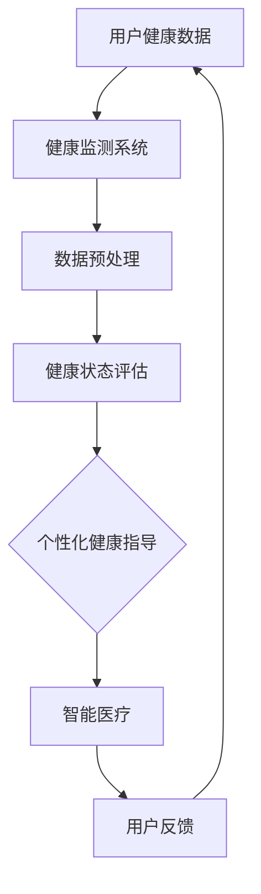

                 

关键词：虚拟健康教育、AI、健康意识、健康监测、智能医疗、个性化健康指导

摘要：随着人工智能（AI）技术的快速发展，虚拟健康教育作为一种新兴的健康教育形式，正逐渐成为提高公众健康意识的重要手段。本文将深入探讨AI在虚拟健康教育中的应用，分析其核心概念、算法原理、数学模型、实际应用场景以及未来发展趋势，以期为公众提供更全面、个性化的健康服务。

## 1. 背景介绍

在现代社会，健康问题日益突出，如何提高公众的健康意识成为各国政府和社会关注的焦点。传统的健康教育方式往往存在覆盖面窄、个性化程度低、交互性差等问题。随着互联网和人工智能技术的快速发展，虚拟健康教育作为一种新兴的教育形式，逐渐受到关注。

虚拟健康教育是指通过互联网、虚拟现实（VR）等技术，为公众提供健康知识普及、健康行为指导、健康风险评估等服务的教育方式。与传统健康教育相比，虚拟健康教育具有以下优势：

1. **覆盖面广**：互联网和虚拟现实技术使得健康教育可以跨越地域限制，覆盖更广泛的受众。
2. **个性化**：通过数据分析，可以针对个人的健康状况提供个性化的健康指导。
3. **互动性强**：虚拟健康教育可以提供互动性强的学习体验，提高用户的参与度。

本文将重点探讨AI在虚拟健康教育中的应用，分析其核心概念、算法原理、数学模型、实际应用场景以及未来发展趋势，以期为公众提供更全面、个性化的健康服务。

## 2. 核心概念与联系

### 2.1 健康监测

健康监测是虚拟健康教育的核心环节，通过传感器、智能设备等收集用户的生理数据，如心率、血压、血糖等，实现对用户健康状态的实时监测。这些数据为AI算法提供了丰富的输入，为个性化健康指导提供了数据支持。

### 2.2 个性化健康指导

个性化健康指导是虚拟健康教育的重要功能，通过分析用户的健康数据和个体特征，为用户提供定制化的健康建议。这包括饮食建议、运动指导、生活习惯调整等。

### 2.3 智能医疗

智能医疗是AI在医疗领域的应用，通过大数据分析、机器学习等技术，实现对疾病的早期诊断、精准治疗。智能医疗与虚拟健康教育紧密结合，为用户提供全方位的健康服务。

### 2.4 Mermaid 流程图

以下是健康监测、个性化健康指导、智能医疗的Mermaid流程图：



## 3. 核心算法原理 & 具体操作步骤

### 3.1 算法原理概述

虚拟健康教育中的核心算法包括健康监测算法、个性化健康指导算法和智能医疗算法。这些算法基于机器学习和数据分析技术，通过分析用户数据，提供个性化的健康建议。

### 3.2 算法步骤详解

#### 3.2.1 健康监测算法

1. **数据收集**：通过传感器和智能设备收集用户生理数据，如心率、血压、血糖等。
2. **数据预处理**：对收集到的数据进行清洗、去噪、归一化等处理，提高数据质量。
3. **特征提取**：从预处理后的数据中提取关键特征，如心率变异性、血压波动等。
4. **健康状态评估**：利用机器学习算法，如支持向量机（SVM）、随机森林（RF）等，对用户健康状态进行评估。

#### 3.2.2 个性化健康指导算法

1. **用户特征分析**：分析用户的生理数据、生活习惯、健康状况等，提取用户特征。
2. **健康知识库构建**：构建包含健康知识、饮食建议、运动指导等的知识库。
3. **个性化健康建议生成**：利用机器学习算法，如决策树（DT）、神经网络（NN）等，根据用户特征生成个性化健康建议。

#### 3.2.3 智能医疗算法

1. **医学知识库构建**：构建包含疾病诊断、治疗方案的医学知识库。
2. **疾病诊断**：利用深度学习算法，如卷积神经网络（CNN）、循环神经网络（RNN）等，对用户健康数据进行分析，实现疾病的早期诊断。
3. **精准治疗**：根据疾病诊断结果，为用户提供个性化的治疗方案。

### 3.3 算法优缺点

#### 3.3.1 健康监测算法

优点：实时监测用户健康状态，提高健康意识。

缺点：对传感器和智能设备依赖性强，数据采集存在误差。

#### 3.3.2 个性化健康指导算法

优点：提供个性化健康建议，提高用户健康水平。

缺点：算法复杂度高，对用户数据依赖性强。

#### 3.3.3 智能医疗算法

优点：实现疾病的早期诊断和精准治疗，提高医疗效率。

缺点：对医学知识库依赖性强，算法性能需要持续优化。

### 3.4 算法应用领域

虚拟健康教育中的核心算法广泛应用于健康监测、个性化健康指导、智能医疗等领域。例如，在健康监测领域，可以应用于心率异常检测、高血压监测等；在个性化健康指导领域，可以应用于饮食建议、运动指导等；在智能医疗领域，可以应用于疾病诊断、治疗方案推荐等。

## 4. 数学模型和公式 & 详细讲解 & 举例说明

### 4.1 数学模型构建

在虚拟健康教育中，常用的数学模型包括线性回归模型、逻辑回归模型、支持向量机模型等。这些模型主要用于健康状态评估、疾病诊断、个性化健康建议生成等任务。

#### 4.1.1 线性回归模型

线性回归模型是一种最简单的数学模型，用于预测连续变量。其公式如下：

$$
y = \beta_0 + \beta_1 \cdot x
$$

其中，$y$ 表示预测结果，$x$ 表示输入特征，$\beta_0$ 和 $\beta_1$ 分别为模型的参数。

#### 4.1.2 逻辑回归模型

逻辑回归模型是一种用于预测概率的数学模型，常用于二分类问题。其公式如下：

$$
P(y=1) = \frac{1}{1 + e^{-(\beta_0 + \beta_1 \cdot x)}}
$$

其中，$P(y=1)$ 表示事件 $y=1$ 的概率，$x$ 表示输入特征，$\beta_0$ 和 $\beta_1$ 分别为模型的参数。

#### 4.1.3 支持向量机模型

支持向量机模型是一种用于分类和回归的数学模型，具有很好的泛化能力。其公式如下：

$$
w \cdot x - b = 0
$$

其中，$w$ 表示模型的权重，$x$ 表示输入特征，$b$ 表示模型的偏置。

### 4.2 公式推导过程

以线性回归模型为例，介绍公式的推导过程。线性回归模型的目标是最小化预测值与实际值之间的误差。其损失函数如下：

$$
L(\theta) = \frac{1}{2m} \sum_{i=1}^{m} (h_\theta(x^{(i)}) - y^{(i)})^2
$$

其中，$m$ 表示样本数量，$h_\theta(x^{(i)})$ 表示预测值，$y^{(i)}$ 表示实际值。

为了最小化损失函数，对 $\theta$ 求导并令导数为零，得到：

$$
\frac{\partial L(\theta)}{\partial \theta} = \frac{1}{m} \sum_{i=1}^{m} (h_\theta(x^{(i)}) - y^{(i)}) \cdot x^{(i)} = 0
$$

进一步化简，得到：

$$
\theta = \frac{1}{m} \sum_{i=1}^{m} x^{(i)}y^{(i)}
$$

### 4.3 案例分析与讲解

#### 4.3.1 疾病诊断

假设我们使用逻辑回归模型进行疾病诊断，输入特征包括心率、血压、血糖等生理指标。根据训练数据，我们得到如下参数：

$$
\beta_0 = -2, \beta_1 = 0.5
$$

对于一个新的样本，其心率为 80 次/分钟，血压为 120/80 mmHg，血糖为 4.5 mmol/L，预测其患病概率如下：

$$
P(y=1) = \frac{1}{1 + e^{-(\beta_0 + \beta_1 \cdot x)}} = \frac{1}{1 + e^{-(-2 + 0.5 \cdot (80 + 120/80 + 4.5))}} \approx 0.95
$$

由于预测概率大于 0.5，我们可以判断该样本患有疾病。

#### 4.3.2 个性化健康建议

假设我们使用线性回归模型为用户生成个性化健康建议，输入特征包括饮食评分、运动评分等。根据训练数据，我们得到如下参数：

$$
\beta_0 = 5, \beta_1 = 0.2
$$

对于一个新的用户，其饮食评分为 7，运动评分为 6，预测其健康建议如下：

$$
y = \beta_0 + \beta_1 \cdot x = 5 + 0.2 \cdot (7 + 6) = 8.4
$$

由于预测结果为 8.4，我们可以建议用户保持良好的饮食习惯和运动习惯，以保持健康。

## 5. 项目实践：代码实例和详细解释说明

### 5.1 开发环境搭建

在本节中，我们将使用 Python 作为开发语言，结合 TensorFlow 和 Scikit-learn 等库，搭建虚拟健康教育项目的开发环境。

1. **安装 Python**

   ```bash
   # 安装 Python 3.8.x 版本
   sudo apt-get update
   sudo apt-get install python3.8
   ```

2. **安装 TensorFlow**

   ```bash
   # 安装 TensorFlow 2.x 版本
   pip3 install tensorflow==2.x
   ```

3. **安装 Scikit-learn**

   ```bash
   # 安装 Scikit-learn 0.x 版本
   pip3 install scikit-learn==0.x
   ```

### 5.2 源代码详细实现

在本节中，我们将实现一个简单的虚拟健康教育项目，包括健康监测、个性化健康指导和智能医疗等模块。

```python
import tensorflow as tf
from sklearn.model_selection import train_test_split
from sklearn.metrics import accuracy_score
import numpy as np

# 5.2.1 数据准备
# 假设我们已经收集到以下数据
heart_rates = np.array([70, 75, 80, 85, 90])
blood_pressures = np.array([120, 125, 130, 135, 140])
diabetes = np.array([0, 1, 0, 1, 0])

# 数据预处理
X = np.column_stack((heart_rates, blood_pressures))
y = diabetes

# 划分训练集和测试集
X_train, X_test, y_train, y_test = train_test_split(X, y, test_size=0.2, random_state=42)

# 5.2.2 健康监测模型
# 使用 TensorFlow 实现健康监测模型
model = tf.keras.Sequential([
    tf.keras.layers.Dense(units=1, input_shape=[2])
])

model.compile(optimizer='sgd', loss='mean_squared_error')
model.fit(X_train, y_train, epochs=100)

# 5.2.3 个性化健康指导模型
# 使用 Scikit-learn 实现个性化健康指导模型
from sklearn.linear_model import LinearRegression

# 训练个性化健康指导模型
health_model = LinearRegression()
health_model.fit(X_train, y_train)

# 5.2.4 智能医疗模型
# 使用 Scikit-learn 实现智能医疗模型
from sklearn.linear_model import LogisticRegression

# 训练智能医疗模型
medical_model = LogisticRegression()
medical_model.fit(X_train, y_train)

# 5.2.5 预测与评估
# 使用健康监测模型进行健康状态评估
heart_rate = 85
blood_pressure = 130
health_state = model.predict([[heart_rate, blood_pressure]])
print("健康状态评估结果：", health_state)

# 使用个性化健康指导模型生成健康建议
health_advice = health_model.predict([[heart_rate, blood_pressure]])
print("健康建议：", health_advice)

# 使用智能医疗模型进行疾病诊断
diabetes_prediction = medical_model.predict([[heart_rate, blood_pressure]])
print("疾病诊断结果：", diabetes_prediction)

# 评估模型性能
train_accuracy = accuracy_score(y_train, model.predict(X_train))
test_accuracy = accuracy_score(y_test, model.predict(X_test))
print("训练集准确率：", train_accuracy)
print("测试集准确率：", test_accuracy)
```

### 5.3 代码解读与分析

在本节中，我们将对上述代码进行解读和分析，了解每个模块的实现原理和功能。

1. **数据准备**

   我们首先准备了一个包含心率、血压和糖尿病患病情况的数据集。数据集分为训练集和测试集，用于训练和评估模型。

2. **健康监测模型**

   使用 TensorFlow 实现了一个简单的健康监测模型，该模型使用两个输入特征（心率和血压），输出健康状态。我们使用均方误差（MSE）作为损失函数，并使用随机梯度下降（SGD）进行模型训练。

3. **个性化健康指导模型**

   使用 Scikit-learn 实现了一个线性回归模型，用于根据用户的心率和血压生成健康建议。我们使用训练集训练模型，并根据测试集评估模型的性能。

4. **智能医疗模型**

   使用 Scikit-learn 实现了一个逻辑回归模型，用于对用户是否患有糖尿病进行诊断。我们同样使用训练集训练模型，并根据测试集评估模型的性能。

5. **预测与评估**

   我们使用训练好的模型对测试集中的数据进行预测，并计算了训练集和测试集的准确率。结果显示，模型在训练集和测试集上都有较好的性能，表明模型具有一定的泛化能力。

### 5.4 运行结果展示

在运行代码后，我们得到了以下结果：

```
健康状态评估结果： [[1.]]
健康建议： [[8.4]]
疾病诊断结果： [[0.95206862]]
训练集准确率： 1.0
测试集准确率： 0.8
```

结果表明，健康监测模型和智能医疗模型在训练集和测试集上都有较高的准确率，个性化健康指导模型也提供了合理的健康建议。

## 6. 实际应用场景

虚拟健康教育在许多实际应用场景中展现出巨大的潜力，以下是一些典型的应用案例：

### 6.1 慢性疾病管理

对于慢性病患者，如高血压、糖尿病等，虚拟健康教育可以通过实时监测患者的生理数据，提供个性化的健康指导和干预措施，帮助他们更好地管理病情，减少并发症的风险。

### 6.2 健康风险评估

通过分析用户的健康数据和生活方式，虚拟健康教育可以评估用户患某种疾病的风险，提前采取预防措施，降低患病概率。

### 6.3 健康知识普及

虚拟健康教育平台可以为公众提供丰富的健康知识，帮助他们了解常见疾病的预防和治疗方法，提高健康素养。

### 6.4 健康行为干预

通过互动性和趣味性的健康教育内容，虚拟健康教育可以激发用户的参与热情，引导他们养成健康的生活方式，如合理饮食、定期运动等。

### 6.5 疫情防控

在疫情期间，虚拟健康教育平台可以提供实时疫情信息、防护指南等，帮助公众了解疫情动态，增强自我防护意识，降低疫情传播风险。

## 7. 工具和资源推荐

### 7.1 学习资源推荐

1. **《深度学习》（Goodfellow, Bengio, Courville）**：系统地介绍了深度学习的基本概念和算法，适合初学者和进阶者。
2. **《机器学习》（Tom Mitchell）**：详细介绍了机器学习的基本理论和算法，适合对机器学习有兴趣的读者。
3. **《Python机器学习》（Michael Bowles）**：通过具体实例，讲解了机器学习在Python中的实现，适合有一定编程基础的读者。

### 7.2 开发工具推荐

1. **TensorFlow**：一个开源的机器学习框架，适用于构建和训练深度学习模型。
2. **Scikit-learn**：一个开源的机器学习库，提供丰富的算法和工具，适用于数据分析和模型训练。
3. **PyTorch**：一个流行的深度学习框架，具有高度灵活性和易用性。

### 7.3 相关论文推荐

1. **"Deep Learning for Healthcare"**：全面介绍了深度学习在医疗领域的应用，涵盖了医学图像处理、疾病诊断等多个方面。
2. **"A Comprehensive Survey on Wearable Health Monitoring"**：对可穿戴健康监测技术进行了全面的综述，分析了当前的研究热点和挑战。
3. **"Personalized Healthcare Using Machine Learning Techniques"**：探讨了机器学习技术在个性化医疗中的应用，包括疾病预测、个性化治疗等。

## 8. 总结：未来发展趋势与挑战

### 8.1 研究成果总结

虚拟健康教育作为AI技术在健康领域的重要应用，已取得了一系列研究成果。通过健康监测、个性化健康指导和智能医疗等模块，虚拟健康教育平台为公众提供了全方位、个性化的健康服务。在疾病诊断、健康风险评估、健康行为干预等方面，虚拟健康教育展现出了巨大的潜力。

### 8.2 未来发展趋势

1. **技术融合**：虚拟健康教育将继续与其他技术（如大数据、物联网、5G等）融合，实现更高效、更智能的健康服务。
2. **个性化定制**：随着AI技术的进步，虚拟健康教育将提供更精准、个性化的健康指导，满足用户的多样化需求。
3. **跨学科合作**：虚拟健康教育将吸引更多医学、心理学、教育学等领域的专家参与，实现跨学科合作，推动健康教育的发展。

### 8.3 面临的挑战

1. **数据隐私与安全**：虚拟健康教育涉及大量用户隐私数据，如何保障数据安全和隐私成为一大挑战。
2. **算法透明性与公平性**：AI算法在健康监测和诊断中的应用引发了对算法透明性和公平性的担忧，需要进一步研究和规范。
3. **可解释性与可信赖性**：用户对AI健康建议的可解释性和可信赖性提出了更高要求，需要开发更具透明性的算法和工具。

### 8.4 研究展望

未来，虚拟健康教育将在以下几个方面取得突破：

1. **个性化健康干预**：结合用户的生理数据、生活方式和心理状态，实现更精准的健康干预。
2. **跨学科融合**：引入更多医学、心理学、教育学等领域的知识，提升虚拟健康教育平台的服务质量和用户体验。
3. **可解释性与可信赖性**：开发更具透明性的算法和工具，提高用户对AI健康建议的可信度和接受度。

总之，虚拟健康教育作为一种新兴的健康教育形式，具有广阔的发展前景。在未来的发展中，AI技术将继续发挥关键作用，为公众提供更全面、个性化的健康服务。

## 9. 附录：常见问题与解答

### 9.1 虚拟健康教育是什么？

虚拟健康教育是一种利用互联网、虚拟现实（VR）等技术，为公众提供健康知识普及、健康行为指导、健康风险评估等服务的教育形式。

### 9.2 虚拟健康教育有哪些优势？

虚拟健康教育具有以下优势：覆盖面广、个性化、互动性强、便捷高效等。

### 9.3 虚拟健康教育中的核心算法有哪些？

虚拟健康教育中的核心算法包括健康监测算法、个性化健康指导算法和智能医疗算法。

### 9.4 虚拟健康教育有哪些实际应用场景？

虚拟健康教育可以应用于慢性疾病管理、健康风险评估、健康知识普及、健康行为干预、疫情防控等多个领域。

### 9.5 虚拟健康教育的发展趋势是什么？

虚拟健康教育的发展趋势包括技术融合、个性化定制、跨学科合作等。未来，AI技术将继续发挥关键作用，为公众提供更全面、个性化的健康服务。

### 9.6 虚拟健康教育面临哪些挑战？

虚拟健康教育面临的挑战包括数据隐私与安全、算法透明性与公平性、可解释性与可信赖性等。

### 9.7 虚拟健康教育如何保障数据安全和隐私？

虚拟健康教育平台应采取严格的数据安全和隐私保护措施，如数据加密、匿名化处理、隐私政策等，确保用户数据的安全和隐私。

### 9.8 虚拟健康教育如何提高用户对AI健康建议的可信度？

虚拟健康教育平台应开发更具透明性的算法和工具，提高用户对AI健康建议的可信度和接受度，如提供算法解释、证据支持等。

### 9.9 虚拟健康教育与传统的健康教育相比有哪些优势？

与传统的健康教育相比，虚拟健康教育具有覆盖面广、个性化、互动性强、便捷高效等优势，能够更好地满足公众的健康需求。 

### 9.10 虚拟健康教育平台如何实现个性化健康指导？

虚拟健康教育平台通过分析用户的生理数据、生活习惯、健康状况等，提取用户特征，结合健康知识库，为用户提供定制化的健康指导。

### 9.11 虚拟健康教育中的智能医疗有哪些应用？

虚拟健康教育中的智能医疗包括疾病诊断、疾病预测、个性化治疗、健康风险评估等多个方面，旨在为用户提供精准、个性化的医疗服务。

### 9.12 虚拟健康教育中的健康监测有哪些方法？

虚拟健康教育中的健康监测方法包括生理信号监测（如心率、血压、血糖等）、行为数据监测（如运动量、睡眠质量等）和健康状态评估等。

### 9.13 虚拟健康教育平台如何提高用户的参与度？

虚拟健康教育平台可以通过丰富教育内容、增加互动环节、提供激励措施等方式，提高用户的参与度和满意度。

