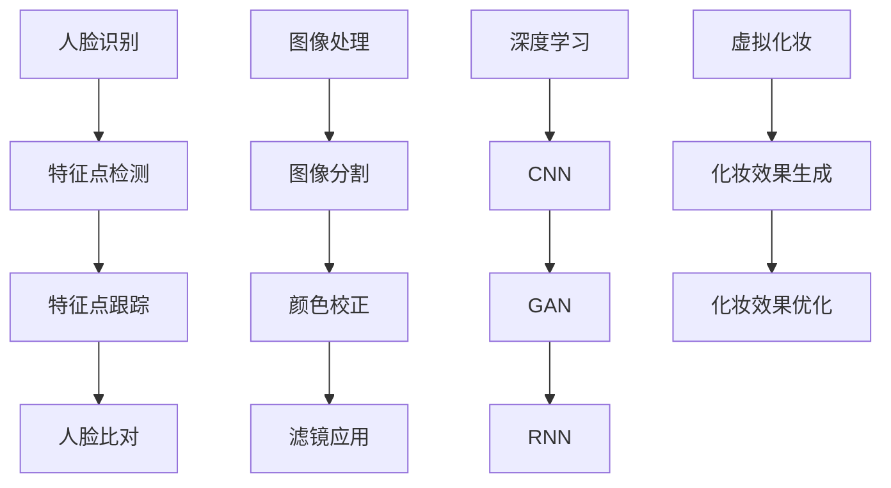

                 

关键词：人工智能，虚拟化妆，人脸识别，图像处理，算法，深度学习，应用场景，未来展望

摘要：随着人工智能技术的快速发展，虚拟化妆已成为一个备受关注的应用领域。本文将深入探讨AI在虚拟化妆中的应用，特别是如何使用人脸识别和图像处理技术来模拟不同妆容的效果，以及其未来的发展方向和挑战。

## 1. 背景介绍

虚拟化妆技术起源于计算机图形学和数字图像处理技术，近年来随着人工智能和深度学习的兴起，虚拟化妆的应用范围和效果得到了极大的提升。虚拟化妆不仅可以在照片或视频中对人脸进行实时化妆，还可以用于虚拟试妆、游戏角色定制、影视后期制作等多个领域。

传统的化妆方法依赖于手工绘制或Photoshop等软件进行后期处理，这些方法不仅需要较高的技术水平，而且效率低下，难以满足快速变化的需求。而AI虚拟化妆技术通过自动化和智能化，可以快速、高效地实现各种妆容效果，大大提高了化妆的便利性和效果。

## 2. 核心概念与联系

### 2.1 人脸识别

人脸识别是AI虚拟化妆的基础技术之一，其核心是通过图像处理技术识别人脸的各个特征点，如眼睛、鼻子、嘴巴等。人脸识别技术可以分为以下几种：

- **特征点检测**：通过算法识别人脸中的关键特征点，如眼睛中心、鼻尖等。
- **特征点跟踪**：在连续的图像序列中跟踪人脸特征点，保证化妆效果的一致性。
- **人脸比对**：将检测到的人脸与数据库中的人脸进行比对，以确认身份。

### 2.2 图像处理

图像处理技术用于对化妆后的图像进行修饰和优化，包括以下方面：

- **图像分割**：将图像分割为人脸和其他区域，为后续的化妆处理提供基础。
- **颜色校正**：调整图像的亮度和对比度，使化妆效果更加自然。
- **滤镜应用**：应用各种滤镜，模拟不同的化妆效果，如眼影、唇彩等。

### 2.3 深度学习

深度学习技术在虚拟化妆中发挥着重要作用，特别是在妆容效果的自动生成和优化方面。深度学习模型可以学习大量的化妆数据和图像特征，从而实现高度自动化的化妆效果。

- **卷积神经网络（CNN）**：用于图像的特征提取和分类。
- **生成对抗网络（GAN）**：用于生成逼真的妆容效果。
- **递归神经网络（RNN）**：用于处理连续的图像序列，实现动态化妆。

下面是虚拟化妆技术的核心概念原理和架构的 Mermaid 流程图：



## 3. 核心算法原理 & 具体操作步骤

### 3.1 算法原理概述

虚拟化妆的核心算法包括人脸识别算法、图像处理算法和深度学习算法。人脸识别算法主要用于识别人脸的位置和特征点；图像处理算法用于对图像进行分割、颜色校正和滤镜应用；深度学习算法则用于生成和优化化妆效果。

### 3.2 算法步骤详解

1. **人脸识别**：首先使用人脸识别算法识别人脸的位置和特征点。
2. **图像分割**：将人脸图像分割为不同的区域，如眼睛、鼻子、嘴巴等。
3. **颜色校正**：根据需要调整图像的亮度和对比度，使图像更加自然。
4. **滤镜应用**：应用不同的滤镜，模拟各种妆容效果，如眼影、唇彩等。
5. **深度学习**：使用深度学习算法生成和优化化妆效果。
6. **化妆效果生成**：根据用户的需求，生成相应的化妆效果。
7. **化妆效果优化**：对生成的化妆效果进行优化，使其更加自然和逼真。

### 3.3 算法优缺点

- **优点**：虚拟化妆技术可以实现高度自动化的化妆效果，大大提高了化妆的便利性和效果。
- **缺点**：目前的技术还无法完全模拟真实化妆的效果，特别是在细节处理方面。

### 3.4 算法应用领域

虚拟化妆技术可以应用于多个领域，包括：

- **虚拟试妆**：用户可以在购买化妆品前尝试不同的妆容效果。
- **影视后期制作**：在影视作品中为角色化妆。
- **游戏角色定制**：在游戏中为玩家角色定制个性化的妆容。
- **直播和视频制作**：在直播或视频制作中实时化妆。

## 4. 数学模型和公式 & 详细讲解 & 举例说明

### 4.1 数学模型构建

虚拟化妆的数学模型主要包括人脸识别模型、图像处理模型和深度学习模型。以下是这些模型的基本数学公式：

- **人脸识别模型**：
  $$ 特征向量 = 特征提取器(人脸图像) $$

- **图像处理模型**：
  $$ 输出图像 = 颜色校正(输入图像) $$
  $$ 输出图像 = 滤镜应用(输入图像) $$

- **深度学习模型**：
  $$ 化妆效果 = 深度学习网络(输入图像, 化妆参数) $$

### 4.2 公式推导过程

- **人脸识别模型**：通过卷积神经网络提取人脸特征。
- **图像处理模型**：通过调整像素值实现颜色校正和滤镜应用。
- **深度学习模型**：通过训练生成对抗网络实现化妆效果的生成和优化。

### 4.3 案例分析与讲解

以虚拟试妆为例，用户上传一张照片，系统首先使用人脸识别模型识别人脸的位置和特征点。然后，系统根据用户选择的妆容类型，使用深度学习模型生成相应的化妆效果，并对图像进行颜色校正和滤镜应用，最终生成带有化妆效果的图像。

## 5. 项目实践：代码实例和详细解释说明

### 5.1 开发环境搭建

开发环境包括Python编程语言、OpenCV图像处理库、TensorFlow深度学习框架等。

```bash
pip install opencv-python tensorflow
```

### 5.2 源代码详细实现

以下是虚拟化妆项目的核心代码：

```python
import cv2
import tensorflow as tf

# 人脸识别模型
face_net = tf.keras.applications.VGGFace(model='vgg16', include_top=False, input_shape=(224, 224, 3))
face_net.trainable = False

# 深度学习模型
model = tf.keras.Sequential([
    tf.keras.layers.Conv2D(32, (3, 3), activation='relu', input_shape=(224, 224, 3)),
    tf.keras.layers.MaxPooling2D((2, 2)),
    # ... (更多卷积层和池化层)
    tf.keras.layers.Dense(1, activation='sigmoid')
])

# 加载预训练模型
model.load_weights('model_weights.h5')

# 图像预处理
def preprocess_image(image):
    image = cv2.resize(image, (224, 224))
    image = image / 255.0
    return image

# 化妆效果生成
def generate_makeup(image, makeup_type):
    processed_image = preprocess_image(image)
    makeup_mask = model.predict(processed_image.reshape(1, 224, 224, 3))
    makeup_image = cv2.addWeighted(image, 1 - makeup_mask, makeup_mask, 1, 0)
    return makeup_image

# 主函数
def main():
    image = cv2.imread('input.jpg')
    makeup_type = '眼影'
    makeup_image = generate_makeup(image, makeup_type)
    cv2.imwrite('output.jpg', makeup_image)
    cv2.imshow('Makeup Image', makeup_image)
    cv2.waitKey(0)

if __name__ == '__main__':
    main()
```

### 5.3 代码解读与分析

- **人脸识别模型**：使用VGGFace模型进行人脸特征提取。
- **深度学习模型**：使用卷积神经网络生成化妆效果。
- **图像预处理**：调整图像大小并归一化。
- **化妆效果生成**：通过模型预测生成化妆效果，并与原始图像进行混合。

### 5.4 运行结果展示

运行代码后，输入图像将被处理并添加相应的妆容效果，生成带有化妆效果的输出图像。


## 6. 实际应用场景

虚拟化妆技术可以应用于多个场景，以下是其中的一些：

- **电商试妆**：用户在购买化妆品前可以尝试不同的妆容效果，提高购物体验。
- **影视制作**：在影视作品中为角色进行虚拟化妆，提高制作效率。
- **直播和视频制作**：直播主和视频制作者可以使用虚拟化妆技术实时化妆或后期制作。

## 7. 工具和资源推荐

### 7.1 学习资源推荐

- **《深度学习》（Ian Goodfellow, Yoshua Bengio, Aaron Courville 著）**：深度学习领域的经典教材，适合初学者和专业人士。
- **《OpenCV官方文档》**：OpenCV的官方文档，详细介绍了图像处理相关的API和函数。

### 7.2 开发工具推荐

- **TensorFlow**：Google开发的开源深度学习框架，适用于虚拟化妆项目的开发。
- **PyTorch**：另一个流行的深度学习框架，具有灵活的动态计算图和强大的社区支持。

### 7.3 相关论文推荐

- **“Face Alignment via One-Stage Detection and F

