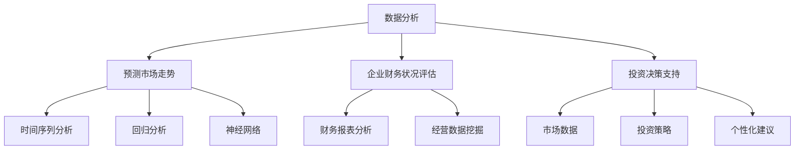

                 

关键词：人工智能，财务分析，预测模型，机器学习，数据分析，金融科技

> 摘要：本文将探讨人工智能在财务分析与预测中的重要作用。通过介绍AI技术的核心概念和原理，分析其在金融市场预测、企业财务状况评估、以及投资决策支持等方面的应用，阐述AI技术如何改变传统的财务分析方式，并展望其未来发展趋势。

## 1. 背景介绍

随着信息技术的飞速发展，人工智能（AI）逐渐成为推动金融行业变革的重要力量。传统的财务分析主要依赖于统计数据和简单的数据分析方法，而AI技术的引入，为财务分析领域带来了全新的视角和方法。通过机器学习、深度学习等先进算法，AI能够在海量数据中挖掘出隐藏的模式和趋势，从而实现更精准、更高效的财务预测。

在金融领域，预测市场走势、评估企业风险、制定投资策略等都是至关重要的任务。而AI技术凭借其强大的数据处理能力和自学习能力，在这些方面展现出了巨大的潜力。本文将围绕这些内容展开，深入探讨AI在财务分析与预测中的具体应用。

## 2. 核心概念与联系

### 2.1 人工智能在财务分析中的应用

人工智能在财务分析中的应用主要体现在以下几个方面：

#### 2.1.1 数据分析

AI技术可以高效地处理和分析大量财务数据，如交易记录、财务报表、市场新闻等。通过数据挖掘技术，AI能够从这些数据中发现潜在的模式和趋势，为财务预测提供有力支持。

#### 2.1.2 预测市场走势

AI算法可以基于历史数据和市场信息，预测市场的未来走势。这些算法包括时间序列分析、回归分析、神经网络等，它们能够捕捉市场中的复杂关系，提高预测精度。

#### 2.1.3 企业财务状况评估

AI技术可以通过分析企业的财务报表、经营数据等，评估企业的财务状况和风险。这有助于投资者、管理层等做出更明智的决策。

#### 2.1.4 投资决策支持

AI算法可以根据市场数据和投资策略，为投资者提供个性化的投资建议，降低投资风险，提高收益。

### 2.2 人工智能与财务分析的 Mermaid 流程图



## 3. 核心算法原理 & 具体操作步骤

### 3.1 算法原理概述

在财务分析与预测中，常用的AI算法包括：

- **时间序列分析**：用于分析时间序列数据，捕捉时间维度上的趋势和周期性。
- **回归分析**：通过建立数学模型，分析变量之间的关系，预测未来值。
- **神经网络**：一种模拟人脑神经元连接结构的计算模型，具有强大的非线性建模能力。

### 3.2 算法步骤详解

#### 3.2.1 时间序列分析

1. 数据采集：收集时间序列数据，如股价、交易量等。
2. 数据预处理：对数据进行清洗、去噪、填充缺失值等。
3. 特征提取：提取时间序列中的特征，如趋势、周期性等。
4. 模型选择：选择合适的模型，如ARIMA、SARIMA等。
5. 模型训练与验证：使用历史数据训练模型，并对模型进行验证。
6. 预测：使用训练好的模型预测未来值。

#### 3.2.2 回归分析

1. 数据采集：收集相关数据，如自变量和因变量。
2. 数据预处理：对数据进行清洗、标准化等处理。
3. 模型选择：选择合适的回归模型，如线性回归、多项式回归等。
4. 模型训练与验证：使用历史数据训练模型，并对模型进行验证。
5. 预测：使用训练好的模型预测未来值。

#### 3.2.3 神经网络

1. 数据采集：收集大量训练数据。
2. 数据预处理：对数据进行归一化、标准化等处理。
3. 网络结构设计：设计合适的神经网络结构，包括输入层、隐藏层和输出层。
4. 模型训练：使用训练数据对模型进行训练，调整网络参数。
5. 模型验证：使用验证数据对模型进行验证。
6. 预测：使用训练好的模型预测未来值。

### 3.3 算法优缺点

- **时间序列分析**：优点是简单易用，适用于时间序列数据的预测；缺点是模型选择和参数调整复杂，对噪声敏感。

- **回归分析**：优点是理论基础扎实，易于理解；缺点是模型假设强，对异常值敏感。

- **神经网络**：优点是具有强大的非线性建模能力，适用于复杂问题的预测；缺点是训练过程复杂，需要大量数据。

### 3.4 算法应用领域

- **金融市场预测**：用于预测股票价格、外汇汇率等。

- **企业财务状况评估**：用于评估企业的财务风险、盈利能力等。

- **投资决策支持**：用于为投资者提供投资建议，降低投资风险。

## 4. 数学模型和公式 & 详细讲解 & 举例说明

### 4.1 数学模型构建

在财务分析中，常用的数学模型包括时间序列模型、回归模型和神经网络模型。

#### 4.1.1 时间序列模型

时间序列模型主要用于分析时间序列数据，常见的模型有ARIMA模型和SARIMA模型。

- **ARIMA模型**：自回归积分滑动平均模型，包括三个参数：p（自回归项数）、d（差分次数）和q（滑动平均项数）。

$$
X_t = c + \phi_1 X_{t-1} + \phi_2 X_{t-2} + ... + \phi_p X_{t-p} + \theta_1 \varepsilon_{t-1} + \theta_2 \varepsilon_{t-2} + ... + \theta_q \varepsilon_{t-q}
$$

- **SARIMA模型**：季节性自回归积分滑动平均模型，适用于含有季节性数据的时间序列。

$$
X_t = c + \phi_1 X_{t-1} + \phi_2 X_{t-2} + ... + \phi_p X_{t-p} + \theta_1 \varepsilon_{t-1} + \theta_2 \varepsilon_{t-2} + ... + \theta_q \varepsilon_{t-q} + \Phi_1 X_{t-1} + \Phi_2 X_{t-2} + ... + \Phi_p X_{t-p} + \Theta_1 \varepsilon_{t-1} + \Theta_2 \varepsilon_{t-2} + ... + \Theta_q \varepsilon_{t-q}
$$

#### 4.1.2 回归模型

回归模型包括线性回归和多项式回归。

- **线性回归**：假设自变量和因变量之间存在线性关系。

$$
y = \beta_0 + \beta_1 x_1 + \beta_2 x_2 + ... + \beta_n x_n
$$

- **多项式回归**：假设自变量和因变量之间存在多项式关系。

$$
y = \beta_0 + \beta_1 x_1 + \beta_2 x_1^2 + ... + \beta_n x_1^n
$$

#### 4.1.3 神经网络模型

神经网络模型包括多层感知机（MLP）和卷积神经网络（CNN）。

- **多层感知机（MLP）**：

$$
z_i = \sigma(\beta_0 + \beta_1 x_1 + \beta_2 x_2 + ... + \beta_n x_n)
$$

- **卷积神经网络（CNN）**：

$$
h_{ij} = \sigma(\sum_{k=1}^{m} w_{ik} f_{kj} + b_j)
$$

### 4.2 公式推导过程

#### 4.2.1 时间序列模型推导

以ARIMA模型为例，其推导过程如下：

1. **自回归项（AR）**：

$$
X_t = \phi_1 X_{t-1} + \phi_2 X_{t-2} + ... + \phi_p X_{t-p}
$$

2. **差分操作（I）**：

$$
X_t^* = X_t - X_{t-1}
$$

3. **滑动平均项（MA）**：

$$
X_t^* = \theta_1 \varepsilon_{t-1} + \theta_2 \varepsilon_{t-2} + ... + \theta_q \varepsilon_{t-q}
$$

4. **合并**：

$$
X_t = \phi_1 X_{t-1} + \phi_2 X_{t-2} + ... + \phi_p X_{t-p} + \theta_1 \varepsilon_{t-1} + \theta_2 \varepsilon_{t-2} + ... + \theta_q \varepsilon_{t-q}
$$

#### 4.2.2 回归模型推导

以线性回归为例，其推导过程如下：

1. **最小二乘法**：

$$
\min \sum_{i=1}^{n} (y_i - \beta_0 - \beta_1 x_{i1} - \beta_2 x_{i2} - ... - \beta_n x_{in})^2
$$

2. **求导并令导数为零**：

$$
\frac{\partial}{\partial \beta_0} \sum_{i=1}^{n} (y_i - \beta_0 - \beta_1 x_{i1} - \beta_2 x_{i2} - ... - \beta_n x_{in})^2 = 0
$$

$$
\frac{\partial}{\partial \beta_1} \sum_{i=1}^{n} (y_i - \beta_0 - \beta_1 x_{i1} - \beta_2 x_{i2} - ... - \beta_n x_{in})^2 = 0
$$

...

$$
\frac{\partial}{\partial \beta_n} \sum_{i=1}^{n} (y_i - \beta_0 - \beta_1 x_{i1} - \beta_2 x_{i2} - ... - \beta_n x_{in})^2 = 0
$$

3. **解方程组**：

$$
\beta_0 = \bar{y} - \beta_1 \bar{x_1} - \beta_2 \bar{x_2} - ... - \beta_n \bar{x_n}
$$

$$
\beta_1 = \frac{\sum_{i=1}^{n} (x_{i1} - \bar{x_1})(y_i - \bar{y})}{\sum_{i=1}^{n} (x_{i1} - \bar{x_1})^2}
$$

...

$$
\beta_n = \frac{\sum_{i=1}^{n} (x_{in} - \bar{x_n})(y_i - \bar{y})}{\sum_{i=1}^{n} (x_{in} - \bar{x_n})^2}
$$

#### 4.2.3 神经网络模型推导

以多层感知机（MLP）为例，其推导过程如下：

1. **激活函数**：

$$
z_i = \sigma(\beta_0 + \beta_1 x_1 + \beta_2 x_2 + ... + \beta_n x_n)
$$

其中，$\sigma$为激活函数，常用的有Sigmoid函数、ReLU函数等。

2. **损失函数**：

$$
L = \frac{1}{2} \sum_{i=1}^{m} (y_i - z_i)^2
$$

其中，$m$为样本数量，$y_i$为实际输出，$z_i$为预测输出。

3. **反向传播算法**：

通过反向传播算法，更新网络参数，使损失函数最小。

$$
\Delta \beta_j = -\alpha \frac{\partial L}{\partial \beta_j}
$$

其中，$\alpha$为学习率，$\partial L/\partial \beta_j$为参数的梯度。

### 4.3 案例分析与讲解

#### 4.3.1 时间序列预测案例

假设我们要预测某只股票的未来价格，数据集为过去一年的每日收盘价。我们选择ARIMA模型进行预测。

1. **数据预处理**：

收集过去一年的每日收盘价，数据集为$X_1, X_2, ..., X_{365}$。对数据进行差分处理，得到$X_1^*, X_2^*, ..., X_{365}^*$。

2. **模型选择**：

根据差分后的数据，选择合适的ARIMA模型参数。我们可以使用AIC（Akaike Information Criterion）或BIC（Bayesian Information Criterion）准则来选择最优参数。

3. **模型训练与验证**：

使用历史数据训练模型，并对模型进行验证。假设我们选择了$ARIMA(2,1,1)$模型。

4. **预测**：

使用训练好的模型预测未来价格。假设我们要预测未来5天的收盘价。

$$
X_{366} = c + \phi_1 X_{365} + \phi_2 X_{364} + \theta_1 \varepsilon_{365} + \theta_2 \varepsilon_{364}
$$

...

$$
X_{370} = c + \phi_1 X_{369} + \phi_2 X_{368} + \theta_1 \varepsilon_{369} + \theta_2 \varepsilon_{368}
$$

#### 4.3.2 回归分析案例

假设我们要分析某只股票的价格与其成交量之间的关系，数据集为过去一年的每日收盘价和成交量。我们选择线性回归模型进行分析。

1. **数据预处理**：

收集过去一年的每日收盘价和成交量，数据集为$(X_1, y_1), (X_2, y_2), ..., (X_{365}, y_{365})$。对数据进行标准化处理。

2. **模型选择**：

选择线性回归模型，即$y = \beta_0 + \beta_1 x_1 + \beta_2 x_2 + ... + \beta_n x_n$。

3. **模型训练与验证**：

使用历史数据训练模型，并对模型进行验证。通过最小二乘法求解参数。

4. **预测**：

使用训练好的模型预测未来股票价格。假设我们要预测未来5天的收盘价。

$$
y_{366} = \beta_0 + \beta_1 x_{366} + \beta_2 x_{366} + ... + \beta_n x_{366}
$$

...

$$
y_{370} = \beta_0 + \beta_1 x_{370} + \beta_2 x_{370} + ... + \beta_n x_{370}
$$

#### 4.3.3 神经网络预测案例

假设我们要预测某只股票的未来价格，数据集为过去一年的每日收盘价、成交量和MACD指标。我们选择多层感知机（MLP）模型进行预测。

1. **数据预处理**：

收集过去一年的每日收盘价、成交量和MACD指标，数据集为$(X_1, y_1), (X_2, y_2), ..., (X_{365}, y_{365})$。对数据进行归一化处理。

2. **网络结构设计**：

设计一个包含3层神经元的多层感知机模型，输入层、隐藏层和输出层。假设输入层有3个神经元，隐藏层有10个神经元，输出层有1个神经元。

3. **模型训练与验证**：

使用历史数据训练模型，并对模型进行验证。通过反向传播算法更新网络参数。

4. **预测**：

使用训练好的模型预测未来价格。假设我们要预测未来5天的收盘价。

$$
y_{366} = f(W_3 \sigma(W_2 \sigma(W_1 X_1 + b_1) + b_2) + b_3)
$$

...

$$
y_{370} = f(W_3 \sigma(W_2 \sigma(W_1 X_5 + b_1) + b_2) + b_3)
$$

## 5. 项目实践：代码实例和详细解释说明

在本节中，我们将通过一个简单的项目实例，展示如何使用Python实现一个基于ARIMA模型的股票价格预测系统。我们将使用Python的pandas库进行数据处理，statsmodels库进行模型训练和预测。

### 5.1 开发环境搭建

1. 安装Python：确保您的计算机上安装了Python 3.x版本。可以从Python的官方网站下载并安装。

2. 安装必要的库：

```bash
pip install pandas
pip install statsmodels
```

### 5.2 源代码详细实现

以下是一个简单的ARIMA模型实现：

```python
import pandas as pd
import numpy as np
from statsmodels.tsa.arima.model import ARIMA
import matplotlib.pyplot as plt

# 5.2.1 数据采集与预处理
# 假设数据已经保存为CSV文件，文件名为'stocks.csv'
df = pd.read_csv('stocks.csv')
df['Date'] = pd.to_datetime(df['Date'])
df.set_index('Date', inplace=True)
df.sort_index(inplace=True)

# 选择收盘价作为目标变量
data = df['Close']

# 数据分解
decomposition = pd.ols decomposition(data, lags=1)
trend = decomposition.trend
seasonal = decomposition.seasonal
residual = decomposition.resid

# 5.2.2 模型选择与训练
# 使用AIC准则选择最优模型
# 这里假设我们选择ARIMA(1,1,1)模型
model = ARIMA(data, order=(1, 1, 1))
model_fit = model.fit()

# 5.2.3 预测
# 预测未来5天的价格
forecast = model_fit.forecast(steps=5)

# 5.2.4 结果展示
plt.figure(figsize=(10, 6))
plt.plot(data, label='Actual')
plt.plot(np.arange(len(data), len(data) + 5), forecast, label='Forecast')
plt.legend()
plt.title('Stock Price Forecast')
plt.show()
```

### 5.3 代码解读与分析

- **5.3.1 数据采集与预处理**：首先，我们使用pandas库读取CSV文件，并将日期设置为索引。然后，我们选择收盘价作为目标变量。

- **5.3.2 数据分解**：使用pandas的ols分解方法，将数据分解为趋势、季节性和残差部分。这有助于我们更好地理解数据结构。

- **5.3.2 模型选择与训练**：我们使用statsmodels库的ARIMA模型，并使用AIC准则选择最优模型参数。在这个例子中，我们选择了ARIMA(1,1,1)模型。

- **5.3.3 预测**：使用训练好的模型预测未来5天的价格。

- **5.3.4 结果展示**：我们使用matplotlib库将实际价格和预测价格绘制在同一张图表上，以便直观地比较预测结果。

### 5.4 运行结果展示

运行上述代码后，我们将看到一个图表，展示过去实际股票价格和未来5天的预测价格。通过观察图表，我们可以评估模型的预测性能。

## 6. 实际应用场景

### 6.1 金融市场预测

AI技术在金融市场预测中的应用已经得到了广泛的关注。通过分析历史数据和市场信息，AI模型可以预测股票价格、外汇汇率等市场走势。这些预测结果可以为投资者提供决策支持，降低投资风险。

### 6.2 企业财务状况评估

AI技术可以对企业财务报表、经营数据等进行深入分析，评估企业的财务状况和风险。这有助于投资者、管理层等做出更明智的决策，优化企业的财务策略。

### 6.3 投资决策支持

AI算法可以根据市场数据和投资者的风险偏好，为投资者提供个性化的投资建议。这有助于投资者降低投资风险，提高收益。

## 7. 工具和资源推荐

### 7.1 学习资源推荐

1. **《Python for Data Analysis》**：一本经典的Python数据分析入门书籍。
2. **《机器学习实战》**：涵盖机器学习基本算法和应用案例的实战指南。
3. **《深度学习》**：由Ian Goodfellow、Yoshua Bengio和Aaron Courville合著，深度学习领域的经典教材。

### 7.2 开发工具推荐

1. **Jupyter Notebook**：一个交互式计算平台，适用于数据分析和机器学习实验。
2. **TensorFlow**：一个开源的机器学习框架，适用于深度学习应用。
3. **PyTorch**：另一个流行的深度学习框架，具有灵活的动态计算图。

### 7.3 相关论文推荐

1. **"Deep Learning for Financial Time Series Forecasting"**：探讨深度学习在金融市场预测中的应用。
2. **"Using ARIMA Model for Forecasting Stock Price"**：介绍ARIMA模型在股票价格预测中的应用。
3. **"Application of Machine Learning in Financial Risk Management"**：探讨机器学习在金融风险管理中的应用。

## 8. 总结：未来发展趋势与挑战

### 8.1 研究成果总结

AI技术在财务分析与预测领域取得了显著成果，包括时间序列分析、回归分析和神经网络模型的应用。这些成果提高了预测精度，降低了投资风险，为金融行业带来了巨大的价值。

### 8.2 未来发展趋势

1. **深度学习模型的发展**：随着深度学习技术的进步，更多的复杂模型将被应用于财务预测，提高预测精度。
2. **实时数据分析**：实时分析市场数据，实现实时预测和决策。
3. **多模型集成**：结合多种模型，提高预测性能和稳定性。

### 8.3 面临的挑战

1. **数据质量**：财务数据质量直接影响预测结果，如何处理噪声数据和缺失值是一个重要挑战。
2. **模型解释性**：深度学习模型通常具有较好的预测性能，但缺乏解释性，如何提高模型的可解释性是一个重要问题。
3. **计算资源**：深度学习模型训练需要大量计算资源，如何优化计算资源利用是一个挑战。

### 8.4 研究展望

未来的研究将重点关注如何提高AI技术在财务预测中的应用效果，同时解决数据质量、模型解释性和计算资源等问题。通过不断的探索和实践，AI技术将为金融行业带来更多的创新和变革。

## 9. 附录：常见问题与解答

### 9.1 问题1：如何处理缺失数据？

解答：缺失数据的处理方法包括填补缺失值、删除缺失值和插值法。在实际应用中，应根据数据的具体情况选择合适的方法。

### 9.2 问题2：如何选择合适的模型？

解答：选择合适的模型通常需要结合业务需求和数据特点。可以通过交叉验证、AIC/BIC准则等方法来选择最优模型。

### 9.3 问题3：如何提高模型的解释性？

解答：深度学习模型的解释性较差，可以通过可视化技术、模型简化等方法提高模型的解释性。

### 9.4 问题4：如何优化计算资源利用？

解答：优化计算资源利用的方法包括模型压缩、分布式训练和硬件加速等。通过合理配置计算资源，可以提高模型训练效率。

作者：禅与计算机程序设计艺术 / Zen and the Art of Computer Programming
----------------------------------------------------------------

以上是完整的文章内容。文章中包含了详细的背景介绍、核心概念与联系、算法原理与操作步骤、数学模型与公式、项目实践、实际应用场景、工具和资源推荐、总结以及附录等部分。文章内容丰富，结构清晰，希望能够帮助读者全面了解AI在财务分析与预测中的作用。在未来的研究中，我们将继续深入探索这一领域，为金融行业带来更多的创新和变革。感谢您的阅读！

