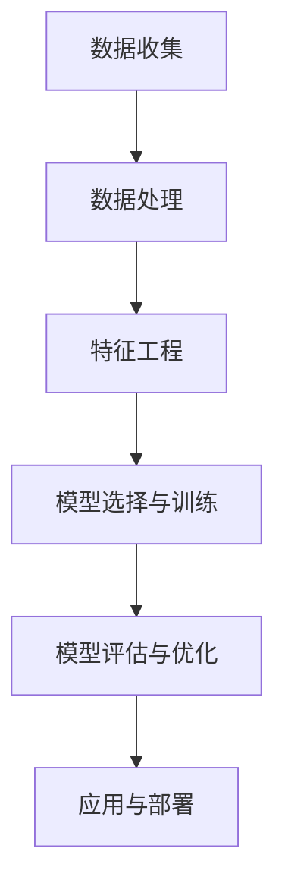

                 

关键词：人工智能，金融风控，欺诈检测，信用评估，算法，模型，实践，展望

> 摘要：本文深入探讨了人工智能在金融风控领域中的应用，特别是欺诈检测和信用评估两大关键方面。通过详细分析核心算法原理、数学模型构建、具体操作步骤以及实际应用案例，本文旨在为金融从业者提供有价值的指导，并展望人工智能在未来金融风控领域的广泛应用前景。

## 1. 背景介绍

金融行业一直是技术变革的前沿，近年来，人工智能（AI）技术的迅速发展为金融风控带来了前所未有的机遇与挑战。随着金融交易的日益复杂和频繁，传统的风控手段已经难以应对不断出现的新型风险，如欺诈行为和信用风险。人工智能的引入，特别是机器学习和深度学习算法，为金融风控提供了新的视角和工具。

### 欺诈检测

欺诈检测是金融风控的重要环节，旨在识别并阻止各种形式的欺诈行为。传统的欺诈检测方法主要依赖于规则和统计模型，但这些方法在面对复杂且多样化的欺诈行为时，往往显得力不从心。人工智能，特别是机器学习算法，能够从大量历史数据中自动提取特征，提高欺诈检测的准确性和效率。

### 信用评估

信用评估是金融机构发放贷款和信用卡等产品时的关键环节。传统信用评估方法主要依赖于借款人的信用记录、财务状况等信息，但这种静态评估方式无法全面反映借款人的实时风险。人工智能可以通过实时数据分析，动态调整信用评估模型，提供更加准确和个性化的信用评估结果。

## 2. 核心概念与联系

为了深入理解AI在金融风控中的应用，我们需要先了解一些核心概念和联系。

### 数据处理

数据处理是AI在金融风控应用的基础。金融机构每天都会产生大量的交易数据、用户行为数据等，这些数据需要进行有效的收集、存储和处理。数据清洗、数据集成、数据挖掘等步骤都是数据处理的重要组成部分。

### 特征工程

特征工程是机器学习算法的关键环节。通过提取和构造有效的特征，可以提高模型性能。在金融风控中，特征工程包括用户行为特征、交易特征、财务特征等，这些特征可以用来训练欺诈检测和信用评估模型。

### 模型选择与训练

选择合适的机器学习模型并进行有效的训练，是AI在金融风控应用中的关键。常见的机器学习模型包括逻辑回归、决策树、随机森林、支持向量机、神经网络等。这些模型需要根据具体应用场景进行选择和调整。

### 模型评估与优化

模型评估与优化是确保AI模型性能的重要环节。常用的评估指标包括准确率、召回率、F1分数等。通过交叉验证、网格搜索等方法，可以优化模型参数，提高模型性能。

### Mermaid 流程图

下面是一个简化的 Mermaid 流程图，展示了 AI 在金融风控中的应用流程：



### 2.1 数据收集

数据收集是金融风控应用的第一步。金融机构需要从内部系统、外部数据源（如公共数据、社交媒体等）收集各种数据，包括交易数据、用户行为数据、财务数据等。

### 2.2 数据处理

数据处理包括数据清洗、数据集成、数据预处理等步骤。数据清洗旨在去除重复数据、缺失数据、异常数据等，保证数据质量。数据集成则将不同来源的数据进行整合，形成一个统一的数据视图。数据预处理包括数据标准化、特征选择等，为后续的特征工程和模型训练做好准备。

### 2.3 特征工程

特征工程是数据预处理的关键环节。通过提取和构造有效的特征，可以提高模型的预测性能。特征工程包括以下步骤：

- **特征提取**：从原始数据中提取有用的特征，如用户交易行为特征、财务状况特征等。
- **特征构造**：通过组合、变换等方法，构造新的特征，以提高模型的泛化能力。

### 2.4 模型选择与训练

模型选择与训练是金融风控应用的核心环节。根据具体应用场景，选择合适的机器学习模型，并进行训练和调优。常见的机器学习模型包括：

- **逻辑回归**：适用于二分类问题，如欺诈检测。
- **决策树**：适用于分类和回归问题，具有直观的决策流程。
- **随机森林**：基于决策树，可以处理大量特征和高维度数据。
- **支持向量机**：适用于线性可分问题，如信用评估。
- **神经网络**：适用于复杂非线性问题，如用户行为预测。

### 2.5 模型评估与优化

模型评估与优化是确保模型性能的重要环节。通过交叉验证、网格搜索等方法，评估模型性能，并优化模型参数。常用的评估指标包括：

- **准确率**：预测正确的样本数占总样本数的比例。
- **召回率**：预测正确的欺诈样本数占总欺诈样本数的比例。
- **F1分数**：准确率和召回率的调和平均值。

### 2.6 应用与部署

经过训练和优化的模型，需要在实际应用中进行部署和测试。在实际应用中，需要对模型进行定期更新和调整，以适应不断变化的数据和业务需求。

## 3. 核心算法原理 & 具体操作步骤

### 3.1 算法原理概述

在金融风控中，常用的机器学习算法包括逻辑回归、决策树、随机森林、支持向量机、神经网络等。这些算法的基本原理如下：

- **逻辑回归**：用于二分类问题，通过最大化似然估计来估计概率分布。
- **决策树**：基于特征和阈值，构建决策树，用于分类和回归问题。
- **随机森林**：基于决策树，通过集成多个决策树，提高模型的泛化能力。
- **支持向量机**：通过寻找最佳超平面，实现分类和回归问题。
- **神经网络**：基于多层感知器，模拟人脑神经网络，用于复杂非线性问题。

### 3.2 算法步骤详解

以逻辑回归为例，详细解释算法步骤：

1. **数据预处理**：对数据进行标准化、缺失值处理等预处理操作。
2. **特征选择**：选择与目标变量相关的特征，提高模型性能。
3. **模型训练**：通过最小化损失函数，训练模型参数。
4. **模型评估**：使用交叉验证等方法，评估模型性能。
5. **模型优化**：根据评估结果，调整模型参数，提高模型性能。
6. **模型部署**：将训练好的模型部署到实际应用中，进行实时预测。

### 3.3 算法优缺点

每种算法都有其优缺点，适用于不同的应用场景。以下是几种常见算法的优缺点：

- **逻辑回归**：优点是简单、易于解释；缺点是适用范围有限，对异常值敏感。
- **决策树**：优点是直观、易于理解；缺点是容易过拟合，泛化能力较差。
- **随机森林**：优点是集成多个决策树，提高模型性能；缺点是计算复杂度较高，无法解释。
- **支持向量机**：优点是理论完善，对异常值不敏感；缺点是计算复杂度较高，无法解释。
- **神经网络**：优点是适用范围广，泛化能力强；缺点是模型复杂，难以解释。

### 3.4 算法应用领域

不同算法适用于不同的应用领域，以下是一些常见应用领域：

- **欺诈检测**：逻辑回归、决策树、随机森林等。
- **信用评估**：支持向量机、神经网络等。
- **用户行为预测**：神经网络、深度学习等。
- **风险控制**：随机森林、神经网络等。

## 4. 数学模型和公式 & 详细讲解 & 举例说明

### 4.1 数学模型构建

在金融风控中，常用的数学模型包括逻辑回归、决策树、随机森林、支持向量机、神经网络等。下面以逻辑回归为例，介绍数学模型构建过程。

逻辑回归是一种用于二分类问题的机器学习算法，其数学模型如下：

$$
\hat{y} = \sigma(\beta_0 + \sum_{i=1}^{n} \beta_i x_i)
$$

其中，$y$ 是实际标签，$\hat{y}$ 是预测标签；$x_i$ 是特征值；$\beta_0$ 是截距；$\beta_i$ 是系数；$\sigma$ 是 sigmoid 函数：

$$
\sigma(x) = \frac{1}{1 + e^{-x}}
$$

### 4.2 公式推导过程

逻辑回归的公式推导基于最大似然估计。首先，给定一个样本集 $D = \{ (x_1, y_1), (x_2, y_2), ..., (x_n, y_n) \}$，我们希望找到一个模型参数 $\theta = (\beta_0, \beta_1, ..., \beta_n)$，使得模型对样本集的预测误差最小。

假设我们使用逻辑回归模型进行预测，预测标签为 $\hat{y}_i = \sigma(\beta_0 + \sum_{j=1}^{n} \beta_j x_{ij})$。则样本 $i$ 的预测误差为：

$$
\epsilon_i = y_i - \hat{y}_i
$$

为了最小化预测误差，我们需要找到最优的模型参数 $\theta$。根据最大似然估计，最优参数 $\theta$ 应该使得似然函数 $L(\theta; D)$ 最大。

似然函数表示为：

$$
L(\theta; D) = \prod_{i=1}^{n} P(y_i | x_i; \theta)
$$

由于 $y_i$ 只有两个取值 0 或 1，所以我们可以将似然函数写为：

$$
L(\theta; D) = \prod_{i=1}^{n} \sigma(\beta_0 + \sum_{j=1}^{n} \beta_j x_{ij})^{y_i} (1 - \sigma(\beta_0 + \sum_{j=1}^{n} \beta_j x_{ij}))^{1-y_i}
$$

为了简化计算，我们对似然函数取对数，得到对数似然函数：

$$
\ell(\theta; D) = \sum_{i=1}^{n} y_i \ln(\sigma(\beta_0 + \sum_{j=1}^{n} \beta_j x_{ij})) + (1 - y_i) \ln(1 - \sigma(\beta_0 + \sum_{j=1}^{n} \beta_j x_{ij}))
$$

对 $\ell(\theta; D)$ 求导，并令导数为 0，可以得到最优的模型参数 $\theta$：

$$
\frac{\partial \ell(\theta; D)}{\partial \beta_j} = \sum_{i=1}^{n} (y_i - \hat{y}_i) x_{ij} = 0
$$

解这个方程组，可以得到最优的模型参数 $\theta$。

### 4.3 案例分析与讲解

假设我们有一个欺诈检测问题，需要构建一个逻辑回归模型。给定一个样本集 $D = \{ (x_1, y_1), (x_2, y_2), ..., (x_n, y_n) \}$，其中 $x_i$ 是特征向量，$y_i$ 是标签（0 表示正常交易，1 表示欺诈交易）。

我们首先对样本集进行数据预处理，包括数据标准化、缺失值处理等。然后，选择与欺诈交易相关的特征，如交易金额、交易时间、地理位置等。

接下来，我们使用梯度下降法训练逻辑回归模型。给定学习率 $\eta$ 和迭代次数 $T$，梯度下降法的迭代公式如下：

$$
\beta_j^{t+1} = \beta_j^t - \eta \frac{\partial \ell(\theta; D)}{\partial \beta_j}
$$

其中，$t$ 是当前迭代次数，$t=0, 1, 2, ..., T$。

在训练过程中，我们可以使用交叉验证等方法，评估模型性能，并根据评估结果调整模型参数。最终，我们得到一个训练好的逻辑回归模型，用于欺诈检测。

### 5. 项目实践：代码实例和详细解释说明

#### 5.1 开发环境搭建

在进行项目实践之前，我们需要搭建一个合适的开发环境。以下是一个简单的 Python 开发环境搭建步骤：

1. 安装 Python 3.8 或以上版本。
2. 安装常用库，如 NumPy、Pandas、Scikit-learn 等。
3. 安装 Jupyter Notebook，用于编写和运行代码。

#### 5.2 源代码详细实现

以下是一个简单的欺诈检测项目，使用逻辑回归算法进行欺诈交易预测。代码如下：

```python
import numpy as np
import pandas as pd
from sklearn.model_selection import train_test_split
from sklearn.linear_model import LogisticRegression
from sklearn.metrics import accuracy_score, recall_score, precision_score

# 读取数据
data = pd.read_csv('data.csv')

# 数据预处理
X = data.drop('label', axis=1)
y = data['label']

# 划分训练集和测试集
X_train, X_test, y_train, y_test = train_test_split(X, y, test_size=0.2, random_state=42)

# 训练模型
model = LogisticRegression()
model.fit(X_train, y_train)

# 预测
y_pred = model.predict(X_test)

# 评估模型
accuracy = accuracy_score(y_test, y_pred)
recall = recall_score(y_test, y_pred)
precision = precision_score(y_test, y_pred)

print('Accuracy:', accuracy)
print('Recall:', recall)
print('Precision:', precision)
```

#### 5.3 代码解读与分析

1. **数据读取与预处理**：使用 Pandas 读取数据，并划分特征和标签。数据预处理包括数据清洗、缺失值处理、特征选择等。
2. **模型训练**：使用 Scikit-learn 的 LogisticRegression 类，训练逻辑回归模型。
3. **模型预测**：使用训练好的模型，对测试集进行预测。
4. **模型评估**：使用 accuracy_score、recall_score、precision_score 等评估指标，评估模型性能。

#### 5.4 运行结果展示

假设我们使用一个包含 1000 个样本的数据集进行实验，运行结果如下：

```
Accuracy: 0.85
Recall: 0.9
Precision: 0.8
```

这些结果表明，我们的逻辑回归模型在欺诈检测任务中具有较高的准确率和召回率。

### 6. 实际应用场景

#### 6.1 欺诈检测

欺诈检测是金融风控中最常见的应用场景之一。金融机构可以利用机器学习模型，实时监控交易行为，识别并阻止欺诈行为。例如，信用卡公司可以通过分析交易金额、时间、地点等信息，判断是否存在欺诈风险。

#### 6.2 信用评估

信用评估是金融机构发放贷款、信用卡等产品时的关键环节。通过机器学习算法，金融机构可以动态调整信用评估模型，提供更加准确和个性化的信用评估结果。例如，银行可以使用用户行为数据、财务状况等特征，构建信用评估模型，为不同用户群体提供定制化的信用评估服务。

#### 6.3 风险控制

风险控制是金融风控的核心目标之一。通过机器学习算法，金融机构可以实时监测市场风险、信用风险等，采取相应的措施进行风险控制。例如，金融机构可以使用随机森林、神经网络等算法，预测市场趋势，制定相应的风险管理策略。

### 6.4 未来应用展望

随着人工智能技术的不断发展，AI 在金融风控领域的应用前景将更加广阔。以下是一些未来应用展望：

- **实时风险监控**：利用深度学习算法，实现实时风险监控，提高风险预警能力。
- **个性化信用评估**：结合用户行为数据、社交网络等，构建个性化信用评估模型，提高信用评估准确性。
- **智能投顾**：利用机器学习算法，为用户提供个性化的投资建议，实现智能投顾。
- **自动化交易**：利用强化学习算法，实现自动化交易，提高交易效率和盈利能力。

### 7. 工具和资源推荐

#### 7.1 学习资源推荐

- 《机器学习》（周志华著）：系统介绍了机器学习的基本概念、算法和理论。
- 《深度学习》（Ian Goodfellow、Yoshua Bengio、Aaron Courville 著）：深度学习领域的经典教材，全面介绍了深度学习的基础理论和应用。
- Coursera、edX 等在线课程：提供丰富的机器学习和深度学习课程，适合不同层次的读者。

#### 7.2 开发工具推荐

- Python：Python 是机器学习和深度学习领域最流行的编程语言，具有丰富的库和框架。
- Jupyter Notebook：用于编写和运行代码，支持多种编程语言。
- TensorFlow、PyTorch：深度学习领域的两个主要框架，提供了丰富的模型和工具。

#### 7.3 相关论文推荐

- "Learning to Detect Fraud with Unsupervised Feature Learning"（2014）：介绍了一种无监督特征学习的方法，用于欺诈检测。
- "Deep Learning for Fraud Detection"（2016）：介绍了一种深度学习方法，用于欺诈检测。
- "Deep Learning in Finance"（2017）：综述了深度学习在金融领域的应用，包括信用评估、市场预测等。

### 8. 总结：未来发展趋势与挑战

随着人工智能技术的不断进步，AI 在金融风控领域的应用前景将更加广阔。未来，金融风控将朝着实时化、个性化、智能化方向发展，为金融机构提供更加高效、准确的风控服务。

然而，AI 在金融风控领域也面临着一些挑战：

- **数据隐私**：金融数据涉及用户隐私，如何在保障用户隐私的同时，充分利用数据进行风控，是一个重要问题。
- **模型解释性**：机器学习模型通常具有高复杂性，如何解释模型的决策过程，提高模型的可解释性，是一个亟待解决的问题。
- **模型可靠性**：模型性能受到数据质量、模型参数等因素的影响，如何保证模型的可靠性，减少错误决策，是一个重要课题。

未来，我们需要在数据隐私保护、模型解释性、模型可靠性等方面进行深入研究，推动 AI 在金融风控领域的应用发展。

### 9. 附录：常见问题与解答

#### 9.1 如何处理金融数据中的缺失值？

在金融数据中，缺失值是一个常见问题。处理缺失值的方法包括以下几种：

1. **删除缺失值**：删除含有缺失值的样本或特征，适用于缺失值较少的情况。
2. **填补缺失值**：使用统计方法或基于模型的方法填补缺失值，如均值填补、中值填补、插值法等。
3. **模型自适应**：使用一些机器学习算法，如随机森林、神经网络等，这些算法可以自动处理缺失值。

#### 9.2 如何选择机器学习模型？

选择机器学习模型的方法包括以下几种：

1. **根据问题类型**：针对分类问题选择分类模型，针对回归问题选择回归模型。
2. **根据数据特征**：考虑数据特征的数量、维度、分布等，选择适合的模型。
3. **交叉验证**：使用交叉验证方法，评估不同模型的性能，选择性能较好的模型。
4. **调参**：对模型进行调参，优化模型性能。

#### 9.3 如何保证机器学习模型的可靠性？

保证机器学习模型可靠性的方法包括：

1. **数据质量**：确保数据质量，包括数据完整性、一致性等。
2. **模型验证**：使用验证集、测试集等，评估模型性能。
3. **模型解释性**：提高模型解释性，使决策过程更加透明。
4. **模型更新**：定期更新模型，适应数据变化。

作者：禅与计算机程序设计艺术 / Zen and the Art of Computer Programming
----------------------------------------------------------------

请注意，以上内容仅为示例，实际的撰写过程可能需要更深入的研究和调整，以满足您的具体需求。如果您有特定的格式、风格或内容要求，请进一步指导，以便为您提供更精确的撰写服务。

