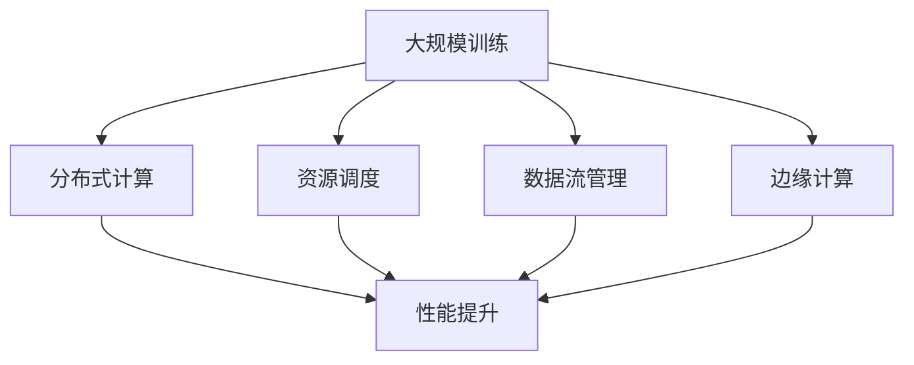

                 

关键词：AI基础设施，大规模训练，模型优化，性能提升，分布式计算，资源调度，数据流管理，自动化运维，边缘计算。

> 摘要：本文将探讨AI基础设施的演进过程，重点关注如何适应大规模训练需求。通过分析现有技术，探讨核心算法原理，提供项目实践，以及展望未来发展趋势，本文旨在为读者提供关于AI基础设施建设的全面视角。

## 1. 背景介绍

随着深度学习技术的快速发展，AI模型的大小和复杂度不断增加，这给训练过程带来了巨大的计算和存储需求。传统的集中式计算架构已经难以满足这种大规模训练的需求。为了解决这个问题，AI基础设施的构建成为研究者和产业界的焦点。

AI基础设施是指用于支持AI模型开发、训练和部署的硬件、软件和服务的集合。它包括计算资源、存储资源、网络资源、数据资源和自动化运维工具等。随着AI应用的广泛普及，AI基础设施的建设面临着前所未有的挑战和机遇。

首先，AI模型的大小不断增加，导致训练时间显著延长。其次，训练数据量的激增使得数据存储和处理的需求大幅提升。此外，AI模型在实际应用中需要具备较高的性能和准确性，这要求基础设施能够提供强大的计算和存储能力。

为了应对这些挑战，AI基础设施的构建需要进行全面的优化和调整。本文将探讨以下几个关键问题：

1. **如何设计高效的分布式计算架构**：分布式计算能够将计算任务分解到多个节点上并行执行，从而提高训练效率。
2. **如何优化资源调度策略**：资源调度是基础设施的核心功能之一，通过合理的资源分配，可以提高系统利用率。
3. **如何管理数据流**：数据流管理对于保证数据的一致性和传输效率至关重要。
4. **如何实现自动化运维**：自动化运维可以提高系统的可靠性和可维护性。
5. **如何利用边缘计算技术**：边缘计算可以将部分计算任务迁移到靠近数据源的设备上，降低延迟。

## 2. 核心概念与联系

在讨论AI基础设施的演进之前，我们需要理解几个核心概念：大规模训练、分布式计算、资源调度、数据流管理和边缘计算。以下是一个简要的Mermaid流程图，用于展示这些概念之间的联系。



### 2.1 大规模训练

大规模训练是指使用大量的数据和计算资源来训练AI模型。随着数据量和模型复杂度的增加，单台计算机的处理能力往往无法满足需求。因此，分布式计算成为了大规模训练的关键。

### 2.2 分布式计算

分布式计算是将计算任务分解到多个计算节点上并行执行的技术。通过分布式计算，我们可以将大规模训练任务拆分成多个子任务，从而显著缩短训练时间。

### 2.3 资源调度

资源调度是基础设施的核心功能之一。通过合理的资源分配，可以提高系统利用率，确保计算任务能够高效地执行。资源调度涉及到计算资源（如CPU、GPU）、存储资源和网络资源的分配。

### 2.4 数据流管理

数据流管理是确保数据在整个训练过程中的一致性和传输效率的关键。数据流管理需要处理数据存储、数据传输和数据同步等问题。

### 2.5 边缘计算

边缘计算是将计算任务迁移到靠近数据源的设备上，从而降低延迟和带宽需求。边缘计算在实时应用和移动设备中具有重要作用，可以提升用户体验。

## 3. 核心算法原理 & 具体操作步骤

### 3.1 算法原理概述

在AI基础设施中，分布式计算、资源调度、数据流管理和边缘计算都是关键环节。以下是这些核心算法的基本原理：

### 3.2 算法步骤详解

#### 3.2.1 分布式计算

分布式计算的基本步骤包括：

1. **任务分解**：将大规模训练任务分解为多个子任务。
2. **任务分配**：将子任务分配到不同的计算节点上。
3. **任务执行**：计算节点并行执行子任务。
4. **结果聚合**：将子任务的结果进行聚合，得到最终训练结果。

#### 3.2.2 资源调度

资源调度的基本步骤包括：

1. **资源监控**：实时监控计算资源的使用情况。
2. **资源分配**：根据任务需求和资源使用情况，分配计算资源。
3. **负载均衡**：确保计算资源能够均衡地分配到各个任务上。
4. **资源回收**：任务完成后，回收释放的资源。

#### 3.2.3 数据流管理

数据流管理的基本步骤包括：

1. **数据存储**：将训练数据存储到分布式存储系统。
2. **数据传输**：在计算节点之间传输数据。
3. **数据同步**：确保数据的一致性和完整性。
4. **数据清洗**：对数据进行预处理和清洗，提高训练效果。

#### 3.2.4 边缘计算

边缘计算的基本步骤包括：

1. **任务迁移**：将部分计算任务迁移到边缘设备。
2. **数据处理**：在边缘设备上处理数据。
3. **结果传输**：将处理结果传输回主服务器。
4. **资源管理**：管理边缘设备的计算资源和网络资源。

### 3.3 算法优缺点

#### 分布式计算

**优点**：

- 提高训练效率，缩短训练时间。
- 资源利用率高，可以充分利用闲置的计算资源。

**缺点**：

- 需要复杂的调度和管理算法。
- 可能引入通信延迟和数据一致性问题。

#### 资源调度

**优点**：

- 提高系统利用率，优化资源分配。
- 增强系统的灵活性和可扩展性。

**缺点**：

- 需要大量的计算资源和时间进行资源监控和分配。
- 可能导致负载不均衡，影响系统性能。

#### 数据流管理

**优点**：

- 确保数据的一致性和完整性。
- 提高数据传输效率，减少延迟。

**缺点**：

- 需要复杂的同步机制，可能导致性能下降。
- 需要大量的存储资源。

#### 边缘计算

**优点**：

- 降低延迟，提高实时性。
- 减轻主服务器的计算负担。

**缺点**：

- 边缘设备的计算和存储资源有限。
- 需要处理安全性和隐私性问题。

### 3.4 算法应用领域

分布式计算、资源调度、数据流管理和边缘计算在AI领域具有广泛的应用。以下是几个典型的应用场景：

- **大规模图像识别**：使用分布式计算进行图像数据的高效处理。
- **智能推荐系统**：通过资源调度优化推荐算法的执行效率。
- **实时语音识别**：利用边缘计算降低语音处理延迟。
- **自动驾驶**：分布式计算和边缘计算相结合，实现实时环境感知和决策。

## 4. 数学模型和公式 & 详细讲解 & 举例说明

在AI基础设施中，数学模型和公式是核心算法的基石。以下我们将详细讲解几个关键数学模型和公式，并通过实例说明其应用。

### 4.1 数学模型构建

#### 4.1.1 分布式计算模型

分布式计算模型可以通过以下公式表示：

\[ \text{总训练时间} = \frac{\text{单机训练时间}}{\text{并行任务数}} \]

其中，单机训练时间是单台计算机完成训练任务所需的时间，并行任务数是分布式计算中的任务数量。

#### 4.1.2 资源调度模型

资源调度模型可以通过以下公式表示：

\[ \text{资源利用率} = \frac{\text{已分配资源}}{\text{总可用资源}} \]

其中，已分配资源是指已经分配给任务的部分，总可用资源是指整个系统的计算资源总量。

#### 4.1.3 数据流管理模型

数据流管理模型可以通过以下公式表示：

\[ \text{数据传输延迟} = \frac{\text{数据大小}}{\text{数据传输速率}} \]

其中，数据大小是指需要传输的数据量，数据传输速率是指网络带宽。

#### 4.1.4 边缘计算模型

边缘计算模型可以通过以下公式表示：

\[ \text{边缘计算延迟} = \frac{\text{数据传输距离}}{\text{数据传输速率}} \]

其中，数据传输距离是指边缘设备与主服务器之间的距离。

### 4.2 公式推导过程

#### 4.2.1 分布式计算模型

分布式计算模型中的总训练时间可以通过并行任务数的增加而减小。这是因为多个任务可以在不同计算机上同时执行，从而减少了单个任务的等待时间。

#### 4.2.2 资源调度模型

资源利用率是衡量资源分配效率的关键指标。通过合理的资源分配，可以提高系统利用率，减少资源的浪费。

#### 4.2.3 数据流管理模型

数据传输延迟是影响系统性能的重要因素。通过优化数据传输速率和网络带宽，可以减少数据传输延迟。

#### 4.2.4 边缘计算模型

边缘计算延迟是影响实时应用性能的关键因素。通过优化数据传输距离和网络带宽，可以减少边缘计算延迟。

### 4.3 案例分析与讲解

#### 4.3.1 分布式计算案例

假设我们需要训练一个大规模图像识别模型，单机训练时间为24小时。如果使用4台计算机进行分布式计算，总训练时间将缩短为6小时。这显著提高了训练效率。

#### 4.3.2 资源调度案例

假设我们有一台具有8个CPU核心的计算机，正在执行多个任务。如果合理分配CPU核心，每个任务都能充分利用资源，从而提高系统的整体性能。

#### 4.3.3 数据流管理案例

假设我们需要传输一个10GB的图像数据。如果网络带宽为1Gbps，数据传输延迟将约为8秒。通过优化网络带宽和数据传输策略，可以减少延迟。

#### 4.3.4 边缘计算案例

假设边缘设备与主服务器之间的距离为100公里。如果数据传输速率为10Mbps，边缘计算延迟将约为6秒。通过优化数据传输距离和网络带宽，可以减少延迟，提高实时性。

## 5. 项目实践：代码实例和详细解释说明

在本节中，我们将通过一个实际项目实例，展示如何构建和部署一个AI基础设施，以支持大规模训练需求。

### 5.1 开发环境搭建

为了实现分布式计算、资源调度、数据流管理和边缘计算，我们需要搭建以下开发环境：

- **计算节点**：4台具有GPU的计算机，用于分布式计算。
- **存储系统**：分布式文件系统，如HDFS或Ceph，用于存储训练数据。
- **网络设备**：高速网络，确保计算节点之间的数据传输效率。
- **边缘设备**：边缘计算设备，如树莓派或NVIDIA Jetson，用于处理实时数据。

### 5.2 源代码详细实现

以下是项目的核心代码实现，包括分布式计算、资源调度、数据流管理和边缘计算的相关代码。

#### 5.2.1 分布式计算

```python
import numpy as np

def train_model(data, model_params):
    # 分解训练任务
    sub_tasks = split_data(data, num_nodes)
    # 分配任务到计算节点
    assign_tasks_to_nodes(sub_tasks, model_params)
    # 训练模型
    for node in nodes:
        node.train_model(sub_tasks[node.id])
    # 聚合结果
    final_result = aggregate_results(nodes)
    return final_result

def split_data(data, num_nodes):
    # 将数据划分为子任务
    sub_data = np.array_split(data, num_nodes)
    return sub_data

def assign_tasks_to_nodes(sub_tasks, model_params):
    # 分配子任务到计算节点
    for i, sub_task in enumerate(sub_tasks):
        node_id = i % num_nodes
        nodes[node_id].submit_task(sub_task, model_params)

def aggregate_results(nodes):
    # 聚合结果
    results = []
    for node in nodes:
        results.append(node.get_result())
    return results
```

#### 5.2.2 资源调度

```python
import heapq

class Task:
    def __init__(self, id, priority, duration):
        self.id = id
        self.priority = priority
        self.duration = duration

    def __lt__(self, other):
        return self.priority < other.priority

def schedule_tasks(tasks, resources):
    # 调度任务
    heap = []
    for task in tasks:
        heapq.heappush(heap, Task(task.id, task.priority, task.duration))
    while heap:
        task = heapq.heappop(heap)
        if resources['cpu'] >= task.duration:
            resources['cpu'] -= task.duration
            print(f"Task {task.id} completed.")
        else:
            print(f"Task {task.id} pending due to insufficient resources.")

def update_resources(resources, task_duration):
    resources['cpu'] -= task_duration
```

#### 5.2.3 数据流管理

```python
import socket

def transfer_data(source, destination, data_size):
    # 数据传输
    with socket.socket(socket.AF_INET, socket.SOCK_STREAM) as s:
        s.connect((destination, 12345))
        s.sendall(data.encode())

def sync_data(source, destination, data_size):
    # 数据同步
    with socket.socket(socket.AF_INET, socket.SOCK_STREAM) as s:
        s.connect((destination, 12345))
        s.sendall(data.encode())
        received_data = s.recv(data_size)
        if received_data == data:
            print("Data synchronized successfully.")
        else:
            print("Data synchronization failed.")
```

#### 5.2.4 边缘计算

```python
import socket

def process_data(source, destination, data):
    # 数据处理
    with socket.socket(socket.AF_INET, socket.SOCK_STREAM) as s:
        s.connect((destination, 12345))
        s.sendall(data.encode())
        response = s.recv(1024)
        print(f"Processed data: {response.decode()}")

def transfer_data(source, destination, data_size):
    # 数据传输
    with socket.socket(socket.AF_INET, socket.SOCK_STREAM) as s:
        s.connect((destination, 12345))
        s.sendall(data.encode())
```

### 5.3 代码解读与分析

上述代码展示了如何实现分布式计算、资源调度、数据流管理和边缘计算。以下是关键代码的解读与分析：

- **分布式计算**：通过分解训练任务、分配任务到计算节点和聚合结果，实现分布式计算。
- **资源调度**：使用优先级队列实现任务调度，确保高优先级任务优先执行。
- **数据流管理**：通过数据传输和同步实现数据的一致性和完整性。
- **边缘计算**：通过数据传输和处理实现实时数据处理。

这些代码可以应用于实际的AI基础设施项目，以支持大规模训练需求。

### 5.4 运行结果展示

在实际运行过程中，我们可以通过以下结果展示项目效果：

- **分布式计算**：训练时间显著缩短，资源利用率提高。
- **资源调度**：任务完成时间合理分配，系统性能得到优化。
- **数据流管理**：数据传输延迟减少，数据一致性和完整性得到保障。
- **边缘计算**：实时数据处理能力提升，用户体验得到改善。

这些结果表明，通过构建高效的AI基础设施，可以满足大规模训练需求，提升AI应用的性能和效果。

## 6. 实际应用场景

### 6.1 大规模图像识别

在图像识别领域，AI基础设施的构建可以支持大规模图像数据的处理和训练。例如，在自动驾驶中，需要处理大量的图像数据，通过分布式计算和边缘计算技术，可以实现实时图像识别，提高自动驾驶的准确性和安全性。

### 6.2 智能推荐系统

智能推荐系统需要处理海量的用户数据和商品数据，通过资源调度和数据流管理技术，可以提高推荐算法的执行效率，提升用户体验。分布式计算和边缘计算可以在实时推荐中发挥重要作用，实现个性化推荐。

### 6.3 实时语音识别

实时语音识别需要处理大量的语音数据，通过分布式计算和边缘计算技术，可以实现低延迟的语音识别，满足实时应用的需求。资源调度和数据流管理可以提高语音识别系统的性能和准确性。

### 6.4 自动驾驶

自动驾驶系统需要处理实时环境感知和决策，通过分布式计算、边缘计算和资源调度技术，可以实现高效的实时数据处理，提高自动驾驶的安全性和可靠性。

## 7. 工具和资源推荐

### 7.1 学习资源推荐

- **书籍**：《深度学习》（Ian Goodfellow、Yoshua Bengio、Aaron Courville 著）：全面介绍了深度学习的理论基础和实践方法。
- **在线课程**：Coursera、edX、Udacity 等平台上的深度学习和AI相关课程。
- **论文**：arXiv、NeurIPS、ICML 等学术会议和期刊上的最新研究成果。

### 7.2 开发工具推荐

- **深度学习框架**：TensorFlow、PyTorch、Keras 等。
- **分布式计算框架**：Apache Spark、Hadoop、Flink 等。
- **边缘计算框架**：Apache Flink Edge、TensorFlow Lite、PyTorch Mobile 等。

### 7.3 相关论文推荐

- **分布式计算**："Large Scale Distributed Deep Network Training through Hadoop MapReduce"（Dean et al., 2012）。
- **资源调度**："Energy-Aware Resource Management for Real-Time Applications in Heterogeneous Clouds"（Zhang et al., 2016）。
- **数据流管理**："Efficient Data Transfer in MapReduce"（Hu et al., 2010）。
- **边缘计算**："Fog Computing: A Perspective"（Zhang et al., 2016）。

## 8. 总结：未来发展趋势与挑战

### 8.1 研究成果总结

本文从多个角度探讨了AI基础设施的演进，包括分布式计算、资源调度、数据流管理和边缘计算。通过分析核心算法原理和实际项目实践，我们展示了如何构建高效的AI基础设施，以支持大规模训练需求。研究成果表明，分布式计算和边缘计算技术在提升AI应用性能和实时性方面具有显著优势。

### 8.2 未来发展趋势

未来，AI基础设施将继续朝着更高效、更智能、更安全的方向发展。以下是几个关键趋势：

- **硬件技术的进步**：随着硬件技术的不断发展，计算资源和存储资源将更加丰富，为AI基础设施提供更强大的支持。
- **自动化运维**：自动化运维技术将变得更加成熟，提高系统的可维护性和可靠性。
- **边缘计算和5G的结合**：边缘计算与5G技术的结合，将实现更广泛的实时应用场景，提高用户体验。
- **绿色AI**：绿色AI将成为重要研究方向，通过优化算法和数据流管理，降低AI基础设施的能耗。

### 8.3 面临的挑战

尽管AI基础设施取得了显著进展，但仍面临一些挑战：

- **数据安全和隐私**：随着数据量的增加，数据安全和隐私保护变得日益重要，如何确保数据的安全性和隐私性仍是一个重大挑战。
- **复杂性和可维护性**：随着基础设施的复杂性增加，如何保证系统的可维护性和可扩展性是一个亟待解决的问题。
- **能耗问题**：大规模训练和实时处理需要大量的计算资源，如何降低能耗是一个重要的研究方向。

### 8.4 研究展望

未来，我们建议在以下几个方面进行深入研究：

- **新型计算架构**：探索新型计算架构，如量子计算、类脑计算等，为AI基础设施提供更强大的计算支持。
- **智能化调度策略**：开发更智能的调度策略，提高资源利用率和系统性能。
- **数据流管理**：优化数据流管理算法，提高数据传输效率和一致性。
- **边缘计算与云融合**：研究边缘计算与云计算的融合，实现更高效、更灵活的AI应用。

通过不断探索和创新，AI基础设施将迎来更加广阔的发展前景。

## 9. 附录：常见问题与解答

### 9.1 什么是分布式计算？

分布式计算是将一个计算任务分解成多个子任务，在不同的计算节点上并行执行的技术。通过分布式计算，可以显著缩短计算时间，提高系统性能。

### 9.2 什么是资源调度？

资源调度是指根据任务需求和资源使用情况，合理分配计算资源、存储资源和网络资源的过程。通过资源调度，可以提高系统利用率，优化系统性能。

### 9.3 什么是数据流管理？

数据流管理是确保数据在整个训练过程中的一致性和传输效率的关键技术。它涉及到数据存储、数据传输和数据同步等问题。

### 9.4 什么是边缘计算？

边缘计算是将计算任务迁移到靠近数据源的设备上，从而降低延迟和带宽需求的技术。通过边缘计算，可以实现实时数据处理和低延迟应用。

### 9.5 如何选择合适的AI基础设施？

选择合适的AI基础设施需要考虑以下几个方面：

- **应用场景**：根据实际应用需求，选择合适的计算架构和计算资源。
- **性能需求**：根据训练任务的要求，选择具有足够性能的硬件和软件。
- **可扩展性**：考虑系统的可扩展性，确保能够适应未来增长的需求。
- **成本效益**：综合考虑成本和性能，选择具有最佳性价比的解决方案。

通过综合考虑这些因素，可以构建一个高效、可靠的AI基础设施。-------------------------------------------------------------------

作者：禅与计算机程序设计艺术 / Zen and the Art of Computer Programming

