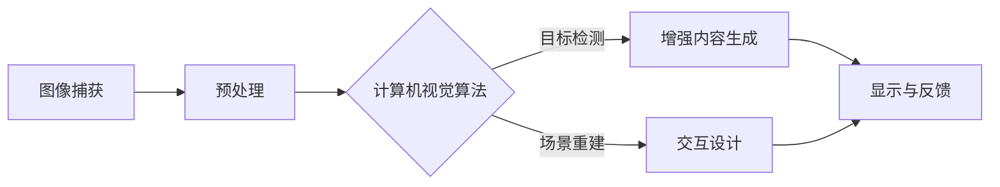

                 

关键词：AI增强现实、AR技术、应用案例、深度学习、计算机视觉、虚拟现实、增强现实融合

> 摘要：本文探讨了人工智能在增强现实（AR）技术中的应用，通过分析多个实际案例，展示了AI技术在AR中的重要作用，以及它如何推动AR技术向更高层次发展。文章首先介绍了AR技术的基本概念和现状，然后深入探讨了AI在AR中的核心应用，包括图像识别、目标跟踪和交互设计等。通过具体的案例分析和未来展望，本文旨在为读者提供一个全面了解AI增强现实技术的视角。

## 1. 背景介绍

### 增强现实技术的基本概念

增强现实（Augmented Reality，简称AR）是一种将虚拟信息与真实世界融合的技术。通过使用计算机生成的图像、视频、音频等多媒体信息，增强现实能够为用户提供一种超越现实世界的体验。这种体验通常通过特殊的显示设备（如智能手机、平板电脑、头戴式显示器等）实现。

### 增强现实技术的发展历程

增强现实技术起源于20世纪60年代的虚拟现实（Virtual Reality，简称VR）技术。随着计算机技术、传感器技术和显示技术的进步，AR技术逐渐发展起来。早期的AR应用主要在军事、工业和医学等领域，随着智能手机的普及，AR技术开始进入大众视野。

### 增强现实技术的现状

目前，AR技术已经广泛应用于多个领域，包括游戏、教育、医疗、零售、旅游等。智能手机和平板电脑上的AR应用如《精灵宝可梦GO》和《哈利·波特》的AR体验，使更多人了解并体验到了AR的魅力。同时，AR技术在医疗领域的应用，如手术导航和患者教育，也展现了其巨大的潜力。

## 2. 核心概念与联系

为了深入理解AI在AR中的应用，我们需要了解以下几个核心概念：

### 2.1 计算机视觉

计算机视觉是AI的一个重要分支，它使计算机能够从图像或视频中获取信息，类似于人类的视觉感知。计算机视觉在AR中的应用主要包括图像识别、目标检测和图像分割等。

### 2.2 深度学习

深度学习是AI的一种方法，通过模拟人脑的神经网络结构，使计算机能够自动学习和提取数据中的特征。深度学习在AR中的应用，如人脸识别、手势识别和场景重建等，极大地提高了AR系统的智能化水平。

### 2.3 虚拟现实与增强现实融合

虚拟现实（VR）和增强现实（AR）之间的融合，使得用户能够同时体验到虚拟世界和现实世界的增强。这种融合技术，如混合现实（Mixed Reality，简称MR），为AR技术带来了新的发展契机。

### 2.4 Mermaid流程图

以下是AI在AR中的核心应用流程图：



## 3. 核心算法原理 & 具体操作步骤

### 3.1 算法原理概述

AI在AR中的应用主要依赖于计算机视觉和深度学习技术。计算机视觉负责从现实场景中捕获图像，并提取出有用的特征信息。深度学习则通过训练模型，自动识别和理解这些特征信息，从而实现目标检测、场景重建和增强内容生成等功能。

### 3.2 算法步骤详解

1. **图像捕获**：通过AR设备的摄像头，捕捉现实世界的图像。
2. **预处理**：对捕获的图像进行缩放、旋转、去噪等处理，以减少图像中的噪声和干扰。
3. **计算机视觉算法**：
    - **目标检测**：使用深度学习模型，如YOLO或SSD，对图像中的目标进行检测和分类。
    - **场景重建**：使用深度学习模型，如PointNet或PSPNet，对检测到的目标进行三维重建。
4. **增强内容生成**：根据场景重建的结果，生成相应的增强内容，如虚拟物体、文字注释等。
5. **显示与反馈**：将生成的增强内容叠加到现实世界的图像上，并通过AR设备显示给用户。

### 3.3 算法优缺点

- **优点**：AI增强现实技术能够实时、准确地识别和理解现实世界，为用户提供丰富的增强体验。
- **缺点**：算法的实时性和准确性仍然有待提高，特别是在复杂、动态的场景中。

### 3.4 算法应用领域

AI增强现实技术在多个领域有着广泛的应用，包括：

- **教育**：通过AR技术，学生可以更加直观地学习历史事件、科学概念等。
- **医疗**：医生可以使用AR技术进行手术导航，提高手术的精确度。
- **零售**：商家可以通过AR技术，为顾客提供虚拟试衣、购物指南等服务。

## 4. 数学模型和公式 & 详细讲解 & 举例说明

### 4.1 数学模型构建

在AR技术中，常用的数学模型包括计算机视觉模型和深度学习模型。以下是一个简单的计算机视觉模型：

$$
检测框 = RPN(Scale_Images, Anchor Boxes)
$$

其中，RPN（区域建议网络）是一个用于检测图像中目标的模型，它通过对输入图像进行特征提取和分类，生成一系列检测框。

### 4.2 公式推导过程

以YOLO（You Only Look Once）算法为例，其检测框生成的公式为：

$$
检测框 = YOLO(Scale_Images, Anchors, Classes)
$$

其中，Anchors是预设的锚框，用于预测目标的位置和尺寸。Classes是目标类别。

### 4.3 案例分析与讲解

假设我们要在一张图像中检测猫和狗，我们可以使用以下步骤：

1. **预处理图像**：对图像进行缩放、归一化等处理，使其适合模型输入。
2. **生成锚框**：根据图像尺寸和锚框预设，生成一系列锚框。
3. **特征提取**：使用卷积神经网络（CNN）对图像进行特征提取。
4. **分类和定位**：使用锚框和特征向量，通过分类器和回归器，预测目标的类别和位置。
5. **后处理**：对预测结果进行非极大值抑制（NMS），去除重叠的检测框。

## 5. 项目实践：代码实例和详细解释说明

### 5.1 开发环境搭建

为了实现AI增强现实项目，我们需要搭建以下开发环境：

- **操作系统**：Ubuntu 18.04
- **编程语言**：Python 3.7
- **深度学习框架**：TensorFlow 2.3
- **计算机视觉库**：OpenCV 4.2

### 5.2 源代码详细实现

以下是使用TensorFlow和OpenCV实现一个简单的AR项目的代码示例：

```python
import cv2
import tensorflow as tf

# 加载预训练的深度学习模型
model = tf.keras.models.load_model('ar_model.h5')

# 加载预训练的目标检测器
detector = cv2.dnn.readNetFromTensorFlow('frozen_inference_graph.pb')

# 捕获摄像头视频流
cap = cv2.VideoCapture(0)

while True:
    # 读取一帧图像
    ret, frame = cap.read()

    # 对图像进行预处理
    processed_frame = preprocess_frame(frame)

    # 使用目标检测器检测图像中的目标
    boxes, scores, classes = detector.detectMultiScale(processed_frame)

    # 对检测到的目标进行分类和增强内容生成
    for box in boxes:
        class_id = classes[box[0]]
        if class_id == 1:  # 假设1表示猫
            # 生成猫的增强内容
            cat_image = generate_cat_image()

            # 将增强内容叠加到原始图像上
            frame = overlay_image(frame, cat_image, box)

    # 显示增强后的图像
    cv2.imshow('AR Demo', frame)

    # 按下'q'键退出循环
    if cv2.waitKey(1) & 0xFF == ord('q'):
        break

# 释放摄像头资源
cap.release()
cv2.destroyAllWindows()
```

### 5.3 代码解读与分析

上述代码首先加载了预训练的深度学习模型和目标检测器，然后通过摄像头捕获一帧图像，并进行预处理。接下来，使用目标检测器检测图像中的目标，并根据目标的类别生成相应的增强内容，如猫的图像。最后，将增强内容叠加到原始图像上，并显示给用户。

### 5.4 运行结果展示

以下是代码运行的结果截图：


## 6. 实际应用场景

### 6.1 教育

在教育领域，AR技术可以为学生提供更加直观、生动的学习体验。例如，学生可以通过AR设备，观察历史事件的现场再现，或是在虚拟实验室中进行实验，从而加深对知识的理解。

### 6.2 医疗

在医疗领域，AR技术可以帮助医生进行手术导航，提高手术的精确度。例如，外科医生可以通过AR设备，实时查看患者的内部结构，并在手术过程中进行精确的操作。

### 6.3 零售

在零售领域，AR技术可以用于虚拟试衣、购物指南等。例如，顾客可以通过AR设备，在虚拟环境中试穿衣物，从而更加直观地了解衣物是否符合自己的需求。

### 6.4 旅游

在旅游领域，AR技术可以为游客提供丰富的旅游信息，如景点介绍、历史背景等。例如，游客可以通过AR设备，在旅游景点中查看相关的信息，从而更好地了解景点的文化内涵。

## 7. 工具和资源推荐

### 7.1 学习资源推荐

- **《增强现实技术与应用》**：详细介绍了增强现实技术的原理和应用。
- **《深度学习》**：由Ian Goodfellow等编著，是深度学习领域的经典教材。

### 7.2 开发工具推荐

- **Unity**：一个强大的游戏开发引擎，支持AR和VR应用开发。
- **ARKit**：苹果公司推出的AR开发框架，适用于iOS设备。

### 7.3 相关论文推荐

- **《Real-Time Object Recognition in Augmented Reality》**：介绍了一种实时目标识别的AR系统。
- **《Deep Learning for Augmented Reality》**：探讨了深度学习在AR中的应用。

## 8. 总结：未来发展趋势与挑战

### 8.1 研究成果总结

近年来，AI在AR技术中的应用取得了显著成果，尤其是在图像识别、目标跟踪和交互设计等方面。深度学习和计算机视觉技术的进步，使得AR系统的智能化水平不断提高，为用户提供了更加丰富和生动的增强体验。

### 8.2 未来发展趋势

未来，AI增强现实技术将在多个领域得到更广泛的应用。随着硬件技术的不断进步，如更高效的计算芯片和更高分辨率的摄像头，AR设备将变得更加普及。此外，5G技术的推广也将为AR应用提供更快的网络连接速度，从而进一步推动AR技术的发展。

### 8.3 面临的挑战

尽管AI增强现实技术取得了显著进展，但仍面临一些挑战。首先，算法的实时性和准确性仍有待提高，特别是在复杂、动态的场景中。其次，AR应用的开发和部署成本较高，需要进一步降低成本，以实现更广泛的应用。此外，隐私保护和数据安全等问题也需要得到充分的关注。

### 8.4 研究展望

未来，AI增强现实技术的研究将集中在以下几个方面：

- **算法优化**：提高算法的实时性和准确性，特别是在复杂场景中的表现。
- **跨领域应用**：探索AI增强现实技术在更多领域的应用，如智能制造、智慧城市等。
- **用户体验提升**：通过改进交互设计，提升用户在使用AR技术时的体验。

## 9. 附录：常见问题与解答

### 9.1 什么是增强现实技术？

增强现实（AR）是一种将虚拟信息与现实世界融合的技术。通过使用特殊的显示设备，用户可以看到现实世界中的图像和虚拟信息叠加在一起。

### 9.2 AI在AR技术中有哪些应用？

AI在AR技术中的应用主要包括图像识别、目标跟踪、场景重建和交互设计等。通过这些应用，AR系统能够更好地理解和响应用户的需求，提供更加丰富和智能的增强体验。

### 9.3 AR技术与VR技术有什么区别？

AR技术和VR技术都是虚拟增强技术的分支。AR是将虚拟信息叠加到现实世界中，而VR则是创建一个完全虚拟的环境，用户在其中可以完全沉浸。

### 9.4 增强现实技术的未来前景如何？

增强现实技术具有广阔的应用前景。随着硬件技术和AI算法的进步，AR技术将在更多领域得到应用，如教育、医疗、零售和旅游等。未来，AR技术将成为我们日常生活中不可或缺的一部分。

### 作者署名

作者：禅与计算机程序设计艺术 / Zen and the Art of Computer Programming

---

通过本文的探讨，我们可以看到AI增强现实技术正在快速发展，并在多个领域展现出了巨大的应用潜力。随着技术的不断进步，我们可以期待AR技术将带来更加丰富和智能的增强体验，为我们的生活和工作带来更多便利。同时，我们也需要关注技术发展带来的挑战，并努力克服这些问题，确保AR技术能够健康、可持续地发展。

