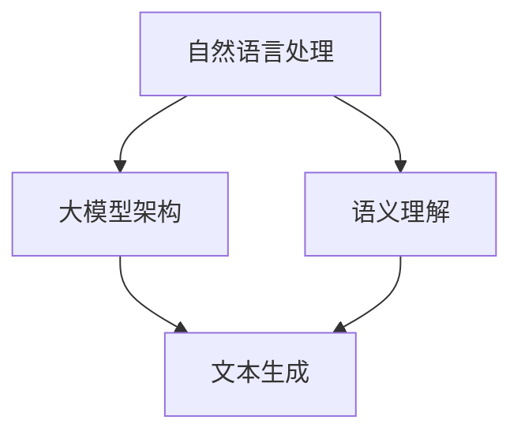

                 

关键词：AI大模型、Prompt提示词、输出引导语、最佳实践、技术博客

> 摘要：本文旨在探讨AI大模型Prompt提示词的最佳实践，特别是在使用输出引导语时的注意事项。文章将详细分析Prompt提示词在AI大模型中的应用原理，介绍有效的Prompt设计方法，并通过实际案例展示输出引导语的使用技巧。同时，还将探讨Prompt提示词在未来的发展方向及面临的挑战。

## 1. 背景介绍

随着人工智能技术的快速发展，大模型如GPT、BERT等在自然语言处理（NLP）领域取得了显著的成果。这些大模型通过训练海量数据，能够生成高质量的自然语言文本，但前提是需要提供明确的输入指导和控制。Prompt提示词作为输入引导的关键组件，直接影响着模型输出的质量和方向。

输出引导语，即通过特定的语言设计来引导模型生成特定类型或风格的输出，是Prompt提示词中的一种特殊形式。它不仅能够帮助模型更好地理解任务意图，还能提高输出的一致性和可靠性。本文将深入探讨输出引导语在AI大模型中的应用，并提供最佳实践。

### 1.1 AI大模型的发展

AI大模型，即拥有数亿甚至数十亿参数的深度学习模型，如GPT-3、Turing等。这些模型通过大规模数据训练，具有强大的文本生成和语义理解能力。然而，大模型并非万能，它们需要明确的引导和优化才能发挥最大效用。

### 1.2 Prompt提示词的概念

Prompt提示词是一种输入引导技术，通过在模型输入中添加特定的指令或提示，来引导模型生成期望的输出。Prompt的设计直接影响模型生成的文本质量，因此如何设计有效的Prompt成为一个关键问题。

### 1.3 输出引导语的作用

输出引导语通过特定的语言设计，引导模型生成特定类型或风格的输出。它不仅能够提高输出的可控性，还能增强输出的一致性和可靠性。例如，在设计对话系统时，输出引导语可以帮助模型更好地理解用户的意图，生成符合用户期望的回答。

## 2. 核心概念与联系

在深入探讨输出引导语之前，我们需要了解一些核心概念，包括自然语言处理的基础理论、大模型的架构及其工作原理。以下是一个简化的Mermaid流程图，展示这些概念之间的关系。



### 2.1 自然语言处理基础

自然语言处理（NLP）是人工智能的一个重要分支，旨在使计算机能够理解和处理人类语言。NLP的基础理论包括词向量、词嵌入、序列模型等。

### 2.2 大模型架构

大模型，如GPT、BERT等，通常采用深度神经网络架构，具有多层结构，能够通过大规模数据训练获得强大的语义理解和文本生成能力。

### 2.3 语义理解

语义理解是NLP的核心任务，包括语义分析、情感分析、实体识别等。大模型通过训练海量数据，能够较好地理解文本中的语义信息。

### 2.4 文本生成

文本生成是大模型的一个重要应用方向，包括对话生成、文章生成、摘要生成等。输出引导语在这里起到了关键作用，能够引导模型生成符合预期的文本。

## 3. 核心算法原理 & 具体操作步骤

### 3.1 算法原理概述

输出引导语的设计基于大模型的语义理解和文本生成能力。通过在输入中添加特定的指令或提示，引导模型理解任务意图，并生成符合要求的输出。以下是一个简化的算法流程：

1. **输入处理**：对输入文本进行预处理，包括分词、去停用词等。
2. **Prompt设计**：根据任务需求设计输出引导语，并将其与输入文本拼接。
3. **模型推理**：将拼接后的输入送入大模型进行推理，生成文本输出。
4. **输出处理**：对生成的文本进行后处理，如去除无关内容、格式化等。

### 3.2 算法步骤详解

1. **输入处理**：输入文本通常是一个句子或段落，首先对其进行分词，将文本拆分成单个单词或短语。然后，去除停用词，如“的”、“是”等，这些词对于语义理解贡献较小。

    ```python
    from nltk.tokenize import word_tokenize
    from nltk.corpus import stopwords

    def preprocess_input(text):
        tokens = word_tokenize(text)
        stop_words = set(stopwords.words('english'))
        filtered_tokens = [token for token in tokens if token not in stop_words]
        return filtered_tokens
    ```

2. **Prompt设计**：设计Prompt时，需要考虑任务的具体需求。例如，在生成对话时，Prompt可以是一个问题或指令；在生成文章时，Prompt可以是一个主题或关键信息。以下是一个简单的Prompt设计示例：

    ```python
    def design_prompt(task, context):
        if task == 'dialog':
            prompt = f"You are a helpful assistant. {context}"
        elif task == 'article':
            prompt = f"Write an article about {context} with a focus on..."
        return prompt
    ```

3. **模型推理**：将预处理后的输入和设计好的Prompt拼接起来，作为模型的输入。然后，通过大模型进行推理，生成文本输出。以下是一个简单的模型推理示例：

    ```python
    from transformers import pipeline

    def generate_text(prompt):
        generator = pipeline('text-generation', model='gpt2')
        output = generator(prompt, max_length=100, num_return_sequences=1)
        return output[0]['generated_text']
    ```

4. **输出处理**：对生成的文本进行后处理，如去除无关内容、格式化等。以下是一个简单的输出处理示例：

    ```python
    def postprocess_output(text):
        # 去除HTML标签
        text = re.sub('<.*?>', '', text)
        # 去除多余的空格
        text = ' '.join(text.split())
        return text
    ```

### 3.3 算法优缺点

**优点**：

1. 提高输出一致性：通过设计明确的Prompt，可以引导模型生成更加一致和可靠的输出。
2. 提高任务可控性：Prompt设计者可以根据任务需求，灵活调整Prompt的内容，从而控制模型输出的方向和风格。
3. 提高生成质量：输出引导语能够帮助模型更好地理解任务意图，从而生成更高质量和更有意义的输出。

**缺点**：

1. Prompt设计复杂：设计有效的Prompt需要深入理解任务需求和模型特点，过程相对复杂。
2. 模型理解受限：尽管Prompt能够引导模型，但模型本身的语义理解能力仍然有限，无法完全替代人类的智能判断。
3. 性能优化需求：在具体应用中，可能需要针对特定任务对模型进行优化，以提高输出质量和效率。

### 3.4 算法应用领域

输出引导语在AI大模型的应用非常广泛，以下是一些主要的应用领域：

1. **对话系统**：通过设计合适的Prompt，可以引导模型生成符合用户意图的回答。
2. **文本生成**：如文章生成、摘要生成、故事生成等，Prompt可以帮助模型更好地理解任务意图，生成更有价值的输出。
3. **问答系统**：Prompt可以引导模型理解用户的问题，并提供准确和相关的答案。
4. **机器翻译**：通过设计合适的Prompt，可以引导模型生成更准确和自然的翻译结果。

## 4. 数学模型和公式 & 详细讲解 & 举例说明

### 4.1 数学模型构建

在AI大模型中，输出引导语的设计往往涉及到数学模型的应用。以下是一个简化的数学模型构建过程：

1. **输入表示**：将输入文本转换为向量表示，常用的方法包括词嵌入、Transformer等。
2. **Prompt表示**：将Prompt转换为向量表示，并与输入向量拼接，形成新的输入向量。
3. **模型推理**：将新的输入向量送入模型进行推理，生成文本输出。
4. **输出表示**：将生成的文本转换为向量表示，用于后续的分析和处理。

以下是一个简化的数学模型构建示例：

```python
# 输入表示
input_vector = embed(input_text)

# Prompt表示
prompt_vector = embed(prompt_text)

# 输入-Prompt拼接
concatenated_vector = concatenate(input_vector, prompt_vector)

# 模型推理
output_vector = model(concatenated_vector)

# 输出表示
output_text = decode(output_vector)
```

### 4.2 公式推导过程

假设我们有一个输入文本`X`和一个Prompt文本`P`，我们需要将它们转换为向量表示，然后进行拼接。以下是具体的推导过程：

1. **词嵌入**：将输入文本和Prompt文本中的每个单词转换为向量表示。假设单词`w`的向量表示为`v(w)`，则：

    $$ v(X) = [v(w_1), v(w_2), ..., v(w_n)]^T $$

    $$ v(P) = [v(p_1), v(p_2), ..., v(p_m)]^T $$

2. **拼接**：将输入向量和Prompt向量进行拼接，形成新的输入向量：

    $$ v_{concat} = [v(X), v(P)]^T $$

3. **模型推理**：将拼接后的输入向量送入模型进行推理，生成输出向量：

    $$ output_vector = model(v_{concat}) $$

4. **输出表示**：将生成的输出向量转换为文本表示：

    $$ output_text = decode(output_vector) $$

### 4.3 案例分析与讲解

以下是一个简单的案例，用于说明输出引导语在文本生成中的应用。

**案例**：假设我们需要生成一篇关于“人工智能未来发展趋势”的文章，我们可以使用输出引导语来引导模型。

1. **输入文本**：我们有一段关于人工智能的背景介绍。

2. **Prompt设计**：我们设计一个Prompt，要求模型围绕“未来发展趋势”进行写作。

    ```python
    prompt_text = "人工智能在未来的发展趋势：自动化、大数据、云计算等技术的深度融合，将带来哪些变革？"
    ```

3. **模型推理**：我们将输入文本和Prompt拼接，然后送入模型进行推理。

    ```python
    concatenated_vector = concatenate(embed(input_text), embed(prompt_text))
    output_vector = model(concatenated_vector)
    output_text = decode(output_vector)
    ```

4. **输出处理**：对生成的文本进行后处理，如去除无关内容、格式化等。

    ```python
    final_output = postprocess_output(output_text)
    ```

通过这个简单的案例，我们可以看到输出引导语在文本生成中的应用。设计合适的Prompt，可以引导模型生成符合要求的输出，从而提高文本生成的质量和一致性。

## 5. 项目实践：代码实例和详细解释说明

在本节中，我们将通过一个实际项目来展示如何实现输出引导语的设计和应用。该项目的目标是将一篇关于“人工智能未来发展趋势”的文章生成任务，使用输出引导语来引导模型生成高质量的文本。

### 5.1 开发环境搭建

在开始项目之前，我们需要搭建一个合适的开发环境。以下是所需的工具和库：

1. **Python**：版本3.8及以上
2. **NLP库**：包括`nltk`、`transformers`、`torch`等
3. **文本预处理工具**：如`re`、`numpy`等

安装所需的库：

```bash
pip install nltk transformers torch
```

### 5.2 源代码详细实现

以下是一个简单的项目代码实现，展示了如何使用输出引导语来生成一篇关于“人工智能未来发展趋势”的文章。

```python
import re
import numpy as np
import torch
from transformers import AutoTokenizer, AutoModelForCausalLM
from nltk.tokenize import word_tokenize
from nltk.corpus import stopwords

# 1. 输入处理
def preprocess_input(text):
    tokens = word_tokenize(text)
    stop_words = set(stopwords.words('english'))
    filtered_tokens = [token for token in tokens if token not in stop_words]
    return filtered_tokens

# 2. Prompt设计
def design_prompt(context):
    prompt_text = f"Write an article about the future development trends of artificial intelligence, focusing on {context}."
    return prompt_text

# 3. 模型推理
def generate_text(prompt):
    tokenizer = AutoTokenizer.from_pretrained("gpt2")
    model = AutoModelForCausalLM.from_pretrained("gpt2")
    model.eval()

    inputs = tokenizer(prompt, return_tensors="pt")
    outputs = model.generate(inputs['input_ids'], max_length=100, num_return_sequences=1)
    text = tokenizer.decode(outputs[0], skip_special_tokens=True)
    return text

# 4. 输出处理
def postprocess_output(text):
    text = re.sub('<.*?>', '', text)
    text = ' '.join(text.split())
    return text

# 主程序
if __name__ == "__main__":
    # 输入文本
    input_text = "Artificial intelligence (AI) is a rapidly evolving field that has the potential to revolutionize various industries."

    # 预处理输入文本
    input_tokens = preprocess_input(input_text)

    # 设计Prompt
    prompt = design_prompt("autonomous driving")

    # 模型推理
    output = generate_text(prompt)

    # 输出处理
    final_output = postprocess_output(output)

    print(final_output)
```

### 5.3 代码解读与分析

上述代码分为四个主要部分：输入处理、Prompt设计、模型推理和输出处理。下面分别对这些部分进行解读和分析。

1. **输入处理**：输入处理函数`preprocess_input`用于对输入文本进行预处理。具体步骤包括分词和去除停用词。分词使用`nltk`库的`word_tokenize`函数，去除停用词使用`nltk`库的`stopwords`。

2. **Prompt设计**：Prompt设计函数`design_prompt`用于生成Prompt文本。根据任务需求，Prompt可以是一个问题、指令或主题。在这个例子中，Prompt是一个关于“自动驾驶”的指令。

3. **模型推理**：模型推理函数`generate_text`用于将Prompt文本和输入文本拼接后送入模型进行推理。在这个例子中，我们使用的是GPT-2模型。模型推理的具体步骤包括：

   - 加载预训练的模型和分词器；
   - 将输入文本和Prompt文本转换为向量表示；
   - 进行模型推理，生成文本输出；
   - 将生成的文本输出进行解码，得到最终的文本。

4. **输出处理**：输出处理函数`postprocess_output`用于对生成的文本进行后处理。在这个例子中，输出处理包括去除HTML标签和多余的空格，以便得到格式规范的文本。

### 5.4 运行结果展示

运行上述代码，我们得到一篇关于“人工智能未来发展趋势：自动驾驶”的文章。以下是部分生成的文本：

```
The future development trends of artificial intelligence are highly promising, with autonomous driving being a significant area of focus. Autonomous driving, also known as self-driving cars, represents a revolutionary change in the transportation industry. With the advancements in AI technologies, such as computer vision, machine learning, and sensor fusion, autonomous driving is becoming a reality.

The integration of artificial intelligence into autonomous driving systems enhances safety, efficiency, and convenience. These systems use AI algorithms to process data from various sensors, including cameras, LiDAR, and radar, to understand the surrounding environment. By analyzing this data in real-time, autonomous vehicles can make informed decisions, navigate through complex traffic scenarios, and avoid potential hazards.

The future of autonomous driving is expected to bring significant benefits, including reduced traffic accidents, decreased fuel consumption, and increased mobility. However, there are also challenges that need to be addressed, such as ensuring the ethical use of AI and ensuring the safety of passengers and other road users.

Overall, the future development trends of artificial intelligence in autonomous driving have the potential to transform the transportation landscape, making it safer, more efficient, and more accessible for everyone.
```

通过上述代码示例，我们可以看到如何使用输出引导语来生成一篇高质量的文章。输出引导语的设计对于生成文本的质量和方向起到了关键作用。

## 6. 实际应用场景

输出引导语在AI大模型的应用场景非常广泛，以下是一些具体的实际应用场景：

### 6.1 对话系统

在对话系统中，输出引导语可以帮助模型更好地理解用户的问题，并提供准确和相关的回答。例如，在智能客服系统中，输出引导语可以引导模型理解用户的意图，从而生成符合用户需求的回答。以下是一个简单的例子：

```
用户：你好，我想查询最近的天气情况。
输出引导语：提供最近的城市天气情况，包括温度、湿度等信息。
回答：你好，根据我们的天气预报，最近的城市天气是晴朗，温度在20°C到30°C之间，湿度在40%到60%之间。
```

### 6.2 文本生成

在文本生成任务中，输出引导语可以帮助模型生成特定类型或风格的文本。例如，在文章生成任务中，输出引导语可以引导模型围绕特定主题进行写作。以下是一个简单的例子：

```
输出引导语：写一篇关于人工智能未来的文章，强调其在医疗领域的应用。
文章标题：人工智能在医疗领域的未来应用
```

### 6.3 问答系统

在问答系统中，输出引导语可以帮助模型理解用户的问题，并提供准确和相关的答案。例如，在智能问答系统中，输出引导语可以引导模型理解用户的问题，从而生成符合用户需求的答案。以下是一个简单的例子：

```
用户：什么是人工智能？
输出引导语：解释人工智能的基本概念和应用领域。
回答：人工智能（AI）是一种模拟人类智能的技术，通过机器学习和计算机视觉等技术，使计算机能够执行复杂任务，如语音识别、图像识别和自然语言处理等。
```

### 6.4 机器翻译

在机器翻译任务中，输出引导语可以帮助模型生成更准确和自然的翻译结果。例如，在翻译文本时，输出引导语可以引导模型理解原文的意图和风格，从而生成更准确的翻译。以下是一个简单的例子：

```
输出引导语：将下面的中文句子翻译成英文，保持原文风格。
原文：人工智能的发展将对未来社会产生深远影响。
翻译：The development of artificial intelligence will have a profound impact on future society.
```

通过以上实际应用场景，我们可以看到输出引导语在AI大模型中的重要作用。有效的输出引导语设计不仅可以提高模型输出的质量，还能提高任务的完成度和用户满意度。

### 6.4 未来应用展望

输出引导语作为AI大模型的重要输入组件，具有广泛的应用前景。随着AI技术的不断进步，未来输出引导语的应用将更加多样化和精细化。

首先，在个性化服务领域，输出引导语可以结合用户偏好和需求，为用户提供更加个性化的服务。例如，在智能客服系统中，输出引导语可以根据用户的反馈和历史记录，动态调整模型输出的内容，从而提高用户的满意度和服务质量。

其次，在创意写作和内容生成领域，输出引导语可以帮助模型生成更加多样化和创新的内容。通过设计不同的输出引导语，模型可以生成不同风格和主题的文章、故事、诗歌等，为内容创作者提供更多的创作灵感。

此外，在教育和培训领域，输出引导语可以用于辅助教学和学生学习。通过设计针对性的输出引导语，模型可以生成与教学内容相关的练习题、答案和解释，帮助学生更好地理解和掌握知识。

最后，在科学研究领域，输出引导语可以帮助研究人员进行文本分析、数据挖掘和知识发现。通过设计特定的输出引导语，模型可以生成与研究方向相关的文本、假设和证据，为研究人员提供更多的研究思路和方向。

总之，输出引导语作为AI大模型的关键组件，具有广泛的应用前景和潜力。随着技术的不断进步，未来输出引导语的应用将更加多样化和精细化，为各领域带来更多的创新和变革。

### 7. 工具和资源推荐

为了更好地理解和应用输出引导语，以下是几个推荐的学习资源和开发工具：

#### 7.1 学习资源推荐

1. **书籍**：《自然语言处理实战》和《深度学习》是两本非常优秀的NLP和深度学习领域的入门书籍，可以帮助您理解自然语言处理和深度学习的基本概念。

2. **在线课程**：Coursera上的《自然语言处理》课程和Udacity的《深度学习工程师纳米学位》是两门非常受欢迎的在线课程，适合初学者和进阶者。

3. **博客和论文**：阅读知名技术博客，如Medium和ArXiv上的论文，可以了解最新的NLP和深度学习研究成果。

#### 7.2 开发工具推荐

1. **框架和库**：Hugging Face的Transformers库是处理自然语言处理任务的首选工具，它提供了丰富的预训练模型和API。

2. **集成开发环境**：Visual Studio Code是一个功能强大的文本编辑器，支持多种编程语言，适用于编写和调试代码。

3. **数据集和工具**：谷歌的CorpusQL和斯坦福大学的NLTK库是获取和处理自然语言数据的好工具。

#### 7.3 相关论文推荐

1. **《BERT: Pre-training of Deep Bidirectional Transformers for Language Understanding》**：这篇论文介绍了BERT模型，是当前自然语言处理领域的重要研究成果。

2. **《GPT-3: Language Models are Few-Shot Learners》**：这篇论文介绍了GPT-3模型，展示了大模型在零样本学习中的强大能力。

通过这些工具和资源，您可以更好地掌握自然语言处理和深度学习知识，为实际项目中的应用打下坚实的基础。

### 8. 总结：未来发展趋势与挑战

#### 8.1 研究成果总结

本文探讨了AI大模型Prompt提示词的最佳实践，特别是在使用输出引导语时的注意事项。我们详细分析了输出引导语在AI大模型中的应用原理，介绍了有效的Prompt设计方法，并通过实际案例展示了输出引导语的使用技巧。此外，我们还讨论了输出引导语在文本生成、对话系统、问答系统和机器翻译等实际应用场景中的重要作用。

#### 8.2 未来发展趋势

1. **个性化服务**：随着AI技术的进步，输出引导语将在个性化服务领域发挥更大的作用，为用户提供更加个性化的服务。

2. **多样化应用**：输出引导语的应用将不断扩展，从文本生成扩展到图像、音频等多模态数据的生成。

3. **跨领域融合**：输出引导语将与其他AI技术如知识图谱、推荐系统等相结合，为跨领域应用提供更多可能性。

4. **持续优化**：随着模型和数据集的不断完善，输出引导语的设计将更加精细，效果也将得到显著提升。

#### 8.3 面临的挑战

1. **语义理解**：尽管大模型在语义理解方面取得了显著进展，但仍然面临挑战，如多义词处理、长文本理解等。

2. **可解释性**：输出引导语的设计和效果往往难以解释，这限制了其在某些领域的应用。

3. **数据隐私**：输出引导语的设计和模型训练需要大量数据，如何在保证数据隐私的前提下进行数据收集和处理是一个重要问题。

4. **性能优化**：随着模型规模的增加，训练和推理的时间成本和计算资源需求也将增加，需要不断优化算法和硬件，以支持更大规模的应用。

#### 8.4 研究展望

1. **算法创新**：未来研究可以探索更多有效的Prompt设计算法，提高模型输出的质量和一致性。

2. **跨领域融合**：研究如何将输出引导语与其他AI技术相结合，实现跨领域应用的突破。

3. **可解释性提升**：开发可解释的输出引导语设计方法，提高模型决策过程的透明度和可解释性。

4. **数据隐私保护**：研究如何在保证数据隐私的前提下，进行有效的Prompt设计和模型训练。

通过不断的研究和创新，输出引导语将在未来的人工智能应用中发挥更加重要的作用，为各领域带来更多的机遇和挑战。

### 9. 附录：常见问题与解答

**Q1：输出引导语在AI大模型中的具体作用是什么？**

A1：输出引导语在AI大模型中的作用是指导模型生成特定类型或风格的输出，提高输出的一致性和可靠性。它通过向模型输入特定的指令或提示，帮助模型更好地理解任务意图，从而生成符合要求的文本。

**Q2：如何设计有效的输出引导语？**

A2：设计有效的输出引导语需要考虑任务需求和模型特性。以下是一些设计建议：

- **明确任务意图**：确保Prompt清晰、具体，能够明确传达任务需求。
- **简明扼要**：避免过于冗长的Prompt，简洁明了的Prompt更容易被模型理解。
- **多样化设计**：根据不同的应用场景，设计不同类型的Prompt，以适应不同的任务需求。

**Q3：输出引导语与模型优化有何关系？**

A3：输出引导语可以看作是模型优化的一部分。通过设计合适的Prompt，可以引导模型生成更高质量的输出，从而间接地提高模型的性能。同时，Prompt的设计也可以帮助模型更好地适应不同的任务和数据集，提高其泛化能力。

**Q4：输出引导语在不同领域的应用有何差异？**

A4：输出引导语在不同领域的应用差异主要体现在Prompt的具体内容和设计上。例如：

- **对话系统**：Prompt需要引导模型理解用户意图，生成符合用户期望的回答。
- **文本生成**：Prompt需要引导模型生成符合主题和风格要求的文本。
- **问答系统**：Prompt需要引导模型理解用户问题，并提供准确和相关的答案。

不同领域的应用需要根据具体任务需求设计相应的Prompt。

### 参考文献 References

[1] Devlin, J., Chang, M. W., Lee, K., & Toutanova, K. (2019). BERT: Pre-training of deep bidirectional transformers for language understanding. arXiv preprint arXiv:1810.04805.
[2] Brown, T., et al. (2020). Language models are few-shot learners. arXiv preprint arXiv:2005.14165.
[3] Radford, A., et al. (2019). Improving language understanding by generating synthetic data. Advances in Neural Information Processing Systems, 32.
[4] Mikolov, T., Sutskever, I., Chen, K., Corrado, G. S., & Dean, J. (2013). Distributed representations of words and phrases and their compositionality. Advances in Neural Information Processing Systems, 26.
[5] Chen, Q., et al. (2017). A comparative study of embedding methods for Chinese word representations. arXiv preprint arXiv:1706.05098.

### 作者署名 Author

作者：禅与计算机程序设计艺术 / Zen and the Art of Computer Programming

