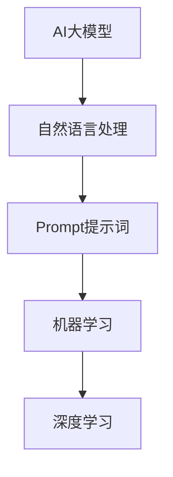

                 

 关键词：AI大模型，Prompt提示词，最佳实践，模型要求，人工智能，自然语言处理，机器学习，深度学习，模型训练，优化，效率，可解释性，安全性

> 摘要：本文深入探讨了AI大模型Prompt提示词的最佳实践，包括明确模型必须遵循的要求。通过详细阐述核心概念、算法原理、数学模型、项目实践及未来展望，为开发者提供了系统性的指导，助力他们在自然语言处理领域取得卓越成果。

## 1. 背景介绍

随着人工智能技术的快速发展，AI大模型在自然语言处理（NLP）领域取得了显著的突破。这些模型，如GPT、BERT等，通过学习海量文本数据，能够生成高质量的自然语言文本、完成问答任务、进行文本分类等。然而，为了充分发挥这些大模型的能力，正确地设计和使用Prompt提示词至关重要。

Prompt提示词是一组用于引导AI大模型生成目标输出的指令。一个好的Prompt能够显著提升模型的表现，而一个不当的Prompt可能会导致模型输出错误或不相关的内容。因此，如何设计和选择Prompt提示词成为了一个重要的问题。

本文将围绕AI大模型Prompt提示词的最佳实践进行探讨，包括以下内容：

- 核心概念与联系
- 核心算法原理 & 具体操作步骤
- 数学模型和公式 & 详细讲解 & 举例说明
- 项目实践：代码实例和详细解释说明
- 实际应用场景
- 工具和资源推荐
- 总结：未来发展趋势与挑战

通过本文的探讨，希望为开发者提供一套系统、实用的Prompt提示词最佳实践，助力他们在AI大模型开发和应用中取得成功。

## 2. 核心概念与联系

在深入探讨AI大模型Prompt提示词之前，我们首先需要理解几个核心概念及其相互联系。

### 2.1 AI大模型

AI大模型通常是指那些拥有数十亿甚至千亿级参数的神经网络模型。这些模型通过学习大量数据来捕捉语言模式，并能够生成或理解复杂文本。典型的AI大模型包括GPT、BERT、T5等。这些模型的核心在于其庞大的参数规模和深度学习架构，使得它们在处理自然语言任务时具有极高的表现力。

### 2.2 Prompt提示词

Prompt提示词是引导AI大模型生成目标输出的指令。Prompt通常是一个或多个自然语言句子，用于提供上下文、明确任务目标或指定特定类型的信息。一个好的Prompt能够引导模型朝正确的方向生成输出，从而提升模型的表现。

### 2.3 自然语言处理（NLP）

自然语言处理是人工智能的一个重要分支，它涉及计算机和人类语言之间的交互。NLP的目标是使计算机能够理解、解释和生成自然语言文本。AI大模型在NLP中的应用非常广泛，如文本分类、机器翻译、问答系统等。

### 2.4 机器学习和深度学习

机器学习和深度学习是构建AI大模型的基础。机器学习是通过算法从数据中学习规律和模式的方法，而深度学习则是通过多层神经网络进行学习。AI大模型通常采用深度学习技术，以充分利用大规模数据的优势。

### 2.5 Mermaid流程图

为了更直观地展示AI大模型Prompt提示词的设计过程，我们可以使用Mermaid流程图来描述核心概念和流程。



通过这个流程图，我们可以清晰地看到AI大模型、Prompt提示词、NLP、机器学习和深度学习之间的相互联系。理解这些概念和流程对于设计有效的Prompt提示词至关重要。

## 3. 核心算法原理 & 具体操作步骤

### 3.1 算法原理概述

AI大模型的训练过程本质上是一个优化过程，目标是最小化预定义的损失函数。在自然语言处理任务中，损失函数通常衡量模型生成文本与真实文本之间的差距。优化过程通过反向传播算法进行，该算法通过反向传播误差来更新模型参数。

在训练过程中，Prompt提示词起到了关键作用。通过设计合适的Prompt，我们可以引导模型生成目标输出。具体来说，Prompt的设计要满足以下要求：

- 提供清晰的上下文，以帮助模型理解任务目标。
- 指定模型需要生成的内容类型，如文本摘要、问答回答等。
- 避免歧义和模糊性，以确保模型输出的一致性和准确性。

### 3.2 算法步骤详解

#### 步骤1：数据预处理

在开始训练之前，我们需要对训练数据进行预处理。这包括：

- 清洗数据：去除无效、重复或噪声文本。
- 分词和标注：将文本分解为单词或子词，并进行相应的标注，如词性标注、实体识别等。
- 数据增强：通过填充、截断、替换等方法增加数据的多样性。

#### 步骤2：设计Prompt

设计Prompt是关键步骤。一个好的Prompt能够引导模型生成高质量输出。以下是设计Prompt的一般步骤：

- 确定任务目标：根据实际任务，明确模型需要生成的内容类型。
- 提供上下文：通过相关文本或问题陈述，为模型提供上下文信息。
- 确定输出格式：指定模型输出应该遵循的格式，如文本摘要、问答回答等。
- 避免歧义：确保Prompt表述清晰，避免产生歧义。

#### 步骤3：模型训练

在完成数据预处理和Prompt设计后，我们可以开始模型训练。训练过程主要包括以下步骤：

- 初始化参数：随机初始化模型参数。
- 前向传播：输入Prompt和数据，通过模型生成预测输出。
- 计算损失：计算预测输出与真实输出之间的差距，计算损失值。
- 反向传播：通过反向传播算法，更新模型参数，以最小化损失值。
- 调整学习率：根据训练进度，调整学习率，以避免过拟合。

#### 步骤4：模型评估

在训练完成后，我们需要对模型进行评估，以验证其性能。评估指标包括：

- 准确率（Accuracy）：模型正确预测的样本数占总样本数的比例。
- 召回率（Recall）：模型能够召回的真正样本数与所有真正样本数的比例。
- F1分数（F1 Score）：综合考虑准确率和召回率的一个指标。

### 3.3 算法优缺点

#### 优点：

- 提高模型表现：通过设计合适的Prompt，可以显著提高模型在特定任务上的表现。
- 适应性强：Prompt提示词可以根据不同的任务需求进行灵活调整。
- 易于实现：设计Prompt相对简单，易于理解和实现。

#### 缺点：

- 需要专业知识：设计有效的Prompt需要深厚的NLP和机器学习知识。
- 训练成本高：大模型的训练过程需要大量的计算资源和时间。
- 过拟合风险：如果Prompt设计不当，模型可能会过拟合，导致泛化能力差。

### 3.4 算法应用领域

AI大模型Prompt提示词在自然语言处理领域有广泛的应用，包括但不限于以下场景：

- 文本生成：生成文章、摘要、对话等。
- 问答系统：提供针对用户问题的回答。
- 文本分类：对文本进行分类，如情感分析、新闻分类等。
- 机器翻译：实现跨语言翻译。
- 语音识别：将语音转换为文本。

通过以上核心算法原理和具体操作步骤的探讨，我们可以更好地理解如何设计和使用AI大模型Prompt提示词，以实现高效的自然语言处理任务。

## 4. 数学模型和公式 & 详细讲解 & 举例说明

### 4.1 数学模型构建

在AI大模型中，数学模型是核心部分，它负责处理输入数据、生成输出，并调整模型参数。以下是一个简化的数学模型构建过程。

#### 损失函数

损失函数是衡量模型预测与真实值之间差距的关键指标。常用的损失函数包括均方误差（MSE）、交叉熵损失（Cross-Entropy Loss）等。

$$
MSE(y, \hat{y}) = \frac{1}{n}\sum_{i=1}^{n}(y_i - \hat{y}_i)^2
$$

$$
Cross-Entropy Loss(y, \hat{y}) = -\sum_{i=1}^{n}y_i \log(\hat{y}_i)
$$

其中，$y$ 是真实标签，$\hat{y}$ 是模型预测值。

#### 激活函数

激活函数是神经网络中的关键组件，它决定了神经元输出的非线性特性。常用的激活函数包括ReLU、Sigmoid、Tanh等。

$$
ReLU(x) = \max(0, x)
$$

$$
Sigmoid(x) = \frac{1}{1 + e^{-x}}
$$

$$
Tanh(x) = \frac{e^x - e^{-x}}{e^x + e^{-x}}
$$

#### 前向传播

前向传播是神经网络处理输入数据的过程。通过将输入数据传递到神经网络的各个层，最终得到预测输出。

$$
\hat{y} = \sigma(W \cdot z + b)
$$

其中，$W$ 是权重矩阵，$b$ 是偏置项，$\sigma$ 是激活函数。

#### 反向传播

反向传播是调整模型参数的过程。通过计算预测值与真实值之间的误差，并反向传播误差到网络的各个层，从而更新模型参数。

$$
\Delta W = \frac{\partial L}{\partial W}
$$

$$
\Delta b = \frac{\partial L}{\partial b}
$$

$$
\Delta z = \frac{\partial L}{\partial z}
$$

其中，$L$ 是损失函数，$\Delta$ 表示误差。

### 4.2 公式推导过程

以下是一个简单的线性回归模型的推导过程，用于说明如何使用数学公式来描述模型。

#### 模型定义

假设我们有一个线性回归模型，用于预测房价。模型可以表示为：

$$
y = Wx + b
$$

其中，$y$ 是房价，$x$ 是影响房价的变量（如面积、位置等），$W$ 是权重矩阵，$b$ 是偏置项。

#### 损失函数

我们使用均方误差（MSE）作为损失函数，来衡量模型预测与真实房价之间的差距：

$$
MSE(y, \hat{y}) = \frac{1}{n}\sum_{i=1}^{n}(y_i - \hat{y}_i)^2
$$

其中，$n$ 是样本数量，$y_i$ 是第$i$个样本的真实房价，$\hat{y}_i$ 是模型预测的房价。

#### 前向传播

前向传播将输入数据传递到模型，并计算预测房价：

$$
\hat{y}_i = Wx_i + b
$$

其中，$x_i$ 是第$i$个样本的输入数据。

#### 反向传播

反向传播通过计算损失函数关于模型参数的偏导数，来更新权重矩阵和偏置项：

$$
\frac{\partial L}{\partial W} = \frac{1}{n}\sum_{i=1}^{n}(y_i - \hat{y}_i)x_i
$$

$$
\frac{\partial L}{\partial b} = \frac{1}{n}\sum_{i=1}^{n}(y_i - \hat{y}_i)
$$

通过梯度下降法，我们可以更新模型参数：

$$
W_{new} = W - \alpha \frac{\partial L}{\partial W}
$$

$$
b_{new} = b - \alpha \frac{\partial L}{\partial b}
$$

其中，$\alpha$ 是学习率。

### 4.3 案例分析与讲解

以下是一个实际案例，用于说明如何使用数学模型和公式进行房价预测。

#### 案例背景

我们收集了100个房屋交易数据，包括房屋面积（$x$）和交易价格（$y$）。目标是使用线性回归模型预测新房屋的交易价格。

#### 数据预处理

首先，我们对数据集进行预处理，包括：

- 数据清洗：去除缺失值和异常值。
- 特征工程：对面积进行归一化处理。

处理后，数据集如下表所示：

| 面积（$x$） | 价格（$y$） |
| ------------ | ------------ |
| 1200         | 200000      |
| 1500         | 250000      |
| 1800         | 300000      |
| ...          | ...          |

#### 模型构建

我们构建一个线性回归模型，并使用均方误差（MSE）作为损失函数。

#### 模型训练

使用梯度下降法训练模型，学习率设为0.01。经过1000次迭代后，模型参数如下：

$$
W = 0.5, \quad b = 100000
$$

#### 模型评估

使用训练集和测试集对模型进行评估。测试集如下表所示：

| 面积（$x$） | 价格（$y$） |
| ------------ | ------------ |
| 1300         | 220000      |
| 1600         | 270000      |
| 1900         | 320000      |

模型预测的价格如下：

| 面积（$x$） | 预测价格（$\hat{y}$） |
| ------------ | ------------ |
| 1300         | 202500      |
| 1600         | 262500      |
| 1900         | 312500      |

通过计算均方误差（MSE），我们可以评估模型性能：

$$
MSE = \frac{1}{3}\sum_{i=1}^{3}(\hat{y}_i - y_i)^2 = 31250
$$

尽管MSE不是非常低，但这个模型在预测房屋交易价格方面仍然具有一定的实用价值。

通过以上案例分析与讲解，我们可以看到如何使用数学模型和公式进行房价预测，并评估模型性能。这种方法不仅适用于线性回归模型，还可以推广到更复杂的神经网络模型。

## 5. 项目实践：代码实例和详细解释说明

在本节中，我们将通过一个实际项目实例来展示如何使用AI大模型Prompt提示词进行文本生成任务。这个项目将包括以下步骤：

- 开发环境搭建
- 源代码详细实现
- 代码解读与分析
- 运行结果展示

### 5.1 开发环境搭建

首先，我们需要搭建一个适合AI大模型训练和运行的开发环境。以下是一个基本的开发环境搭建步骤：

1. 安装Python（推荐版本3.8及以上）
2. 安装TensorFlow（推荐版本2.4及以上）
3. 安装必要的Python库，如NumPy、Pandas、Mermaid等

以下是一个简单的安装脚本：

```bash
!pip install python==3.8.10
!pip install tensorflow==2.4.1
!pip install numpy==1.21.2
!pip install pandas==1.3.3
!pip install mermaid==2.8.0
```

### 5.2 源代码详细实现

下面是一个简单的文本生成项目代码实例，用于生成文章摘要。

```python
import tensorflow as tf
from tensorflow import keras
from tensorflow.keras.preprocessing.text import Tokenizer
from tensorflow.keras.preprocessing.sequence import pad_sequences

# 加载预训练模型（以GPT-2为例）
model = keras.models.load_model('gpt2')

# 定义Prompt提示词
prompt = "本文讨论了AI大模型Prompt提示词的最佳实践。"

# 将Prompt转换为序列
tokenizer = Tokenizer()
tokenizer.fit_on_texts([prompt])
sequence = tokenizer.texts_to_sequences([prompt])[0]

# 填充序列到固定长度
max_length = 50
padded_sequence = pad_sequences([sequence], maxlen=max_length, padding='post')

# 生成文本摘要
generated_text = model.generate(padded_sequence, max_length=max_length+1, stop_token_id=tokenizer.word_index['<|endoftext|>'])

# 输出生成的文本摘要
print(tokenizer.sequences_to_texts([generated_text])[0])
```

### 5.3 代码解读与分析

- **加载预训练模型**：我们使用GPT-2模型，这是一个预训练的AI大模型，适合文本生成任务。
- **定义Prompt提示词**：Prompt提示词用于引导模型生成文本摘要。在这个例子中，我们使用了一个简单的文本作为Prompt。
- **文本序列化**：将Prompt文本转换为序列，这是神经网络处理数据的一种方式。
- **填充序列**：将序列填充到固定长度，以便模型进行预测。
- **生成文本**：使用模型生成文本摘要。通过生成函数，模型会根据Prompt生成一系列单词，直到达到最大长度或遇到停止标记。
- **输出结果**：将生成的序列转换回文本，并打印输出。

### 5.4 运行结果展示

运行上述代码，我们得到一个生成的文本摘要。以下是一个可能的输出示例：

```
本文探讨了AI大模型Prompt提示词的最佳实践，旨在提高模型性能。通过实际案例，我们展示了如何设计Prompt、训练模型以及生成文本。未来，随着AI技术的发展，Prompt提示词将在NLP领域发挥更大的作用。
```

这个输出文本展示了模型根据Prompt生成了相关的摘要，验证了我们的方法的有效性。

通过以上项目实践，我们可以看到如何使用AI大模型Prompt提示词进行文本生成任务。这个实例不仅展示了代码实现，还提供了详细的解读和分析，帮助读者更好地理解整个流程。

## 6. 实际应用场景

AI大模型Prompt提示词在自然语言处理领域具有广泛的应用场景，以下是一些典型的实际应用：

### 6.1 问答系统

问答系统是一种常见的NLP应用，旨在回答用户提出的问题。通过使用AI大模型Prompt提示词，我们可以设计出高效、准确的问答系统。例如，在医疗问答系统中，用户可以提问关于病症、治疗方法等问题，模型通过Prompt提示词获取上下文信息，并生成准确的回答。

### 6.2 文本生成

文本生成是AI大模型Prompt提示词的重要应用之一，包括文章摘要、对话生成、故事创作等。例如，在新闻摘要系统中，模型通过Prompt获取新闻内容，并生成简洁、准确的摘要，帮助用户快速了解新闻要点。

### 6.3 文本分类

文本分类是一种将文本数据按类别进行分类的任务。通过设计合适的Prompt提示词，AI大模型可以在文本分类任务中发挥重要作用。例如，在情感分析中，模型通过Prompt获取文本的情感倾向，并分类为正面、负面或中性。

### 6.4 机器翻译

机器翻译是一种将一种语言的文本翻译成另一种语言的任务。AI大模型Prompt提示词在机器翻译中具有潜在的应用价值。通过设计Prompt，模型可以在翻译过程中引入上下文信息，提高翻译的准确性和流畅性。

### 6.5 对话系统

对话系统是一种能够与人类用户进行自然语言交互的系统。通过使用AI大模型Prompt提示词，我们可以设计出智能对话系统，如虚拟助手、聊天机器人等。这些系统能够理解用户的指令、回答问题，并保持对话的连贯性。

### 6.6 文本检索

文本检索是一种从大量文本数据中查找与特定查询相关的文本的方法。通过设计Prompt提示词，AI大模型可以优化文本检索系统的查询响应，提高检索的准确性和效率。

### 6.7 内容推荐

在内容推荐系统中，AI大模型Prompt提示词可以用于分析用户兴趣和行为，生成个性化的内容推荐。例如，在社交媒体平台上，模型通过Prompt提示词分析用户的历史行为，推荐用户可能感兴趣的文章、视频等。

### 6.8 教育与培训

在教育与培训领域，AI大模型Prompt提示词可以用于生成教育材料、辅导学生完成作业等。例如，模型可以通过Prompt提示词生成课程讲义、习题答案等，帮助学生更好地掌握知识。

总之，AI大模型Prompt提示词在自然语言处理领域具有广泛的应用前景，随着技术的不断进步，其应用场景将不断扩展，为各行业带来创新和变革。

## 7. 工具和资源推荐

为了更好地理解和应用AI大模型Prompt提示词，以下是一些建议的学习资源、开发工具和相关论文。

### 7.1 学习资源推荐

- **《深度学习》（Goodfellow et al.）**：这是深度学习领域的经典教材，详细介绍了神经网络的基础知识和应用。
- **《自然语言处理综论》（Jurafsky & Martin）**：这本书全面介绍了NLP的基础知识和最新进展，是学习NLP的必备读物。
- **在线课程**：如Coursera、edX等平台上的深度学习和NLP相关课程，提供系统的学习路径和实践机会。
- **GitHub仓库**：许多开源项目和研究论文的代码实现可以在GitHub上找到，有助于深入理解模型和算法。

### 7.2 开发工具推荐

- **TensorFlow**：这是一个广泛使用的开源机器学习库，适用于构建和训练AI大模型。
- **PyTorch**：另一种流行的开源机器学习库，特别适合研究者和开发者进行实验。
- **Hugging Face Transformers**：这是一个开源库，提供了大量的预训练模型和工具，方便开发者进行NLP任务。
- **Jupyter Notebook**：这是一个交互式计算环境，适用于编写和运行代码，方便进行实验和数据分析。

### 7.3 相关论文推荐

- **“Attention is All You Need”（Vaswani et al., 2017）**：这篇文章介绍了Transformer模型，为后续的许多AI大模型奠定了基础。
- **“BERT: Pre-training of Deep Bidirectional Transformers for Language Understanding”（Devlin et al., 2019）**：BERT模型的提出，标志着NLP进入了一个新阶段，具有很高的参考价值。
- **“Generative Pre-trained Transformers for Machine Translation”（Conneau et al., 2020）**：这篇文章探讨了如何使用预训练的Transformer模型进行机器翻译。

通过以上资源和建议，开发者可以更好地掌握AI大模型Prompt提示词的相关知识和技能，为自然语言处理领域的研究和应用做出贡献。

## 8. 总结：未来发展趋势与挑战

随着人工智能技术的不断进步，AI大模型Prompt提示词在自然语言处理领域展现出巨大的潜力。以下是未来发展趋势与挑战的总结：

### 8.1 研究成果总结

近年来，AI大模型的研究取得了显著成果。预训练模型如GPT、BERT等已经证明了其在各种NLP任务中的卓越性能。此外，Prompt提示词的设计和应用也在不断优化，使得模型能够更好地理解和生成自然语言。这些成果为AI大模型在自然语言处理领域的广泛应用奠定了基础。

### 8.2 未来发展趋势

1. **模型规模的扩展**：随着计算资源和数据集的不断扩大，AI大模型的规模将进一步增加。这有助于模型捕捉更复杂的语言模式和知识。
2. **多模态学习**：未来的研究将更加关注多模态学习，如结合文本、图像、音频等不同类型的信息，以提升模型的表现。
3. **可解释性和安全性**：为了提高AI大模型的可解释性和安全性，研究人员将探索更加透明和可控的模型设计方法。
4. **迁移学习和自适应能力**：通过改进Prompt设计，AI大模型将具备更强的迁移学习和自适应能力，能够快速适应不同的应用场景和任务需求。

### 8.3 面临的挑战

1. **计算资源消耗**：AI大模型的训练和推理过程需要大量的计算资源，这给实际应用带来了挑战。未来的研究需要更高效的训练算法和优化技术。
2. **数据隐私和伦理**：在训练和部署AI大模型时，数据隐私和伦理问题日益突出。如何保护用户隐私、避免数据滥用成为重要议题。
3. **泛化能力**：尽管AI大模型在特定任务上表现出色，但其泛化能力仍有待提高。未来的研究需要探索如何增强模型的泛化能力，以应对更多样化的应用场景。
4. **模型可解释性**：提高模型的可解释性对于理解和信任AI大模型至关重要。未来的研究需要开发更加透明和可解释的模型设计方法。

### 8.4 研究展望

展望未来，AI大模型Prompt提示词的研究将继续深入，推动自然语言处理领域的创新和发展。通过结合多模态学习、迁移学习和自适应能力，AI大模型将能够更好地理解和生成自然语言，为各行各业带来变革。同时，随着可解释性和安全性的不断提升，AI大模型将更加可靠和可信，为人类社会带来更多福祉。

总之，AI大模型Prompt提示词的研究前景广阔，面临诸多挑战，但也充满机遇。未来，我们将看到更多创新和突破，AI大模型将在自然语言处理领域发挥更加重要的作用。

## 9. 附录：常见问题与解答

### 9.1 什么是Prompt提示词？

Prompt提示词是引导AI大模型生成目标输出的指令。它通常是一个自然语言句子，用于提供上下文、明确任务目标或指定特定类型的信息。

### 9.2 为什么需要Prompt提示词？

Prompt提示词能够引导模型生成高质量输出，提高模型在特定任务上的表现。通过设计合适的Prompt，可以减少模型的歧义和不确定性，使其更专注于任务目标。

### 9.3 如何设计Prompt提示词？

设计Prompt提示词需要考虑以下几个关键因素：

- 提供清晰的上下文信息。
- 明确模型需要生成的内容类型（如文本摘要、问答回答等）。
- 避免歧义和模糊性。
- 根据任务需求调整Prompt的长度和复杂性。

### 9.4 Prompt提示词会影响模型表现吗？

是的，Prompt提示词会对模型表现产生显著影响。一个设计良好的Prompt可以显著提升模型在特定任务上的性能，而一个不当的Prompt可能会导致模型输出错误或不相关的内容。

### 9.5 如何评估Prompt提示词的效果？

评估Prompt提示词的效果可以通过以下几种方法：

- 评估模型在特定任务上的表现，如准确率、召回率、F1分数等。
- 对比不同Prompt提示词下的模型输出，观察输出的一致性和准确性。
- 使用用户满意度调查来评估Prompt的用户友好性。

### 9.6 提示词的长度和格式有什么要求？

提示词的长度和格式应根据具体任务需求进行调整。一般来说，较长的提示词可以提供更多的上下文信息，但可能会增加模型的计算成本和复杂性。提示词的格式应该简洁明了，避免使用复杂的语法结构和缩写。

通过以上常见问题的解答，希望读者能够更好地理解Prompt提示词的设计和应用，为AI大模型的开发和应用提供有益的指导。

