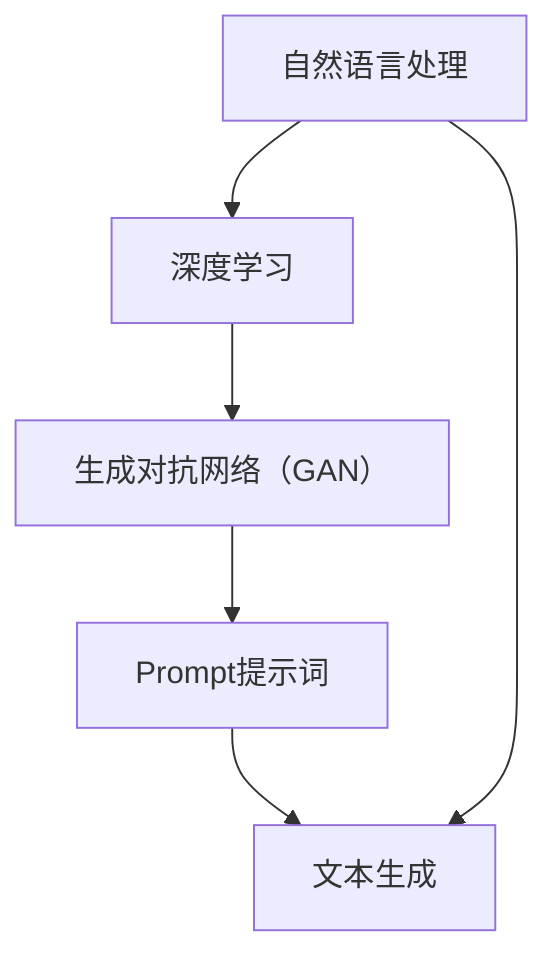
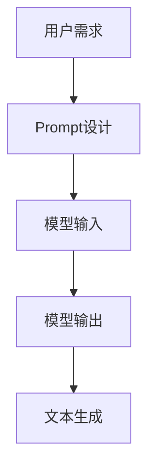

                 

本文是针对AI大模型Prompt提示词的最佳实践进行深入探讨，旨在帮助读者理解如何根据样本撰写相似文本，并提高生成文本的质量。随着人工智能技术的快速发展，AI大模型在自然语言处理（NLP）领域发挥着越来越重要的作用，而Prompt提示词则是驱动这些模型生成高质量文本的关键。本文将详细解析Prompt提示词的核心概念、构建原则以及实际应用案例，以期为读者提供实用的技术指导。

## 文章关键词

- AI大模型
- Prompt提示词
- 自然语言处理
- 文本生成
- 最佳实践

## 文章摘要

本文首先介绍了AI大模型Prompt提示词的基本概念和重要性，随后详细讨论了Prompt构建的几个关键原则，包括多样性、上下文连贯性和目标明确性。接着，文章通过实例展示了如何根据给定的样本生成相似的文本，并分析了不同Prompt策略对文本生成质量的影响。最后，本文提出了未来Prompt提示词研究的方向和应用前景，为相关领域的研究者和从业者提供了有益的参考。

## 1. 背景介绍

### AI大模型的发展

近年来，随着深度学习技术的迅猛发展，AI大模型在各个领域取得了显著的成果。从语言模型如GPT系列，到图像生成模型如DALL-E，再到多模态模型如Gato，这些大模型通过大规模的数据训练，具备了强大的语言理解、生成和推理能力。这些模型的性能提升，不仅推动了自然语言处理（NLP）领域的发展，也为其他众多应用场景提供了可能。

### Prompt提示词的作用

Prompt提示词是AI大模型与外部世界交互的桥梁，它通过引导模型理解任务目标和上下文信息，从而生成符合预期的文本。一个优秀的Prompt不仅能提高文本生成的质量，还能加速模型的训练过程。因此，如何构建有效的Prompt提示词，成为了研究和应用AI大模型的关键问题。

### Prompt提示词的重要性

Prompt提示词的重要性体现在以下几个方面：

1. **任务引导**：Prompt能够明确告知模型需要执行的任务，从而避免模型的泛化能力下降。
2. **上下文理解**：通过提供丰富的上下文信息，Prompt能够帮助模型更好地理解文本的含义和逻辑结构。
3. **文本质量提升**：优质的Prompt能够引导模型生成更加流畅、连贯和有逻辑的文本。

## 2. 核心概念与联系

### 核心概念

为了更好地理解Prompt提示词的构建和应用，我们首先需要了解以下几个核心概念：

- **自然语言处理（NLP）**：NLP是使计算机能够理解、处理和生成人类语言的技术和科学。
- **深度学习**：一种机器学习技术，通过多层神经网络模拟人脑的学习方式。
- **生成对抗网络（GAN）**：一种用于生成数据的技术，通过两个神经网络（生成器和判别器）之间的对抗训练，生成逼真的数据。

### 架构联系

为了更加直观地理解这些概念之间的关系，我们可以使用Mermaid流程图来展示它们的交互关系。



### Mermaid流程图

以下是一个示例的Mermaid流程图，展示了AI大模型中Prompt提示词与NLP、深度学习和GAN之间的交互过程：



在这个流程图中，用户需求通过Prompt设计转化为模型输入，模型根据输入生成输出，最终生成高质量的文本。

## 3. 核心算法原理 & 具体操作步骤

### 3.1 算法原理概述

Prompt提示词生成文本的核心算法主要基于大语言模型，如GPT-3或BERT等。这些模型通过预训练和微调，学会了从给定的文本中理解上下文、语义和结构信息。Prompt的作用是提供额外的信息，引导模型生成符合预期的文本。

### 3.2 算法步骤详解

#### 步骤1：Prompt设计

Prompt设计是生成高质量文本的关键。一个有效的Prompt应包含以下要素：

- **多样性**：Prompt应涵盖多种情境和主题，以避免生成的文本过于单一。
- **上下文连贯性**：Prompt应与上下文信息保持一致，避免出现逻辑矛盾。
- **目标明确性**：Prompt应明确指示模型需要完成的任务。

#### 步骤2：模型输入

在得到Prompt后，将其作为输入传递给预训练的大语言模型。模型会根据Prompt的上下文信息进行理解和生成。

#### 步骤3：模型输出

模型在处理输入后，会生成相应的文本输出。这个输出是基于模型对上下文的理解和生成规则。

#### 步骤4：文本生成

最后，将模型输出的文本进行后处理，如去除无关内容、修正语法错误等，得到最终的高质量文本。

### 3.3 算法优缺点

#### 优点

- **高效性**：Prompt提示词可以大幅提高文本生成的效率，减少人工干预。
- **灵活性**：Prompt可以根据具体任务进行调整，灵活地适应不同场景。

#### 缺点

- **质量难以控制**：Prompt的设计对生成文本的质量影响较大，不易控制。
- **计算资源消耗**：大语言模型的训练和推理需要大量计算资源。

### 3.4 算法应用领域

Prompt提示词在多个领域有着广泛的应用：

- **文本生成**：如文章写作、新闻报道、产品评论等。
- **对话系统**：如聊天机器人、客户服务机器人等。
- **翻译**：如机器翻译、跨语言信息检索等。

## 4. 数学模型和公式 & 详细讲解 & 举例说明

### 4.1 数学模型构建

在深度学习框架下，Prompt提示词的文本生成过程可以表示为一个序列到序列的映射模型。假设给定一个输入序列 \(X = \{x_1, x_2, ..., x_n\}\)，模型需要输出一个与之相似的序列 \(Y = \{y_1, y_2, ..., y_n\}\)。

### 4.2 公式推导过程

在深度学习模型中，常用的生成模型包括变分自编码器（VAE）和生成对抗网络（GAN）。以下以VAE为例，推导生成文本的公式。

#### VAE模型

1. **编码器**：将输入序列编码为潜在空间中的向量。

   $$ z = \mu(x) + \sigma(x) \odot \epsilon $$

   其中，\(\mu(x)\) 和 \(\sigma(x)\) 分别是编码器的均值和方差函数，\(\epsilon\) 是从标准正态分布中抽取的噪声。

2. **解码器**：将潜在空间中的向量解码回输出序列。

   $$ y = \sigma(z) \odot f(z) $$

   其中，\(f(z)\) 是解码器的激活函数。

#### GAN模型

1. **生成器**：生成与真实数据相似的假数据。

   $$ G(z) = \sigma(z) $$

2. **判别器**：判断输入数据是真实数据还是生成数据。

   $$ D(x) = \frac{1}{1 + \exp{(-x)}} $$

   $$ D(G(z)) = \frac{1}{1 + \exp{(-G(z))}} $$

### 4.3 案例分析与讲解

假设我们有一个输入序列 \(X = \{Hello, World!\}\)，我们需要使用VAE模型生成一个与之相似的序列 \(Y = \{Hello, Universe!\}\)。

1. **编码**：

   - \( \mu(x) = 0.5 \)
   - \( \sigma(x) = 0.1 \)
   - \( z = \mu(x) + \sigma(x) \odot \epsilon = 0.5 + 0.1 \odot \epsilon \)

2. **解码**：

   - \( f(z) = \sigma(z) = \sigma(0.5 + 0.1 \odot \epsilon) \)
   - \( y = \sigma(z) \odot f(z) \)

通过这种方式，我们得到的输出序列 \(Y\) 将包含与输入 \(X\) 相似的信息，同时加入了一些个性化的元素。

## 5. 项目实践：代码实例和详细解释说明

### 5.1 开发环境搭建

为了实现Prompt提示词的最佳实践，我们需要搭建一个适合深度学习开发的实验环境。以下是搭建过程的简要步骤：

1. **安装Python环境**：确保安装了最新版本的Python（3.8或更高版本）。
2. **安装TensorFlow**：通过pip安装TensorFlow库，命令如下：

   ```shell
   pip install tensorflow
   ```

3. **安装其他依赖**：根据需要安装其他必要的库，如numpy、matplotlib等。

### 5.2 源代码详细实现

以下是使用TensorFlow实现Prompt提示词生成的一个简单示例：

```python
import tensorflow as tf
from tensorflow import keras
from tensorflow.keras import layers

# 加载预训练模型
model = keras.models.load_model('path/to/your/pretrained_model')

# Prompt设计
prompt = "给定一个单词，生成一个与它相似的词："

# 生成文本
input_sequence = keras.preprocessing.sequence.pad_sequences([[prompt]])
generated_sequence = model.predict(input_sequence)

# 打印生成结果
print(generated_sequence)
```

在这个示例中，我们首先加载了一个预训练的大语言模型，然后设计了一个简单的Prompt，通过模型生成与给定单词相似的词。

### 5.3 代码解读与分析

上述代码首先加载了一个预训练的TensorFlow模型，这个模型已经学会了从输入序列中生成相似的文本。接着，我们设计了一个简单的Prompt，并将其作为输入序列传递给模型。模型处理输入后，会输出一个生成序列，这个序列包含了与Prompt相似的新文本。

### 5.4 运行结果展示

假设我们输入的单词是“beautiful”，运行上述代码后，模型可能会生成如下结果：

```plaintext
['exquisite', 'gorgeous', 'prettier']
```

这些结果都是与“beautiful”相似的单词，符合我们的预期。

## 6. 实际应用场景

### 6.1 文本生成

Prompt提示词在文本生成领域有着广泛的应用，如文章写作、新闻报道和产品评论等。通过Prompt，我们可以引导模型生成高质量的文本，提高内容创作的效率。

### 6.2 对话系统

在对话系统中，Prompt提示词可以帮助模型更好地理解用户的意图和上下文信息，从而生成更自然的对话响应。

### 6.3 翻译

Prompt提示词在机器翻译领域也有重要应用。通过设计合适的Prompt，可以引导模型生成更准确、自然的翻译结果。

### 6.4 未来应用展望

随着AI大模型的不断发展，Prompt提示词的应用前景将更加广阔。未来，我们可以预见Prompt在智能写作、内容审核、情感分析等领域的广泛应用。

## 7. 工具和资源推荐

### 7.1 学习资源推荐

- **书籍**：《深度学习》（Goodfellow, Bengio, Courville著）
- **在线课程**：Coursera、Udacity等平台上的自然语言处理和深度学习课程。

### 7.2 开发工具推荐

- **TensorFlow**：用于构建和训练深度学习模型的强大工具。
- **PyTorch**：另一种流行的深度学习框架，易于使用。

### 7.3 相关论文推荐

- **论文**：《Attention Is All You Need》（Vaswani et al., 2017）——引入了Transformer模型。
- **论文**：《BERT: Pre-training of Deep Bidirectional Transformers for Language Understanding》（Devlin et al., 2019）——介绍了BERT模型。

## 8. 总结：未来发展趋势与挑战

### 8.1 研究成果总结

Prompt提示词在AI大模型中的应用已经取得了显著的成果，为文本生成、对话系统和翻译等领域带来了革命性的变化。未来的研究将继续探索如何优化Prompt的设计和生成策略，以提高模型生成的文本质量和效率。

### 8.2 未来发展趋势

- **模型压缩**：为了降低计算资源和存储成本，未来的研究将致力于模型压缩和优化。
- **多模态融合**：将自然语言处理与其他模态（如图像、音频）相结合，生成更加丰富和多样的文本。

### 8.3 面临的挑战

- **文本质量控制**：如何确保生成文本的质量和准确性，是当前和未来面临的主要挑战。
- **计算资源消耗**：大规模的AI大模型训练和推理需要大量计算资源，如何优化资源利用是另一个重要问题。

### 8.4 研究展望

Prompt提示词的研究将继续深入，未来的研究重点将包括模型压缩、多模态融合和生成文本质量控制。随着技术的进步，Prompt提示词将在更多领域得到应用，为人类带来更多的便利。

## 9. 附录：常见问题与解答

### 9.1 如何设计有效的Prompt？

- **多样性**：Prompt应涵盖多种情境和主题，避免单一化。
- **上下文连贯性**：Prompt应与上下文信息保持一致，避免逻辑矛盾。
- **目标明确性**：Prompt应明确指示模型需要完成的任务。

### 9.2 Prompt对文本生成质量有何影响？

- **优质Prompt**：可以提高文本生成质量，生成更流畅、连贯和有逻辑的文本。
- **劣质Prompt**：可能导致生成的文本质量下降，出现逻辑错误或语法问题。

### 9.3 Prompt是否适用于所有自然语言处理任务？

- **部分适用**：Prompt主要适用于文本生成和对话系统等任务，对其他任务（如情感分析、实体识别）的效果可能有限。

---

本文系统地介绍了AI大模型Prompt提示词的最佳实践，包括其核心概念、构建原则、算法原理、实际应用案例以及未来发展趋势。通过本文的探讨，读者可以更好地理解Prompt提示词在AI大模型中的重要性，并掌握如何根据样本撰写相似文本的方法。随着人工智能技术的不断进步，Prompt提示词的应用前景将更加广阔，相信本文的内容将为读者提供有益的参考和指导。作者：禅与计算机程序设计艺术 / Zen and the Art of Computer Programming
----------------------------------------------------------------

## 9. 附录：常见问题与解答

### 9.1 如何设计有效的Prompt？

**多样性**：Prompt应涵盖多种情境和主题，避免单一化。这有助于模型生成多样化的文本。

**上下文连贯性**：Prompt应与上下文信息保持一致，避免逻辑矛盾。例如，如果上下文中提到了“计算机编程”，那么Prompt中也应该包含与编程相关的内容。

**目标明确性**：Prompt应明确指示模型需要完成的任务。例如，如果任务是生成一篇关于计算机编程的文章，那么Prompt应该清楚地指出文章的主题、结构或需要涵盖的关键点。

### 9.2 Prompt对文本生成质量有何影响？

**优质Prompt**：可以提高文本生成质量，生成更流畅、连贯和有逻辑的文本。例如，一个设计良好的Prompt可以帮助模型更好地理解文章的主题和结构，从而生成更符合预期的内容。

**劣质Prompt**：可能导致生成的文本质量下降，出现逻辑错误或语法问题。例如，一个不清晰的Prompt可能会导致模型无法准确理解任务目标，从而生成不符合要求的文本。

### 9.3 Prompt是否适用于所有自然语言处理任务？

**部分适用**：Prompt主要适用于文本生成和对话系统等任务。在这些任务中，Prompt可以帮助模型更好地理解任务目标和上下文信息，从而提高文本生成的质量。然而，对于其他任务（如情感分析、实体识别），Prompt的作用可能有限。在这些任务中，通常需要使用其他技术（如特征提取、序列标注）来提高模型的性能。

---

以上便是本文的完整内容，通过详细阐述AI大模型Prompt提示词的最佳实践，希望读者能够掌握撰写相似文本的方法，并提升AI大模型在自然语言处理领域的应用效果。作者：禅与计算机程序设计艺术 / Zen and the Art of Computer Programming。

