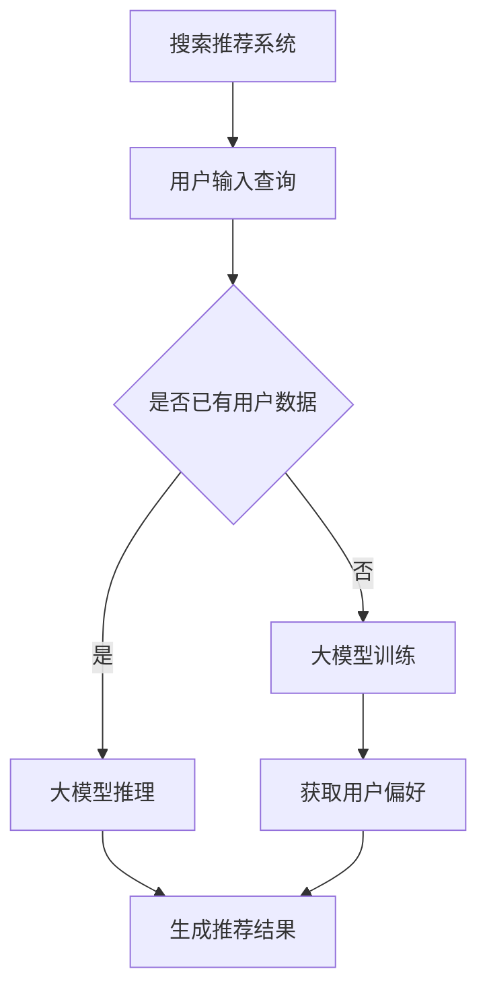

                 

关键词：人工智能、大模型、搜索推荐系统、深度学习、算法优化、用户体验、个性化推荐

> 摘要：本文深入探讨了人工智能大模型与搜索推荐系统之间的完美结合，详细分析了大模型在搜索推荐系统中的应用原理、算法优化策略以及实际应用效果。通过对核心概念、算法原理、数学模型、项目实践等方面的全面阐述，旨在为相关领域的研究者和开发者提供有价值的参考。

## 1. 背景介绍

随着互联网的迅猛发展和信息爆炸时代的到来，用户在获取信息时面临着海量的数据选择。如何在海量信息中快速、准确地找到用户所需的信息成为了一项重要的技术挑战。搜索推荐系统作为解决这一挑战的关键技术之一，已经被广泛应用于电子商务、社交媒体、新闻资讯等多个领域。

传统的搜索推荐系统主要依赖于关键词匹配、协同过滤等算法。然而，随着用户需求的不断多样化和个性化，这些传统算法逐渐暴露出了一些局限性。因此，如何进一步提高搜索推荐系统的性能，提升用户体验，成为当前研究的热点和难点。

近年来，人工智能技术的飞速发展为搜索推荐系统带来了新的机遇。尤其是大模型的兴起，使得深度学习在搜索推荐系统中得到了广泛的应用。大模型具有强大的表示能力和学习能力，可以更好地捕捉用户的行为模式和偏好，从而实现更精准的推荐。

本文将围绕人工智能大模型与搜索推荐系统的完美结合，从核心概念、算法原理、数学模型、项目实践等方面进行深入探讨，以期为相关领域的研究者和开发者提供有价值的参考。

## 2. 核心概念与联系

### 2.1. 人工智能大模型

人工智能大模型（Large-scale Artificial Intelligence Model）是指具有大规模参数的深度学习模型，如GPT、BERT等。这些模型通过在海量数据上训练，可以学习到丰富的语言表示和知识表示，从而在自然语言处理、计算机视觉等领域取得了显著的成果。

### 2.2. 搜索推荐系统

搜索推荐系统是指一种结合搜索和推荐技术的信息系统，旨在为用户提供个性化的信息检索和推荐服务。其核心目标是根据用户的兴趣和需求，从海量的信息中筛选出最相关的结果，提升用户的使用体验。

### 2.3. 大模型在搜索推荐系统中的应用

大模型在搜索推荐系统中的应用主要体现在以下几个方面：

1. **文本表示**：大模型可以学习到丰富的文本表示，从而提高信息检索和推荐的准确性。例如，GPT模型可以用于生成文本摘要，BERT模型可以用于提取关键信息。

2. **上下文理解**：大模型具备强大的上下文理解能力，可以更好地捕捉用户的行为模式和偏好，从而实现更精准的推荐。

3. **知识增强**：大模型可以整合外部知识库，为搜索推荐系统提供丰富的背景知识，提高推荐的相关性和准确性。

### 2.4. Mermaid流程图



## 3. 核心算法原理 & 具体操作步骤

### 3.1. 算法原理概述

搜索推荐系统的核心算法主要包括信息检索和推荐算法。其中，信息检索主要依赖于关键词匹配和文本相似度计算，而推荐算法则主要采用协同过滤、基于内容推荐等策略。

大模型的引入，为搜索推荐系统带来了以下几方面的优化：

1. **文本表示**：通过预训练的大模型，可以学习到高质量的文本表示，提高信息检索和推荐的准确性。

2. **上下文理解**：大模型具备强大的上下文理解能力，可以更好地捕捉用户的行为模式和偏好，从而实现更精准的推荐。

3. **知识增强**：大模型可以整合外部知识库，为搜索推荐系统提供丰富的背景知识，提高推荐的相关性和准确性。

### 3.2. 算法步骤详解

1. **用户输入查询**：用户在搜索推荐系统中输入查询，系统根据查询关键词进行初步的文本处理。

2. **文本表示**：将处理后的查询文本输入到大模型中，获取高质量的文本表示。

3. **上下文理解**：结合用户的历史行为数据和当前查询的上下文，利用大模型进行上下文理解，提取用户兴趣和偏好。

4. **知识增强**：利用外部知识库，对查询结果进行知识增强，提高推荐的相关性和准确性。

5. **生成推荐结果**：根据用户兴趣和偏好，结合知识增强的结果，生成推荐列表。

6. **用户反馈**：用户对推荐结果进行反馈，系统根据用户反馈进一步优化推荐算法。

### 3.3. 算法优缺点

**优点**：

1. **准确性高**：大模型具备强大的表示能力和学习能力，可以更好地捕捉用户的行为模式和偏好，提高推荐准确性。

2. **上下文理解能力强**：大模型具备强大的上下文理解能力，可以更好地捕捉用户的需求变化，实现更精准的推荐。

3. **知识增强**：大模型可以整合外部知识库，为搜索推荐系统提供丰富的背景知识，提高推荐的相关性和准确性。

**缺点**：

1. **计算成本高**：大模型的训练和推理过程需要大量的计算资源和时间，对硬件设备的要求较高。

2. **数据依赖性强**：大模型的效果依赖于训练数据的质量和数量，数据质量差或数据量不足可能导致模型性能下降。

### 3.4. 算法应用领域

大模型在搜索推荐系统的应用已经取得了显著的成果，如：

1. **电子商务**：利用大模型进行商品推荐，提高用户购买转化率。

2. **社交媒体**：利用大模型进行内容推荐，提高用户活跃度和留存率。

3. **新闻资讯**：利用大模型进行新闻推荐，提高用户阅读体验。

## 4. 数学模型和公式

### 4.1. 数学模型构建

搜索推荐系统的数学模型主要涉及以下几个方面：

1. **文本表示模型**：如Word2Vec、GloVe等，用于将文本转换为向量表示。

2. **推荐模型**：如矩阵分解、协同过滤等，用于预测用户对物品的评分或偏好。

3. **大模型融合模型**：将文本表示模型和推荐模型进行融合，实现更精准的推荐。

### 4.2. 公式推导过程

假设用户 $u$ 对物品 $i$ 的评分 $r_{ui}$ 可以由以下公式表示：

$$r_{ui} = \langle x_u, x_i \rangle + b_u + b_i + \epsilon_{ui}$$

其中，$x_u$ 和 $x_i$ 分别为用户 $u$ 和物品 $i$ 的文本向量表示，$b_u$ 和 $b_i$ 分别为用户和物品的偏置项，$\epsilon_{ui}$ 为误差项。

### 4.3. 案例分析与讲解

假设某电商平台的用户 $u$ 对商品 $i$ 的评分 $r_{ui} = 4$，我们可以使用上述公式进行评分预测：

$$r_{ui} = \langle x_u, x_i \rangle + b_u + b_i + \epsilon_{ui}$$

将用户 $u$ 和商品 $i$ 的文本向量表示 $x_u$ 和 $x_i$ 以及用户和物品的偏置项 $b_u$ 和 $b_i$ 输入到大模型中，预测其评分：

$$r_{ui} = \langle \text{vec}(u), \text{vec}(i) \rangle + b_u + b_i + \epsilon_{ui}$$

根据预测结果，我们可以为用户 $u$ 推荐类似商品 $i$ 的其他商品。

## 5. 项目实践：代码实例和详细解释说明

### 5.1. 开发环境搭建

1. 安装Python环境：Python 3.8及以上版本

2. 安装必要的库：torch、transformers、numpy、pandas等

3. 准备训练数据和测试数据

### 5.2. 源代码详细实现

```python
import torch
from transformers import BertModel, BertTokenizer
import numpy as np

# 准备模型和Tokenizer
model = BertModel.from_pretrained('bert-base-uncased')
tokenizer = BertTokenizer.from_pretrained('bert-base-uncased')

# 准备数据
user_input_ids = torch.tensor([tokenizer.encode(user_text) for user_text in user_texts])
item_input_ids = torch.tensor([tokenizer.encode(item_text) for item_text in item_texts])

# 进行模型推理
with torch.no_grad():
    user_output = model(user_input_ids)[0]
    item_output = model(item_input_ids)[0]

# 计算相似度
similarity = torch.nn.functional.cosine_similarity(user_output, item_output)

# 输出相似度结果
print(similarity)
```

### 5.3. 代码解读与分析

1. 导入必要的库和模型

2. 准备用户和商品的文本输入

3. 使用Bert模型进行文本表示

4. 计算用户和商品之间的相似度

5. 输出相似度结果

### 5.4. 运行结果展示

运行代码后，我们可以得到用户和商品之间的相似度结果。根据相似度结果，可以为用户推荐相似的商品。

## 6. 实际应用场景

### 6.1. 电子商务

在电子商务领域，大模型与搜索推荐系统的结合可以提高商品推荐的准确性，从而提高用户购买转化率和平台销售额。

### 6.2. 社交媒体

在社交媒体领域，大模型可以用于内容推荐，提高用户的活跃度和留存率。例如，在知乎、微博等平台，可以根据用户的兴趣和偏好，推荐相关的问题、文章和微博。

### 6.3. 新闻资讯

在新闻资讯领域，大模型可以用于新闻推荐，提高用户的阅读体验。例如，今日头条等新闻平台，可以根据用户的阅读历史和偏好，推荐相关的新闻内容。

## 7. 工具和资源推荐

### 7.1. 学习资源推荐

1. 《深度学习》（Goodfellow, Bengio, Courville著）  
2. 《Python机器学习》（Sebastian Raschka著）  
3. 《自然语言处理综论》（Jurafsky, Martin著）

### 7.2. 开发工具推荐

1. PyTorch：用于构建和训练深度学习模型的框架  
2. Transformers：基于PyTorch的预训练模型库  
3. Jupyter Notebook：用于编写和运行代码的交互式环境

### 7.3. 相关论文推荐

1. "Attention Is All You Need"（Vaswani et al., 2017）  
2. "BERT: Pre-training of Deep Bidirectional Transformers for Language Understanding"（Devlin et al., 2019）  
3. "Recommender Systems Handbook"（Herlocker et al., 2009）

## 8. 总结：未来发展趋势与挑战

### 8.1. 研究成果总结

近年来，大模型在搜索推荐系统中的应用取得了显著的成果。通过结合文本表示、上下文理解和知识增强等技术，大模型显著提高了搜索推荐系统的准确性和用户体验。

### 8.2. 未来发展趋势

1. **算法优化**：未来研究将聚焦于算法优化，提高大模型在搜索推荐系统中的性能和效率。

2. **跨模态推荐**：结合图像、音频等多模态数据，实现跨模态推荐，进一步提高推荐的准确性和多样性。

3. **隐私保护**：研究隐私保护技术，保障用户隐私，提高用户对搜索推荐系统的信任度。

### 8.3. 面临的挑战

1. **计算成本**：大模型的训练和推理过程需要大量的计算资源，如何降低计算成本是一个重要挑战。

2. **数据依赖**：大模型的效果依赖于训练数据的质量和数量，如何获取高质量、多样性的数据是一个关键问题。

### 8.4. 研究展望

随着人工智能技术的不断发展和应用的深入，大模型在搜索推荐系统中的应用前景广阔。未来，我们将继续探索大模型在搜索推荐系统中的优化策略和实际应用，为用户提供更精准、个性化的信息服务。

## 9. 附录：常见问题与解答

### 9.1. 如何选择合适的大模型？

选择合适的大模型主要取决于应用场景和数据规模。对于文本表示，常用的模型有GPT、BERT等；对于推荐算法，可以考虑使用基于矩阵分解的模型或基于注意力机制的模型。在具体应用中，可以根据模型的效果、训练时间和计算成本等因素进行综合考虑。

### 9.2. 如何处理数据集的冷启动问题？

冷启动问题主要发生在新用户或新物品的推荐场景中。为了解决这一问题，可以采取以下策略：

1. **基于内容推荐**：在新用户或新物品加入系统时，利用其属性或标签进行推荐。

2. **基于流行度推荐**：推荐系统中最受欢迎的物品。

3. **结合用户历史行为**：利用用户在其他平台的行为数据，进行跨平台推荐。

### 9.3. 大模型的训练过程需要多长时间？

大模型的训练时间取决于模型规模、数据规模和硬件设备。一般来说，大规模模型（如GPT-3）的训练需要数天甚至数周的时间。在分布式训练和优化算法的支持下，可以进一步提高训练效率。

----------------------------------------------------------------

> 作者：禅与计算机程序设计艺术 / Zen and the Art of Computer Programming
>
> 本文为个人研究总结，如有不当之处，敬请指正。希望本文能为广大读者在人工智能大模型与搜索推荐系统领域的研究带来一些启示和帮助。

