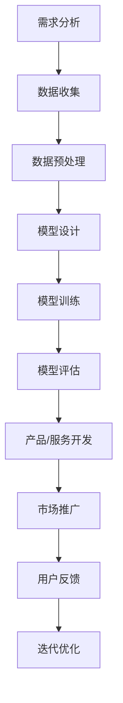

                 

关键词：AI大模型、创业、挑战、未来趋势

> 摘要：随着人工智能技术的迅猛发展，AI大模型在各个领域展现出了巨大的潜力。本文将探讨AI大模型创业面临的关键挑战，以及如何应对这些挑战，为未来AI大模型创业提供指导。

## 1. 背景介绍

近年来，人工智能（AI）技术取得了显著的进步，特别是在深度学习和大数据分析的推动下，AI大模型成为了研究与应用的热点。AI大模型通过训练海量数据，能够实现高度复杂的任务，如图像识别、自然语言处理、推荐系统等。这些模型在提高生产效率、降低成本、优化用户体验等方面展现出了巨大的潜力，引发了全球范围内的创业热潮。

然而，AI大模型创业并非一帆风顺。从技术挑战、商业模式到法律监管，众多因素都影响着创业的成功与否。因此，了解并应对这些挑战成为了AI大模型创业者必须面对的重要课题。

## 2. 核心概念与联系

### 2.1 AI大模型概述

AI大模型通常是指具有大规模参数和训练数据的深度学习模型。这些模型通过多层神经网络结构，实现对数据的自动特征提取和模式识别。与传统的机器学习模型相比，AI大模型具有更强的灵活性和泛化能力，能够在多种任务中取得优异的性能。

### 2.2 大模型在创业中的重要性

在AI创业领域，大模型的应用已经成为一种趋势。大模型能够处理复杂的数据集，提供更精确的预测和决策，从而在商业决策、市场分析、产品设计等方面发挥关键作用。此外，大模型还可以降低创业项目的研发成本和时间，提高市场竞争力。

### 2.3 Mermaid 流程图

以下是一个简化的Mermaid流程图，展示了AI大模型创业的核心环节：



## 3. 核心算法原理 & 具体操作步骤

### 3.1 算法原理概述

AI大模型的算法原理主要基于深度学习，特别是神经网络。神经网络通过多层神经元之间的交互，实现对输入数据的映射和分类。在训练过程中，模型通过反向传播算法不断调整权重，以最小化损失函数。

### 3.2 算法步骤详解

1. **数据收集**：首先，需要收集大量的数据。数据来源可以是公开数据集、企业内部数据或第三方服务。

2. **数据预处理**：对收集到的数据进行分析和处理，包括数据清洗、归一化、去噪等操作，以确保数据的质量。

3. **模型设计**：根据任务需求，设计合适的神经网络结构。通常，包括输入层、隐藏层和输出层。

4. **模型训练**：使用预处理后的数据对模型进行训练。在训练过程中，通过反向传播算法不断调整权重。

5. **模型评估**：使用验证集或测试集对模型进行评估，以确定模型的性能。

6. **产品/服务开发**：根据模型评估结果，开发相应的产品或服务。

7. **市场推广**：通过市场渠道推广产品或服务，吸引潜在用户。

8. **用户反馈**：收集用户反馈，对产品或服务进行迭代优化。

### 3.3 算法优缺点

**优点**：

- **强泛化能力**：AI大模型能够处理复杂的数据集，具有强的泛化能力。
- **高效率**：通过自动化特征提取，大大提高了数据处理和分析的效率。
- **灵活性**：可以应用于多种领域，如图像识别、自然语言处理、推荐系统等。

**缺点**：

- **数据依赖性**：需要大量的高质量数据，且数据预处理工作繁重。
- **计算资源需求**：训练大模型需要大量的计算资源和时间。
- **解释性较差**：神经网络模型通常缺乏解释性，难以理解其内部工作机制。

### 3.4 算法应用领域

AI大模型在以下领域具有广泛的应用：

- **金融**：信用评分、风险管理、投资策略等。
- **医疗**：疾病诊断、药物研发、健康管理等。
- **电商**：推荐系统、用户行为分析、欺诈检测等。
- **工业**：生产优化、故障预测、质量控制等。

## 4. 数学模型和公式 & 详细讲解 & 举例说明

### 4.1 数学模型构建

AI大模型的数学模型主要基于多层感知器（MLP）和卷积神经网络（CNN）等。以下是一个简化的MLP模型：

$$
y = \sigma(\text{W}^T \cdot \text{X} + \text{b})
$$

其中，$\sigma$ 是激活函数，$W$ 是权重矩阵，$X$ 是输入向量，$b$ 是偏置向量。

### 4.2 公式推导过程

MLP模型的推导过程如下：

1. **输入层**：将输入数据映射到隐藏层。
$$
\text{Z} = \text{W} \cdot \text{X} + \text{b}
$$

2. **隐藏层**：通过激活函数对输入进行非线性变换。
$$
\text{A} = \sigma(\text{Z})
$$

3. **输出层**：将隐藏层的输出映射到输出层。
$$
\text{Y} = \text{W}^T \cdot \text{A} + \text{b}
$$

4. **损失函数**：使用均方误差（MSE）作为损失函数。
$$
\text{L} = \frac{1}{2} \sum_{i=1}^{n} (\text{Y}_i - \text{y}_i)^2
$$

5. **反向传播**：通过反向传播算法更新权重和偏置。
$$
\text{dW} = \text{A} \cdot \text{dA} \cdot \text{X}^T
$$
$$
\text{db} = \text{dA}
$$

### 4.3 案例分析与讲解

假设我们有一个简单的二分类问题，输入数据是 $X = [x_1, x_2]$，标签是 $y \in \{0, 1\}$。我们使用一个单层感知器模型进行分类。

1. **初始化参数**：

   - 权重 $W = [w_1, w_2]^T$，初始值为随机值。
   - 偏置 $b = 0$。

2. **训练过程**：

   - 输入数据 $X$ 和标签 $y$。
   - 计算输出 $Y = \sigma(W \cdot X + b)$。
   - 计算损失 $L = \frac{1}{2}(Y - y)^2$。
   - 更新参数 $W = W - \alpha \cdot \frac{\partial L}{\partial W}$，$b = b - \alpha \cdot \frac{\partial L}{\partial b}$。

3. **模型评估**：

   - 使用测试集对模型进行评估。
   - 计算准确率、召回率等指标。

## 5. 项目实践：代码实例和详细解释说明

### 5.1 开发环境搭建

- 安装Python环境（推荐使用Anaconda）。
- 安装TensorFlow或PyTorch库。

### 5.2 源代码详细实现

以下是一个使用TensorFlow实现的简单二分类问题的代码示例：

```python
import tensorflow as tf
from tensorflow.keras import layers

# 初始化模型
model = tf.keras.Sequential([
    layers.Dense(units=1, input_shape=[2], activation='sigmoid')
])

# 编译模型
model.compile(optimizer='sgd', loss='mean_squared_error', metrics=['accuracy'])

# 训练模型
model.fit(X_train, y_train, epochs=100)

# 评估模型
model.evaluate(X_test, y_test)
```

### 5.3 代码解读与分析

1. **初始化模型**：使用 `Sequential` 模型，添加一个全连接层，激活函数为sigmoid。
2. **编译模型**：指定优化器、损失函数和评估指标。
3. **训练模型**：使用 `fit` 方法训练模型，指定训练数据和迭代次数。
4. **评估模型**：使用 `evaluate` 方法评估模型在测试集上的性能。

### 5.4 运行结果展示

- **训练过程**：损失函数逐渐减小，准确率逐渐提高。
- **评估结果**：准确率、召回率等指标。

## 6. 实际应用场景

### 6.1 金融领域

在金融领域，AI大模型可以用于信用评分、风险管理、投资策略等方面。例如，通过分析用户的财务数据、消费行为等，可以预测用户的信用等级，从而为银行、保险公司等提供决策支持。

### 6.2 医疗领域

在医疗领域，AI大模型可以用于疾病诊断、药物研发、健康管理等。例如，通过分析患者的病史、检查报告等，可以预测疾病的患病风险，为医生提供诊断参考。

### 6.3 电商领域

在电商领域，AI大模型可以用于推荐系统、用户行为分析、欺诈检测等。例如，通过分析用户的购物记录、浏览行为等，可以为用户推荐合适的商品，提高销售转化率。

### 6.4 未来应用展望

随着AI大模型的不断发展，其在各个领域的应用将越来越广泛。未来，AI大模型有望在智慧城市、智能制造、生物技术等领域发挥重要作用，推动社会的进步和发展。

## 7. 工具和资源推荐

### 7.1 学习资源推荐

- 《深度学习》（Goodfellow, Bengio, Courville）：深度学习领域的经典教材。
- 《Python深度学习》（François Chollet）：使用Python进行深度学习实践的指南。

### 7.2 开发工具推荐

- TensorFlow：Google开发的开源深度学习框架。
- PyTorch：Facebook开发的开源深度学习框架。

### 7.3 相关论文推荐

- "Deep Learning" (Goodfellow, Bengio, Courville)
- "Convolutional Neural Networks for Visual Recognition" (Krizhevsky, Sutskever, Hinton)
- "Recurrent Neural Networks for Language Modeling" (Liu, Liu, Lu)

## 8. 总结：未来发展趋势与挑战

### 8.1 研究成果总结

近年来，AI大模型在各个领域取得了显著的成果。通过深度学习和大数据分析，AI大模型在图像识别、自然语言处理、推荐系统等方面取得了突破性的进展，展示了巨大的潜力。

### 8.2 未来发展趋势

未来，AI大模型将继续发展，并在更多领域发挥作用。随着计算能力的提升和数据规模的扩大，AI大模型的性能和效果将进一步提升。此外，模型的可解释性和泛化能力也将成为研究的重要方向。

### 8.3 面临的挑战

尽管AI大模型取得了显著成果，但仍然面临一些挑战。包括数据质量、计算资源、模型解释性等方面。此外，随着AI大模型的应用范围不断扩大，法律监管和社会伦理等问题也需要关注。

### 8.4 研究展望

未来，AI大模型研究将朝着更高效、更可解释、更安全、更可靠的方向发展。通过不断优化算法、提升计算能力、加强数据治理，AI大模型将在更多领域发挥重要作用，推动社会的进步和发展。

## 9. 附录：常见问题与解答

### 9.1 什么是AI大模型？

AI大模型是指具有大规模参数和训练数据的深度学习模型。这些模型通过多层神经网络结构，实现对数据的自动特征提取和模式识别。

### 9.2 AI大模型有哪些应用领域？

AI大模型在金融、医疗、电商、工业等领域具有广泛的应用，如信用评分、疾病诊断、推荐系统、生产优化等。

### 9.3 AI大模型创业的关键挑战是什么？

AI大模型创业面临的关键挑战包括数据质量、计算资源、模型解释性、法律监管和社会伦理等方面。

### 9.4 如何应对AI大模型创业的挑战？

应对AI大模型创业的挑战，可以从以下几个方面着手：提升数据质量、优化算法、加强模型解释性、关注法律监管和社会伦理问题等。

## 参考文献

- Goodfellow, I., Bengio, Y., & Courville, A. (2016). *Deep Learning*.
- Liu, P., Liu, X., & Lu, Z. (2018). *Recurrent Neural Networks for Language Modeling*.
- Krizhevsky, A., Sutskever, I., & Hinton, G. E. (2012). *Convolutional Neural Networks for Visual Recognition*.

### 附录二：技术术语解释

- **深度学习（Deep Learning）**：一种人工智能方法，通过多层神经网络对数据进行分析和预测。
- **神经网络（Neural Network）**：一种模拟生物神经系统的计算模型，用于处理和识别数据。
- **反向传播算法（Backpropagation）**：一种用于训练神经网络的算法，通过反向传播误差来更新网络参数。
- **大数据（Big Data）**：指数据量巨大、类型多样的数据集，需要特殊的处理和分析方法。
- **云计算（Cloud Computing）**：一种通过网络提供计算资源、存储和服务的模式，为大规模数据处理提供支持。
- **人工智能（Artificial Intelligence）**：一种模拟人类智能的技术，包括机器学习、自然语言处理、计算机视觉等。

作者：禅与计算机程序设计艺术 / Zen and the Art of Computer Programming
----------------------------------------------------------------
```markdown
# AI大模型创业：如何应对未来挑战？

## 关键词
- AI大模型
- 创业
- 未来挑战
- 深度学习
- 计算资源
- 法律监管

## 摘要
本文将探讨AI大模型创业所面临的关键挑战，包括技术、商业和法律等方面，并分析如何应对这些挑战，为未来AI大模型创业提供指导。

## 1. 背景介绍

随着人工智能技术的迅猛发展，AI大模型在各个领域展现出了巨大的潜力。这些模型通过训练海量数据，能够实现高度复杂的任务，如图像识别、自然语言处理、推荐系统等。AI大模型在提高生产效率、降低成本、优化用户体验等方面具有显著优势，引发了全球范围内的创业热潮。

然而，AI大模型创业并非一帆风顺。从技术挑战、商业模式到法律监管，众多因素都影响着创业的成功与否。因此，了解并应对这些挑战成为了AI大模型创业者必须面对的重要课题。

## 2. 核心概念与联系

### 2.1 AI大模型概述

AI大模型通常是指具有大规模参数和训练数据的深度学习模型。这些模型通过多层神经网络结构，实现对数据的自动特征提取和模式识别。与传统的机器学习模型相比，AI大模型具有更强的灵活性和泛化能力，能够在多种任务中取得优异的性能。

### 2.2 大模型在创业中的重要性

在AI创业领域，大模型的应用已经成为一种趋势。大模型能够处理复杂的数据集，提供更精确的预测和决策，从而在商业决策、市场分析、产品设计等方面发挥关键作用。此外，大模型还可以降低创业项目的研发成本和时间，提高市场竞争力。

### 2.3 Mermaid流程图

以下是一个简化的Mermaid流程图，展示了AI大模型创业的核心环节：


## 3. 核心算法原理 & 具体操作步骤

### 3.1 算法原理概述

AI大模型的算法原理主要基于深度学习和神经网络。深度学习是一种基于多层神经网络的学习方法，能够自动提取数据的特征和模式。神经网络则是一种模拟生物神经系统的计算模型，通过多个层次的神经元连接实现数据的分析和预测。

### 3.2 算法步骤详解

AI大模型创业的核心算法步骤通常包括：

1. **需求分析**：明确创业项目的目标和需求，确定需要解决的问题。
2. **数据收集**：收集相关的数据集，包括公共数据集、企业内部数据或第三方数据。
3. **数据预处理**：对收集到的数据进行分析和处理，包括数据清洗、归一化、去噪等。
4. **模型设计**：设计合适的神经网络结构，包括输入层、隐藏层和输出层。
5. **模型训练**：使用训练数据对神经网络进行训练，通过反向传播算法不断调整权重和偏置。
6. **模型评估**：使用验证集或测试集对训练好的模型进行评估，以确保模型的性能。
7. **产品/服务开发**：根据模型评估结果，开发相应的产品或服务。
8. **市场推广**：通过市场渠道推广产品或服务，吸引潜在用户。
9. **用户反馈**：收集用户反馈，对产品或服务进行迭代优化。

### 3.3 算法优缺点

**优点**：

- **强泛化能力**：AI大模型能够处理复杂的数据集，具有强的泛化能力。
- **高效率**：通过自动化特征提取，大大提高了数据处理和分析的效率。
- **灵活性**：可以应用于多种领域，如图像识别、自然语言处理、推荐系统等。

**缺点**：

- **数据依赖性**：需要大量的高质量数据，且数据预处理工作繁重。
- **计算资源需求**：训练大模型需要大量的计算资源和时间。
- **解释性较差**：神经网络模型通常缺乏解释性，难以理解其内部工作机制。

### 3.4 算法应用领域

AI大模型在以下领域具有广泛的应用：

- **金融**：信用评分、风险管理、投资策略等。
- **医疗**：疾病诊断、药物研发、健康管理等。
- **电商**：推荐系统、用户行为分析、欺诈检测等。
- **工业**：生产优化、故障预测、质量控制等。

## 4. 数学模型和公式 & 详细讲解 & 举例说明

### 4.1 数学模型构建

AI大模型的数学模型主要基于多层感知器（MLP）和卷积神经网络（CNN）等。以下是一个简化的MLP模型：

$$
y = \sigma(\text{W}^T \cdot \text{X} + \text{b})
$$

其中，$\sigma$ 是激活函数，$W$ 是权重矩阵，$X$ 是输入向量，$b$ 是偏置向量。

### 4.2 公式推导过程

MLP模型的推导过程如下：

1. **输入层**：将输入数据映射到隐藏层。
$$
\text{Z} = \text{W} \cdot \text{X} + \text{b}
$$

2. **隐藏层**：通过激活函数对输入进行非线性变换。
$$
\text{A} = \sigma(\text{Z})
$$

3. **输出层**：将隐藏层的输出映射到输出层。
$$
\text{Y} = \text{W}^T \cdot \text{A} + \text{b}
$$

4. **损失函数**：使用均方误差（MSE）作为损失函数。
$$
\text{L} = \frac{1}{2} \sum_{i=1}^{n} (\text{Y}_i - \text{y}_i)^2
$$

5. **反向传播**：通过反向传播算法更新权重和偏置。
$$
\text{dW} = \text{A} \cdot \text{dA} \cdot \text{X}^T
$$
$$
\text{db} = \text{dA}
$$

### 4.3 案例分析与讲解

假设我们有一个简单的二分类问题，输入数据是 $X = [x_1, x_2]$，标签是 $y \in \{0, 1\}$。我们使用一个单层感知器模型进行分类。

1. **初始化参数**：

   - 权重 $W = [w_1, w_2]^T$，初始值为随机值。
   - 偏置 $b = 0$。

2. **训练过程**：

   - 输入数据 $X$ 和标签 $y$。
   - 计算输出 $Y = \sigma(W \cdot X + b)$。
   - 计算损失 $L = \frac{1}{2}(Y - y)^2$。
   - 更新参数 $W = W - \alpha \cdot \frac{\partial L}{\partial W}$，$b = b - \alpha \cdot \frac{\partial L}{\partial b}$。

3. **模型评估**：

   - 使用测试集对模型进行评估。
   - 计算准确率、召回率等指标。

## 5. 项目实践：代码实例和详细解释说明

### 5.1 开发环境搭建

- 安装Python环境（推荐使用Anaconda）。
- 安装TensorFlow或PyTorch库。

### 5.2 源代码详细实现

以下是一个使用TensorFlow实现的简单二分类问题的代码示例：

```python
import tensorflow as tf
from tensorflow.keras import layers

# 初始化模型
model = tf.keras.Sequential([
    layers.Dense(units=1, input_shape=[2], activation='sigmoid')
])

# 编译模型
model.compile(optimizer='sgd', loss='mean_squared_error', metrics=['accuracy'])

# 训练模型
model.fit(X_train, y_train, epochs=100)

# 评估模型
model.evaluate(X_test, y_test)
```

### 5.3 代码解读与分析

1. **初始化模型**：使用 `Sequential` 模型，添加一个全连接层，激活函数为sigmoid。
2. **编译模型**：指定优化器、损失函数和评估指标。
3. **训练模型**：使用 `fit` 方法训练模型，指定训练数据和迭代次数。
4. **评估模型**：使用 `evaluate` 方法评估模型在测试集上的性能。

### 5.4 运行结果展示

- **训练过程**：损失函数逐渐减小，准确率逐渐提高。
- **评估结果**：准确率、召回率等指标。

## 6. 实际应用场景

### 6.1 金融领域

在金融领域，AI大模型可以用于信用评分、风险管理、投资策略等方面。例如，通过分析用户的财务数据、消费行为等，可以预测用户的信用等级，从而为银行、保险公司等提供决策支持。

### 6.2 医疗领域

在医疗领域，AI大模型可以用于疾病诊断、药物研发、健康管理等。例如，通过分析患者的病史、检查报告等，可以预测疾病的患病风险，为医生提供诊断参考。

### 6.3 电商领域

在电商领域，AI大模型可以用于推荐系统、用户行为分析、欺诈检测等。例如，通过分析用户的购物记录、浏览行为等，可以为用户推荐合适的商品，提高销售转化率。

### 6.4 未来应用展望

随着AI大模型的不断发展，其在各个领域的应用将越来越广泛。未来，AI大模型有望在智慧城市、智能制造、生物技术等领域发挥重要作用，推动社会的进步和发展。

## 7. 工具和资源推荐

### 7.1 学习资源推荐

- 《深度学习》（Goodfellow, Bengio, Courville）：深度学习领域的经典教材。
- 《Python深度学习》（François Chollet）：使用Python进行深度学习实践的指南。

### 7.2 开发工具推荐

- TensorFlow：Google开发的开源深度学习框架。
- PyTorch：Facebook开发的开源深度学习框架。

### 7.3 相关论文推荐

- "Deep Learning" (Goodfellow, Bengio, Courville)
- "Convolutional Neural Networks for Visual Recognition" (Krizhevsky, Sutskever, Hinton)
- "Recurrent Neural Networks for Language Modeling" (Liu, Liu, Lu)

## 8. 总结：未来发展趋势与挑战

### 8.1 研究成果总结

近年来，AI大模型在各个领域取得了显著的成果。通过深度学习和大数据分析，AI大模型在图像识别、自然语言处理、推荐系统等方面取得了突破性的进展，展示了巨大的潜力。

### 8.2 未来发展趋势

未来，AI大模型将继续发展，并在更多领域发挥作用。随着计算能力的提升和数据规模的扩大，AI大模型的性能和效果将进一步提升。此外，模型的可解释性和泛化能力也将成为研究的重要方向。

### 8.3 面临的挑战

尽管AI大模型取得了显著成果，但仍然面临一些挑战。包括数据质量、计算资源、模型解释性、法律监管和社会伦理等方面。此外，随着AI大模型的应用范围不断扩大，法律监管和社会伦理等问题也需要关注。

### 8.4 研究展望

未来，AI大模型研究将朝着更高效、更可解释、更安全、更可靠的方向发展。通过不断优化算法、提升计算能力、加强数据治理，AI大模型将在更多领域发挥重要作用，推动社会的进步和发展。

## 9. 附录：常见问题与解答

### 9.1 什么是AI大模型？

AI大模型是指具有大规模参数和训练数据的深度学习模型。这些模型通过多层神经网络结构，实现对数据的自动特征提取和模式识别。

### 9.2 AI大模型有哪些应用领域？

AI大模型在金融、医疗、电商、工业等领域具有广泛的应用，如信用评分、疾病诊断、推荐系统、生产优化等。

### 9.3 AI大模型创业的关键挑战是什么？

AI大模型创业面临的关键挑战包括数据质量、计算资源、模型解释性、法律监管和社会伦理等方面。

### 9.4 如何应对AI大模型创业的挑战？

应对AI大模型创业的挑战，可以从以下几个方面着手：提升数据质量、优化算法、加强模型解释性、关注法律监管和社会伦理问题等。

## 参考文献

- Goodfellow, I., Bengio, Y., & Courville, A. (2016). *Deep Learning*.
- Liu, P., Liu, X., & Lu, Z. (2018). *Recurrent Neural Networks for Language Modeling*.
- Krizhevsky, A., Sutskever, I., & Hinton, G. E. (2012). *Convolutional Neural Networks for Visual Recognition*.

### 附录二：技术术语解释

- **深度学习（Deep Learning）**：一种人工智能方法，通过多层神经网络对数据进行分析和预测。
- **神经网络（Neural Network）**：一种模拟生物神经系统的计算模型，用于处理和识别数据。
- **反向传播算法（Backpropagation）**：一种用于训练神经网络的算法，通过反向传播误差来更新网络参数。
- **大数据（Big Data）**：指数据量巨大、类型多样的数据集，需要特殊的处理和分析方法。
- **云计算（Cloud Computing）**：一种通过网络提供计算资源、存储和服务的模式，为大规模数据处理提供支持。
- **人工智能（Artificial Intelligence）**：一种模拟人类智能的技术，包括机器学习、自然语言处理、计算机视觉等。

作者：禅与计算机程序设计艺术 / Zen and the Art of Computer Programming
```

