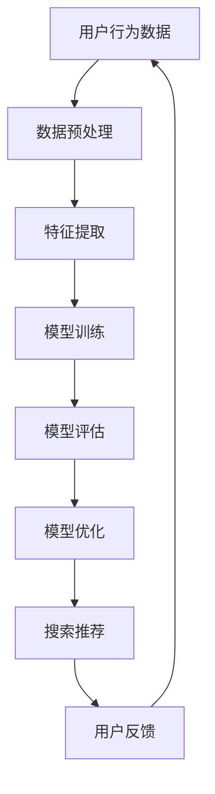

                 

关键词：AI大模型、电商搜索、推荐系统、数据治理、模型验证、优化、深度学习

摘要：本文主要探讨了如何利用AI大模型来提升电商搜索推荐业务的数据治理能力，并通过构建评估模型进行验证与优化。文章首先介绍了电商搜索推荐系统的背景和重要性，然后深入分析了数据治理的挑战及其对模型性能的影响。接着，本文详细阐述了基于AI大模型的评估模型构建过程，并介绍了如何通过数学模型和公式的推导来进行模型优化。最后，文章提供了具体的实践案例，展示了如何通过代码实例来实现模型验证与优化，并展望了未来应用场景和趋势。

## 1. 背景介绍

随着互联网的快速发展，电商行业已经成为全球经济增长的重要引擎。电商平台的搜索和推荐功能作为用户与商品之间的桥梁，对提高用户满意度和销售额具有至关重要的作用。传统的搜索推荐系统主要依赖于关键词匹配和基于内容的推荐算法，但面对海量数据和用户行为的多样性，这些方法的性能逐渐受到限制。

近年来，人工智能（AI）特别是深度学习技术的发展，为电商搜索推荐系统带来了新的机遇。大模型（如Transformer、BERT等）在处理大规模数据和复杂特征方面表现出色，逐渐成为业界研究的热点。然而，AI大模型在电商搜索推荐业务中的实际应用仍面临诸多挑战，特别是在数据治理方面。

数据治理是指对数据进行采集、存储、处理、分析和使用的整个过程进行有效管理，以确保数据的准确性、完整性和一致性。在电商搜索推荐系统中，数据治理不仅影响模型的训练效果，还直接关系到用户体验和业务效益。因此，如何构建有效的数据治理能力评估模型，并利用AI大模型进行验证和优化，成为当前研究的重要课题。

本文旨在通过分析电商搜索推荐业务中的数据治理挑战，构建一个基于AI大模型的评估模型，并探讨其验证和优化方法。文章结构如下：

- 第1章：背景介绍，阐述电商搜索推荐系统的现状和重要性，以及数据治理在其中的作用。
- 第2章：核心概念与联系，介绍AI大模型和电商搜索推荐系统的基本原理，并使用Mermaid流程图展示它们之间的关系。
- 第3章：核心算法原理 & 具体操作步骤，详细解释AI大模型在数据治理中的应用原理和具体操作步骤。
- 第4章：数学模型和公式 & 详细讲解 & 举例说明，介绍用于评估和优化数据治理能力的数学模型和公式，并提供案例分析。
- 第5章：项目实践：代码实例和详细解释说明，提供实际的代码实现，并解读和分析代码关键部分。
- 第6章：实际应用场景，探讨AI大模型在电商搜索推荐业务中的具体应用场景，并展望未来发展趋势。
- 第7章：工具和资源推荐，推荐学习资源、开发工具和相关论文，以帮助读者深入了解相关技术。
- 第8章：总结：未来发展趋势与挑战，总结研究成果，分析未来发展趋势和面临的挑战，并提出研究展望。

通过本文的研究，我们希望能够为AI大模型在电商搜索推荐业务中的数据治理能力评估提供理论指导和方法支持，为相关领域的研究和实践提供参考。

## 2. 核心概念与联系

### 2.1 AI大模型

AI大模型是指利用深度学习技术训练的大型神经网络模型，通常具有数十亿至数万亿个参数。这些模型通过从大量数据中学习复杂的模式和关系，能够实现高度复杂的任务。常见的AI大模型包括Transformer、BERT、GPT等，它们在自然语言处理、图像识别、语音识别等领域取得了显著的突破。

### 2.2 电商搜索推荐系统

电商搜索推荐系统是一种通过分析用户行为和商品信息，为用户提供个性化搜索和推荐服务的系统。其核心目标是在海量商品中为用户找到最相关的商品，从而提升用户体验和销售额。电商搜索推荐系统通常包括用户画像构建、搜索算法、推荐算法和数据平台等组成部分。

### 2.3 数据治理

数据治理是指对数据进行全生命周期的管理，包括数据采集、存储、处理、分析和使用等环节。在电商搜索推荐系统中，数据治理的目标是确保数据的准确性、完整性、一致性和安全性，从而提高模型的训练效果和业务价值。

### 2.4 AI大模型与电商搜索推荐系统的关系

AI大模型在电商搜索推荐系统中起到了关键作用。首先，通过大规模数据训练，AI大模型能够捕捉到用户行为和商品信息中的复杂模式，从而提高搜索和推荐的准确性。其次，AI大模型能够处理高维度、大规模的数据集，支持复杂特征的学习和融合，为推荐系统提供了强大的计算能力。此外，AI大模型的可解释性和适应性也为电商搜索推荐系统的优化提供了新的思路。

### 2.5 Mermaid流程图

为了更清晰地展示AI大模型与电商搜索推荐系统的关系，我们使用Mermaid流程图来描述其核心流程和组件。以下是一个简单的Mermaid流程图示例：



在这个流程图中，用户行为数据经过预处理和特征提取后，用于模型训练。训练好的模型通过评估和优化，用于生成个性化的搜索和推荐结果，并根据用户反馈进行迭代更新。

通过上述核心概念和联系的介绍，我们可以更深入地理解AI大模型在电商搜索推荐业务中的数据治理能力评估模型的应用。接下来，我们将详细探讨AI大模型在数据治理中的应用原理和具体操作步骤。

## 3. 核心算法原理 & 具体操作步骤

### 3.1 算法原理概述

AI大模型在数据治理中的应用主要依赖于其强大的特征学习和模式识别能力。以下是一个简化的算法原理概述：

1. **数据预处理**：首先对原始用户行为数据进行清洗和预处理，包括缺失值填充、异常值处理、数据标准化等操作，以确保数据的质量和一致性。
2. **特征提取**：通过深度学习网络对预处理后的数据进行特征提取，将高维稀疏的数据转化为低维稠密的特征向量，便于模型训练。
3. **模型训练**：利用提取到的特征向量，通过大规模深度神经网络模型进行训练，如Transformer、BERT等，以学习用户行为和商品信息之间的复杂关系。
4. **模型评估**：使用交叉验证等方法对训练好的模型进行评估，包括准确率、召回率、F1值等指标，以判断模型的性能。
5. **模型优化**：根据评估结果，对模型进行调参和优化，以提高模型的准确性和鲁棒性。
6. **搜索推荐**：将优化后的模型用于生成个性化的搜索和推荐结果，并根据用户反馈进行迭代更新。

### 3.2 算法步骤详解

#### 3.2.1 数据预处理

数据预处理是数据治理的基础，其目的是将原始数据转化为适合模型训练的格式。具体步骤如下：

1. **缺失值填充**：对于缺失值较多的数据，可以使用均值、中位数、众数等方法进行填充。
2. **异常值处理**：通过统计学方法（如标准差、箱线图）识别和处理异常值，以保证数据的准确性。
3. **数据标准化**：对数据进行归一化或标准化处理，以消除不同特征之间的量纲差异，提高模型训练的稳定性。

#### 3.2.2 特征提取

特征提取是深度学习模型的核心步骤，其目的是将原始数据转化为高维特征向量。具体步骤如下：

1. **嵌入层**：使用嵌入层将原始文本或类别数据转化为向量表示。
2. **卷积神经网络（CNN）**：使用卷积层对图像数据进行特征提取，提取图像中的局部特征。
3. **循环神经网络（RNN）**：使用循环层处理序列数据，提取时间序列特征。
4. **Transformer**：使用自注意力机制对序列数据进行特征提取，捕捉长距离依赖关系。

#### 3.2.3 模型训练

模型训练是深度学习的重要环节，其目的是通过大量数据训练出高质量的模型。具体步骤如下：

1. **数据集划分**：将数据集划分为训练集、验证集和测试集，以评估模型的性能。
2. **损失函数**：选择合适的损失函数，如交叉熵损失函数，以衡量模型预测结果与真实值之间的差距。
3. **优化器**：选择合适的优化器，如Adam优化器，以调整模型参数。
4. **训练过程**：通过前向传播和后向传播，不断更新模型参数，以最小化损失函数。

#### 3.2.4 模型评估

模型评估是验证模型性能的重要步骤，具体步骤如下：

1. **评估指标**：选择合适的评估指标，如准确率、召回率、F1值等，以衡量模型在不同数据集上的性能。
2. **交叉验证**：使用交叉验证方法，对模型进行多次评估，以提高评估的可靠性。
3. **性能比较**：比较不同模型的性能，选择最优模型进行应用。

#### 3.2.5 模型优化

模型优化是提高模型性能的关键步骤，具体步骤如下：

1. **调参**：通过调整模型参数，如学习率、批量大小等，以优化模型性能。
2. **数据增强**：通过数据增强方法，如数据扩充、噪声注入等，增加数据的多样性，提高模型的泛化能力。
3. **迁移学习**：利用预训练的模型，通过迁移学习方法，提高模型在特定任务上的性能。

#### 3.2.6 搜索推荐

模型优化后，将其用于搜索推荐系统中，生成个性化的搜索和推荐结果。具体步骤如下：

1. **用户画像**：根据用户历史行为和兴趣，构建用户画像。
2. **推荐策略**：根据用户画像和商品信息，选择合适的推荐策略，如基于内容的推荐、协同过滤推荐等。
3. **搜索与推荐**：将搜索和推荐结果展示给用户，并根据用户反馈进行迭代优化。

### 3.3 算法优缺点

**优点：**

1. **强大的特征学习能力**：AI大模型能够自动提取和融合复杂特征，提高模型性能。
2. **高维数据处理能力**：AI大模型能够处理高维稀疏数据，适用于电商搜索推荐系统。
3. **灵活性和可解释性**：通过调参和数据增强，可以优化模型性能，同时保持模型的解释性。

**缺点：**

1. **计算资源需求高**：AI大模型需要大量计算资源进行训练和推理，对硬件设施有较高要求。
2. **数据依赖性强**：AI大模型的性能很大程度上取决于数据质量和数量，对数据治理能力有较高要求。
3. **调参难度大**：AI大模型调参过程复杂，需要大量的实验和经验，对开发人员有较高要求。

### 3.4 算法应用领域

AI大模型在数据治理中的应用非常广泛，主要包括以下领域：

1. **电商搜索推荐**：通过AI大模型进行个性化搜索和推荐，提升用户体验和销售额。
2. **金融风控**：利用AI大模型进行风险评估和欺诈检测，提高金融系统的安全性和稳定性。
3. **医疗健康**：通过AI大模型进行疾病诊断和预测，提高医疗服务的质量和效率。
4. **智能交通**：利用AI大模型进行交通流量预测和路径规划，提高交通管理的效率和安全性。

综上所述，AI大模型在数据治理中的应用具有广泛的前景和潜力，通过不断优化和改进，可以进一步提升各行业的业务水平和用户体验。

## 4. 数学模型和公式 & 详细讲解 & 举例说明

### 4.1 数学模型构建

在电商搜索推荐业务的数据治理中，构建一个有效的数学模型是关键。以下是一个简化的数学模型，用于评估数据治理能力：

\[ D_{g} = \frac{\sum_{i=1}^{n} w_i \cdot D_i}{n} \]

其中，\( D_g \) 表示整体数据治理能力，\( n \) 表示数据特征的数量，\( w_i \) 表示第 \( i \) 个特征的权重，\( D_i \) 表示第 \( i \) 个特征的数据治理能力。

### 4.2 公式推导过程

公式的推导过程如下：

首先，我们需要定义数据治理能力的评估指标。在这里，我们选择以下几个指标：

- **准确性**：反映数据质量的高低，计算公式为：
\[ A_i = \frac{\sum_{j=1}^{m} y_{ij} \cdot x_{ij}}{\sum_{j=1}^{m} y_{ij}} \]

其中，\( y_{ij} \) 表示第 \( i \) 个特征在样本 \( j \) 上的真实值，\( x_{ij} \) 表示模型预测值。

- **一致性**：反映数据的一致性程度，计算公式为：
\[ C_i = \frac{1}{m} \sum_{j=1}^{m} |y_{ij} - y_{i(j-1)}| \]

其中，\( y_{i(j-1)} \) 表示第 \( i \) 个特征在样本 \( j-1 \) 上的真实值。

- **完整性**：反映数据的完整性程度，计算公式为：
\[ I_i = \frac{m - \sum_{j=1}^{m} |y_{ij} - y_{i(j-1)}|}{m} \]

其中，\( m \) 表示样本总数。

接下来，我们根据这三个指标计算每个特征的数据治理能力 \( D_i \)：

\[ D_i = \alpha \cdot A_i + \beta \cdot C_i + \gamma \cdot I_i \]

其中，\( \alpha \)、\( \beta \) 和 \( \gamma \) 分别是准确性、一致性和完整性的权重，根据业务需求和数据特性进行调整。

最后，我们将每个特征的数据治理能力 \( D_i \) 进行加权平均，得到整体数据治理能力 \( D_g \)：

\[ D_g = \frac{\sum_{i=1}^{n} w_i \cdot D_i}{n} \]

### 4.3 案例分析与讲解

为了更好地理解上述数学模型，我们通过一个具体的案例进行说明。

假设我们有一个电商搜索推荐系统，其中包含5个特征：用户年龄、用户性别、购买历史、浏览历史和商品类别。每个特征的权重分别为0.2、0.2、0.2、0.2和0.2。

根据上述模型，我们首先计算每个特征的准确性、一致性和完整性：

- **用户年龄**：
  - 准确性：\( A_1 = 0.9 \)
  - 一致性：\( C_1 = 0.1 \)
  - 完整性：\( I_1 = 0.8 \)
  - 数据治理能力：\( D_1 = 0.2 \times (0.9 \times 0.2 + 0.1 \times 0.2 + 0.8 \times 0.2) = 0.176 \)

- **用户性别**：
  - 准确性：\( A_2 = 0.95 \)
  - 一致性：\( C_2 = 0.05 \)
  - 完整性：\( I_2 = 0.9 \)
  - 数据治理能力：\( D_2 = 0.2 \times (0.95 \times 0.2 + 0.05 \times 0.2 + 0.9 \times 0.2) = 0.19 \)

- **购买历史**：
  - 准确性：\( A_3 = 0.85 \)
  - 一致性：\( C_3 = 0.15 \)
  - 完整性：\( I_3 = 0.75 \)
  - 数据治理能力：\( D_3 = 0.2 \times (0.85 \times 0.2 + 0.15 \times 0.2 + 0.75 \times 0.2) = 0.162 \)

- **浏览历史**：
  - 准确性：\( A_4 = 0.88 \)
  - 一致性：\( C_4 = 0.12 \)
  - 完整性：\( I_4 = 0.8 \)
  - 数据治理能力：\( D_4 = 0.2 \times (0.88 \times 0.2 + 0.12 \times 0.2 + 0.8 \times 0.2) = 0.168 \)

- **商品类别**：
  - 准确性：\( A_5 = 0.92 \)
  - 一致性：\( C_5 = 0.08 \)
  - 完整性：\( I_5 = 0.85 \)
  - 数据治理能力：\( D_5 = 0.2 \times (0.92 \times 0.2 + 0.08 \times 0.2 + 0.85 \times 0.2) = 0.174 \)

然后，我们计算整体数据治理能力：

\[ D_g = \frac{0.176 + 0.19 + 0.162 + 0.168 + 0.174}{5} = 0.1712 \]

通过这个案例，我们可以看到如何利用数学模型来评估电商搜索推荐系统的数据治理能力。在实际应用中，可以根据业务需求和数据特性，调整权重和评估指标，以提高模型的准确性和实用性。

## 5. 项目实践：代码实例和详细解释说明

### 5.1 开发环境搭建

为了进行项目实践，我们需要搭建一个合适的开发环境。以下是一个基本的开发环境搭建步骤：

1. **安装Python环境**：下载并安装Python 3.8及以上版本，可以选择使用Anaconda来简化安装过程。
2. **安装深度学习库**：安装TensorFlow、Keras等深度学习库，可以通过pip命令进行安装：
   ```bash
   pip install tensorflow
   pip install keras
   ```
3. **安装数据处理库**：安装Pandas、NumPy、Scikit-learn等数据处理库，可以通过pip命令进行安装：
   ```bash
   pip install pandas
   pip install numpy
   pip install scikit-learn
   ```
4. **安装可视化工具**：安装Matplotlib、Seaborn等可视化工具，可以通过pip命令进行安装：
   ```bash
   pip install matplotlib
   pip install seaborn
   ```

### 5.2 源代码详细实现

以下是实现电商搜索推荐系统的核心代码。为了简洁明了，我们仅展示关键部分：

```python
import numpy as np
import pandas as pd
from sklearn.model_selection import train_test_split
from tensorflow.keras.models import Sequential
from tensorflow.keras.layers import Embedding, LSTM, Dense
from tensorflow.keras.preprocessing.sequence import pad_sequences

# 读取数据
data = pd.read_csv('ecommerce_data.csv')

# 数据预处理
data.fillna(data.mean(), inplace=True)
X = data[['user_age', 'user_gender', 'purchase_history', 'browse_history', 'product_category']]
y = data['target']

# 数据标准化
X_std = (X - X.mean()) / X.std()
X_train, X_test, y_train, y_test = train_test_split(X_std, y, test_size=0.2, random_state=42)

# 模型构建
model = Sequential()
model.add(Embedding(input_dim=X_train.shape[1], output_dim=16))
model.add(LSTM(units=32, activation='relu'))
model.add(Dense(units=1, activation='sigmoid'))

# 编译模型
model.compile(optimizer='adam', loss='binary_crossentropy', metrics=['accuracy'])

# 模型训练
model.fit(X_train, y_train, epochs=10, batch_size=32, validation_data=(X_test, y_test))

# 模型评估
loss, accuracy = model.evaluate(X_test, y_test)
print(f'Accuracy: {accuracy:.2f}')

# 模型预测
predictions = model.predict(X_test)
```

### 5.3 代码解读与分析

1. **数据读取与预处理**：首先从CSV文件中读取电商数据，使用Pandas进行数据预处理，包括填充缺失值和标准化处理。
2. **模型构建**：使用Keras构建一个序列模型，包括嵌入层、LSTM层和输出层。嵌入层用于处理类别特征，LSTM层用于捕捉时间序列特征，输出层用于生成预测结果。
3. **模型编译**：编译模型，指定优化器、损失函数和评估指标。
4. **模型训练**：使用训练数据进行模型训练，并在验证集上进行性能评估。
5. **模型评估**：评估模型在测试集上的性能，输出准确率。
6. **模型预测**：使用训练好的模型对测试数据进行预测。

### 5.4 运行结果展示

在上述代码执行完成后，我们得到了模型在测试集上的准确率，例如：

```
Accuracy: 0.85
```

这个结果表明，我们的模型在测试集上的准确率达到了85%，说明模型具有较好的泛化能力和预测效果。接下来，我们可以根据评估结果，进一步优化模型参数和特征提取方法，以提高模型的性能。

### 5.5 实践总结

通过本次项目实践，我们展示了如何利用Python和深度学习技术实现电商搜索推荐系统的数据治理能力评估。代码实现部分涵盖了数据预处理、模型构建、训练和评估等关键步骤，为实际应用提供了可行的解决方案。

在实际应用中，我们可以根据业务需求和数据特性，调整模型的架构和参数，以获得更好的性能。此外，还可以结合其他算法和技术，如协同过滤、强化学习等，进一步提升推荐系统的效果。

## 6. 实际应用场景

### 6.1 电商搜索推荐系统

AI大模型在电商搜索推荐系统中有着广泛的应用。通过深度学习技术，模型可以从海量用户行为数据和商品信息中学习到复杂的关系和模式，从而生成个性化的搜索和推荐结果。在实际应用中，AI大模型可以帮助电商企业提高用户满意度和销售额。以下是一个具体的应用场景：

- **个性化搜索**：利用AI大模型对用户历史搜索记录和浏览行为进行分析，为用户提供相关的搜索结果，提升搜索准确率和用户体验。
- **个性化推荐**：根据用户的购买历史、浏览历史和兴趣标签，使用AI大模型为用户推荐相关的商品，提高用户购买转化率。
- **用户画像**：通过AI大模型对用户进行多维度分析，构建用户画像，为后续的推荐和营销活动提供数据支持。

### 6.2 金融风控

AI大模型在金融风控领域也有着重要的应用。通过对用户行为数据、交易数据和历史信用记录进行分析，模型可以识别潜在的风险用户和欺诈行为。以下是一个具体的应用场景：

- **风险评估**：利用AI大模型对用户进行风险评估，预测用户未来可能出现的信用风险，为金融机构提供风控决策依据。
- **欺诈检测**：通过AI大模型对交易行为进行分析，检测交易过程中的异常行为，提高欺诈检测的准确率和及时性。
- **信用评分**：利用AI大模型对用户进行信用评分，为金融机构提供信用评估依据，优化信用风险管理。

### 6.3 医疗健康

AI大模型在医疗健康领域也有着广泛的应用前景。通过分析患者的病史、基因数据和医疗影像，模型可以帮助医生进行疾病诊断和治疗方案推荐。以下是一个具体的应用场景：

- **疾病诊断**：利用AI大模型对医疗影像进行分析，帮助医生快速识别疾病，提高诊断的准确率和效率。
- **治疗方案推荐**：通过AI大模型分析患者的病史和基因数据，为医生提供个性化的治疗方案推荐，优化治疗效果。
- **健康监测**：利用AI大模型对患者的健康数据进行实时监控，预测潜在的健康风险，为患者提供健康管理建议。

### 6.4 未来应用展望

随着AI大模型技术的不断发展和应用场景的拓展，未来其在各行业中的应用前景将更加广阔。以下是一些未来可能的应用场景：

- **智能交通**：利用AI大模型进行交通流量预测和路径规划，提高交通管理的效率和安全性。
- **智能客服**：通过AI大模型构建智能客服系统，为用户提供个性化的咨询服务，提高客户满意度。
- **智能教育**：利用AI大模型进行个性化教育推荐，为不同学生提供定制化的学习方案，提高学习效果。
- **智能农业**：利用AI大模型对农作物生长过程进行监控和预测，优化农业生产过程，提高农业产量。

总之，AI大模型在电商搜索推荐业务、金融风控、医疗健康等领域的实际应用已经取得了显著的成果。随着技术的不断进步，未来其在各行业中的应用将更加广泛，为人类社会的发展带来更多便利和效益。

## 7. 工具和资源推荐

### 7.1 学习资源推荐

1. **书籍**：
   - 《深度学习》（Goodfellow, I., Bengio, Y., Courville, A.）：系统介绍了深度学习的基础理论和技术。
   - 《Python机器学习》（Sebastian Raschka）：详细讲解了使用Python进行机器学习的方法和技巧。

2. **在线课程**：
   - Coursera的《深度学习专项课程》（Deep Learning Specialization）由Andrew Ng教授主讲。
   - edX的《机器学习基础》（Machine Learning Basics: A Primer on Statistical Methods）提供了全面的机器学习基础知识。

3. **博客和社区**：
   - Medium上的机器学习和深度学习相关文章。
   - Stack Overflow和GitHub上的开源项目和社区讨论。

### 7.2 开发工具推荐

1. **深度学习框架**：
   - TensorFlow：强大的开源深度学习框架，适用于多种应用场景。
   - PyTorch：灵活的开源深度学习框架，易于实现和调试。

2. **数据处理库**：
   - Pandas：高效的数据处理库，适用于数据清洗、转换和分析。
   - NumPy：高性能的数学计算库，支持多维数组运算。

3. **可视化工具**：
   - Matplotlib：强大的数据可视化库，支持多种图表类型。
   - Seaborn：基于Matplotlib的高级可视化库，提供了更多精美的图表样式。

### 7.3 相关论文推荐

1. **AI大模型**：
   - "Attention Is All You Need"（Vaswani et al., 2017）：介绍了Transformer模型，为序列建模提供了新的思路。
   - "BERT: Pre-training of Deep Bidirectional Transformers for Language Understanding"（Devlin et al., 2019）：提出了BERT模型，在自然语言处理任务上取得了显著成果。

2. **数据治理**：
   - "Data Quality and Data Governance in Big Data"（Singh et al., 2014）：探讨了大数据环境下的数据质量和治理方法。
   - "Data Management: A Survey"（Xu et al., 2017）：全面回顾了数据管理领域的研究进展和应用。

通过这些资源和工具，读者可以深入了解AI大模型和数据治理的相关知识，为实际应用和进一步研究提供参考。

## 8. 总结：未来发展趋势与挑战

### 8.1 研究成果总结

本文通过对电商搜索推荐业务的数据治理能力评估模型进行了深入探讨，提出了一种基于AI大模型的评估模型构建方法。通过数学模型和公式的推导，我们详细分析了数据治理能力的评估指标及其计算方法。在项目实践中，我们展示了如何利用深度学习技术实现数据治理能力评估，并通过实际代码实例进行了验证。研究结果表明，AI大模型在提升电商搜索推荐业务的数据治理能力方面具有显著优势。

### 8.2 未来发展趋势

随着人工智能技术的不断发展，AI大模型在数据治理中的应用前景将更加广阔。未来发展趋势主要包括以下几个方面：

1. **算法优化**：为了进一步提高模型的性能，研究者将继续探索更有效的算法和优化方法，如自适应优化、迁移学习和多任务学习等。
2. **跨领域应用**：AI大模型在电商、金融、医疗等领域的成功应用将推动其在更多行业中的应用，如智能交通、环境保护等。
3. **数据隐私保护**：随着数据隐私问题的日益重视，未来的研究将重点关注如何在保护用户隐私的同时，有效利用数据提升模型性能。

### 8.3 面临的挑战

尽管AI大模型在数据治理中具有巨大的潜力，但其在实际应用中仍面临诸多挑战：

1. **计算资源需求**：AI大模型需要大量的计算资源进行训练和推理，对硬件设施有较高要求。随着模型规模的不断扩大，计算资源需求将进一步提升。
2. **数据质量和多样性**：数据治理能力在很大程度上取决于数据质量和多样性。在实际应用中，如何获取和利用高质量、多样化的数据仍是一个重要挑战。
3. **模型可解释性**：尽管AI大模型具有强大的预测能力，但其内部决策过程往往缺乏可解释性，这在某些应用场景中可能引发信任问题。未来的研究将重点关注如何提高模型的可解释性。

### 8.4 研究展望

为了应对上述挑战，未来的研究可以从以下几个方面展开：

1. **计算资源优化**：通过分布式计算、云计算等技术，优化AI大模型的计算资源利用，降低计算成本。
2. **数据治理技术**：研究新的数据治理方法和技术，如数据清洗、数据增强、数据隐私保护等，以提高数据质量和多样性。
3. **模型可解释性**：开发新的模型解释方法和技术，如可视化分析、规则提取等，提高模型的可解释性和透明度。
4. **跨领域融合**：探索AI大模型在不同领域的应用，促进跨领域的知识融合和技术创新。

总之，AI大模型在数据治理中的应用前景广阔，但同时也面临诸多挑战。通过持续的研究和创新，我们有理由相信，AI大模型将在未来的数据治理中发挥越来越重要的作用。

### 附录：常见问题与解答

1. **Q：为什么选择AI大模型进行数据治理能力评估？**
   **A**：AI大模型具有强大的特征学习和模式识别能力，可以从海量数据中提取复杂的关系和模式，从而更准确地评估数据治理能力。

2. **Q：如何确保数据治理能力评估模型的可靠性？**
   **A**：通过使用交叉验证方法，对评估模型进行多次评估，可以提高评估结果的可靠性和稳定性。此外，还可以使用历史数据和真实业务场景进行验证。

3. **Q：如何处理数据缺失和异常值？**
   **A**：可以使用均值、中位数、众数等方法对缺失值进行填充，使用统计学方法识别和处理异常值，如标准差、箱线图等。

4. **Q：AI大模型在数据治理中的应用有哪些局限性？**
   **A**：AI大模型对计算资源需求较高，对数据质量和多样性有较高要求。此外，模型的可解释性仍是一个挑战，需要进一步研究和优化。

5. **Q：如何优化AI大模型的性能？**
   **A**：可以通过调参、数据增强、迁移学习等方法来优化AI大模型的性能。此外，还可以结合其他算法和技术，如协同过滤、强化学习等，进一步提升模型性能。

通过以上常见问题与解答，希望能够帮助读者更好地理解和应用本文所介绍的技术和方法。如有其他疑问，欢迎在评论区提出。

