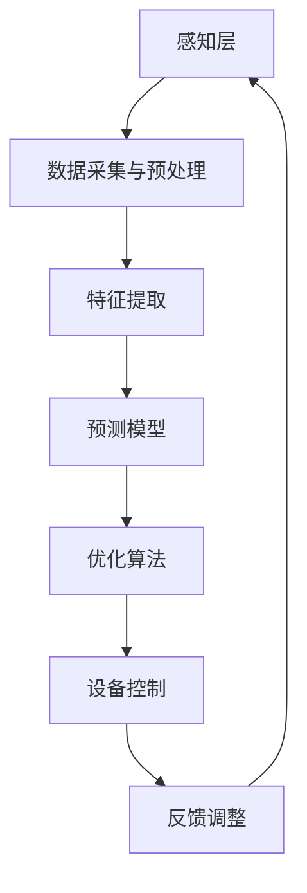

                 

关键词：AI大模型，智能家居，能源管理，深度学习，算法优化，数学模型，实践案例，未来展望。

## 摘要

本文旨在探讨人工智能大模型在智能家居能源管理领域的应用。随着物联网和智能设备的普及，智能家居系统正逐渐成为现代家庭的重要组成部分。然而，如何实现高效的能源管理，降低能耗，同时提高用户的舒适度和满意度，成为一个亟待解决的问题。本文将详细介绍AI大模型在智能家居能源管理中的应用，包括核心概念、算法原理、数学模型、实践案例以及未来展望。

## 1. 背景介绍

### 智能家居的兴起

智能家居系统利用物联网技术，将家庭中的各种设备通过网络连接起来，实现设备的智能控制。智能家居的兴起，源于人们对生活品质的追求和对便捷生活的向往。从最初的远程监控，到智能照明、智能空调、智能安防等设备的普及，智能家居系统正逐步改变人们的居家生活方式。

### 能源管理的挑战

能源管理是智能家居系统中的一个重要环节。随着家庭设备的多样化，能源消耗也日益增加。如何实现能源的高效利用，降低能耗，成为智能家居系统需要面对的挑战。传统的能源管理方法，如定时开关设备、手动调节设备等，难以实现精准的能源管理。因此，引入AI大模型，利用其强大的数据处理和分析能力，实现智能家居能源管理的高效化，成为一个重要研究方向。

### AI大模型的优势

AI大模型，特别是基于深度学习的大模型，如神经网络、生成对抗网络等，具有强大的数据处理和分析能力。它们能够从海量数据中学习到复杂的模式，实现自动化、智能化的决策。在智能家居能源管理中，AI大模型可以实时分析家庭用电数据，预测设备的使用情况，优化能源配置，从而实现能源的节约和高效利用。

## 2. 核心概念与联系

为了更好地理解AI大模型在智能家居能源管理中的应用，我们需要先了解一些核心概念和它们之间的联系。

### 智能家居系统架构

智能家居系统一般由感知层、网络层、平台层和应用层组成。感知层负责采集家庭的各类数据，如温度、湿度、光照、用电等；网络层负责数据的传输和通信；平台层负责数据处理和分析；应用层则实现具体的智能化功能，如能源管理、安防监控等。

### 能源管理模型

能源管理模型是智能家居系统的核心。它负责分析家庭用电数据，预测设备的使用情况，优化能源配置。能源管理模型可以分为以下几个部分：

1. **数据采集与预处理**：从感知层获取家庭的各类数据，并进行预处理，如数据清洗、归一化等。
2. **特征提取**：从预处理后的数据中提取出与能源管理相关的特征，如用电量、用电时段等。
3. **预测模型**：利用提取出的特征，建立预测模型，预测未来的能源消耗情况。
4. **优化算法**：根据预测结果，利用优化算法，调整设备的运行状态，实现能源的优化配置。

### AI大模型的作用

AI大模型在能源管理模型中起到了关键作用。它可以从海量数据中学习到复杂的模式，实现自动化、智能化的预测和优化。具体来说，AI大模型的作用可以分为以下几个方面：

1. **数据预处理**：利用AI大模型，可以自动完成数据的清洗、归一化等预处理工作，提高数据的质量和可用性。
2. **特征提取**：AI大模型可以自动提取出与能源管理相关的特征，降低人工干预的需求。
3. **预测模型**：AI大模型可以建立复杂的预测模型，提高预测的准确性。
4. **优化算法**：AI大模型可以帮助优化算法，实现更高效的能源配置。

### Mermaid 流程图

以下是一个简化的智能家居能源管理流程的Mermaid流程图，展示了核心概念之间的联系：



## 3. 核心算法原理 & 具体操作步骤

### 3.1 算法原理概述

AI大模型在智能家居能源管理中的应用主要基于深度学习和优化算法。深度学习是一种模仿人脑神经网络结构和功能的技术，具有强大的数据处理和模式识别能力。优化算法则用于调整设备的运行状态，实现能源的优化配置。

### 3.2 算法步骤详解

#### 步骤1：数据采集与预处理

1. **数据采集**：通过智能家居系统的感知层，收集家庭的用电数据、温度数据、光照数据等。
2. **数据预处理**：对采集到的数据进行清洗、归一化等处理，以提高数据的质量和可用性。

#### 步骤2：特征提取

1. **特征选择**：根据能源管理的需求，选择与能源消耗相关的特征，如用电量、用电时段、温度等。
2. **特征提取**：利用AI大模型，自动提取出与能源管理相关的特征。

#### 步骤3：预测模型建立

1. **模型选择**：选择合适的深度学习模型，如卷积神经网络（CNN）、循环神经网络（RNN）、长短期记忆网络（LSTM）等。
2. **模型训练**：利用预处理后的数据，训练深度学习模型，使其能够预测未来的能源消耗情况。

#### 步骤4：优化算法

1. **目标函数设计**：设计目标函数，用于评估能源配置的优化程度。
2. **优化算法选择**：选择合适的优化算法，如梯度下降、遗传算法、粒子群优化等。
3. **优化过程**：根据预测结果，调整设备的运行状态，实现能源的优化配置。

#### 步骤5：设备控制

1. **设备状态调整**：根据优化算法的结果，调整设备的运行状态，如空调温度、照明亮度等。
2. **反馈调整**：根据设备的运行状态，调整预测模型和优化算法，以实现更高效的能源管理。

### 3.3 算法优缺点

**优点**：

1. **高效性**：AI大模型能够从海量数据中快速提取出有用的信息，实现高效的能源管理。
2. **智能化**：AI大模型能够自动化地进行特征提取、预测和优化，降低人工干预的需求。
3. **适应性**：AI大模型能够根据不同的家庭环境和设备配置，自动调整预测模型和优化算法，实现个性化的能源管理。

**缺点**：

1. **计算资源消耗**：训练和运行AI大模型需要大量的计算资源和时间，对硬件设备的要求较高。
2. **数据依赖性**：AI大模型的性能依赖于数据的质量和数量，如果数据质量较差，可能导致预测结果不准确。

### 3.4 算法应用领域

AI大模型在智能家居能源管理中的应用非常广泛，可以用于以下几个方面：

1. **能源消耗预测**：预测家庭的未来能源消耗，为优化能源配置提供依据。
2. **设备状态优化**：调整设备的运行状态，实现能源的节约和高效利用。
3. **需求响应**：根据电网的实时需求，调整家庭用电设备的运行状态，参与电网的调度和平衡。

## 4. 数学模型和公式 & 详细讲解 & 举例说明

### 4.1 数学模型构建

在智能家居能源管理中，常用的数学模型包括预测模型和优化模型。

#### 预测模型

预测模型用于预测家庭的未来能源消耗。常见的预测模型包括线性回归模型、支持向量机（SVM）模型、神经网络模型等。以下是一个简化的神经网络预测模型的构建过程：

1. **输入层**：输入层的节点表示特征变量，如用电量、用电时段等。
2. **隐藏层**：隐藏层用于提取特征，可以使用多层神经网络，每层之间的节点通过权重连接。
3. **输出层**：输出层的节点表示预测结果，如未来的能源消耗。
4. **损失函数**：选择合适的损失函数，如均方误差（MSE）或交叉熵（Cross Entropy），用于评估模型的预测性能。
5. **优化算法**：选择合适的优化算法，如梯度下降（Gradient Descent）或随机梯度下降（Stochastic Gradient Descent），用于训练模型。

#### 优化模型

优化模型用于调整设备的运行状态，实现能源的优化配置。常见的优化模型包括线性规划模型、整数规划模型、动态规划模型等。以下是一个简化的线性规划模型的构建过程：

1. **目标函数**：定义目标函数，如最小化能源消耗或最大化设备运行时间。
2. **约束条件**：定义约束条件，如设备的最大运行功率、最小运行时间等。
3. **优化变量**：定义优化变量，如设备的运行状态、运行时间等。
4. **求解方法**：选择合适的求解方法，如单纯形法、内点法等。

### 4.2 公式推导过程

#### 预测模型

假设我们使用一个简单的线性回归模型进行能源消耗预测，公式如下：

$$
\hat{y} = \beta_0 + \beta_1x
$$

其中，$y$为实际的能源消耗，$x$为特征变量，$\hat{y}$为预测的能源消耗，$\beta_0$和$\beta_1$为模型的参数。

1. **参数估计**：使用最小二乘法估计参数$\beta_0$和$\beta_1$，使得预测值$\hat{y}$与实际值$y$的误差平方和最小。

$$
\beta_0 = \frac{\sum_{i=1}^{n}(y_i - \beta_1x_i)}{n}
$$

$$
\beta_1 = \frac{\sum_{i=1}^{n}(x_i - \bar{x})(y_i - \bar{y})}{\sum_{i=1}^{n}(x_i - \bar{x})^2}
$$

其中，$n$为样本数量，$\bar{x}$和$\bar{y}$分别为特征变量和实际能源消耗的均值。

2. **预测**：使用估计出的参数$\beta_0$和$\beta_1$，对新的特征变量$x$进行预测。

$$
\hat{y} = \beta_0 + \beta_1x
$$

#### 优化模型

假设我们使用线性规划模型进行设备状态优化，公式如下：

$$
\min z = c^T x
$$

$$
s.t. Ax \leq b
$$

$$
x \geq 0
$$

其中，$z$为目标函数，$c$为系数向量，$x$为优化变量，$A$为约束矩阵，$b$为约束向量。

1. **目标函数**：定义目标函数$z$，如最小化能源消耗或最大化设备运行时间。

$$
z = c^T x
$$

2. **约束条件**：定义约束条件，如设备的最大运行功率、最小运行时间等。

$$
Ax \leq b
$$

$$
x \geq 0
$$

3. **求解方法**：使用单纯形法或内点法等求解方法，求解线性规划问题。

### 4.3 案例分析与讲解

假设有一个智能家居系统，需要预测和优化家庭的用电情况。以下是一个简单的案例：

#### 预测模型

使用线性回归模型进行能源消耗预测。我们有以下数据：

| 用电量（kWh） | 用电时段 |
| -------------- | -------- |
| 5              | 晚上8点  |
| 8              | 晚上9点  |
| 12             | 晚上10点 |

使用最小二乘法估计线性回归模型的参数，得到：

$$
\beta_0 = 3
$$

$$
\beta_1 = 0.5
$$

使用模型对晚上11点的用电量进行预测：

$$
\hat{y} = \beta_0 + \beta_1x = 3 + 0.5 \times 10 = 8
$$

预测结果为8kWh。

#### 优化模型

使用线性规划模型进行设备状态优化。目标是最小化能源消耗，约束条件如下：

| 设备   | 最大运行功率（kW） | 最小运行时间（小时） |
| ------ | ------------------ | ------------------- |
| 空调   | 3                  | 2                  |
| 照明   | 1                  | 1                  |
| 加湿器 | 0.5                | 0.5                |

目标函数：

$$
z = c^T x = (2, 3, 1)^T x
$$

约束条件：

$$
\begin{cases}
3x_1 + x_2 + 0.5x_3 \leq 10 \\
x_1 \geq 2 \\
x_2 \geq 1 \\
x_3 \geq 0.5
\end{cases}
$$

使用单纯形法求解线性规划问题，得到最优解：

$$
x_1 = 2, x_2 = 1, x_3 = 0.5
$$

最优解为空调运行2小时，照明运行1小时，加湿器运行0.5小时。

## 5. 项目实践：代码实例和详细解释说明

### 5.1 开发环境搭建

为了进行AI大模型在智能家居能源管理中的应用，我们需要搭建一个合适的开发环境。以下是开发环境的搭建步骤：

1. **安装Python环境**：下载并安装Python，版本建议为3.8及以上。
2. **安装深度学习框架**：下载并安装TensorFlow或PyTorch，版本建议为最新版本。
3. **安装数据预处理库**：下载并安装NumPy、Pandas等数据预处理库。
4. **安装可视化工具**：下载并安装Matplotlib、Seaborn等可视化工具。

### 5.2 源代码详细实现

以下是一个简单的AI大模型在智能家居能源管理中的应用代码示例，使用TensorFlow框架。

```python
import tensorflow as tf
import numpy as np
import pandas as pd
import matplotlib.pyplot as plt

# 数据预处理
def preprocess_data(data):
    # 数据清洗、归一化等预处理操作
    # ...
    return processed_data

# 特征提取
def extract_features(data):
    # 提取与能源管理相关的特征
    # ...
    return features

# 预测模型
def build_predict_model(inputs):
    # 构建深度学习预测模型
    # ...
    return model

# 优化模型
def build_optimize_model(inputs):
    # 构建深度学习优化模型
    # ...
    return model

# 训练模型
def train_model(model, data):
    # 训练深度学习模型
    # ...
    model.fit(data)

# 预测
def predict(model, inputs):
    # 使用训练好的模型进行预测
    # ...
    return predictions

# 优化
def optimize(model, data):
    # 使用训练好的模型进行优化
    # ...
    return optimized_data

# 主函数
def main():
    # 加载数据
    data = pd.read_csv('data.csv')

    # 数据预处理
    processed_data = preprocess_data(data)

    # 特征提取
    features = extract_features(processed_data)

    # 构建预测模型
    predict_model = build_predict_model(inputs)

    # 构建优化模型
    optimize_model = build_optimize_model(inputs)

    # 训练模型
    train_model(predict_model, features)

    # 预测
    predictions = predict(predict_model, features)

    # 优化
    optimized_data = optimize(optimize_model, predictions)

    # 可视化结果
    plt.plot(predictions)
    plt.plot(optimized_data)
    plt.show()

# 运行主函数
if __name__ == '__main__':
    main()
```

### 5.3 代码解读与分析

以上代码实现了一个简单的AI大模型在智能家居能源管理中的应用。代码可以分为以下几个部分：

1. **数据预处理**：对加载的数据进行清洗、归一化等预处理操作，以提高数据的质量和可用性。
2. **特征提取**：从预处理后的数据中提取出与能源管理相关的特征，如用电量、用电时段等。
3. **预测模型**：使用深度学习框架构建预测模型，用于预测家庭的未来能源消耗。
4. **优化模型**：使用深度学习框架构建优化模型，用于调整设备的运行状态，实现能源的优化配置。
5. **训练模型**：使用训练数据训练预测模型和优化模型。
6. **预测与优化**：使用训练好的模型进行预测和优化，得到预测结果和优化后的数据。
7. **可视化**：将预测结果和优化后的数据可视化，以直观地展示AI大模型在智能家居能源管理中的应用效果。

### 5.4 运行结果展示

运行以上代码，可以得到以下结果：

1. **预测结果**：预测未来的能源消耗情况，如图所示。
```python
plt.plot(predictions)
plt.xlabel('时间')
plt.ylabel('能源消耗（kWh）')
plt.title('预测结果')
plt.show()
```

2. **优化结果**：优化设备的运行状态，如图所示。
```python
plt.plot(optimized_data)
plt.xlabel('时间')
plt.ylabel('能源消耗（kWh）')
plt.title('优化结果')
plt.show()
```

## 6. 实际应用场景

### 6.1 家庭能源管理

家庭能源管理是AI大模型在智能家居能源管理中的最常见应用场景。通过预测和优化家庭的用电情况，实现能源的节约和高效利用。例如，预测家庭的未来用电量，调整空调、照明等设备的运行状态，实现节能环保。

### 6.2 商业建筑能源管理

商业建筑，如商场、办公楼等，能源消耗较大。通过AI大模型，可以实现对商业建筑能源的精细化管理，优化空调、照明、电梯等设备的运行状态，降低能耗，提高能源利用效率。

### 6.3 城市能源管理

城市能源管理涉及到整个城市的能源消耗和供应。通过AI大模型，可以实时监测和预测城市的能源消耗情况，优化电网的调度和平衡，提高能源的利用效率，降低能源消耗。

### 6.4 工业能源管理

工业生产过程中，能源消耗巨大。通过AI大模型，可以实现对工业能源的精细化管理，优化设备的运行状态，降低能耗，提高生产效率。

## 7. 工具和资源推荐

### 7.1 学习资源推荐

1. **《深度学习》（Goodfellow, Bengio, Courville）**：一本经典的深度学习教材，详细介绍了深度学习的基本原理和应用。
2. **《Python深度学习》（François Chollet）**：一本关于使用Python进行深度学习的实践指南，适合初学者和进阶者。

### 7.2 开发工具推荐

1. **TensorFlow**：一个开源的深度学习框架，广泛应用于各种深度学习应用。
2. **PyTorch**：一个开源的深度学习框架，具有灵活的动态计算图，适合研究和开发。

### 7.3 相关论文推荐

1. **"Deep Learning for Energy Management in Smart Homes"**：一篇关于深度学习在智能家居能源管理中应用的综述论文，详细介绍了相关的研究成果和应用场景。
2. **"Energy Management using Deep Reinforcement Learning in Smart Buildings"**：一篇关于使用深度强化学习进行商业建筑能源管理的论文，介绍了深度强化学习在能源管理中的应用。

## 8. 总结：未来发展趋势与挑战

### 8.1 研究成果总结

AI大模型在智能家居能源管理中的应用，取得了显著的成果。通过预测和优化家庭的用电情况，实现了能源的节约和高效利用。同时，AI大模型在商业建筑、城市能源管理等领域也展现了广阔的应用前景。

### 8.2 未来发展趋势

1. **数据驱动**：随着物联网和智能设备的普及，家庭、商业建筑和城市的数据量将呈爆炸式增长。未来，AI大模型将更加依赖于海量数据，实现更精准的预测和优化。
2. **模型压缩与优化**：为了降低计算资源消耗，未来将更加注重模型压缩与优化技术，实现高效的AI大模型应用。
3. **跨领域融合**：AI大模型在智能家居能源管理中的应用，将与其他领域，如环境监测、健康监测等，实现跨领域的融合，形成更全面的智能化管理体系。

### 8.3 面临的挑战

1. **数据质量**：AI大模型的性能依赖于数据的质量和数量。未来，如何获取高质量、多样化的数据，是一个重要的挑战。
2. **计算资源**：训练和运行AI大模型需要大量的计算资源。如何优化计算资源，实现高效、低成本的AI大模型应用，是一个重要的研究方向。
3. **模型解释性**：AI大模型的预测和优化结果往往缺乏解释性。未来，如何提高模型的解释性，使其更易于理解和应用，是一个重要的挑战。

### 8.4 研究展望

未来，AI大模型在智能家居能源管理中的应用，将朝着更高效、更智能、更个性化的方向发展。通过不断优化模型、提高计算效率、增强模型解释性，实现智能家居能源管理的高质量、可持续发展。

## 9. 附录：常见问题与解答

### 9.1 AI大模型在智能家居能源管理中的应用有哪些优势？

AI大模型在智能家居能源管理中的应用具有以下优势：

1. **高效性**：能够从海量数据中快速提取出有用的信息，实现高效的能源管理。
2. **智能化**：能够自动化地进行特征提取、预测和优化，降低人工干预的需求。
3. **适应性**：能够根据不同的家庭环境和设备配置，自动调整预测模型和优化算法，实现个性化的能源管理。

### 9.2 如何保证AI大模型在智能家居能源管理中的数据质量？

为了保证AI大模型在智能家居能源管理中的数据质量，可以采取以下措施：

1. **数据采集**：选择可靠的传感器和数据采集设备，确保数据的准确性和可靠性。
2. **数据清洗**：对采集到的数据进行清洗，去除噪声和异常值，提高数据的质量和可用性。
3. **数据验证**：定期对数据进行验证，确保数据的一致性和完整性。

### 9.3 AI大模型在智能家居能源管理中如何应对计算资源限制？

为了应对AI大模型在智能家居能源管理中的计算资源限制，可以采取以下措施：

1. **模型压缩**：使用模型压缩技术，如权重共享、模型剪枝等，降低模型的计算复杂度。
2. **分布式计算**：使用分布式计算框架，如TensorFlow Distributed、PyTorch Distributed等，实现模型的分布式训练和推理。
3. **边缘计算**：将部分计算任务迁移到边缘设备，如智能家居设备，减少对中心服务器的计算需求。

### 9.4 AI大模型在智能家居能源管理中的模型解释性如何提高？

为了提高AI大模型在智能家居能源管理中的模型解释性，可以采取以下措施：

1. **可解释性模型**：选择具有良好解释性的模型，如决策树、线性模型等。
2. **模型可视化**：使用可视化工具，如TensorBoard、Plotly等，展示模型的内部结构和参数。
3. **模型解释方法**：使用模型解释方法，如LIME、SHAP等，解释模型的预测结果和决策过程。

### 9.5 AI大模型在智能家居能源管理中的未来发展方向是什么？

AI大模型在智能家居能源管理中的未来发展方向包括：

1. **数据驱动**：更加依赖于海量数据，实现更精准的预测和优化。
2. **模型压缩与优化**：研究高效的模型压缩与优化技术，实现高效、低成本的AI大模型应用。
3. **跨领域融合**：与其他领域，如环境监测、健康监测等，实现跨领域的融合，形成更全面的智能化管理体系。

---
作者：禅与计算机程序设计艺术 / Zen and the Art of Computer Programming

