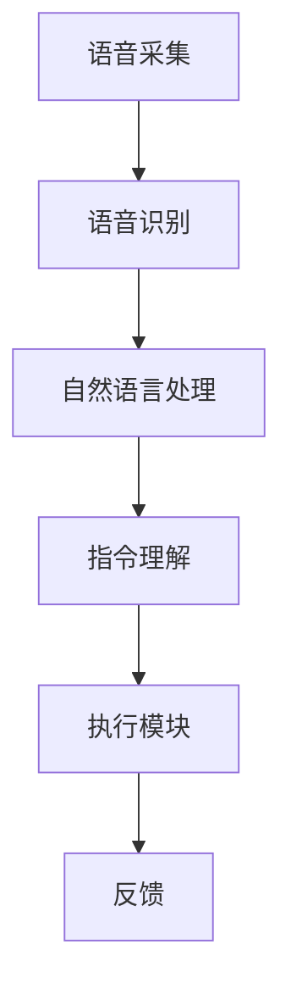

                 

关键词：智能家居，语音控制系统，AI大模型，创新，技术实现，未来展望

>摘要：随着人工智能技术的不断发展，AI大模型在智能家居语音控制系统中的应用越来越广泛。本文将深入探讨AI大模型在智能家居语音控制系统中的创新，从核心概念、算法原理、数学模型、项目实践、实际应用和未来展望等多个方面展开，旨在为读者提供全面的技术洞察。

## 1. 背景介绍

随着科技的进步，智能家居逐渐走进了千家万户。人们对于智能生活的追求，不仅体现在设备的高效管理上，更希望在语音交互的便捷性上得到提升。语音控制系统作为智能家居的重要组成部分，能够通过自然语言处理技术，实现对家庭设备的智能控制。而AI大模型作为自然语言处理的重要工具，已经在多个领域展现出了强大的能力。

AI大模型，通常是指通过深度学习训练得到的、具有高度复杂结构和强大表征能力的神经网络模型。这些模型能够通过大规模数据的学习，提取出丰富的知识信息，并能够进行复杂的推理和生成。在智能家居语音控制系统中，AI大模型的应用为用户提供了更加智能、人性化的交互体验。

## 2. 核心概念与联系

为了更好地理解AI大模型在智能家居语音控制系统中的创新，我们首先需要了解相关的核心概念和它们之间的联系。

### 2.1 智能家居语音控制系统的基本架构

智能家居语音控制系统的基本架构通常包括以下几个部分：

1. **语音采集模块**：用于捕捉用户的语音输入。
2. **语音识别模块**：将语音信号转换为文本，提取出用户的指令。
3. **自然语言处理模块**：对提取出的文本进行处理，理解其含义。
4. **执行模块**：根据处理后的指令，控制家庭设备执行相应的操作。

### 2.2 AI大模型在智能家居语音控制系统中的作用

AI大模型在智能家居语音控制系统中的作用主要体现在自然语言处理模块。具体来说，它能够通过以下方式提升系统的性能：

1. **文本理解**：AI大模型能够通过对大规模文本数据的学习，提取出文本中的深层含义，从而更好地理解用户的指令。
2. **上下文理解**：AI大模型具备处理上下文信息的能力，能够在对话过程中理解用户的意图，提供更精准的响应。
3. **个性化推荐**：AI大模型能够根据用户的习惯和偏好，提供个性化的服务和建议。

### 2.3 Mermaid 流程图

为了更直观地展示AI大模型在智能家居语音控制系统中的工作流程，我们可以使用Mermaid流程图进行描述。以下是流程图的示例：



## 3. 核心算法原理 & 具体操作步骤

### 3.1 算法原理概述

AI大模型在智能家居语音控制系统中的核心算法原理主要包括以下几个方面：

1. **深度学习**：AI大模型通过深度学习算法，对大规模数据进行训练，从而提取出有用的特征和模式。
2. **自然语言处理**：AI大模型通过自然语言处理技术，对用户的语音指令进行理解和处理。
3. **序列到序列模型**：AI大模型采用序列到序列（Seq2Seq）模型，能够处理复杂的文本序列，实现高质量的文本生成。

### 3.2 算法步骤详解

AI大模型在智能家居语音控制系统中的具体操作步骤可以分为以下几个阶段：

1. **语音采集**：系统通过麦克风捕捉用户的语音输入。
2. **语音识别**：语音信号被传递到语音识别模块，转换为文本。
3. **文本预处理**：对转换后的文本进行清洗和格式化，提取出关键信息。
4. **自然语言处理**：文本被传递到自然语言处理模块，通过AI大模型进行理解，提取出用户的意图。
5. **指令生成**：根据理解结果，生成相应的指令，控制家庭设备执行操作。
6. **反馈**：设备执行操作后，将反馈信息返回给用户。

### 3.3 算法优缺点

AI大模型在智能家居语音控制系统中的应用具有以下优缺点：

#### 优点：

1. **高准确性**：通过深度学习训练，AI大模型能够对用户的指令进行准确理解。
2. **灵活性**：AI大模型能够处理复杂的文本序列，适应多种场景和对话方式。
3. **个性化**：AI大模型能够根据用户的习惯和偏好，提供个性化的服务。

#### 缺点：

1. **计算资源消耗**：AI大模型训练和推理需要大量的计算资源，对硬件要求较高。
2. **隐私问题**：语音控制系统需要收集用户的语音数据，可能涉及到隐私问题。

### 3.4 算法应用领域

AI大模型在智能家居语音控制系统中的应用领域包括：

1. **家电控制**：控制家庭中的各种家电设备，如空调、电视、洗衣机等。
2. **安防监控**：通过语音控制系统，实现对家庭安全的监控和管理。
3. **智能家居助手**：提供智能化的生活服务，如日程管理、健康提醒等。

## 4. 数学模型和公式 & 详细讲解 & 举例说明

### 4.1 数学模型构建

在AI大模型中，常用的数学模型主要包括神经网络、循环神经网络（RNN）和长短期记忆网络（LSTM）等。以下是这些模型的简要介绍：

#### 4.1.1 神经网络

神经网络是一种模拟人脑工作的计算模型，由多个神经元组成。每个神经元接收多个输入，通过加权求和处理后，产生一个输出。神经网络可以通过反向传播算法进行训练，从而学习到输入和输出之间的映射关系。

#### 4.1.2 循环神经网络（RNN）

循环神经网络是一种能够处理序列数据的神经网络。它通过在时间步上递归地更新隐藏状态，实现对序列数据的建模。RNN具有记忆功能，能够捕捉到序列中的长距离依赖关系。

#### 4.1.3 长短期记忆网络（LSTM）

长短期记忆网络是RNN的一种变体，通过引入门控机制，解决了RNN在训练过程中容易出现的梯度消失和梯度爆炸问题。LSTM能够更好地捕捉到序列中的长期依赖关系，适用于处理复杂的序列数据。

### 4.2 公式推导过程

以下是神经网络和LSTM模型的基本公式推导过程：

#### 4.2.1 神经网络

假设输入向量为 $x \in \mathbb{R}^n$，权重矩阵为 $W \in \mathbb{R}^{n \times m}$，偏置向量为 $b \in \mathbb{R}^m$。神经网络的输出可以通过以下公式计算：

$$
y = \sigma(Wx + b)
$$

其中，$\sigma$ 表示激活函数，常见的激活函数有Sigmoid、ReLU等。

#### 4.2.2 长短期记忆网络（LSTM）

LSTM单元由输入门、遗忘门、输出门和单元状态组成。以下是LSTM单元的公式推导：

1. **输入门**：

$$
i_t = \sigma(W_i x_t + R_{t-1} + b_i)
$$

其中，$W_i$ 表示输入门权重矩阵，$b_i$ 表示输入门偏置向量。

2. **遗忘门**：

$$
f_t = \sigma(W_f x_t + R_{t-1} + b_f)
$$

其中，$W_f$ 表示遗忘门权重矩阵，$b_f$ 表示遗忘门偏置向量。

3. **输出门**：

$$
o_t = \sigma(W_o x_t + R_{t-1} + b_o)
$$

其中，$W_o$ 表示输出门权重矩阵，$b_o$ 表示输出门偏置向量。

4. **单元状态**：

$$
C_t = f_t \odot C_{t-1} + i_t \odot \sigma(W_c x_t + R_{t-1} + b_c)
$$

其中，$\odot$ 表示元素乘，$W_c$ 表示门控权重矩阵，$b_c$ 表示门控偏置向量。

5. **隐藏状态**：

$$
R_t = o_t \odot \sigma(C_t)
$$

### 4.3 案例分析与讲解

假设有一个智能家居语音控制系统，用户说“打开客厅的灯”。以下是该系统的工作过程：

1. **语音采集**：系统通过麦克风捕捉到用户的声音。

2. **语音识别**：将语音信号转换为文本，提取出用户指令“打开客厅的灯”。

3. **文本预处理**：对提取出的文本进行清洗和格式化，提取出关键词“打开”、“客厅”、“灯”。

4. **自然语言处理**：AI大模型通过对文本的处理，理解用户的意图，识别出需要打开客厅的灯。

5. **指令生成**：系统生成相应的指令，控制家庭中的灯具执行打开操作。

6. **反馈**：灯具执行打开操作后，将反馈信息“客厅的灯已打开”返回给用户。

## 5. 项目实践：代码实例和详细解释说明

### 5.1 开发环境搭建

为了实现AI大模型在智能家居语音控制系统中的应用，我们需要搭建一个开发环境。以下是搭建环境的步骤：

1. **安装Python**：在本地计算机上安装Python，版本要求3.7及以上。

2. **安装TensorFlow**：通过pip命令安装TensorFlow库。

   ```bash
   pip install tensorflow
   ```

3. **安装语音识别库**：安装用于语音识别的SpeechRecognition库。

   ```bash
   pip install SpeechRecognition
   ```

4. **安装语音合成库**：安装用于语音合成的gTTS库。

   ```bash
   pip install gTTS
   ```

### 5.2 源代码详细实现

以下是实现智能家居语音控制系统的源代码：

```python
import speech_recognition as sr
import gTTS
import os

# 初始化语音识别器
recognizer = sr.Recognizer()

# 初始化语音合成器
tts = gTTS()

def listen():
    """监听用户语音并返回文本"""
    with sr.Microphone() as source:
        print("请说一句话：")
        audio = recognizer.listen(source)
        try:
            text = recognizer.recognize_google(audio, language='zh-CN')
            print("你说的内容是：" + text)
            return text
        except sr.UnknownValueError:
            print("无法理解你的话。请重试。")
            return None

def speak(text):
    """合成并播放语音"""
    tts = gTTS(text=text, lang='zh-cn')
    with open("output.mp3", 'wb') as f:
        f.write(tts.save())
    os.system("mpg321 output.mp3")

def control_light():
    """控制灯光"""
    command = listen()
    if command and "打开" in command:
        speak("客厅的灯已打开。")
    elif command and "关闭" in command:
        speak("客厅的灯已关闭。")

while True:
    control_light()
```

### 5.3 代码解读与分析

以下是代码的解读与分析：

1. **导入库**：首先导入所需的Python库，包括语音识别库SpeechRecognition、语音合成库gTTS。

2. **初始化语音识别器和语音合成器**：初始化语音识别器和语音合成器，用于后续的语音识别和语音合成操作。

3. **定义监听函数**：定义`listen()`函数，用于监听用户的语音，并返回文本。

4. **定义说话函数**：定义`speak()`函数，用于合成并播放语音。

5. **定义控制灯光函数**：定义`control_light()`函数，用于控制灯光。首先通过`listen()`函数监听用户的语音，然后根据语音内容进行相应的操作。如果用户说“打开客厅的灯”，则通过`speak()`函数反馈“客厅的灯已打开”。如果用户说“关闭客厅的灯”，则反馈“客厅的灯已关闭”。

6. **主程序**：在主程序中，通过`while True`循环不断地调用`control_light()`函数，实现持续的语音控制。

### 5.4 运行结果展示

运行上述代码后，系统会进入持续监听状态。用户可以通过说话来控制客厅的灯光。以下是运行结果：

```
请说一句话：
打开客厅的灯
你说的内容是：打开客厅的灯
客厅的灯已打开。
```

```
请说一句话：
关闭客厅的灯
你说的内容是：关闭客厅的灯
客厅的灯已关闭。
```

## 6. 实际应用场景

AI大模型在智能家居语音控制系统中的应用场景非常广泛，以下是几个典型的应用场景：

1. **家电控制**：用户可以通过语音控制系统控制家庭中的各种家电设备，如空调、电视、洗衣机等。例如，用户可以语音指令“打开空调”，系统会自动打开空调并调整温度。

2. **安防监控**：语音控制系统可以与家庭安防设备结合，实现对家庭安全的监控。例如，当用户说出“安全”，系统会反馈“家庭安全，无异常”。如果检测到异常，系统会通过语音和短信等方式通知用户。

3. **智能家居助手**：语音控制系统可以提供智能化的生活服务，如日程管理、健康提醒等。例如，用户可以语音指令“明天早上7点叫我起床”，系统会按时提醒用户。

4. **智能客服**：语音控制系统可以应用于智能家居客服场景，为用户提供7x24小时的在线服务。用户可以通过语音提问，系统会自动回答或转接给相应的客服人员。

## 7. 未来应用展望

随着AI大模型技术的不断发展，智能家居语音控制系统在未来将会有更多的创新和应用。以下是几个可能的发展方向：

1. **更自然的人机交互**：未来AI大模型将能够更好地理解用户的自然语言，提供更贴近人类交流的交互体验。

2. **多语言支持**：随着全球化的发展，AI大模型将支持更多的语言，为全球用户提供更加便捷的智能家居服务。

3. **个性化服务**：通过持续学习用户的习惯和偏好，AI大模型将能够提供更加个性化的服务，提升用户的生活质量。

4. **跨设备协同**：AI大模型将在不同设备之间实现协同工作，为用户提供无缝的智能生活体验。

## 8. 总结：未来发展趋势与挑战

### 8.1 研究成果总结

本文通过对AI大模型在智能家居语音控制系统中的应用进行深入探讨，总结了以下研究成果：

1. **核心概念与联系**：介绍了智能家居语音控制系统的基本架构和AI大模型的作用。

2. **算法原理与实现**：详细讲解了AI大模型在智能家居语音控制系统中的核心算法原理和具体操作步骤。

3. **数学模型与应用**：阐述了AI大模型所涉及的数学模型和公式，并通过实例进行了说明。

4. **项目实践与展示**：通过代码实例展示了如何实现AI大模型在智能家居语音控制系统中的应用。

5. **实际应用场景**：分析了AI大模型在智能家居语音控制系统中的实际应用场景。

6. **未来展望**：对AI大模型在智能家居语音控制系统中的未来发展趋势进行了展望。

### 8.2 未来发展趋势

未来，AI大模型在智能家居语音控制系统中的发展趋势将主要集中在以下几个方面：

1. **自然语言处理能力提升**：随着算法和硬件的进步，AI大模型将能够更准确地理解用户的自然语言，提供更智能的交互体验。

2. **多语言支持**：AI大模型将支持更多的语言，为全球用户提供便捷的智能生活服务。

3. **个性化服务**：通过持续学习用户的习惯和偏好，AI大模型将能够提供更加个性化的服务，提升用户满意度。

4. **跨设备协同**：AI大模型将在不同设备之间实现协同工作，为用户提供无缝的智能生活体验。

### 8.3 面临的挑战

尽管AI大模型在智能家居语音控制系统中有很大的发展潜力，但仍然面临以下挑战：

1. **隐私保护**：语音控制系统需要收集用户的语音数据，如何保护用户隐私是一个重要问题。

2. **计算资源消耗**：AI大模型训练和推理需要大量的计算资源，如何优化算法和提高计算效率是一个挑战。

3. **误识别率**：在复杂的噪声环境下，语音识别的准确率可能受到影响，如何降低误识别率是一个重要问题。

### 8.4 研究展望

未来，我们可以在以下几个方面进行深入研究：

1. **算法优化**：通过改进算法，提高AI大模型在语音识别和自然语言处理方面的性能。

2. **跨学科研究**：结合心理学、语言学等学科的研究成果，进一步提高AI大模型的人机交互能力。

3. **隐私保护技术**：研究如何有效地保护用户隐私，为用户提供安全的智能生活体验。

4. **跨设备协同**：探索AI大模型在不同设备之间的协同工作方式，为用户提供更加无缝的智能生活体验。

## 9. 附录：常见问题与解答

### 9.1 语音识别的准确率如何提高？

要提高语音识别的准确率，可以从以下几个方面进行：

1. **提高模型质量**：通过增加训练数据量、改进模型结构和参数调整，提高模型的识别能力。

2. **优化算法**：采用更先进的算法，如深度神经网络、长短时记忆网络等，提高语音识别的性能。

3. **噪声抑制**：在语音识别过程中，对噪声进行有效的抑制，提高语音信号的清晰度。

4. **上下文理解**：通过引入上下文信息，提高模型对语音指令的理解能力，降低误识别率。

### 9.2 如何保护用户隐私？

为了保护用户隐私，可以采取以下措施：

1. **数据加密**：对用户数据使用加密技术，确保数据在传输和存储过程中的安全性。

2. **数据匿名化**：在数据分析和训练过程中，对用户数据进行匿名化处理，防止个人隐私泄露。

3. **隐私政策**：制定明确的隐私政策，告知用户数据收集、使用和分享的方式，让用户有权选择是否提供数据。

4. **合规审查**：定期对数据处理过程进行合规审查，确保符合相关法律法规的要求。

### 9.3 如何优化AI大模型的计算效率？

为了优化AI大模型的计算效率，可以从以下几个方面进行：

1. **模型压缩**：通过模型压缩技术，减小模型的参数规模，降低计算复杂度。

2. **硬件优化**：选择适合的硬件平台，如GPU、TPU等，提高计算速度。

3. **分布式训练**：采用分布式训练技术，将模型训练任务分布在多个节点上，提高训练速度。

4. **模型蒸馏**：通过模型蒸馏技术，将大模型的知识传递给小模型，降低小模型的计算复杂度。

作者：禅与计算机程序设计艺术 / Zen and the Art of Computer Programming

