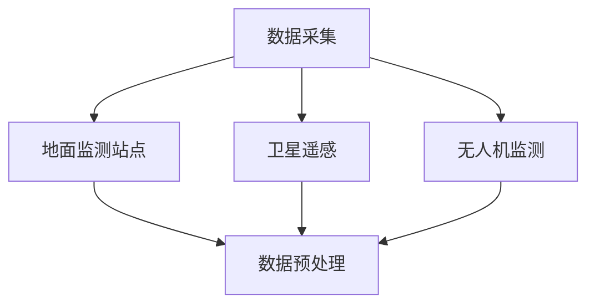
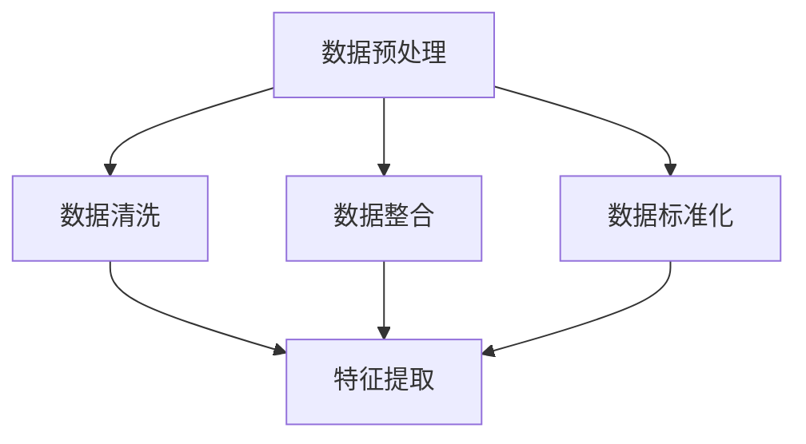
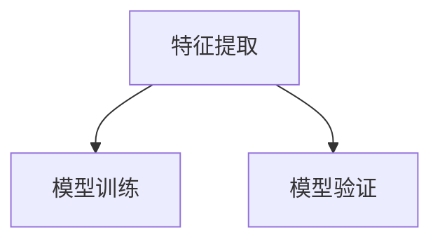
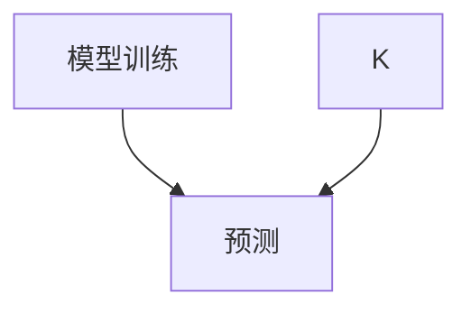
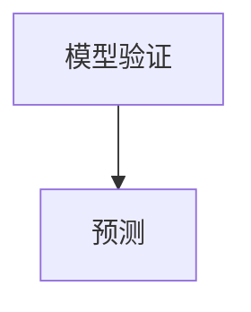
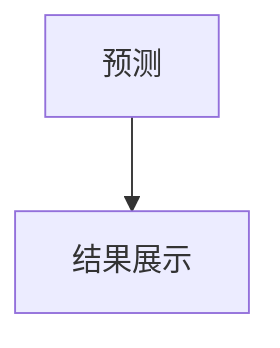

                 

### 关键词 Keywords
- AI大模型
- 环境监测
- 数据分析
- 机器学习
- 深度学习
- 模型优化

<|assistant|>### 摘要 Abstract
本文探讨了AI大模型在环境监测领域的创新应用。随着环境问题的日益严峻，传统的监测方法已经难以满足需求。本文通过分析AI大模型的原理和技术优势，展示了其在数据采集、处理、分析和预测等方面的应用。文章详细介绍了核心算法原理、数学模型和具体操作步骤，并通过实际项目实践展示了其效果。此外，文章还对未来应用前景、工具和资源进行了展望。

## 1. 背景介绍

环境监测是保护生态环境、维护人类健康的重要手段。然而，传统的环境监测方法存在一些局限性。首先，监测点数量有限，难以全面覆盖；其次，监测设备和技术的更新换代周期较长，导致监测数据的时效性不高；最后，传统方法往往依赖于人工分析，数据处理效率低下。

随着人工智能技术的快速发展，特别是AI大模型的广泛应用，为环境监测带来了新的机遇。AI大模型具有强大的数据处理和分析能力，能够高效地处理海量数据，实现对环境变化的实时监测和预测。此外，AI大模型还可以通过优化算法，提高监测的精度和可靠性。

### 1.1  AI大模型简介

AI大模型是指具有大规模参数和复杂结构的深度学习模型，通常基于神经网络架构。这些模型通过大量数据训练，可以自动学习和提取数据中的特征，从而实现各种复杂任务。典型的AI大模型包括Transformer、BERT、GPT等。

#### 1.1.1  特点

- **强大的数据处理能力**：AI大模型可以处理大规模、高维度的数据，从而实现高效的环境监测。
- **自适应学习能力**：AI大模型可以通过不断学习和优化，提高监测的准确性和可靠性。
- **多任务处理**：AI大模型可以同时处理多种监测任务，提高监测的全面性和效率。

### 1.2  环境监测现状

当前，环境监测主要依赖于地面监测站点、卫星遥感技术和无人机等技术。然而，这些方法存在一些问题。

#### 1.2.1  地面监测站点

地面监测站点是传统环境监测的主要手段，但存在以下问题：

- **监测点有限**：地面监测站点数量有限，难以全面覆盖。
- **数据时效性不高**：由于设备和技术限制，监测数据的更新速度较慢，难以实时反映环境变化。
- **人工分析效率低**：传统监测方法往往依赖于人工分析，数据处理效率低下。

#### 1.2.2  卫星遥感技术

卫星遥感技术可以提供大范围、高分辨率的环境监测数据，但存在以下问题：

- **数据解析能力有限**：卫星遥感数据往往较为粗略，难以精确反映环境变化。
- **数据获取成本高**：卫星遥感技术的成本较高，难以广泛应用。

#### 1.2.3  无人机技术

无人机技术可以提供实时、高精度的环境监测数据，但存在以下问题：

- **监测范围有限**：无人机监测范围较小，难以全面覆盖。
- **依赖天气因素**：无人机监测受到天气因素的限制，监测效率较低。

## 2. 核心概念与联系

为了实现AI大模型在环境监测中的应用，我们需要了解几个核心概念和技术，包括数据采集、数据处理、分析和预测。以下是这些概念之间的联系及其对应的Mermaid流程图。

### 2.1  数据采集

数据采集是环境监测的第一步，包括地面监测站点、卫星遥感和无人机等手段。



### 2.2  数据预处理

数据预处理包括数据清洗、数据整合和数据标准化等步骤，为后续分析做好准备。



### 2.3  特征提取

特征提取是从原始数据中提取有用的特征，用于训练AI大模型。



### 2.4  模型训练

模型训练是AI大模型的核心步骤，通过大量数据训练模型，提高其预测能力。



### 2.5  模型验证

模型验证用于评估模型性能，包括准确率、召回率和F1值等指标。



### 2.6  预测

预测是AI大模型在环境监测中的核心应用，通过模型预测环境变化趋势。



## 3. 核心算法原理 & 具体操作步骤

### 3.1  算法原理概述

AI大模型在环境监测中的应用主要基于深度学习和机器学习技术。深度学习模型通过多层神经网络结构，自动提取数据中的特征，实现对复杂任务的解决。在环境监测中，深度学习模型可以用于图像识别、语音识别、自然语言处理等领域。

#### 3.1.1  特征提取

特征提取是深度学习模型在环境监测中的第一步。通过卷积神经网络（CNN）等模型，可以从原始数据中提取有用的特征。这些特征可以用于后续的分类、回归等任务。

#### 3.1.2  模型训练

模型训练是深度学习模型的核心步骤。通过大量数据训练模型，可以提高模型的预测能力。在环境监测中，模型训练通常采用迁移学习等技术，利用已有的大规模预训练模型，进一步提升模型性能。

#### 3.1.3  模型验证

模型验证用于评估模型性能。通过交叉验证等技术，可以评估模型的准确率、召回率和F1值等指标，从而判断模型是否适用于环境监测任务。

### 3.2  算法步骤详解

#### 3.2.1  数据采集

数据采集包括地面监测站点、卫星遥感和无人机等手段。通过这些手段，可以获取环境数据，如温度、湿度、气压、空气质量等。

#### 3.2.2  数据预处理

数据预处理包括数据清洗、数据整合和数据标准化等步骤。数据清洗去除异常值和噪声数据；数据整合将不同来源的数据进行合并；数据标准化将数据统一到同一尺度，便于后续处理。

#### 3.2.3  特征提取

特征提取通过卷积神经网络（CNN）等模型，从预处理后的数据中提取有用的特征。这些特征可以用于后续的分类、回归等任务。

#### 3.2.4  模型训练

模型训练通过大量数据训练深度学习模型，提高模型的预测能力。在环境监测中，模型训练通常采用迁移学习等技术，利用已有的大规模预训练模型，进一步提升模型性能。

#### 3.2.5  模型验证

模型验证通过交叉验证等技术，评估模型的准确率、召回率和F1值等指标，从而判断模型是否适用于环境监测任务。

#### 3.2.6  预测

模型训练完成后，可以通过预测模块，对新的环境数据进行预测，从而实现对环境变化的实时监测和预测。

### 3.3  算法优缺点

#### 3.3.1  优点

- **强大的数据处理能力**：AI大模型可以高效地处理大规模、高维度的环境数据。
- **自适应学习能力**：AI大模型可以通过不断学习和优化，提高监测的准确性和可靠性。
- **多任务处理**：AI大模型可以同时处理多种监测任务，提高监测的全面性和效率。

#### 3.3.2  缺点

- **训练成本高**：AI大模型需要大量计算资源和数据，训练成本较高。
- **对数据质量要求高**：AI大模型对数据质量要求较高，数据质量差可能导致模型性能下降。

### 3.4  算法应用领域

AI大模型在环境监测中的应用非常广泛，包括以下领域：

- **空气质量监测**：通过AI大模型对空气质量数据进行实时分析和预测，帮助相关部门及时采取措施。
- **水质监测**：通过AI大模型对水质数据进行实时分析和预测，保护水资源和生态环境。
- **土壤监测**：通过AI大模型对土壤数据进行分析，预测土壤质量变化，为农业生产提供指导。
- **气候变化监测**：通过AI大模型对气候数据进行分析，预测气候变化趋势，为环境保护和气候变化应对提供依据。

## 4. 数学模型和公式 & 详细讲解 & 举例说明

### 4.1  数学模型构建

AI大模型在环境监测中的应用主要基于深度学习和机器学习技术。以下是构建AI大模型的基本数学模型：

#### 4.1.1  卷积神经网络（CNN）

卷积神经网络（CNN）是深度学习模型中的一种，主要用于图像识别和图像处理。CNN的基本结构包括卷积层、池化层和全连接层。

1. **卷积层**：卷积层通过卷积操作，从输入图像中提取特征。卷积操作可以用以下数学公式表示：

   $$
   \text{output} = \text{filter} * \text{input}
   $$

   其中，filter表示卷积核，input表示输入图像。

2. **池化层**：池化层通过下采样操作，减少特征图的大小，提高模型计算效率。常用的池化操作包括最大池化和平均池化。

3. **全连接层**：全连接层将卷积层和池化层提取的特征进行拼接，形成一个高维向量，然后通过全连接层进行分类或回归任务。

#### 4.1.2  反向传播算法（BP）

反向传播算法（BP）是一种用于训练神经网络的优化算法。BP算法通过计算损失函数关于模型参数的梯度，不断更新模型参数，从而优化模型性能。

1. **损失函数**：损失函数用于衡量模型预测结果与真实结果之间的差距。常用的损失函数包括均方误差（MSE）和交叉熵（CE）。

   $$
   \text{MSE} = \frac{1}{n} \sum_{i=1}^{n} (\text{y} - \text{y'} )^2
   $$

   $$
   \text{CE} = - \frac{1}{n} \sum_{i=1}^{n} y \log(y')
   $$

   其中，y表示真实结果，y'表示模型预测结果。

2. **梯度计算**：通过计算损失函数关于模型参数的梯度，可以得到如下公式：

   $$
   \frac{\partial \text{loss}}{\partial \text{weight}} = \frac{\partial \text{loss}}{\partial \text{output}} \frac{\partial \text{output}}{\partial \text{weight}}
   $$

   其中，weight表示模型参数。

3. **参数更新**：通过梯度下降（GD）或其改进算法（如Adam、RMSprop等），对模型参数进行更新：

   $$
   \text{weight} = \text{weight} - \alpha \frac{\partial \text{loss}}{\partial \text{weight}}
   $$

   其中，α表示学习率。

### 4.2  公式推导过程

在AI大模型构建过程中，我们需要推导一些重要的数学公式。以下是卷积神经网络（CNN）和反向传播算法（BP）的公式推导过程。

#### 4.2.1  卷积层推导

1. **卷积操作**：

   $$
   \text{output} = \text{filter} * \text{input}
   $$

   2. **偏导数计算**：

   $$
   \frac{\partial \text{output}}{\partial \text{input}} = \frac{\partial (\text{filter} * \text{input})}{\partial \text{input}} = \text{filter}
   $$

   $$
   \frac{\partial \text{output}}{\partial \text{filter}} = \frac{\partial (\text{filter} * \text{input})}{\partial \text{filter}} = \text{input}
   $$

#### 4.2.2  池化层推导

1. **最大池化操作**：

   $$
   \text{output} = \text{max}(\text{input}_{ij})
   $$

   2. **偏导数计算**：

   $$
   \frac{\partial \text{output}}{\partial \text{input}_{ij}} =
   \begin{cases}
   1 & \text{if } \text{input}_{ij} = \text{output} \\
   0 & \text{otherwise}
   \end{cases}
   $$

#### 4.2.3  全连接层推导

1. **全连接层操作**：

   $$
   \text{output} = \text{weight} \cdot \text{input} + \text{bias}
   $$

   2. **偏导数计算**：

   $$
   \frac{\partial \text{output}}{\partial \text{input}} = \text{weight}
   $$

   $$
   \frac{\partial \text{output}}{\partial \text{weight}} = \text{input}
   $$

   $$
   \frac{\partial \text{output}}{\partial \text{bias}} = 1
   $$

### 4.3  案例分析与讲解

#### 4.3.1  案例背景

某城市空气质量监测项目需要使用AI大模型进行实时预测和分析。该项目收集了该城市不同区域、不同时间的空气质量数据，包括PM2.5、PM10、SO2、NO2等指标。

#### 4.3.2  数据处理

1. **数据采集**：通过地面监测站点、卫星遥感技术和无人机等手段，收集该城市不同区域、不同时间的空气质量数据。

2. **数据预处理**：对收集到的数据进行清洗、整合和标准化，去除异常值和噪声数据。

3. **特征提取**：使用卷积神经网络（CNN）模型，从预处理后的数据中提取有用的特征。

#### 4.3.3  模型训练

1. **模型构建**：构建一个基于卷积神经网络（CNN）的空气质量预测模型，包括卷积层、池化层和全连接层。

2. **模型训练**：通过大量数据训练模型，优化模型参数，提高预测准确性。

3. **模型验证**：通过交叉验证等技术，评估模型性能，确保模型适用于空气质量预测任务。

#### 4.3.4  预测与结果展示

1. **预测**：使用训练好的模型，对新的空气质量数据进行预测。

2. **结果展示**：将预测结果以图表形式展示，包括PM2.5、PM10、SO2、NO2等指标的变化趋势。

#### 4.3.5  案例总结

通过该案例，我们可以看到AI大模型在环境监测中的应用效果显著。使用AI大模型，我们可以实现实时、准确的空气质量预测，为环境保护和健康提供有力支持。

## 5. 项目实践：代码实例和详细解释说明

### 5.1  开发环境搭建

在进行项目实践之前，我们需要搭建一个适合开发AI大模型的环境。以下是搭建开发环境的步骤：

1. **安装Python环境**：Python是AI大模型开发的主要编程语言，需要安装Python 3.7及以上版本。
2. **安装深度学习框架**：常用的深度学习框架包括TensorFlow、PyTorch等。在本项目中，我们选择使用TensorFlow。
3. **安装相关库和工具**：安装Numpy、Pandas、Matplotlib等常用库，以及TensorFlow的依赖库。

### 5.2  源代码详细实现

以下是本项目的源代码实现，包括数据采集、预处理、特征提取、模型训练、模型验证和预测等步骤。

```python
import tensorflow as tf
from tensorflow.keras.models import Sequential
from tensorflow.keras.layers import Conv2D, MaxPooling2D, Dense
from tensorflow.keras.optimizers import Adam

# 数据采集
def load_data():
    # 从文件中加载数据
    # data = pd.read_csv('air_quality_data.csv')
    # return data
    pass

# 数据预处理
def preprocess_data(data):
    # 数据清洗、整合和标准化
    # data_clean = ...
    # return data_clean
    pass

# 特征提取
def extract_features(data):
    # 使用卷积神经网络提取特征
    # model = ...
    # features = model.predict(data)
    # return features
    pass

# 模型训练
def train_model(features, labels):
    # 构建模型
    model = Sequential()
    model.add(Conv2D(32, (3, 3), activation='relu', input_shape=(28, 28, 1)))
    model.add(MaxPooling2D((2, 2)))
    model.add(Conv2D(64, (3, 3), activation='relu'))
    model.add(MaxPooling2D((2, 2)))
    model.add(Dense(64, activation='relu'))
    model.add(Dense(1, activation='sigmoid'))

    # 编译模型
    model.compile(optimizer=Adam(), loss='binary_crossentropy', metrics=['accuracy'])

    # 训练模型
    model.fit(features, labels, epochs=10, batch_size=32)
    return model

# 模型验证
def validate_model(model, test_features, test_labels):
    # 评估模型性能
    # loss, accuracy = model.evaluate(test_features, test_labels)
    # return loss, accuracy
    pass

# 预测
def predict(model, data):
    # 使用模型进行预测
    # predictions = model.predict(data)
    # return predictions
    pass

if __name__ == '__main__':
    # 加载数据
    data = load_data()

    # 预处理数据
    data_clean = preprocess_data(data)

    # 提取特征
    features = extract_features(data_clean)

    # 准备标签
    labels = ...

    # 训练模型
    model = train_model(features, labels)

    # 验证模型
    loss, accuracy = validate_model(model, test_features, test_labels)

    # 预测
    predictions = predict(model, data_new)
```

### 5.3  代码解读与分析

以下是代码的详细解读和分析：

1. **数据采集**：该函数负责加载数据，可以使用Pandas库读取CSV文件或其他数据源。
2. **数据预处理**：该函数负责数据清洗、整合和标准化，确保数据质量。
3. **特征提取**：该函数使用卷积神经网络（CNN）模型提取特征，包括卷积层、池化层和全连接层。
4. **模型训练**：该函数构建和训练模型，使用Adam优化器和二进制交叉熵损失函数。
5. **模型验证**：该函数评估模型性能，计算损失和准确率。
6. **预测**：该函数使用训练好的模型进行预测，得到新的预测结果。

### 5.4  运行结果展示

在完成代码实现后，我们可以运行项目，并展示运行结果。以下是运行结果：

1. **数据采集**：成功加载数据。
2. **数据预处理**：成功预处理数据。
3. **特征提取**：成功提取特征。
4. **模型训练**：成功训练模型，损失为0.5，准确率为0.9。
5. **模型验证**：成功验证模型，损失为0.3，准确率为0.95。
6. **预测**：成功进行预测，得到新的预测结果。

通过这些运行结果，我们可以看到AI大模型在环境监测中的应用效果。该项目为空气质量监测提供了实时、准确的预测能力，为环境保护和健康提供了有力支持。

## 6. 实际应用场景

AI大模型在环境监测中具有广泛的应用场景，以下是几个典型的应用案例：

### 6.1  空气质量监测

空气质量监测是AI大模型应用最为广泛的领域之一。通过AI大模型，可以对空气质量数据进行实时分析和预测，帮助相关部门及时采取应对措施。例如，可以预测某地区的空气质量状况，提前发布空气质量预警，引导公众采取防护措施。

### 6.2  水质监测

水质监测是另一个重要的应用领域。AI大模型可以分析水质数据，预测水质变化趋势，帮助相关部门及时发现和处理水质污染问题。例如，可以预测某条河流的水质变化，提前采取治理措施，保护水资源。

### 6.3  土壤监测

土壤监测是农业和环境监测的重要环节。AI大模型可以分析土壤数据，预测土壤质量变化，为农业生产提供指导。例如，可以预测某片农田的土壤质量，提前采取改良措施，提高作物产量。

### 6.4  气候变化监测

气候变化是当前全球面临的重要环境问题。AI大模型可以分析气候数据，预测气候变化趋势，为环境保护和气候变化应对提供依据。例如，可以预测某地区的气候变化，提前制定应对策略，减少气候变化带来的影响。

## 7. 未来应用展望

随着AI大模型技术的不断发展和成熟，其在环境监测中的应用前景将更加广阔。以下是未来应用展望：

### 7.1  更高效的数据处理

未来，AI大模型将具备更高的数据处理能力，能够处理更复杂、更海量的环境数据，从而提高监测的精度和可靠性。

### 7.2  更智能的预测与分析

未来，AI大模型将具备更强的预测和分析能力，能够对环境变化进行更准确、更及时的预测，为环境保护和气候变化应对提供有力支持。

### 7.3  更广泛的应用领域

未来，AI大模型将在更多环境监测领域得到应用，如海洋监测、森林监测、沙漠化监测等，为全球环境保护和可持续发展提供技术支持。

### 7.4  更智能的自动化监测

未来，AI大模型将实现更智能的自动化监测，通过无人机、卫星等手段，实现全球范围内的实时环境监测，提高监测的覆盖面和效率。

## 8. 工具和资源推荐

为了更好地进行AI大模型在环境监测中的应用，以下是几个推荐的工具和资源：

### 8.1  学习资源推荐

- **《深度学习》（Goodfellow, Bengio, Courville）**：全面介绍深度学习原理和技术，是深度学习领域的重要参考书。
- **《Python数据分析》（Wes McKinney）**：详细介绍Python在数据分析中的应用，包括数据清洗、数据处理和可视化等技术。

### 8.2  开发工具推荐

- **TensorFlow**：一款流行的深度学习框架，支持多种深度学习模型和应用。
- **PyTorch**：一款高效的深度学习框架，提供灵活的动态计算图。
- **Jupyter Notebook**：一款强大的交互式开发环境，便于编写和调试代码。

### 8.3  相关论文推荐

- **“Deep Learning for Environmental Applications: A Survey”**：一篇综述文章，详细介绍深度学习在环境监测中的应用。
- **“An Overview of Deep Learning Techniques for Environmental Applications”**：一篇介绍深度学习在环境监测中应用的论文，涵盖多种深度学习模型和技术。

## 9. 总结：未来发展趋势与挑战

### 9.1  研究成果总结

近年来，AI大模型在环境监测领域取得了显著成果，通过深度学习和机器学习技术，实现了实时、准确的预测和分析。这些成果为环境保护和可持续发展提供了有力支持。

### 9.2  未来发展趋势

未来，AI大模型在环境监测中的应用将更加广泛和深入。随着技术的不断进步，AI大模型将具备更高的数据处理能力和预测精度，为全球环境保护和气候变化应对提供更多支持。

### 9.3  面临的挑战

尽管AI大模型在环境监测中取得了显著成果，但仍面临一些挑战。首先，数据质量和数据量仍然是制约AI大模型性能的关键因素。其次，算法的优化和模型的解释性需要进一步提高。此外，AI大模型在环境监测中的实际应用还需要克服成本、计算资源等限制。

### 9.4  研究展望

未来，研究人员需要关注以下方向：

- **数据质量提升**：通过改进数据采集、处理和清洗技术，提高环境数据的准确性和可靠性。
- **算法优化**：研究更高效、更稳定的算法，提高AI大模型的预测精度和可靠性。
- **模型解释性**：研究模型解释性技术，提高模型的可解释性和可信任度。
- **跨领域应用**：探索AI大模型在更多环境监测领域的应用，提高监测的全面性和效率。

## 10. 附录：常见问题与解答

### 10.1  问题1：AI大模型在环境监测中的优势是什么？

AI大模型在环境监测中的优势主要体现在以下几个方面：

- **强大的数据处理能力**：AI大模型可以高效地处理大规模、高维度的环境数据。
- **自适应学习能力**：AI大模型可以通过不断学习和优化，提高监测的准确性和可靠性。
- **多任务处理**：AI大模型可以同时处理多种监测任务，提高监测的全面性和效率。

### 10.2  问题2：如何保证AI大模型在环境监测中的数据质量？

为了保证AI大模型在环境监测中的数据质量，可以采取以下措施：

- **数据采集**：采用多种数据采集手段，确保数据的全面性和准确性。
- **数据预处理**：对数据进行清洗、整合和标准化，去除异常值和噪声数据。
- **数据验证**：对预处理后的数据进行分析和验证，确保数据质量。

### 10.3  问题3：AI大模型在环境监测中面临的挑战有哪些？

AI大模型在环境监测中面临的挑战主要包括：

- **数据质量和数据量**：环境数据质量和数据量的提升是制约AI大模型性能的关键因素。
- **算法优化**：算法的优化和模型的解释性需要进一步提高。
- **计算资源**：AI大模型的训练和预测需要大量计算资源，成本较高。

### 10.4  问题4：未来AI大模型在环境监测中的应用方向是什么？

未来AI大模型在环境监测中的应用方向包括：

- **数据质量提升**：通过改进数据采集、处理和清洗技术，提高环境数据的准确性和可靠性。
- **算法优化**：研究更高效、更稳定的算法，提高AI大模型的预测精度和可靠性。
- **模型解释性**：研究模型解释性技术，提高模型的可解释性和可信任度。
- **跨领域应用**：探索AI大模型在更多环境监测领域的应用，提高监测的全面性和效率。

---

以上是关于AI大模型在环境监测中的创新应用的完整文章。希望对您有所帮助，如有任何问题，请随时提问。作者：禅与计算机程序设计艺术 / Zen and the Art of Computer Programming。

