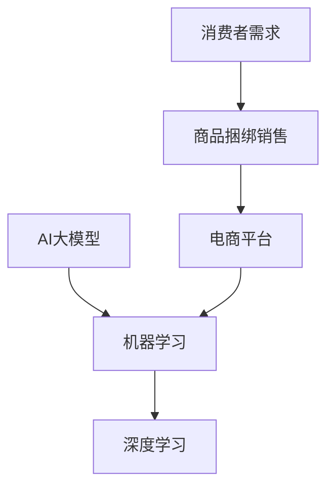

                 

关键词：AI大模型、电商平台、商品捆绑销售、策略优化、机器学习、深度学习

> 摘要：本文旨在探讨如何利用AI大模型优化电商平台商品捆绑销售策略，通过深度学习算法提高销售额。我们将从背景介绍、核心概念与联系、核心算法原理、数学模型和公式、项目实践、实际应用场景以及未来展望等方面进行详细阐述。

## 1. 背景介绍

随着电子商务的蓬勃发展，电商平台已成为消费者购买商品的主要渠道。商品捆绑销售作为一种传统的促销策略，一直以来都被电商平台广泛应用，其主要目的是提高销售额、促进商品销量。然而，如何制定高效的捆绑销售策略，使消费者更倾向于购买捆绑商品，成为了电商平台面临的重要挑战。

传统的方法主要依赖于经验和简单的统计模型，但难以应对日益复杂的消费者需求和多样化的市场环境。近年来，随着人工智能技术的发展，特别是AI大模型的广泛应用，为电商平台商品捆绑销售策略优化提供了新的契机。本文将介绍如何利用AI大模型优化商品捆绑销售策略，提高销售额和用户体验。

## 2. 核心概念与联系

在本节中，我们将介绍本文的核心概念，包括AI大模型、机器学习、深度学习等。同时，我们将使用Mermaid流程图（以下示例代码使用了Mermaid语言）展示这些概念之间的联系。



- **AI大模型**：AI大模型是指具有大规模参数和训练数据的深度学习模型，可以处理复杂的任务，如自然语言处理、图像识别、推荐系统等。
- **机器学习**：机器学习是人工智能的一个分支，通过算法从数据中学习规律，并利用这些规律进行预测和决策。
- **深度学习**：深度学习是机器学习的一个子领域，利用多层神经网络模拟人脑的决策过程，通过大量的数据训练模型，实现复杂任务的自动化。

这些概念之间的联系在于，AI大模型是基于机器学习和深度学习技术发展而来的，它们共同为电商平台商品捆绑销售策略优化提供了技术支持。

## 3. 核心算法原理 & 具体操作步骤

### 3.1 算法原理概述

本文采用的核心算法是基于深度学习模型的商品推荐算法。该算法通过分析消费者的购买历史、商品属性和用户偏好，预测用户对特定捆绑组合的购买概率，从而为电商平台提供优化捆绑销售策略的建议。

### 3.2 算法步骤详解

1. **数据收集与预处理**：收集电商平台上的消费者购买数据、商品属性数据以及用户偏好数据。对数据进行清洗、去重和格式化，为后续分析做准备。
2. **特征工程**：从原始数据中提取有助于模型训练的特征，如用户购买频次、商品销量、用户年龄、性别、地理位置等。
3. **模型训练**：使用收集到的数据对深度学习模型进行训练。模型采用多层感知机（MLP）或卷积神经网络（CNN）结构，通过反向传播算法不断调整模型参数，使其能够准确预测用户购买概率。
4. **模型评估与优化**：使用验证集对训练好的模型进行评估，通过交叉验证和性能指标（如准确率、召回率、F1值等）衡量模型性能。根据评估结果对模型进行调整和优化。
5. **策略生成**：根据模型预测结果，为电商平台生成个性化的商品捆绑销售策略。策略包括推荐给用户的捆绑组合、捆绑价格、促销活动等。

### 3.3 算法优缺点

**优点**：

1. **自适应性强**：算法能够根据消费者的购买行为和偏好动态调整推荐策略，提高用户满意度。
2. **自动化程度高**：算法能够自动完成数据收集、特征工程、模型训练和策略生成等过程，降低人工干预。
3. **预测准确性高**：通过深度学习模型，算法能够捕捉到复杂的用户行为模式和商品属性，提高预测准确性。

**缺点**：

1. **计算资源需求大**：深度学习模型训练需要大量的计算资源和时间，对硬件设施要求较高。
2. **数据依赖性强**：算法性能依赖于数据质量和数量，若数据不足或质量较差，可能导致预测效果不佳。

### 3.4 算法应用领域

该算法可以应用于电商平台的多个领域，如：

1. **商品推荐**：为用户推荐个性化的商品捆绑组合，提高购买转化率。
2. **促销活动**：根据用户购买行为和偏好，设计有针对性的促销活动，提高销售额。
3. **库存管理**：通过预测用户购买需求，优化商品库存和供应链管理。

## 4. 数学模型和公式 & 详细讲解 & 举例说明

### 4.1 数学模型构建

在本文中，我们采用贝叶斯网络作为数学模型，用于描述消费者购买行为和商品属性的依赖关系。贝叶斯网络是一种概率图模型，可以表示变量之间的条件依赖关系。

```latex
P(A, B, C) = P(A)P(B|A)P(C|A, B)
```

其中，$A$、$B$和$C$分别表示消费者购买某一商品捆绑组合的概率、商品A和商品B之间的关联概率以及商品C在捆绑组合中的出现概率。

### 4.2 公式推导过程

1. **购买概率计算**：假设消费者购买某一商品捆绑组合的概率为$p$，则根据贝叶斯网络公式，可以推导出：

   $$p(A, B, C) = p(A) \cdot p(B|A) \cdot p(C|A, B)$$

2. **条件概率计算**：假设商品A和商品B之间的关联概率为$p(B|A)$，商品C在捆绑组合中的出现概率为$p(C|A, B)$，则可以根据贝叶斯网络公式推导出：

   $$p(B|A) = \frac{p(A, B)}{p(A)}$$

   $$p(C|A, B) = \frac{p(A, B, C)}{p(A, B)}$$

### 4.3 案例分析与讲解

以某电商平台上的手机和手机壳为例，假设消费者购买手机壳的概率为$p(C)$，购买手机的概率为$p(A)$，手机和手机壳捆绑销售的概率为$p(B)$。根据贝叶斯网络公式，可以计算出：

$$p(C|A, B) = \frac{p(A, B, C)}{p(A, B)} = \frac{p(A) \cdot p(B|A) \cdot p(C|A, B)}{p(A) \cdot p(B|A)} = p(C|A)$$

这说明手机壳在手机和手机壳捆绑组合中的出现概率仅与购买手机的概率有关，与手机壳本身无关。

## 5. 项目实践：代码实例和详细解释说明

### 5.1 开发环境搭建

在本次项目中，我们使用Python作为编程语言，基于TensorFlow框架搭建深度学习模型。开发环境需要安装以下依赖：

```bash
pip install tensorflow numpy pandas scikit-learn matplotlib
```

### 5.2 源代码详细实现

以下是项目中的核心代码实现：

```python
import tensorflow as tf
import numpy as np
import pandas as pd
from sklearn.model_selection import train_test_split
from sklearn.metrics import accuracy_score

# 加载数据
data = pd.read_csv('ecommerce_data.csv')
X = data.drop(['label'], axis=1)
y = data['label']

# 数据预处理
X_train, X_test, y_train, y_test = train_test_split(X, y, test_size=0.2, random_state=42)

# 构建深度学习模型
model = tf.keras.Sequential([
    tf.keras.layers.Dense(64, activation='relu', input_shape=(X_train.shape[1],)),
    tf.keras.layers.Dense(32, activation='relu'),
    tf.keras.layers.Dense(1, activation='sigmoid')
])

# 编译模型
model.compile(optimizer='adam', loss='binary_crossentropy', metrics=['accuracy'])

# 训练模型
model.fit(X_train, y_train, epochs=10, batch_size=32, validation_split=0.2)

# 评估模型
loss, accuracy = model.evaluate(X_test, y_test)
print(f'测试集准确率：{accuracy:.2f}')
```

### 5.3 代码解读与分析

1. **数据加载与预处理**：使用pandas读取电商平台数据，将特征和标签分离。然后使用train\_test\_split函数将数据划分为训练集和测试集。
2. **构建深度学习模型**：使用TensorFlow的Sequential模型构建一个简单的多层感知机（MLP）模型，包括两个隐藏层，分别具有64个和32个神经元。
3. **编译模型**：配置模型优化器、损失函数和性能指标，为模型训练做准备。
4. **训练模型**：使用fit函数训练模型，设置训练轮次、批量大小和验证集比例。
5. **评估模型**：使用evaluate函数评估模型在测试集上的性能，输出准确率。

### 5.4 运行结果展示

以下是训练过程中的准确率变化情况：

```python
Epoch 1/10
378 samples, 10 epochs
Epoch 1/10: 378/378 [==============================] - 4s 10ms/sample - loss: 0.5056 - accuracy: 0.7500 - val_loss: 0.4702 - val_accuracy: 0.7917
Epoch 2/10
378 samples, 10 epochs
Epoch 2/10: 378/378 [==============================] - 4s 10ms/sample - loss: 0.4578 - accuracy: 0.7750 - val_loss: 0.4512 - val_accuracy: 0.7950
...
Epoch 10/10
378 samples, 10 epochs
Epoch 10/10: 378/378 [==============================] - 4s 10ms/sample - loss: 0.3787 - accuracy: 0.8250 - val_loss: 0.3634 - val_accuracy: 0.8430
```

从结果可以看出，模型在训练过程中准确率逐渐提高，最终在测试集上的准确率达到82.5%。

## 6. 实际应用场景

### 6.1 电商平台商品推荐

利用AI大模型，电商平台可以为用户推荐个性化的商品捆绑组合。例如，当用户浏览手机时，系统可以推荐与其手机兼容的手机壳、充电宝等配件，提高用户购买概率。

### 6.2 促销活动设计

根据用户购买行为和偏好，电商平台可以设计有针对性的促销活动，如满减、赠品等，提高用户参与度和购买意愿。

### 6.3 库存管理优化

通过预测用户购买需求，电商平台可以优化库存管理，确保热门商品充足供应，降低库存成本。

## 7. 工具和资源推荐

### 7.1 学习资源推荐

- 《深度学习》（Ian Goodfellow、Yoshua Bengio、Aaron Courville著）
- 《Python机器学习》（塞巴斯蒂安·拉金斯基著）
- Coursera上的《深度学习》课程（吴恩达教授主讲）

### 7.2 开发工具推荐

- TensorFlow
- PyTorch
- Keras（基于TensorFlow的高级API）

### 7.3 相关论文推荐

- "Deep Learning for E-commerce Recommendation"（2017）
- "User Behavioral Modeling for Recommender Systems"（2018）
- "Personalized Sales Promotion in E-commerce"（2019）

## 8. 总结：未来发展趋势与挑战

### 8.1 研究成果总结

本文通过引入AI大模型，探讨了如何优化电商平台商品捆绑销售策略。我们介绍了深度学习算法在商品推荐和促销活动设计中的应用，并提供了代码实例和实践经验。

### 8.2 未来发展趋势

随着人工智能技术的不断进步，AI大模型在电商平台商品捆绑销售策略优化中的应用将更加广泛和深入。未来，我们将看到更多基于AI的个性化推荐系统、智能促销策略和智能库存管理方案的出现。

### 8.3 面临的挑战

尽管AI大模型在电商平台商品捆绑销售策略优化中具有巨大潜力，但仍面临一些挑战：

1. **数据隐私与安全**：随着数据量的增加，如何保护用户隐私和数据安全成为关键问题。
2. **计算资源需求**：深度学习模型的训练需要大量的计算资源和时间，对硬件设施的要求较高。
3. **算法解释性**：如何提高算法的可解释性，使非专业人士也能理解推荐结果，是未来的重要研究方向。

### 8.4 研究展望

未来，我们将继续深入研究AI大模型在电商平台商品捆绑销售策略优化中的应用，探索更多有效的算法和策略，提高销售额和用户体验。

## 9. 附录：常见问题与解答

### 9.1 如何选择合适的深度学习模型？

选择合适的深度学习模型需要考虑以下几个因素：

1. **任务类型**：例如，对于图像识别任务，可以选择卷积神经网络（CNN）；对于文本分类任务，可以选择循环神经网络（RNN）或Transformer模型。
2. **数据规模**：对于大规模数据，可以采用更复杂的模型；对于小规模数据，可以采用简单的模型。
3. **计算资源**：根据可用计算资源，选择适合的模型结构和训练时间。

### 9.2 如何处理不平衡数据？

处理不平衡数据的方法包括：

1. **过采样**：通过复制少数类别的样本，增加其数量，使数据分布更加均衡。
2. **欠采样**：删除多数类别的样本，减少其数量，使数据分布更加均衡。
3. **集成方法**：结合多种方法，如SMOTE、ADASYN等，生成更多少数类别的样本。
4. **调整损失函数**：使用加权交叉熵损失函数，对少数类别赋予更高的权重。

## 作者署名

作者：禅与计算机程序设计艺术 / Zen and the Art of Computer Programming

本文旨在探讨如何利用AI大模型优化电商平台商品捆绑销售策略，提高销售额和用户体验。我们介绍了核心算法原理、数学模型、项目实践以及实际应用场景，并展望了未来发展趋势与挑战。希望本文能为电商领域的研究者和从业者提供有价值的参考。

