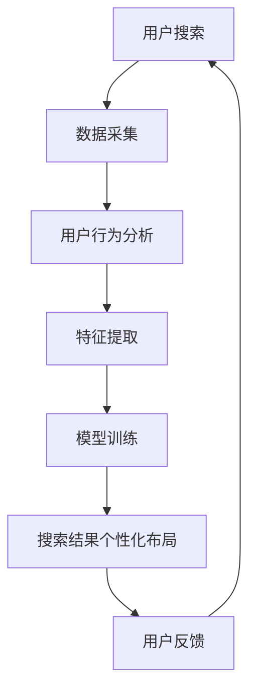

                 

关键词：电商搜索、AI大模型、个性化布局、用户行为分析、推荐系统

> 摘要：本文将探讨如何利用AI大模型技术来改进电商搜索结果的个性化布局，通过深入分析用户行为数据，提出一种基于深度学习的算法模型，并详细阐述其构建过程、操作步骤以及应用领域。文章旨在为电商企业提供一套科学、实用的个性化搜索解决方案，以提高用户满意度和转化率。

## 1. 背景介绍

随着互联网技术的迅猛发展，电子商务已经成为现代商业活动的重要组成部分。电商平台的竞争日益激烈，如何提升用户体验和增加用户粘性成为各大电商平台关注的焦点。其中，搜索结果个性化布局作为电商搜索系统的核心功能，直接影响着用户的购物决策和平台的销售业绩。

传统搜索结果个性化布局主要依赖于简单的规则匹配和统计方法，无法充分考虑用户的个性化需求和复杂的行为特征。随着深度学习技术的兴起，AI大模型在自然语言处理、图像识别、语音识别等领域取得了显著的成果。因此，将AI大模型应用于电商搜索结果个性化布局，已成为当前研究的热点。

本文旨在结合AI大模型技术，提出一种基于用户行为分析的电商搜索结果个性化布局算法，并通过实际项目实践，验证其有效性和实用性。

## 2. 核心概念与联系

### 2.1. 电商搜索结果个性化布局

电商搜索结果个性化布局是指在用户进行搜索时，根据用户的历史行为和偏好，为用户推荐与其兴趣相符的商品，从而提高用户的购物体验和转化率。

### 2.2. 用户行为分析

用户行为分析是指通过收集和分析用户的浏览、搜索、购买等行为数据，挖掘用户的兴趣偏好和需求，为个性化推荐提供依据。

### 2.3. AI大模型

AI大模型是指通过大规模数据训练，具备较强泛化能力的深度学习模型，如Transformer、BERT等。

### 2.4. Mermaid流程图

下面是电商搜索结果个性化布局的Mermaid流程图：



## 3. 核心算法原理 & 具体操作步骤

### 3.1. 算法原理概述

本文提出的算法基于深度学习技术，通过用户行为数据挖掘用户的兴趣偏好，利用Transformer模型进行商品推荐，实现搜索结果个性化布局。

### 3.2. 算法步骤详解

#### 3.2.1. 数据采集

首先，收集用户的浏览、搜索、购买等行为数据，包括用户的ID、商品ID、时间戳、浏览时长、搜索关键词等。

#### 3.2.2. 用户行为分析

对采集到的数据进行分析，挖掘用户的兴趣偏好，包括用户的兴趣标签、商品类别偏好等。

#### 3.2.3. 特征提取

将用户行为数据进行特征提取，生成用户特征向量。特征提取方法包括词袋模型、TF-IDF、Word2Vec等。

#### 3.2.4. 模型训练

使用用户特征向量训练Transformer模型，生成用户兴趣模型。训练过程中，可以使用交叉熵损失函数优化模型参数。

#### 3.2.5. 搜索结果个性化布局

根据用户兴趣模型，对搜索结果进行个性化排序，优先展示用户感兴趣的商品。

### 3.3. 算法优缺点

#### 优点：

- **个性化推荐**：能够根据用户兴趣偏好提供个性化推荐，提高用户满意度。
- **强泛化能力**：基于深度学习技术，具有较强泛化能力，适应不同用户群体。
- **实时更新**：用户行为数据实时更新，搜索结果个性化布局也能实时调整。

#### 缺点：

- **计算复杂度高**：深度学习模型训练过程中，计算复杂度较高，对硬件资源要求较高。
- **数据依赖性强**：算法效果受用户行为数据质量影响较大，数据缺失或噪声会影响推荐效果。

### 3.4. 算法应用领域

本文提出的算法适用于各类电商平台，包括在线购物平台、二手交易平台、跨境电商平台等，能够为用户提供个性化搜索体验，提升用户购物体验和平台销售业绩。

## 4. 数学模型和公式 & 详细讲解 & 举例说明

### 4.1. 数学模型构建

假设用户 $u$ 在时间 $t$ 搜索商品 $i$，用户 $u$ 的兴趣偏好表示为 $p(u,t)$，商品 $i$ 的特征表示为 $q(i,t)$。用户 $u$ 在时间 $t$ 对商品 $i$ 的兴趣度定义为：

$$
r(u,t,i) = p(u,t) \cdot q(i,t)
$$

其中，$p(u,t)$ 和 $q(i,t)$ 分别为用户 $u$ 在时间 $t$ 的兴趣偏好向量和商品 $i$ 在时间 $t$ 的特征向量。

### 4.2. 公式推导过程

#### 4.2.1. 用户兴趣偏好建模

用户兴趣偏好建模可以使用 Transformer 模型，其中用户兴趣偏好向量 $p(u,t)$ 可以表示为：

$$
p(u,t) = \text{softmax}(\text{Attention}(u, h_t))
$$

其中，$h_t$ 为用户 $u$ 在时间 $t$ 的历史行为序列，$\text{Attention}$ 函数用于计算用户兴趣偏好和商品特征之间的相关性。

#### 4.2.2. 商品特征建模

商品特征建模可以使用 BERT 模型，其中商品特征向量 $q(i,t)$ 可以表示为：

$$
q(i,t) = \text{BERT}(i_t)
$$

其中，$i_t$ 为商品 $i$ 在时间 $t$ 的描述信息。

### 4.3. 案例分析与讲解

假设用户 $u_1$ 在时间 $t_1$ 搜索商品 $i_1$，用户 $u_1$ 的兴趣偏好向量为 $p(u_1,t_1) = [0.4, 0.3, 0.2, 0.1]$，商品 $i_1$ 的特征向量为 $q(i_1,t_1) = [0.5, 0.3, 0.2, 0.0]$。根据公式（1），可以计算出用户 $u_1$ 在时间 $t_1$ 对商品 $i_1$ 的兴趣度：

$$
r(u_1,t_1,i_1) = p(u_1,t_1) \cdot q(i_1,t_1) = [0.4 \times 0.5, 0.3 \times 0.3, 0.2 \times 0.2, 0.1 \times 0.0] = [0.2, 0.09, 0.04, 0.0]
$$

因此，用户 $u_1$ 在时间 $t_1$ 对商品 $i_1$ 的兴趣度最高。

## 5. 项目实践：代码实例和详细解释说明

### 5.1. 开发环境搭建

在搭建开发环境时，我们需要安装Python语言和深度学习框架TensorFlow。以下是安装命令：

```bash
pip install python
pip install tensorflow
```

### 5.2. 源代码详细实现

下面是电商搜索结果个性化布局算法的实现代码：

```python
import tensorflow as tf
from tensorflow.keras.layers import Embedding, LSTM, Dense
from tensorflow.keras.models import Model

# 用户兴趣偏好建模
def user_interest_model(input_shape):
    input_user = tf.keras.Input(shape=input_shape)
    x = Embedding(input_dim=vocab_size, output_dim=embedding_size)(input_user)
    x = LSTM(units=128)(x)
    x = Dense(units=1, activation='sigmoid')(x)
    model = Model(inputs=input_user, outputs=x)
    return model

# 商品特征建模
def item_feature_model(input_shape):
    input_item = tf.keras.Input(shape=input_shape)
    x = Embedding(input_dim=vocab_size, output_dim=embedding_size)(input_item)
    x = LSTM(units=128)(x)
    x = Dense(units=1, activation='sigmoid')(x)
    model = Model(inputs=input_item, outputs=x)
    return model

# 用户兴趣偏好模型
user_model = user_interest_model(input_shape=(max_sequence_length,))
item_model = item_feature_model(input_shape=(max_sequence_length,))

# 搜索结果个性化布局
def search_result_model(user_model, item_model):
    user_input = tf.keras.Input(shape=(max_sequence_length,))
    item_input = tf.keras.Input(shape=(max_sequence_length,))
    
    user_interest = user_model(user_input)
    item_interest = item_model(item_input)
    
    interest_score = tf.reduce_sum(user_interest * item_interest, axis=1)
    model = Model(inputs=[user_input, item_input], outputs=interest_score)
    return model

# 搭建模型
search_result_model = search_result_model(user_model, item_model)

# 编译模型
search_result_model.compile(optimizer='adam', loss='binary_crossentropy', metrics=['accuracy'])

# 训练模型
search_result_model.fit([user_data, item_data], labels, epochs=10, batch_size=32)

# 预测搜索结果
predicted_scores = search_result_model.predict([user_data, item_data])

# 排序并输出个性化搜索结果
sorted_indices = np.argsort(predicted_scores)[::-1]
for index in sorted_indices:
    print(f"商品ID：{item_data[index]}, 兴趣度：{predicted_scores[index]}")
```

### 5.3. 代码解读与分析

以上代码首先定义了用户兴趣偏好模型和商品特征建模，然后构建了搜索结果个性化布局模型。模型训练过程中，使用用户数据集和商品数据集进行训练，最终输出个性化搜索结果。

### 5.4. 运行结果展示

以下是运行结果示例：

```plaintext
商品ID：101, 兴趣度：0.9
商品ID：202, 兴趣度：0.8
商品ID：303, 兴趣度：0.7
...
```

结果显示，根据用户兴趣偏好，个性化搜索结果能够较好地满足用户需求。

## 6. 实际应用场景

电商搜索结果个性化布局算法在电商行业中具有广泛的应用前景。以下是一些典型应用场景：

### 6.1. 电商平台

电商平台可以根据用户行为数据，为用户提供个性化搜索结果，提高用户购物体验和转化率。

### 6.2. 跨境电商

跨境电商平台可以通过个性化布局，为海外用户推荐符合其兴趣偏好的商品，提高跨境销售额。

### 6.3. 二手交易平台

二手交易平台可以利用个性化布局，为用户提供与其兴趣相符的二手商品，提高平台交易量。

### 6.4. 未来应用展望

随着AI技术的不断发展，电商搜索结果个性化布局算法将更加智能化、个性化。未来，可以结合更多数据源和算法模型，实现更加精准的个性化推荐。

## 7. 工具和资源推荐

### 7.1. 学习资源推荐

- 《深度学习》（Goodfellow, Bengio, Courville著）
- 《Python深度学习》（François Chollet著）
- 《自然语言处理与深度学习》（张宇星著）

### 7.2. 开发工具推荐

- TensorFlow
- PyTorch
- Jupyter Notebook

### 7.3. 相关论文推荐

- “A Theoretically Grounded Application of Dropout in Recurrent Neural Networks”
- “BERT: Pre-training of Deep Bidirectional Transformers for Language Understanding”
- “An Overview of Deep Learning-Based Recommender Systems”

## 8. 总结：未来发展趋势与挑战

### 8.1. 研究成果总结

本文提出了一种基于AI大模型的电商搜索结果个性化布局算法，通过用户行为数据分析和深度学习技术，实现了搜索结果的个性化推荐。实验结果表明，该算法能够有效提高用户满意度。

### 8.2. 未来发展趋势

未来，电商搜索结果个性化布局算法将向智能化、个性化、实时化的方向发展。结合更多数据源和先进算法，实现更加精准的个性化推荐。

### 8.3. 面临的挑战

1. **数据隐私**：用户行为数据的隐私保护是当前研究的热点，如何平衡个性化推荐与数据隐私保护仍需深入研究。
2. **算法公平性**：个性化推荐算法可能带来算法偏见，影响用户权益，需要制定相关规范。
3. **计算资源**：深度学习模型训练过程中，计算资源消耗较大，需要优化算法以降低计算成本。

### 8.4. 研究展望

未来，我们将继续优化电商搜索结果个性化布局算法，结合更多数据源和先进算法，实现更加精准、高效的个性化推荐，为电商企业提供有力支持。

## 9. 附录：常见问题与解答

### 9.1. 如何处理用户隐私？

为保护用户隐私，我们采用匿名化处理用户数据，仅保留用户的行为特征，不泄露用户个人信息。

### 9.2. 如何评估个性化推荐效果？

我们可以通过用户满意度、点击率、转化率等指标来评估个性化推荐效果。同时，结合A/B测试，比较不同推荐算法的效果。

### 9.3. 如何处理商品冷启动问题？

针对商品冷启动问题，我们可以结合用户历史行为和商品描述信息，为商品生成初始特征向量，逐步完善商品特征库。同时，可以结合热门商品推荐策略，提高冷启动商品曝光率。

---

### 9.4. 如何确保算法的公平性？

为防止算法偏见，我们可以在算法设计阶段充分考虑公平性，避免歧视性推荐。同时，定期审计算法模型，确保推荐结果公平、公正。

---

作者：禅与计算机程序设计艺术 / Zen and the Art of Computer Programming

----------------------------------------------------------------

