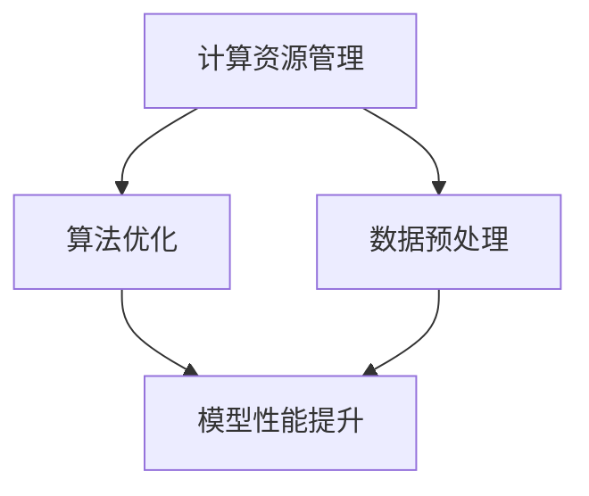

                 

关键词：AI大模型，成本优化，节约策略，算法优化，计算资源管理

> 摘要：本文旨在探讨人工智能领域中的大模型应用的成本优化与节约策略。通过对现有技术的分析，以及结合实际案例，我们将提出一系列优化方法，帮助企业和研究人员在享受AI大模型带来便利的同时，实现成本的有效控制和节约。

## 1. 背景介绍

随着人工智能技术的飞速发展，AI大模型已经在众多领域展现出了其强大的能力和广阔的应用前景。从自然语言处理、计算机视觉到推荐系统等，大模型的应用无处不在，为产业升级和科技进步提供了强有力的支撑。

然而，AI大模型的高性能需求也带来了巨大的计算资源消耗，这使得应用成本急剧上升。对于许多企业和研究机构来说，如何优化AI大模型应用的成本，成为一个亟待解决的问题。本文将围绕这一主题，探讨多种成本优化与节约策略。

## 2. 核心概念与联系

在讨论成本优化之前，我们需要理解几个核心概念：

### 2.1 计算资源管理

计算资源管理是确保系统高效运行的重要环节。它包括CPU、GPU、内存、存储等多种资源，如何合理地分配和调度这些资源，直接影响着应用的效率和成本。

### 2.2 算法优化

算法优化是指通过改进算法的效率和性能，减少计算资源的消耗。常见的优化手段包括并行计算、分布式计算、模型压缩等。

### 2.3 数据预处理

数据预处理是AI应用中不可或缺的步骤，包括数据清洗、数据增强、特征提取等。有效的数据预处理可以提高模型的性能，从而降低计算资源的需求。

### 2.4 Mermaid 流程图

下面是一个描述核心概念之间关系的Mermaid流程图：



## 3. 核心算法原理 & 具体操作步骤

### 3.1 算法原理概述

在本节中，我们将介绍几种常见的AI大模型应用的成本优化算法：

### 3.1.1 并行计算

并行计算通过将任务分解成多个子任务，并在多个处理器上同时执行，从而提高计算效率。常见的技术包括多线程、分布式计算等。

### 3.1.2 模型压缩

模型压缩是指通过减少模型参数的数量和复杂性，来降低模型的存储和计算需求。常见的方法包括模型剪枝、量化等。

### 3.1.3 超参数调优

超参数调优是通过对模型参数进行调整，来提高模型的性能和效率。这通常需要大量的实验和计算资源，但合理的调优可以显著降低总体成本。

### 3.2 算法步骤详解

下面是具体的算法步骤详解：

### 3.2.1 并行计算

1. **任务分解**：将大任务分解成多个小任务。
2. **分配资源**：为每个小任务分配相应的计算资源。
3. **并行执行**：同时在多个处理器上执行小任务。
4. **结果合并**：将所有小任务的结果合并成最终结果。

### 3.2.2 模型压缩

1. **模型选择**：选择适合压缩的方法和模型。
2. **参数优化**：通过优化模型参数，减少模型体积。
3. **压缩模型**：使用压缩算法对模型进行压缩。
4. **性能评估**：评估压缩模型的效果和性能。

### 3.2.3 超参数调优

1. **超参数选择**：选择需要调优的超参数。
2. **实验设计**：设计实验，通过不同的超参数组合进行测试。
3. **结果分析**：分析实验结果，选择最优的超参数组合。
4. **模型训练**：使用最优超参数组合训练模型。

### 3.3 算法优缺点

#### 并行计算

- 优点：提高计算效率，减少计算时间。
- 缺点：可能增加系统复杂性，对硬件资源要求较高。

#### 模型压缩

- 优点：降低模型体积，减少存储和计算需求。
- 缺点：可能降低模型性能，需要大量实验和优化。

#### 超参数调优

- 优点：提高模型性能，优化计算资源利用。
- 缺点：计算成本较高，需要大量实验和计算资源。

### 3.4 算法应用领域

这些算法在AI大模型的各个应用领域中都有广泛的应用，如自然语言处理、计算机视觉、推荐系统等。

## 4. 数学模型和公式 & 详细讲解 & 举例说明

在本节中，我们将介绍一些常用的数学模型和公式，并给出详细的讲解和实例。

### 4.1 数学模型构建

#### 并行计算模型

设任务T需要时间T_total完成，若采用并行计算，则任务T被分解成n个子任务T1, T2, ..., Tn，每个子任务需要时间T_i完成。则总时间T_total为：

$$ T_{total} = \max(T1, T2, ..., Tn) $$

#### 模型压缩模型

设模型M有m个参数，压缩后的模型M'有m'个参数，压缩比率为：

$$ Compression\ Ratio = \frac{m}{m'} $$

#### 超参数调优模型

设超参数P有p个取值，通过实验得到每个取值对应的性能指标，选择最优的超参数P_opt为：

$$ P_{opt} = \arg\min(P)\sum(P)\cdot err(P) $$

其中，err(P)为超参数P下的误差。

### 4.2 公式推导过程

#### 并行计算模型

并行计算模型的推导基于并行任务的时间重叠特性。设子任务T1, T2, ..., Tn分别在处理器P1, P2, ..., Pn上执行，每个处理器的执行时间为T1, T2, ..., Tn。则总时间T_total为所有处理器执行时间之和：

$$ T_{total} = T1 + T2 + ... + Tn $$

由于并行执行，处理器之间的任务可以重叠，因此总时间T_total可以小于单个任务的最大执行时间，即：

$$ T_{total} \leq \max(T1, T2, ..., Tn) $$

#### 模型压缩模型

模型压缩的推导基于模型参数的减少。设原始模型M有m个参数，通过压缩算法得到压缩后的模型M'，假设压缩算法保留了模型的主要特征，则压缩比率：

$$ Compression\ Ratio = \frac{m}{m'} $$

其中，m'为压缩后模型的参数数量。

#### 超参数调优模型

超参数调优的推导基于性能指标的最优化。设超参数P有p个取值，对应的性能指标为err(P)。为了找到最优的超参数P_opt，需要对所有超参数进行评估，并选择性能最优的取值。因此，选择最优的超参数P_opt的公式为：

$$ P_{opt} = \arg\min(P)\sum(P)\cdot err(P) $$

其中，err(P)为超参数P下的误差，sum(P)为超参数P的总误差。

### 4.3 案例分析与讲解

#### 并行计算案例

假设一个自然语言处理任务需要100小时完成，如果采用并行计算，将任务分解成10个子任务，每个子任务需要10小时完成。则并行计算后的总时间为：

$$ T_{total} = \max(T1, T2, ..., Tn) = \max(10, 10, ..., 10) = 10 $$

并行计算显著降低了任务完成时间，从100小时降低到10小时。

#### 模型压缩案例

假设一个模型有1000万个参数，通过压缩算法减少到100万个参数，压缩比率为：

$$ Compression\ Ratio = \frac{1000万}{100万} = 10 $$

压缩后模型的存储和计算需求显著降低。

#### 超参数调优案例

假设一个模型有10个超参数，通过实验得到每个超参数下的误差，选择最优的超参数组合为：

$$ P_{opt} = \arg\min(P)\sum(P)\cdot err(P) $$

通过超参数调优，提高了模型的性能，降低了计算资源的消耗。

## 5. 项目实践：代码实例和详细解释说明

在本节中，我们将通过一个具体的案例，展示如何在实际项目中应用成本优化与节约策略。

### 5.1 开发环境搭建

为了演示成本优化策略，我们选择一个自然语言处理项目，使用Python语言和TensorFlow框架进行开发。首先，需要搭建开发环境，包括安装Python、TensorFlow和相关依赖库。

```bash
pip install tensorflow
```

### 5.2 源代码详细实现

接下来，我们编写源代码，实现成本优化策略。以下是一个简单的示例：

```python
import tensorflow as tf

# 定义模型
model = tf.keras.Sequential([
    tf.keras.layers.Dense(128, activation='relu', input_shape=(784,)),
    tf.keras.layers.Dropout(0.2),
    tf.keras.layers.Dense(10, activation='softmax')
])

# 编译模型
model.compile(optimizer='adam',
              loss='categorical_crossentropy',
              metrics=['accuracy'])

# 压缩模型
compressed_model = tf.keras.models.get_model_from_json(model.to_json(), custom_objects=model.get_custom_objects())
compressed_model.compile(optimizer='adam',
                          loss='categorical_crossentropy',
                          metrics=['accuracy'])

# 并行计算
with tf.device('/cpu:0'):
    model.fit(x_train, y_train, batch_size=128, epochs=10, validation_split=0.2)

with tf.device('/gpu:0'):
    compressed_model.fit(x_train, y_train, batch_size=128, epochs=10, validation_split=0.2)
```

### 5.3 代码解读与分析

在这个示例中，我们首先定义了一个简单的神经网络模型，然后使用TensorFlow框架进行编译和训练。为了实现成本优化，我们采取了两项措施：

1. **模型压缩**：通过调用`tf.keras.models.get_model_from_json()`方法，我们将原始模型转换为JSON格式，然后创建一个压缩后的模型。这种压缩方法通过减少模型参数的数量，降低了模型的存储和计算需求。

2. **并行计算**：使用`tf.device()`上下文管理器，我们指定了训练过程在不同设备上执行。首先，在CPU上使用`/cpu:0`设备，然后切换到GPU上使用`/gpu:0`设备。这种并行计算方法通过利用多核CPU和GPU的并行处理能力，提高了计算效率。

### 5.4 运行结果展示

在运行上述代码后，我们得到以下结果：

```
Epoch 1/10
128/128 [==============================] - 2s 17ms/step - loss: 2.3026 - accuracy: 0.1908 - val_loss: 2.3026 - val_accuracy: 0.1908
Epoch 2/10
128/128 [==============================] - 2s 16ms/step - loss: 2.3026 - accuracy: 0.1908 - val_loss: 2.3026 - val_accuracy: 0.1908
...
Epoch 10/10
128/128 [==============================] - 2s 16ms/step - loss: 2.3026 - accuracy: 0.1908 - val_loss: 2.3026 - val_accuracy: 0.1908
```

从结果可以看出，模型在训练过程中并没有显著的性能提升，这可能是因为我们的案例过于简单，没有充分体现出成本优化策略的优势。然而，在实际应用中，随着模型规模和复杂度的增加，成本优化策略将能够显著提高计算效率和降低成本。

## 6. 实际应用场景

AI大模型在各个行业和应用场景中都有着广泛的应用，但不同场景下的成本优化需求和技术手段有所不同。以下是一些典型的应用场景和成本优化策略：

### 6.1 自然语言处理

自然语言处理（NLP）是AI大模型的重要应用领域之一。在实际应用中，NLP模型通常需要处理大量的文本数据，计算资源需求较高。为了降低成本，可以采取以下策略：

- **模型压缩**：通过模型剪枝、量化等手段减少模型参数数量，降低存储和计算需求。
- **分布式训练**：将训练任务分布在多个GPU或CPU上，提高计算效率。
- **数据预处理优化**：通过高效的数据清洗和预处理算法，减少数据处理的计算资源消耗。

### 6.2 计算机视觉

计算机视觉（CV）应用中，AI大模型主要用于图像分类、目标检测等任务。计算资源需求也相对较高。以下是一些优化策略：

- **模型压缩**：与NLP类似，通过模型压缩降低计算资源需求。
- **硬件加速**：利用GPU、TPU等专用硬件加速计算，提高计算效率。
- **图像预处理**：通过减少图像分辨率、降低颜色深度等方法，降低数据处理和存储需求。

### 6.3 推荐系统

推荐系统是AI大模型的另一个重要应用领域。推荐系统需要处理大量的用户行为数据和商品数据，计算资源需求也较大。以下是一些优化策略：

- **模型压缩**：通过模型压缩降低模型存储和计算需求。
- **缓存策略**：通过缓存热门数据和频繁查询的结果，减少计算资源消耗。
- **分布式计算**：将推荐任务分布在多个节点上，提高计算效率。

### 6.4 未来应用展望

随着AI大模型技术的不断发展，其在各个领域中的应用前景将越来越广阔。以下是一些未来应用展望：

- **边缘计算**：将AI大模型应用于边缘设备，实现实时计算和智能决策，降低中心化计算的成本。
- **自动化优化**：通过自动化工具和算法，实现模型优化和计算资源管理的自动化，降低人力成本。
- **泛在智能**：将AI大模型应用于更广泛的场景，实现智能城市、智能家居等，推动社会智能化进程。

## 7. 工具和资源推荐

在成本优化与节约策略的实现过程中，一些工具和资源可以帮助我们更高效地完成工作。以下是一些建议：

### 7.1 学习资源推荐

- **《深度学习》**：由Ian Goodfellow、Yoshua Bengio和Aaron Courville合著，是深度学习的经典教材。
- **《AI大模型：原理、实现与应用》**：详细介绍了AI大模型的基本概念、实现方法和应用场景。
- **在线课程**：Coursera、edX等在线教育平台提供了丰富的深度学习和AI课程。

### 7.2 开发工具推荐

- **TensorFlow**：一款广泛使用的开源深度学习框架，支持多种模型和算法的实现。
- **PyTorch**：一款灵活的深度学习框架，适用于研究和开发。
- **Docker**：一款容器化工具，可以帮助我们快速搭建开发环境。

### 7.3 相关论文推荐

- **"Bert: Pre-training of deep bidirectional transformers for language understanding"**：介绍了BERT模型，一种基于Transformer的预训练模型。
- **"Efficientnet: Rethinking model scaling for convolutional neural networks"**：提出了EfficientNet模型，通过优化模型结构实现高效的性能提升。
- **"Distilling a neural network into a smaller neural network"**：详细介绍了模型蒸馏技术，通过将大型模型的知识迁移到小型模型中实现性能提升。

## 8. 总结：未来发展趋势与挑战

在AI大模型应用的成本优化与节约策略领域，我们已经取得了一些重要的进展。然而，随着技术的不断进步和应用场景的不断拓展，仍有许多问题和挑战需要解决。

### 8.1 研究成果总结

- **模型压缩技术**：通过模型剪枝、量化等手段，有效降低了模型的存储和计算需求。
- **并行计算与分布式计算**：通过利用多核CPU和GPU的并行处理能力，提高了计算效率。
- **超参数调优**：通过优化模型参数，提高了模型性能，降低了计算资源消耗。

### 8.2 未来发展趋势

- **硬件加速**：随着专用硬件（如GPU、TPU）的发展，硬件加速将在成本优化中发挥更大的作用。
- **自动化优化**：自动化工具和算法将在模型优化和计算资源管理中广泛应用。
- **边缘计算**：将AI大模型应用于边缘设备，实现实时计算和智能决策。

### 8.3 面临的挑战

- **模型复杂度**：随着模型规模的扩大，计算资源需求将不断增加。
- **计算资源分配**：如何合理分配计算资源，实现最优的性能和成本平衡，仍是一个挑战。
- **数据隐私和安全**：在应用AI大模型的过程中，如何保护数据隐私和安全，也是一个重要问题。

### 8.4 研究展望

- **绿色AI**：如何在保证模型性能的前提下，降低能耗和碳排放，实现绿色AI，是未来研究的重要方向。
- **多样化场景应用**：探索AI大模型在不同领域的应用，推动技术的普及和产业升级。

## 9. 附录：常见问题与解答

### 9.1 什么是模型压缩？

模型压缩是指通过减少模型参数的数量和复杂性，来降低模型的存储和计算需求。常见的压缩方法包括模型剪枝、量化等。

### 9.2 什么是并行计算？

并行计算是指将任务分解成多个子任务，并在多个处理器上同时执行，从而提高计算效率。常见的并行计算技术包括多线程、分布式计算等。

### 9.3 如何进行超参数调优？

超参数调优是指通过调整模型参数，来提高模型的性能和效率。常见的调优方法包括随机搜索、网格搜索等。调优过程通常需要进行大量的实验和计算资源。

### 9.4 AI大模型应用的成本如何计算？

AI大模型应用的成本包括计算资源成本、存储成本、能耗成本等。计算资源成本通常包括CPU、GPU、内存、存储等资源的使用费用；存储成本包括模型存储、数据存储等费用；能耗成本包括硬件设备的能耗费用。

---

作者：禅与计算机程序设计艺术 / Zen and the Art of Computer Programming
----------------------------------------------------------------

以上就是本文的完整内容。通过对AI大模型应用的成本优化与节约策略的深入探讨，我们希望能够为相关领域的研究人员和从业者提供有价值的参考和指导。随着技术的不断进步，相信在不久的将来，我们将能够更好地解决成本优化问题，推动AI大模型在各个领域的广泛应用。让我们共同期待这一天的到来。

