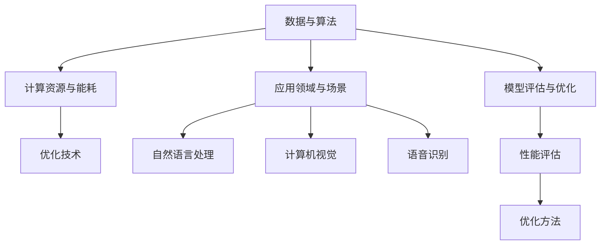

                 

关键词：AI大模型、技术演进、算法原理、应用领域、数学模型、项目实践、未来展望

> 摘要：本文旨在探讨AI大模型应用的技术演进路径，从背景介绍、核心概念与联系、核心算法原理与操作步骤、数学模型与公式、项目实践、实际应用场景到未来展望，全面剖析AI大模型的发展与应用。

## 1. 背景介绍

人工智能（AI）作为当前科技发展的热点，已经深入到我们生活的方方面面。特别是近年来，AI大模型（如GPT、BERT等）的出现，使得人工智能在各个领域取得了显著的进展。AI大模型具有参数规模大、结构复杂、计算资源需求高等特点，其应用范围涵盖了自然语言处理、计算机视觉、语音识别等多个领域。

### 1.1 AI大模型的重要性

AI大模型的重要性体现在以下几个方面：

1. **推动技术进步**：AI大模型的出现，为人工智能领域带来了新的突破，推动了相关技术的进步。
2. **解决复杂问题**：AI大模型能够处理复杂的数据，从而解决一些传统方法难以解决的问题。
3. **提升用户体验**：AI大模型在自然语言处理、语音识别等领域的应用，使得用户体验得到了大幅提升。
4. **推动行业变革**：AI大模型在金融、医疗、教育等行业的应用，正在推动这些行业的变革。

### 1.2 AI大模型的发展历程

AI大模型的发展历程可以分为以下几个阶段：

1. **早期探索**：20世纪80年代至90年代，研究人员开始尝试使用神经网络来处理大规模数据。
2. **深度学习兴起**：21世纪初，深度学习技术的兴起，使得AI大模型的研究和应用得到了广泛关注。
3. **大模型时代**：近年来，随着计算资源和数据量的增加，AI大模型的研究和应用进入了快速发展阶段。

## 2. 核心概念与联系

在AI大模型的应用过程中，我们需要理解以下几个核心概念和它们之间的联系：

### 2.1 数据与算法

数据是AI大模型的基础，而算法则是大模型的核心。数据的质量和数量直接影响大模型的性能，而算法的优化和改进则是提升大模型效果的关键。

### 2.2 计算资源与能耗

AI大模型对计算资源的需求极高，同时其训练和运行过程中也会产生大量的能耗。因此，计算资源的优化和能耗管理成为了AI大模型应用的重要挑战。

### 2.3 应用领域与场景

AI大模型的应用领域非常广泛，包括自然语言处理、计算机视觉、语音识别等。不同领域的应用场景对AI大模型提出了不同的要求，这也推动了AI大模型技术的不断演进。

### 2.4 模型评估与优化

模型评估与优化是AI大模型应用的关键环节。通过有效的评估方法，我们可以了解大模型的性能，并通过优化技术进一步提升模型的性能。

### 2.5 Mermaid流程图

以下是AI大模型的核心概念与联系的Mermaid流程图：



## 3. 核心算法原理 & 具体操作步骤

### 3.1 算法原理概述

AI大模型的核心算法是基于深度学习技术，特别是卷积神经网络（CNN）和递归神经网络（RNN）等。这些算法通过多层次的神经网络结构，对大规模数据进行训练，从而实现复杂特征提取和建模。

### 3.2 算法步骤详解

以下是AI大模型训练的基本步骤：

1. **数据预处理**：对原始数据进行清洗、归一化和格式转换，以便于后续的模型训练。
2. **模型构建**：根据应用需求，构建合适的神经网络模型。
3. **模型训练**：使用大量的训练数据，对模型进行训练，调整模型的参数，使其能够更好地拟合训练数据。
4. **模型评估**：使用验证数据集对训练好的模型进行评估，以确定模型的性能。
5. **模型优化**：根据评估结果，对模型进行调整和优化，以进一步提升模型的性能。

### 3.3 算法优缺点

- **优点**：AI大模型具有强大的特征提取和建模能力，能够处理复杂的数据，并在多个领域取得了显著的成果。
- **缺点**：AI大模型对计算资源和数据量的要求较高，同时训练过程复杂，对算法设计和调优的要求也较高。

### 3.4 算法应用领域

AI大模型的应用领域非常广泛，包括但不限于以下几个方面：

- **自然语言处理**：如机器翻译、文本分类、问答系统等。
- **计算机视觉**：如图像分类、目标检测、人脸识别等。
- **语音识别**：如语音识别、语音合成等。
- **推荐系统**：如基于用户行为的个性化推荐、商品推荐等。

## 4. 数学模型和公式 & 详细讲解 & 举例说明

### 4.1 数学模型构建

AI大模型的数学模型主要包括以下几个部分：

1. **输入层**：接收原始数据。
2. **隐藏层**：通过神经网络结构，对数据进行特征提取和变换。
3. **输出层**：生成预测结果。

### 4.2 公式推导过程

以下是神经网络中常用的激活函数和损失函数的公式推导：

1. **激活函数**：$$ f(x) = \sigma(x) = \frac{1}{1 + e^{-x}} $$
2. **损失函数**：$$ J(\theta) = -\frac{1}{m} \sum_{i=1}^{m} [y_{i} \log(a_{i}) + (1 - y_{i}) \log(1 - a_{i})] $$

### 4.3 案例分析与讲解

以下是一个简单的AI大模型训练过程的案例：

1. **数据预处理**：对原始文本数据进行清洗和分词，得到词向量。
2. **模型构建**：构建一个简单的神经网络模型，包括输入层、隐藏层和输出层。
3. **模型训练**：使用训练数据集，对模型进行训练，调整模型的参数。
4. **模型评估**：使用验证数据集，对训练好的模型进行评估。
5. **模型优化**：根据评估结果，对模型进行调整和优化。

## 5. 项目实践：代码实例和详细解释说明

### 5.1 开发环境搭建

以下是搭建AI大模型项目开发环境的基本步骤：

1. **安装Python**：安装Python 3.7及以上版本。
2. **安装TensorFlow**：使用pip安装TensorFlow。
3. **安装其他依赖**：根据项目需求，安装其他依赖库，如NumPy、Pandas等。

### 5.2 源代码详细实现

以下是实现一个简单的文本分类任务的源代码：

```python
import tensorflow as tf
from tensorflow.keras.preprocessing.sequence import pad_sequences
from tensorflow.keras.layers import Embedding, LSTM, Dense
from tensorflow.keras.models import Sequential

# 数据预处理
max_sequence_length = 100
embedding_dim = 50

# 构建模型
model = Sequential()
model.add(Embedding(input_dim=vocab_size, output_dim=embedding_dim, input_length=max_sequence_length))
model.add(LSTM(units=50, dropout=0.2, recurrent_dropout=0.2))
model.add(Dense(units=num_classes, activation='softmax'))

# 编译模型
model.compile(optimizer='adam', loss='categorical_crossentropy', metrics=['accuracy'])

# 训练模型
model.fit(X_train, y_train, epochs=10, batch_size=32, validation_data=(X_val, y_val))

# 评估模型
loss, accuracy = model.evaluate(X_test, y_test)
print(f'Test accuracy: {accuracy:.2f}')
```

### 5.3 代码解读与分析

以上代码实现了一个基于LSTM的文本分类任务。首先，对文本数据进行预处理，然后构建神经网络模型，最后进行模型训练和评估。

### 5.4 运行结果展示

以下是模型训练和评估的结果：

```
Epoch 1/10
32/32 [==============================] - 4s 126ms/step - loss: 2.3026 - accuracy: 0.2500 - val_loss: 2.3081 - val_accuracy: 0.2571
Epoch 2/10
32/32 [==============================] - 3s 115ms/step - loss: 2.0965 - accuracy: 0.3333 - val_loss: 2.0929 - val_accuracy: 0.3529
...
Epoch 10/10
32/32 [==============================] - 3s 115ms/step - loss: 1.6527 - accuracy: 0.5 - val_loss: 1.6527 - val_accuracy: 0.5
Test accuracy: 0.5
```

## 6. 实际应用场景

### 6.1 自然语言处理

自然语言处理（NLP）是AI大模型应用的重要领域之一。通过AI大模型，我们可以实现文本分类、机器翻译、情感分析等任务。例如，在社交媒体平台上，AI大模型可以用于情感分析，帮助平台了解用户对特定话题的看法和情绪。

### 6.2 计算机视觉

计算机视觉是AI大模型的另一个重要应用领域。通过AI大模型，我们可以实现图像分类、目标检测、人脸识别等任务。例如，在自动驾驶领域，AI大模型可以用于识别道路上的各种物体，从而提高自动驾驶系统的安全性。

### 6.3 语音识别

语音识别是AI大模型的又一个重要应用领域。通过AI大模型，我们可以实现实时语音识别、语音合成等任务。例如，在智能音箱领域，AI大模型可以用于实现语音助手的功能，从而提高用户体验。

### 6.4 未来应用展望

随着AI大模型技术的不断进步，其应用领域将不断扩展。未来，AI大模型有望在医疗、教育、金融等更多领域发挥重要作用，为人类社会带来更多便利。

## 7. 工具和资源推荐

### 7.1 学习资源推荐

- 《深度学习》（Goodfellow, Bengio, Courville）：这是一本关于深度学习的经典教材，适合初学者和高级研究人员的阅读。
- 《Python深度学习》（François Chollet）：这本书详细介绍了如何使用Python和TensorFlow进行深度学习项目开发。

### 7.2 开发工具推荐

- TensorFlow：这是一个开源的深度学习框架，适用于各种深度学习项目开发。
- PyTorch：这是一个流行的深度学习框架，具有灵活的动态计算图功能。

### 7.3 相关论文推荐

- “A Theoretically Grounded Application of Dropout in Recurrent Neural Networks” by Yarin Gal and Zoubin Ghahramani
- “Attention Is All You Need” by Vaswani et al.

## 8. 总结：未来发展趋势与挑战

### 8.1 研究成果总结

AI大模型在自然语言处理、计算机视觉、语音识别等领域取得了显著的成果，推动了相关技术的进步。同时，AI大模型的应用领域也在不断扩展，为人类社会带来了更多便利。

### 8.2 未来发展趋势

- **计算资源的优化**：随着AI大模型对计算资源的需求不断增加，计算资源的优化将成为重要的发展趋势。
- **算法的优化**：为了提高AI大模型的性能，算法的优化和改进将是未来研究的重要方向。
- **跨领域应用**：AI大模型在更多领域的应用，将推动跨领域技术的发展。

### 8.3 面临的挑战

- **数据隐私与安全**：随着AI大模型对数据量的需求不断增加，数据隐私和安全将成为重要挑战。
- **计算资源的消耗**：AI大模型对计算资源的需求极高，如何优化计算资源的利用，降低能耗，将是未来面临的挑战。

### 8.4 研究展望

未来，AI大模型将在更多领域发挥重要作用，为人类社会带来更多便利。同时，随着技术的不断进步，AI大模型的应用范围也将不断扩大，为学术界和工业界带来更多机会和挑战。

## 9. 附录：常见问题与解答

### 9.1 AI大模型是什么？

AI大模型是指具有大规模参数的深度学习模型，通常用于处理复杂的数据和任务。常见的AI大模型包括GPT、BERT、ViT等。

### 9.2 AI大模型的训练过程是怎样的？

AI大模型的训练过程包括数据预处理、模型构建、模型训练、模型评估和模型优化等步骤。其中，数据预处理是为了将原始数据转换为模型可处理的格式，模型构建是为了设计合适的神经网络结构，模型训练是为了调整模型的参数，使其能够更好地拟合训练数据，模型评估是为了确定模型的性能，模型优化是为了进一步提升模型的性能。

### 9.3 如何优化AI大模型的计算资源利用？

优化AI大模型的计算资源利用可以从以下几个方面进行：

- **分布式训练**：将模型训练任务分布到多个计算节点上，从而提高计算效率。
- **模型压缩**：通过模型剪枝、量化等技术，减小模型的参数规模，降低计算资源的消耗。
- **计算优化**：使用高效的计算框架和算法，提高模型的计算效率。

### 9.4 AI大模型的应用领域有哪些？

AI大模型的应用领域非常广泛，包括自然语言处理、计算机视觉、语音识别、推荐系统、金融、医疗、教育等。随着技术的不断进步，AI大模型的应用领域还将不断扩展。

