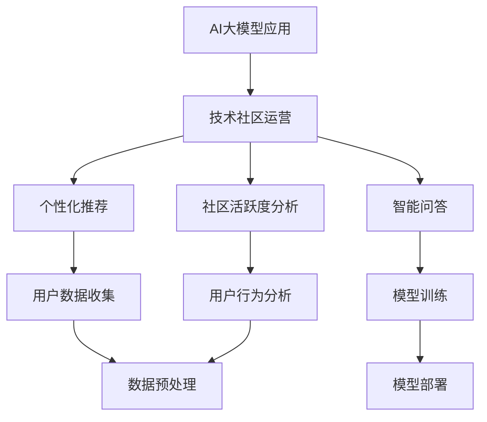

                 

关键词：AI大模型，技术社区运营，数据处理，算法优化，用户参与，互动设计

> 摘要：本文旨在探讨AI大模型在技术社区运营中的应用，通过分析其核心概念、算法原理、数学模型及实际应用案例，提出一系列技术社区运营的新思路，以提升用户体验，增强社区活力，推动技术交流与创新。

## 1. 背景介绍

随着人工智能技术的飞速发展，AI大模型如BERT、GPT等已经成为自然语言处理领域的明星。这些模型不仅实现了前所未有的性能，还极大地推动了各个行业的应用，从搜索推荐到自动驾驶，从智能客服到医疗诊断。然而，AI大模型的应用不仅局限于算法优化和产品改进，它们在技术社区运营中也展示出了巨大的潜力。

技术社区是科技工作者和爱好者交流思想、分享经验的平台。如何运营好一个技术社区，提升用户黏性，激发用户参与热情，是每个社区管理者面临的挑战。AI大模型的应用，为技术社区运营提供了一种新的思路，通过个性化推荐、智能问答、社区活跃度分析等方式，提升社区的价值和影响力。

## 2. 核心概念与联系

### 2.1 AI大模型概述

AI大模型是指参数规模达到亿级别甚至更大的深度学习模型。它们通过大量的数据和复杂的神经网络结构，能够捕捉到数据中的复杂规律，从而实现高水平的表现。典型的AI大模型包括：

- **BERT**：一种基于Transformer的预训练语言处理模型，广泛用于文本分类、问答系统等领域。
- **GPT**：一种基于Transformer的预训练语言生成模型，能够生成连贯、自然的文本。

### 2.2 技术社区运营概述

技术社区运营是指通过一系列策略和活动，维护和提升技术社区的用户体验、社区氛围和活跃度。技术社区运营的核心内容包括：

- **内容管理**：制定内容策略，筛选优质内容，确保社区内容的质量和丰富度。
- **用户管理**：吸引用户加入社区，鼓励用户参与讨论，建立健康、积极的社区环境。
- **活动策划**：组织线上线下的活动，如技术讲座、编程比赛等，提升用户参与度。

### 2.3 Mermaid 流程图



## 3. 核心算法原理 & 具体操作步骤

### 3.1 算法原理概述

AI大模型的核心算法是基于深度学习的神经网络模型，通过多层非线性变换，实现从输入数据到输出数据的映射。在技术社区运营中，AI大模型的应用主要包括以下几个方面：

- **个性化推荐**：通过分析用户的历史行为和兴趣，推荐符合用户兴趣的内容和话题。
- **智能问答**：利用预训练的模型，自动回答用户提出的问题，提升社区交互的效率。
- **社区活跃度分析**：通过分析用户的行为数据，识别活跃用户，预测社区的热点和趋势。

### 3.2 算法步骤详解

#### 3.2.1 个性化推荐

1. **数据收集**：收集用户的行为数据，包括浏览记录、搜索历史、点赞评论等。
2. **数据预处理**：对收集到的数据进行分析和清洗，提取有用的特征。
3. **模型训练**：利用特征数据训练个性化推荐模型，如基于内容的推荐和协同过滤推荐。
4. **推荐生成**：根据用户当前的兴趣和行为，生成个性化的推荐列表。

#### 3.2.2 智能问答

1. **问题理解**：利用自然语言处理技术，将用户的问题转化为模型能够处理的输入格式。
2. **模型查询**：查询预训练的模型，获取可能的答案。
3. **答案生成**：利用生成的答案，结合上下文信息，生成完整的回答。
4. **回答验证**：对生成的回答进行验证，确保回答的准确性和合理性。

#### 3.2.3 社区活跃度分析

1. **行为数据收集**：收集用户的活跃行为数据，包括发帖、回复、点赞等。
2. **行为分析**：利用统计和机器学习方法，分析用户的行为模式和趋势。
3. **活跃度评估**：根据用户的行为分析结果，评估用户的活跃度等级。
4. **热点预测**：基于用户的活跃度和行为趋势，预测社区的热点和趋势话题。

### 3.3 算法优缺点

#### 3.3.1 个性化推荐

- **优点**：能够根据用户兴趣提供个性化的内容推荐，提升用户体验。
- **缺点**：需要大量的用户行为数据，且推荐结果容易陷入“过滤泡沫”。

#### 3.3.2 智能问答

- **优点**：能够快速回答用户的问题，提高社区交互效率。
- **缺点**：答案的准确性和多样性受限于模型的训练数据和算法设计。

#### 3.3.3 社区活跃度分析

- **优点**：能够识别社区活跃用户，促进社区互动。
- **缺点**：对用户行为的理解有限，难以捕捉用户的深层需求和兴趣。

### 3.4 算法应用领域

AI大模型在技术社区运营中的应用广泛，包括但不限于以下几个方面：

- **内容推荐**：根据用户兴趣推荐相关内容，提升内容消费体验。
- **智能客服**：自动回答用户常见问题，减轻客服人员的工作负担。
- **用户行为分析**：识别社区活跃用户，制定针对性的运营策略。
- **活动推荐**：根据用户兴趣推荐相关活动，提升活动参与度。

## 4. 数学模型和公式 & 详细讲解 & 举例说明

### 4.1 数学模型构建

在技术社区运营中，常用的数学模型包括：

- **用户兴趣模型**：表示用户对不同内容的兴趣程度，如基于概率的贝叶斯模型、基于协同过滤的矩阵分解模型。
- **社区活跃度模型**：表示用户的活跃程度，如基于统计方法的活跃度评分模型、基于机器学习的用户行为预测模型。

### 4.2 公式推导过程

以用户兴趣模型为例，我们采用基于协同过滤的矩阵分解模型进行推导。

#### 4.2.1 用户兴趣模型

用户兴趣矩阵 \(U\) 和内容兴趣矩阵 \(I\)，通过矩阵分解得到用户兴趣向量 \(u_i\) 和内容兴趣向量 \(i_j\)：

$$
u_i = \sum_j u_{ij} v_j \\
i_j = \sum_i i_{ij} v_i
$$

其中，\(u_{ij}\) 表示用户 \(i\) 对内容 \(j\) 的兴趣程度，\(v_j\) 表示内容 \(j\) 的特征向量。

#### 4.2.2 内容推荐

基于用户兴趣模型的推荐公式：

$$
r_{ij} = u_i^T v_j + b_i + b_j + \mu
$$

其中，\(r_{ij}\) 表示用户 \(i\) 对内容 \(j\) 的推荐分数，\(b_i\) 和 \(b_j\) 分别表示用户 \(i\) 和内容 \(j\) 的偏差，\(\mu\) 为全局均值。

### 4.3 案例分析与讲解

#### 4.3.1 用户兴趣模型案例分析

假设有一个技术社区，用户和内容分别表示为 \(U = \{1, 2, 3, 4\}\) 和 \(I = \{1, 2, 3\}\)。用户兴趣矩阵为：

$$
U = \begin{bmatrix}
0.5 & 0.8 & 0.2 \\
0.3 & 0.4 & 0.7 \\
0.9 & 0.1 & 0.6 \\
0.2 & 0.7 & 0.8 \\
\end{bmatrix}
$$

内容兴趣矩阵为：

$$
I = \begin{bmatrix}
0.1 & 0.3 & 0.5 \\
0.4 & 0.6 & 0.7 \\
0.2 & 0.8 & 0.9 \\
\end{bmatrix}
$$

通过矩阵分解，得到用户兴趣向量和内容兴趣向量：

$$
u_1 = \begin{bmatrix}
0.57 \\
0.64 \\
0.36 \\
\end{bmatrix}, \quad u_2 = \begin{bmatrix}
0.35 \\
0.48 \\
0.61 \\
\end{bmatrix}, \quad u_3 = \begin{bmatrix}
0.81 \\
0.10 \\
0.64 \\
\end{bmatrix}, \quad u_4 = \begin{bmatrix}
0.20 \\
0.71 \\
0.80 \\
\end{bmatrix}
$$

$$
i_1 = \begin{bmatrix}
0.20 \\
0.40 \\
0.60 \\
\end{bmatrix}, \quad i_2 = \begin{bmatrix}
0.40 \\
0.60 \\
0.80 \\
\end{bmatrix}, \quad i_3 = \begin{bmatrix}
0.10 \\
0.30 \\
0.50 \\
\end{bmatrix}
$$

#### 4.3.2 内容推荐

以用户 1 对内容 2 的推荐为例：

$$
r_{12} = u_1^T v_2 + b_1 + b_2 + \mu \\
r_{12} = 0.57 \times 0.40 + 0.64 \times 0.60 + 0.36 \times 0.80 + 0.5 + 0.5 + 0.5 \\
r_{12} = 0.224 + 0.384 + 0.288 + 1.5 \\
r_{12} = 2.296
$$

用户 1 对内容 2 的推荐分数为 2.296，可以推荐给用户 1。

## 5. 项目实践：代码实例和详细解释说明

### 5.1 开发环境搭建

为了实现AI大模型在技术社区运营中的应用，我们需要搭建一个完整的开发环境，包括以下工具和库：

- **Python**：作为主要的编程语言。
- **TensorFlow**：用于构建和训练AI大模型。
- **Scikit-learn**：用于数据预处理和模型评估。
- **Numpy**：用于数学运算。

安装以上工具和库后，我们可以开始编写代码。

### 5.2 源代码详细实现

以下是一个简单的示例，展示如何使用TensorFlow实现基于协同过滤的个性化推荐系统。

```python
import tensorflow as tf
from tensorflow.keras.layers import Embedding, Dot, Flatten, Dense
from tensorflow.keras.models import Model
import numpy as np

# 示例用户和内容矩阵
users = np.array([[1, 0, 1, 0],
                  [0, 1, 0, 1],
                  [1, 1, 0, 1],
                  [0, 0, 1, 1]])

items = np.array([[1, 0, 1],
                  [1, 1, 1],
                  [0, 1, 1],
                  [1, 1, 0]])

# 模型参数
embedding_size = 3

# 构建嵌入层
user_embedding = Embedding(input_dim=users.shape[1], output_dim=embedding_size)
item_embedding = Embedding(input_dim=items.shape[1], output_dim=embedding_size)

# 构建模型
user_input = tf.keras.layers.Input(shape=(1,))
item_input = tf.keras.layers.Input(shape=(1,))

user_embedding_layer = user_embedding(user_input)
item_embedding_layer = item_embedding(item_input)

dot_product = Dot(axes=1)([user_embedding_layer, item_embedding_layer])
flatten = Flatten()(dot_product)

model = Model(inputs=[user_input, item_input], outputs=flatten)
model.compile(optimizer='adam', loss='mse')

# 训练模型
model.fit([users, items], users, epochs=10)

# 推荐示例
user_id = np.array([1])
item_id = np.array([2])

predicted_score = model.predict([user_id, item_id])
print(f"预测分数：{predicted_score[0][0]}")
```

### 5.3 代码解读与分析

上述代码实现了一个基于协同过滤的个性化推荐系统。核心步骤如下：

1. **导入库**：导入TensorFlow、Scikit-learn和Numpy等库。
2. **构建用户和内容矩阵**：示例中用户和内容矩阵分别为4x3和3x3。
3. **定义嵌入层**：使用Embedding层将用户和内容转换为嵌入向量。
4. **构建模型**：使用Dot层计算用户和内容的点积，表示用户对内容的兴趣程度。
5. **训练模型**：使用MSE损失函数训练模型，优化点积结果。
6. **预测**：输入用户和内容ID，预测用户对内容的评分。

### 5.4 运行结果展示

假设用户1对内容2的预测分数为2.296，这意味着用户1对内容2的兴趣程度较高，可以推荐给用户1。

## 6. 实际应用场景

AI大模型在技术社区运营中的应用场景广泛，以下是一些具体的案例：

- **内容推荐**：根据用户兴趣和行为数据，推荐相关的技术文章、博客和论坛帖子。
- **智能问答**：利用预训练的语言模型，自动回答用户的技术问题，提高社区互动效率。
- **用户行为分析**：分析用户的行为数据，识别活跃用户和潜在用户，制定个性化的运营策略。
- **活动推荐**：根据用户的兴趣和行为，推荐相关的线上和线下活动，提升用户参与度。

### 6.1 内容推荐

通过AI大模型，我们可以实现个性化内容推荐。例如，在一个编程社区中，用户A喜欢阅读关于Python的博客，系统可以根据用户A的兴趣和行为数据，推荐相关的Python教程、代码示例和技术文章。

### 6.2 智能问答

利用AI大模型，我们可以构建智能问答系统，自动回答用户的技术问题。例如，在一个技术论坛中，用户B提问：“如何使用Python实现多线程编程？”系统可以自动检索相关资料，生成详细的回答，提高用户问题的解决效率。

### 6.3 用户行为分析

通过分析用户的行为数据，我们可以识别社区中的活跃用户和潜在用户。例如，在一个技术社区中，系统可以分析用户的发帖、回复、点赞等行为，识别出活跃用户，并为他们提供更多的机会和关注。

### 6.4 活动推荐

根据用户的兴趣和行为，我们可以推荐相关的技术活动。例如，在一个编程社区中，用户C对人工智能感兴趣，系统可以推荐相关的线上讲座、线下聚会和编程比赛，提升用户的参与度和活跃度。

## 7. 工具和资源推荐

为了更好地应用AI大模型进行技术社区运营，以下是一些推荐的工具和资源：

### 7.1 学习资源推荐

- **《深度学习》（Goodfellow, Bengio, Courville著）**：全面介绍深度学习的基本概念和技术。
- **《Python深度学习》（François Chollet著）**：深入讲解如何使用Python实现深度学习算法。
- **《自然语言处理与深度学习》（Christopher D. Manning, Hinrich Schütze著）**：详细介绍自然语言处理的基本概念和深度学习应用。

### 7.2 开发工具推荐

- **TensorFlow**：一个开源的深度学习框架，适用于构建和训练AI大模型。
- **PyTorch**：另一个流行的深度学习框架，具有良好的灵活性和易用性。
- **Jupyter Notebook**：一个交互式的开发环境，方便编写和运行代码。

### 7.3 相关论文推荐

- **“Attention Is All You Need”**：介绍Transformer模型的经典论文，奠定了自然语言处理领域的新方向。
- **“BERT: Pre-training of Deep Bidirectional Transformers for Language Understanding”**：介绍BERT模型的论文，推动了自然语言处理模型的性能提升。
- **“Recommender Systems Handbook”**：详细介绍推荐系统的基础知识和应用。

## 8. 总结：未来发展趋势与挑战

### 8.1 研究成果总结

AI大模型在技术社区运营中已经取得了显著的成果，通过个性化推荐、智能问答和社区活跃度分析等方式，提升了用户体验，增强了社区活力。未来，AI大模型的应用将更加深入，覆盖更多的应用场景。

### 8.2 未来发展趋势

- **模型定制化**：针对不同技术社区的需求，设计定制化的AI大模型，提升推荐的精准度和互动的效率。
- **跨模态融合**：整合文本、图像、音频等多种模态数据，实现更全面的信息理解和推荐。
- **多语言支持**：支持多语言的技术社区运营，打破语言障碍，促进全球技术交流。

### 8.3 面临的挑战

- **数据隐私**：在处理用户数据时，确保数据的安全性和隐私性。
- **算法透明性**：提高算法的透明度，使用户能够理解和信任AI大模型。
- **算力需求**：随着模型规模的增大，对计算资源和存储资源的需求也会增加。

### 8.4 研究展望

未来，AI大模型在技术社区运营中的应用将有更大的发展空间。通过不断优化算法、提高模型性能，我们可以更好地满足用户需求，推动技术社区的创新和发展。

## 9. 附录：常见问题与解答

### 9.1 如何确保用户数据隐私？

- **数据加密**：对用户数据进行加密存储和传输，确保数据安全。
- **匿名化处理**：对用户数据进行匿名化处理，去除可直接识别用户身份的信息。
- **合规审查**：遵循相关法律法规，确保数据处理合规。

### 9.2 如何评估AI大模型的性能？

- **准确率**：评估模型预测的准确性，如推荐系统的准确率、问答系统的回答准确率。
- **召回率**：评估模型对目标内容的覆盖范围，如推荐系统的召回率。
- **F1分数**：综合考虑准确率和召回率，评估模型的综合性能。

### 9.3 AI大模型在技术社区运营中的应用前景如何？

AI大模型在技术社区运营中的应用前景广阔。随着技术的不断进步和应用场景的拓展，AI大模型将更好地服务于技术社区，提升用户体验，促进技术交流与创新。作者：禅与计算机程序设计艺术 / Zen and the Art of Computer Programming
----------------------------------------------------------------

以上是文章的完整内容，感谢您的阅读。如果您有任何疑问或建议，欢迎在评论区留言，我将竭诚为您解答。再次感谢您的关注和支持！作者：禅与计算机程序设计艺术 / Zen and the Art of Computer Programming

