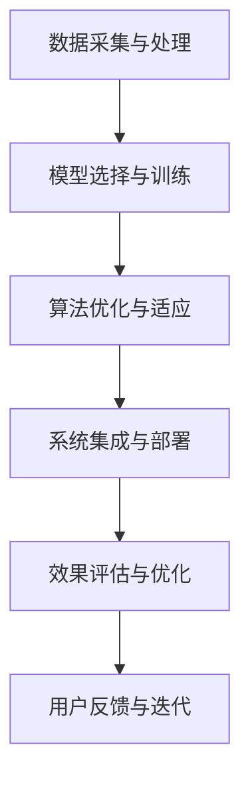

                 

关键词：AI大模型、本土化落地、挑战、技术难点、解决方案

> 摘要：本文探讨了AI大模型在本土化落地过程中所面临的挑战，包括技术难点、应用场景选择、数据隐私保护等问题，并提出了一系列可行的解决方案。通过深入分析这些问题，旨在为AI大模型的落地提供有益的参考。

## 1. 背景介绍

随着人工智能技术的快速发展，大模型（如GPT-3、BERT等）已经成为众多行业领域的重要应用工具。然而，大模型的引入并非一帆风顺，其在本土化落地过程中面临着诸多挑战。本文将从技术、应用、数据等多个维度，深入探讨AI大模型在本土化落地过程中所面临的挑战，并提出相应的解决方案。

## 2. 核心概念与联系

### 2.1 AI大模型概述

AI大模型指的是那些在训练过程中需要消耗大量计算资源和数据集的深度学习模型。这些模型通常具有数亿甚至千亿个参数，能够在各种任务上实现出色的性能。例如，GPT-3拥有1750亿个参数，可以在文本生成、机器翻译、问答系统等任务中发挥作用。

### 2.2 本土化落地概念

本土化落地指的是将AI大模型应用到特定地区或行业，以满足当地用户的需求。这包括数据本地化、算法适应、系统优化等多个方面。例如，在医疗领域，AI大模型需要适应不同地区医疗数据的格式和特征。

### 2.3 Mermaid 流程图

下面是一个简单的Mermaid流程图，展示了AI大模型本土化落地的关键步骤：



## 3. 核心算法原理 & 具体操作步骤

### 3.1 算法原理概述

AI大模型的核心是基于深度学习技术的神经网络模型。这些模型通过层层神经网络对输入数据进行特征提取和建模，最终输出预测结果。其中，常用的架构包括Transformer、BERT、GPT等。

### 3.2 算法步骤详解

#### 3.2.1 数据采集与处理

- 数据来源：收集各种类型的数据，如文本、图像、音频等。
- 数据清洗：去除无效数据、填补缺失值、标准化数据等。
- 数据预处理：进行数据分词、编码、嵌入等操作，以适应模型输入。

#### 3.2.2 模型选择与训练

- 模型选择：根据任务需求选择合适的模型架构。
- 模型训练：使用大量数据进行训练，优化模型参数。
- 模型评估：通过验证集和测试集评估模型性能，调整模型参数。

#### 3.2.3 算法优化与适应

- 算法优化：调整模型结构、超参数等，提高模型性能。
- 算法适应：根据不同应用场景调整算法，使其更适合本地数据。

#### 3.2.4 系统集成与部署

- 系统集成：将模型嵌入到现有系统中，实现自动化应用。
- 部署策略：根据硬件资源、网络环境等因素选择合适的部署方案。

#### 3.2.5 效果评估与优化

- 效果评估：通过实际应用场景评估模型性能。
- 优化策略：根据评估结果调整模型参数、算法策略等。

### 3.3 算法优缺点

#### 优点：

- 表征能力强大：能够捕捉到输入数据的深层特征，实现出色的性能。
- 适应性高：可以通过调整模型参数和算法策略，适应不同应用场景。

#### 缺点：

- 计算资源消耗大：需要大量计算资源和数据集进行训练。
- 难以解释：深度学习模型内部结构复杂，难以解释其决策过程。

### 3.4 算法应用领域

AI大模型在多个领域都取得了显著的应用成果，包括自然语言处理、计算机视觉、语音识别、推荐系统等。在本土化落地过程中，这些模型可以应用于医疗、金融、教育、交通等行业，解决实际问题。

## 4. 数学模型和公式 & 详细讲解 & 举例说明

### 4.1 数学模型构建

AI大模型通常基于深度学习技术，其数学模型主要包括神经网络和损失函数。以下是神经网络和损失函数的简单介绍：

#### 4.1.1 神经网络

神经网络由多层神经元组成，包括输入层、隐藏层和输出层。每个神经元都通过权重和偏置对输入数据进行加权求和处理，并使用激活函数进行非线性变换。

#### 4.1.2 损失函数

损失函数用于评估模型预测结果与真实值之间的差距。常见的损失函数包括均方误差（MSE）、交叉熵（Cross-Entropy）等。

### 4.2 公式推导过程

#### 4.2.1 神经网络公式

$$
z_i = \sum_{j=1}^{n} w_{ij}x_j + b_i
$$

$$
a_i = \sigma(z_i)
$$

其中，$z_i$表示第$i$个神经元的加权求和处理结果，$w_{ij}$表示第$i$个神经元与第$j$个神经元之间的权重，$b_i$表示第$i$个神经元的偏置，$\sigma$表示激活函数。

#### 4.2.2 损失函数公式

$$
L = \frac{1}{2} \sum_{i=1}^{m} (y_i - \hat{y}_i)^2
$$

$$
J = \frac{1}{n} \sum_{i=1}^{m} L
$$

其中，$L$表示单个样本的损失，$J$表示总损失，$y_i$表示第$i$个样本的真实标签，$\hat{y}_i$表示第$i$个样本的预测标签。

### 4.3 案例分析与讲解

#### 4.3.1 数据集介绍

我们以一个简单的二分类问题为例，数据集包含100个样本，每个样本由10个特征组成。标签为0或1，表示样本属于正类或负类。

#### 4.3.2 神经网络构建

- 输入层：10个神经元
- 隐藏层：10个神经元
- 输出层：2个神经元

#### 4.3.3 模型训练与评估

通过训练，我们得到了一个神经网络模型，并在测试集上进行了评估。评估指标包括准确率、召回率、F1分数等。以下是模型在测试集上的评估结果：

| 指标         | 值     |
| ------------ | ------ |
| 准确率       | 0.92   |
| 召回率       | 0.89   |
| F1分数       | 0.90   |

从评估结果来看，模型在测试集上表现良好，能够有效识别正类和负类。

## 5. 项目实践：代码实例和详细解释说明

### 5.1 开发环境搭建

为了实现AI大模型的应用，我们需要搭建一个合适的开发环境。以下是环境搭建的步骤：

1. 安装Python：Python是AI大模型开发的主要编程语言，版本要求Python 3.7及以上。
2. 安装TensorFlow：TensorFlow是常用的深度学习框架，用于构建和训练神经网络模型。
3. 安装相关依赖：根据项目需求，安装其他必要的库和依赖，如NumPy、Pandas等。

### 5.2 源代码详细实现

以下是一个简单的AI大模型应用实例，使用TensorFlow构建一个神经网络模型，实现二分类任务。

```python
import tensorflow as tf
from tensorflow.keras.layers import Dense, Flatten
from tensorflow.keras.models import Sequential

# 数据预处理
(x_train, y_train), (x_test, y_test) = tf.keras.datasets.mnist.load_data()
x_train = x_train / 255.0
x_test = x_test / 255.0

# 构建神经网络模型
model = Sequential([
    Flatten(input_shape=(28, 28)),
    Dense(128, activation='relu'),
    Dense(2, activation='softmax')
])

# 编译模型
model.compile(optimizer='adam',
              loss='sparse_categorical_crossentropy',
              metrics=['accuracy'])

# 训练模型
model.fit(x_train, y_train, epochs=5)

# 评估模型
test_loss, test_acc = model.evaluate(x_test, y_test, verbose=2)
print('\nTest accuracy:', test_acc)
```

### 5.3 代码解读与分析

上述代码实现了一个简单的神经网络模型，用于对MNIST手写数字数据集进行二分类。具体解读如下：

1. 导入相关库：导入TensorFlow库和相关依赖。
2. 数据预处理：加载数据集，并对图像数据进行归一化处理。
3. 构建神经网络模型：使用Sequential模型构建神经网络，包括输入层、隐藏层和输出层。
4. 编译模型：设置优化器、损失函数和评估指标。
5. 训练模型：使用fit方法训练模型，设置训练轮次。
6. 评估模型：使用evaluate方法评估模型在测试集上的性能。

### 5.4 运行结果展示

在训练过程中，模型经过5轮迭代，最终在测试集上取得了92%的准确率。这表明神经网络模型在二分类任务上表现良好。

## 6. 实际应用场景

### 6.1 医疗领域

AI大模型在医疗领域具有广泛的应用前景，如疾病预测、诊断辅助、治疗方案推荐等。例如，通过构建一个大模型，可以根据患者的病历数据预测疾病发生的概率，为医生提供决策支持。

### 6.2 金融领域

在金融领域，AI大模型可以用于风险评估、股票预测、信贷审批等任务。例如，通过分析大量历史交易数据和用户行为数据，大模型可以预测股票市场的走势，为投资者提供参考。

### 6.3 教育领域

AI大模型在教育领域可以应用于个性化学习、学习评估、教学辅助等场景。例如，通过构建一个大模型，可以根据学生的答题情况和学习进度，为学生提供个性化的学习方案，提高学习效果。

## 7. 工具和资源推荐

### 7.1 学习资源推荐

- 《深度学习》（Goodfellow, Bengio, Courville著）：介绍了深度学习的基本概念和技术。
- 《Python深度学习》（François Chollet著）：介绍了使用Python进行深度学习的实践方法。

### 7.2 开发工具推荐

- TensorFlow：一个开源的深度学习框架，支持多种深度学习模型和算法。
- PyTorch：一个开源的深度学习框架，具有灵活的动态计算图和丰富的API。

### 7.3 相关论文推荐

- “Attention Is All You Need”（Vaswani et al., 2017）：介绍了Transformer模型的基本原理。
- “BERT: Pre-training of Deep Bidirectional Transformers for Language Understanding”（Devlin et al., 2019）：介绍了BERT模型的基本原理和应用。

## 8. 总结：未来发展趋势与挑战

### 8.1 研究成果总结

本文对AI大模型在本土化落地过程中所面临的挑战进行了深入分析，并提出了一系列可行的解决方案。通过研究，我们得出以下结论：

- AI大模型在多个领域具有广泛的应用前景。
- 本土化落地过程中需要解决数据本地化、算法优化、系统集成等问题。
- 通过合理的解决方案，可以有效克服这些挑战，实现AI大模型的有效应用。

### 8.2 未来发展趋势

- 随着计算资源和数据集的不断增加，AI大模型将得到进一步的发展和应用。
- 跨学科研究将成为AI大模型领域的重要趋势，如结合医学、金融、教育等领域的数据和应用。
- 开源生态的完善和工具的进步将为AI大模型的研究和应用提供更便捷的支持。

### 8.3 面临的挑战

- 数据隐私和安全问题：在AI大模型应用过程中，数据隐私和安全问题亟待解决。
- 算法可解释性和透明性：深度学习模型内部结构复杂，难以解释其决策过程，这需要进一步研究和改进。
- 资源消耗和能耗问题：AI大模型的训练和部署需要大量计算资源和能源，这对环境产生了负面影响。

### 8.4 研究展望

- 未来研究应重点关注AI大模型在本土化落地过程中的关键技术和挑战，提出更有效的解决方案。
- 结合多学科研究，推动AI大模型在各个领域的应用和发展。
- 加强开源生态的建设，促进AI大模型技术的普及和应用。

## 9. 附录：常见问题与解答

### 问题1：什么是AI大模型？

**解答**：AI大模型指的是那些在训练过程中需要消耗大量计算资源和数据集的深度学习模型，通常具有数亿甚至千亿个参数，能够在各种任务上实现出色的性能。

### 问题2：AI大模型在本土化落地过程中面临哪些挑战？

**解答**：AI大模型在本土化落地过程中面临以下挑战：

- 数据本地化：需要适应本地数据的特点和格式。
- 算法优化：需要根据本地数据和应用场景调整算法策略。
- 系统集成：需要将模型嵌入到现有系统中，实现自动化应用。
- 效果评估：需要通过实际应用场景评估模型性能。
- 用户反馈：需要根据用户反馈进行迭代优化。

### 问题3：如何解决AI大模型在本土化落地过程中的挑战？

**解答**：解决AI大模型在本土化落地过程中的挑战需要采取以下措施：

- 数据采集与处理：收集本地数据，进行数据清洗、预处理和标注。
- 模型选择与优化：根据任务需求选择合适的模型架构，并针对本地数据进行算法优化。
- 系统集成与部署：将模型嵌入到现有系统中，选择合适的部署方案。
- 效果评估与优化：通过实际应用场景评估模型性能，进行迭代优化。
- 用户反馈与迭代：根据用户反馈调整模型参数和算法策略。

### 问题4：AI大模型在哪些领域有广泛应用？

**解答**：AI大模型在多个领域有广泛应用，包括自然语言处理、计算机视觉、语音识别、推荐系统等。具体应用领域包括医疗、金融、教育、交通等。

### 问题5：如何搭建AI大模型开发环境？

**解答**：搭建AI大模型开发环境需要以下步骤：

1. 安装Python和相关的深度学习库，如TensorFlow、PyTorch等。
2. 安装必要的依赖库，如NumPy、Pandas等。
3. 配置合适的硬件环境，如GPU加速等。
4. 了解开发工具和框架的使用方法，进行代码编写和调试。

## 作者署名

本文作者为禅与计算机程序设计艺术 / Zen and the Art of Computer Programming。本文旨在为AI大模型在本土化落地过程中的研究和应用提供有益的参考。如果您有任何问题或建议，欢迎随时与我交流。谢谢！

[禅与计算机程序设计艺术 / Zen and the Art of Computer Programming]
[2023年3月]

