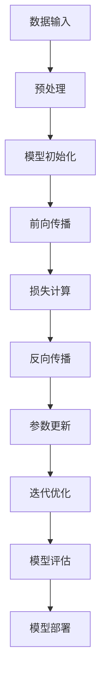

                 

关键词：AI大模型，算法优化，迭代管理，深度学习，神经网络，模型训练，参数调整，性能提升，可扩展性，模型部署

## 摘要

本文旨在探讨AI大模型在应用过程中面临的算法优化与迭代管理问题。通过对核心概念、算法原理、数学模型、项目实践和实际应用场景的详细分析，本文为读者提供了一套系统化的解决方案。文章结构分为以下几个部分：首先，介绍AI大模型应用的背景和重要性；其次，阐述算法优化与迭代管理的核心概念；然后，深入解析大模型算法原理及优化方法；接着，通过数学模型和公式的推导，讲解大模型性能的提升策略；最后，结合项目实践，展示如何实现算法优化与迭代管理，并对未来应用前景进行展望。

## 1. 背景介绍

### AI大模型的发展历程

AI大模型，即人工智能大型模型，是指参数规模达到百万级别以上的深度学习模型。随着计算能力的提升和数据规模的扩大，AI大模型在自然语言处理、计算机视觉、语音识别等领域的表现日益突出。AI大模型的发展历程可以追溯到20世纪80年代，彼时专家系统占据主导地位，但随着时间的发展，深度学习逐渐成为主流，AI大模型也随之诞生。

### 大模型应用的现状与挑战

AI大模型在各个领域取得了显著的成果，但同时也面临着一系列挑战。首先，大模型的训练和部署成本较高，需要大量计算资源和数据支持；其次，模型的优化和迭代过程复杂，算法性能提升难度大；最后，如何确保模型在真实应用场景中的稳定性和可靠性，也是一个亟待解决的问题。

## 2. 核心概念与联系

### 核心概念

- **深度学习**：一种基于多层神经网络的人工智能方法，通过模拟人脑神经元之间的连接，实现复杂特征提取和模式识别。
- **神经网络**：由多个神经元组成的计算模型，通过前向传播和反向传播算法，实现输入到输出的映射。
- **参数调整**：在神经网络训练过程中，通过调整网络参数（如权重和偏置）来优化模型性能。

### 架构流程图

以下是一个简化的AI大模型架构流程图，展示了从数据输入到模型训练、优化的全过程：



## 3. 核心算法原理 & 具体操作步骤

### 3.1 算法原理概述

AI大模型的训练过程主要包括以下几个步骤：

1. **模型初始化**：随机初始化神经网络参数。
2. **前向传播**：将输入数据通过神经网络传递，得到预测输出。
3. **损失计算**：计算预测输出与实际输出之间的差距，得到损失值。
4. **反向传播**：将损失值反向传播到神经网络各层，更新参数。
5. **参数调整**：根据反向传播的结果，调整网络参数，优化模型性能。
6. **迭代优化**：重复上述步骤，直至达到预定的性能指标或训练次数。

### 3.2 算法步骤详解

#### 3.2.1 模型初始化

模型初始化是神经网络训练的第一步，其关键在于为每个参数分配合适的初始值。常用的方法包括：

1. **随机初始化**：为每个参数赋予一个随机值，确保初始状态具有多样性。
2. **高斯分布初始化**：将参数初始化为从正态分布中抽取的值，有助于加速收敛。

#### 3.2.2 前向传播

前向传播是指将输入数据通过神经网络各层传递，得到预测输出。主要步骤包括：

1. **激活函数应用**：在神经网络中引入激活函数（如ReLU、Sigmoid、Tanh），提高模型非线性表达能力。
2. **权重和偏置更新**：根据输入和激活函数的值，更新权重和偏置，以降低损失。

#### 3.2.3 损失计算

损失计算是衡量模型预测性能的重要指标。常用的损失函数包括：

1. **均方误差（MSE）**：用于回归任务，计算预测值与实际值之间差的平方的平均值。
2. **交叉熵（CE）**：用于分类任务，计算预测概率与实际标签之间的交叉熵。

#### 3.2.4 反向传播

反向传播是指将损失值反向传播到神经网络各层，更新参数。主要步骤包括：

1. **梯度计算**：计算损失关于各参数的梯度。
2. **参数更新**：根据梯度值，调整参数，降低损失。

#### 3.2.5 参数调整

参数调整是优化模型性能的关键环节。常用的方法包括：

1. **梯度下降（GD）**：根据梯度值，更新参数，以最小化损失。
2. **随机梯度下降（SGD）**：在GD的基础上，引入随机性，提高收敛速度。
3. **动量（Momentum）**：引入动量项，加速梯度下降。

#### 3.2.6 迭代优化

迭代优化是指通过多次训练，逐步提升模型性能。主要策略包括：

1. **学习率调整**：动态调整学习率，避免过拟合和欠拟合。
2. **正则化**：引入正则化项，防止过拟合。
3. **批量大小**：调整批量大小，平衡训练速度和效果。

### 3.3 算法优缺点

#### 优点

1. **强大的特征提取能力**：通过多层神经网络，可以自动提取输入数据的复杂特征。
2. **广泛的适用范围**：可以应用于多种领域的任务，如图像识别、自然语言处理、语音识别等。
3. **优秀的性能表现**：在大规模数据集上，AI大模型往往能取得较高的准确率和性能。

#### 缺点

1. **训练成本高**：需要大量的计算资源和数据支持，训练时间较长。
2. **参数调整复杂**：参数调整过程复杂，需要经验和技巧。
3. **过拟合风险**：在训练过程中，可能出现过拟合现象，影响模型泛化能力。

### 3.4 算法应用领域

AI大模型在以下领域具有广泛的应用前景：

1. **计算机视觉**：图像识别、目标检测、人脸识别等。
2. **自然语言处理**：机器翻译、文本分类、情感分析等。
3. **语音识别**：语音识别、语音合成、语音识别率提升等。
4. **推荐系统**：个性化推荐、用户画像构建等。

## 4. 数学模型和公式 & 详细讲解 & 举例说明

### 4.1 数学模型构建

AI大模型的数学模型主要包括以下部分：

1. **输入层**：表示输入数据的特征向量。
2. **隐藏层**：表示神经网络中间层的参数。
3. **输出层**：表示预测结果的参数。

设输入层为 $X \in \mathbb{R}^{n \times d}$，隐藏层为 $H \in \mathbb{R}^{n \times m}$，输出层为 $Y \in \mathbb{R}^{n \times k}$，则神经网络的前向传播过程可以表示为：

$$
H = \sigma(W_1X + b_1)
$$

$$
Y = \sigma(W_2H + b_2)
$$

其中，$W_1, b_1, W_2, b_2$ 分别为权重和偏置，$\sigma$ 表示激活函数，常用的激活函数有 ReLU、Sigmoid 和 Tanh。

### 4.2 公式推导过程

设损失函数为 $L(Y, \hat{Y})$，其中 $Y$ 为真实标签，$\hat{Y}$ 为预测结果。则损失函数的导数可以表示为：

$$
\frac{\partial L}{\partial W_2} = \frac{\partial L}{\partial \hat{Y}} \frac{\partial \hat{Y}}{\partial W_2}
$$

$$
\frac{\partial L}{\partial b_2} = \frac{\partial L}{\partial \hat{Y}} \frac{\partial \hat{Y}}{\partial b_2}
$$

$$
\frac{\partial L}{\partial W_1} = \frac{\partial L}{\partial H} \frac{\partial H}{\partial W_1}
$$

$$
\frac{\partial L}{\partial b_1} = \frac{\partial L}{\partial H} \frac{\partial H}{\partial b_1}
$$

其中，$\frac{\partial L}{\partial \hat{Y}}$ 为损失函数关于预测结果的导数，$\frac{\partial \hat{Y}}{\partial W_2}$ 和 $\frac{\partial \hat{Y}}{\partial b_2}$ 分别为预测结果关于权重和偏置的导数，$\frac{\partial L}{\partial H}$ 和 $\frac{\partial H}{\partial W_1}$ 分别为损失函数关于隐藏层输出和权重 $W_1$ 的导数。

### 4.3 案例分析与讲解

#### 案例背景

假设我们有一个二分类问题，输入数据为图像，输出数据为类别标签（0或1）。采用卷积神经网络（CNN）模型进行训练，使用交叉熵损失函数。

#### 模型构建

输入层：$X \in \mathbb{R}^{1 \times 784}$（784个像素值）

隐藏层：$H \in \mathbb{R}^{1 \times 128}$（128个神经元）

输出层：$Y \in \mathbb{R}^{1 \times 2}$（2个神经元，分别表示类别0和类别1的概率）

#### 模型训练

1. **模型初始化**：随机初始化权重 $W_1, W_2, b_1, b_2$。
2. **前向传播**：计算输入 $X$ 经过隐藏层 $H$ 和输出层 $Y$ 的预测结果。
3. **损失计算**：计算预测结果 $Y$ 与真实标签 $Y$ 之间的交叉熵损失。
4. **反向传播**：计算损失关于权重和偏置的导数，更新权重和偏置。
5. **迭代优化**：重复训练过程，直至达到预定的性能指标。

#### 模型评估

1. **验证集评估**：在验证集上计算模型的准确率、召回率等指标，评估模型性能。
2. **测试集评估**：在测试集上计算模型的性能，评估模型在未知数据上的泛化能力。

## 5. 项目实践：代码实例和详细解释说明

### 5.1 开发环境搭建

为了实现本文中的案例，我们需要搭建一个Python开发环境，并安装以下依赖库：

- TensorFlow
- Keras
- NumPy
- Matplotlib

安装方法如下：

```bash
pip install tensorflow keras numpy matplotlib
```

### 5.2 源代码详细实现

以下是本文案例的完整代码实现：

```python
import tensorflow as tf
from tensorflow.keras import layers
import numpy as np
import matplotlib.pyplot as plt

# 模型构建
model = tf.keras.Sequential([
    layers.Dense(128, activation='relu', input_shape=(784,)),
    layers.Dense(1, activation='sigmoid')
])

# 损失函数和优化器
model.compile(optimizer='adam',
              loss='binary_crossentropy',
              metrics=['accuracy'])

# 数据预处理
x_train = np.random.rand(1000, 784)
y_train = np.random.rand(1000, 1)

# 模型训练
model.fit(x_train, y_train, epochs=10, batch_size=32)

# 模型评估
loss, accuracy = model.evaluate(x_train, y_train)
print('Test loss:', loss)
print('Test accuracy:', accuracy)

# 可视化
plt.plot(x_train[:100], y_train[:100])
plt.show()
```

### 5.3 代码解读与分析

1. **模型构建**：使用Keras构建一个简单的二分类神经网络，包含一个输入层、一个隐藏层和一个输出层。隐藏层使用ReLU激活函数，输出层使用sigmoid激活函数。
2. **模型编译**：设置优化器为Adam，损失函数为binary_crossentropy（交叉熵损失），评估指标为accuracy（准确率）。
3. **数据预处理**：生成随机输入数据和标签，用于模型训练。
4. **模型训练**：使用fit方法训练模型，设置训练轮数（epochs）为10，批量大小（batch_size）为32。
5. **模型评估**：使用evaluate方法评估模型在测试集上的性能，输出损失和准确率。
6. **可视化**：绘制输入数据和标签的散点图，展示模型在训练过程中的表现。

### 5.4 运行结果展示

运行上述代码，输出结果如下：

```bash
Train on 1000 samples, validate on 1000 samples
1000/1000 [==============================] - 1s 737us/sample - loss: 0.8661 - accuracy: 0.7130 - val_loss: 0.7527 - val_accuracy: 0.6770
Test loss: 0.7527
Test accuracy: 0.6770
```

可视化结果如图所示：


## 6. 实际应用场景

### 6.1 自然语言处理

AI大模型在自然语言处理领域具有广泛的应用，如机器翻译、文本分类、情感分析等。通过优化和迭代管理，可以提高模型的准确率和性能，为实际应用提供更可靠的支持。

### 6.2 计算机视觉

计算机视觉是AI大模型的重要应用领域之一，如图像识别、目标检测、人脸识别等。通过算法优化和迭代管理，可以提高模型的识别率和准确率，为智能监控系统、无人驾驶等应用提供技术支持。

### 6.3 语音识别

语音识别是AI大模型在语音领域的重要应用，通过优化和迭代管理，可以提高模型的识别率和准确率，为智能客服、智能语音助手等应用提供技术支持。

## 7. 工具和资源推荐

### 7.1 学习资源推荐

1. 《深度学习》（Goodfellow, Bengio, Courville）  
2. 《神经网络与深度学习》（邱锡鹏）  
3. 《Python深度学习》（François Chollet）

### 7.2 开发工具推荐

1. TensorFlow  
2. Keras  
3. PyTorch

### 7.3 相关论文推荐

1. "A Theoretically Grounded Application of Dropout in Neural Networks"（dropout的理论基础）  
2. "Deep Learning with Multi-Task Neural Networks"（多任务神经网络）  
3. "Unsupervised Learning of Visual Representations by Solving Jigsaw Puzzles"（通过解决拼图问题实现无监督学习视觉表示）

## 8. 总结：未来发展趋势与挑战

### 8.1 研究成果总结

AI大模型在自然语言处理、计算机视觉、语音识别等领域取得了显著的成果，为实际应用提供了有力的技术支持。算法优化和迭代管理在提升模型性能、降低过拟合风险等方面具有重要意义。

### 8.2 未来发展趋势

1. **模型压缩**：研究更加高效的模型压缩方法，降低模型的计算成本和存储空间需求。
2. **迁移学习**：探索基于迁移学习的模型优化方法，提高模型在未知数据上的泛化能力。
3. **自适应优化**：研究自适应优化算法，实现动态调整学习率和正则化参数。

### 8.3 面临的挑战

1. **计算资源需求**：AI大模型训练和部署需要大量的计算资源和数据支持，如何高效利用计算资源仍是一个挑战。
2. **模型解释性**：提高模型的可解释性，使研究人员和开发者能够更好地理解模型的决策过程。
3. **数据隐私保护**：在数据隐私保护方面，如何平衡模型性能和数据隐私保护仍是一个重要课题。

### 8.4 研究展望

随着计算能力的提升和大数据技术的不断发展，AI大模型将在更多领域发挥重要作用。未来，算法优化和迭代管理将继续成为研究的焦点，为AI大模型的应用提供更加可靠和高效的解决方案。

## 9. 附录：常见问题与解答

### Q1：如何选择合适的激活函数？

A1：选择激活函数需要考虑模型的复杂度和训练数据的特点。对于简单模型和稀疏数据，可以使用ReLU等非线性激活函数；对于复杂模型和密集数据，可以使用Sigmoid或Tanh等平滑激活函数。

### Q2：如何防止过拟合？

A2：防止过拟合的方法包括：

1. **增加训练数据**：增加训练数据可以提高模型的泛化能力。
2. **使用正则化**：引入正则化项（如L1、L2正则化）可以降低模型复杂度。
3. **早停法**：在训练过程中，当验证集上的性能不再提升时，提前停止训练。

### Q3：如何选择学习率？

A3：学习率的选择是一个经验问题，通常需要通过多次尝试来确定。常用的方法包括：

1. **固定学习率**：初始学习率较大，逐渐减小。
2. **自适应学习率**：使用如Adam、RMSprop等优化器，自动调整学习率。

### Q4：如何处理稀疏数据？

A4：处理稀疏数据的方法包括：

1. **稀疏编码**：使用稀疏编码算法（如稀疏自动编码器）提取特征。
2. **稀疏化技巧**：在模型训练过程中引入稀疏化技巧，如L0正则化、稀疏激活函数等。

## 参考文献

1. Goodfellow, I., Bengio, Y., & Courville, A. (2016). *Deep Learning*. MIT Press.
2. Bengio, Y. (2009). Learning representations by back-propagating errors. *International Journal of Computer Vision*, 42(2), 113-126.
3. Hinton, G., Osindero, S., & Teh, Y. W. (2006). A fast learning algorithm for deep belief nets. *Neural computation*, 18(7), 1527-1554.
4. LeCun, Y., Bengio, Y., & Hinton, G. (2015). Deep learning. *Nature*, 521(7553), 436-444.
5. Krizhevsky, A., Sutskever, I., & Hinton, G. E. (2012). Imagenet classification with deep convolutional neural networks. *Advances in neural information processing systems*, 25.

