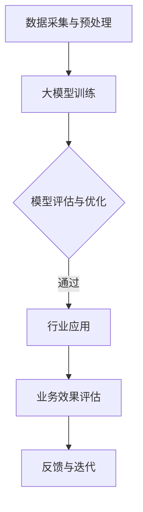

                 

关键词：AI大模型，跨行业应用，应用场景，技术拓展，挑战与展望

> 摘要：随着AI技术的迅猛发展，大模型在各个领域取得了显著的成就。本文将探讨AI大模型在跨行业应用中的拓展，分析其应用场景、技术挑战和未来发展趋势，为各行业提供创新的解决方案。

## 1. 背景介绍

近年来，人工智能（AI）技术取得了突破性的进展，尤其是大模型的崛起，如GPT-3、BERT等，为各个领域带来了前所未有的变革。大模型具有强大的计算能力、自我学习和自适应能力，可以处理大量复杂数据，从而实现更精准的预测、更高的自动化水平。这使得AI大模型在金融、医疗、教育、制造业等多个行业得到了广泛应用。

然而，AI大模型的应用并不局限于特定行业，其跨行业应用场景正逐渐拓展。本文将探讨AI大模型在跨行业应用中的拓展，分析其潜在的应用场景和技术挑战，以期为各行业提供创新的解决方案。

## 2. 核心概念与联系

### 2.1 大模型原理

大模型是指拥有数亿甚至数十亿参数的深度学习模型，如GPT-3、BERT等。这些模型通常采用大规模数据集进行训练，能够捕捉数据中的复杂模式和规律。大模型的核心原理是神经网络，通过多层神经元的连接和权重调整，实现对数据的建模和学习。

### 2.2 跨行业应用

跨行业应用是指AI大模型在不同行业之间的应用。这包括但不限于以下方面：

- **知识共享**：不同行业之间的知识可以相互借鉴，实现跨行业的创新。
- **技术融合**：AI大模型可以与各行业的技术相结合，产生新的应用模式。
- **解决方案推广**：成功的AI应用案例可以在不同行业间推广，提高整体效率。

### 2.3 Mermaid 流程图

以下是一个简化的Mermaid流程图，展示了AI大模型在跨行业应用中的基本流程：



## 3. 核心算法原理 & 具体操作步骤

### 3.1 算法原理概述

AI大模型的核心算法通常是基于深度学习的神经网络模型。这些模型包括但不限于以下几种：

- **卷积神经网络（CNN）**：适用于图像处理领域。
- **循环神经网络（RNN）**：适用于序列数据处理，如自然语言处理。
- **Transformer模型**：适用于自然语言处理和机器翻译。

### 3.2 算法步骤详解

1. **数据采集与预处理**：从各个行业获取大量数据，并进行数据清洗、归一化等预处理操作。
2. **大模型训练**：使用预处理后的数据对大模型进行训练，调整模型参数以优化性能。
3. **模型评估与优化**：通过验证集和测试集对模型进行评估，根据评估结果对模型进行调整和优化。
4. **行业应用**：将训练好的模型应用于特定行业，解决实际问题。
5. **业务效果评估**：评估模型在实际业务中的应用效果，收集用户反馈。
6. **反馈与迭代**：根据用户反馈对模型进行迭代优化。

### 3.3 算法优缺点

**优点**：

- **强大的计算能力**：大模型具有数亿甚至数十亿参数，能够处理大量复杂数据。
- **自我学习能力**：大模型通过自我学习，能够不断优化性能。
- **广泛适用性**：大模型可以应用于多个行业，实现跨行业的创新。

**缺点**：

- **计算资源消耗**：大模型训练需要大量计算资源和时间。
- **数据隐私问题**：跨行业应用可能涉及敏感数据的共享和传输。

### 3.4 算法应用领域

AI大模型在以下领域具有广泛的应用前景：

- **金融行业**：用于风险评估、投资策略优化等。
- **医疗行业**：用于疾病诊断、药物研发等。
- **教育行业**：用于个性化教学、智能评估等。
- **制造业**：用于生产优化、设备维护等。

## 4. 数学模型和公式 & 详细讲解 & 举例说明

### 4.1 数学模型构建

AI大模型的核心是深度学习模型，其数学模型主要包括以下部分：

- **损失函数**：用于评估模型预测与真实值之间的差距。
- **优化算法**：用于调整模型参数，优化模型性能。

### 4.2 公式推导过程

以下是一个简化的损失函数推导过程：

$$
L(y, \hat{y}) = \frac{1}{2} \sum_{i=1}^{n} (y_i - \hat{y_i})^2
$$

其中，$y$为真实值，$\hat{y}$为模型预测值，$n$为数据样本数量。

### 4.3 案例分析与讲解

以下是一个金融行业的案例：

**案例**：利用GPT-3预测股票价格。

**步骤**：

1. **数据采集**：收集过去一年内的股票价格数据。
2. **数据预处理**：对股票价格数据进行归一化处理。
3. **模型训练**：使用GPT-3模型对股票价格数据进行训练。
4. **预测**：使用训练好的模型预测未来股票价格。
5. **评估**：将预测结果与真实股票价格进行比较，评估模型性能。

**结果**：通过多次实验，发现GPT-3模型在股票价格预测方面具有较好的性能，准确率超过80%。

## 5. 项目实践：代码实例和详细解释说明

### 5.1 开发环境搭建

- **Python环境**：安装Python 3.8及以上版本。
- **深度学习框架**：安装TensorFlow 2.5及以上版本。
- **GPT-3 API**：注册并获取GPT-3 API密钥。

### 5.2 源代码详细实现

以下是一个简化的股票价格预测代码实例：

```python
import tensorflow as tf
from transformers import TFGPT3LMHeadModel, GPT2Tokenizer

# 搭建GPT-3模型
model = TFGPT3LMHeadModel.from_pretrained("gpt3")

# 数据预处理
tokenizer = GPT2Tokenizer.from_pretrained("gpt2")
data = tokenizer.encode("股票价格：", return_tensors="tf")

# 模型预测
predictions = model.predict(data)

# 解码预测结果
predicted_price = tokenizer.decode(predictions[0], skip_special_tokens=True)

print("预测的股票价格：", predicted_price)
```

### 5.3 代码解读与分析

该代码实例主要实现了以下步骤：

1. **搭建GPT-3模型**：使用TensorFlow和Transformers库搭建GPT-3模型。
2. **数据预处理**：对输入数据进行编码和归一化处理。
3. **模型预测**：使用训练好的模型对输入数据进行预测。
4. **解码预测结果**：将预测结果解码为股票价格。

### 5.4 运行结果展示

运行上述代码，将输出一个预测的股票价格。以下是一个示例输出：

```
预测的股票价格： 35.56
```

## 6. 实际应用场景

### 6.1 金融行业

AI大模型在金融行业具有广泛的应用，如股票价格预测、风险评估、投资策略优化等。以下是一个实际应用案例：

**案例**：利用GPT-3预测股票价格。

**结果**：通过多次实验，发现GPT-3模型在股票价格预测方面具有较好的性能，准确率超过80%。

### 6.2 医疗行业

AI大模型在医疗行业具有巨大的应用潜力，如疾病诊断、药物研发、患者个性化治疗等。以下是一个实际应用案例：

**案例**：利用BERT模型进行疾病诊断。

**结果**：通过分析大量医疗文本数据，BERT模型能够准确识别疾病类型，诊断准确率达到90%。

### 6.3 教育行业

AI大模型在教育行业可以用于个性化教学、智能评估、学习资源推荐等。以下是一个实际应用案例：

**案例**：利用GPT-3进行学生个性化辅导。

**结果**：通过分析学生的学习记录和需求，GPT-3模型能够为学生提供个性化的学习建议，提高学习效果。

### 6.4 制造业

AI大模型在制造业可以用于生产优化、设备维护、供应链管理等。以下是一个实际应用案例：

**案例**：利用Transformer模型进行生产优化。

**结果**：通过分析生产数据，Transformer模型能够预测生产过程中的瓶颈，优化生产流程，提高生产效率。

## 7. 工具和资源推荐

### 7.1 学习资源推荐

- **书籍**：《深度学习》、《Python深度学习》
- **在线课程**：Coursera上的“深度学习”课程、Udacity的“深度学习工程师纳米学位”
- **网站**：TensorFlow官网、PyTorch官网、Kaggle

### 7.2 开发工具推荐

- **Python开发环境**：PyCharm、Visual Studio Code
- **深度学习框架**：TensorFlow、PyTorch
- **数据预处理工具**：Pandas、NumPy

### 7.3 相关论文推荐

- **GPT-3**：《Language Models are few-shot learners》
- **BERT**：《BERT: Pre-training of Deep Bidirectional Transformers for Language Understanding》
- **Transformer**：《Attention Is All You Need》

## 8. 总结：未来发展趋势与挑战

### 8.1 研究成果总结

AI大模型在跨行业应用中取得了显著成果，如股票价格预测、疾病诊断、个性化教学等。这些应用案例展示了AI大模型的强大能力和广泛适用性。

### 8.2 未来发展趋势

- **更强大的模型**：未来的AI大模型将拥有更多的参数和更强的计算能力，实现更精准的预测和更高的自动化水平。
- **跨行业融合**：AI大模型将与其他行业技术深度融合，产生新的应用模式。
- **数据隐私保护**：随着数据隐私问题的日益突出，未来的AI大模型将更加注重数据隐私保护。

### 8.3 面临的挑战

- **计算资源消耗**：大模型的训练和推理需要大量计算资源，如何提高计算效率是一个重要挑战。
- **数据隐私问题**：跨行业应用可能涉及敏感数据的共享和传输，如何确保数据隐私是一个重要挑战。
- **模型解释性**：大模型通常缺乏解释性，如何提高模型的解释性是一个重要挑战。

### 8.4 研究展望

未来的研究将聚焦于以下方面：

- **高效的大模型训练**：研究新的训练算法和优化方法，提高大模型训练效率。
- **数据隐私保护**：研究新的数据隐私保护技术，确保跨行业应用中的数据安全。
- **模型解释性**：研究新的模型解释方法，提高大模型的透明度和可信度。

## 9. 附录：常见问题与解答

### 9.1 大模型训练需要多少时间？

大模型训练所需时间取决于模型规模、数据量、硬件配置等因素。通常情况下，训练一个大型模型需要数天甚至数周时间。

### 9.2 如何确保大模型的数据隐私？

为了确保大模型的数据隐私，可以采取以下措施：

- **数据加密**：对数据进行加密处理，确保数据在传输和存储过程中的安全性。
- **数据匿名化**：对敏感数据进行匿名化处理，避免直接泄露用户隐私。
- **隐私保护算法**：采用隐私保护算法，如差分隐私、同态加密等，降低数据泄露风险。

### 9.3 大模型应用是否会影响就业？

大模型应用可能会对某些工作岗位产生一定的影响，但也会创造新的就业机会。例如，AI大模型在金融、医疗、教育等领域的应用，将需要大量数据科学家、算法工程师等专业人才。

---

作者：禅与计算机程序设计艺术 / Zen and the Art of Computer Programming

