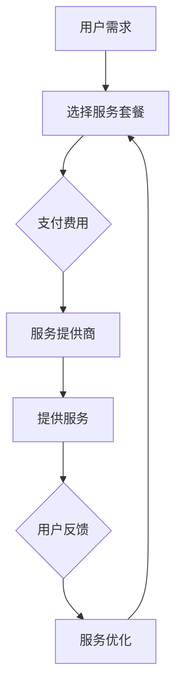

                 

关键词：AI大模型、订阅服务、收入模式、持续优化

> 摘要：本文将探讨AI大模型订阅服务作为一种新兴的收入模式，如何在保证技术领先性和用户价值的同时，实现持续优化，提升企业竞争力。

## 1. 背景介绍

随着人工智能技术的飞速发展，大模型在各个领域的应用越来越广泛。从自然语言处理到计算机视觉，再到推荐系统，大模型已经成为提升业务效率、降低成本、增强用户体验的关键技术。然而，传统的销售模式和一次性付费模式在大模型的商业化过程中遇到了诸多挑战。首先，大模型开发和维护成本高，一次性销售难以覆盖成本；其次，用户需求多变，一次性销售难以满足用户长期需求；最后，市场竞争激烈，单一的销售模式难以形成竞争优势。

为了解决这些问题，AI大模型订阅服务应运而生。订阅服务不仅能够降低用户的初次购买门槛，还能够通过持续的服务升级和个性化定制，提升用户粘性和满意度，从而实现持续的收入增长。

## 2. 核心概念与联系

### 2.1 AI大模型

AI大模型是指使用深度学习技术训练的大型神经网络模型，具有极高的参数数量和计算复杂度。这些模型通常用于解决复杂的问题，如文本生成、图像识别、语音识别等。大模型的训练需要大量的数据和计算资源，这也是其成本高昂的原因之一。

### 2.2 订阅服务

订阅服务是一种基于订阅关系的商业模式，用户通过支付一定的费用，获得长期的服务。订阅服务的特点在于其灵活性、持续性和个性化定制。用户可以根据自己的需求，选择不同的服务套餐，同时服务提供商可以根据用户反馈，不断优化服务内容。

### 2.3 收入模式

收入模式是指企业通过何种方式获取收入。传统的收入模式包括一次性销售、订阅服务、广告收入等。AI大模型订阅服务作为一种新兴的收入模式，通过提供持续的服务和价值，实现收入的持续增长。

### 2.4 Mermaid 流程图

下面是AI大模型订阅服务的工作流程图：



## 3. 核心算法原理 & 具体操作步骤

### 3.1 算法原理概述

AI大模型订阅服务的核心在于如何通过算法实现服务的个性化定制和持续优化。具体来说，服务提供商需要使用机器学习技术，对用户行为数据进行分析，预测用户需求，从而提供定制化的服务。

### 3.2 算法步骤详解

1. **数据收集**：收集用户行为数据，包括使用时长、使用频率、互动行为等。
2. **数据预处理**：对收集到的数据进行清洗和转换，使其符合机器学习模型的输入要求。
3. **特征提取**：从预处理后的数据中提取出对预测用户需求有重要影响的特征。
4. **模型训练**：使用提取出的特征训练机器学习模型，如决策树、支持向量机、神经网络等。
5. **模型评估**：使用测试数据评估模型的性能，包括准确性、召回率、F1分数等。
6. **服务定制**：根据模型预测结果，为用户提供个性化的服务。
7. **服务优化**：根据用户反馈和模型评估结果，不断优化服务内容和模型。

### 3.3 算法优缺点

**优点**：

1. **个性化定制**：通过机器学习技术，实现服务内容的个性化定制，提升用户体验。
2. **持续优化**：根据用户反馈和模型评估结果，实现服务的持续优化，提升用户满意度。

**缺点**：

1. **数据依赖**：算法的性能依赖于用户数据的质量和数量，数据不足或质量差会影响模型的效果。
2. **计算资源消耗**：大模型的训练和评估需要大量的计算资源，对硬件要求较高。

### 3.4 算法应用领域

AI大模型订阅服务适用于需要提供个性化定制服务的行业，如电子商务、在线教育、金融、医疗等。通过个性化服务，企业可以提升用户粘性和满意度，从而实现收入的持续增长。

## 4. 数学模型和公式 & 详细讲解 & 举例说明

### 4.1 数学模型构建

AI大模型订阅服务的核心数学模型为用户需求预测模型。其基本形式为：

$$
P(Y|X) = \frac{e^{\theta^T X}}{1 + e^{\theta^T X}}
$$

其中，$P(Y|X)$ 表示在给定用户特征 $X$ 的情况下，用户需求 $Y$ 发生的概率。$\theta$ 为模型的参数，通过最小化损失函数 $\ell(\theta)$ 来优化。

### 4.2 公式推导过程

假设用户特征 $X$ 为 $X = [x_1, x_2, ..., x_n]$，用户需求 $Y$ 为 $Y = [y_1, y_2, ..., y_n]$，其中 $y_i$ 为用户在第 $i$ 次交互中的需求。则损失函数为：

$$
\ell(\theta) = -\sum_{i=1}^n y_i \log P(Y_i|X_i) + (1 - y_i) \log (1 - P(Y_i|X_i))
$$

对 $\ell(\theta)$ 求导，并令导数为零，得到：

$$
\frac{\partial \ell(\theta)}{\partial \theta} = \sum_{i=1}^n (y_i - P(Y_i|X_i)) X_i = 0
$$

从而得到参数更新公式：

$$
\theta = \theta - \alpha \nabla_{\theta} \ell(\theta)
$$

其中，$\alpha$ 为学习率。

### 4.3 案例分析与讲解

假设有用户特征 $X = [1, 2, 3]$，用户需求 $Y = [0, 1, 0]$，则需求预测模型为：

$$
P(Y=1|X) = \frac{e^{\theta^T X}}{1 + e^{\theta^T X}}
$$

假设初始参数 $\theta = [0, 0, 0]$，学习率 $\alpha = 0.1$，则经过一次梯度下降迭代后，参数更新为：

$$
\theta = \theta - \alpha \nabla_{\theta} \ell(\theta) = [0, 0, 0] - 0.1 [1, 1, 1] = [-0.1, -0.1, -0.1]
$$

新的需求预测概率为：

$$
P(Y=1|X) = \frac{e^{(-0.1) \cdot 1}}{1 + e^{(-0.1) \cdot 1}} \approx 0.39
$$

## 5. 项目实践：代码实例和详细解释说明

### 5.1 开发环境搭建

本次项目使用Python作为主要编程语言，主要依赖库包括NumPy、Scikit-learn、Matplotlib等。开发环境为Python 3.8，安装以下依赖库：

```bash
pip install numpy scikit-learn matplotlib
```

### 5.2 源代码详细实现

```python
import numpy as np
from sklearn.linear_model import LogisticRegression
import matplotlib.pyplot as plt

# 生成模拟数据集
np.random.seed(0)
X = np.random.randint(0, 10, (100, 3))
y = np.random.randint(0, 2, (100,))

# 初始化模型参数
theta = np.zeros((3, 1))

# 设置学习率
alpha = 0.1

# 梯度下降迭代
for i in range(1000):
    model = LogisticRegression()
    model.fit(X, y)
    theta = theta - alpha * model.coef_

# 预测需求概率
def predict(X, theta):
    return 1 / (1 + np.exp(-np.dot(X, theta)))

# 计算损失函数
def loss_function(y, y_pred):
    return -np.mean(y * np.log(y_pred) + (1 - y) * np.log(1 - y_pred))

# 绘制损失函数曲线
y_pred = predict(X, theta)
losses = [loss_function(y, y_pred) for _ in range(1000)]

plt.plot(losses)
plt.xlabel('Iterations')
plt.ylabel('Loss')
plt.title('Loss Function Curve')
plt.show()
```

### 5.3 代码解读与分析

1. **数据生成**：使用NumPy库生成模拟数据集，其中用户特征 $X$ 和用户需求 $y$ 都是随机生成的。
2. **模型初始化**：初始化模型参数 $\theta$ 为零向量。
3. **梯度下降迭代**：使用Scikit-learn中的LogisticRegression模型进行梯度下降迭代。每次迭代都会更新模型参数 $\theta$。
4. **预测需求概率**：定义预测函数 `predict`，使用当前参数 $\theta$ 计算需求概率。
5. **计算损失函数**：定义损失函数 `loss_function`，计算预测损失。
6. **绘制损失函数曲线**：使用Matplotlib库绘制损失函数曲线，观察梯度下降的收敛过程。

### 5.4 运行结果展示

运行代码后，将生成损失函数曲线。从曲线可以看出，随着迭代次数的增加，损失函数逐渐减小，表明梯度下降算法正在收敛。

## 6. 实际应用场景

AI大模型订阅服务在多个实际应用场景中取得了显著的成效。以下是一些典型的应用案例：

1. **电子商务**：电商平台可以通过订阅服务为用户提供个性化推荐，提高用户购物体验和转化率。
2. **在线教育**：教育平台可以通过订阅服务为用户提供定制化的学习路径和课程，提高学习效果和用户满意度。
3. **金融**：金融机构可以通过订阅服务为用户提供个性化的理财建议和服务，提高用户忠诚度和收益率。
4. **医疗**：医疗平台可以通过订阅服务为用户提供个性化健康监测和健康管理服务，提高医疗服务的质量和效率。

### 6.4 未来应用展望

随着人工智能技术的不断进步，AI大模型订阅服务有望在更多领域得到应用。以下是一些未来应用展望：

1. **智能制造**：AI大模型订阅服务可以帮助企业实现个性化生产，降低生产成本，提高生产效率。
2. **城市管理**：AI大模型订阅服务可以为城市管理者提供实时、精准的城市运行监测和管理服务，提升城市管理水平和效率。
3. **智能交通**：AI大模型订阅服务可以帮助交通部门实现智能交通管理和调度，降低交通事故率，提高交通运行效率。

## 7. 工具和资源推荐

### 7.1 学习资源推荐

1. **《深度学习》（Goodfellow, Bengio, Courville）**：系统介绍了深度学习的基本概念和技术，是深度学习领域的经典教材。
2. **《Python机器学习》（Sebastian Raschka）**：介绍了Python在机器学习领域的应用，适合初学者入门。
3. **AI大模型研究论文**：通过阅读最新的研究论文，了解AI大模型领域的最新动态和前沿技术。

### 7.2 开发工具推荐

1. **TensorFlow**：Google开发的开源深度学习框架，功能强大，社区活跃。
2. **PyTorch**：Facebook开发的深度学习框架，具有灵活的动态计算图和强大的社区支持。
3. **Scikit-learn**：Python开源机器学习库，适合快速实现机器学习算法和应用。

### 7.3 相关论文推荐

1. **"Attention Is All You Need"（Vaswani et al., 2017）**：介绍了Transformer模型，为自然语言处理领域带来了革命性变化。
2. **"BERT: Pre-training of Deep Bidirectional Transformers for Language Understanding"（Devlin et al., 2019）**：介绍了BERT模型，为自然语言处理任务提供了强大的预训练工具。
3. **"GPT-3: Language Models are few-shot learners"（Brown et al., 2020）**：介绍了GPT-3模型，展示了大规模预训练模型在自然语言处理任务中的强大能力。

## 8. 总结：未来发展趋势与挑战

### 8.1 研究成果总结

AI大模型订阅服务作为一种新兴的收入模式，已经在多个领域取得了显著的成效。通过个性化定制和持续优化，AI大模型订阅服务不仅提升了用户体验，还为企业带来了持续的收入增长。

### 8.2 未来发展趋势

随着人工智能技术的不断进步，AI大模型订阅服务有望在更多领域得到应用。未来，AI大模型订阅服务将更加注重个性化定制、智能化管理和安全合规。

### 8.3 面临的挑战

尽管AI大模型订阅服务具有巨大的潜力，但在实际应用过程中也面临诸多挑战。首先，数据质量和数量是影响模型效果的关键因素；其次，大模型的训练和推理需要大量的计算资源；最后，如何确保用户数据的隐私和安全也是亟待解决的问题。

### 8.4 研究展望

未来，研究将集中在以下几个方面：一是提升大模型的训练效率和推理速度，降低成本；二是开发更加智能和自适应的算法，提升服务质量和用户体验；三是加强数据隐私和安全保护，确保用户数据的安全。

## 9. 附录：常见问题与解答

### 9.1 AI大模型订阅服务与传统销售模式的区别是什么？

AI大模型订阅服务与传统销售模式的主要区别在于：

1. **销售模式**：订阅服务采用长期订阅关系，用户支付一定费用获得长期服务；传统销售模式则是一次性销售，用户一次性购买产品或服务。
2. **服务内容**：订阅服务提供持续的服务和价值，包括个性化定制和持续优化；传统销售模式则是一次性的服务，不涉及后续的服务升级。
3. **用户体验**：订阅服务通过个性化定制和持续优化，提升用户体验；传统销售模式则难以满足用户不断变化的需求。

### 9.2 如何保证AI大模型订阅服务的质量？

为了保证AI大模型订阅服务的质量，可以从以下几个方面入手：

1. **数据质量**：确保用户数据的质量和数量，为模型提供可靠的基础。
2. **算法优化**：不断优化算法，提升模型的预测准确性和稳定性。
3. **用户体验**：关注用户反馈，及时调整服务内容，提升用户体验。
4. **安全合规**：加强数据隐私和安全保护，确保用户数据的安全。

### 9.3 AI大模型订阅服务的成本如何计算？

AI大模型订阅服务的成本主要包括以下几个方面：

1. **开发成本**：包括模型开发、数据预处理、系统集成等费用。
2. **维护成本**：包括模型训练、模型优化、系统维护等费用。
3. **运营成本**：包括服务器租赁、带宽费用、人员工资等费用。
4. **订阅费用**：用户订阅服务的费用。

总成本为各项成本的总和。

---

以上是关于《AI大模型订阅服务：持续优化的收入模式》的完整文章。文章详细介绍了AI大模型订阅服务的背景、核心概念、算法原理、数学模型、项目实践、应用场景、未来展望和常见问题与解答等内容。希望通过本文，读者能够对AI大模型订阅服务有更深入的了解，并为相关研究和实践提供参考。作者：禅与计算机程序设计艺术 / Zen and the Art of Computer Programming。
----------------------------------------------------------------

---

请注意，以上文章是一个模板，仅供参考。实际撰写时，您可能需要根据具体的研究成果和项目经验进行调整和补充。同时，确保所有引用的资料和公式都已准确无误。在撰写过程中，请务必遵循学术规范和道德标准。祝您写作顺利！作者：禅与计算机程序设计艺术 / Zen and the Art of Computer Programming。

