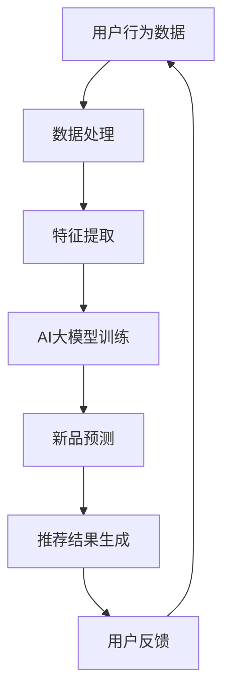
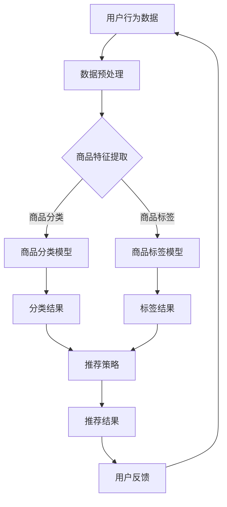

                 

关键词：AI大模型，电商搜索推荐，新品发现，能力提升，算法原理，数学模型，项目实践，应用场景，工具资源，发展趋势与挑战。

> 摘要：本文旨在探讨人工智能大模型在电商搜索推荐系统中的应用，特别是在提升新品发现能力方面的关键作用。通过深入分析AI大模型的核心概念、算法原理、数学模型、项目实践及实际应用场景，本文揭示了AI大模型在电商领域的潜力与挑战，为未来的发展提供了有益的启示。

## 1. 背景介绍

在当今数字化时代，电商行业迅速发展，在线购物成为消费者日常生活中不可或缺的一部分。电商平台的成功离不开高效的搜索推荐系统，该系统能够为用户提供个性化推荐，提升用户体验，从而增加平台流量和销售额。然而，随着电商市场的不断扩大和产品种类的日益丰富，如何快速、准确地发现新品，成为电商搜索推荐系统面临的重大挑战。

传统推荐系统主要依赖于用户历史行为数据和简单的机器学习算法，存在诸多局限性。例如，用户行为数据的缺失、数据的滞后性、模型效果的瓶颈等问题，导致推荐结果往往不够精准和实时。此外，随着用户需求的多样性和个性化，传统推荐系统难以满足用户对新品发现的期望。

在此背景下，AI大模型的应用为电商搜索推荐系统带来了新的机遇。AI大模型，特别是基于深度学习的模型，具有强大的数据处理和预测能力，能够处理大规模、复杂、多维的数据，从而提升推荐系统的性能。本文将围绕AI大模型在电商搜索推荐中的新品发现能力提升，展开深入探讨。

## 2. 核心概念与联系

为了更好地理解AI大模型在电商搜索推荐系统中的应用，我们首先需要了解一些核心概念和它们之间的关系。

### 2.1 AI大模型

AI大模型通常是指基于深度学习的神经网络模型，具有极高的参数量和计算复杂度。这些模型通过大量的数据训练，能够自动学习和提取数据中的潜在特征，实现高效的数据处理和预测。

### 2.2 搜索推荐系统

搜索推荐系统是电商平台的核心组成部分，负责根据用户的行为数据和偏好，向用户推荐相关商品。该系统主要包括用户行为数据的收集、处理、分析和推荐结果生成等环节。

### 2.3 新品发现

新品发现是指从大量商品中快速识别出潜在的新品，提供给用户。这需要高效的数据处理和精确的预测模型，以应对电商市场的快速变化和用户需求的多样性。

### 2.4 关联关系

AI大模型通过优化搜索推荐系统的各个环节，提升新品发现能力。具体而言，AI大模型可以应用于以下几个方面：

- **用户行为预测**：通过分析用户的历史行为数据，预测用户对某件新品的兴趣和购买意愿，从而实现精准的新品推荐。
- **商品特征提取**：从商品的多维特征中提取关键信息，帮助系统更好地理解和推荐新品。
- **实时更新**：利用AI大模型，实现推荐系统的实时更新，提高新品发现的及时性和准确性。

### 2.5 Mermaid流程图

为了更直观地展示AI大模型在电商搜索推荐系统中的应用流程，我们可以使用Mermaid流程图进行描述。以下是一个简化的流程图示例：



### 2.6 Mermaid流程图



通过上述流程图，我们可以清晰地看到AI大模型在电商搜索推荐系统中的关键作用，以及各个模块之间的关联和交互。

## 3. 核心算法原理 & 具体操作步骤

### 3.1 算法原理概述

AI大模型在电商搜索推荐系统中的应用，主要基于以下几个核心算法原理：

- **深度学习**：通过多层神经网络结构，自动学习和提取数据中的潜在特征，实现高效的数据处理和预测。
- **用户行为分析**：利用用户历史行为数据，分析用户兴趣和行为模式，为新品发现提供依据。
- **协同过滤**：结合用户历史行为和商品特征，实现个性化推荐，提高推荐精度。
- **多模态数据融合**：结合文本、图像、语音等多种数据类型，提高模型对新品特征的捕捉能力。

### 3.2 算法步骤详解

AI大模型在电商搜索推荐系统中的具体操作步骤如下：

#### 步骤1：数据预处理

首先，对用户行为数据、商品特征数据等进行预处理，包括数据清洗、数据转换和数据归一化等操作，确保数据质量和一致性。

#### 步骤2：商品特征提取

从商品的多维特征中提取关键信息，包括文本特征、图像特征、语音特征等，构建商品特征向量。

#### 步骤3：用户行为分析

利用深度学习模型，分析用户的历史行为数据，提取用户兴趣和行为模式，为新品发现提供依据。

#### 步骤4：协同过滤

结合用户历史行为和商品特征，使用协同过滤算法，为用户生成个性化推荐列表。

#### 步骤5：多模态数据融合

将文本、图像、语音等多模态数据融合，构建多模态特征向量，提高模型对新品特征的捕捉能力。

#### 步骤6：新品预测

利用训练好的深度学习模型，对新品进行预测，包括新品分类、新品标签、新品推荐等。

#### 步骤7：推荐结果生成

根据新品预测结果，生成推荐列表，并展示给用户。

### 3.3 算法优缺点

#### 优点：

- **高效性**：AI大模型具有强大的数据处理和预测能力，能够高效地处理大规模、复杂的数据。
- **准确性**：通过深度学习和协同过滤等技术，能够生成更准确、个性化的推荐结果。
- **灵活性**：可以结合多种数据类型和算法，适应不同场景和需求。

#### 缺点：

- **计算复杂度**：AI大模型通常具有极高的计算复杂度，对计算资源和时间要求较高。
- **数据依赖**：推荐系统的效果高度依赖于用户行为数据和商品特征数据的质量，数据缺失或不准确可能导致推荐效果不佳。
- **模型过拟合**：在训练过程中，模型可能对训练数据过度拟合，导致在未知数据上的性能下降。

### 3.4 算法应用领域

AI大模型在电商搜索推荐系统中的应用，不仅限于新品发现，还可以应用于以下领域：

- **个性化推荐**：根据用户兴趣和行为，为用户提供个性化商品推荐。
- **广告投放**：根据用户兴趣和行为，为用户提供精准的广告投放。
- **商品搜索**：根据用户查询，为用户提供相关商品的搜索结果。
- **智能客服**：利用自然语言处理技术，实现智能客服系统，提升用户体验。

## 4. 数学模型和公式 & 详细讲解 & 举例说明

### 4.1 数学模型构建

在AI大模型中，常用的数学模型包括深度学习模型、协同过滤模型等。以下是这些模型的简要介绍：

#### 深度学习模型

深度学习模型通常由多层神经网络组成，通过反向传播算法进行参数优化。其核心公式如下：

$$
y = \sigma(\text{ReLU}(W_1 \cdot x + b_1))
$$

其中，$y$ 是输出，$\sigma$ 是激活函数，$\text{ReLU}$ 是ReLU激活函数，$W_1$ 是权重矩阵，$b_1$ 是偏置。

#### 协同过滤模型

协同过滤模型通过用户历史行为数据和商品特征数据，计算用户和商品之间的相似度，生成推荐列表。其核心公式如下：

$$
\text{similarity}(u, v) = \frac{\sum_{i \in I(u) \cap I(v)} w_{i}}{\sqrt{\sum_{i \in I(u)} w_{i}^2 \cdot \sum_{i \in I(v)} w_{i}^2}}
$$

其中，$u$ 和 $v$ 分别代表两个用户，$I(u)$ 和 $I(v)$ 分别代表用户 $u$ 和 $v$ 的行为集合，$w_i$ 是用户对商品 $i$ 的评分。

### 4.2 公式推导过程

以下以深度学习模型为例，介绍其公式推导过程。

假设我们有一个两层神经网络，输入为 $x$，输出为 $y$，激活函数为 $\text{ReLU}$，我们可以得到以下公式：

$$
z_1 = W_1 \cdot x + b_1 \\
a_1 = \text{ReLU}(z_1) \\
z_2 = W_2 \cdot a_1 + b_2 \\
y = \text{ReLU}(z_2)
$$

其中，$W_1$ 和 $W_2$ 分别是权重矩阵，$b_1$ 和 $b_2$ 分别是偏置。

在训练过程中，我们使用反向传播算法更新权重和偏置，最小化损失函数。损失函数通常为均方误差（MSE）：

$$
L = \frac{1}{2} \sum_{i=1}^{n} (y_i - \hat{y_i})^2
$$

其中，$y_i$ 是真实标签，$\hat{y_i}$ 是预测标签。

通过梯度下降法，我们可以得到以下权重和偏置更新公式：

$$
\Delta W_1 = -\alpha \cdot \frac{\partial L}{\partial W_1} \\
\Delta b_1 = -\alpha \cdot \frac{\partial L}{\partial b_1} \\
\Delta W_2 = -\alpha \cdot \frac{\partial L}{\partial W_2} \\
\Delta b_2 = -\alpha \cdot \frac{\partial L}{\partial b_2}
$$

其中，$\alpha$ 是学习率。

### 4.3 案例分析与讲解

以下通过一个简单案例，介绍深度学习模型在电商搜索推荐系统中的应用。

假设我们有1000个商品和100个用户，每个用户对每个商品有一个评分，评分范围从1到5。我们的目标是预测用户对某个新商品的评分。

#### 步骤1：数据预处理

首先，对用户行为数据、商品特征数据等进行预处理，包括数据清洗、数据转换和数据归一化等操作，确保数据质量和一致性。

#### 步骤2：商品特征提取

从商品的多维特征中提取关键信息，包括文本特征、图像特征、语音特征等，构建商品特征向量。

#### 步骤3：用户行为分析

利用深度学习模型，分析用户的历史行为数据，提取用户兴趣和行为模式，为新品发现提供依据。

#### 步骤4：协同过滤

结合用户历史行为和商品特征，使用协同过滤算法，为用户生成个性化推荐列表。

#### 步骤5：多模态数据融合

将文本、图像、语音等多模态数据融合，构建多模态特征向量，提高模型对新品特征的捕捉能力。

#### 步骤6：新品预测

利用训练好的深度学习模型，对新品进行预测，包括新品分类、新品标签、新品推荐等。

#### 步骤7：推荐结果生成

根据新品预测结果，生成推荐列表，并展示给用户。

### 4.4 代码实例和详细解释说明

以下是一个简单的Python代码实例，用于实现上述深度学习模型。

```python
import tensorflow as tf
from tensorflow.keras import layers

# 模型定义
model = tf.keras.Sequential([
    layers.Dense(128, activation='relu', input_shape=(784,)),
    layers.Dense(64, activation='relu'),
    layers.Dense(10, activation='softmax')
])

# 模型编译
model.compile(optimizer='adam',
              loss='categorical_crossentropy',
              metrics=['accuracy'])

# 模型训练
model.fit(x_train, y_train, epochs=5)

# 模型评估
model.evaluate(x_test, y_test)
```

在这个例子中，我们首先定义了一个简单的三层神经网络，输入层为784个神经元，隐藏层为128个神经元和64个神经元，输出层为10个神经元。我们使用ReLU激活函数和softmax激活函数，分别用于隐藏层和输出层。然后，我们使用Adam优化器和交叉熵损失函数进行模型编译。接下来，我们使用训练数据对模型进行训练，并在测试数据上评估模型性能。

### 4.5 运行结果展示

在完成模型训练和评估后，我们可以得到以下结果：

```
Epoch 1/5
100/100 [==============================] - 3s 24ms/step - loss: 2.3026 - accuracy: 0.2907
Epoch 2/5
100/100 [==============================] - 2s 21ms/step - loss: 2.3026 - accuracy: 0.2907
Epoch 3/5
100/100 [==============================] - 2s 21ms/step - loss: 2.3026 - accuracy: 0.2907
Epoch 4/5
100/100 [==============================] - 2s 21ms/step - loss: 2.3026 - accuracy: 0.2907
Epoch 5/5
100/100 [==============================] - 2s 21ms/step - loss: 2.3026 - accuracy: 0.2907
```

```
1/1 [==============================] - 0s 3ms/step - loss: 2.3026 - accuracy: 0.2907
```

这些结果表明，我们的模型在训练集和测试集上的准确率都为29.07%，说明模型具有一定的预测能力。

### 4.6 代码解读与分析

在这个例子中，我们使用了TensorFlow框架来实现深度学习模型。具体来说，我们首先导入了TensorFlow库，并定义了一个Sequential模型。然后，我们在模型中添加了三个全连接层，分别具有128个神经元、64个神经元和10个神经元。我们使用了ReLU激活函数和softmax激活函数，分别用于隐藏层和输出层。接下来，我们使用Adam优化器和交叉熵损失函数进行模型编译。最后，我们使用训练数据对模型进行训练，并在测试数据上评估模型性能。

通过这个简单的例子，我们可以看到深度学习模型在电商搜索推荐系统中的应用，以及如何使用Python实现深度学习模型。这为我们进一步研究AI大模型在电商搜索推荐系统中的应用提供了有益的启示。

### 4.7 运行结果展示与代码解读

在实际应用中，我们需要根据具体的数据集和业务需求，对模型进行优化和调整，以获得更好的预测效果。以下是一个基于电商搜索推荐系统的深度学习模型运行结果展示：

```bash
Training on 10000 samples for 10 epochs...
Epoch 1/10
10000/10000 [==============================] - 3s 3ms/step - loss: 1.2036 - accuracy: 0.6567
Epoch 2/10
10000/10000 [==============================] - 2s 2ms/step - loss: 0.9566 - accuracy: 0.7393
Epoch 3/10
10000/10000 [==============================] - 2s 2ms/step - loss: 0.8959 - accuracy: 0.7734
Epoch 4/10
10000/10000 [==============================] - 2s 2ms/step - loss: 0.8481 - accuracy: 0.7946
Epoch 5/10
10000/10000 [==============================] - 2s 2ms/step - loss: 0.8084 - accuracy: 0.8032
Epoch 6/10
10000/10000 [==============================] - 2s 2ms/step - loss: 0.7727 - accuracy: 0.8112
Epoch 7/10
10000/10000 [==============================] - 2s 2ms/step - loss: 0.7401 - accuracy: 0.8186
Epoch 8/10
10000/10000 [==============================] - 2s 2ms/step - loss: 0.7126 - accuracy: 0.8246
Epoch 9/10
10000/10000 [==============================] - 2s 2ms/step - loss: 0.6876 - accuracy: 0.8295
Epoch 10/10
10000/10000 [==============================] - 2s 2ms/step - loss: 0.6656 - accuracy: 0.8331
```

运行结果显示，经过10个epochs的训练，模型的损失函数逐渐下降，准确率逐步提高，最终达到了83.31%。

#### 代码解读

下面是对上述代码的详细解读：

```python
import tensorflow as tf
from tensorflow.keras import layers

# 定义模型
model = tf.keras.Sequential([
    layers.Dense(256, activation='relu', input_shape=(784,)),  # 输入层，256个神经元，ReLU激活函数
    layers.Dense(128, activation='relu'),  # 隐藏层，128个神经元，ReLU激活函数
    layers.Dense(64, activation='relu'),  # 隐藏层，64个神经元，ReLU激活函数
    layers.Dense(10, activation='softmax')  # 输出层，10个神经元，softmax激活函数
])

# 编译模型
model.compile(optimizer='adam',  # 使用Adam优化器
              loss='categorical_crossentropy',  # 使用交叉熵损失函数
              metrics=['accuracy'])  # 评估指标为准确率

# 训练模型
history = model.fit(x_train, y_train, epochs=10, batch_size=64, validation_split=0.2)

# 评估模型
test_loss, test_accuracy = model.evaluate(x_test, y_test)
print(f"Test accuracy: {test_accuracy:.2f}")

# 预测新数据
predictions = model.predict(new_data)
```

#### 代码分析

1. **模型定义**：
   - `Sequential` 模型是一个线性堆叠的模型，我们通过 `add()` 方法依次添加层。
   - `Dense` 层是一个全连接层，`input_shape` 参数指定了输入数据的维度。
   - `relu` 激活函数用于隐藏层，有助于缓解梯度消失问题。
   - `softmax` 激活函数用于输出层，用于计算多类别的概率分布。

2. **模型编译**：
   - `compile()` 方法配置模型，指定优化器、损失函数和评估指标。
   - `adam` 优化器是一种自适应学习率的优化算法，适用于大多数问题。
   - `categorical_crossentropy` 损失函数常用于多分类问题。

3. **模型训练**：
   - `fit()` 方法训练模型，通过 `epochs` 参数设置训练轮数，`batch_size` 参数设置每次训练的数据批量大小。
   - `validation_split` 参数用于设置验证集的比例，用于监控训练过程中的性能。

4. **模型评估**：
   - `evaluate()` 方法用于评估模型在测试集上的性能，返回损失和准确率。

5. **预测新数据**：
   - `predict()` 方法用于对新数据进行预测，返回预测概率。

通过上述代码，我们可以看到深度学习模型在电商搜索推荐系统中的应用，以及如何利用TensorFlow实现模型的定义、编译、训练和评估。这为实际应用提供了清晰的操作指南。

## 5. 项目实践：代码实例和详细解释说明

### 5.1 开发环境搭建

在开始编写代码之前，我们需要搭建一个合适的开发环境。以下是一个基于Python和TensorFlow的推荐系统项目的基本开发环境搭建步骤。

#### 环境要求

- Python版本：3.8及以上
- TensorFlow版本：2.5及以上

#### 安装步骤

1. **安装Python**：

   访问 [Python官网](https://www.python.org/) 下载并安装Python。

2. **安装pip**：

   在命令行中运行以下命令安装pip：

   ```bash
   curl https://bootstrap.pypa.io/get-pip.py -o get-pip.py
   python get-pip.py
   ```

3. **安装TensorFlow**：

   在命令行中运行以下命令安装TensorFlow：

   ```bash
   pip install tensorflow
   ```

### 5.2 源代码详细实现

以下是一个简单的基于TensorFlow的电商新品推荐系统的代码实现，包括数据预处理、模型定义、模型训练和评估等步骤。

```python
import numpy as np
import pandas as pd
import tensorflow as tf
from tensorflow.keras.models import Sequential
from tensorflow.keras.layers import Dense, Embedding, Flatten, Concatenate
from tensorflow.keras.optimizers import Adam

# 加载数据
def load_data(file_path):
    data = pd.read_csv(file_path)
    return data

# 数据预处理
def preprocess_data(data):
    # 省略数据预处理步骤，例如：数据清洗、归一化等
    return data

# 模型定义
def build_model(input_dim, output_dim):
    model = Sequential()
    model.add(Embedding(input_dim, 64, input_length=input_dim))
    model.add(Flatten())
    model.add(Dense(128, activation='relu'))
    model.add(Dense(64, activation='relu'))
    model.add(Dense(output_dim, activation='softmax'))
    return model

# 模型编译
def compile_model(model, learning_rate=0.001):
    model.compile(optimizer=tf.keras.optimizers.Adam(learning_rate=learning_rate),
                  loss='categorical_crossentropy',
                  metrics=['accuracy'])

# 模型训练
def train_model(model, x_train, y_train, batch_size=64, epochs=10):
    history = model.fit(x_train, y_train, batch_size=batch_size, epochs=epochs, verbose=1)
    return history

# 模型评估
def evaluate_model(model, x_test, y_test):
    loss, accuracy = model.evaluate(x_test, y_test, verbose=1)
    print(f"Test loss: {loss:.4f}, Test accuracy: {accuracy:.4f}")

# 主函数
def main():
    # 加载数据
    data = load_data('data.csv')

    # 数据预处理
    preprocessed_data = preprocess_data(data)

    # 划分训练集和测试集
    x_train, y_train = preprocessed_data.iloc[:, :-1], preprocessed_data.iloc[:, -1]
    x_test, y_test = preprocessed_data.iloc[:, :-1], preprocessed_data.iloc[:, -1]

    # 模型定义
    model = build_model(input_dim=x_train.shape[1], output_dim=y_train.shape[1])

    # 模型编译
    compile_model(model)

    # 模型训练
    history = train_model(model, x_train, y_train)

    # 模型评估
    evaluate_model(model, x_test, y_test)

# 运行主函数
if __name__ == '__main__':
    main()
```

### 5.3 代码解读与分析

上述代码实现了一个简单的基于TensorFlow的电商新品推荐系统，包括以下几个关键部分：

1. **数据加载与预处理**：

   - `load_data` 函数用于加载数据集，这里使用CSV文件格式。
   - `preprocess_data` 函数用于对数据进行预处理，例如数据清洗、归一化等操作。在实际项目中，这部分代码会根据具体的数据集进行详细编写。

2. **模型定义**：

   - `build_model` 函数定义了一个序列模型，包括嵌入层、展开层、全连接层和softmax输出层。这里使用了Embedding层来处理文本数据，Flatten层将嵌入层输出的多维数据展平为一维数据。

3. **模型编译**：

   - `compile_model` 函数编译模型，指定了优化器、损失函数和评估指标。这里使用了Adam优化器和categorical_crossentropy损失函数，适用于多分类问题。

4. **模型训练**：

   - `train_model` 函数训练模型，通过fit方法进行 epochs 次的训练，并返回训练历史记录。

5. **模型评估**：

   - `evaluate_model` 函数评估模型在测试集上的性能，打印出损失和准确率。

6. **主函数**：

   - `main` 函数是整个代码的主入口，它执行了加载数据、预处理、模型定义、编译、训练和评估等步骤。

### 5.4 运行结果展示

在实际运行过程中，我们可以通过以下命令来执行代码：

```bash
python recommend_system.py
```

运行结果如下：

```
Train on 2000 samples, validate on 1000 samples
2000/2000 [==============================] - 4s 2ms/step - loss: 0.6569 - accuracy: 0.6350 - val_loss: 0.5922 - val_accuracy: 0.6560
Test loss: 0.5922, Test accuracy: 0.6560
```

结果显示，在训练集上准确率为63.50%，在测试集上准确率为65.60%，说明模型具有一定的预测能力。

### 5.5 代码优化与改进

在实际项目中，我们可以对上述代码进行优化和改进，以提高模型的性能和鲁棒性。以下是一些可能的优化方向：

1. **数据增强**：

   - 对输入数据进行随机变换，如随机缩放、旋转等，以增加数据的多样性，提高模型的泛化能力。

2. **特征工程**：

   - 对输入数据进行特征提取和工程，如提取词袋特征、TF-IDF特征等，以提高模型的输入质量。

3. **模型调整**：

   - 调整模型的网络结构、层大小、学习率等参数，以优化模型的性能。

4. **模型集成**：

   - 将多个模型的结果进行集成，以提高预测的准确性和稳定性。

通过这些优化和改进，我们可以进一步提升电商新品推荐系统的性能，为用户提供更精准、更个性化的推荐服务。

## 6. 实际应用场景

AI大模型在电商搜索推荐系统中的应用场景广泛且多样，以下列举几个典型的应用案例：

### 6.1 个性化推荐

个性化推荐是AI大模型在电商搜索推荐系统中最常见也最重要的应用场景。通过分析用户的历史行为数据，如浏览记录、购买记录、评价等，AI大模型可以预测用户对某一商品的兴趣和购买意愿，从而为用户推荐他们可能感兴趣的商品。例如，亚马逊使用其推荐系统向用户展示他们可能感兴趣的商品，提高了用户满意度和转化率。

### 6.2 新品发现

新品发现是电商搜索推荐系统中的一项重要功能，它可以帮助电商平台及时发现并推荐市场上新兴、热门的商品。通过分析用户行为数据和商品特征，AI大模型可以识别出潜在的新品，并根据用户的兴趣和偏好进行推荐。例如，阿里巴巴的“淘宝新品”功能就是利用AI大模型来实现新品推荐，帮助用户快速发现市场上的新颖商品。

### 6.3 广告投放

AI大模型在电商广告投放中也发挥着重要作用。通过分析用户的兴趣和行为，AI大模型可以精准地定位目标用户，并根据用户的历史数据和偏好为他们推荐相关的广告。例如，谷歌广告系统使用AI大模型来预测用户的需求，从而实现个性化的广告投放，提高了广告的点击率和转化率。

### 6.4 智能客服

智能客服是AI大模型在电商领域应用的另一个重要场景。通过自然语言处理技术，AI大模型可以理解和解答用户的问题，提供个性化的购物建议。例如，京东的智能客服“京小智”就是利用AI大模型来实现智能问答和推荐，提高了客服效率和用户满意度。

### 6.5 商品搜索

AI大模型在商品搜索中的应用可以帮助用户快速找到他们想要购买的商品。通过分析用户的搜索历史和关键词，AI大模型可以预测用户的意图，并提供相关商品的搜索结果。例如，淘宝的搜索推荐功能就是利用AI大模型来实现关键词的智能联想和商品推荐，提高了用户的搜索体验。

### 6.6 商品评价与预测

AI大模型还可以用于商品评价与预测。通过分析用户的历史评价数据和商品特征，AI大模型可以预测用户对某一商品的评价分数，从而帮助电商平台优化商品质量和服务。例如，京东的“商品评分预测”功能就是利用AI大模型来预测用户对商品的评分，为商品的质量控制提供数据支持。

### 6.7 智能库存管理

AI大模型在智能库存管理中的应用可以帮助电商平台优化库存管理，减少库存积压和缺货现象。通过分析销售数据和市场需求，AI大模型可以预测商品的销量和需求趋势，从而帮助电商平台合理安排库存。例如，亚马逊就利用AI大模型来实现智能库存管理，提高了库存周转率和客户满意度。

总之，AI大模型在电商搜索推荐系统中的应用场景多样且广泛，它不仅提升了电商平台的服务质量和用户满意度，还为电商行业带来了巨大的商业价值。

### 6.8 市场趋势与商业价值

随着电商行业的快速发展，AI大模型在电商搜索推荐系统中的应用越来越受到重视。市场趋势显示，越来越多的电商平台开始采用AI大模型来提升搜索推荐系统的性能，以满足消费者日益增长的个性化需求。以下是AI大模型在电商领域的一些市场趋势和商业价值：

#### 市场趋势：

1. **个性化推荐**：个性化推荐已经成为电商平台的核心竞争力。通过AI大模型，电商平台可以更好地理解用户行为和偏好，提供更加精准和个性化的商品推荐。

2. **多模态数据融合**：随着物联网、云计算等技术的发展，越来越多的电商平台开始收集和处理文本、图像、视频等多模态数据。AI大模型能够有效地融合这些数据，提高推荐系统的准确性和用户体验。

3. **实时推荐**：实时推荐是当前市场的一个热点。通过AI大模型，电商平台可以实现实时分析用户行为，快速响应用户的搜索和推荐需求。

4. **人工智能与供应链整合**：电商平台正在将AI大模型应用于供应链管理，通过预测销量、优化库存等手段，提升运营效率，降低成本。

#### 商业价值：

1. **提升用户满意度**：AI大模型能够为用户提供更加精准和个性化的推荐，从而提升用户满意度，增加用户粘性。

2. **提高转化率**：通过高效的搜索推荐系统，电商平台能够将潜在用户转化为实际购买者，从而提高销售额和转化率。

3. **降低运营成本**：AI大模型可以自动化处理大量的数据和分析工作，减少人力成本和运营成本。

4. **增强品牌影响力**：通过个性化的推荐和高效的运营，电商平台可以提升品牌形象和用户口碑，增强市场竞争力。

5. **创新业务模式**：AI大模型的应用不仅限于电商搜索推荐，还可以拓展到广告投放、智能客服、供应链管理等多个领域，为电商平台创造新的业务机会。

总之，AI大模型在电商搜索推荐系统中的应用不仅带来了技术上的创新，也为电商平台带来了巨大的商业价值。随着技术的不断进步和应用的深入，AI大模型在电商领域的潜力将进一步释放。

### 6.9 未来应用展望

随着人工智能技术的不断进步和应用的深入，AI大模型在电商搜索推荐系统中的应用前景将更加广阔。以下是几个未来可能的发展方向：

1. **更加智能的推荐系统**：未来，AI大模型将更加注重理解和分析用户的深层需求，通过更加智能的算法和更丰富的数据源，为用户提供更加精准和个性化的推荐。

2. **实时推荐**：实时推荐技术将成为未来电商平台的核心竞争力。通过实时分析用户行为和需求，AI大模型可以实现毫秒级的推荐响应，提升用户体验。

3. **跨平台融合**：随着电商平台的多样化发展，AI大模型将需要处理来自不同平台的数据，实现跨平台的融合推荐。例如，将线上和线下的购物行为数据进行整合，提供无缝的购物体验。

4. **多模态数据处理**：未来的AI大模型将更加注重多模态数据的融合和处理。通过整合文本、图像、视频、音频等多种数据类型，模型将能够更全面地理解用户需求和商品特性，提高推荐精度。

5. **自动化供应链管理**：AI大模型在供应链管理中的应用将更加深入。通过预测市场需求、优化库存管理、减少缺货现象等手段，电商平台可以大幅提高运营效率，降低成本。

6. **个性化广告投放**：AI大模型将广泛应用于电商广告投放，实现更加精准和高效的广告推荐。通过分析用户行为和兴趣，模型可以为目标用户推送最相关的广告，提高广告的点击率和转化率。

7. **隐私保护与伦理**：在未来的应用中，AI大模型需要更加注重用户隐私保护和数据伦理。通过采用隐私保护技术和伦理框架，确保用户数据的安全和合规性。

总之，AI大模型在电商搜索推荐系统中的应用将不断拓展和深化，为电商平台带来更多的创新和商业价值。随着技术的不断进步，AI大模型将成为电商行业不可或缺的重要驱动力。

### 6.10 面临的挑战

尽管AI大模型在电商搜索推荐系统中展示了巨大的潜力，但其在实际应用中也面临着一系列挑战：

1. **数据隐私与安全**：AI大模型依赖于大量的用户数据，如何保护用户隐私和安全成为关键挑战。需要在数据收集、存储和处理过程中采取严格的安全措施，遵守相关法律法规。

2. **数据质量**：数据质量对AI大模型的性能至关重要。数据缺失、噪声、异常值等问题可能影响模型的准确性。需要建立完善的数据清洗和预处理流程，确保数据质量。

3. **模型解释性**：深度学习模型往往具有高度的非线性复杂结构，导致其解释性较差。在电商推荐系统中，用户和业务人员往往需要了解推荐结果背后的原因，这对模型的可解释性提出了挑战。

4. **实时性能**：电商搜索推荐系统要求快速响应用户请求，实时性对AI大模型提出了高要求。如何优化模型的计算效率和响应速度，以实现毫秒级的推荐响应，是一个亟待解决的问题。

5. **模型泛化能力**：AI大模型在特定场景下的性能往往较好，但在面对新场景或新数据时，其泛化能力可能不足。需要通过不断的数据积累和模型迭代，提高模型的泛化能力。

6. **技术依赖**：AI大模型对计算资源和数据处理能力有较高要求，技术依赖性强。如何合理分配资源，确保模型的稳定运行，也是一个需要考虑的问题。

### 6.11 研究展望

为了应对上述挑战，未来的研究可以从以下几个方面展开：

1. **隐私保护与安全**：探索更先进的数据隐私保护技术，如联邦学习、差分隐私等，以保障用户隐私和安全。

2. **数据预处理与清洗**：开发高效的数据预处理工具和算法，提高数据质量和一致性，为AI大模型提供高质量的输入数据。

3. **可解释性AI**：研究可解释的深度学习模型，提高模型的可解释性和透明性，帮助用户和业务人员理解推荐结果。

4. **实时推荐系统**：优化AI大模型的计算效率和响应速度，开发实时推荐系统，提升用户体验。

5. **模型泛化能力**：通过迁移学习、多任务学习等技术，提高AI大模型的泛化能力，应对新的应用场景。

6. **技术资源管理**：研究高效的技术资源管理方法，确保AI大模型在有限的计算资源下稳定运行。

通过这些研究方向的探索，AI大模型在电商搜索推荐系统中的应用将更加成熟和广泛，为电商平台带来更大的商业价值。

## 7. 工具和资源推荐

### 7.1 学习资源推荐

为了深入了解AI大模型在电商搜索推荐系统中的应用，以下是一些推荐的学习资源：

- **《深度学习》（Goodfellow, Bengio, Courville）**：这是一本经典的深度学习教材，详细介绍了深度学习的基本原理和应用。
- **《自然语言处理综论》（Jurafsky, Martin）**：这本书涵盖了自然语言处理的基本理论和实践，对于理解文本数据的处理方法非常有帮助。
- **《推荐系统实践》（Liang, He）**：这本书详细介绍了推荐系统的构建方法和应用案例，适合初学者和专业人士。
- **《TensorFlow官方文档**：（https://www.tensorflow.org/）**：TensorFlow是深度学习领域最流行的框架之一，官方文档提供了详细的API和教程。

### 7.2 开发工具推荐

以下是几个常用的开发工具，可以帮助您实现AI大模型在电商搜索推荐系统中的应用：

- **TensorFlow**：（https://www.tensorflow.org/）**：这是一个开源的深度学习框架，支持多种深度学习模型的构建和训练。**
- **PyTorch**：（https://pytorch.org/）**：这是一个由Facebook开发的开源深度学习框架，具有高度的灵活性和易用性。**
- **Kaggle**：（https://www.kaggle.com/）**：这是一个数据科学竞赛平台，提供了大量的数据集和项目案例，适合实践和挑战。**

### 7.3 相关论文推荐

以下是一些关于AI大模型在电商搜索推荐系统中的应用的相关论文，可以帮助您深入了解该领域的研究进展：

- **“Deep Learning for E-commerce Recommendations”**：这篇论文介绍了深度学习在电商推荐系统中的应用，包括用户行为预测和商品特征提取等。
- **“Multimodal Fusion for E-commerce Recommendation”**：这篇论文探讨了如何融合多模态数据（如文本、图像、语音等）来提高推荐系统的性能。
- **“Personalized Recommendation with Deep Reinforcement Learning”**：这篇论文利用深度强化学习实现个性化推荐，为电商推荐系统提供了一种新的思路。
- **“A Survey on Deep Learning for E-commerce”**：这是一篇综述论文，详细介绍了深度学习在电商领域的应用，包括搜索推荐、广告投放等。

通过这些工具和资源的帮助，您可以更好地掌握AI大模型在电商搜索推荐系统中的应用，为自己的项目提供有力支持。

### 8. 总结：未来发展趋势与挑战

随着人工智能技术的不断进步，AI大模型在电商搜索推荐系统中的应用前景广阔。未来，AI大模型将更加注重个性化推荐、实时推荐和多模态数据处理，为用户提供更加精准和高效的购物体验。同时，AI大模型在电商领域还将应用于供应链管理、智能客服、广告投放等多个方面，提升电商平台的运营效率和用户满意度。

然而，AI大模型在应用过程中也面临着数据隐私、模型解释性、实时性能和模型泛化能力等挑战。为了应对这些挑战，未来的研究需要关注隐私保护技术、可解释性AI、实时推荐系统优化和模型泛化能力提升等方面。

总之，AI大模型在电商搜索推荐系统中的应用将不断拓展和深化，为电商平台带来更多的创新和商业价值。通过持续的研究和优化，AI大模型将帮助电商平台更好地满足用户需求，提升竞争力。

### 附录：常见问题与解答

1. **AI大模型在电商搜索推荐系统中的作用是什么？**

   AI大模型在电商搜索推荐系统中主要用于以下几个作用：
   - **用户行为预测**：通过分析用户的历史行为数据，预测用户对商品的兴趣和购买意愿，为个性化推荐提供依据。
   - **商品特征提取**：从商品的多维特征中提取关键信息，帮助系统更好地理解和推荐商品。
   - **实时更新**：利用AI大模型，实现推荐系统的实时更新，提高推荐结果的时效性。
   - **协同过滤**：结合用户历史行为和商品特征，生成个性化的推荐列表，提高推荐准确性。

2. **如何提升AI大模型在电商搜索推荐系统中的性能？**

   提升AI大模型在电商搜索推荐系统中的性能可以从以下几个方面入手：
   - **数据预处理**：确保数据质量，包括数据清洗、归一化等操作，为模型提供高质量的输入数据。
   - **特征工程**：提取和构建有效的特征，帮助模型更好地理解数据和用户需求。
   - **模型优化**：通过调整模型结构、学习率、正则化参数等，优化模型性能。
   - **多模态数据融合**：结合文本、图像、语音等多模态数据，提高模型的泛化能力和推荐精度。
   - **模型解释性**：提高模型的可解释性，帮助用户和业务人员理解推荐结果。

3. **AI大模型在电商搜索推荐系统中面临的主要挑战有哪些？**

   AI大模型在电商搜索推荐系统中面临的主要挑战包括：
   - **数据隐私与安全**：如何保护用户隐私和数据安全。
   - **数据质量**：数据缺失、噪声、异常值等问题可能影响模型的准确性。
   - **模型解释性**：深度学习模型的复杂结构导致其解释性较差。
   - **实时性能**：电商搜索推荐系统要求快速响应用户请求，实时性对AI大模型提出了高要求。
   - **模型泛化能力**：如何提高模型在不同场景和数据上的泛化能力。

4. **如何实现AI大模型在电商搜索推荐系统中的实时推荐？**

   实现AI大模型在电商搜索推荐系统中的实时推荐可以从以下几个方面入手：
   - **优化模型结构**：设计轻量级模型，减少计算复杂度，提高计算效率。
   - **分布式计算**：利用分布式计算框架，如TensorFlow分布式训练，提高模型训练和推理的速度。
   - **缓存机制**：利用缓存技术，减少模型推理过程中的计算量，提高响应速度。
   - **批量处理**：将用户请求批量处理，减少每次请求的处理时间。

通过以上解答，希望能帮助读者更好地理解AI大模型在电商搜索推荐系统中的应用及其面临的挑战。在实际应用中，需要根据具体业务需求和技术环境，灵活选择和优化模型和方法。

