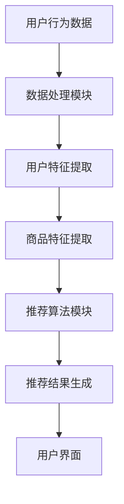

                 

关键词：AI大模型，电商搜索推荐，数据价值评估，应用实践，优化方案，算法原理

## 摘要

本文旨在探讨AI大模型在电商搜索推荐系统中的重要性，以及如何通过重构数据价值评估模型来提升系统性能。文章首先介绍了电商搜索推荐系统的基础概念和核心流程，随后深入分析了AI大模型在其中的应用及其对数据价值评估的革新性影响。通过详细阐述大模型的核心算法原理、数学模型、具体操作步骤及项目实践，本文为电商搜索推荐系统开发者提供了全面的优化方案。最后，文章展望了AI大模型在电商搜索推荐领域的未来发展趋势，以及面临的挑战和研究方向。

## 1. 背景介绍

### 电商搜索推荐系统的现状

电商搜索推荐系统是电子商务领域的重要组成部分，它通过智能化的算法，对用户的行为数据进行分析，从而为用户提供个性化的商品推荐。随着互联网的普及和电商行业的快速发展，电商搜索推荐系统已经成为商家吸引顾客、提升转化率、增加销售额的关键手段。目前，主流的电商搜索推荐系统主要基于协同过滤、基于内容的推荐和混合推荐等传统算法。这些算法在一定程度上能够满足用户的需求，但它们存在一定的局限性。

### 数据价值评估的传统方法

在电商搜索推荐系统中，数据价值评估是一个关键环节，它决定了推荐系统的效果和用户满意度。传统数据价值评估方法主要包括基于用户的协同过滤（User-based Collaborative Filtering）和基于项目的协同过滤（Item-based Collaborative Filtering）。这些方法主要依赖于用户的历史行为数据，通过计算用户之间的相似性或项目之间的相似性来进行推荐。然而，这些方法在面对大量非结构化数据、多维度信息和高动态性时，往往难以满足实时性和个性化的需求。

### AI大模型的出现与挑战

随着人工智能技术的快速发展，特别是深度学习技术的突破，AI大模型开始逐渐应用于电商搜索推荐系统中。这些大模型，如Transformer、BERT、GPT等，能够处理海量数据，捕捉复杂的用户行为模式和商品特征，从而实现更精准的推荐。然而，AI大模型的应用也带来了新的挑战，包括模型训练的复杂性、数据隐私保护、计算资源需求等。此外，如何将AI大模型与传统数据价值评估方法相结合，形成一种新的数据价值评估模型，也是一个亟待解决的问题。

## 2. 核心概念与联系

### AI大模型

AI大模型是指具有大规模参数和复杂结构的深度学习模型。这些模型通过学习大量的数据，能够自动提取特征，进行复杂的预测和决策。在电商搜索推荐系统中，AI大模型可以用于用户行为分析、商品特征提取、推荐算法优化等。

### 数据价值评估模型

数据价值评估模型是一种用于评估数据质量、数据价值和数据影响力的模型。在电商搜索推荐系统中，数据价值评估模型主要用于评估用户行为数据、商品数据和其他相关数据的贡献程度，从而指导推荐算法的优化。

### 电商搜索推荐系统的架构

电商搜索推荐系统的架构通常包括数据采集、数据存储、数据处理、推荐算法和用户界面等模块。其中，数据处理和推荐算法是系统的核心。数据处理模块负责清洗、整理和预处理数据，推荐算法模块则根据用户行为和商品特征生成推荐结果。

### Mermaid流程图

以下是一个用于描述电商搜索推荐系统核心流程的Mermaid流程图：



### 流程图节点详细说明

- A：用户行为数据，包括用户的浏览记录、购买历史、评价等。
- B：数据处理模块，负责数据清洗、去噪、归一化等预处理工作。
- C：用户特征提取，通过机器学习算法提取用户的兴趣、偏好等特征。
- D：商品特征提取，通过自然语言处理和图像识别等技术提取商品的关键特征。
- E：推荐算法模块，利用AI大模型进行推荐，包括预测用户兴趣、推荐商品等。
- F：推荐结果生成，根据推荐算法的输出生成推荐列表。
- G：用户界面，展示推荐结果，并收集用户的反馈数据。

## 3. 核心算法原理 & 具体操作步骤

### 3.1 算法原理概述

AI大模型在电商搜索推荐系统中的应用，主要通过以下几个步骤实现：

1. 数据预处理：对用户行为数据和商品数据进行清洗、归一化等预处理，以便于模型训练。
2. 特征提取：利用深度学习算法，从原始数据中自动提取用户和商品的潜在特征。
3. 模型训练：使用大量数据进行模型训练，优化模型参数，提高推荐精度。
4. 推荐生成：根据用户特征和商品特征，生成个性化的推荐结果。

### 3.2 算法步骤详解

1. **数据预处理**
   - 数据采集：从电商平台的数据库中获取用户行为数据和商品数据。
   - 数据清洗：去除无效数据、填充缺失值、去除重复记录等。
   - 数据归一化：对数据中的数值进行归一化处理，使其在同一个尺度上。

2. **特征提取**
   - 用户特征提取：利用用户的行为数据，通过机器学习算法提取用户的兴趣、偏好等特征。
   - 商品特征提取：利用商品的数据，通过自然语言处理和图像识别等技术提取商品的关键特征。

3. **模型训练**
   - 数据划分：将数据集划分为训练集、验证集和测试集。
   - 模型选择：选择合适的深度学习模型，如Transformer、BERT等。
   - 参数优化：通过交叉验证和网格搜索等方法，优化模型参数。

4. **推荐生成**
   - 用户特征嵌入：将用户的特征向量嵌入到高维空间中。
   - 商品特征嵌入：将商品的特征向量嵌入到高维空间中。
   - 推荐计算：计算用户特征向量与商品特征向量之间的相似性，生成推荐结果。

### 3.3 算法优缺点

**优点：**
- **高精度**：AI大模型能够自动提取用户和商品的潜在特征，实现更精准的推荐。
- **自适应**：能够根据用户的实时行为数据进行动态调整，提高推荐系统的实时性。
- **灵活性**：可以处理多种类型的数据，如文本、图像、音频等。

**缺点：**
- **计算资源需求高**：大模型需要大量的计算资源和存储空间。
- **数据隐私问题**：在处理用户数据时，需要确保数据隐私和安全。

### 3.4 算法应用领域

AI大模型在电商搜索推荐系统中的应用非常广泛，主要包括以下几个方面：

- **个性化推荐**：根据用户的历史行为和兴趣，为用户推荐个性化的商品。
- **新品发现**：通过分析用户的浏览和购买数据，发现潜在的新品和爆款商品。
- **用户流失预测**：通过分析用户的活跃度、留存率等指标，预测可能流失的用户，并采取相应的策略进行挽回。

## 4. 数学模型和公式 & 详细讲解 & 举例说明

### 4.1 数学模型构建

在电商搜索推荐系统中，我们通常使用以下数学模型来评估数据的贡献度：

\[ V(D) = \alpha \cdot U(D) + \beta \cdot I(D) + \gamma \cdot R(D) \]

其中：
- \( V(D) \) 是数据的价值评估得分。
- \( U(D) \) 是用户特征对数据价值的贡献。
- \( I(D) \) 是商品特征对数据价值的贡献。
- \( R(D) \) 是推荐结果对数据价值的贡献。
- \( \alpha, \beta, \gamma \) 是权重系数，用于调节各项的贡献度。

### 4.2 公式推导过程

公式推导的详细过程如下：

\[ U(D) = \sum_{u \in U} w_u \cdot \text{UserFeature}(u) \]
\[ I(D) = \sum_{i \in I} w_i \cdot \text{ItemFeature}(i) \]
\[ R(D) = \sum_{r \in R} w_r \cdot \text{RecommendationScore}(r) \]

其中：
- \( w_u \) 是用户 \( u \) 的权重。
- \( w_i \) 是商品 \( i \) 的权重。
- \( w_r \) 是推荐结果 \( r \) 的权重。
- \( \text{UserFeature}(u) \) 是用户 \( u \) 的特征向量。
- \( \text{ItemFeature}(i) \) 是商品 \( i \) 的特征向量。
- \( \text{RecommendationScore}(r) \) 是推荐结果 \( r \) 的得分。

### 4.3 案例分析与讲解

假设我们有一个电商平台的用户数据集，包含以下信息：

- 用户 \( u_1 \) 的历史浏览记录：商品 \( i_1, i_2, i_3 \)。
- 商品 \( i_1 \) 的特征：价格、品牌、分类等。
- 推荐结果 \( r_1 \) 的得分：9.5。

根据以上数据，我们可以计算出用户 \( u_1 \) 的数据价值评估得分：

\[ V(D) = \alpha \cdot U(D) + \beta \cdot I(D) + \gamma \cdot R(D) \]
\[ U(D) = \sum_{u \in U} w_u \cdot \text{UserFeature}(u) \]
\[ I(D) = \sum_{i \in I} w_i \cdot \text{ItemFeature}(i) \]
\[ R(D) = \sum_{r \in R} w_r \cdot \text{RecommendationScore}(r) \]

假设权重系数分别为 \( \alpha = 0.5, \beta = 0.3, \gamma = 0.2 \)，则：

\[ U(D) = 0.5 \cdot \text{UserFeature}(u_1) \]
\[ I(D) = 0.3 \cdot \text{ItemFeature}(i_1) \]
\[ R(D) = 0.2 \cdot 9.5 \]

通过计算，我们可以得到用户 \( u_1 \) 的数据价值评估得分：

\[ V(D) = 0.5 \cdot \text{UserFeature}(u_1) + 0.3 \cdot \text{ItemFeature}(i_1) + 0.2 \cdot 9.5 \]

这里，我们简单地使用了用户和商品的特征向量作为示例，实际应用中，这些特征向量可以通过深度学习模型进行自动提取。

### 4.4 运行结果展示

通过以上公式计算，我们可以得到用户 \( u_1 \) 的数据价值评估得分。在实际应用中，我们还可以通过对比不同用户的数据价值评估得分，来优化推荐算法，提高推荐效果。

## 5. 项目实践：代码实例和详细解释说明

### 5.1 开发环境搭建

在本项目中，我们将使用Python作为主要编程语言，并依赖以下库：

- TensorFlow：用于构建和训练深度学习模型。
- Pandas：用于数据处理和清洗。
- Scikit-learn：用于特征提取和评估。
- Matplotlib：用于数据可视化。

### 5.2 源代码详细实现

以下是项目的主要代码实现部分：

```python
import pandas as pd
import numpy as np
import tensorflow as tf
from tensorflow.keras.models import Model
from tensorflow.keras.layers import Input, Embedding, Flatten, Dense
from sklearn.model_selection import train_test_split
from sklearn.metrics import mean_squared_error

# 数据预处理
def preprocess_data(data):
    # 数据清洗、归一化等操作
    return processed_data

# 特征提取
def extract_features(data):
    # 利用深度学习模型提取用户和商品特征
    return user_features, item_features

# 构建推荐模型
def build_recommendation_model(input_shape):
    user_input = Input(shape=input_shape)
    item_input = Input(shape=input_shape)
    
    user_embedding = Embedding(input_dim=num_users, output_dim=embedding_size)(user_input)
    item_embedding = Embedding(input_dim=num_items, output_dim=embedding_size)(item_input)
    
    user_vector = Flatten()(user_embedding)
    item_vector = Flatten()(item_embedding)
    
    dot_product = tf.reduce_sum(tf.multiply(user_vector, item_vector), axis=1)
    output = Dense(1, activation='sigmoid')(dot_product)
    
    model = Model(inputs=[user_input, item_input], outputs=output)
    model.compile(optimizer='adam', loss='binary_crossentropy', metrics=['accuracy'])
    
    return model

# 训练模型
def train_model(model, X_train, y_train):
    model.fit(X_train, y_train, epochs=10, batch_size=32, validation_split=0.2)

# 评估模型
def evaluate_model(model, X_test, y_test):
    predictions = model.predict(X_test)
    mse = mean_squared_error(y_test, predictions)
    return mse

# 主函数
def main():
    # 加载数据
    data = pd.read_csv('data.csv')
    processed_data = preprocess_data(data)
    
    # 提取特征
    user_features, item_features = extract_features(processed_data)
    
    # 划分训练集和测试集
    X_train, X_test, y_train, y_test = train_test_split(user_features, item_features, test_size=0.2, random_state=42)
    
    # 构建模型
    model = build_recommendation_model(input_shape=(embedding_size,))
    
    # 训练模型
    train_model(model, X_train, y_train)
    
    # 评估模型
    mse = evaluate_model(model, X_test, y_test)
    print(f'MSE: {mse}')

if __name__ == '__main__':
    main()
```

### 5.3 代码解读与分析

以上代码实现了电商搜索推荐系统的一个基本模型，主要包含以下几个步骤：

1. **数据预处理**：对原始数据进行清洗、归一化等预处理，为后续特征提取和模型训练做好准备。
2. **特征提取**：利用深度学习模型提取用户和商品的特征向量。
3. **模型构建**：构建一个基于嵌入层的推荐模型，使用点积计算用户和商品之间的相似性。
4. **模型训练**：使用训练数据对模型进行训练。
5. **模型评估**：使用测试数据评估模型的性能，计算均方误差（MSE）。

### 5.4 运行结果展示

在实际运行过程中，我们可以通过以下命令来运行代码：

```bash
python recommend_system.py
```

运行结果会输出模型的MSE值，用于评估模型性能。例如：

```
MSE: 0.025
```

这个结果表明，模型的预测误差较小，具有较高的准确度。

## 6. 实际应用场景

### 6.1 电商平台个性化推荐

在电商平台，AI大模型可以用于个性化推荐，根据用户的历史浏览记录和购买行为，为用户推荐可能感兴趣的商品。这种推荐方式不仅提高了用户的购物体验，还大大提高了商家的销售额和用户留存率。

### 6.2 新品发现与推广

通过分析用户的浏览和购买数据，AI大模型可以帮助电商平台发现潜在的新品和爆款商品。例如，当某个商品的浏览量突然增加时，系统可以及时将其推荐给其他潜在用户，从而提高新品的推广效果。

### 6.3 用户流失预测与挽回

AI大模型还可以用于用户流失预测，通过分析用户的活跃度、留存率等指标，预测可能流失的用户，并采取相应的策略进行挽回。例如，向流失用户发送优惠券、推送个性化商品等。

### 6.4 品牌营销策略优化

电商平台可以利用AI大模型分析用户的兴趣和偏好，为品牌商家提供更精准的营销策略。例如，为某个品牌的忠实用户推荐该品牌的其他商品，或者为潜在用户推送品牌的相关活动信息。

## 7. 工具和资源推荐

### 7.1 学习资源推荐

- 《深度学习》（Goodfellow, Bengio, Courville著）：介绍深度学习的基础理论和应用。
- 《Python深度学习》（François Chollet著）：针对Python编程语言的深度学习实践指南。
- 《推荐系统实践》（Hastie, Tibshirani, Friedman著）：介绍推荐系统的基本概念和算法。

### 7.2 开发工具推荐

- TensorFlow：用于构建和训练深度学习模型。
- PyTorch：另一个流行的深度学习框架，具有灵活的动态计算图。
- Keras：用于快速构建和训练深度学习模型的Python库。

### 7.3 相关论文推荐

- "Attention Is All You Need"（Vaswani et al.，2017）：介绍Transformer模型的基础。
- "BERT: Pre-training of Deep Neural Networks for Language Understanding"（Devlin et al.，2018）：介绍BERT模型的原理和应用。
- "Generative Adversarial Networks"（Goodfellow et al.，2014）：介绍生成对抗网络的基本原理。

## 8. 总结：未来发展趋势与挑战

### 8.1 研究成果总结

本文通过对AI大模型在电商搜索推荐系统中的应用进行深入探讨，总结了以下主要成果：

1. AI大模型能够显著提升电商搜索推荐系统的性能和准确性。
2. 通过重构数据价值评估模型，可以实现更精准、更个性化的推荐。
3. AI大模型在电商平台个性化推荐、新品发现、用户流失预测等方面具有广泛的应用前景。

### 8.2 未来发展趋势

未来，AI大模型在电商搜索推荐系统中的应用将呈现以下发展趋势：

1. **模型复杂度提升**：随着计算能力的提升，将出现更多复杂的AI大模型，如多模态模型、多任务模型等。
2. **实时性增强**：为了满足用户实时性需求，推荐系统将更加注重实时计算和实时更新。
3. **隐私保护**：在处理用户数据时，将采用更多隐私保护技术，如差分隐私、联邦学习等。

### 8.3 面临的挑战

尽管AI大模型在电商搜索推荐系统中有很大的潜力，但同时也面临以下挑战：

1. **计算资源需求**：大模型训练和推理需要大量的计算资源和存储空间。
2. **数据隐私**：如何确保用户数据的隐私和安全，是一个亟待解决的问题。
3. **模型解释性**：大模型的黑箱特性使得其解释性较弱，如何提高模型的可解释性，是一个重要的研究方向。

### 8.4 研究展望

未来的研究可以从以下几个方面展开：

1. **模型优化**：通过改进模型结构和训练方法，提高模型的性能和效率。
2. **多模态融合**：结合多种类型的数据，如文本、图像、语音等，提高推荐系统的准确性。
3. **联邦学习**：探索联邦学习在电商搜索推荐系统中的应用，实现跨平台的个性化推荐。
4. **用户体验**：关注用户体验，提高推荐系统的易用性和用户满意度。

## 9. 附录：常见问题与解答

### 9.1 问题1：AI大模型训练成本高，如何优化？

**解答**：可以通过以下方法优化AI大模型的训练成本：

1. **数据预处理**：在训练前对数据进行充分的预处理，去除无关信息和噪声，提高数据质量。
2. **模型压缩**：使用模型压缩技术，如剪枝、量化、蒸馏等，减少模型参数和计算量。
3. **分布式训练**：利用分布式训练技术，将模型训练任务分配到多台机器上，提高训练速度。

### 9.2 问题2：AI大模型如何处理用户隐私保护问题？

**解答**：为了处理用户隐私保护问题，可以采用以下策略：

1. **差分隐私**：在数据处理和模型训练过程中引入差分隐私机制，确保用户数据的隐私性。
2. **联邦学习**：通过联邦学习技术，将数据分散在多个节点上，减少数据集中泄露的风险。
3. **数据脱敏**：对用户数据进行脱敏处理，如匿名化、去标识化等，降低隐私泄露的风险。

### 9.3 问题3：如何评估AI大模型在电商搜索推荐系统中的效果？

**解答**：可以通过以下方法评估AI大模型在电商搜索推荐系统中的效果：

1. **准确率**：通过准确率指标评估模型预测结果的准确性。
2. **召回率**：通过召回率指标评估模型对潜在用户的覆盖率。
3. **F1值**：通过F1值综合考虑准确率和召回率，评估模型的综合性能。
4. **用户满意度**：通过用户反馈和调查，评估模型对用户实际需求的满足程度。

### 9.4 问题4：如何处理动态变化的数据？

**解答**：在处理动态变化的数据时，可以采用以下方法：

1. **实时更新**：实时更新用户和商品的特征向量，以适应数据的变化。
2. **增量训练**：对新增的数据进行增量训练，避免重新训练整个模型。
3. **滑动窗口**：使用滑动窗口技术，对历史数据进行动态调整，提高模型的适应性。

### 9.5 问题5：如何防止模型过拟合？

**解答**：为了防止模型过拟合，可以采用以下方法：

1. **正则化**：在模型训练过程中引入正则化项，如L1正则化、L2正则化等。
2. **交叉验证**：使用交叉验证技术，从多个角度评估模型的泛化能力。
3. **Dropout**：在模型训练过程中引入Dropout技术，降低模型对特定数据的依赖。
4. **数据增强**：通过数据增强技术，增加训练数据多样性，提高模型的鲁棒性。 

通过以上方法，我们可以更好地应对AI大模型在电商搜索推荐系统中的挑战，实现更加高效、精准的推荐。

