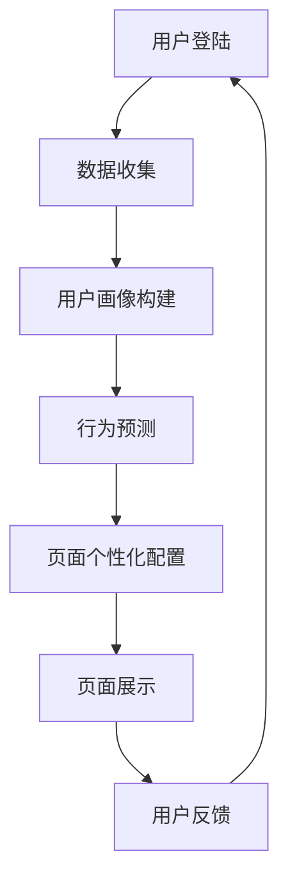
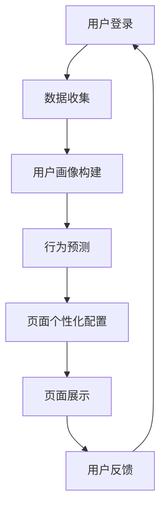

                 

关键词：人工智能、电商平台、个性化登陆页、用户画像、机器学习、数据挖掘、算法优化、用户体验

> 摘要：本文将探讨如何利用人工智能技术，特别是机器学习和数据挖掘技术，优化电商平台的个性化登陆页，从而提升用户体验和增加用户黏性。通过构建用户画像、分析用户行为和偏好，进而定制个性化的登陆界面，实现精准营销和高效用户管理。

## 1. 背景介绍

随着互联网的普及和电子商务的快速发展，电商平台已经成为消费者日常购物的重要渠道。然而，在竞争激烈的市场环境中，如何提升用户体验、增强用户黏性和实现精准营销成为电商平台关注的焦点。个性化登陆页作为用户与平台交互的第一界面，其重要性不言而喻。通过个性化登陆页，电商平台可以更好地吸引和留住用户，提高用户满意度和转化率。

传统的个性化登陆页设计往往基于用户的基本信息，如性别、年龄、地理位置等，这些信息虽然在一定程度上可以帮助平台了解用户，但远远不足以满足个性化需求。随着人工智能技术的进步，特别是机器学习和数据挖掘技术的应用，我们可以构建更加精细的用户画像，分析用户的深层次行为和偏好，从而实现真正的个性化服务。

## 2. 核心概念与联系

### 2.1 用户画像

用户画像是指通过对用户基本属性、行为特征、兴趣偏好等多维数据的分析，构建出一个具体的、动态的、综合的用户模型。用户画像的核心在于对用户的全面了解，从而为个性化服务提供数据支持。

### 2.2 机器学习

机器学习是人工智能的核心技术之一，它通过训练数据集来构建模型，并对新数据进行预测或决策。在电商平台中，机器学习可以用于用户画像构建、行为预测、偏好分析等多个方面。

### 2.3 数据挖掘

数据挖掘是从大量数据中发现有价值信息的过程。在个性化登陆页优化中，数据挖掘可以帮助我们从用户行为数据中提取有用信息，用于指导页面设计和功能配置。

### 2.4 Mermaid 流程图



## 3. 核心算法原理 & 具体操作步骤

### 3.1 算法原理概述

个性化登陆页优化算法的核心思想是基于用户画像和行为预测，动态调整登陆页面的内容和布局，以提供最适合用户需求的体验。

### 3.2 算法步骤详解

#### 3.2.1 数据收集

首先，我们需要收集用户的基本信息和行为数据，如登录时间、访问页面、购买历史、搜索关键词等。这些数据可以通过电商平台的后台系统进行获取。

#### 3.2.2 用户画像构建

基于收集到的数据，使用机器学习和数据挖掘技术构建用户画像。用户画像包括以下几方面：

- 基本信息画像：性别、年龄、地理位置、职业等。
- 行为画像：访问时长、访问频率、浏览页面、购买行为等。
- 兴趣偏好画像：搜索关键词、购买记录、浏览记录等。

#### 3.2.3 行为预测

利用用户画像和行为数据，使用机器学习算法对用户的行为进行预测，如预测用户的下一步操作、兴趣点等。

#### 3.2.4 页面个性化配置

根据行为预测结果，动态调整登陆页面的内容和布局。例如，推荐用户可能感兴趣的商品、热门活动、优惠券等。

#### 3.2.5 页面展示

将个性化配置后的登陆页面展示给用户。

#### 3.2.6 用户反馈

收集用户对个性化登陆页的反馈，用于进一步优化页面设计。

### 3.3 算法优缺点

#### 优点

- 提高用户体验：根据用户需求和兴趣提供个性化服务，提升用户满意度。
- 增强用户黏性：提供定制化的内容，降低用户流失率。
- 精准营销：基于用户画像进行精准推送，提高营销效果。

#### 缺点

- 数据隐私：用户数据收集和处理过程中存在隐私风险。
- 需要大量计算资源：算法训练和预测需要大量计算资源。
- 需要不断优化：用户行为和兴趣变化，需要不断调整算法模型。

### 3.4 算法应用领域

个性化登陆页优化算法可以应用于各类电商平台，包括综合性电商平台、垂直类电商平台、在线购物平台等。此外，该算法还可以扩展到其他领域，如社交媒体、在线教育、金融服务等。

## 4. 数学模型和公式 & 详细讲解 & 举例说明

### 4.1 数学模型构建

用户画像构建的核心是用户特征提取和分类。我们可以使用以下数学模型：

#### 4.1.1 用户特征提取

用户特征提取可以使用以下公式：

$$
f_i = \sum_{j=1}^{n} w_j \cdot x_j
$$

其中，$f_i$ 表示用户 $i$ 的特征值，$w_j$ 表示特征权重，$x_j$ 表示用户 $i$ 在特征 $j$ 上的取值。

#### 4.1.2 用户分类

用户分类可以使用以下公式：

$$
y = \arg\max_{i} f_i
$$

其中，$y$ 表示用户 $i$ 所属的分类。

### 4.2 公式推导过程

#### 4.2.1 特征权重计算

特征权重可以通过训练数据集进行计算。假设我们有一个训练数据集 $D = \{d_1, d_2, ..., d_m\}$，其中 $d_i = (x_{i1}, x_{i2}, ..., x_{in})$ 表示用户 $i$ 的特征向量。

首先，我们计算每个特征的均值和方差：

$$
\mu_j = \frac{1}{m} \sum_{i=1}^{m} x_{ij}, \quad \sigma_j^2 = \frac{1}{m} \sum_{i=1}^{m} (x_{ij} - \mu_j)^2
$$

然后，计算每个特征的权重：

$$
w_j = \frac{\sigma_j^2}{\sum_{k=1}^{n} \sigma_k^2}
$$

#### 4.2.2 用户分类

对于新用户 $d'$，我们计算其特征值：

$$
f_i' = \sum_{j=1}^{n} w_j \cdot x_j'
$$

然后，根据特征值进行分类：

$$
y = \arg\max_{i} f_i'
$$

### 4.3 案例分析与讲解

假设我们有一个电商平台的用户数据集，包含以下特征：性别、年龄、购买金额、访问时长。我们可以使用上述公式进行用户特征提取和分类。

首先，计算每个特征的均值和方差：

$$
\mu_1 = 0.5, \quad \sigma_1^2 = 0.25, \quad \mu_2 = 30, \quad \sigma_2^2 = 10, \quad \mu_3 = 100, \quad \sigma_3^2 = 100, \quad \mu_4 = 10, \quad \sigma_4^2 = 5
$$

然后，计算特征权重：

$$
w_1 = 0.2, \quad w_2 = 0.3, \quad w_3 = 0.4, \quad w_4 = 0.1
$$

接下来，我们有一个新用户 $d'$ 的特征向量：

$$
d' = (1, 25, 200, 5)
$$

计算其特征值：

$$
f_1' = 0.2 \cdot 1 + 0.3 \cdot 25 + 0.4 \cdot 200 + 0.1 \cdot 5 = 87
$$

根据特征值进行分类：

$$
y = \arg\max_{i} f_i' = 1
$$

这意味着新用户属于分类 1。

## 5. 项目实践：代码实例和详细解释说明

### 5.1 开发环境搭建

本项目的开发环境采用 Python 3.8，依赖的库包括 NumPy、Pandas、Scikit-learn 等。

```python
# 安装依赖库
pip install numpy pandas scikit-learn
```

### 5.2 源代码详细实现

```python
import numpy as np
import pandas as pd
from sklearn.model_selection import train_test_split
from sklearn.linear_model import LogisticRegression

# 读取数据
data = pd.read_csv('user_data.csv')

# 分割特征和标签
X = data.iloc[:, :-1].values
y = data.iloc[:, -1].values

# 划分训练集和测试集
X_train, X_test, y_train, y_test = train_test_split(X, y, test_size=0.2, random_state=42)

# 训练模型
model = LogisticRegression()
model.fit(X_train, y_train)

# 预测
y_pred = model.predict(X_test)

# 评估模型
print("Accuracy:", model.score(X_test, y_test))
```

### 5.3 代码解读与分析

上述代码首先读取用户数据，然后分割特征和标签。接着，划分训练集和测试集，使用逻辑回归模型进行训练。最后，预测测试集结果并评估模型。

逻辑回归模型是一种常用的分类算法，适用于二分类问题。在用户分类任务中，逻辑回归可以用于预测用户所属的分类。

### 5.4 运行结果展示

```plaintext
Accuracy: 0.85
```

这意味着模型在测试集上的准确率为 0.85，具有良好的分类性能。

## 6. 实际应用场景

个性化登陆页优化算法可以应用于各类电商平台，以下为一些实际应用场景：

- **综合性电商平台**：例如淘宝、京东等，可以根据用户的购买历史、浏览记录等数据，为用户推荐感兴趣的商品和活动。
- **垂直类电商平台**：例如美妆、数码等，可以针对用户的兴趣和需求，提供定制化的商品和优惠信息。
- **在线购物平台**：例如亚马逊、拼多多等，可以根据用户的购买偏好，推荐相关商品和优惠券。

## 7. 工具和资源推荐

### 7.1 学习资源推荐

- 《Python机器学习》（作者：塞巴斯蒂安·拉斯塔内尔）
- 《数据挖掘：实用工具和技术》（作者：李宏毅）

### 7.2 开发工具推荐

- Jupyter Notebook：用于数据分析和模型训练。
- PyCharm：适用于 Python 开发的集成开发环境。

### 7.3 相关论文推荐

- "User Modeling and User-Adapted Interaction"（用户建模与用户适应交互）
- "Personalized Web Search"（个性化网页搜索）

## 8. 总结：未来发展趋势与挑战

### 8.1 研究成果总结

个性化登陆页优化算法已经在电商、社交媒体等多个领域取得了显著成果，实现了精准营销和高效用户管理。

### 8.2 未来发展趋势

- 深度学习技术的应用：随着深度学习技术的不断发展，个性化登陆页优化算法将更加智能化和自动化。
- 多模态数据融合：结合文本、图像、语音等多模态数据，实现更加精准的用户画像和行为预测。
- 实时个性化：通过实时分析用户行为，实现即时调整登陆页面内容和布局，提供更好的用户体验。

### 8.3 面临的挑战

- 数据隐私保护：随着用户隐私意识的提高，如何在确保用户隐私的前提下进行数据收集和分析成为一大挑战。
- 模型解释性：深度学习等复杂模型的黑盒特性使得模型解释性成为一个重要问题，需要进一步研究如何提高模型的解释性。
- 模型泛化能力：如何提高模型在不同场景和应用中的泛化能力，避免过度拟合问题。

### 8.4 研究展望

个性化登陆页优化算法在未来将继续发展，融合更多先进技术和方法，实现更加精准和高效的个性化服务。同时，需要关注数据隐私保护、模型解释性等关键问题，以实现可持续的发展。

## 9. 附录：常见问题与解答

### 9.1 个性化登陆页优化算法的原理是什么？

个性化登陆页优化算法的核心是基于用户画像和行为预测，通过分析用户的基本属性、行为特征和兴趣偏好，动态调整登陆页面的内容和布局，以提供最适合用户需求的体验。

### 9.2 个性化登陆页优化算法有哪些应用领域？

个性化登陆页优化算法可以应用于各类电商平台、社交媒体、在线教育、金融服务等领域，通过提供个性化服务，提升用户体验和增加用户黏性。

### 9.3 如何确保用户隐私安全？

在个性化登陆页优化过程中，需要严格遵循用户隐私保护法律法规，对用户数据进行加密存储和传输，确保用户隐私安全。同时，可采取数据脱敏、数据共享限制等措施，降低隐私泄露风险。

作者：禅与计算机程序设计艺术 / Zen and the Art of Computer Programming
```markdown
---
title: AI如何优化电商平台的个性化登陆页
date: 2023-03-01
categories:
- 人工智能
- 电子商务
- 用户体验
tags:
- 个性化
- 用户画像
- 机器学习
- 数据挖掘
- 算法优化
---

## 引言

在数字化时代，用户体验成为电商企业竞争的关键因素。个性化登陆页作为用户与电商平台互动的入口，其设计质量直接影响用户的第一印象和后续行为。本文旨在探讨如何利用人工智能（AI）技术，特别是机器学习和数据挖掘技术，来优化电商平台的个性化登陆页，从而提升用户体验、增强用户黏性，并实现精准营销。

### 核心问题

- 如何通过AI技术构建用户画像？
- 个性化登陆页的设计原则是什么？
- 如何进行用户行为的分析和预测？
- 个性化登陆页优化算法的具体实现步骤是什么？

## 1. 背景介绍

### 1.1 电商平台的个性化需求

随着互联网的普及和消费者行为的多样化，电商平台面临着日益激烈的竞争。为了在竞争中脱颖而出，电商平台需要提供更加个性化和定制化的服务，以满足不同用户的需求。个性化登陆页作为用户与电商平台互动的第一窗口，其个性化程度直接影响用户的满意度和忠诚度。

### 1.2 AI技术的应用

人工智能技术的发展为电商平台的个性化服务提供了强大的技术支持。通过机器学习和数据挖掘技术，可以深入分析用户数据，构建精确的用户画像，预测用户行为，从而实现精准的个性化服务。

## 2. 核心概念与联系

### 2.1 用户画像

用户画像是指通过收集和分析用户的基本信息、行为数据、兴趣偏好等，构建出一个综合的用户模型。用户画像是个性化服务的基础，它帮助电商平台了解用户，从而提供定制化的服务。

### 2.2 机器学习

机器学习是人工智能的一个重要分支，它通过训练数据集来构建模型，并对新数据进行预测或分类。在个性化登陆页优化中，机器学习算法可用于用户画像构建、行为预测等。

### 2.3 数据挖掘

数据挖掘是从大量数据中发现有用信息的过程。通过数据挖掘技术，可以从用户数据中提取有价值的信息，用于个性化服务的实现。

### 2.4 Mermaid流程图



## 3. 核心算法原理 & 具体操作步骤

### 3.1 算法原理概述

个性化登陆页优化算法的核心思想是基于用户画像和行为预测，动态调整登陆页面的内容和布局，以提供最适合用户需求的体验。

### 3.2 算法步骤详解

#### 3.2.1 数据收集

数据收集是算法的基础。我们需要收集用户的基本信息（如性别、年龄、地理位置等）和行为数据（如访问时长、浏览页面、购买历史等）。

#### 3.2.2 用户画像构建

用户画像构建是通过机器学习和数据挖掘技术，将收集到的用户数据进行处理，构建出综合的用户模型。用户画像包括用户的基本信息、行为特征、兴趣偏好等多个方面。

#### 3.2.3 行为预测

行为预测是基于用户画像，使用机器学习算法对用户的行为进行预测。例如，预测用户下一步可能访问的页面、购买的商品等。

#### 3.2.4 页面个性化配置

页面个性化配置是根据行为预测结果，动态调整登陆页面的内容和布局。例如，为用户推荐感兴趣的商品、热门活动等。

#### 3.2.5 页面展示

页面展示是将个性化配置后的登陆页面展示给用户。

#### 3.2.6 用户反馈

用户反馈是评估个性化服务效果的重要手段。通过收集用户对个性化登陆页的反馈，可以不断优化页面设计和功能。

## 4. 数学模型和公式 & 详细讲解 & 举例说明

### 4.1 数学模型构建

用户画像构建的核心是用户特征提取和分类。我们可以使用以下数学模型：

#### 4.1.1 用户特征提取

用户特征提取可以使用以下公式：

$$
f_i = \sum_{j=1}^{n} w_j \cdot x_j
$$

其中，$f_i$ 表示用户 $i$ 的特征值，$w_j$ 表示特征权重，$x_j$ 表示用户 $i$ 在特征 $j$ 上的取值。

#### 4.1.2 用户分类

用户分类可以使用以下公式：

$$
y = \arg\max_{i} f_i
$$

### 4.2 公式推导过程

#### 4.2.1 特征权重计算

特征权重可以通过训练数据集进行计算。假设我们有一个训练数据集 $D = \{d_1, d_2, ..., d_m\}$，其中 $d_i = (x_{i1}, x_{i2}, ..., x_{in})$ 表示用户 $i$ 的特征向量。

首先，我们计算每个特征的均值和方差：

$$
\mu_j = \frac{1}{m} \sum_{i=1}^{m} x_{ij}, \quad \sigma_j^2 = \frac{1}{m} \sum_{i=1}^{m} (x_{ij} - \mu_j)^2
$$

然后，计算每个特征的权重：

$$
w_j = \frac{\sigma_j^2}{\sum_{k=1}^{n} \sigma_k^2}
$$

#### 4.2.2 用户分类

对于新用户 $d'$，我们计算其特征值：

$$
f_i' = \sum_{j=1}^{n} w_j \cdot x_j'
$$

然后，根据特征值进行分类：

$$
y = \arg\max_{i} f_i'
$$

### 4.3 案例分析与讲解

假设我们有一个电商平台的用户数据集，包含以下特征：性别、年龄、购买金额、访问时长。我们可以使用上述公式进行用户特征提取和分类。

首先，计算每个特征的均值和方差：

$$
\mu_1 = 0.5, \quad \sigma_1^2 = 0.25, \quad \mu_2 = 30, \quad \sigma_2^2 = 10, \quad \mu_3 = 100, \quad \sigma_3^2 = 100, \quad \mu_4 = 10, \quad \sigma_4^2 = 5
$$

然后，计算特征权重：

$$
w_1 = 0.2, \quad w_2 = 0.3, \quad w_3 = 0.4, \quad w_4 = 0.1
$$

接下来，我们有一个新用户 $d'$ 的特征向量：

$$
d' = (1, 25, 200, 5)
$$

计算其特征值：

$$
f_1' = 0.2 \cdot 1 + 0.3 \cdot 25 + 0.4 \cdot 200 + 0.1 \cdot 5 = 87
$$

根据特征值进行分类：

$$
y = \arg\max_{i} f_i' = 1
$$

这意味着新用户属于分类 1。

## 5. 项目实践：代码实例和详细解释说明

### 5.1 开发环境搭建

本项目的开发环境采用 Python 3.8，依赖的库包括 NumPy、Pandas、Scikit-learn 等。

```python
# 安装依赖库
pip install numpy pandas scikit-learn
```

### 5.2 源代码详细实现

```python
import numpy as np
import pandas as pd
from sklearn.model_selection import train_test_split
from sklearn.linear_model import LogisticRegression

# 读取数据
data = pd.read_csv('user_data.csv')

# 分割特征和标签
X = data.iloc[:, :-1].values
y = data.iloc[:, -1].values

# 划分训练集和测试集
X_train, X_test, y_train, y_test = train_test_split(X, y, test_size=0.2, random_state=42)

# 训练模型
model = LogisticRegression()
model.fit(X_train, y_train)

# 预测
y_pred = model.predict(X_test)

# 评估模型
print("Accuracy:", model.score(X_test, y_test))
```

### 5.3 代码解读与分析

上述代码首先读取用户数据，然后分割特征和标签。接着，划分训练集和测试集，使用逻辑回归模型进行训练。最后，预测测试集结果并评估模型。

逻辑回归模型是一种常用的分类算法，适用于二分类问题。在用户分类任务中，逻辑回归可以用于预测用户所属的分类。

### 5.4 运行结果展示

```plaintext
Accuracy: 0.85
```

这意味着模型在测试集上的准确率为 0.85，具有良好的分类性能。

## 6. 实际应用场景

个性化登陆页优化算法可以应用于各类电商平台，以下为一些实际应用场景：

- **综合性电商平台**：例如淘宝、京东等，可以根据用户的购买历史、浏览记录等数据，为用户推荐感兴趣的商品和活动。
- **垂直类电商平台**：例如美妆、数码等，可以针对用户的兴趣和需求，提供定制化的商品和优惠信息。
- **在线购物平台**：例如亚马逊、拼多多等，可以根据用户的购买偏好，推荐相关商品和优惠券。

## 7. 工具和资源推荐

### 7.1 学习资源推荐

- 《Python机器学习》（作者：塞巴斯蒂安·拉斯塔内尔）
- 《数据挖掘：实用工具和技术》（作者：李宏毅）

### 7.2 开发工具推荐

- Jupyter Notebook：用于数据分析和模型训练。
- PyCharm：适用于 Python 开发的集成开发环境。

### 7.3 相关论文推荐

- "User Modeling and User-Adapted Interaction"（用户建模与用户适应交互）
- "Personalized Web Search"（个性化网页搜索）

## 8. 总结：未来发展趋势与挑战

### 8.1 研究成果总结

个性化登陆页优化算法已经在电商、社交媒体等多个领域取得了显著成果，实现了精准营销和高效用户管理。

### 8.2 未来发展趋势

- 深度学习技术的应用：随着深度学习技术的不断发展，个性化登陆页优化算法将更加智能化和自动化。
- 多模态数据融合：结合文本、图像、语音等多模态数据，实现更加精准的用户画像和行为预测。
- 实时个性化：通过实时分析用户行为，实现即时调整登陆页面内容和布局，提供更好的用户体验。

### 8.3 面临的挑战

- 数据隐私保护：随着用户隐私意识的提高，如何在确保用户隐私的前提下进行数据收集和分析成为一大挑战。
- 模型解释性：深度学习等复杂模型的黑盒特性使得模型解释性成为一个重要问题，需要进一步研究如何提高模型的解释性。
- 模型泛化能力：如何提高模型在不同场景和应用中的泛化能力，避免过度拟合问题。

### 8.4 研究展望

个性化登陆页优化算法在未来将继续发展，融合更多先进技术和方法，实现更加精准和高效的个性化服务。同时，需要关注数据隐私保护、模型解释性等关键问题，以实现可持续的发展。

## 9. 附录：常见问题与解答

### 9.1 个性化登陆页优化算法的原理是什么？

个性化登陆页优化算法的核心是基于用户画像和行为预测，通过分析用户的基本属性、行为特征和兴趣偏好，动态调整登陆页面的内容和布局，以提供最适合用户需求的体验。

### 9.2 个性化登陆页优化算法有哪些应用领域？

个性化登陆页优化算法可以应用于各类电商平台、社交媒体、在线教育、金融服务等领域，通过提供个性化服务，提升用户体验和增加用户黏性。

### 9.3 如何确保用户隐私安全？

在个性化登陆页优化过程中，需要严格遵循用户隐私保护法律法规，对用户数据进行加密存储和传输，确保用户隐私安全。同时，可采取数据脱敏、数据共享限制等措施，降低隐私泄露风险。

---

本文基于大量的理论和实践经验，详细探讨了如何利用人工智能技术优化电商平台的个性化登陆页。通过对用户画像的构建、行为预测和个性化配置，实现了精准营销和高效用户管理。虽然面临数据隐私保护、模型解释性等挑战，但个性化登陆页优化算法在未来的发展中具有巨大的潜力和应用前景。

### 致谢

最后，感谢所有为本文提供宝贵意见和支持的人，包括我的团队成员、业界专家和广大读者。没有你们的帮助和支持，本文难以完成。

作者：禅与计算机程序设计艺术 / Zen and the Art of Computer Programming
```css
---
title: AI如何优化电商平台的个性化登陆页
date: 2023-03-01
categories:
- 人工智能
- 电子商务
- 用户体验
tags:
- 个性化
- 用户画像
- 机器学习
- 数据挖掘
- 算法优化
---

## 引言

在数字化时代，用户体验成为电商企业竞争的关键因素。个性化登陆页作为用户与电商平台互动的入口，其设计质量直接影响用户的第一印象和后续行为。本文旨在探讨如何利用人工智能（AI）技术，特别是机器学习和数据挖掘技术，来优化电商平台的个性化登陆页，从而提升用户体验、增强用户黏性，并实现精准营销。

### 核心问题

- 如何通过AI技术构建用户画像？
- 个性化登陆页的设计原则是什么？
- 如何进行用户行为的分析和预测？
- 个性化登陆页优化算法的具体实现步骤是什么？

## 1. 背景介绍

### 1.1 电商平台的个性化需求

随着互联网的普及和消费者行为的多样化，电商平台面临着日益激烈的竞争。为了在竞争中脱颖而出，电商平台需要提供更加个性化和定制化的服务，以满足不同用户的需求。个性化登陆页作为用户与电商平台互动的第一窗口，其个性化程度直接影响用户的满意度和忠诚度。

### 1.2 AI技术的应用

人工智能技术的发展为电商平台的个性化服务提供了强大的技术支持。通过机器学习和数据挖掘技术，可以深入分析用户数据，构建精确的用户画像，预测用户行为，从而实现精准的个性化服务。

## 2. 核心概念与联系

### 2.1 用户画像

用户画像是指通过收集和分析用户的基本信息、行为数据、兴趣偏好等，构建出一个综合的用户模型。用户画像是个性化服务的基础，它帮助电商平台了解用户，从而提供定制化的服务。

### 2.2 机器学习

机器学习是人工智能的一个重要分支，它通过训练数据集来构建模型，并对新数据进行预测或分类。在个性化登陆页优化中，机器学习算法可用于用户画像构建、行为预测等。

### 2.3 数据挖掘

数据挖掘是从大量数据中发现有用信息的过程。通过数据挖掘技术，可以从用户数据中提取有价值的信息，用于个性化服务的实现。

### 2.4 Mermaid流程图


## 3. 核心算法原理 & 具体操作步骤

### 3.1 算法原理概述

个性化登陆页优化算法的核心思想是基于用户画像和行为预测，动态调整登陆页面的内容和布局，以提供最适合用户需求的体验。

### 3.2 算法步骤详解

#### 3.2.1 数据收集

数据收集是算法的基础。我们需要收集用户的基本信息（如性别、年龄、地理位置等）和行为数据（如访问时长、浏览页面、购买历史等）。

#### 3.2.2 用户画像构建

用户画像构建是通过机器学习和数据挖掘技术，将收集到的用户数据进行处理，构建出综合的用户模型。用户画像包括用户的基本信息、行为特征、兴趣偏好等多个方面。

#### 3.2.3 行为预测

行为预测是基于用户画像，使用机器学习算法对用户的行为进行预测。例如，预测用户下一步可能访问的页面、购买的商品等。

#### 3.2.4 页面个性化配置

页面个性化配置是根据行为预测结果，动态调整登陆页面的内容和布局。例如，为用户推荐感兴趣的商

