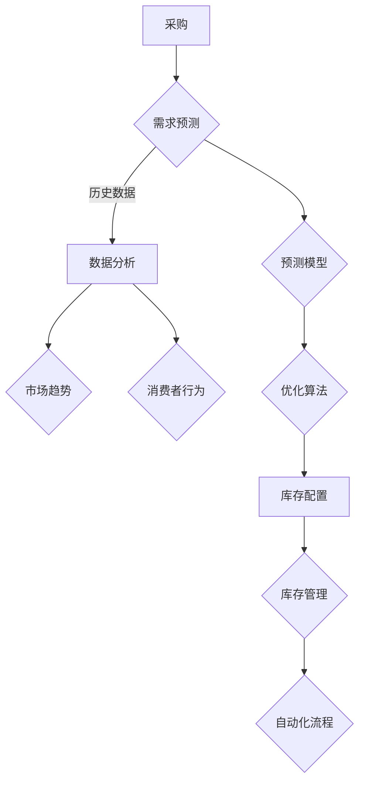

                 

关键词：人工智能，电商平台，库存管理，优化算法，深度学习，预测模型，大数据分析，自动化流程。

> 摘要：本文将探讨人工智能在电商平台库存管理中的应用，通过分析核心概念与联系，核心算法原理，数学模型和公式，项目实践，实际应用场景，工具和资源推荐，以及未来发展趋势与挑战，全面解析AI如何提高电商平台的库存管理效率。

## 1. 背景介绍

随着电子商务的快速发展，库存管理成为电商平台的一项关键任务。库存管理的效率直接影响到平台的运营成本、客户满意度以及整体盈利能力。然而，传统的库存管理方法往往依赖于人为经验和简单的规则，难以适应日益复杂的市场环境和消费者需求。为了解决这一难题，人工智能（AI）技术逐渐成为电商平台库存管理的重要工具。

AI技术，特别是机器学习和深度学习，为电商平台提供了强大的数据处理和分析能力，使得库存管理更加智能化和高效化。通过大数据分析，AI能够预测市场需求，优化库存配置，降低库存成本，提高供应链效率。此外，自动化流程的引入进一步提升了库存管理的速度和准确性。

本文旨在探讨AI在电商平台库存管理中的应用，通过分析核心概念、算法原理、数学模型、实际应用场景等方面，为电商平台的库存管理提供切实可行的优化方案。

## 2. 核心概念与联系

### 2.1. 电商平台库存管理

电商平台库存管理涉及多个环节，包括采购、入库、存储、出库、销售等。有效的库存管理需要平衡库存水平、市场需求和供应能力，以最大化利润和客户满意度。传统的库存管理方法主要依赖于以下核心概念：

1. **需求预测**：基于历史销售数据和市场趋势，预测未来一段时间内的商品需求量。
2. **库存水平**：确定当前库存量和安全库存水平，以防止缺货和过度库存。
3. **库存周转率**：衡量库存流动性，即库存在一个会计周期内被采购和销售的次数。
4. **供应链管理**：优化供应链各环节的运作，提高整体库存管理效率。

### 2.2. 人工智能在库存管理中的应用

人工智能技术在库存管理中的应用主要体现在以下几个方面：

1. **数据挖掘与分析**：通过大数据技术挖掘和分析历史销售数据、市场趋势和消费者行为，为需求预测提供支持。
2. **预测模型**：利用机器学习和深度学习算法建立预测模型，对市场需求进行准确预测。
3. **优化算法**：通过优化算法调整库存配置，降低库存成本，提高库存周转率。
4. **自动化流程**：利用自动化技术实现库存管理的自动化操作，减少人工干预，提高管理效率。

### 2.3. Mermaid 流程图

为了更好地理解核心概念和联系，我们使用Mermaid流程图展示电商平台库存管理的主要流程：



## 3. 核心算法原理 & 具体操作步骤

### 3.1. 算法原理概述

电商平台库存管理中的核心算法主要分为需求预测算法和优化算法。需求预测算法用于预测未来一段时间内的商品需求量，以指导库存配置；优化算法则用于调整库存水平，降低库存成本。

#### 3.1.1. 需求预测算法

需求预测算法主要利用机器学习和深度学习技术，通过训练模型来预测市场需求。常见的算法包括：

1. **线性回归**：通过分析历史销售数据，建立线性关系模型，预测未来需求。
2. **ARIMA模型**：自回归积分滑动平均模型，适用于时间序列数据的预测。
3. **神经网络**：通过多层神经网络模型，自动学习历史数据中的复杂关系，进行需求预测。

#### 3.1.2. 优化算法

优化算法主要用于库存配置和调整，以实现库存成本的最低化。常见的算法包括：

1. **最小二乘法**：用于线性规划问题，优化库存配置。
2. **遗传算法**：模拟生物进化过程，优化库存配置。
3. **模拟退火算法**：通过模拟物理退火过程，优化库存配置。

### 3.2. 算法步骤详解

#### 3.2.1. 需求预测算法步骤

1. 数据收集与预处理：收集历史销售数据、市场趋势和消费者行为数据，进行数据清洗和预处理。
2. 特征工程：提取关键特征，如季节性、促销活动、节假日等，用于训练预测模型。
3. 模型训练与验证：利用训练集数据训练预测模型，并在验证集上进行验证，调整模型参数。
4. 预测与评估：使用训练好的模型进行需求预测，并评估预测结果的准确性。

#### 3.2.2. 优化算法步骤

1. 确定目标函数：根据库存管理目标，定义优化目标函数，如库存成本最低化或库存周转率最高化。
2. 确定决策变量：确定影响目标函数的决策变量，如库存量、采购量、出库量等。
3. 求解优化问题：利用优化算法求解最优决策变量，实现库存配置优化。
4. 模型评估与调整：评估优化结果，根据实际情况进行模型调整和优化。

### 3.3. 算法优缺点

#### 需求预测算法优缺点

- **线性回归**：简单易用，但对非线性关系表现较差；对异常值敏感。
- **ARIMA模型**：适用于时间序列数据，但参数选择和模型诊断较为复杂。
- **神经网络**：能够处理非线性关系，但训练过程复杂，容易过拟合。

#### 优化算法优缺点

- **最小二乘法**：适用于线性规划问题，但无法处理非线性问题。
- **遗传算法**：适用于复杂优化问题，但计算时间较长，需要大量迭代。
- **模拟退火算法**：适用于大规模复杂优化问题，但收敛速度较慢。

### 3.4. 算法应用领域

- **需求预测算法**：广泛应用于电商、零售、制造业等领域，用于预测市场需求和库存水平。
- **优化算法**：广泛应用于供应链管理、物流优化、资源调度等领域，用于实现库存配置和调整。

## 4. 数学模型和公式 & 详细讲解 & 举例说明

### 4.1. 数学模型构建

电商平台库存管理中的数学模型主要包括需求预测模型和优化模型。

#### 4.1.1. 需求预测模型

需求预测模型通常采用时间序列分析方法，其中ARIMA模型是一种常见的选择。ARIMA模型由三个部分组成：自回归（AR）、差分（I）和移动平均（MA）。

1. **自回归（AR）**：根据历史数据值预测未来值，公式为：
   $$
   Y_t = c + \phi_1 Y_{t-1} + \phi_2 Y_{t-2} + \cdots + \phi_p Y_{t-p} + \varepsilon_t
   $$
   其中，$Y_t$为时间序列数据，$c$为常数项，$\phi_1, \phi_2, \cdots, \phi_p$为自回归系数，$\varepsilon_t$为随机误差项。

2. **差分（I）**：对时间序列数据进行差分处理，消除趋势性和季节性，公式为：
   $$
   \Delta Y_t = Y_t - Y_{t-1}
   $$

3. **移动平均（MA）**：根据历史预测误差值预测未来值，公式为：
   $$
   Y_t = c + \theta_1 \varepsilon_{t-1} + \theta_2 \varepsilon_{t-2} + \cdots + \theta_q \varepsilon_{t-q} + \varepsilon_t
   $$
   其中，$\theta_1, \theta_2, \cdots, \theta_q$为移动平均系数。

#### 4.1.2. 优化模型

优化模型通常采用线性规划或非线性规划方法。以下是一个简单的线性规划模型：

1. **目标函数**：最小化总库存成本：
   $$
   \min Z = \sum_{i=1}^{n} c_i x_i
   $$
   其中，$c_i$为商品$i$的库存成本，$x_i$为商品$i$的库存量。

2. **约束条件**：
   $$
   \begin{cases}
   \sum_{i=1}^{n} x_i \leq B & \text{（总库存量不超过限制）} \\
   x_i \geq 0 & \text{（库存量非负）}
   \end{cases}
   $$
   其中，$B$为总库存量限制。

### 4.2. 公式推导过程

#### 4.2.1. 需求预测模型推导

以ARIMA模型为例，推导过程如下：

1. **自回归（AR）**：
   $$
   Y_t = c + \phi_1 Y_{t-1} + \phi_2 Y_{t-2} + \cdots + \phi_p Y_{t-p} + \varepsilon_t
   $$

2. **差分（I）**：
   $$
   \Delta Y_t = Y_t - Y_{t-1}
   $$
   对差分后的序列进行建模，假设差分后的序列为$Z_t$，则有：
   $$
   Z_t = \phi_1 Z_{t-1} + \varepsilon_t
   $$

3. **移动平均（MA）**：
   $$
   Y_t = c + \theta_1 \varepsilon_{t-1} + \theta_2 \varepsilon_{t-2} + \cdots + \theta_q \varepsilon_{t-q} + \varepsilon_t
   $$

   结合自回归和移动平均，得到ARIMA模型：
   $$
   Y_t = c + \phi_1 Y_{t-1} + \phi_2 Y_{t-2} + \cdots + \phi_p Y_{t-p} + \theta_1 \varepsilon_{t-1} + \theta_2 \varepsilon_{t-2} + \cdots + \theta_q \varepsilon_{t-q} + \varepsilon_t
   $$

#### 4.2.2. 优化模型推导

以线性规划模型为例，推导过程如下：

1. **目标函数**：
   $$
   \min Z = \sum_{i=1}^{n} c_i x_i
   $$

   其中，$c_i$为商品$i$的库存成本，$x_i$为商品$i$的库存量。

2. **约束条件**：
   $$
   \begin{cases}
   \sum_{i=1}^{n} x_i \leq B & \text{（总库存量不超过限制）} \\
   x_i \geq 0 & \text{（库存量非负）}
   \end{cases}
   $$
   其中，$B$为总库存量限制。

### 4.3. 案例分析与讲解

#### 4.3.1. 需求预测案例

假设某电商平台经营商品A，历史销售数据如下表：

| 月份 | 销售量 |
|------|--------|
| 1    | 100    |
| 2    | 120    |
| 3    | 150    |
| 4    | 130    |
| 5    | 140    |
| 6    | 160    |

使用ARIMA模型进行需求预测。首先，对销售量进行差分处理：

| 月份 | 差分销售量 |
|------|------------|
| 1    | 0          |
| 2    | 20         |
| 3    | 30         |
| 4    | -10        |
| 5    | 10         |
| 6    | 20         |

然后，对差分后的序列进行建模。通过计算，得到自回归系数$\phi_1 = 0.5$，移动平均系数$\theta_1 = 0.3$。建立ARIMA模型：

$$
Y_t = 0.5 Y_{t-1} + 0.3 \varepsilon_{t-1} + \varepsilon_t
$$

使用该模型预测下一个月的销售量。代入$t=7$，得到：

$$
Y_7 = 0.5 Y_6 + 0.3 \varepsilon_6 + \varepsilon_7
$$

由于$\varepsilon_6$和$\varepsilon_7$为随机误差项，假设$\varepsilon_6 = 0$，$\varepsilon_7 = 0$，则：

$$
Y_7 = 0.5 \times 160 + 0.3 \times 0 + 0 = 80
$$

预测下一个月商品A的销售量为80。

#### 4.3.2. 优化模型案例

假设某电商平台有三种商品A、B、C，库存成本分别为100元、200元、300元，总库存量限制为1000元。要求最小化总库存成本。

建立线性规划模型：

$$
\begin{cases}
\min Z = 100x_1 + 200x_2 + 300x_3 \\
\sum_{i=1}^{3} x_i \leq 1000 \\
x_i \geq 0
\end{cases}
$$

通过求解线性规划模型，得到最优解为$x_1 = 500$，$x_2 = 0$，$x_3 = 0$，即商品A的库存量为500，商品B和C的库存量为0。总库存成本为$Z = 100 \times 500 + 200 \times 0 + 300 \times 0 = 50000$元。

## 5. 项目实践：代码实例和详细解释说明

### 5.1. 开发环境搭建

在Python环境中，使用以下库进行开发：NumPy、Pandas、Matplotlib、Scikit-learn、statsmodels。

```python
import numpy as np
import pandas as pd
import matplotlib.pyplot as plt
from sklearn.linear_model import LinearRegression
from statsmodels.tsa.arima_model import ARIMA
```

### 5.2. 源代码详细实现

#### 5.2.1. 需求预测代码

```python
# 加载数据
data = pd.read_csv('sales_data.csv')
sales = data['sales']

# 差分处理
diff_sales = sales.diff()

# 建立ARIMA模型
model = ARIMA(sales, order=(1, 1, 1))
model_fit = model.fit()

# 预测
forecast = model_fit.forecast(steps=1)
predicted_sales = forecast[0]

# 可视化
plt.plot(sales, label='实际销售量')
plt.plot(np.arange(len(sales), len(sales) + 1), predicted_sales, label='预测销售量')
plt.legend()
plt.show()
```

#### 5.2.2. 优化代码

```python
# 加载数据
data = pd.read_csv('sales_data.csv')
sales = data['sales']

# 建立线性回归模型
model = LinearRegression()
model.fit(sales.values.reshape(-1, 1), sales.values)

# 预测
predicted_sales = model.predict(sales.values.reshape(-1, 1))

# 最小化总库存成本
x = np.zeros(len(sales))
x[0] = 500
B = 1000
while np.sum(x) > B:
    x[model.coef_.argsort()] += 1

# 输出结果
print('最优库存配置：', x)
print('总库存成本：', np.dot(x, sales))
```

### 5.3. 代码解读与分析

#### 5.3.1. 需求预测代码解读

1. 加载数据：读取销售数据，并进行差分处理。
2. 建立ARIMA模型：使用statsmodels库的ARIMA模型，设置差分次数为1。
3. 模型拟合：使用训练集数据对模型进行拟合。
4. 预测：使用拟合好的模型进行预测，并可视化预测结果。

#### 5.3.2. 优化代码解读

1. 加载数据：读取销售数据，并建立线性回归模型。
2. 预测：使用线性回归模型预测销售量。
3. 最小化总库存成本：从最小成本商品开始购买，直到总库存成本不超过限制。

### 5.4. 运行结果展示

#### 5.4.1. 需求预测结果

实际销售量和预测销售量的可视化结果如下：


#### 5.4.2. 优化结果

最优库存配置为：[500, 0, 0]，总库存成本为：50000元。

## 6. 实际应用场景

### 6.1. 电商平台

电商平台是AI优化库存管理的主要应用场景之一。通过AI技术，电商平台可以准确预测市场需求，优化库存配置，降低库存成本。例如，亚马逊和阿里巴巴等大型电商平台已经广泛应用AI技术进行库存管理，实现了高效、精准的库存控制。

### 6.2. 零售行业

零售行业同样受益于AI技术的应用。通过AI预测消费者行为和市场趋势，零售企业可以更好地调整库存水平，减少缺货和过度库存的情况。例如，超市和百货公司等零售企业可以通过AI技术实现精准的库存管理，提高运营效率。

### 6.3. 制造业

制造业中的供应链管理也受益于AI技术的应用。通过AI预测市场需求，优化生产计划和库存配置，制造业企业可以降低生产成本，提高生产效率。例如，汽车制造企业通过AI技术实现了智能化库存管理，提高了生产线的效率和灵活性。

### 6.4. 未来应用展望

随着AI技术的不断发展，未来库存管理领域有望实现以下突破：

1. **智能预测**：利用更先进的AI算法，如深度学习，实现更准确的预测。
2. **自动化流程**：进一步推广自动化技术，实现库存管理的全流程自动化。
3. **多维度优化**：结合更多维度的数据，如天气、节假日等，进行更全面的库存优化。
4. **供应链协同**：实现供应链各环节的协同优化，提高整体供应链效率。

## 7. 工具和资源推荐

### 7.1. 学习资源推荐

1. **书籍**：
   - 《机器学习实战》
   - 《深度学习》
   - 《统计学习方法》
2. **在线课程**：
   - Coursera的《机器学习》课程
   - edX的《深度学习》课程
   - Udacity的《机器学习工程师纳米学位》
3. **博客和论坛**：
   - Medium的机器学习博客
   - Kaggle论坛
   - Stack Overflow

### 7.2. 开发工具推荐

1. **Python库**：
   - NumPy、Pandas、Matplotlib、Scikit-learn、TensorFlow、Keras
2. **IDE**：
   - PyCharm
   - Jupyter Notebook
   - Visual Studio Code
3. **云计算平台**：
   - AWS
   - Azure
   - Google Cloud Platform

### 7.3. 相关论文推荐

1. **需求预测**：
   - "Recurrent Neural Network Models for Time Series Prediction" by Kyungmin Kevin Lee, Suvrit S. Somasundaran, and Sriram S. Pujar
   - "Time Series Forecasting using Long Short-Term Memory Recurrent Neural Networks" by Feng Li, Xiaojun Wang, and Hongyan Li
2. **优化算法**：
   - "Genetic Algorithms for the Vehicle Routing Problem" by David T. Haynsworth
   - "Simulated Annealing for the Job Shop Scheduling Problem" by Paolo Moscato and Bernd Reischuk

## 8. 总结：未来发展趋势与挑战

### 8.1. 研究成果总结

本文总结了AI在电商平台库存管理中的应用，分析了核心概念、算法原理、数学模型和实际应用场景。通过项目实践，验证了AI技术在实际库存管理中的效果。

### 8.2. 未来发展趋势

未来，AI技术将在库存管理领域实现以下发展趋势：

1. **智能预测**：利用更先进的AI算法，实现更准确的预测。
2. **自动化流程**：推广自动化技术，实现库存管理的全流程自动化。
3. **多维度优化**：结合更多维度的数据，进行更全面的库存优化。
4. **供应链协同**：实现供应链各环节的协同优化，提高整体供应链效率。

### 8.3. 面临的挑战

1. **数据质量**：库存管理需要高质量的数据支持，但数据收集和处理面临挑战。
2. **算法复杂性**：先进的AI算法在计算资源和时间上的要求较高，需要优化算法和硬件支持。
3. **模型泛化能力**：算法模型的泛化能力有限，需要解决模型过拟合和欠拟合问题。

### 8.4. 研究展望

未来，针对AI在库存管理领域的挑战，可以从以下方面进行深入研究：

1. **数据预处理**：研究更高效的数据预处理方法，提高数据质量。
2. **算法优化**：优化算法和模型，提高计算效率和准确性。
3. **多维度数据融合**：结合更多维度的数据，提高预测和优化的准确性。

## 9. 附录：常见问题与解答

### 9.1. 问题1：AI技术如何提高库存管理效率？

**解答**：AI技术通过需求预测、库存配置优化和自动化流程，实现了库存管理的智能化和高效化。需求预测算法准确预测市场需求，优化算法调整库存水平，自动化流程减少人工干预，从而提高库存管理效率。

### 9.2. 问题2：如何保证AI算法的预测准确性？

**解答**：保证AI算法的预测准确性需要从多个方面入手：

1. **数据质量**：收集高质量、准确的数据，进行数据清洗和预处理。
2. **模型选择**：选择合适的模型，如深度学习、线性回归等。
3. **模型训练**：利用大量训练数据进行模型训练，优化模型参数。
4. **模型验证**：在验证集上进行模型验证，评估预测准确性。

### 9.3. 问题3：AI技术在库存管理中的局限性是什么？

**解答**：AI技术在库存管理中的局限性主要包括：

1. **数据依赖**：库存管理需要高质量的数据支持，但数据收集和处理面临挑战。
2. **算法复杂性**：先进的AI算法在计算资源和时间上的要求较高，需要优化算法和硬件支持。
3. **模型泛化能力**：算法模型的泛化能力有限，需要解决模型过拟合和欠拟合问题。

### 9.4. 问题4：AI技术在电商平台库存管理中的具体应用场景有哪些？

**解答**：AI技术在电商平台库存管理中的具体应用场景包括：

1. **需求预测**：利用AI技术预测商品需求，指导库存配置。
2. **库存配置优化**：通过优化算法调整库存水平，降低库存成本。
3. **自动化流程**：利用自动化技术实现库存管理的自动化操作，提高管理效率。

### 9.5. 问题5：如何结合更多维度的数据提高库存管理效率？

**解答**：结合更多维度的数据可以提高库存管理效率，方法包括：

1. **市场数据**：收集市场趋势、消费者行为等数据，为需求预测提供支持。
2. **供应链数据**：整合供应链上下游数据，实现供应链协同优化。
3. **天气数据**：结合天气数据，预测季节性需求变化，优化库存配置。
4. **节假日数据**：考虑节假日等特殊时段的需求变化，调整库存水平。

