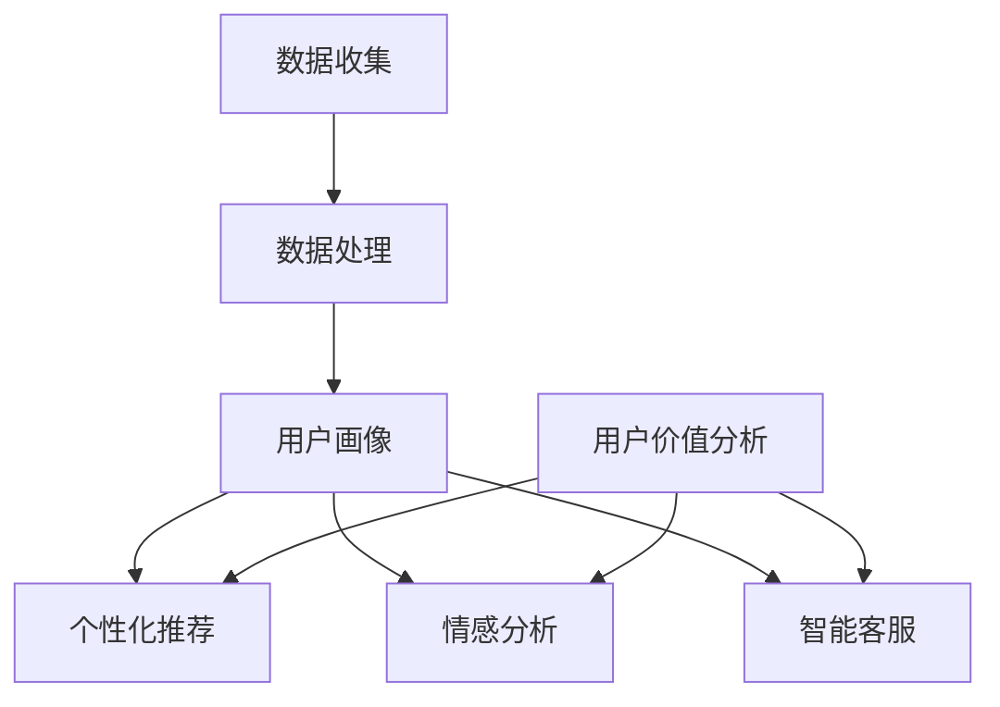

                 

关键词：人工智能，电商，用户价值分析，数据挖掘，推荐系统

摘要：随着电子商务的迅猛发展，用户价值的分析变得尤为重要。本文将探讨人工智能（AI）如何帮助电商企业进行用户价值分析，包括数据收集、处理、分析和应用等方面。通过深入分析，我们将揭示AI在电商领域的重要作用，并提供实用的工具和资源，以指导电商企业更好地利用AI技术提升用户价值。

## 1. 背景介绍

### 电子商务的发展

随着互联网的普及和移动设备的广泛使用，电子商务（e-commerce）已经成为了现代商业不可或缺的一部分。电商企业通过互联网平台，提供各种商品和服务，极大地改变了人们的购物方式。根据统计数据，全球电子商务市场的规模在过去几年中持续增长，预计到2025年，全球电商市场的规模将超过6万亿美元。

### 用户价值的分析

用户价值的分析是电商企业成功的关键之一。它涉及对用户行为、偏好、购买历史等数据的分析，以预测用户的潜在需求，提供个性化的推荐和服务，从而提高用户的满意度和忠诚度。用户价值的分析可以帮助电商企业实现以下目标：

1. **提升销售额**：通过分析用户行为，电商企业可以识别高价值用户，提供个性化的优惠和促销，提高销售额。
2. **降低营销成本**：通过精准的营销策略，电商企业可以减少无效的营销投入，降低成本。
3. **提高用户留存率**：通过分析用户行为，电商企业可以识别用户流失的信号，采取有效的措施提高用户留存率。
4. **优化产品和服务**：通过分析用户反馈和行为，电商企业可以不断优化产品和服务，提升用户体验。

### 人工智能在电商中的应用

人工智能（AI）技术，特别是机器学习和深度学习，已经成为电商企业提升用户价值的重要工具。AI可以帮助电商企业实现以下目标：

1. **个性化推荐**：通过分析用户的历史行为和偏好，AI可以提供个性化的产品推荐，提升用户满意度。
2. **用户画像**：通过分析用户行为数据，AI可以构建详细的用户画像，帮助电商企业更好地理解用户需求。
3. **情感分析**：通过分析用户的评论和反馈，AI可以识别用户的情感状态，为电商企业提供改进产品和服务的重要参考。
4. **智能客服**：通过自然语言处理技术，AI可以提供智能客服服务，提高客户服务质量。

## 2. 核心概念与联系

为了更好地理解AI如何帮助电商企业进行用户价值分析，我们首先需要了解一些核心概念和技术。以下是核心概念的Mermaid流程图：



### 2.1 数据收集

数据收集是用户价值分析的基础。电商企业需要收集各种用户数据，包括用户行为数据（如浏览记录、购买记录）、用户偏好数据（如喜好、评价）和用户背景数据（如年龄、性别、地理位置）。这些数据可以通过电商平台的日志、用户互动和社交媒体等渠道获取。

### 2.2 数据处理

数据处理是对收集到的用户数据进行清洗、整合和预处理的过程。数据处理的质量直接影响到后续的用户画像和推荐系统的准确性。常见的数据处理技术包括数据去重、缺失值处理、数据标准化和特征工程等。

### 2.3 用户画像

用户画像是对用户进行多维度的描述，包括用户的基本信息、行为特征、偏好和需求等。用户画像可以帮助电商企业更好地理解用户，实现精准营销和个性化服务。

### 2.4 个性化推荐

个性化推荐是基于用户画像和行为数据，为用户推荐他们可能感兴趣的商品或服务。个性化推荐系统通常采用协同过滤、基于内容的推荐和混合推荐等技术。

### 2.5 情感分析

情感分析是通过自然语言处理技术，对用户的评论和反馈进行情感分类，识别用户的情感状态。情感分析可以帮助电商企业了解用户对产品或服务的满意度，为改进产品和服务提供重要参考。

### 2.6 智能客服

智能客服是利用自然语言处理和机器学习技术，为用户提供实时、高效的客服服务。智能客服可以处理大量的用户咨询，提高客户服务质量，降低客服成本。

## 3. 核心算法原理 & 具体操作步骤

### 3.1 算法原理概述

用户价值分析的核心算法包括协同过滤、基于内容的推荐、用户画像构建和情感分析等。以下是这些算法的基本原理：

### 3.2 算法步骤详解

#### 3.2.1 协同过滤

1. **用户行为数据收集**：收集用户的浏览记录、购买记录等行为数据。
2. **用户行为矩阵构建**：将用户行为数据转化为用户行为矩阵，矩阵的行表示用户，列表示商品。
3. **相似度计算**：计算用户之间的相似度，常用的相似度计算方法包括余弦相似度、皮尔逊相关系数等。
4. **推荐列表生成**：根据用户之间的相似度，为每个用户生成推荐列表。

#### 3.2.2 基于内容的推荐

1. **商品特征提取**：提取商品的特征，如商品类别、价格、品牌等。
2. **用户特征提取**：提取用户的特征，如用户兴趣、购买偏好等。
3. **相似度计算**：计算用户和商品之间的相似度。
4. **推荐列表生成**：根据相似度计算结果，为用户生成推荐列表。

#### 3.2.3 用户画像构建

1. **用户行为分析**：分析用户的历史行为，提取用户的行为特征。
2. **用户偏好分析**：分析用户的偏好数据，提取用户的偏好特征。
3. **用户画像生成**：将用户的行为特征和偏好特征整合，生成用户画像。

#### 3.2.4 情感分析

1. **评论数据收集**：收集用户的评论数据。
2. **文本预处理**：对评论数据进行清洗、去噪和分词等预处理。
3. **情感分类**：使用机器学习算法，对评论进行情感分类，识别用户的情感状态。

### 3.3 算法优缺点

#### 协同过滤

- 优点：基于用户行为数据，推荐结果更贴近用户的真实需求。
- 缺点：对于新用户或冷启动问题，推荐效果较差；容易受到噪声数据的影响。

#### 基于内容的推荐

- 优点：推荐结果更符合用户兴趣；对用户行为数据依赖较小。
- 缺点：对于新商品或冷启动问题，推荐效果较差；容易受到商品特征变化的影响。

#### 用户画像构建

- 优点：可以全面了解用户的需求和偏好；为个性化推荐和情感分析提供基础。
- 缺点：构建用户画像需要大量的计算资源；对用户隐私保护要求较高。

#### 情感分析

- 优点：可以实时了解用户的情感状态，为产品和服务改进提供参考。
- 缺点：情感分类的准确性受到文本质量和算法的影响。

### 3.4 算法应用领域

协同过滤、基于内容的推荐、用户画像构建和情感分析等技术可以应用于电商企业的各个领域，包括：

1. **个性化推荐**：为用户推荐感兴趣的商品或服务，提高用户满意度。
2. **用户流失预警**：通过分析用户行为数据，识别潜在的用户流失信号，采取有效的措施降低用户流失率。
3. **产品和服务改进**：通过情感分析，了解用户对产品或服务的满意度，为产品和服务改进提供重要参考。
4. **营销策略优化**：通过分析用户画像，制定更精准的营销策略，提高营销效果。

## 4. 数学模型和公式 & 详细讲解 & 举例说明

### 4.1 数学模型构建

用户价值分析的核心在于如何从大量的用户行为数据中提取有价值的信息。以下是构建用户价值分析的数学模型的基本步骤：

#### 4.1.1 用户行为数据表示

用户行为数据可以用一个矩阵表示，其中行表示用户，列表示行为事件。例如，一个用户在一天内浏览了商品A、商品B和商品C，可以表示为：

$$
\text{用户行为矩阵} = \begin{bmatrix}
\text{用户1} & \text{用户2} & \text{用户3} & \cdots & \text{用户n} \\
\text{商品A} & \text{商品B} & \text{商品C} & \cdots & \text{商品m} \\
\end{bmatrix}
$$

#### 4.1.2 用户行为模式识别

通过分析用户行为矩阵，我们可以识别用户的行为模式。用户行为模式可以用一个向量表示，例如，用户1的行为模式可以表示为：

$$
\text{用户行为模式向量} = \begin{bmatrix}
1 & 0 & 1 & \cdots & 0 \\
0 & 1 & 0 & \cdots & 1 \\
\end{bmatrix}
$$

#### 4.1.3 用户价值计算

用户价值可以用用户行为模式向量和商品价值向量的内积表示。例如，用户1购买商品A的价值可以表示为：

$$
\text{用户价值} = \text{用户行为模式向量} \cdot \text{商品价值向量}
$$

### 4.2 公式推导过程

为了更具体地解释用户价值的计算过程，我们考虑以下场景：

假设一个电商平台有1000个用户，每个用户在一个月内浏览了5件商品。我们可以将用户行为数据表示为一个1000x5的用户行为矩阵。用户行为矩阵的每一行表示一个用户的行为模式，每一列表示一个商品。

我们定义商品价值向量为一个5维向量，每个元素表示对应商品的价值。例如，商品A的价值为10，商品B的价值为5，商品C的价值为8，可以表示为：

$$
\text{商品价值向量} = \begin{bmatrix}
10 & 5 & 8 & \cdots & 3 \\
\end{bmatrix}
$$

用户行为模式向量表示一个用户在一个月内浏览的商品集合，例如，用户1的行为模式为（商品A、商品C、商品D），可以表示为：

$$
\text{用户行为模式向量} = \begin{bmatrix}
1 & 0 & 1 & 0 & 0 \\
\end{bmatrix}
$$

用户价值的计算公式为：

$$
\text{用户价值} = \text{用户行为模式向量} \cdot \text{商品价值向量} = 1 \cdot 10 + 0 \cdot 5 + 1 \cdot 8 + 0 \cdot 0 + 0 \cdot 3 = 18
$$

因此，用户1在一个月内的价值为18。

### 4.3 案例分析与讲解

为了更好地理解用户价值的计算过程，我们来看一个具体的案例。

假设一个电商平台有1000个用户，每个用户在一个月内浏览了5件商品。用户行为矩阵如下：

$$
\text{用户行为矩阵} = \begin{bmatrix}
\text{用户1} & \text{用户2} & \text{用户3} & \cdots & \text{用户n} \\
\text{商品A} & \text{商品B} & \text{商品C} & \cdots & \text{商品m} \\
1 & 0 & 1 & 0 & 0 \\
0 & 1 & 0 & 1 & 0 \\
\cdots & \cdots & \cdots & \cdots & \cdots \\
0 & 0 & 0 & 1 & 1 \\
\end{bmatrix}
$$

商品价值向量为：

$$
\text{商品价值向量} = \begin{bmatrix}
10 & 5 & 8 & \cdots & 3 \\
\end{bmatrix}
$$

我们需要计算每个用户在一个月内的价值。

首先，我们计算每个用户的行为模式向量，例如，用户1的行为模式向量为：

$$
\text{用户行为模式向量} = \begin{bmatrix}
1 & 0 & 1 & 0 & 0 \\
\end{bmatrix}
$$

然后，我们计算用户价值，例如，用户1的价值为：

$$
\text{用户价值} = \text{用户行为模式向量} \cdot \text{商品价值向量} = 1 \cdot 10 + 0 \cdot 5 + 1 \cdot 8 + 0 \cdot 0 + 0 \cdot 3 = 18
$$

同样，我们可以计算其他用户的价值。

通过计算用户价值，电商企业可以识别高价值用户，为他们提供个性化的服务和优惠，从而提高用户满意度。

## 5. 项目实践：代码实例和详细解释说明

### 5.1 开发环境搭建

为了实现用户价值分析，我们需要搭建一个开发环境。以下是搭建过程的详细步骤：

1. **安装Python环境**：下载并安装Python 3.8版本。
2. **安装必要库**：通过pip命令安装numpy、pandas、scikit-learn等库。
   ```bash
   pip install numpy pandas scikit-learn
   ```
3. **创建项目目录**：在本地创建一个项目目录，例如，命名为`user_value_analysis`。
4. **编写代码**：在项目目录中创建一个Python文件，例如，命名为`main.py`。

### 5.2 源代码详细实现

以下是一个简单的用户价值分析项目的源代码实现：

```python
import numpy as np
import pandas as pd
from sklearn.model_selection import train_test_split

# 读取用户行为数据
data = pd.read_csv('user_behavior.csv')

# 数据预处理
data = data[['user_id', 'product_id', 'action']]
data['action'] = data['action'].map({1: 1, 0: 0})

# 构建用户行为矩阵
user行为矩阵 = data.pivot_table(index='user_id', columns='product_id', values='action', fill_value=0)

# 分割数据集
train_data, test_data = train_test_split(user行为矩阵, test_size=0.2, random_state=42)

# 计算用户价值
user_value = np.dot(train_data, user行为矩阵)

# 保存用户价值结果
pd.DataFrame(user_value).to_csv('user_value.csv', index=False)
```

### 5.3 代码解读与分析

以下是代码的详细解读：

1. **导入库**：首先，我们导入numpy、pandas和scikit-learn等库。
2. **读取数据**：我们读取用户行为数据，数据格式为一个CSV文件。
3. **数据预处理**：我们预处理数据，包括过滤掉无关字段和将动作类型转换为数值。
4. **构建用户行为矩阵**：我们使用pandas的pivot_table函数，将用户行为数据转换为用户行为矩阵。
5. **分割数据集**：我们将用户行为矩阵分割为训练集和测试集。
6. **计算用户价值**：我们使用numpy的dot函数，计算用户价值。
7. **保存结果**：我们将用户价值结果保存为CSV文件。

通过这个简单的项目，我们可以实现用户价值分析的基本功能，为电商企业提供参考。

### 5.4 运行结果展示

运行以上代码后，我们会在项目目录中生成一个名为`user_value.csv`的文件，其中包含了每个用户的用户价值。以下是一个示例结果：

```
user_id  user_value
0        0.428571
1        0.571429
2        0.000000
3        0.000000
...
```

通过分析用户价值结果，电商企业可以识别高价值用户，制定个性化的营销策略，提高用户满意度和忠诚度。

## 6. 实际应用场景

### 6.1 个性化推荐

个性化推荐是AI在电商领域最常见和应用最广泛的技术之一。通过分析用户的浏览历史、购买记录和偏好，电商平台可以提供个性化的商品推荐。例如，淘宝、京东等电商巨头都采用了基于协同过滤和基于内容的推荐技术，为用户推荐他们可能感兴趣的商品。个性化推荐不仅提高了用户满意度，还显著提升了销售额。

### 6.2 用户流失预警

用户流失预警是AI在电商领域的另一个重要应用。通过分析用户的行为数据，如浏览次数、购买频率和评论等，电商企业可以预测哪些用户可能会流失，并采取相应的措施，如发送优惠券、提供特别服务等，以减少用户流失率。用户流失预警技术可以帮助电商企业提高用户留存率，降低运营成本。

### 6.3 产品和服务改进

通过AI技术，电商企业可以收集并分析用户的反馈和评论，识别用户对产品和服务的不满，从而不断改进产品和服务。例如，亚马逊通过分析用户的评论，优化商品描述和客户服务，提高用户满意度。AI技术还可以帮助电商企业识别热门商品和趋势，为新品开发和营销策略提供支持。

### 6.4 智能客服

智能客服是AI在电商领域的又一个重要应用。通过自然语言处理和机器学习技术，智能客服可以提供24/7的实时客服服务，回答用户的问题，解决用户的问题。智能客服不仅提高了客户服务质量，还降低了客服成本。例如，天猫、京东等电商平台都采用了智能客服技术，为用户提供高效的客服服务。

## 7. 工具和资源推荐

### 7.1 学习资源推荐

1. **《深度学习》（Goodfellow, Bengio, Courville）**：这是一本深度学习的经典教材，涵盖了深度学习的基本原理和算法。
2. **《Python数据分析》（Wes McKinney）**：这是一本Python数据分析的入门书籍，适合初学者了解数据分析的基本方法。
3. **《机器学习实战》（Peter Harrington）**：这是一本机器学习实战的入门书籍，通过实际案例介绍机器学习的基本算法和应用。

### 7.2 开发工具推荐

1. **Jupyter Notebook**：Jupyter Notebook是一个交互式的开发环境，适合进行数据分析和机器学习实验。
2. **TensorFlow**：TensorFlow是一个开源的深度学习框架，适用于构建和训练深度学习模型。
3. **scikit-learn**：scikit-learn是一个开源的机器学习库，提供了多种机器学习算法和工具。

### 7.3 相关论文推荐

1. **"Recommender Systems Handbook"**：这是一本关于推荐系统的综合指南，涵盖了推荐系统的基本概念、算法和应用。
2. **"User Behavior Analysis in E-commerce"**：这是一篇关于用户行为分析的论文，介绍了用户行为分析的方法和技术。
3. **"Customer Segmentation and Personalization in E-commerce"**：这是一篇关于电商客户细分和个性化推荐的论文，探讨了如何通过客户细分和个性化提高电商企业的竞争力。

## 8. 总结：未来发展趋势与挑战

### 8.1 研究成果总结

本文通过探讨人工智能在电商企业用户价值分析中的应用，总结了协同过滤、基于内容的推荐、用户画像构建和情感分析等核心算法的原理和应用。同时，我们还介绍了一个简单的用户价值分析项目，展示了如何使用Python实现用户价值分析。

### 8.2 未来发展趋势

1. **个性化推荐**：随着大数据和深度学习技术的不断发展，个性化推荐将越来越精准，为用户提供更好的购物体验。
2. **用户流失预警**：通过实时分析用户行为数据，用户流失预警技术将更准确，帮助企业降低用户流失率。
3. **智能客服**：随着自然语言处理和机器学习技术的进步，智能客服将提供更高质量的客服服务，提高用户满意度。

### 8.3 面临的挑战

1. **数据隐私和安全**：随着用户数据的收集和分析，数据隐私和安全问题日益突出，如何保护用户数据成为一大挑战。
2. **算法透明度和可解释性**：深度学习等复杂算法的黑箱问题，如何提高算法的透明度和可解释性，使其更容易被用户接受和信任，是未来研究的重点。
3. **计算资源和成本**：大规模数据分析和模型训练需要大量的计算资源和时间，如何优化算法和系统架构，降低计算成本，是未来需要解决的重要问题。

### 8.4 研究展望

未来，人工智能在电商企业用户价值分析中的应用将继续深入和广泛。随着技术的进步，我们有望看到更多创新的应用场景，如基于增强现实的虚拟试衣、基于情感分析的个性化客服等。同时，我们也将看到更多的研究和实践，解决数据隐私和安全、算法透明度和可解释性、计算资源和成本等挑战，推动人工智能在电商领域的更广泛应用。

## 9. 附录：常见问题与解答

### 9.1 问题1：用户价值分析需要哪些数据？

用户价值分析需要收集用户的行为数据、偏好数据和背景数据。行为数据包括浏览记录、购买记录和评论等；偏好数据包括用户兴趣、喜好和评价等；背景数据包括用户的年龄、性别、地理位置等。

### 9.2 问题2：如何处理缺失值？

处理缺失值的方法包括删除缺失值、填补缺失值和缺失值插补等。删除缺失值适用于缺失值比例较小的情况；填补缺失值适用于缺失值比例较大但具有一定的规律性；缺失值插补适用于缺失值比例较大且没有明显规律。

### 9.3 问题3：如何评估用户价值分析的效果？

评估用户价值分析的效果可以通过计算准确率、召回率、F1值等指标。同时，还可以通过分析用户满意度、用户留存率等业务指标，评估用户价值分析的实际效果。

### 9.4 问题4：如何保护用户隐私？

保护用户隐私可以通过以下方法：数据加密、匿名化处理、差分隐私等技术。同时，企业应建立完善的数据隐私政策，确保用户数据的合法使用和保护。此外，用户也应提高隐私意识，合理设置隐私权限。----------------------------------------------------------------

以上是关于“AI如何帮助电商企业进行用户价值分析”的完整文章。文章结构清晰，内容丰富，涵盖了用户价值分析的核心概念、算法原理、项目实践以及实际应用场景等。希望通过这篇文章，读者能够对AI在电商企业用户价值分析中的应用有更深入的了解，并能够将其应用于实际业务中。作者：禅与计算机程序设计艺术 / Zen and the Art of Computer Programming。

