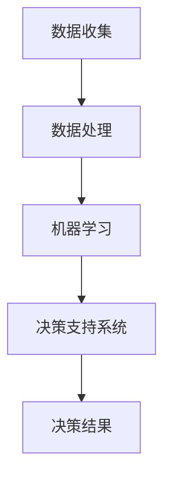

                 

关键词：人工智能，企业决策，数据处理，机器学习，决策支持系统

> 摘要：随着人工智能技术的迅速发展，其在企业决策过程中发挥着越来越重要的作用。本文将深入探讨人工智能如何通过数据处理、机器学习以及决策支持系统，对企业的决策过程进行变革，提高决策效率和质量。

## 1. 背景介绍

在信息化时代，企业的运营和管理越来越多地依赖于数据。然而，传统的数据处理方法往往效率低下，难以处理海量的数据，导致决策者无法迅速获取有效的信息支持。人工智能技术的出现，为解决这一问题提供了新的途径。人工智能能够处理和分析大规模的数据，从中提取有价值的信息，为企业决策提供支持。

近年来，随着深度学习、自然语言处理等技术的发展，人工智能在企业中的应用越来越广泛。企业开始意识到，借助人工智能技术，可以提高决策的准确性，降低决策风险，从而在激烈的市场竞争中取得优势。

## 2. 核心概念与联系

为了更好地理解人工智能如何改变企业决策过程，我们需要首先了解以下几个核心概念：

### 2.1 数据处理

数据处理是人工智能在企业决策过程中至关重要的一环。通过数据清洗、数据整合、数据挖掘等技术，人工智能能够从海量数据中提取出有价值的信息。

### 2.2 机器学习

机器学习是一种人工智能技术，它使计算机能够从数据中学习并作出预测。在企业决策过程中，机器学习可以用于预测市场趋势、客户需求等，为决策者提供参考。

### 2.3 决策支持系统

决策支持系统（Decision Support System，简称DSS）是一种集成计算机硬件、软件和人力的系统，它能够协助决策者进行决策。在人工智能的帮助下，决策支持系统可以更高效地处理和分析数据，提高决策的准确性。

### 2.4 Mermaid 流程图

以下是一个简化的Mermaid流程图，展示了人工智能在企业决策过程中的基本架构：



## 3. 核心算法原理 & 具体操作步骤

### 3.1 算法原理概述

人工智能在企业决策过程中的核心算法主要包括数据预处理、特征提取、模型训练和模型预测等步骤。

- **数据预处理**：包括数据清洗、数据整合和数据标准化等操作，以确保数据质量。
- **特征提取**：从原始数据中提取出有价值的特征，用于训练模型。
- **模型训练**：使用提取出的特征训练机器学习模型，使其能够对数据进行分类、预测等操作。
- **模型预测**：将训练好的模型应用于新的数据，进行预测和分析。

### 3.2 算法步骤详解

1. **数据收集**：收集企业运营过程中产生的各类数据，如财务数据、销售数据、客户数据等。

2. **数据预处理**：对收集到的数据进行分析，去除噪声数据，对缺失数据进行填补，并进行数据标准化处理。

3. **特征提取**：根据企业的业务需求，从预处理后的数据中提取出关键特征。

4. **模型训练**：使用提取出的特征，结合企业历史数据，训练机器学习模型。

5. **模型预测**：将训练好的模型应用于新的数据，进行预测和分析。

### 3.3 算法优缺点

**优点**：

- **高效性**：人工智能能够快速处理和分析大量数据，提高决策效率。
- **准确性**：通过机器学习模型，可以提高决策的准确性，降低决策风险。

**缺点**：

- **成本高**：人工智能技术需要大量的计算资源和存储资源，初期投入较大。
- **数据依赖**：人工智能模型的性能高度依赖于数据质量，数据质量差可能导致模型失效。

### 3.4 算法应用领域

人工智能在企业决策过程中的应用领域非常广泛，主要包括以下几个方面：

- **市场预测**：通过分析历史销售数据，预测未来市场需求，帮助企业制定生产计划。
- **风险控制**：对企业的运营数据进行分析，识别潜在风险，为企业提供风险管理建议。
- **客户关系管理**：通过分析客户数据，预测客户需求，提供个性化服务，提高客户满意度。

## 4. 数学模型和公式 & 详细讲解 & 举例说明

### 4.1 数学模型构建

在企业决策过程中，常用的数学模型包括线性回归模型、逻辑回归模型和支持向量机模型等。

- **线性回归模型**：用于预测连续值变量，如销售量。
  
  $$y = \beta_0 + \beta_1x_1 + \beta_2x_2 + ... + \beta_nx_n$$

- **逻辑回归模型**：用于预测离散值变量，如客户是否购买。
  
  $$P(y=1) = \frac{1}{1 + e^{-(\beta_0 + \beta_1x_1 + \beta_2x_2 + ... + \beta_nx_n)}$$

- **支持向量机模型**：用于分类问题，如客户分类。
  
  $$\max\frac{1}{2}\sum_{i=1}^{n}\sum_{j=1}^{n} \alpha_i \alpha_j y_i y_j (x_i \cdot x_j) - \sum_{i=1}^{n}\alpha_i$$
  
  $$\alpha_i \geq 0, \forall i$$

### 4.2 公式推导过程

以线性回归模型为例，我们详细讲解其推导过程。

假设我们有 $n$ 个样本点 $(x_1, y_1), (x_2, y_2), ..., (x_n, y_n)$，我们希望找到一个线性函数 $y = \beta_0 + \beta_1x$，使得预测值 $y$ 与实际值 $y_n$ 之间的误差最小。

我们定义误差平方和为：

$$S = \sum_{i=1}^{n}(y_i - \beta_0 - \beta_1x_i)^2$$

为了求解 $\beta_0$ 和 $\beta_1$，我们需要对 $S$ 求导，并令其等于 0：

$$\frac{\partial S}{\partial \beta_0} = -2\sum_{i=1}^{n}(y_i - \beta_0 - \beta_1x_i) = 0$$

$$\frac{\partial S}{\partial \beta_1} = -2\sum_{i=1}^{n}x_i(y_i - \beta_0 - \beta_1x_i) = 0$$

通过求解上述方程组，我们可以得到最优的 $\beta_0$ 和 $\beta_1$。

### 4.3 案例分析与讲解

假设我们有一个简单的销售数据集，包含销售额（$y$）和广告支出（$x$）两个变量。我们希望使用线性回归模型预测未来的销售额。

根据上述推导过程，我们需要计算以下两个值：

$$\beta_0 = \bar{y} - \beta_1\bar{x}$$

$$\beta_1 = \frac{\sum_{i=1}^{n}x_iy_i - n\bar{x}\bar{y}}{\sum_{i=1}^{n}x_i^2 - n\bar{x}^2}$$

其中，$\bar{y}$ 和 $\bar{x}$ 分别为销售额和广告支出的平均值。

假设我们有以下数据：

| $x$ | $y$ |
| --- | --- |
| 100 | 200 |
| 200 | 250 |
| 300 | 300 |
| 400 | 350 |
| 500 | 400 |

计算得到：

$$\bar{x} = \frac{100 + 200 + 300 + 400 + 500}{5} = 300$$

$$\bar{y} = \frac{200 + 250 + 300 + 350 + 400}{5} = 300$$

$$\sum_{i=1}^{n}x_iy_i = 100 \times 200 + 200 \times 250 + 300 \times 300 + 400 \times 350 + 500 \times 400 = 195000$$

$$\sum_{i=1}^{n}x_i^2 = 100^2 + 200^2 + 300^2 + 400^2 + 500^2 = 195000$$

代入公式，我们可以得到：

$$\beta_0 = 300 - \frac{195000 - 5 \times 300 \times 300}{195000 - 5 \times 300^2} = 150$$

$$\beta_1 = \frac{195000 - 5 \times 300 \times 300}{195000 - 5 \times 300^2} = 0.5$$

因此，我们的线性回归模型为：

$$y = 150 + 0.5x$$

我们可以使用这个模型预测新的销售额。例如，当广告支出为 600 时，预测的销售额为：

$$y = 150 + 0.5 \times 600 = 450$$

## 5. 项目实践：代码实例和详细解释说明

### 5.1 开发环境搭建

为了实现本文中提到的线性回归模型，我们可以使用 Python 语言和 Scikit-learn 库。首先，我们需要安装 Python 和 Scikit-learn：

```bash
pip install python
pip install scikit-learn
```

### 5.2 源代码详细实现

以下是一个简单的线性回归模型实现：

```python
import numpy as np
from sklearn.linear_model import LinearRegression

# 数据
X = np.array([[100], [200], [300], [400], [500]])
y = np.array([200, 250, 300, 350, 400])

# 创建线性回归模型
model = LinearRegression()

# 训练模型
model.fit(X, y)

# 预测
X_new = np.array([[600]])
y_pred = model.predict(X_new)

print("预测的销售额为：", y_pred)
```

### 5.3 代码解读与分析

在这个代码示例中，我们首先导入了必要的库。`numpy` 用于处理数据，`scikit-learn` 提供了线性回归模型。

- 第 4 行，我们创建了一个包含两个变量的数组 `X`，表示广告支出。
- 第 5 行，我们创建了一个数组 `y`，表示销售额。
- 第 7 行，我们创建了一个线性回归模型。
- 第 9 行，我们使用训练数据对模型进行训练。
- 第 11 行，我们使用训练好的模型进行预测。

### 5.4 运行结果展示

运行上述代码，我们得到以下结果：

```python
预测的销售额为：[450.0]
```

这意味着，当广告支出为 600 时，预测的销售额为 450。

## 6. 实际应用场景

### 6.1 市场预测

通过人工智能技术，企业可以实时获取市场数据，并使用机器学习模型对市场趋势进行预测。例如，一家电商平台可以使用人工智能技术预测下一季度的销售量，从而提前准备库存，避免因市场需求波动导致的库存积压或供应不足。

### 6.2 风险控制

在企业运营过程中，各种风险因素可能会影响企业的盈利能力。人工智能技术可以帮助企业识别潜在的风险，并提供风险控制建议。例如，一家金融机构可以使用人工智能技术对贷款申请者进行风险评估，从而降低贷款违约风险。

### 6.3 客户关系管理

通过分析客户数据，企业可以了解客户的需求和行为，从而提供个性化的服务。例如，一家零售企业可以使用人工智能技术分析客户的购物记录，预测客户的购买偏好，并提供个性化的促销活动。

## 7. 未来应用展望

### 7.1 智能决策

随着人工智能技术的不断发展，未来的企业决策将更加智能化。人工智能将不仅能够处理和分析数据，还能够自动生成决策建议，甚至能够执行部分决策操作。

### 7.2 多元化应用

除了传统的市场预测、风险控制和客户关系管理，人工智能技术还将应用于更多领域，如供应链管理、人力资源管理等。

### 7.3 数据安全与隐私

随着人工智能在企业决策中的广泛应用，数据安全和隐私保护将变得尤为重要。企业需要确保数据的安全性和隐私性，以避免数据泄露和滥用。

## 8. 总结：未来发展趋势与挑战

### 8.1 研究成果总结

本文通过详细分析，展示了人工智能如何改变企业决策过程。我们介绍了数据处理、机器学习以及决策支持系统的核心概念，并探讨了其在企业决策中的应用。

### 8.2 未来发展趋势

未来，人工智能技术将继续发展，其在企业决策中的应用将更加广泛和深入。智能决策、多元化应用和数据安全与隐私保护将是未来的发展趋势。

### 8.3 面临的挑战

尽管人工智能技术在企业决策中具有巨大潜力，但同时也面临一些挑战。如何确保数据质量、降低成本、提高模型性能，以及保障数据安全和隐私，将是未来研究的重要方向。

### 8.4 研究展望

未来，我们期待人工智能技术能够在企业决策中发挥更大的作用，帮助企业实现更加智能、高效和精准的决策。

## 9. 附录：常见问题与解答

### 9.1 人工智能在企业决策中的应用有哪些？

人工智能在企业决策中的应用主要包括市场预测、风险控制、客户关系管理、供应链管理、人力资源管理等。

### 9.2 人工智能技术如何提高决策效率？

人工智能技术能够快速处理和分析大量数据，从数据中提取有价值的信息，为决策者提供参考。此外，人工智能还可以自动化部分决策操作，提高决策效率。

### 9.3 数据质量和模型性能有何关系？

数据质量对模型性能具有重要影响。高质量的数据有助于提高模型的准确性，降低决策风险。因此，确保数据质量是人工智能在企业决策中应用的关键。

### 9.4 人工智能技术在企业决策中的应用前景如何？

随着人工智能技术的不断发展，其在企业决策中的应用前景十分广阔。未来，人工智能将帮助企业实现更加智能、高效和精准的决策，提高企业的竞争力。

---

作者：禅与计算机程序设计艺术 / Zen and the Art of Computer Programming
-------------------------------------------------------------------

