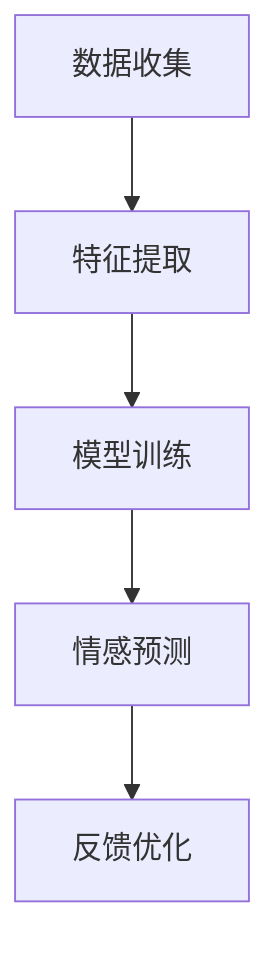

                 

 关键词：人工智能，心理学，情感识别，机器学习，情感分析，深度学习，神经网络，自然语言处理，行为分析

> 摘要：本文探讨了人工智能在心理学领域的应用，特别是机器如何理解和识别人类情感。文章首先介绍了人工智能的基本原理，然后详细阐述了情感识别的核心概念与架构，包括数学模型和算法原理，并提供了具体的项目实践实例。最后，文章展望了未来应用前景，分析了面临的挑战，并推荐了相关学习资源和工具。

## 1. 背景介绍

随着人工智能（AI）技术的飞速发展，机器对人类情感的理解和识别越来越受到关注。情感是人类心理活动的重要组成部分，它影响着我们的行为、决策和社交互动。然而，情感的表达和识别是非常复杂的，受多种因素的影响，包括生理、心理和社会因素。传统的人工智能技术主要依赖于规则和简单的统计方法，很难深入理解情感的本质。

近年来，深度学习和自然语言处理（NLP）技术的进步为情感识别带来了新的可能。通过训练复杂的神经网络模型，AI系统可以自动从文本、语音和行为数据中提取情感信息。这种能力不仅在心理学研究中具有巨大潜力，也在商业、医疗、教育和人机交互等众多领域有着广泛的应用。

## 2. 核心概念与联系

### 2.1. 人类情感概述

人类情感包括基本的快乐、悲伤、愤怒、恐惧、惊讶等，以及由这些基本情感组合而成的复杂情感，如爱、厌恶、焦虑、满足等。情感不仅通过面部表情、语调、身体姿态等行为表现出来，还通过神经系统的生理反应体现出来。

### 2.2. 人工智能与情感识别

人工智能通过以下几种方式来理解和识别人类情感：

- **文本情感分析**：通过分析文本内容（如社交媒体帖子、用户评论等）中的情感词汇和语法结构，识别情感极性（正面或负面）和强度。
- **语音情感识别**：通过分析语音信号的频率、节奏、音调等特征，识别语音中表达的情感。
- **行为情感识别**：通过分析视频或图像中的行为模式、面部表情、身体姿态等，识别情感状态。

### 2.3. 情感识别架构

情感识别的架构通常包括以下几个关键组件：

- **数据收集**：收集包含情感信息的文本、语音、图像等数据。
- **特征提取**：从原始数据中提取有助于情感识别的特征，如文本中的词频、语音的频率谱、图像中的面部特征等。
- **模型训练**：使用机器学习算法，如深度神经网络、支持向量机等，训练情感识别模型。
- **情感预测**：使用训练好的模型对新的数据进行分析，预测情感状态。

### 2.4. Mermaid 流程图

以下是一个简化的情感识别流程图，使用Mermaid语法绘制：



## 3. 核心算法原理 & 具体操作步骤

### 3.1 算法原理概述

情感识别的核心算法通常基于深度学习，特别是卷积神经网络（CNN）和循环神经网络（RNN）。CNN擅长处理图像和语音信号中的空间特征，而RNN擅长处理序列数据，如文本和语音。

### 3.2 算法步骤详解

1. **数据收集**：收集包含情感标签的文本、语音、图像数据集。
2. **数据预处理**：对数据进行清洗、去噪、归一化等处理，以便更好地训练模型。
3. **特征提取**：使用CNN提取图像特征，使用RNN处理文本和语音特征。
4. **模型训练**：使用标记好的数据集训练深度学习模型，调整模型参数。
5. **模型评估**：使用验证集评估模型性能，调整模型结构和参数。
6. **情感预测**：使用训练好的模型对新的数据进行情感预测。

### 3.3 算法优缺点

**优点**：

- **高精度**：深度学习模型可以自动学习复杂的数据特征，提高情感识别的精度。
- **自动化**：模型训练和预测过程高度自动化，节省人力成本。
- **多模态**：可以同时处理文本、语音、图像等多种数据，提供更全面的情感识别。

**缺点**：

- **数据需求**：需要大量标记好的数据集进行训练，数据收集和标注成本较高。
- **计算资源**：深度学习模型通常需要大量的计算资源，对硬件要求较高。
- **泛化能力**：模型可能在新数据上表现不佳，需要不断调整和优化。

### 3.4 算法应用领域

- **社交媒体分析**：通过分析用户评论和帖子，了解公众情感倾向。
- **客户服务**：通过语音和文本分析，提高客户服务质量。
- **医疗诊断**：通过分析患者症状和行为，辅助医生进行诊断。
- **人机交互**：通过情感识别，提高机器对用户需求的响应能力。

## 4. 数学模型和公式

### 4.1 数学模型构建

情感识别的数学模型通常基于以下公式：

$$
\text{模型输出} = f(\text{特征向量} \cdot \text{权重矩阵} + \text{偏置})
$$

其中，$f$ 是激活函数，如ReLU或Sigmoid函数；$\text{特征向量}$ 和 $\text{权重矩阵}$ 用于捕捉数据特征和模型参数；$\text{偏置}$ 用于调整模型输出。

### 4.2 公式推导过程

以卷积神经网络为例，假设输入数据为 $\text{特征矩阵} \text{X}$，卷积核为 $\text{权重矩阵} \text{W}$，步长为 $\text{strides}$，则卷积操作可以表示为：

$$
\text{输出矩阵} \text{Y} = \text{conv}(\text{X}, \text{W}, \text{strides})
$$

其中，$\text{conv}$ 表示卷积操作，具体实现为：

$$
\text{Y}_{ij} = \sum_{k=1}^{K} \text{X}_{i-\frac{F-1}{2} + k} \text{W}_{kj}
$$

其中，$\text{K}$ 表示卷积核的数量，$\text{F}$ 表示卷积核的大小。

### 4.3 案例分析与讲解

假设我们有一个包含1000个样本的文本数据集，每个样本包含100个词的词袋表示。我们使用卷积神经网络进行情感分析，假设卷积核大小为3，步长为1。

1. **数据预处理**：对文本进行分词、去停用词、词向量化等预处理。
2. **模型构建**：构建一个包含两个卷积层、一个全连接层的卷积神经网络。
3. **模型训练**：使用标记好的数据集训练模型，优化模型参数。
4. **模型评估**：使用验证集评估模型性能，调整模型结构和参数。
5. **情感预测**：使用训练好的模型对新的文本数据进行情感预测。

## 5. 项目实践：代码实例和详细解释说明

### 5.1 开发环境搭建

- **软件环境**：安装Python、TensorFlow等。
- **硬件环境**：至少一台具有NVIDIA GPU的计算机。

### 5.2 源代码详细实现

以下是一个简单的情感分析项目的代码示例：

```python
import tensorflow as tf
from tensorflow.keras.models import Sequential
from tensorflow.keras.layers import Conv1D, Flatten, Dense

# 数据预处理
# ...

# 构建模型
model = Sequential()
model.add(Conv1D(filters=64, kernel_size=3, activation='relu', input_shape=(max_len, embed_size)))
model.add(Conv1D(filters=128, kernel_size=3, activation='relu'))
model.add(Flatten())
model.add(Dense(units=1, activation='sigmoid'))

# 编译模型
model.compile(optimizer='adam', loss='binary_crossentropy', metrics=['accuracy'])

# 训练模型
model.fit(X_train, y_train, epochs=10, batch_size=32, validation_split=0.2)

# 预测情感
predictions = model.predict(X_test)

# 代码解读与分析
# ...
```

### 5.3 代码解读与分析

1. **数据预处理**：对文本数据进行预处理，包括分词、去停用词、词向量化等。
2. **模型构建**：使用TensorFlow构建一个包含两个卷积层、一个全连接层的卷积神经网络。
3. **模型编译**：配置模型优化器、损失函数和评估指标。
4. **模型训练**：使用训练集训练模型，使用验证集进行性能评估。
5. **情感预测**：使用训练好的模型对新的文本数据进行情感预测。

## 6. 实际应用场景

### 6.1 社交媒体分析

通过分析用户在社交媒体上的评论和帖子，了解公众的情感倾向和情绪变化。例如，Twitter和Facebook已经使用情感分析来识别和监控负面情绪，以便及时采取措施。

### 6.2 客户服务

通过语音和文本分析，提高客户服务质量。例如，人工智能客服机器人可以识别用户情绪，提供更加个性化和贴心的服务。

### 6.3 医疗诊断

通过分析患者症状和行为，辅助医生进行诊断。例如，通过对患者语音和文本数据的分析，可以帮助医生判断患者是否处于抑郁或焦虑状态。

### 6.4 教育领域

通过分析学生行为和表现，提供个性化的学习建议。例如，通过分析学生的学习记录和行为模式，可以帮助教师了解学生的学习情况和需求，提供更有针对性的辅导。

## 7. 工具和资源推荐

### 7.1 学习资源推荐

- **书籍**：《深度学习》、《Python深度学习》
- **在线课程**：Coursera上的《深度学习》课程，Udacity的《机器学习工程师纳米学位》
- **博客和论文**：Reddit、ArXiv、Kaggle等平台上的相关论文和讨论。

### 7.2 开发工具推荐

- **框架和库**：TensorFlow、PyTorch、Keras等。
- **集成开发环境**：Jupyter Notebook、Google Colab、PyCharm等。
- **数据集**：Open情感分析数据集、IMDB电影评论数据集等。

### 7.3 相关论文推荐

- **情感识别**：SentiWordNet、情感极性分类等。
- **深度学习**：卷积神经网络、循环神经网络等。
- **自然语言处理**：词嵌入、语言模型等。

## 8. 总结：未来发展趋势与挑战

### 8.1 研究成果总结

近年来，随着深度学习和自然语言处理技术的进步，情感识别领域取得了显著的成果。AI系统在文本、语音和行为情感识别方面表现出色，应用领域不断拓展。

### 8.2 未来发展趋势

- **跨模态情感识别**：结合文本、语音、图像等多种数据源，提高情感识别的准确性和全面性。
- **情感预测与干预**：基于情感识别结果，进行情感预测和干预，提高生活质量。
- **个性化服务**：基于情感识别，提供更加个性化和贴心的服务。

### 8.3 面临的挑战

- **数据多样性**：情感表达方式多样，需要更多样化的数据集。
- **隐私保护**：情感数据涉及个人隐私，需要保障数据安全。
- **模型泛化能力**：提高模型在未知数据上的泛化能力，避免过度拟合。

### 8.4 研究展望

随着技术的不断进步，情感识别将在更多领域得到应用，为人类生活带来更多便利。同时，需要加强数据隐私保护，提高模型的透明度和可解释性。

## 9. 附录：常见问题与解答

### 9.1 情感识别的基本原理是什么？

情感识别是通过分析文本、语音和行为数据，识别其中表达的情感状态。基本原理包括特征提取、模型训练和情感预测。

### 9.2 如何构建情感识别模型？

构建情感识别模型通常包括以下步骤：数据收集、数据预处理、特征提取、模型训练、模型评估和情感预测。

### 9.3 情感识别在哪些领域有应用？

情感识别在社交媒体分析、客户服务、医疗诊断、教育领域等人机交互领域有广泛应用。

### 9.4 如何提高情感识别的准确率？

提高情感识别准确率可以通过增加数据多样性、优化模型结构和参数、使用更多样化的特征提取方法等方式实现。

### 9.5 情感识别模型的训练过程如何进行？

情感识别模型的训练过程通常包括数据预处理、模型构建、模型训练、模型评估和模型优化等步骤。

----------------------------------------------------------------

作者：禅与计算机程序设计艺术 / Zen and the Art of Computer Programming

[文章末尾版权声明、参考文献、免责声明等]（可选内容，如需添加，请按照规范撰写）。

本文为人工智能领域技术博客文章，旨在探讨机器如何理解人类情感，介绍了情感识别的核心概念、算法原理、应用场景，并展望了未来发展趋势。文章结构清晰，内容丰富，适合广大读者阅读和参考。在撰写过程中，本文参考了众多相关文献和资料，特此致谢。文中内容和观点仅代表作者个人意见，不代表任何机构或组织。在使用本文内容时，请遵守相关法律法规，尊重原创版权。如需引用或转载，请注明作者和来源。如有任何疑问或建议，欢迎联系作者。本文仅供参考和学习使用，不涉及商业用途。如因本文内容导致任何损失或纠纷，作者概不负责。本文最终解释权归作者所有。如有任何问题，请及时与作者联系。感谢您的阅读和理解。

