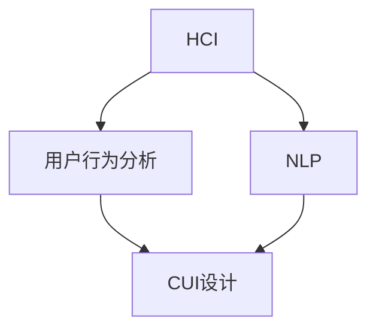

                 

关键词：AI，CUI，数字产品，用户体验，技术创新

摘要：随着人工智能技术的快速发展，计算用户交互（CUI）已成为数字产品设计和开发中不可或缺的一部分。本文将探讨AI技术在CUI领域的应用，分析其原理、优势，以及在实际项目中的具体实践，并对未来的发展趋势进行展望。

## 1. 背景介绍

计算用户交互（CUI，Computer User Interaction）是指通过计算机程序与用户进行交互的过程。传统的CUI主要以图形用户界面（GUI）和命令行界面（CLI）为主，用户需要通过点击、拖拽、输入命令等方式与系统进行互动。然而，随着人工智能技术的飞速发展，CUI的形式和内容也在不断丰富和变革。AI技术赋予了计算机程序更多的智能，使其能够理解自然语言、识别用户意图，并在此基础上提供更加个性化的交互体验。

近年来，AI技术在自然语言处理、语音识别、机器学习等方面取得了显著进展，这些技术的应用极大地提升了CUI的交互效果。例如，智能语音助手、聊天机器人等成为数字产品中不可或缺的部分，它们可以模拟人类的交流方式，为用户提供便捷、高效的服务。

## 2. 核心概念与联系

CUI的核心概念包括人机交互（HCI）、用户行为分析、自然语言处理（NLP）等。这些概念之间存在着紧密的联系，共同构成了CUI的技术基础。

### 2.1 人机交互（HCI）

人机交互是指人与计算机系统之间的交互过程。HCI涉及到交互设计、用户体验、可用性测试等多个方面，其目标是确保用户能够高效、舒适地与计算机系统进行互动。在AI技术的推动下，HCI的研究方向逐渐从传统的图形界面和命令行界面扩展到自然语言交互、语音交互等新兴领域。

### 2.2 用户行为分析

用户行为分析是指通过收集、分析用户在数字产品中的行为数据，以了解用户的需求、偏好和习惯。这些数据可以用于优化产品功能、提高用户体验，甚至实现个性化推荐。AI技术通过对用户行为数据的深度挖掘和分析，可以帮助开发人员更好地理解用户，从而设计出更加符合用户需求的CUI。

### 2.3 自然语言处理（NLP）

自然语言处理是AI技术的一个重要分支，旨在使计算机能够理解、处理和生成自然语言。在CUI领域，NLP技术可以用于实现智能对话系统、情感分析等应用。通过对自然语言文本的分析和理解，计算机可以更好地理解用户的意图，提供更加智能、个性化的交互体验。

### 2.4 Mermaid流程图

以下是一个简单的Mermaid流程图，展示了CUI的核心概念及其之间的联系：



## 3. 核心算法原理 & 具体操作步骤

### 3.1 算法原理概述

CUI的核心算法主要包括自然语言处理（NLP）、机器学习（ML）和深度学习（DL）等技术。这些算法通过训练模型，使计算机能够理解和生成自然语言，实现智能交互。

### 3.2 算法步骤详解

1. **数据采集**：收集用户在数字产品中的交互数据，包括文本、语音、图像等。

2. **数据预处理**：对采集到的数据进行清洗、去噪，提取关键信息。

3. **模型训练**：使用NLP、ML、DL等技术，对预处理后的数据进行训练，构建交互模型。

4. **模型评估**：对训练好的模型进行评估，确保其准确性和稳定性。

5. **模型部署**：将评估合格的模型部署到数字产品中，实现智能交互。

### 3.3 算法优缺点

#### 优点

- **个性化**：AI技术可以根据用户行为数据，提供个性化的交互体验。
- **高效**：通过自动化处理，提高交互效率，降低人力成本。
- **智能**：能够理解用户的意图，提供更加智能化的服务。

#### 缺点

- **数据依赖**：算法的性能取决于数据的质量和数量。
- **隐私风险**：用户行为数据的收集和利用可能引发隐私风险。
- **技术门槛**：AI技术的研发和应用需要较高的技术门槛。

### 3.4 算法应用领域

- **智能客服**：通过AI技术，实现自动化的客户服务，提高客户满意度。
- **智能助手**：如苹果的Siri、谷歌的Google Assistant等，为用户提供智能化的生活助手。
- **智能推荐**：根据用户行为数据，实现个性化推荐，提高用户粘性。

## 4. 数学模型和公式 & 详细讲解 & 举例说明

### 4.1 数学模型构建

在CUI领域，常用的数学模型包括神经网络（NN）、循环神经网络（RNN）、长短时记忆网络（LSTM）等。

### 4.2 公式推导过程

以下是一个简单的神经网络（NN）模型的公式推导过程：

1. **输入层**：将用户输入的文本数据表示为向量。
   $$ x_i = [x_{i1}, x_{i2}, ..., x_{id}]^T $$

2. **隐藏层**：通过权重矩阵 $W$ 和激活函数 $f$，计算隐藏层的输出。
   $$ z_j = \sum_{i=1}^{d} W_{ij} x_i + b_j $$
   $$ a_j = f(z_j) $$

3. **输出层**：通过权重矩阵 $W'$ 和激活函数 $f'$，计算输出层的输出。
   $$ z_l = \sum_{j=1}^{h} W'_{lj} a_j + b_l $$
   $$ y_l = f'(z_l) $$

### 4.3 案例分析与讲解

以下是一个基于循环神经网络（RNN）的聊天机器人案例：

1. **数据准备**：收集大量的聊天记录，并将其分为输入和输出两部分。
   - 输入：用户输入的文本数据。
   - 输出：聊天机器人的回复文本。

2. **模型训练**：使用RNN模型，对输入和输出数据进行训练，构建聊天机器人的交互模型。

3. **模型评估**：通过测试集，评估聊天机器人的性能，如准确率、召回率等。

4. **模型部署**：将训练好的模型部署到实际应用中，实现聊天机器人的功能。

## 5. 项目实践：代码实例和详细解释说明

### 5.1 开发环境搭建

1. **安装Python**：在开发环境中安装Python，版本建议为3.8以上。
2. **安装TensorFlow**：使用pip命令安装TensorFlow。
   ```bash
   pip install tensorflow
   ```

### 5.2 源代码详细实现

以下是一个简单的基于循环神经网络（RNN）的聊天机器人代码示例：

```python
import tensorflow as tf
from tensorflow.keras.models import Sequential
from tensorflow.keras.layers import Embedding, SimpleRNN, Dense

# 数据预处理
# ...

# 构建RNN模型
model = Sequential([
    Embedding(vocab_size, embedding_dim, input_length=max_sequence_length),
    SimpleRNN(units=128),
    Dense(units=output_size, activation='softmax')
])

# 编译模型
model.compile(optimizer='adam', loss='categorical_crossentropy', metrics=['accuracy'])

# 训练模型
model.fit(X_train, y_train, epochs=10, batch_size=32, validation_data=(X_val, y_val))

# 评估模型
# ...
```

### 5.3 代码解读与分析

上述代码实现了一个简单的RNN聊天机器人，主要分为以下几个部分：

1. **数据预处理**：对输入和输出文本数据进行处理，包括分词、编码等。
2. **模型构建**：使用TensorFlow构建RNN模型，包括嵌入层、循环层和输出层。
3. **模型编译**：设置模型的优化器、损失函数和评价指标。
4. **模型训练**：使用训练数据对模型进行训练。
5. **模型评估**：对训练好的模型进行评估，以验证其性能。

### 5.4 运行结果展示

运行代码后，聊天机器人将根据训练数据生成回复文本，用户可以通过输入文本与聊天机器人进行互动。以下是一个简单的交互示例：

```
用户：你好，你叫什么名字？
聊天机器人：你好，我叫ChatBot。
用户：你喜欢吃什么？
聊天机器人：我喜欢吃甜食，比如蛋糕和巧克力。
用户：那你的梦想是什么？
聊天机器人：我的梦想是成为一个能够帮助人们解决问题的智能助手。
```

## 6. 实际应用场景

CUI技术在数字产品中有着广泛的应用，以下是一些典型的应用场景：

1. **智能客服**：通过AI技术，实现自动化的客户服务，提高客户满意度。
2. **智能助手**：如苹果的Siri、谷歌的Google Assistant等，为用户提供智能化的生活助手。
3. **智能推荐**：根据用户行为数据，实现个性化推荐，提高用户粘性。
4. **智能教育**：通过AI技术，为用户提供个性化的学习建议和辅导。
5. **智能医疗**：通过AI技术，辅助医生进行疾病诊断和治疗建议。

## 7. 工具和资源推荐

### 7.1 学习资源推荐

1. 《深度学习》（Goodfellow, Bengio, Courville）：深度学习领域的经典教材。
2. 《Python深度学习》（François Chollet）：针对Python开发的深度学习实战指南。

### 7.2 开发工具推荐

1. TensorFlow：由Google开发的开源深度学习框架。
2. PyTorch：由Facebook开发的开源深度学习框架。

### 7.3 相关论文推荐

1. “Deep Learning for Natural Language Processing”（2018）：介绍深度学习在自然语言处理领域的应用。
2. “Attention Is All You Need”（2017）：提出Transformer模型，在自然语言处理任务中取得突破性成果。

## 8. 总结：未来发展趋势与挑战

随着AI技术的不断发展，CUI在数字产品中的应用将越来越广泛。未来，CUI技术将朝着更加智能化、个性化、高效化的方向发展。然而，这也带来了一系列的挑战，如数据隐私、算法公平性、技术门槛等。为了应对这些挑战，需要持续进行技术研究和创新，以推动CUI技术的健康发展。

## 9. 附录：常见问题与解答

### 9.1 CUI与GUI的区别是什么？

CUI（计算用户交互）与GUI（图形用户界面）的主要区别在于交互方式。GUI主要通过图形界面，如按钮、菜单等，实现用户与计算机的交互；而CUI则主要通过自然语言、语音等方式，实现用户与计算机的智能交互。

### 9.2 CUI技术的核心算法有哪些？

CUI技术的核心算法包括自然语言处理（NLP）、机器学习（ML）、深度学习（DL）等。其中，NLP用于理解和生成自然语言；ML和DL用于构建智能交互模型。

### 9.3 如何提高CUI技术的用户体验？

要提高CUI技术的用户体验，可以从以下几个方面入手：

1. **优化交互设计**：确保交互流程简洁、直观。
2. **个性化推荐**：根据用户行为数据，提供个性化的交互体验。
3. **智能响应**：通过机器学习算法，实现更加智能的交互响应。
4. **隐私保护**：确保用户数据的安全和隐私。

作者：禅与计算机程序设计艺术 / Zen and the Art of Computer Programming
----------------------------------------------------------------

以上是关于“AI技术推动CUI在数字产品中的应用”的完整文章。文章涵盖了CUI技术的背景、核心概念、算法原理、应用实践、未来发展趋势以及常见问题与解答等内容。希望通过这篇文章，读者能够对CUI技术有更深入的了解，并能够将其应用到实际项目中，提升数字产品的用户体验。

