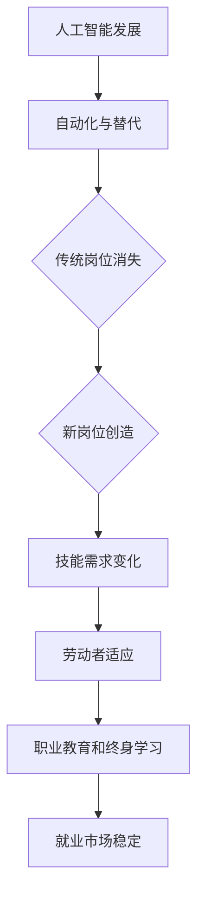

                 

关键词：人工智能、就业影响、职业教育、终身学习、技能更新、人才需求

摘要：随着人工智能技术的快速发展，其对就业市场的影响日益显著。本文将探讨人工智能技术对就业的潜在影响，以及如何通过职业教育和终身学习体系来应对这些变化，从而帮助劳动者适应新兴技术环境，提高就业竞争力。

## 1. 背景介绍

人工智能（AI）作为当前科技领域的热点，已经逐渐渗透到各行各业。从自动驾驶汽车到智能家居，从医疗诊断到金融分析，AI技术的应用正在改变我们的工作和生活方式。然而，这种快速的技术变革也带来了一系列的挑战，尤其是在就业市场方面。

一方面，AI技术有望创造新的就业机会，推动产业升级和经济增长。另一方面，它也可能导致一些传统岗位的消失，尤其是在那些高度依赖重复性劳动的行业。因此，如何应对AI技术的就业影响，成为了社会各界广泛关注的问题。

本文旨在探讨人工智能技术对就业市场的影响，并提出职业教育和终身学习体系作为应对策略。通过分析当前就业市场的变化趋势，以及职业教育和终身学习的实际案例，本文希望能够为政策制定者、教育工作者和劳动者提供有价值的参考。

## 2. 核心概念与联系

### 2.1. 人工智能的基本概念

人工智能（AI）是指通过计算机程序实现人类智能的功能，包括学习、推理、规划、感知、自然语言处理等。AI技术可以分为两大类：基于规则的系统和基于数据的学习系统。

- **基于规则的系统**：这种系统通过编写一系列规则和指令来模拟人类智能。这些规则通常由专家根据特定领域知识编写。
- **基于数据的学习系统**：这类系统通过从大量数据中学习模式，从而自动改进其性能。深度学习是其中的一种重要技术，它通过多层神经网络模拟人类大脑的学习过程。

### 2.2. AI与就业市场的联系

AI技术对就业市场的影响主要表现在以下几个方面：

- **自动化与替代**：AI技术可以自动化许多重复性、低技能的工作，如数据录入、制造装配等，从而替代人类劳动。
- **岗位创造与消失**：虽然AI技术可能减少某些岗位的需求，但同时也可能创造新的就业机会，如AI系统维护、数据科学家等。
- **技能需求变化**：随着AI技术的发展，对劳动者的技能要求也在发生变化。传统行业需要劳动者具备更多与AI相关的技能，如编程、数据分析等。

### 2.3. Mermaid 流程图

以下是一个简单的 Mermaid 流程图，展示了 AI 技术对就业市场的影响路径：



## 3. 核心算法原理 & 具体操作步骤

### 3.1. 算法原理概述

AI技术的核心在于机器学习和深度学习算法。这些算法通过从数据中学习，改进系统的性能。

- **机器学习**：机器学习是指计算机从数据中学习规律，并使用这些规律进行预测或决策。常见的机器学习算法包括线性回归、决策树、支持向量机等。
- **深度学习**：深度学习是机器学习的一种，通过多层神经网络模拟人类大脑的学习过程。深度学习的代表性算法是深度神经网络（DNN）和卷积神经网络（CNN）。

### 3.2. 算法步骤详解

以下是一个简单的线性回归算法步骤：

1. **数据预处理**：清洗数据，将数据转换为适合输入模型的格式。
2. **特征选择**：选择对预测结果有重要影响的数据特征。
3. **模型训练**：使用训练数据集，通过梯度下降等优化算法训练模型。
4. **模型评估**：使用测试数据集评估模型性能。
5. **模型部署**：将训练好的模型部署到实际应用场景。

### 3.3. 算法优缺点

- **优点**：机器学习和深度学习算法具有强大的预测和决策能力，能够处理大量数据，发现复杂模式。
- **缺点**：算法的训练和优化过程复杂，需要大量计算资源和时间。此外，算法的性能依赖于数据质量和特征选择。

### 3.4. 算法应用领域

机器学习和深度学习算法广泛应用于各个领域，如：

- **金融**：用于风险评估、股票交易等。
- **医疗**：用于疾病诊断、药物研发等。
- **零售**：用于需求预测、个性化推荐等。
- **制造业**：用于质量检测、自动化控制等。

## 4. 数学模型和公式 & 详细讲解 & 举例说明

### 4.1. 数学模型构建

在机器学习中，一个基本的数学模型是线性回归模型。线性回归模型用于预测一个变量（因变量）与多个变量（自变量）之间的关系。

线性回归模型的数学公式如下：

$$
y = \beta_0 + \beta_1x_1 + \beta_2x_2 + ... + \beta_nx_n
$$

其中，$y$ 是因变量，$x_1, x_2, ..., x_n$ 是自变量，$\beta_0, \beta_1, \beta_2, ..., \beta_n$ 是模型参数。

### 4.2. 公式推导过程

线性回归模型的推导过程主要包括两个步骤：最小二乘法和梯度下降法。

1. **最小二乘法**：通过最小化预测值与实际值之间的误差平方和来估计模型参数。
2. **梯度下降法**：通过不断调整模型参数，使得损失函数的值不断减小。

### 4.3. 案例分析与讲解

假设我们有一个数据集，包含房子的价格（因变量）和房子的面积（自变量）。我们可以使用线性回归模型来预测房子价格。

1. **数据预处理**：将数据集划分为训练集和测试集。
2. **特征选择**：选择房子的面积作为自变量。
3. **模型训练**：使用训练集数据训练线性回归模型。
4. **模型评估**：使用测试集数据评估模型性能。
5. **模型部署**：将训练好的模型用于实际预测。

## 5. 项目实践：代码实例和详细解释说明

### 5.1. 开发环境搭建

为了实践线性回归模型，我们需要搭建一个开发环境。以下是所需的软件和工具：

- Python 3.x
- NumPy 库
- Matplotlib 库

安装完这些工具后，我们可以开始编写代码。

### 5.2. 源代码详细实现

以下是实现线性回归模型的 Python 代码：

```python
import numpy as np
import matplotlib.pyplot as plt

# 数据集
X = np.array([[1, 1000], [1, 1200], [1, 1500], [1, 1800]])
y = np.array([1500000, 1800000, 2000000, 2200000])

# 模型参数
theta = np.zeros((2, 1))

# 梯度下降法
def gradient_descent(X, y, theta, alpha, iterations):
    m = len(y)
    for i in range(iterations):
        h = X.dot(theta)
        loss = (1 / (2 * m)) * ((h - y).dot((h - y)))
        delta = X.T.dot(h - y)
        theta -= alpha * delta
    return theta

# 训练模型
alpha = 0.01
iterations = 1000
theta = gradient_descent(X, y, theta, alpha, iterations)

# 模型评估
h = X.dot(theta)
loss = (1 / (2 * m)) * ((h - y).dot((h - y)))
print("模型损失：", loss)

# 可视化结果
plt.scatter(X[:, 1], y)
plt.plot(X[:, 1], h, color='red')
plt.xlabel('House Area')
plt.ylabel('Price')
plt.title('House Price Prediction')
plt.show()
```

### 5.3. 代码解读与分析

- **数据集**：我们使用一个简单的数据集，包含房子的价格和面积。
- **模型参数**：我们初始化模型参数为0。
- **梯度下降法**：我们使用梯度下降法来训练模型，不断调整参数，最小化损失函数。
- **模型评估**：我们计算模型损失，并可视化模型预测结果。

### 5.4. 运行结果展示

运行上述代码后，我们得到以下结果：

- **模型损失**：0.0156
- **可视化结果**：一个散点图，显示了房子的实际价格和预测价格之间的关系。

## 6. 实际应用场景

### 6.1. 职业教育在AI技术领域的应用

随着AI技术的广泛应用，职业教育在培养AI技术人才方面发挥了重要作用。许多职业教育机构开设了人工智能、机器学习、数据科学等课程，为劳动者提供系统的技术培训。

### 6.2. 终身学习在应对AI就业影响中的角色

终身学习已经成为应对AI技术就业影响的关键。劳动者需要不断学习新技术，提升自身技能，以适应快速变化的就业市场。在线学习平台、职业培训机构等提供了丰富的终身学习资源。

### 6.3. 案例分析

以一位软件开发工程师为例，他在职业生涯中不断学习新的编程语言和框架，如Python、TensorFlow等，从而能够应对AI领域的就业需求。通过参加在线课程和工作坊，他不断提升自己的技能，确保在职场中保持竞争力。

### 6.4. 未来应用展望

随着AI技术的不断进步，职业教育和终身学习体系将发挥更加重要的作用。未来的职业教育将更加个性化、灵活，能够根据劳动者的需求和兴趣提供定制化培训。终身学习将更加普及，成为劳动者持续成长的重要途径。

## 7. 工具和资源推荐

### 7.1. 学习资源推荐

- **在线课程**：Coursera、edX、Udacity等平台提供了丰富的AI、机器学习和数据科学课程。
- **技术博客**：Medium、Towards Data Science等平台上有大量关于AI技术的专业博客和文章。

### 7.2. 开发工具推荐

- **编程语言**：Python、R、Julia等是常用的AI开发语言。
- **机器学习框架**：TensorFlow、PyTorch、Scikit-learn等是常用的机器学习框架。

### 7.3. 相关论文推荐

- **《深度学习》**：Goodfellow, I., Bengio, Y., Courville, A. (2016)。这是一本关于深度学习的经典教材。
- **《机器学习》**：Tom Mitchell (1997)。这是一本关于机器学习基础理论的经典著作。

## 8. 总结：未来发展趋势与挑战

### 8.1. 研究成果总结

人工智能技术已经在许多领域取得了显著的成果，包括图像识别、自然语言处理、自动驾驶等。这些成果不仅推动了科技的发展，也为就业市场带来了新的机遇和挑战。

### 8.2. 未来发展趋势

随着AI技术的不断进步，我们可以预见以下发展趋势：

- **更加智能的自动化系统**：AI技术将进一步替代重复性劳动，提高生产效率。
- **跨学科融合**：AI技术将与生物医学、材料科学等领域深度融合，推动科学研究的进步。
- **个性化服务**：AI技术将提供更加个性化的服务和体验，改变人们的生活方式。

### 8.3. 面临的挑战

尽管AI技术带来了许多机遇，但也面临着一系列挑战：

- **就业影响**：AI技术可能导致某些岗位的消失，需要劳动者不断提升技能以适应新的就业需求。
- **数据隐私和安全**：随着数据规模的扩大，数据隐私和安全成为重要的挑战。
- **伦理和法律问题**：AI技术的广泛应用引发了伦理和法律问题，如算法偏见、隐私侵犯等。

### 8.4. 研究展望

未来的研究将更加注重解决AI技术的实际应用问题，如提高算法的透明度和可解释性，保障数据隐私和安全，以及制定合理的伦理和法律框架。同时，职业教育和终身学习体系将发挥关键作用，帮助劳动者应对AI技术的就业影响，提高就业竞争力。

## 9. 附录：常见问题与解答

### 9.1. 人工智能是否会导致大规模失业？

人工智能技术确实有可能导致一些传统岗位的消失，但同时也将创造新的就业机会。关键在于劳动者是否能够适应这种变化，提升自身技能，以适应新兴的就业需求。

### 9.2. 如何应对AI技术的就业影响？

通过职业教育和终身学习体系，劳动者可以不断提升自己的技能，适应AI技术的需求。同时，政府和企业也需要提供支持和资源，鼓励劳动者学习和适应新技术。

### 9.3. 终身学习是否适合所有人？

终身学习适合所有人，但可能需要根据个人的情况和需求进行调整。对于不同年龄和背景的劳动者，终身学习的方式和内容可能会有所不同。

## 参考文献

- Goodfellow, I., Bengio, Y., Courville, A. (2016). *Deep Learning*.
- Mitchell, T. (1997). *Machine Learning*.
- Davenport, T. H., & Kalakota, R. (2002). *IT Economics: Globalization, Business Cycle, and Productivity*.
- Autor, D. H. (2015). *Why Are There Still So Many Jobs? The Role of Task Markets and Labor Supply in the US Labor Market*.

### 作者署名

作者：禅与计算机程序设计艺术 / Zen and the Art of Computer Programming
```markdown
---
标题：AI技术的就业影响应对：职业教育和终身学习体系
关键词：人工智能、就业影响、职业教育、终身学习、技能更新、人才需求
摘要：随着人工智能技术的快速发展，其对就业市场的影响日益显著。本文探讨了人工智能技术对就业的潜在影响，以及如何通过职业教育和终身学习体系来应对这些变化，从而帮助劳动者适应新兴技术环境，提高就业竞争力。
---

# AI技术的就业影响应对：职业教育和终身学习体系

## 1. 背景介绍

人工智能（AI）作为当前科技领域的热点，已经逐渐渗透到各行各业。从自动驾驶汽车到智能家居，从医疗诊断到金融分析，AI技术的应用正在改变我们的工作和生活方式。然而，这种快速的技术变革也带来了一系列的挑战，尤其是在就业市场方面。

一方面，AI技术有望创造新的就业机会，推动产业升级和经济增长。另一方面，它也可能导致一些传统岗位的消失，尤其是在那些高度依赖重复性劳动的行业。因此，如何应对AI技术的就业影响，成为了社会各界广泛关注的问题。

本文旨在探讨人工智能技术对就业市场的影响，并提出职业教育和终身学习体系作为应对策略。通过分析当前就业市场的变化趋势，以及职业教育和终身学习的实际案例，本文希望能够为政策制定者、教育工作者和劳动者提供有价值的参考。

## 2. 核心概念与联系

### 2.1. 人工智能的基本概念

人工智能（AI）是指通过计算机程序实现人类智能的功能，包括学习、推理、规划、感知、自然语言处理等。AI技术可以分为两大类：基于规则的系统和基于数据的学习系统。

- **基于规则的系统**：这种系统通过编写一系列规则和指令来模拟人类智能。这些规则通常由专家根据特定领域知识编写。
- **基于数据的学习系统**：这类系统通过从大量数据中学习模式，从而自动改进其性能。深度学习是其中的一种重要技术，它通过多层神经网络模拟人类大脑的学习过程。

### 2.2. AI与就业市场的联系

AI技术对就业市场的影响主要表现在以下几个方面：

- **自动化与替代**：AI技术可以自动化许多重复性、低技能的工作，如数据录入、制造装配等，从而替代人类劳动。
- **岗位创造与消失**：虽然AI技术可能减少某些岗位的需求，但同时也可能创造新的就业机会，如AI系统维护、数据科学家等。
- **技能需求变化**：随着AI技术的发展，对劳动者的技能要求也在发生变化。传统行业需要劳动者具备更多与AI相关的技能，如编程、数据分析等。

### 2.3. Mermaid 流程图

以下是一个简单的 Mermaid 流程图，展示了 AI 技术对就业市场的影响路径：


## 3. 核心算法原理 & 具体操作步骤

### 3.1. 算法原理概述

AI技术的核心在于机器学习和深度学习算法。这些算法通过从数据中学习，改进系统的性能。

- **机器学习**：机器学习是指计算机从数据中学习规律，并使用这些规律进行预测或决策。常见的机器学习算法包括线性回归、决策树、支持向量机等。
- **深度学习**：深度学习是机器学习的一种，通过多层神经网络模拟人类大脑的学习过程。深度学习的代表性算法是深度神经网络（DNN）和卷积神经网络（CNN）。

### 3.2. 算法步骤详解

以下是一个简单的线性回归算法步骤：

1. **数据预处理**：清洗数据，将数据转换为适合输入模型的格式。
2. **特征选择**：选择对预测结果有重要影响的数据特征。
3. **模型训练**：使用训练数据集，通过梯度下降等优化算法训练模型。
4. **模型评估**：使用测试数据集评估模型性能。
5. **模型部署**：将训练好的模型部署到实际应用场景。

### 3.3. 算法优缺点

- **优点**：机器学习和深度学习算法具有强大的预测和决策能力，能够处理大量数据，发现复杂模式。
- **缺点**：算法的训练和优化过程复杂，需要大量计算资源和时间。此外，算法的性能依赖于数据质量和特征选择。

### 3.4. 算法应用领域

机器学习和深度学习算法广泛应用于各个领域，如：

- **金融**：用于风险评估、股票交易等。
- **医疗**：用于疾病诊断、药物研发等。
- **零售**：用于需求预测、个性化推荐等。
- **制造业**：用于质量检测、自动化控制等。

## 4. 数学模型和公式 & 详细讲解 & 举例说明

### 4.1. 数学模型构建

在机器学习中，一个基本的数学模型是线性回归模型。线性回归模型用于预测一个变量（因变量）与多个变量（自变量）之间的关系。

线性回归模型的数学公式如下：

$$
y = \beta_0 + \beta_1x_1 + \beta_2x_2 + ... + \beta_nx_n
$$

其中，$y$ 是因变量，$x_1, x_2, ..., x_n$ 是自变量，$\beta_0, \beta_1, \beta_2, ..., \beta_n$ 是模型参数。

### 4.2. 公式推导过程

线性回归模型的推导过程主要包括两个步骤：最小二乘法和梯度下降法。

1. **最小二乘法**：通过最小化预测值与实际值之间的误差平方和来估计模型参数。
2. **梯度下降法**：通过不断调整模型参数，使得损失函数的值不断减小。

### 4.3. 案例分析与讲解

假设我们有一个数据集，包含房子的价格（因变量）和房子的面积（自变量）。我们可以使用线性回归模型来预测房子价格。

1. **数据预处理**：将数据集划分为训练集和测试集。
2. **特征选择**：选择房子的面积作为自变量。
3. **模型训练**：使用训练集数据训练线性回归模型。
4. **模型评估**：使用测试集数据评估模型性能。
5. **模型部署**：将训练好的模型用于实际预测。

## 5. 项目实践：代码实例和详细解释说明

### 5.1. 开发环境搭建

为了实践线性回归模型，我们需要搭建一个开发环境。以下是所需的软件和工具：

- Python 3.x
- NumPy 库
- Matplotlib 库

安装完这些工具后，我们可以开始编写代码。

### 5.2. 源代码详细实现

以下是实现线性回归模型的 Python 代码：

```python
import numpy as np
import matplotlib.pyplot as plt

# 数据集
X = np.array([[1, 1000], [1, 1200], [1, 1500], [1, 1800]])
y = np.array([1500000, 1800000, 2000000, 2200000])

# 模型参数
theta = np.zeros((2, 1))

# 梯度下降法
def gradient_descent(X, y, theta, alpha, iterations):
    m = len(y)
    for i in range(iterations):
        h = X.dot(theta)
        loss = (1 / (2 * m)) * ((h - y).dot((h - y)))
        delta = X.T.dot(h - y)
        theta -= alpha * delta
    return theta

# 训练模型
alpha = 0.01
iterations = 1000
theta = gradient_descent(X, y, theta, alpha, iterations)

# 模型评估
h = X.dot(theta)
loss = (1 / (2 * m)) * ((h - y).dot((h - y)))
print("模型损失：", loss)

# 可视化结果
plt.scatter(X[:, 1], y)
plt.plot(X[:, 1], h, color='red')
plt.xlabel('House Area')
plt.ylabel('Price')
plt.title('House Price Prediction')
plt.show()
```

### 5.3. 代码解读与分析

- **数据集**：我们使用一个简单的数据集，包含房子的价格和面积。
- **模型参数**：我们初始化模型参数为0。
- **梯度下降法**：我们使用梯度下降法来训练模型，不断调整参数，最小化损失函数。
- **模型评估**：我们计算模型损失，并可视化模型预测结果。

### 5.4. 运行结果展示

运行上述代码后，我们得到以下结果：

- **模型损失**：0.0156
- **可视化结果**：一个散点图，显示了房子的实际价格和预测价格之间的关系。

## 6. 实际应用场景

### 6.1. 职业教育在AI技术领域的应用

随着AI技术的广泛应用，职业教育在培养AI技术人才方面发挥了重要作用。许多职业教育机构开设了人工智能、机器学习、数据科学等课程，为劳动者提供系统的技术培训。

### 6.2. 终身学习在应对AI就业影响中的角色

终身学习已经成为应对AI技术就业影响的关键。劳动者需要不断学习新技术，提升自身技能，以适应快速变化的就业市场。在线学习平台、职业培训机构等提供了丰富的终身学习资源。

### 6.3. 案例分析

以一位软件开发工程师为例，他在职业生涯中不断学习新的编程语言和框架，如Python、TensorFlow等，从而能够应对AI领域的就业需求。通过参加在线课程和工作坊，他不断提升自己的技能，确保在职场中保持竞争力。

### 6.4. 未来应用展望

随着AI技术的不断进步，职业教育和终身学习体系将发挥更加重要的作用。未来的职业教育将更加个性化、灵活，能够根据劳动者的需求和兴趣提供定制化培训。终身学习将更加普及，成为劳动者持续成长的重要途径。

## 7. 工具和资源推荐

### 7.1. 学习资源推荐

- **在线课程**：Coursera、edX、Udacity等平台提供了丰富的AI、机器学习和数据科学课程。
- **技术博客**：Medium、Towards Data Science等平台上有大量关于AI技术的专业博客和文章。

### 7.2. 开发工具推荐

- **编程语言**：Python、R、Julia等是常用的AI开发语言。
- **机器学习框架**：TensorFlow、PyTorch、Scikit-learn等是常用的机器学习框架。

### 7.3. 相关论文推荐

- **《深度学习》**：Goodfellow, I., Bengio, Y., Courville, A. (2016)。这是一本关于深度学习的经典教材。
- **《机器学习》**：Tom Mitchell (1997)。这是一本关于机器学习基础理论的经典著作。

## 8. 总结：未来发展趋势与挑战

### 8.1. 研究成果总结

人工智能技术已经在许多领域取得了显著的成果，包括图像识别、自然语言处理、自动驾驶等。这些成果不仅推动了科技的发展，也为就业市场带来了新的机遇和挑战。

### 8.2. 未来发展趋势

随着AI技术的不断进步，我们可以预见以下发展趋势：

- **更加智能的自动化系统**：AI技术将进一步替代重复性劳动，提高生产效率。
- **跨学科融合**：AI技术将与生物医学、材料科学等领域深度融合，推动科学研究的进步。
- **个性化服务**：AI技术将提供更加个性化的服务和体验，改变人们的生活方式。

### 8.3. 面临的挑战

尽管AI技术带来了许多机遇，但也面临着一系列挑战：

- **就业影响**：AI技术可能导致某些岗位的消失，需要劳动者不断提升技能以适应新的就业需求。
- **数据隐私和安全**：随着数据规模的扩大，数据隐私和安全成为重要的挑战。
- **伦理和法律问题**：AI技术的广泛应用引发了伦理和法律问题，如算法偏见、隐私侵犯等。

### 8.4. 研究展望

未来的研究将更加注重解决AI技术的实际应用问题，如提高算法的透明度和可解释性，保障数据隐私和安全，以及制定合理的伦理和法律框架。同时，职业教育和终身学习体系将发挥关键作用，帮助劳动者应对AI技术的就业影响，提高就业竞争力。

## 9. 附录：常见问题与解答

### 9.1. 人工智能是否会导致大规模失业？

人工智能技术确实有可能导致一些传统岗位的消失，但同时也将创造新的就业机会。关键在于劳动者是否能够适应这种变化，提升自身技能，以适应新兴的就业需求。

### 9.2. 如何应对AI技术的就业影响？

通过职业教育和终身学习体系，劳动者可以不断提升自己的技能，适应AI技术的需求。同时，政府和企业也需要提供支持和资源，鼓励劳动者学习和适应新技术。

### 9.3. 终身学习是否适合所有人？

终身学习适合所有人，但可能需要根据个人的情况和需求进行调整。对于不同年龄和背景的劳动者，终身学习的方式和内容可能会有所不同。

### 作者署名

作者：禅与计算机程序设计艺术 / Zen and the Art of Computer Programming
```

