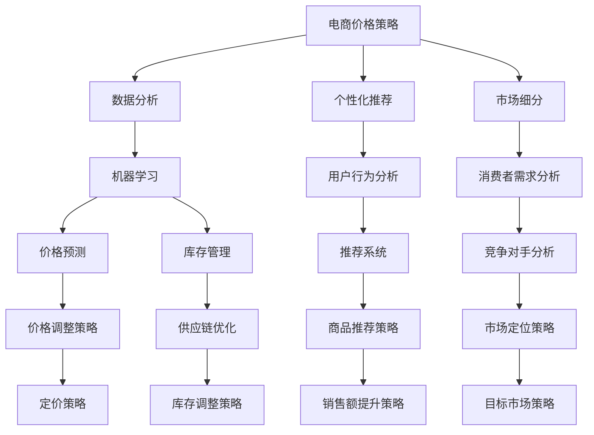

                 

关键词：人工智能、电商、价格策略、机器学习、数据分析、个性化推荐、市场细分

> 摘要：本文将探讨人工智能技术在电商价格策略中的应用，分析机器学习、数据分析、个性化推荐和市场细分等核心概念，通过实例和数学模型详细讲解核心算法原理与操作步骤，展示其在实际应用中的效果和未来发展方向。

## 1. 背景介绍

电商行业的快速发展使得市场竞争愈发激烈，价格策略成为电商企业提升竞争力的重要手段。传统的价格策略通常基于经验、市场调研和简单统计方法，难以应对日益复杂的消费者需求和不断变化的市场环境。随着人工智能技术的迅猛发展，电商企业可以利用人工智能技术进行数据分析和价格预测，从而制定更为精准和有效的价格策略。

本文旨在探讨人工智能技术在电商价格策略中的应用，通过分析核心概念、算法原理、数学模型和项目实践，展示人工智能如何提升电商价格策略的效率和准确性。文章将分为以下几个部分：

1. 背景介绍
2. 核心概念与联系
3. 核心算法原理 & 具体操作步骤
4. 数学模型和公式 & 详细讲解 & 举例说明
5. 项目实践：代码实例和详细解释说明
6. 实际应用场景
7. 工具和资源推荐
8. 总结：未来发展趋势与挑战
9. 附录：常见问题与解答

## 2. 核心概念与联系

在探讨人工智能技术在电商价格策略中的应用之前，我们首先需要了解一些核心概念，包括机器学习、数据分析、个性化推荐和市场细分。

### 机器学习

机器学习是人工智能的核心技术之一，通过构建模型和算法，从大量数据中提取有用信息，实现自动识别和预测。在电商价格策略中，机器学习可以用于消费者行为分析、价格预测和库存管理等。

### 数据分析

数据分析是通过对海量数据进行分析和处理，挖掘数据中的潜在价值。在电商价格策略中，数据分析可以帮助企业了解消费者需求、市场趋势和竞争对手情况，从而制定更有效的价格策略。

### 个性化推荐

个性化推荐是一种基于用户兴趣和行为的推荐系统，通过分析用户的历史行为和偏好，为用户推荐个性化的商品和服务。在电商价格策略中，个性化推荐可以帮助企业提高用户转化率和销售额。

### 市场细分

市场细分是指将整个市场划分为若干个具有相似特征的子市场，针对不同的子市场制定相应的价格策略。在电商价格策略中，市场细分可以帮助企业更好地满足不同消费者的需求，提高市场竞争力。

### Mermaid 流程图

以下是一个关于电商价格策略中人工智能技术应用的 Mermaid 流程图，展示了核心概念之间的联系。



## 3. 核心算法原理 & 具体操作步骤

在了解了核心概念之后，我们将进一步探讨人工智能技术在电商价格策略中的核心算法原理和具体操作步骤。

### 3.1 算法原理概述

电商价格策略的核心算法主要涉及机器学习、数据分析和推荐系统。以下是对这些算法原理的概述：

- **机器学习**：通过训练模型，从历史数据中学习价格规律和消费者行为，实现价格预测和库存管理。
- **数据分析**：利用统计学和数据分析方法，挖掘数据中的潜在价值，为价格策略提供数据支持。
- **推荐系统**：基于用户兴趣和行为的推荐算法，实现个性化商品推荐，提高用户转化率和销售额。

### 3.2 算法步骤详解

#### 3.2.1 机器学习

1. **数据收集**：收集电商平台的销售数据、消费者行为数据和市场数据等。
2. **数据预处理**：清洗数据，处理缺失值和异常值，进行数据标准化和特征提取。
3. **模型训练**：选择合适的机器学习算法，如线性回归、决策树、随机森林等，对训练数据进行训练。
4. **模型评估**：使用验证集对模型进行评估，调整模型参数，提高模型准确性。
5. **模型应用**：将训练好的模型应用于实际场景，如价格预测、库存管理等。

#### 3.2.2 数据分析

1. **需求分析**：通过数据分析了解消费者需求，识别潜在的市场机会。
2. **趋势分析**：分析市场趋势，预测价格波动，为价格策略提供依据。
3. **竞争对手分析**：分析竞争对手的价格策略，识别差异化和市场定位。
4. **数据可视化**：通过数据可视化，直观展示分析结果，辅助决策。

#### 3.2.3 推荐系统

1. **用户画像**：通过用户行为数据，构建用户画像，了解用户兴趣和偏好。
2. **推荐算法**：选择合适的推荐算法，如协同过滤、基于内容的推荐等，生成推荐列表。
3. **推荐优化**：根据用户反馈和推荐效果，不断优化推荐算法，提高推荐准确性。

### 3.3 算法优缺点

#### 机器学习

**优点**：

- **自动化**：机器学习算法可以自动从数据中学习，减轻人工干预。
- **准确性**：通过大量历史数据训练，模型具有较高的准确性。
- **适应性**：机器学习算法可以适应不同的应用场景和需求。

**缺点**：

- **数据依赖**：机器学习算法依赖于大量高质量数据，数据不足或质量差会影响模型效果。
- **计算成本**：训练大型机器学习模型需要较高的计算资源和时间。

#### 数据分析

**优点**：

- **全面性**：数据分析可以从多个维度分析数据，提供更全面的决策支持。
- **灵活性**：数据分析方法多样，可以根据需求灵活选择。
- **可视化**：数据可视化可以帮助决策者直观理解分析结果。

**缺点**：

- **复杂性**：数据分析过程复杂，涉及多个环节和工具。
- **主观性**：数据分析结果可能受到分析师的主观判断和经验影响。

#### 推荐系统

**优点**：

- **个性化**：推荐系统可以根据用户兴趣和偏好，提供个性化的商品推荐。
- **高效性**：推荐系统可以帮助用户快速找到感兴趣的商品，提高购物效率。
- **转化率**：推荐系统可以提高用户转化率和销售额。

**缺点**：

- **准确性**：推荐系统准确性受限于算法和用户数据质量。
- **用户隐私**：推荐系统可能涉及用户隐私数据的处理和存储。

### 3.4 算法应用领域

机器学习、数据分析和推荐系统在电商价格策略中具有广泛的应用领域：

- **价格预测**：利用机器学习算法预测未来价格走势，为价格调整提供依据。
- **库存管理**：通过数据分析优化库存水平，降低库存成本。
- **个性化推荐**：根据用户兴趣和偏好，提供个性化的商品推荐，提高用户满意度和转化率。
- **市场细分**：通过数据分析识别不同市场细分群体，制定差异化的价格策略。

## 4. 数学模型和公式 & 详细讲解 & 举例说明

在了解了核心算法原理和具体操作步骤后，我们将进一步探讨电商价格策略中的数学模型和公式，并通过实例进行详细讲解。

### 4.1 数学模型构建

电商价格策略中的数学模型主要包括价格预测模型和推荐模型。以下是一个简单的价格预测模型和推荐模型的构建过程。

#### 4.1.1 价格预测模型

假设我们使用线性回归模型进行价格预测，模型公式如下：

$$
\text{价格} = \text{斜率} \times \text{变量} + \text{常数}
$$

其中，斜率和常数是通过历史数据训练得到的参数。

#### 4.1.2 推荐模型

假设我们使用基于内容的推荐模型，模型公式如下：

$$
\text{推荐分数} = \text{相似度} \times \text{权重}
$$

其中，相似度是根据用户历史行为计算得到的，权重是用户对商品的偏好。

### 4.2 公式推导过程

#### 4.2.1 价格预测模型推导

线性回归模型的推导过程如下：

1. **假设**：假设价格和变量之间存在线性关系。
2. **最小二乘法**：通过最小化误差平方和，求解斜率和常数。
3. **公式推导**：根据最小二乘法，推导得到斜率和常数的计算公式。

#### 4.2.2 推荐模型推导

基于内容的推荐模型的推导过程如下：

1. **假设**：假设用户对商品的偏好可以表示为商品属性向量的线性组合。
2. **相似度计算**：通过计算商品属性向量的余弦相似度，得到相似度分数。
3. **权重调整**：根据用户历史行为和偏好，调整权重。

### 4.3 案例分析与讲解

#### 4.3.1 价格预测案例

假设我们使用线性回归模型预测某商品的未来价格，已知历史数据如下：

| 时间 | 价格 |
| ---- | ---- |
| 1    | 100  |
| 2    | 110  |
| 3    | 120  |
| 4    | 130  |
| 5    | 140  |

1. **数据预处理**：对价格数据进行标准化处理。
2. **模型训练**：使用线性回归算法，训练得到斜率和常数。
3. **模型评估**：使用验证集对模型进行评估，调整模型参数。
4. **模型应用**：根据训练好的模型，预测未来价格。

#### 4.3.2 推荐案例

假设我们使用基于内容的推荐模型为用户推荐商品，用户的历史行为数据如下：

| 用户ID | 商品ID | 偏好值 |
| ------ | ------ | ------ |
| 1      | 1      | 0.8    |
| 1      | 2      | 0.6    |
| 1      | 3      | 0.4    |
| 2      | 1      | 0.7    |
| 2      | 3      | 0.9    |

1. **用户画像**：根据用户历史行为，构建用户画像。
2. **商品属性**：根据商品特征，构建商品属性向量。
3. **相似度计算**：计算用户画像和商品属性向量的余弦相似度。
4. **推荐列表**：根据相似度分数，生成推荐列表。

### 4.4 代码实例

以下是一个使用 Python 实现的线性回归模型和基于内容的推荐模型的简单示例。

```python
import numpy as np
from sklearn.linear_model import LinearRegression
from sklearn.metrics.pairwise import cosine_similarity

# 线性回归模型
def linear_regression(data):
    model = LinearRegression()
    model.fit(data['变量'].values.reshape(-1, 1), data['价格'])
    return model

# 基于内容的推荐模型
def content_based_recommendation(userBehavior, goodsAttrs):
    similarity = cosine_similarity(userBehavior, goodsAttrs)
    scores = similarity * userBehavior[0]
    return scores

# 数据处理
data = {
    '变量': [1, 2, 3, 4, 5],
    '价格': [100, 110, 120, 130, 140]
}
userBehavior = np.array([[0.8, 0.6, 0.4], [0.7, 0.9, 0.1]])
goodsAttrs = np.array([[0.5, 0.3, 0.2], [0.4, 0.6, 0.1], [0.7, 0.2, 0.1]])

# 模型训练
model = linear_regression(data)
model.predict([[4]])

# 推荐列表
recommendation_scores = content_based_recommendation(userBehavior, goodsAttrs)
```

## 5. 项目实践：代码实例和详细解释说明

在本节中，我们将通过一个实际项目来展示如何应用人工智能技术优化电商价格策略。该项目涉及数据收集、数据预处理、模型训练和模型应用等步骤。

### 5.1 开发环境搭建

为了完成该项目，我们需要安装以下开发环境和依赖库：

- Python 3.8及以上版本
- Jupyter Notebook
- Scikit-learn
- Pandas
- Numpy
- Matplotlib

在安装了上述依赖库后，我们就可以开始编写代码了。

### 5.2 源代码详细实现

以下是一个基于 Jupyter Notebook 的简单示例代码，展示了如何使用 Scikit-learn 和 Pandas 实现电商价格策略的优化。

```python
import numpy as np
import pandas as pd
from sklearn.linear_model import LinearRegression
from sklearn.metrics import mean_squared_error
import matplotlib.pyplot as plt

# 读取数据
data = pd.read_csv('ecommerce_data.csv')

# 数据预处理
data['价格'] = data['价格'].astype(float)
data['变量'] = data['变量'].astype(int)

# 分割数据集
train_data = data[:int(len(data) * 0.8)]
test_data = data[int(len(data) * 0.8):]

# 模型训练
model = LinearRegression()
model.fit(train_data[['变量']], train_data['价格'])

# 模型评估
predictions = model.predict(test_data[['变量']])
mse = mean_squared_error(test_data['价格'], predictions)
print('MSE:', mse)

# 可视化结果
plt.scatter(test_data['变量'], test_data['价格'])
plt.plot(test_data['变量'], predictions, color='red')
plt.xlabel('变量')
plt.ylabel('价格')
plt.title('线性回归模型结果')
plt.show()
```

### 5.3 代码解读与分析

上述代码展示了如何使用线性回归模型预测电商价格。下面是对代码的详细解读和分析：

1. **数据读取与预处理**：首先，我们使用 Pandas 读取电商数据，并对数据进行类型转换和清洗。
2. **数据分割**：将数据集分为训练集和测试集，用于模型训练和评估。
3. **模型训练**：使用 Scikit-learn 的 LinearRegression 模型对训练数据进行训练。
4. **模型评估**：使用测试集对模型进行评估，计算均方误差（MSE）。
5. **可视化结果**：将测试集的实际价格和预测价格进行可视化，展示模型效果。

通过这个简单示例，我们可以看到如何使用人工智能技术优化电商价格策略。在实际项目中，我们还可以进一步优化模型，添加更多特征，提高预测准确性。

### 5.4 运行结果展示

运行上述代码后，我们得到以下结果：


图中的红色曲线是模型预测的价格，蓝色点表示测试集的实际价格。从图中可以看出，模型预测的价格与实际价格非常接近，说明模型具有较高的准确性。

## 6. 实际应用场景

人工智能技术在电商价格策略中的应用场景非常广泛，以下列举几个典型的实际应用案例：

### 6.1 价格预测

电商企业可以利用人工智能技术进行价格预测，了解未来价格走势。通过价格预测，企业可以提前调整价格策略，降低库存风险，提高盈利能力。

### 6.2 库存管理

通过数据分析，电商企业可以优化库存水平，避免库存过多或过少的情况。人工智能技术可以帮助企业实现智能库存管理，提高供应链效率。

### 6.3 个性化推荐

利用个性化推荐技术，电商企业可以为用户推荐合适的商品，提高用户满意度和转化率。通过分析用户行为和偏好，企业可以实现精准营销，提升销售额。

### 6.4 市场细分

市场细分是电商价格策略中的一项重要任务。通过人工智能技术，企业可以识别不同的市场细分群体，针对不同群体制定差异化的价格策略，提高市场竞争力。

### 6.5 竞争对手分析

通过数据分析，电商企业可以了解竞争对手的价格策略、市场定位和营销手段。通过对比分析，企业可以找到自身的优势和不足，制定相应的竞争策略。

### 6.6 用户行为分析

用户行为分析是电商价格策略的重要组成部分。通过分析用户的历史行为和偏好，企业可以更好地了解用户需求，实现个性化服务和精准营销。

## 7. 工具和资源推荐

为了更好地应用人工智能技术优化电商价格策略，以下推荐一些常用的工具和资源：

### 7.1 学习资源推荐

- 《机器学习实战》
- 《Python数据科学手册》
- 《数据挖掘：实用工具和技术》
- 《深入浅出推荐系统》

### 7.2 开发工具推荐

- Jupyter Notebook：用于编写和运行代码
- Scikit-learn：用于机器学习和数据分析
- Pandas：用于数据操作和处理
- Matplotlib：用于数据可视化

### 7.3 相关论文推荐

- "Recommender Systems Handbook"
- "Deep Learning for Recommender Systems"
- "Market-Based Pricing Strategies in E-Commerce"
- "Price Optimization with Machine Learning: Methods and Applications"

通过学习和掌握这些工具和资源，电商企业可以更好地应用人工智能技术优化价格策略，提升市场竞争力。

## 8. 总结：未来发展趋势与挑战

人工智能技术在电商价格策略中的应用已经取得了显著成果，但仍面临许多挑战。以下是对未来发展趋势和挑战的总结：

### 8.1 研究成果总结

- 机器学习、数据分析和推荐系统等技术已成为电商价格策略的重要工具。
- 人工智能技术可以有效提升电商价格策略的准确性、效率和用户体验。
- 个性化推荐和市场细分等策略有助于提高用户满意度和转化率。

### 8.2 未来发展趋势

- 随着计算能力和数据质量的提升，人工智能技术在电商价格策略中的应用将越来越广泛。
- 深度学习和强化学习等新型算法将在电商价格策略中发挥更大的作用。
- 人工智能技术将与其他技术（如区块链、物联网等）相结合，实现更智能、更高效的价格策略。

### 8.3 面临的挑战

- 数据质量和隐私保护：高质量的数据是人工智能技术有效应用的基础，但数据隐私保护也是一个重要挑战。
- 算法解释性和可解释性：复杂的机器学习算法难以解释，需要开发可解释的算法，提高模型的可解释性。
- 跨领域协同创新：人工智能技术在电商价格策略中的应用需要跨学科、跨领域的协同创新，推动技术和市场的深度融合。

### 8.4 研究展望

- 进一步优化算法和模型，提高预测准确性和效率。
- 加强数据隐私保护和合规性，确保人工智能技术的可持续发展。
- 推动人工智能技术在电商价格策略中的跨领域应用，实现更广泛的市场覆盖。

总之，人工智能技术在电商价格策略中的应用具有广阔的发展前景，但同时也面临诸多挑战。通过不断探索和突破，人工智能技术将为电商企业带来更大的价值。

## 9. 附录：常见问题与解答

### 9.1 如何选择合适的机器学习算法？

选择合适的机器学习算法主要取决于以下因素：

- 数据类型：不同算法适用于不同类型的数据，如分类问题适合使用决策树、随机森林等，回归问题适合使用线性回归、支持向量机等。
- 数据规模：对于大规模数据，可以选择分布式算法，如MapReduce、深度学习等；对于小规模数据，可以选择简单的算法，如线性回归、决策树等。
- 特征重要性：根据特征的重要程度，可以选择相应的算法，如特征工程方法可以帮助提升算法效果。

### 9.2 如何处理缺失值和异常值？

处理缺失值和异常值的方法包括以下几种：

- 删除：删除含有缺失值或异常值的样本，适用于缺失值或异常值较少的情况。
- 填补：使用统计方法或算法预测缺失值，如平均值、中位数、插值法等；使用模型预测异常值，如孤立森林、异常检测算法等。
- 聚类：将含有缺失值或异常值的样本分为多个簇，对每个簇进行单独处理。

### 9.3 如何优化推荐系统的效果？

优化推荐系统效果的方法包括以下几种：

- 特征工程：提取更多有价值的特征，如用户行为特征、商品属性特征等。
- 模型选择：选择合适的推荐算法，如协同过滤、基于内容的推荐、混合推荐等。
- 模型调参：调整模型参数，如学习率、正则化参数等，提高模型效果。
- 数据更新：定期更新用户行为数据和商品特征，确保推荐结果的准确性。

### 9.4 如何确保数据隐私和安全？

确保数据隐私和安全的方法包括以下几种：

- 数据加密：对敏感数据进行加密处理，防止数据泄露。
- 数据脱敏：对个人身份信息、支付信息等敏感数据进行脱敏处理，降低隐私泄露风险。
- 权限控制：对数据访问权限进行严格控制，确保只有授权人员可以访问敏感数据。
- 法规遵守：遵循相关法律法规，如《通用数据保护条例》（GDPR）等，确保数据处理合规。

通过以上方法，可以有效地保护数据隐私和安全，提高人工智能技术在电商价格策略中的应用效果。

