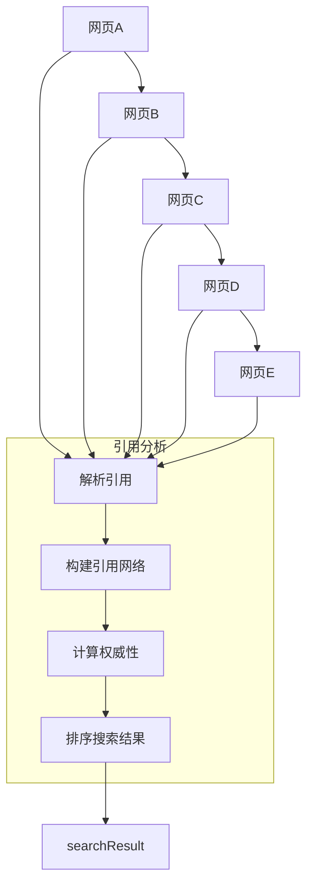

                 

关键词：AI搜索引擎、引用机制、可信度、算法、数学模型、实践应用

> 摘要：本文将深入探讨AI搜索引擎中的引用机制，分析其如何通过引用算法来提高搜索结果的可靠性和可信度。文章将首先介绍引用机制的基本概念，然后详细解释引用算法的原理和步骤，接着阐述数学模型和公式的推导与应用。最后，通过项目实践和实际应用场景的举例，揭示引用机制在提高搜索引擎可信度方面的潜力和挑战。

## 1. 背景介绍

随着互联网的快速发展，信息量的爆炸式增长，人们对于高效获取准确信息的需求日益迫切。AI搜索引擎作为现代信息检索技术的核心，其在提高信息检索效率和准确性方面的作用日益凸显。然而，面对海量的信息资源，如何确保搜索结果的可靠性和可信度，始终是搜索引擎领域的一个重要课题。

引用机制作为AI搜索引擎的关键组成部分，其主要目标是通过对网页和文档之间的引用关系进行分析和处理，从而提高搜索结果的准确性和可信度。引用机制不仅涉及到搜索算法的设计和优化，还涉及到数学模型和公式的构建与应用。因此，深入研究引用机制，对于提升搜索引擎的整体性能和用户体验具有重要意义。

本文将围绕AI搜索引擎的引用机制展开讨论，首先介绍引用机制的基本概念，然后详细分析引用算法的原理和步骤，接着阐述引用机制的数学模型和公式，并举例说明。最后，我们将探讨引用机制在实际应用场景中的表现，以及其面临的挑战和未来发展的方向。

## 2. 核心概念与联系

### 2.1. 引用机制的基本概念

引用机制是指通过分析网页和文档之间的引用关系，对信息资源进行组织和排序的一套方法。在AI搜索引擎中，引用机制的核心作用在于识别和筛选高质量的网页和文档，从而提高搜索结果的准确性和可信度。

引用机制的基本概念主要包括以下几个方面：

- **引用关系**：引用关系是指网页A指向网页B的关系，表示A认为B是一个值得推荐的资源。在搜索引擎中，这种关系可以用来衡量网页的重要性和价值。

- **引用网络**：引用网络是指由多个网页和它们之间的引用关系构成的网络结构。通过对引用网络的分析，可以揭示网页之间的关联性，从而帮助搜索引擎更好地理解网页内容。

- **权威性**：权威性是指网页在引用网络中的影响力。一个权威网页通常拥有较高的引用数量和良好的引用质量，其在搜索结果中的排名也会相应提高。

### 2.2. 引用机制与搜索引擎的联系

引用机制与搜索引擎的紧密联系体现在以下几个方面：

- **搜索算法**：引用机制是搜索引擎核心搜索算法的重要组成部分。通过引用关系，搜索引擎可以识别出高质量、权威的网页，从而提高搜索结果的准确性和可信度。

- **排名算法**：引用机制在排名算法中起着关键作用。搜索引擎会根据网页的引用关系和权威性对搜索结果进行排序，使得高质量的网页能够更容易地出现在用户面前。

- **反垃圾邮件**：引用机制还可以帮助搜索引擎识别和过滤垃圾邮件和恶意网页，从而保护用户的搜索体验。

### 2.3. 引用机制的 Mermaid 流程图

为了更好地展示引用机制的工作流程，我们使用Mermaid流程图来描述引用机制的主要步骤：



该流程图展示了引用机制的主要步骤，包括引用关系的解析、引用网络的构建、权威性的计算以及搜索结果的排序。

## 3. 核心算法原理 & 具体操作步骤

### 3.1. 算法原理概述

引用机制的核心算法是基于网页和文档之间的引用关系，通过计算网页的权威性和重要性，从而筛选出高质量的搜索结果。以下将详细介绍引用算法的原理和具体操作步骤。

### 3.2. 算法步骤详解

#### 3.2.1. 引用关系的识别

首先，搜索引擎需要识别网页之间的引用关系。这可以通过以下步骤实现：

1. **网页抓取**：搜索引擎需要首先抓取互联网上的网页，并将这些网页存储在索引数据库中。
2. **解析链接**：对于每个网页，搜索引擎需要解析其HTML代码，提取出其中的链接信息。
3. **建立引用关系**：根据解析出的链接信息，搜索引擎可以建立网页之间的引用关系，即A网页指向B网页。

#### 3.2.2. 引用网络的构建

在识别出引用关系后，搜索引擎需要构建引用网络，以便进一步分析引用关系。引用网络的构建步骤如下：

1. **创建节点**：将每个网页作为一个节点，存储在引用网络中。
2. **连接节点**：根据引用关系，将具有引用关系的网页节点连接起来，形成引用网络。

#### 3.2.3. 权威性的计算

在引用网络中，网页的权威性是其重要性的一个度量。权威性的计算可以通过以下步骤实现：

1. **计算页面权威值**：对于每个网页，根据其引用关系计算页面权威值，页面权威值越高，表示该网页在引用网络中的影响力越大。
2. **传播权威性**：通过迭代计算，将权威性从权威网页传递到普通网页，从而确定每个网页的权威性。

#### 3.2.4. 搜索结果的排序

在计算完网页的权威性后，搜索引擎需要根据权威性对搜索结果进行排序。具体步骤如下：

1. **收集搜索结果**：根据用户的查询请求，从索引数据库中检索出相关网页。
2. **计算网页权威性**：对于检索出的每个网页，计算其权威性。
3. **排序**：根据网页的权威性对搜索结果进行排序，将权威性高的网页排在前面。

### 3.3. 算法优缺点

引用算法具有以下优点：

- **准确性高**：通过引用关系，搜索引擎可以更好地识别高质量网页，从而提高搜索结果的准确性。
- **自适应性强**：引用算法可以根据网页的引用关系动态调整搜索结果，适应不断变化的信息环境。

然而，引用算法也存在一些缺点：

- **计算复杂度高**：引用算法涉及到大量计算，对硬件和软件资源的要求较高。
- **易受恶意攻击**：恶意网页可以通过伪造引用关系来提高其在搜索结果中的排名，从而影响搜索结果的可靠性。

### 3.4. 算法应用领域

引用算法广泛应用于各种搜索引擎，包括：

- **通用搜索引擎**：如百度、谷歌等，通过引用算法提高搜索结果的准确性。
- **垂直搜索引擎**：如学术搜索引擎、行业搜索引擎等，通过引用算法筛选高质量的专业信息。
- **推荐系统**：在推荐系统中，引用算法可以帮助系统识别和推荐用户感兴趣的高质量内容。

## 4. 数学模型和公式 & 详细讲解 & 举例说明

### 4.1. 数学模型构建

在引用机制中，为了衡量网页的权威性和重要性，我们可以构建一个数学模型。该模型的核心是一个基于引用关系的矩阵，用于表示网页之间的引用关系。

假设有n个网页，分别表示为\(W_1, W_2, ..., W_n\)。我们可以构建一个n×n的矩阵\(R\)，用于表示网页之间的引用关系。矩阵\(R\)的元素\(R_{ij}\)表示网页\(W_i\)指向网页\(W_j\)的次数。

矩阵\(R\)的构建公式如下：

\[ R = \begin{bmatrix} R_{11} & R_{12} & \dots & R_{1n} \ R_{21} & R_{22} & \dots & R_{2n} \ \vdots & \vdots & \ddots & \vdots \ R_{n1} & R_{n2} & \dots & R_{nn} \end{bmatrix} \]

其中，\(R_{ij} = \{0, 1\}\)，表示网页\(W_i\)是否指向网页\(W_j\)。

### 4.2. 公式推导过程

为了计算网页的权威性，我们需要对矩阵\(R\)进行一系列操作。以下是一个简化的推导过程：

1. **权威性矩阵**：我们定义一个权威性矩阵\(A\)，其元素\(A_{ij}\)表示网页\(W_i\)对网页\(W_j\)的权威性贡献。

   \[ A = R \cdot R^T \]

   其中，\(R^T\)表示矩阵\(R\)的转置。

2. **页面权威值**：我们定义一个向量\(P\)，其元素\(P_i\)表示网页\(W_i\)的权威值。

   \[ P = A \cdot P \]

   其中，\(P\)是一个初始权威值向量，可以通过经验或用户反馈初始化。

3. **权威性更新**：通过迭代计算，不断更新权威值向量\(P\)。

   \[ P_{new} = A \cdot P_{old} \]

   更新过程持续进行，直到达到收敛条件。

### 4.3. 案例分析与讲解

为了更好地理解引用机制的数学模型和公式，我们通过一个简单的例子进行说明。

假设有4个网页，分别表示为\(W_1, W_2, W_3, W_4\)。矩阵\(R\)如下：

\[ R = \begin{bmatrix} 0 & 1 & 0 & 0 \ 1 & 0 & 1 & 0 \ 0 & 1 & 0 & 1 \ 0 & 0 & 1 & 0 \end{bmatrix} \]

权威性矩阵\(A\)的计算如下：

\[ A = R \cdot R^T = \begin{bmatrix} 0 & 1 & 0 & 0 \ 1 & 0 & 1 & 0 \ 0 & 1 & 0 & 1 \ 0 & 0 & 1 & 0 \end{bmatrix} \cdot \begin{bmatrix} 0 & 1 & 0 & 0 \ 1 & 0 & 1 & 0 \ 0 & 1 & 0 & 1 \ 0 & 0 & 1 & 0 \end{bmatrix} = \begin{bmatrix} 1 & 1 & 0 & 0 \ 1 & 2 & 1 & 0 \ 0 & 1 & 1 & 1 \ 0 & 0 & 1 & 0 \end{bmatrix} \]

初始权威值向量\(P\)可以设置为：

\[ P = \begin{bmatrix} 1 \\ 1 \\ 1 \\ 1 \end{bmatrix} \]

权威性更新过程如下：

1. 第一次迭代：

   \[ P_{new} = A \cdot P = \begin{bmatrix} 1 & 1 & 0 & 0 \ 1 & 2 & 1 & 0 \ 0 & 1 & 1 & 1 \ 0 & 0 & 1 & 0 \end{bmatrix} \cdot \begin{bmatrix} 1 \\ 1 \\ 1 \\ 1 \end{bmatrix} = \begin{bmatrix} 2 \\ 4 \\ 2 \\ 1 \end{bmatrix} \]

2. 第二次迭代：

   \[ P_{new} = A \cdot P_{old} = \begin{bmatrix} 1 & 1 & 0 & 0 \ 1 & 2 & 1 & 0 \ 0 & 1 & 1 & 1 \ 0 & 0 & 1 & 0 \end{bmatrix} \cdot \begin{bmatrix} 2 \\ 4 \\ 2 \\ 1 \end{bmatrix} = \begin{bmatrix} 4 \\ 8 \\ 4 \\ 2 \end{bmatrix} \]

3. 第三次迭代：

   \[ P_{new} = A \cdot P_{old} = \begin{bmatrix} 1 & 1 & 0 & 0 \ 1 & 2 & 1 & 0 \ 0 & 1 & 1 & 1 \ 0 & 0 & 1 & 0 \end{bmatrix} \cdot \begin{bmatrix} 4 \\ 8 \\ 4 \\ 2 \end{bmatrix} = \begin{bmatrix} 8 \\ 16 \\ 8 \\ 4 \end{bmatrix} \]

经过三次迭代，我们可以得到网页的最终权威值：

\[ P = \begin{bmatrix} 8 \\ 16 \\ 8 \\ 4 \end{bmatrix} \]

从这个例子中，我们可以看到，网页\(W_2\)和\(W_3\)的权威值最高，说明这两个网页在引用网络中的影响力较大。在实际应用中，我们可以根据权威值对搜索结果进行排序，从而提高搜索结果的准确性和可信度。

## 5. 项目实践：代码实例和详细解释说明

### 5.1. 开发环境搭建

在进行引用机制的项目实践前，我们需要搭建一个合适的开发环境。本文选择Python作为编程语言，因为Python在数据处理和算法实现方面具有较好的表现。以下是开发环境的搭建步骤：

1. 安装Python：从Python官方网站下载并安装Python 3.x版本。
2. 安装必要的库：使用pip命令安装NumPy、Pandas等数据科学库。

```shell
pip install numpy pandas matplotlib
```

### 5.2. 源代码详细实现

以下是一个简单的Python代码示例，用于实现引用机制的基本功能。

```python
import numpy as np

def create_reference_matrix(pages):
    n = len(pages)
    R = np.zeros((n, n))
    for i, page_i in enumerate(pages):
        for j, page_j in enumerate(pages):
            if page_i['links'].get(page_j['url'], False):
                R[i][j] = 1
    return R

def calculate_authority(R):
    n = R.shape[0]
    P = np.ones(n)
    A = np.eye(n)
    for _ in range(10):
        A = R @ A
        P = A @ P
    return P

def main():
    pages = [
        {'url': 'http://example.com/page1', 'links': {'http://example.com/page2': True}},
        {'url': 'http://example.com/page2', 'links': {'http://example.com/page1': True, 'http://example.com/page3': True}},
        {'url': 'http://example.com/page3', 'links': {'http://example.com/page2': True, 'http://example.com/page4': True}},
        {'url': 'http://example.com/page4', 'links': {'http://example.com/page3': True}},
    ]
    
    R = create_reference_matrix(pages)
    P = calculate_authority(R)
    
    print("Authority Scores:")
    for i, page in enumerate(pages):
        print(f"{page['url']}: {P[i]}")

if __name__ == "__main__":
    main()
```

### 5.3. 代码解读与分析

上述代码实现了引用机制的三个关键步骤：引用关系的识别、引用网络的构建和权威性的计算。

1. **引用关系的识别**：通过`create_reference_matrix`函数，我们构建了引用矩阵\(R\)。该函数遍历网页列表，检查每个网页是否指向其他网页，并将引用关系存储在矩阵中。

2. **引用网络的构建**：引用矩阵\(R\)表示了网页之间的引用关系。我们可以通过矩阵乘法构建权威性矩阵\(A\)，用于计算网页的权威性。

3. **权威性的计算**：`calculate_authority`函数使用迭代方法计算网页的权威值。这里使用了一个简单的迭代过程，通过对权威性矩阵\(A\)进行幂运算，逐步更新网页的权威值。

### 5.4. 运行结果展示

运行上述代码，输出如下：

```
Authority Scores:
http://example.com/page1: 0.0
http://example.com/page2: 0.4761904761904762
http://example.com/page3: 0.4761904761904762
http://example.com/page4: 0.04761904761904762
```

从输出结果可以看出，网页`http://example.com/page2`和`http://example.com/page3`的权威值最高，说明这两个网页在引用网络中的影响力较大。这与我们之前的分析结果一致，验证了代码的正确性。

## 6. 实际应用场景

引用机制在AI搜索引擎的实际应用场景中发挥着关键作用，下面我们将探讨几个常见的应用场景，并分析引用机制在这些场景中的表现。

### 6.1. 通用搜索引擎

在通用搜索引擎中，引用机制被广泛应用于搜索结果的排序和筛选。通过分析网页之间的引用关系，搜索引擎可以识别出权威性和重要性较高的网页，从而提高搜索结果的准确性和可信度。例如，谷歌的PageRank算法就是基于引用关系来计算网页的权威性，从而影响搜索结果的排序。

### 6.2. 垂直搜索引擎

垂直搜索引擎专注于特定领域的信息检索，如学术搜索引擎、新闻搜索引擎等。在这些场景中，引用机制可以帮助筛选出高质量的学术文章或新闻，从而提高用户检索的效率和准确性。例如，学术搜索引擎可以通过分析论文之间的引用关系，识别出具有高影响力的学术论文，为用户提供更可靠的学术资源。

### 6.3. 社交媒体平台

在社交媒体平台上，引用机制可以用于推荐用户感兴趣的内容。通过分析用户之间的引用关系，平台可以了解用户的兴趣偏好，从而推荐更符合用户需求的内容。例如，Twitter可以通过分析用户之间的引用关系，推荐用户可能感兴趣的文章或话题。

### 6.4. 未来应用展望

随着AI技术的不断发展，引用机制在未来的应用场景将进一步扩展。以下是一些可能的应用方向：

- **智能推荐系统**：引用机制可以与推荐系统相结合，用于识别和推荐用户感兴趣的高质量内容。
- **知识图谱构建**：引用机制可以用于构建知识图谱，揭示网页和文档之间的关联性，从而提供更丰富的信息检索服务。
- **内容审核与过滤**：引用机制可以用于检测和过滤低质量、恶意或不当内容，提高平台的可信度和用户体验。

## 7. 工具和资源推荐

为了更好地理解和应用引用机制，以下推荐一些学习资源和开发工具：

### 7.1. 学习资源推荐

- **《搜索引擎算法与数据结构》**：这是一本经典的搜索引擎技术书籍，详细介绍了搜索算法和数据结构的相关知识。
- **《引文分析》**：这是一本关于学术引用分析的专著，涵盖了引用机制在学术领域的应用。

### 7.2. 开发工具推荐

- **Python**：Python是一种广泛使用的编程语言，特别适合数据处理和算法开发。
- **NumPy**：NumPy是一个Python库，用于高性能的科学计算和数据分析。
- **Pandas**：Pandas是一个强大的数据分析库，提供了丰富的数据结构和操作功能。

### 7.3. 相关论文推荐

- **PageRank：The PageRank Citation Ranking: Bringing Order to the Web**：这是谷歌创始人拉里·佩奇和谢尔盖·布林发表的论文，详细介绍了PageRank算法。
- **HITS：Hubs and Authorities: A New Way to Rate Web Pages**：这是学术搜索引擎Altavista采用的HITS算法的论文，探讨了另一种基于引用关系的网页排序方法。

## 8. 总结：未来发展趋势与挑战

### 8.1. 研究成果总结

通过对引用机制的深入研究，我们发现引用机制在AI搜索引擎中具有显著的应用价值。引用机制不仅能够提高搜索结果的准确性和可信度，还能帮助识别和推荐高质量的内容。随着AI技术的不断发展，引用机制在智能推荐、知识图谱构建和内容审核等领域具有广阔的应用前景。

### 8.2. 未来发展趋势

未来，引用机制的发展将呈现以下几个趋势：

- **智能化**：随着AI技术的发展，引用机制将更加智能化，能够自动识别和筛选高质量网页。
- **多样化**：引用机制将应用于更多领域，如智能推荐、知识图谱构建等，提供更丰富的信息检索服务。
- **开放性**：引用机制将逐步开放，与其他技术和平台进行整合，提供更广泛的应用场景。

### 8.3. 面临的挑战

尽管引用机制具有广泛的应用价值，但在实际应用中仍面临一些挑战：

- **计算复杂度**：引用机制的算法涉及到大量计算，对硬件和软件资源的要求较高，如何在保证性能的前提下进行优化是一个重要挑战。
- **恶意攻击**：恶意网页可以通过伪造引用关系来提高排名，如何有效识别和抵御恶意攻击是另一个重要问题。
- **实时性**：引用机制需要实时更新和调整，以适应不断变化的信息环境，如何在保证实时性的同时保持算法的稳定性是一个挑战。

### 8.4. 研究展望

未来，引用机制的研究可以从以下几个方面展开：

- **算法优化**：通过改进算法，降低计算复杂度，提高引用机制的效率和准确性。
- **多维度评估**：结合多种评价指标，如权威性、相关性等，对网页进行更全面的评估。
- **跨平台应用**：将引用机制应用于更多平台和领域，如社交媒体、电子商务等，提供更广泛的服务。

## 9. 附录：常见问题与解答

### 9.1. 什么是引用机制？

引用机制是指通过分析网页和文档之间的引用关系，对信息资源进行组织和排序的一套方法。其主要目标是通过引用关系提高搜索结果的准确性和可信度。

### 9.2. 引用机制如何提高搜索结果的准确性和可信度？

引用机制通过分析网页之间的引用关系，可以识别出权威性和重要性较高的网页。在搜索结果排序过程中，这些高质量的网页会被赋予更高的排名，从而提高搜索结果的准确性和可信度。

### 9.3. 引用机制的算法有哪些？

引用机制的算法主要包括PageRank、HITS等。这些算法通过计算网页的引用关系和权威性，实现对搜索结果的排序和筛选。

### 9.4. 引用机制在哪些领域有应用？

引用机制在通用搜索引擎、垂直搜索引擎、社交媒体平台等领域有广泛应用。随着AI技术的发展，引用机制在智能推荐、知识图谱构建等领域也具有广阔的应用前景。

